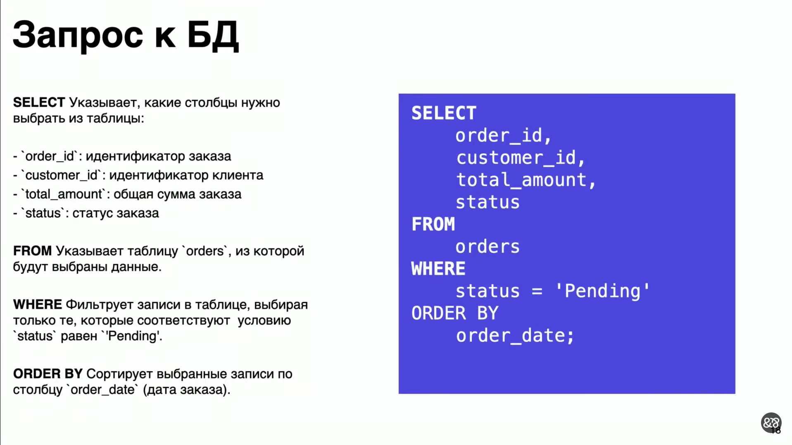

# Базы данных
## Обзор СУБД
Какие бывают базы данных?
* Key-value
* Документоориентированные
* Реляционные
### Key-value

### Документоориентированные

### Реляционные СУБД
Обычно используется SQL язык

### Кейс "Наш Маркет"
Будем использовать [PostgreSQL](https://ru.wikipedia.org/wiki/PostgreSQL) (потому что самая популярная БД в яшке)

**Первый инструмет**

**Второй инструмент**

## Индексы
*Как работает поиск по индексу?*

**Первая задача**

Что же здесь может пойти не так?

340ms - долго
Seq Scan - это просто последовательный поиск

Таким образом, сложностть поиска в такой таблице - $O(N)$

Что же сделать? Можно применить индексы:

order_id является первичным ключом, и по умолчанию БД сразу строим по нему индекс, потому что по первичному ключу всегда ищутся записи. Но точно так же мы можем построить индекс по любому другому полю и искать по нему

Но есть ограничения: если для нашей таблицы создадим индекс по хеш таблице, то система выделит всего 5 статусов, и для каждого статуса будет список из большого количества записей, поэтому польза от такого индекса будет небольшая

**Задача 2:**

Можно построить полнотекстовый индекс: для этого надо векторизовать данные для построения полнотекстового индекса

**Задача 3:**

Кластерные индексы - это те индексы, которые располагаются непосредственно с самими данными (как правило, это primary key)
Некластерные индексы - это те индексы, которые могут находиться отдельно
Индексы помогают контролировать уникальность: к примеру, primary key уникален
Как правило, вычисляемые индексы используются в постгресе при поиске подстрок. Есть MySQL и PostgreSQL: одно из главных отличий между ними - это то, что поиск по подстроке в MySQL регистронезависимый, а PostgreSQL поиск регистрозависимый (и чтобы сделать поиск регистронезависимым, нужно применить функции преобразования значения в верхний/нижний регистр)

## Материализованные представления
**Задача 4:**

Как можно улучшить этот запрос? Мы можем избавиться от Seq Scan, добавив индекс

Но запрос все равно остается тяжелым

Как можно еще ускорить? Мы можем создать материализованное представление, в котором система будет хранить уже рассчитанное значение, и таким образом скорость работы нашего приложения вырастет

Мы не будем больше рассчитывать min и max, и периодически будем обновлять это значение

Один из подводных камней - это вынесение бизнес логики. Очень редко, когда реализовывается бизнес логика на уровне БД, стараются все делать в коде. Но иногда мы можем создать миграцию, которая облегчит жизнь нашим пользователям, и они будут получать более достоверную информацию быстрее

Помимо материализованных представлений, которые хранятся на диске, есть еще и временные представления, которые хранятся в памяти, и их можно использовать при формировании сложных запросов
## Транзакции
*Что такое транзакция? Когда теряются данные?*

Когда разработчик начинает разбираться, что же такое транзакция, как они используются и какие есть нюансы? Прежде всего когда начинаются какие-то проблемы. До этого момента мы могли использовать планировщик запросов и все понятно: мы строим план запросов, он показывает, как выполнился запрос: по индексу/не по индексу, скорость выполнения и т.д.. Но периодически начинают возникать проблемы: например, когда происходят двойные списания или двойные начисления, и начинает разрушаться баланс

Видим Seq Scan, т.е. запрос работает долго. Что это значит? Когда к нам приходит много пользователей, у нас может возникнуть некоторая гонка между исполнением этих запросов. Соответственно, 26ms это долго. Ускорим его:

Ускоряем запрос, добавляем индексы, получаем прирост производительности в 130 раз, но все равно проблема сохраняется, но стала гораздо реже

Почему у нас могут происходить двойные списания?

Любой запрос - это транзакция, некоторая операция, которая выполняется в БД.

Для того, чтобы всем этим управлять, в БД есть различные уровни изоляции

*Опечатка: Serializable - последовательное чтение*

Мы можем управлять уровнями изоляций транзакций для того, чтобы решить проблему гонок между различными транзакциями
С помощью уровней изоляции мы можем решить проблему списаний/проблему начислений, система будет гарантировать, что никаких пересекающихся событий и изменений не произошло

## Блокировки
Но пользователи могут выполнять действия в системе, а получат информацию о том, что что-то пошло не так

Для этого нам поможет механизм блокировок

Как можно решить Deadlock? Нужно ввести некоторые правила:
* Захват ресурсов следует делать в каком-то порядке: сортировка по ключам (если мы захватываем данные в одной и той же таблице), либо если мы работаем с разными таблицами, то нужно захватывать ресурсы в этих таблицах по алфавиту (есть customers и orders, сначала захватываем customers, затем orders)

Для того, чтобы сделать списание чуть лучше, мы можем перед изменением записи добавить ключ FOR UPDATE

## Денормализация
*Зачем нужна денормализация?*

Нормализация - это очень важный процесс проектирования БД, но иногда (редко, но встречается) создать повторяющиеся записи, в одной ячейке хранить несколько записей, для того, чтобы связанные данные хранить как можно ближе, и тем самым ускорить выполнение запросов

Один из вариантов решения проблемы: создать доп. таблицу, в которой будут храниться денормализованные данные, либо эти данные хранить рядом с теми записями, которые мы регулярно используем

Какой плюс хранения отдельно? Как правило, денормализованные данные имеют либо временное назначение (например, для отгрузки хранить эти значения, мы отгрузили эти товары, и эти денормализованные данные нам не нужны), либо мы можем для историчности хранить данные рядом (например, у нас есть имя покупателя - Денис, и мы можем указать, что имя покупателя было Денис. Таким образом, у нас таблица заказов будет очень большой, но при этом, если покупатель переименуется, в таблице заказов будет явно написано, что в этот момент покупатель назывался Денис. Таким образом, сохраним историчность)

## Масштаб-ирование
### Вертикальное масштабирование
Если наша система медленно работает, не справляется с нагрузкой, то дайте побольше памяти, и помощнее процессоры, и диски побыстрее 
### Репликация
Когда эти самые простые инструменты исчерпаны, мы можем начать применять другие подходы, например **репликацию**
Когда у нас уже большой проект, мы понимаем, как он используется, что у нас большое количество запросов на чтение, меньшее количество запросов на запись, много пользователей
 

Разделим операции на чтение и на запись

Разделение можно сделать на уровне приложения: добавим слой пул коннекторов, которые будут работать либо с репликами, либо с мастером
PostgreSQL использует репликацию, и все изменения в мастере он умеет синхронно и асинхронно доставлять до реплик
Что означает синхронно и асинхронно?
Синхронно означает, что при доставке данных PostgreSQL ожидает, что реплика пришлет подтверждение, что она получила данные, и в этот момент процесс доставки данных завершен, и он отправляет следующий порцию данных
Асинхронно означает, что он отправляет данные и не ждет, когда она вернется обратно
Таким образом, при использовании конфигураций синхронных и асинхронных реплик, у нас могут возникнуть данные из будущего, когда мы поместили какие-то изменения в мастер: они долетели до асинхронной реплики, а в синхронную реплику они еще не записались, и при выполнении запроса мы можем получить данные из будущего, которые еще до конца не долетели, но мы их уже начали в репликах использовать.

### Шардирование
Что делать, если и репликация нам не помогает? Допустим, у нас очень много данных
Используем шардирование запросов: у нас есть большая таблица, и мы можем подумать, как разделить ее на маленькие части
Например у нас есть таблица заказов, и мы можем разделить ее на части по периодам заказов. Таким образом, у нас эти шарды будут иметь меньшее значение
Можно применять другую стратегию: если у нас есть первичный ключ, мы можем придумать некоторую функцию, которая нам будет делить этот ключ, например, по остатку: если возьмем число 10, то по остатку 0..9 мы сможем выделить отдельные шарды и на этих шардах хранить данные вот по такой хитрой схеме.
Для чего нужны шарды и почему они влияют на скорость выполнения запросов? Когда мы разделяем одну большую таблицу на много маленьких таблиц, мы ускоряем работу этих таблиц

Можем комбинировать разные подходы:

## Отказоустойчивость

Чем плох этот подход? Если у нас всего 1 реплика и 1 мастер, то у нас в 2 раза больше запросов станет в мастер, и скорее всего тоже начнет отказывать. Поэтому при наличие реплик лучше делать количество реплик хотя бы 2, а лучше больше

## Безопасность
После всего этого нам нужно убедиться, что система безопасна

# Работа с БД из приложения и миграции
