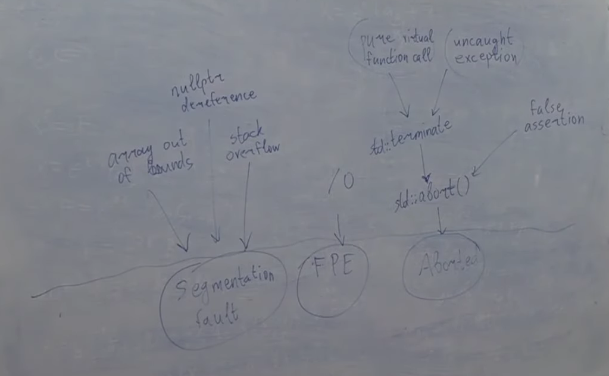

# Обработка исключений. Идиома RAII. Исключения в конструкторах
Есть три основные низкоуровневые причины, почему программы падают:
1) Segmentation fault
2) Floating point exception
3) Aborted

Или если нажали Ctrl+C, или Ctrl+D, и куча других случаев

    #include <iostream>

    struct A{
        A() { std::cout << "A\n"; }
        A(const A&) { std::cout << "copy\n"; }
        ~A() { std::cout << "~A\n"; }
    }; 

    void f(int x){
        A a;
        if (x == 0){
            throw a;
        }
    }

    int main(){
        try{
            f(0);
        } catch (...){
            std::cout << "caught!\n";
        }
    }
Вывод:

    A
    copy
    ~A
    caught!
    ~A
Создается копия, потому что нам надо этот объект со стека снять, он локальный, и мы его решили бросить. А вот этот объект, который мы бросаем, он хранится не на стэке. Компилятору нужно создать в runtime в памяти область под этот объект, в динамической памяти. Когда мы бросаем, мы копируем на самом деле. Когда мы говорим throw, в этот момент в динамическую память мы кладем этот объект новый, а старый мы снимаем со стека и выходим из функции, затем приходим в catch и когда он заканчивает работу, мы уничтожаем этот объект из динамической памяти

    int main(){
        try{
            f(0);
        } catch (A a){ // updated
            std::cout << "caught!\n";
        }
    }
Но если мы напишем уже так, то нам еще раз пришлось бы его скопировать, т.к. если мы ловим по значению, то это значит, что из динамической памяти мы еще обратно его копируем на стек
Вывод

    A
    copy
    ~A
    copy
    caught!
    ~A
    ~A
Но если бы поймали по ссылке, то второго копирования бы уже не было, и мы бы имели дело прям с объектом из динамической памяти

    #include <iostream>

    struct A{
        A() { std::cout << "A\n"; }
        A(const A&) { std::cout << "copy\n"; }
        ~A() { std::cout << "~A\n"; }
    }; 

    void f(int x){
        A a;
        std::cout << &a << '\n';
        if (x == 0){
            throw a;
        }
    }

    int main(){
        try{
            f(0);
        } catch (A& a){ // updated
            std::cout << "caught!" << &a << '\n';
        }
    }
Вывод

    A
    0x7ffdfdf33e57
    copy
    ~A
    caught!0x56044e050740
    ~A
Вообще, компилятор не обязательно прям в динамическую память положил, это не документировано стандартом, где именно компилятор хранит, может он заранее при запуске программы зарезервировал место для того, чтобы бросить это исключение, и таким образом его сразу туда положить. Так что мб и статическая память, а не динамическая, но в любом случае не на стэке
Вообще бросание исключений очень дорогая штука, пожалуй, самое дорогое, что бывает: в сотни раз дороже, чем вызов виртуальных функций и в разы дороже, чем просто обращение к динамической памяти.
## Bad alloc
    #include <iostream>

    int main(){
        try{
            new int[400'000'000'000];
        } catch (std::bad_alloc& ex){
            std::cout << &ex << '\n';
        }
    }
Если оператор new отказал в выделении динамической памяти и кинул bad_alloc, то где будет храниться bad_alloc?
Вывод:

    0x55daa06ee330
Что выдал [godbolt](https://godbolt.org/) при компиляции "x86-64 gcc 14.1"

    main:
            push    rbp
            mov     rbp, rsp
            push    rbx
            sub     rsp, 24
            movabs  rax, 1600000000000
            mov     rdi, rax
            call    operator new
    .L5:
            mov     eax, 0
            jmp     .L9
            cmp     rdx, 1
            je      .L4
            mov     rdi, rax
            call    _Unwind_Resume
    .L4:
            mov     rdi, rax
            call    __cxa_begin_catch
            mov     QWORD PTR [rbp-24], rax
            mov     rax, QWORD PTR [rbp-24]
            mov     rsi, rax
            mov     edi, OFFSET FLAT:std::cout
            call    std::basic_ostream<char, std::char_traits<char> >::operator<<(void const*)
            mov     esi, 10
            mov     rdi, rax
            call    std::basic_ostream<char, std::char_traits<char> >& std::operator<< <std::char_traits<char> >(std::basic_ostream<char, std::char_traits<char> >&, char)
            call    __cxa_end_catch
            jmp     .L5
            mov     rbx, rax
            call    __cxa_end_catch
            mov     rax, rbx
            mov     rdi, rax
            call    _Unwind_Resume
    .L9:
            mov     rbx, QWORD PTR [rbp-8]
            leave
            ret
На самом деле, компилятор вынужден резервировать под bad_alloc память заранее, на случай если полетит bad_alloc, у компилятора есть место в статической памяти. Если new кинул исключение, в статической памяти на этот случай заранее зарезервировано место, куда положить bad_alloc, потому что не просить же new снова (это называется emergency buffer)
## throw внутри catch
На самом деле, из блока catch мы снова можем сделать throw, причем мы можем сделать throw без указания аргумента, а можем сделать throw "что-нибудь"

    int main(){
        try{
            f(0);
        } catch (A& a){
            std::cout << "caught!" << &a << '\n';
            throw a;
            //throw;
        }
    }
**throw a** - означает, что мы хотим еще раз скопировать *a* и создать новое вместо него
Разница между **throw** и **throw "какой-то объект"** в catch в том, что когда мы пишем throw без аргументов, мы пускаем дальше лететь то, что уже летело, а если пишем throw "что-то", то тот объект, который летел, хранился как исключение, он уничтожается, а вместо него создается новый.

    int main(){
        try{
            try{
                f(0);
            } catch (A& a){
                std::cout << "caught!" << &a << '\n';
                throw;
            }
        } catch (A& a){
            std::cout << "caught again!" << &a << '\n';
        }
    }
Вывод:

    A
    0x7ffda960f9f7
    copy
    ~A
    caught!0x55d9cd247740
    caught again!0x55d9cd247740
    ~A

Но если мы напишем throw a

    int main(){
        try{
            try{
                f(0);
            } catch (A& a){
                std::cout << "caught!" << &a << '\n';
                throw a; // updated
            }
        } catch (A& a){
            std::cout << "caught again!" << &a << '\n';
        }
    }
Вывод:

    A
    0x7ffff07cc387
    copy
    ~A
    caught!0x55a475ec8740
    copy
    ~A
    caught again!0x55a475ec87d0
    ~A
То все было бы интереснее: мы его поймали, когда написали **throw a** оно снова скопировалось, предыдущее уничтожилось, потом мы поймали уже новое, и адрес у него уже другой, и уничтожилось новое

Дополнение: если мы сделали throw изнутри catch, если у нас в этом же блоке try catch были другие catch, они уже проигнорируются. Действуют catch только уровнем выше.

Вдобавок к этому:

    int main(){
        f(0);
    }
Вывод:

    A
    0x7ffe17f7ec07
    copy
    terminate called after throwing an instance of 'A'
    Aborted
Это UB. Если исключение не ловится, то компилятор ничего не гарантирует, кроме того, что мы упадем с вызывом функции terminate. Но относительно того, что он вызовет какие-то деструкторы, он уже гарантий не дает