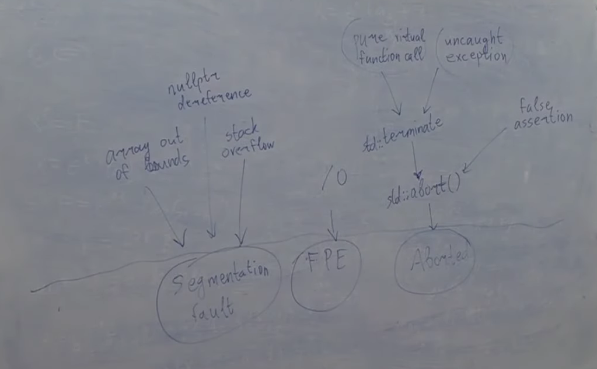

**Обработка исключений. Идиома RAII. Исключения в конструкторах**
# Обработка исключений
Есть три основные низкоуровневые причины, почему программы падают:
1) Segmentation fault
2) Floating point exception
3) Aborted

Или если нажали Ctrl+C, или Ctrl+D, и куча других случаев

    #include <iostream>

    struct A{
        A() { std::cout << "A\n"; }
        A(const A&) { std::cout << "copy\n"; }
        ~A() { std::cout << "~A\n"; }
    }; 

    void f(int x){
        A a;
        if (x == 0){
            throw a;
        }
    }

    int main(){
        try{
            f(0);
        } catch (...){
            std::cout << "caught!\n";
        }
    }
Вывод:

    A
    copy
    ~A
    caught!
    ~A
Создается копия, потому что нам надо этот объект со стека снять, он локальный, и мы его решили бросить. А вот этот объект, который мы бросаем, он хранится не на стэке. Компилятору нужно создать в runtime в памяти область под этот объект, в динамической памяти. Когда мы бросаем, мы копируем на самом деле. Когда мы говорим throw, в этот момент в динамическую память мы кладем этот объект новый, а старый мы снимаем со стека и выходим из функции, затем приходим в catch и когда он заканчивает работу, мы уничтожаем этот объект из динамической памяти

    int main(){
        try{
            f(0);
        } catch (A a){ // updated
            std::cout << "caught!\n";
        }
    }
Но если мы напишем уже так, то нам еще раз пришлось бы его скопировать, т.к. если мы ловим по значению, то это значит, что из динамической памяти мы еще обратно его копируем на стек
Вывод

    A
    copy
    ~A
    copy
    caught!
    ~A
    ~A
Но если бы поймали по ссылке, то второго копирования бы уже не было, и мы бы имели дело прям с объектом из динамической памяти

    #include <iostream>

    struct A{
        A() { std::cout << "A\n"; }
        A(const A&) { std::cout << "copy\n"; }
        ~A() { std::cout << "~A\n"; }
    }; 

    void f(int x){
        A a;
        std::cout << &a << '\n';
        if (x == 0){
            throw a;
        }
    }

    int main(){
        try{
            f(0);
        } catch (A& a){ // updated
            std::cout << "caught!" << &a << '\n';
        }
    }
Вывод

    A
    0x7ffdfdf33e57
    copy
    ~A
    caught!0x56044e050740
    ~A
Вообще, компилятор не обязательно прям в динамическую память положил, это не документировано стандартом, где именно компилятор хранит, может он заранее при запуске программы зарезервировал место для того, чтобы бросить это исключение, и таким образом его сразу туда положить. Так что мб и статическая память, а не динамическая, но в любом случае не на стэке
Вообще бросание исключений очень дорогая штука, пожалуй, самое дорогое, что бывает: в сотни раз дороже, чем вызов виртуальных функций и в разы дороже, чем просто обращение к динамической памяти.
## Bad alloc
    #include <iostream>

    int main(){
        try{
            new int[400'000'000'000];
        } catch (std::bad_alloc& ex){
            std::cout << &ex << '\n';
        }
    }
Если оператор new отказал в выделении динамической памяти и кинул bad_alloc, то где будет храниться bad_alloc?
Вывод:

    0x55daa06ee330
Что выдал [godbolt](https://godbolt.org/) при компиляции "x86-64 gcc 14.1"

    main:
            push    rbp
            mov     rbp, rsp
            push    rbx
            sub     rsp, 24
            movabs  rax, 1600000000000
            mov     rdi, rax
            call    operator new
    .L5:
            mov     eax, 0
            jmp     .L9
            cmp     rdx, 1
            je      .L4
            mov     rdi, rax
            call    _Unwind_Resume
    .L4:
            mov     rdi, rax
            call    __cxa_begin_catch
            mov     QWORD PTR [rbp-24], rax
            mov     rax, QWORD PTR [rbp-24]
            mov     rsi, rax
            mov     edi, OFFSET FLAT:std::cout
            call    std::basic_ostream<char, std::char_traits<char> >::operator<<(void const*)
            mov     esi, 10
            mov     rdi, rax
            call    std::basic_ostream<char, std::char_traits<char> >& std::operator<< <std::char_traits<char> >(std::basic_ostream<char, std::char_traits<char> >&, char)
            call    __cxa_end_catch
            jmp     .L5
            mov     rbx, rax
            call    __cxa_end_catch
            mov     rax, rbx
            mov     rdi, rax
            call    _Unwind_Resume
    .L9:
            mov     rbx, QWORD PTR [rbp-8]
            leave
            ret
На самом деле, компилятор вынужден резервировать под bad_alloc память заранее, на случай если полетит bad_alloc, у компилятора есть место в статической памяти. Если new кинул исключение, в статической памяти на этот случай заранее зарезервировано место, куда положить bad_alloc, потому что не просить же new снова (это называется emergency buffer)
## throw внутри catch
На самом деле, из блока catch мы снова можем сделать throw, причем мы можем сделать throw без указания аргумента, а можем сделать throw "что-нибудь"

    int main(){
        try{
            f(0);
        } catch (A& a){
            std::cout << "caught!" << &a << '\n';
            throw a;
            //throw;
        }
    }
**throw a** - означает, что мы хотим еще раз скопировать *a* и создать новое вместо него
Разница между **throw** и **throw "какой-то объект"** в catch в том, что когда мы пишем throw без аргументов, мы пускаем дальше лететь то, что уже летело, а если пишем throw "что-то", то тот объект, который летел, хранился как исключение, он уничтожается, а вместо него создается новый.

    int main(){
        try{
            try{
                f(0);
            } catch (A& a){
                std::cout << "caught!" << &a << '\n';
                throw;
            }
        } catch (A& a){
            std::cout << "caught again!" << &a << '\n';
        }
    }
Вывод:

    A
    0x7ffda960f9f7
    copy
    ~A
    caught!0x55d9cd247740
    caught again!0x55d9cd247740
    ~A

Но если мы напишем throw a

    int main(){
        try{
            try{
                f(0);
            } catch (A& a){
                std::cout << "caught!" << &a << '\n';
                throw a; // updated
            }
        } catch (A& a){
            std::cout << "caught again!" << &a << '\n';
        }
    }
Вывод:

    A
    0x7ffff07cc387
    copy
    ~A
    caught!0x55a475ec8740
    copy
    ~A
    caught again!0x55a475ec87d0
    ~A
То все было бы интереснее: мы его поймали, когда написали **throw a** оно снова скопировалось, предыдущее уничтожилось, потом мы поймали уже новое, и адрес у него уже другой, и уничтожилось новое

Дополнение: если мы сделали throw изнутри catch, если у нас в этом же блоке try catch были другие catch, они уже проигнорируются. Действуют catch только уровнем выше.

Вдобавок к этому:

    int main(){
        f(0);
    }
Вывод:

    A
    0x7ffe17f7ec07
    copy
    terminate called after throwing an instance of 'A'
    Aborted
Это UB. Если исключение не ловится, то компилятор ничего не гарантирует, кроме того, что мы упадем с вызывом функции terminate. Но относительно того, что он вызовет какие-то деструкторы, он уже гарантий не дает.
Мы можем вместо '\n' написать в выводе std::endl, чтобы убедиться, что мы убедились, что std::cout выведет в консоль, и только после этого terminate делается
## Multiple catch
У нас есть код

    #include <iostream>

    int main(){
        try{
            throw 1;
        } catch (double d){
            std::cout << "double";
        } catch (long long l){
            std::cout << "long long";
        } catch (...){
            std::cout << "other";
        }
    }
Вывод

    other
Но если мы напишем:

    #include <iostream>

    int main(){
        try{
            throw 1;
        } catch (double d){
            std::cout << "double";
        } catch (long long l){
            std::cout << "long long";
        }
    }
Вывод:

    terminate called after throwing an instance of 'int'
    Aborted
В первом примере выведется other не потому, что он больше всего подходит, а потому что он единственный, кто подходит. Когда делается catch, у нас не применяются правила перегрузки, и не делается выбор, какая конверсия лучше. Просто: либо вы поймали в точности такой тип, какой бросили, либо нет. Он смотрит catch подряд и как только находит подходящий, он его выбирает.
Но из этого правила есть два исключения: конверсия в const все-таки проделываются, т.е. если мы бросили неконстантную, а поймали по константной ссылке, это можно. А еще можно ловить по ссылке на родителя то, что было брошено как наследник, иначе мы бы не могли по ссылке на std::exception поймать частный случай exception. И по значению можно. Т.е. если мы бросили наследника Derived, то по ссылке на Base мы его поймаем. Но если мы даже бросили int, то unsigned int мы уже не поймаем
Код:

    #include <iostream>

    struct Mom {};
    struct Son : Mom {};

    int main(){
        try{
            Son s;
            throw s;
        } catch (Mom){
            std::cout << "caught Mom";
        } catch (Son){
            std::cout << "caught Son";
        } catch (...){
            std::cout << "other";
        }
    }

Компилятор пишет:

    multiple_catch.cpp: In function ‘int main()’:
    multiple_catch.cpp:13:7: warning: exception of type ‘Son’ will be caught by earlier handler [-Wexceptions]
    13 |     } catch (Son){
        |       ^~~~~
    multiple_catch.cpp:11:7: note: for type ‘Mom’
    11 |     } catch (Mom){
        |       ^~~~~
Вывод:

    caught Mom
Но! Если мы напишем так:

    #include <iostream>

    struct Mom {};
    struct Son : private Mom {}; // updated

    int main(){
        try{
            Son s;
            throw s;
        } catch (Mom){
            std::cout << "caught Mom";
        } catch (Son){
            std::cout << "caught Son";
        } catch (...){
            std::cout << "other";
        }
    }
Вывод:

    caught Son
И warning исчез. Т.е. из main мы никак не можем использовать тот факт, что сын наследник мамы, стало быть теперь catch mom на сына не работает
А если напишем так:

    struct Mom {};
    struct Son : private Mom {
        friend int main();
    };
То все равно выведется:

    caught Son

**Теперь другой пример:**

    #include <iostream>

    struct Granny {};
    struct Dad: Granny {};
    struct Mom: Granny {};
    struct Son: Mom, Dad {};

    int main(){
        try{
            Son s;
            throw s;
        } catch (Granny){
            std::cout << "caught Granny";
        } catch (Son){
            std::cout << "caught Son";
        } catch (...){
            std::cout << "other";
        }
    }
Вывод:
    
    caught Son
Даже если напишем так:

    struct Granny {};
    struct Dad: Granny {};
    struct Mom: private Granny {};
    struct Son: private Mom, Dad {};
То все равно выведется:

    caught Son
И напоследок:

    #include <iostream>

    struct Granny {};
    struct Dad: virtual Granny {};
    struct Mom: virtual Granny {};
    struct Son: Mom, Dad {};

    int main(){
        try{
            Son s;
            throw s;
        } catch (Granny){
            std::cout << "caught Granny";
        } catch (Son){
            std::cout << "caught Son";
        } catch (...){
            std::cout << "other";
        }
    }
Компилятор поругается:

    multiple_catch.cpp: In function ‘int main()’:
    multiple_catch.cpp:15:7: warning: exception of type ‘Son’ will be caught by earlier handler [-Wexceptions]
    15 |     } catch (Son){
        |       ^~~~~
    multiple_catch.cpp:13:7: note: for type ‘Granny’
    13 |     } catch (Granny){
        |       ^~~~~
И выведется:

    caught Granny

# Идиома RAII
**Resource Acquisition Is Initialization (RAII)** - это программная идиома, смысл которой заключается в том, что с помощью тех или иных программных механизмов получение некоторого ресурса неразрывно совмещается с инициализацией, а освобождение — с уничтожением объекта.

Допустим, есть код

    #include <iostream>

    void g(int y){
        if (y == 0){
            throw 1;
        }
    }

    void f(int x){
        int* p = new int(x);
        g(*p);
        delete p;
    }

    int main(){
        f(5);
    }
Понятно, что это игрушечный пример, но это такой рафинированный пример глобальной проблемы, которая на самом деле не выдуманная и очень реальная, и очень актуальная, часто встречающаяся. Вот мы в какой-то функции выделяем какой-то ресурс: например, динамическую память или открываем файлы, и что-то начинаем делать. А что если, между тем как мы сделали new и сделали delete кто-то из тех, кого мы вызывали в промежутке, кинул исключение? Никто delete за нас не вызовет. Как вариант: не использовать исключение. Есть мнение, что исключения лучше не использовать вообще. Но есть мнение, что эту проблему можно решить, используя ООП. Проблема в чем: мы захватили какой-то ресурс new, потом делаем какие-то действия сложные, и в конце делаем delete, но вот эти действия сложные могут бросить exception. Естественно, мы не хотим писать каждый раз try catch. Можно сделать обертку:

    struct SmartPtr{
        int* p;
        SmartPtr(int* p): p(p) {}
        ~SmartPtr() { delete p; }
        int& operator*(){
            return *p;
        }
    };
Но появляется другая проблема: что, если мы хотим этот указатель куда-то отдать?

    #include <iostream>

    struct SmartPtr{
        int* p;
        SmartPtr(int* p): p(p) {}
        ~SmartPtr() { delete p; }
        int& operator*(){
            return *p;
        }
    };

    void g(SmartPtr p){
        if (*p == 0){
            throw 1;
        }
    }

    void f(int x){
        SmartPtr p(new int(x));
        g(p);
    }

    int main(){
        f(5);
    }
Все грохнется, потому что у нас copy конструктор автоматически сгенерировался, а деструктор каждый делает delete одного и того же поинтера. Такой smartptr нельзя копировать

    template <typename T>
    struct unique_ptr{
        T* p;
        unique_ptr(T* p): p(p) {}
        unique_ptr(const unique_ptr&) = delete;
        unique_ptr& operator=(const unique_ptr&) = delete;
        ~unique_ptr() { delete p; }
        T& operator*(){
            return *p;
        }
    };
Идейная реализация unique_ptr
RAII применимо не только к поинтерам, например еще для открытия файла например. Вот есть у нас std::fstream, std::ifstream, std::ofstream, это класс, который работать с файлами. Он внутри себя в конструкторе вызывает open(), а в деструкторе close()
# Исключения в конструкторах и деструкторах
## Исключения в конструкторах
Есть код:

    #include <iostream>

    struct A{
        A() {std::cout << "A"; }
        ~A() {std::cout << "~A"; }
    };

    struct S{
        A a;
        S(int x){
            std::cout << "S";
            if (x == 0) throw 1;
        }
        ~S(){
            std::cout << "~S";
        }
    };

    int main(){
        try{
            S s(0);
        } catch (...){
            
        }
    }
Вывод:

    AS~A
Все потому что у нас не создался S до конца, а значит его деструктор не должен вызываться, но А успело создаться, поэтому оно должно быть уничтожено
Но вот так:

    struct A{
        A() {std::cout << "A"; }
        ~A() {std::cout << "~A"; }
    };

    struct S{
        A* a;
        S(int x) : a(new A()){
            std::cout << "S";
            if (x == 0) throw 1;
        }
        ~S(){
            std::cout << "~S";
            delete a;
        }
    };
будет утечка памяти, никто не сделает delete
Если у нас поля - это ресурсы, которые мы захватываем, то их тоже надо оборачивать в RAII. Если вдруг у нас по какой-то причине конструктор не доработает до конца, то по крайней мере деструкторы полей вызовутся.

**Другой случай**: теперь у нас исключение вылетает в списке инициализации S

    #include <iostream>

    struct A{
        A(int x) {
            std::cout << "A";
            if (x == 0) throw 1;
        }
        ~A() {
            std::cout << "~A";
        }
    };

    struct S{
        A a;
        A aa;
        A aaa;
        S(int x) : a(1), aa(0), aaa(2) {
            std::cout << "S";
        }
        ~S(){
            std::cout << "~S";
        }
    };

    int main(){
        try{
            S s(0);
        } catch (...){

        }
    }
Вывод:

    AA~A
Вызовутся деструкторы всех тех полей, которые успели создаться уже к этому моменту. Как нам на уровне конструктора S обработать это? Мы хотим уметь писать try для списка инициализации. Такая возможность называется **[function try block](https://web.archive.org/web/20240106111948/https://en.cppreference.com/w/cpp/language/function-try-block)**
*[Почему-то на cppreference страница пустая](https://en.cppreference.com/w/cpp/language/function-try-block)*

    #include <iostream>

    struct A{
        A(int x) {
            std::cout << "A";
            if (x == 0) throw 1;
        }
        ~A() {
            std::cout << "~A";
        }
    };

    struct S{
        A a;
        A aa;
        A aaa;
        S(int x) try : a(1), aa(0), aaa(2) {
            std::cout << "S";
        } catch (...){
            std::cout << "caught!";
        }
        ~S(){
            std::cout << "~S";
        }
    };

    int main(){
       try{
            S s(0);
        } catch (...){

        }
    }
Вывод:

    AA~Acaught!
А если в main напишем вот так:

    int main(){
        S s(0);
    }
Правило следующее: если мы написали такой function try block в конструкторе, то автоматически делается throw из него
Вывод:

    terminate called after throwing an instance of 'int'
    Aborted
На cppreference написано:
*Before any catch clauses of a function-try-block on a constructor are entered, all fully-constructed members and bases have already been destroyed.
If the function-try-block is on a delegating constructor, which called a non-delegating constructor that completed successfully, but then the body of the delegating constructor throws, the destructor of this object will be completed before any catch clauses of the function-try-block are entered.
Before any catch clauses of a function-try-block on a destructor are entered, all bases and non-variant members have already been destroyed.
The behavior is undefined if the catch-clause of a function-try-block used on a constructor or a destructor accesses a base or a non-static member of the object.
Every catch-clause in the function-try-block for a constructor must terminate by throwing an exception. If the control reaches the end of such handler, the current exception is automatically rethrown as if by throw;. The return statement is not allowed in any catch clause of a constructor's function-try-block.*

На самом деле, эта конструкция позволяет нам писать try после любой функции:

    void f() try{

    } catch (...){

    }
## Исключения с деструкторах
Исключения в дестркуторах - это зло, даже большее, чем в конструкторах
Что, если исключение вылетело из деструктора? Проблема исключений в деструкторах в том, что деструктор сам по себе мог быть вызван сам по себе мог быть вызван по причине того, что было брошено исключение, и вот тогда это кранты. Т.е. если деструктор вызван в штатной ситуации, когда мы выходем из какого-то блока кода, это ладно. Но если мы находимся в деструкторе, и бросаем исключение из деструктора, но сам деструктор был вызван по причине того, что уже летело исключение, то тогда стандарт говорит, что в этой ситуации вызывается std::terminate с формулировкой "брошено исключение из деструктора". До c++11 нельзя было бросать исключение из деструктора, если деструктор был вызван по причине летящего исключения. Начиная с c++11 просто нельзя бросать исключение из деструктора (с некоторой оговоркой, есть волшебное слово **noexcept(false)**, которое разрешает это делать)
Вот такой код:

    #include <iostream>

    struct A{
        A(int) {
            std::cout << "A";
        }
        ~A() {
            std::cout << "~A";
        }
    };

    struct S{
        S(int x) {
            std::cout << "S";
        }
        ~S(){
            std::cout << "~S";
            throw 1;
        }
    };

    int main(){
        try{
            S s(0);
        } catch(...){

        }
    }
Компилятор дает предупреждение:

    exceptions_in_constructors.cpp: In destructor ‘S::~S()’:
    exceptions_in_constructors.cpp:18:9: warning: ‘throw’ will always call ‘terminate’ [-Wterminate]
    18 |         throw 1;
        |         ^~~~~~~
    exceptions_in_constructors.cpp:18:9: note: in C++11 destructors default to ‘noexcept’
А в выводе имеем:

    terminate called after throwing an instance of 'int'
    Aborted
Но! С волшебным словом **noexcept(false)**:

    #include <iostream>

    struct A{
        A(int) {
            std::cout << "A";
        }
        ~A() {
            std::cout << "~A";
        }
    };

    struct S{
        S(int x) {
            std::cout << "S";
        }
        ~S() noexcept(false) { // updated
            std::cout << "~S";
            throw 1;
        }
    };

    int main(){
        try{
            S s(0);
        } catch(...){

        }
    }
Компилятор перестает ругаться, а в выводе имеем:

    S~S
Но в такой ситуации:

    int main(){
        try{
            S s(0);
            throw 1;
        } catch(...){

        }
    }
Будет вызван terminate

    terminate called after throwing an instance of 'int'
    Aborted

Тем не менее, мы вот находимся в деструкторе, и нам хочется бросить исключение, но мы не уверены, а вдруг уже летит исключение? Мы хотим проверить, находимся ли мы сейчас в ситуации, когда летит исключение. Есть простой советский метод, как проверить в данный момент runtime, летит ли исключение, нужно всего лишь... написать **[std::uncaught_exception()](https://en.cppreference.com/w/cpp/error/uncaught_exception)**. Она возвращает bool: true, если летит исключение, иначе false
Начиная с c++17 эта функция устарела, ее заменила функция **[std::uncaught_exceptions()](https://en.cppreference.com/w/cpp/error/uncaught_exception)**
Зачем нужна функция std::uncaught_exceptions()? В C++ возможна ситуация, когда одновременно летит несколько exceptions. Например, мы в деструкторе написали try, внутри которого вызвали другую функцию, которая бросила исключение
# Exception safety
## Что это?
Когда у нас разрешены исключения, нам нужно иметь ввиду, что каждая функция, которую мы реализовываем, может случайно выскочить из своего выполнения не когда return написан, а в случайный момент вызова чего-нибудь. Например, пишем какой-нибудь шаблонный класс над типом T, а тип T, вообще говоря, может кидать исключение. Мы пишем какой-нибудь метод и обращаемся к чему-то у T. Нам нужно понимать, что всякий раз, когда мы к чему-нибудь такому обращаемся, мы можем случайно выйти из своей функции с exception

[Exception safety](https://en.cppreference.com/w/cpp/language/exceptions):
After the error condition is reported by a function, additional guarantees may be provided with regards to the state of the program. The following four levels of exception guarantee are generally recognized[4][5][6], which are strict supersets of each other:
1) Nothrow (or nofail) exception guarantee — the function never throws exceptions. Nothrow (errors are reported by other means or concealed) is expected of destructors and other functions that may be called during stack unwinding. The destructors are noexcept by default.(since C++11) Nofail (the function always succeeds) is expected of swaps, move constructors, and other functions used by those that provide strong exception guarantee.
2) Strong exception guarantee — If the function throws an exception, the state of the program is rolled back to the state just before the function call (for example, std::vector::push_back).
3) Basic exception guarantee — If the function throws an exception, the program is in a valid state. No resources are leaked, and all objects' invariants are intact.
4) No exception guarantee — If the function throws an exception, the program may not be in a valid state: resource leaks, memory corruption, or other invariant-destroying errors may have occurred.

Generic components may, in addition, offer exception-neutral guarantee: if an exception is thrown from a template parameter (e.g. from the Compare function object of std::sort or from the constructor of T in std::make_shared), it is propagated, unchanged, to the caller.

[Например, std::vector<T, Allocator>::push_back](https://en.cppreference.com/w/cpp/container/vector/push_back) дает strong exception guarantee

## Noexcept
До C++11 можно было написать:

    void f() throw {}
и список типов, которые он умеет бросать. Но это настолько бесполезная и вредная возможность, что ее быстренько отменили, потому что поняли, что от нее никакой пользы, оно только ухудшает, оно все равно ни от чего не обезопасит

Если мы пишем noexcept, то мы обещаем, что мы не будем бросать исключения из своей функции. Мы можем бросать исключения, находясь в ней, но обязаны поймать его на этом же уровне. В частности, мы можем написать:

    void f() noexcept try{

    } catch (...){

    }
Что же произойдет, если из noexcept функции все же будет брошено исключение? Будет terminate, но не CE. Хотя это можно ловить в compile-time, но коммитет по стандартизации посчитал, что это перебор

Бывает еще условный noexcept

    template <typename T>
    void f() noexcept(std::is_reference_v<T>){

    }
Здесь мы говорим: если тип T является ссылкой, то мы обещаем, что эта функция будет noexcept, а иначе не обещаем. Это должно быть compile-time проверяемым условием. Но чаще всего мы хотим поставить noexcept в зависимости от того, является ли кто-то другой noexcept
    
    #include <iostream>

    template <typename T>
    void g() {}

    int main(){
        std::cout << noexcept(g<int>());
    }
Вывод:

    0
Это оператор, который не вычисляет заданное выражение (как sizeof), просто говорит true или false в зависимости от того, что под ним. Как он понимает, выражение под ним noexcept или нет? Если выражение под ним это вызов функции, то просто он проверяет вызов функции помечен noexcept или нет. А если выражение под ним состоит из выводов каких-то стандартных операторов, то noexcept являются все операторы, кроме [new](https://en.cppreference.com/w/cpp/language/new), [dynamic_cast](https://en.cppreference.com/w/cpp/language/dynamic_cast), [type_id](https://en.cppreference.com/w/cpp/language/typeid), [throw](https://en.cppreference.com/w/cpp/language/throw). Таким образом, мы в compile-time можем про произвольное выражение выяснить, оно noexcept или нет, т.е. содержит ли оно noexcept вызовы функций или стандартных операторов

А теперь мы можем поставить noexcept в зависимости от условия, была ли noexcept функция g

    template <typename T>
    void g() {}

    template <typename T>
    void f() noexcept(noexcept(g<T>())){
    }
И теперь эта функция noexcept тогда и только тогда, когда вызов g с таким шаблонным параметром был noexcept
## Дополнение
[У нас есть оператор [] у vector](https://en.cppreference.com/w/cpp/container/vector/operator_at). Метод At() кидает исключение, если мы выходим за границы. А operator[] noexcept, но он исключений не кидает. Почему? На самом деле, семантика слова noexcept не совсем в том, что мы обещаем не кидать исключений. noexcept помечаются функции, в которых в принципе не может пойти неудачи. Когда мы пишем noexcept или когда видим noexcept, то мы должны понимать это так, что ничего плохого не может произойти от вызова этого метода
Вдобавок к этому, все [деструкторы](https://en.cppreference.com/w/cpp/container/vector/~vector) являются noexcept, но этого слова не написано, потому что в деструкторе noexcept по умолчанию начиная с c++11.