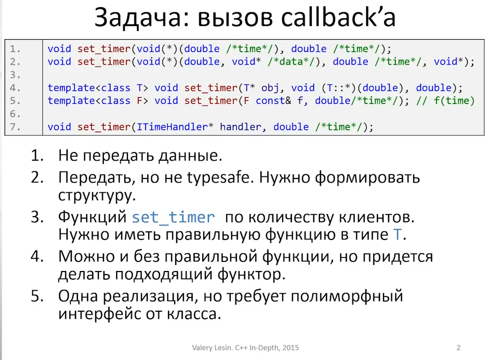
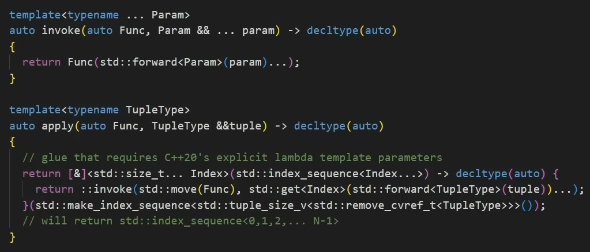

# [Лекция 4. bind & function](https://www.youtube.com/watch?v=cIRLcN5MNUg)
### Computer Science Center

- задача


- [std::bind](https://en.cppreference.com/w/cpp/utility/functional/bind)

Функция, которая создаёт биндер. Идея: bind делает класс, куда кладёт в качестве полей передаваемые аргументы, держит их у себя и имеет operator(). На момент вызова он подставляет эти поля.
```cpp
using namespace std::placeholders; // для _1, _2, ...
```

- по умолчанию аргументы копируются. как этого избежать?\
[std::ref, std::cref](https://en.cppreference.com/w/cpp/utility/functional/ref)

Классы, которые принимают ссылку, внутри хранят указатель на объект и имеют опреатор приведения к нужной ссылке.

- bind с функторами

[std::unary_function](https://en.cppreference.com/w/cpp/utility/functional/unary_function) (deprecated in C++11, removed in C++17)

- bind с методами классов

В строчках 11-12 bind валидный до тех пор, пока существует объект obj. В 13 строке объект скопируется - всё ок. В 14 увеличится счётчик shared_ptr - тоже всё ок.

- вложенность\
плейсхолдеры сквозные

[boost::apply](https://www.boost.org/doc/libs/1_54_0/boost/bind/apply.hpp) - хотим сделать в качестве плейсхолдера не параметр, а саму функцию

вот как это работает на самом деле
```cpp
#include <iostream>

#include <boost/bind/apply.hpp>
#include <boost/bind/bind.hpp>

using namespace boost::placeholders;

int bar2(int x, int answer) {
    return x + answer;
}

int main() {
    auto binder = boost::bind(boost::apply<int>(), _1, _2, 42);
    // _1 для передаваемой функции 
    std::cout << binder(bar2, 1);
}
```
со стандартной библиотекой такое не получится, [std::apply](https://en.cppreference.com/w/cpp/utility/apply) работает не так

- [std::function](https://en.cppreference.com/w/cpp/utility/functional/function) - универсальный способ завернуть любой callable объект с заданным прототипом

Типы могут не совпадать. Можно вызывать function с аргументами, которые приводимы к тому, что передано в качестве параметра шаблона. А они потом будут приводиться к тому, чем инициализирован function (то есть сама функция)

```cpp
void foo(unsigned int a, double b) {
    std::cout << a + b << "\n";
}

int main() {
    std::function<void(int, double)> f = foo;
    f(4.5, 5);
    // double -> int -> unsigned int
    // int -> double -> double
}
```

В function можно завернуть обычную функцию, member функцию класса, функтор (`operator()`), лямбду, bind. И это будет не шаблонный объект.

- bind + function


- быстродействие

В function работает `small object optimization`. Внутри делает вызов виртуальной функции


# [C++ Weekly - Ep 15 Using `std::bind`](https://www.youtube.com/watch?v=JtUZmkvroKg)
`std::bind` пришел из boost и был задизайнен до C++11, т.е. до появления variadic templates и auto. До него были [std::bind1st, std::bind2nd](https://en.cppreference.com/w/cpp/utility/functional/bind12) (deprecated in C++11, removed in C++17).

Поэтому `std::bind` может принимать большее число аргументов, чем принимает сама функция. `std::function` же ожидает, что параметры будут точно совпадать.

```cpp
#include <functional>
#include <iostream>

template <typename T>
void print(T i, const std::string& s) {
    std::cout << i << " " << s << "\n";
}

int main() {
    int i = 5;
    const auto f = std::bind(&print<int>, std::placeholders::_2, std::placeholders::_1);

    f("hello", i, 4, 5); // OK
    i = 6;
    f("world", i);

    std::function<void (const std::string&, int)> f2(f);
    f2("test", i, 4, 5); // CE
}
```

# [C++ Weekly - Ep 16 Avoiding `std::bind`](https://www.youtube.com/watch?v=ZlHi8txU4aQ)

В C++11 появились лямбда функции, в C++14 появилась возможность делать generic лямбды (с auto в качестве параметра). Поэтому можно делать аналогичную вещь.

Лямбда даёт больше возможностей и имеет лучшую производительность. 

```cpp
#include <iostream>

template <typename T>
void print(T i, const std::string& s) {
    std::cout << i << " " << s << "\n";
}

int main() {
    int i = 5;
    const auto f = [] (auto&& arg1, auto&& arg2) {
        print(std::forward<decltype(arg2)>(arg2), std::forward<decltype(arg1)>(arg1));
    };

    f("hello", i);
    i = 6;
    f("world", i);
}
```
В C++20 появился синтаксис с ключевым словом template - классический вариант точно того же.

```cpp
#include <iostream>

template <typename T>
void print(T i, const std::string& s) {
    std::cout << i << " " << s << "\n";
}

int main() {
    int i = 5;
    const auto f = []<typename T, typename U>(T&& arg1, U&& arg2) {
        print(std::forward<U>(arg2), std::forward<T>(arg1));
    };

    f("hello", i);
    i = 6;
    f("world", i);
}
```
Более того, начиная с С++20, этот синтаксис синхронизирован и с обычными функциями, в списках параметров которых тоже можно использовать auto. Использование auto в списке параметров функции (не важно, обычной или лямбды) - это ни что иное, как сокращенный (abbreviated) синтаксис объявления шаблона.

# [C++ Weekly - Ep 37 - Stateful Lambdas](https://www.youtube.com/watch?v=_1X9D8Z5huA)
- Как работают лямбды?

Захватываем по значению
```cpp
int main() {
    int i = 1;
    auto l = [i] { return i; };
    std::cout << l() << "\n";
}
```
по ссылке
```cpp
int main() {
    int i = 1;
    auto l = [&i] { return ++i; };
    std::cout << l() << "\n";
}
```
если хотим менять копию
```cpp
int main() {
    int i = 1;
    auto l = [i] () mutable { return ++i; };
    std::cout << l() << "\n";
}
```
C++14 позволяет инициализировать переменные непосредственно в лямбда-интродукторе - stateful lambda. Пример - считаем количество запусков
```cpp
int main() {
    auto l = [i = 0] () mutable { return ++i; };
    std::cout << l() << "\n"; // 1
    std::cout << l() << "\n"; // 2
    std::cout << l() << "\n"; // 3
}
```
Не каждую stateful лямбду можно копировать. Пример с unique_ptr
```cpp
int main() {
    auto l = [p = std::make_unique<int>(0)] () mutable { return ++(*p); };
    std::cout << l() << "\n";
    std::cout << l() << "\n";
    std::cout << l() << "\n";

    auto l2 = l; // CE
}
```

# [C++ Weekly - Ep 454 - std::apply vs std::invoke (and how they work!)  constexpr Lambda Support](https://www.youtube.com/watch?v=DxFpQa1PyaA)
- [std::invoke](https://en.cppreference.com/w/cpp/utility/functional/invoke) - позволяет вызывать любой callable объект с набором параметров\
`callable, list of parameters, ...`
```cpp
int add(int lhs, int rhs) {
    return lhs + rhs;
}

int main() {
    std::cout << std::invoke(add, 1, 2); // 3
}
```
лямбда
```cpp
int main() {
    std::cout << std::invoke([](int x, int y) { return x * y; }, 3, 4);
}
```
member функция
```cpp
struct S {
    int lhs;
    int add(int rhs) {
        return lhs + rhs;
    }
};

int main() {
    S s(42);
    std::cout << std::invoke(&S::add, s, 1); // 43
}
```

- [std::apply](https://en.cppreference.com/w/cpp/utility/apply) - такая же идея, но работает с tuple интерфейсом (get)
`callable, tuple of parameters, ...`
```cpp
struct S {
    int lhs;
    int add(int rhs) {
        return lhs + rhs;
    }
};

int main() {
    S s(42);
    std::tuple params = {&s, 2};
    std::cout << std::apply(&S::add, params);
}
```
аналогично
```cpp
int main() {
    std::cout << std::apply([](int x, int y) { return x - y; }, std::tuple{5, 4});
}
```
Имеет смысл, если параметры были уже даны в виде `std::tuple`, например как результат `std::map`

- как такие вещи примерно могли бы выглядеть

хыхы пон
