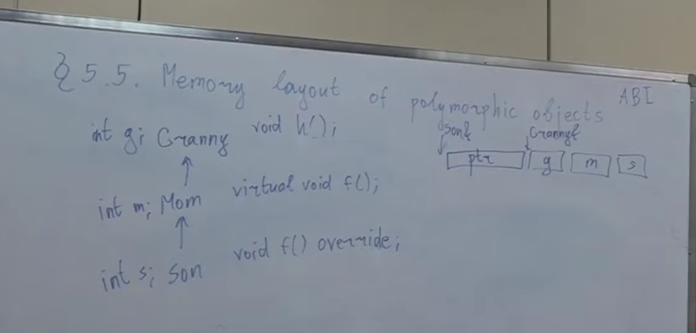
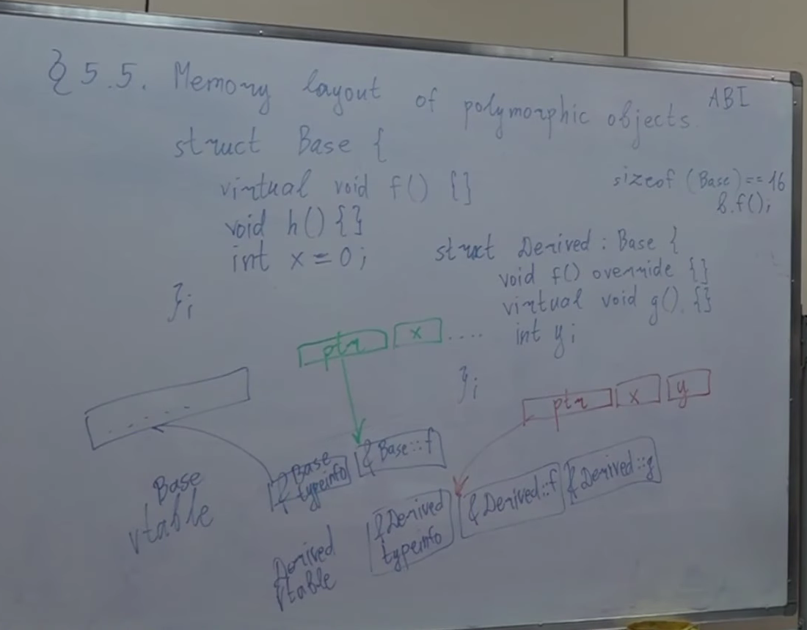
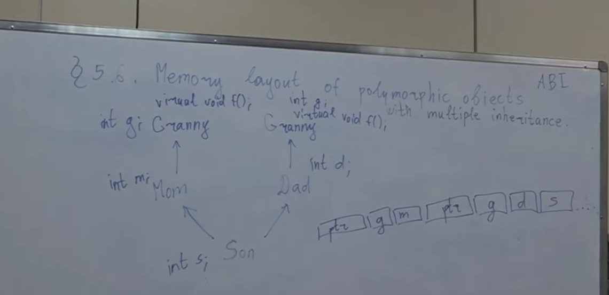
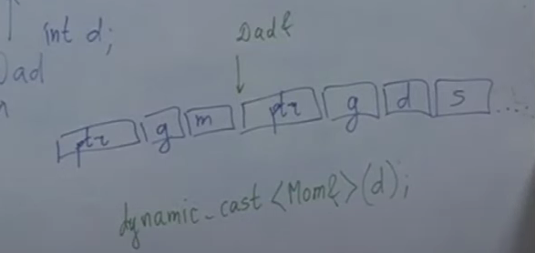
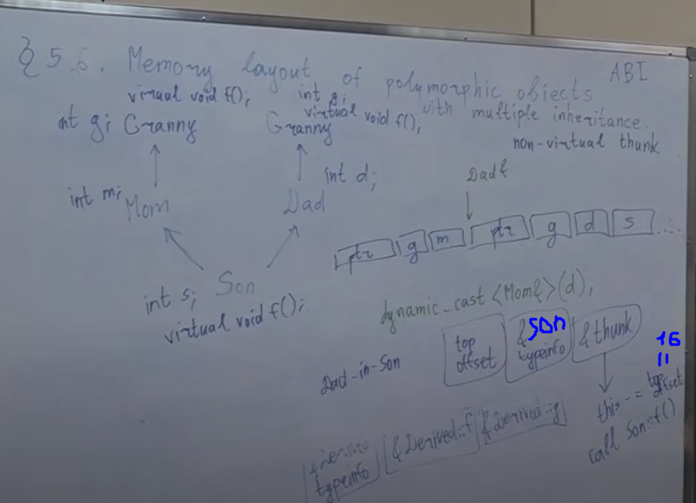
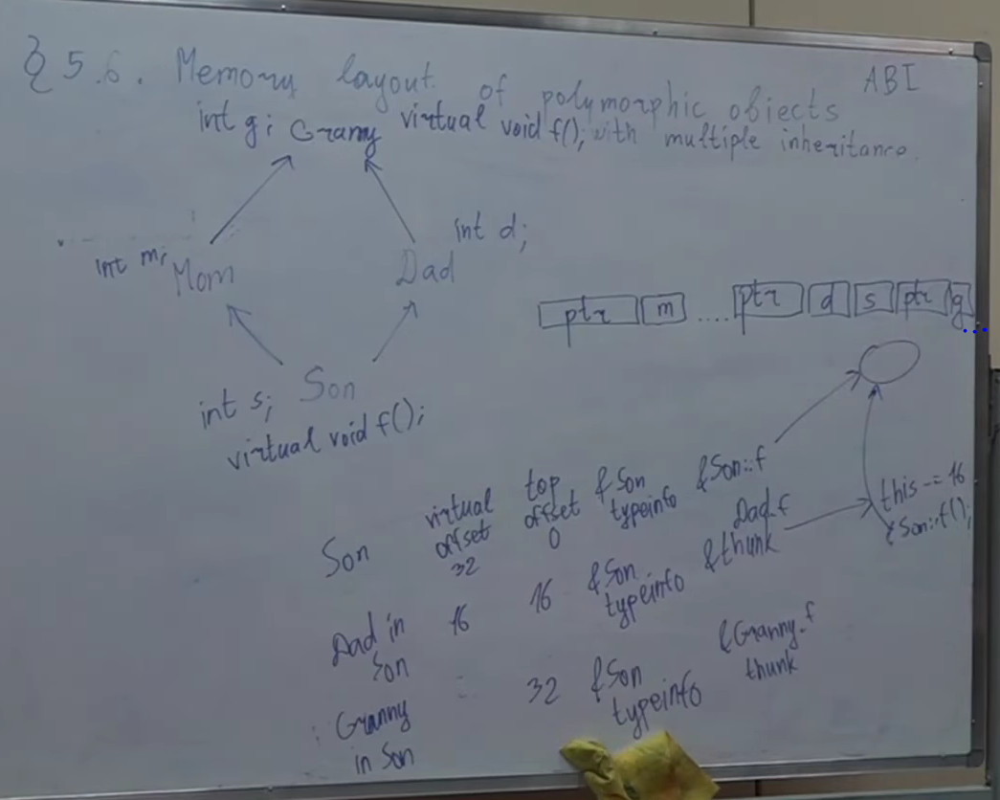

**// C-style cast
double d = 0.0;
int x = (int) d;
// LLVM cpp code-style**
# 1. static_cast
Естественное преобразование типов
Если нужен каст, но не знаем какой
Когда нужно привести тип к другому типу так, как естественно понимаем это
Самое обычное приведение типов по имеющимся правилам приведения типа
Создаёт новую копию из имеющегося объекта

# 2. reinterpret_cast
* Трактуем участок памяти иначе, т.е. берем байты в памяти и трактуем как байты памяти другого типа
* НЕ создает копию
* Позволяет кастовать указатели на произвольные типы. Если у нас указатель на что-то, то мы можем скастовать его на что-то угодно другое. Компилятор будет думать что там лежит что-то другое
* reinterpret_cast между указателями - ок
* reinterpret_cast между ссылками - ыыээ сомнительно
---
    // soft
    int x = 0;
    int* p = &x;
    dobule* pd = reinterpret_cast<double*>(p);

    // hardcore
    double d = 3.14;
    int* pp = reinterpret_cast<int*&>(d);
---
# 3. const_cast
* Позволяет нам неконстантный тип привести к константному (и наоборот)
* НЕ создаем копию, а трактуем имеющийся объект иначе (работает с указателями и ссылками)
---
    void f(int&) {std::cout << 1 << std::endl;}
    void f(const int&) {std::cout << 2 << std::endl;}
    int n = 5;
    // soft (type -> const type)
    f(n); 
    f(const_cast<const int&>(n));

    // hardcore (const type -> type)
    const int& cn = n;
    f(const_cast<int&>(cn));
---
# 4. C-style cast (https://en.cppreference.com/w/cpp/language/explicit_cast)
Самый грубый каст

    When the C-style cast expression is encountered, the compiler attempts to interpret it as the following cast expressions, in this order:
    a) const_cast<target-type>(expression);
    b) static_cast<target-type>(expression), with extensions: pointer or reference to a derived class 
        is additionally allowed to be cast to pointer or reference to unambiguous base class 
        (and vice versa) even if the base class is inaccessible 
        (that is, this cast ignores the private inheritance specifier). 
        Same applies to casting pointer to member to pointer to member of unambiguous non-virtual base;
    c) static_cast (with extensions) followed by const_cast;
    d) reinterpret_cast<target-type>(expression);
    e) reinterpret_cast followed by const_cast.
    else compile-error
ОЧЕНЬ ПЛОХО! потому что даже не знаем, какой каст сработал

# 5. RTTI and dynamic_cast
dynamic_cast это каст в runtime (static это в момент компиляции, dynamic это в runtime)

Например, у static_cast уже в compile-time известно, он успешен или ошибка компиляции
dynamic_cast может в runtime вернуть ошибку и будет RE, а может работать правильно
В чем отличие от static_cast? В следующем примере static_cast даст UB, а dynamic_cast даст исключение std::bad_cast
    
    struct Base {}
    struct Derived : Base {}
    Derived d;
    Base& b = d;
    // При неправильном касте будет std::bad_cast
    dynamic_cast<Derived&>(b);
    // При неправильном касте будет nullptr
    Derived* pd = dynamic_cast<Derived*>(&b);

Работает только для типов с виртуальными функциями, т.к. для типов, у которых нет виртуальных функций, никак нет в runtime способа узнать, что это за тип на самом деле. Ведь тип с виртуальными функциями, 
полиморфный тип другими словами, это как раз такой тип, про который в runtime каким-то образом поддерживается специальная информация, по которой в runtime понятно, что это на самом деле, и в зависимости от этого что вызвать. Если в классе нет ни одной виртуальной функции,
то dynamic_cast делать нельзя, это CE
Довольно таки дорогая операция, т.к. чтобы сделать dynamic_cast нужно в runtime сходить по некоторому указателю, который хранится в нашем объекте, найти virtual table, по ней посмотреть, что там написано, и в зависимости от этого понять, какой же это реально тип, и в зависимости от этого понять, можно ли dynamic_cast сделать или нет
В compile-time нельзя понять, что на самом деле лежит под ссылкой.
Например мы можем ввести число, и ссылку на Base проинициализировать либо объектом Base, либо объектом Derived, в зависимости от того, какое число было введено, и непонятно, что под ссылкой до runtime
Это все механизм RTTI (RunTime Type Information)
Для полиморфных типов компилятор поддерживает специальную структуру, в которой хранит, что это за тип на самом деле.

    Derived d;
    Base& b = d;
    typeid(b); // вернет std::type_info
    /*
    есть оператор сравнение, равенство будет т.ит.д., когда это одинаковые типы
    есть метод name, возвращающий const char, в котором написано название типа
    */
    std::cout << typeid(b).name() << "\n"; // для полиформных типов выведет название типа, который реально был под ссылкой, а не тип переменной, от которой мы вызвались
    int x = 1;
    typeid(x); // работает и не для полиморфных типов, но для них выводит просто тип переменной

#### 1) От любого полифорного типа всегда можно делать dynamic_cast ко звездочке, а от неполиморфного нельзя
Таким образом можно проверить, является ли тип полиморфным
#### 2) Всегда можно делать dynamic_cast вверх, даже если тип не полиморфный.
Но это не значит, что нам всегда нужно использовать dynamic_cast, он нужен, когда у нас в runtime нужны проверки,
когда у нас есть виртуальности нетривиальные. В остальных случаях нас должен устраивать static_cast
(если мы юзаем dynamic_cast от наследника к родителю, то в обратную сторону будет CE, а при static_cast будет UB)
#### 3) Умеет кастовать вбок (от мамы к папе). Если у нас есть множественное наследование (например: сын, мама, папа, бабушка),
static_cast неоткуда узнать, что мама папа совместимые типы, а dynamic_cast может посмотреть, что типы на самом деле сын
(пример: есть ссылка на маму, хотим скастовать к ссылке на папу. dynamic_cast идет в таблицу и смотрит, что на самом
деле тип сын, а каст от мамы, значит, чтобы сделать каст к папе, нужно сдвинуться на столько, и понимает на сколько,
потому что он знает, как сын в памяти размещается, это известно еще на стадии компиляции)
Если каст вниз или вбок: полиморфным должен быть тот, от кого делается dynamic_cast
Если от наследника к родителю: каст можно даже если нет никакого полиморфизма

Если нужно сделать тип полиморфным, но виртуальных функций никаких не требуется, то можно сделать виртуальный деструктор

Если мы делаем delete p, где p это указатель на родителя, хотя там на самом деле лежит наследник, то нам нужен виртуальный деструктор. Даже если у нас сам деструктор derived тривиальный, но у него есть поля, у которых есть нетривиальные деструкторы, то все, без виртуального деструктора мы проиграли

#### 4) Виртуальное наследование, и мы кастим вниз от виртуального предка (нужно, чтобы виртуальный предок был полиморфным)
Два примера, когда static_cast, dynamic_cast, reinterpret_cast дают разные результаты:
##### 1) Кастим вбок от мамы к папе:
    static_cast дает CE
    dynamic_cast корректно отрабатывает
    reinterpret_cast дает UB
##### 2) Кастим вниз при виртуальном наследовании (при условии, что предок полиморфный)
    static_cast дает CE
    dynamic_cast корректно отрабатывает
    reinterpret_cast дает UB
    
Виртуальная функция - это такая функция, что если по ссылке или указателю на базовый класс ее вызвать, то все равно вызовется версия дочернего класса.
Виртуальная функция - это такая функция, что решение какую версию выбрать принимается в runtime а не в compile time 

# 6. Memory layout of polymorphic objects
    struct Base{
        virtual void f() {}
    }; 
    sizeof(Base) == 8;
    // Потому что у нас есть виртуальная функция, значит есть указатель на vtable
    
vtable: структура данных, хранящаяся в статической памяти, одна на тип, в которой перечислены адреса виртуальных функций этого типа
В ней хранятся адреса виртуальных предков и адреса виртуальных методов.

##### Как работает dynamic_cast?
Он просто идет по pointer, находит typeinfo, идет в typeinfo, смотрит, что там написано и в зависимости от этого понимает, какой тип на самом деле. Поняв, какой тип на самом деле, он понимает, кидать нам ошибку, или же все корректно. Если же все корректно, то зная, от какого типа мы вызывались, и зная, какой тип мы хотим, он поймет, на сколько нужно сдвинуть pointer

---
Если у нас виртуальные функции появились не на самом верхнем уровне иерархии, то нам может надо сдвинуть поинтер, если мы кастуемся от сына к бабушке, которая еще не была полиморфна, полиморфность появилась ниже
Мы сможем сделать dynamic_cast от сына к бабушке, но не в обратную сторону. 
В то же время static_cast вниз мы сможем сделать

# 7. Memory layout of polymorphic objects with multiple inheritance

У нас невиртуальное наследование. Проблема с дублированием *f*. Если мы скажем
    
    s.f();
то у нас будет CE по причине неоднозначности (вызвать *f* от первой Granny или второй Granny). Даже если мы переопределим *f* в Mom и Dad, то все равно будет неоднозначность, т.к. два пути как дойти до *f*. Но если мы переопределим *f* в сыне, то это не будет неоднозначность, т.к. по правилу поиска имен она будет затмевать вышележащие, а по правилам переопределений виртуальных функций вызов f от любой из этих Granny будет приводить к вызову от Son (т.е. *f* от Son перекроет обе *f* у двух Granny)
Допустим мы сделали dynamic_cast к папе и затем хотим сделать dynamic_cast к маме.

    dynamic_cast<Mom&>(d);

Поймем что это два разных поинтера. Как минимум потому, что это два разных *f*, потому что это *f* должны использовать свои *g*. Т.е. вызов *f* от мамы и вызов *f* от папы приводят к разным *f*. Как минимум поэтому в этих двух *ptr* мы должны вызывать *f* по разному. Это все к тому, что в таблице должен быть (второго) *ptr* относительно начала объекта (первого *ptr*). В виртуальной таблице при множественном наследовании хранится еще *top offset*. Это число, которое говорит, насколько мы отстаем от начала объекта. Это при dynamic_cast помогает (хотя его можно реализовать и без этого), но это, например, нужно, когда мы вызываем *f*, а у *f* код один и тот же, но при этом в зависимости от того, вызвались на начале объекта или середине объекта нам нужно искать поля по разным местам.

##### non-virtual thunk
Если у сына переопределена *f*
    
    virtual void f();
то у обоих ptr адреса *f* будут одинаковыми, но ее надо вызывать с разным сдвигом
**non-virtual thunk** предфункция, которая делает сдвиг (число **top offset**), а затем идем куда надо

*topoffset = 16 для данного примера*
#### Virtual inheritance
Когда у нас появляется виртуальное наследование, то помимо **topoffset** у нас появляется **virtual offset**, т.е. в каждой таблице должно быть написано то, как далеко мы от начала объекта, а еще то, как далеко от нас начало виртуального предка
Таблица для сына:

*многоточие это padding*
т.к. бабушка полиморфна, ей тоже нужен свой ptr
Первый ptr - таблица сына (она же таблица mom in son)
Второй ptr - dad in son
Третий ptr - granny in son

По факту, кроме этих виртуальных таблиц есть еще construction vtables, а еще virtual table of tables
Нужно понимать, что виртуальные функции довольно таки прикольные штуки и дают интересные возможности, но накладывают некоторые дополнительные расходы

Интересный сайт
https://shaharmike.com/
(если интересно погрузиться в деревенский сральник с головой)
# 8. Non obvious problems with virtual functions
**Можно ли сделать виртуальную функцию статической?**
Кнч нет хуле да то епта, сразу CE словишь

    Статический член - это то, что не относится ни к какому экземпляру, только к классу
    Виртуальный член - это то, что не относится напрямую ни к какому классу, только к экземпляру
    Получается, что статический виртуальный член - это нечто, не относящееся ни к какому экземпляру или какому-либо классу
Более формальное объяснение:
In C++, a static member function of a class cannot be virtual. Virtual functions are invoked when you have a pointer or reference to an instance of a class. Static functions aren’t tied to the instance of a class but they are tied to the class. C++ doesn’t have pointers-to-class, so there is no scenario in which you could invoke a static function virtually. Also, static member function cannot be const and volatile
**Все ли тут ок?**

    #include <iostream>

    struct Base{
        int x;
        virtual void f();
    };
    struct Derived : Base{};

    int main(){
        Derived d;
    }
Ошибка линкера: виртуальные функции нельзя оставлять без определения, даже если мы их не вызываем, кроме ситуации, когда это pure virtual function. Это объясняет, когда нужно писать *= 0*, мы не можем оставить виртуальную функцию без определения (в отличие от обычной), т.к. для виртуальной функции компилятор должен сгенерировать vtable, а в vtable он должен положить ptr этой функции, но нельзя взять адрес у функции, у которой нет определения

    /usr/bin/ld: /tmp/ccD9RjHP.o: warning: relocation against `_ZTV4Base' in read-only section `.text._ZN4BaseC2Ev[_ZN4BaseC5Ev]'
    /usr/bin/ld: /tmp/ccD9RjHP.o: in function `Base::Base()':
    virtual_functions.cpp:(.text._ZN4BaseC2Ev[_ZN4BaseC5Ev]+0xf): undefined reference to `vtable for Base'
    /usr/bin/ld: /tmp/ccD9RjHP.o:(.data.rel.ro._ZTV7Derived[_ZTV7Derived]+0x10): undefined reference to `Base::f()'
    /usr/bin/ld: /tmp/ccD9RjHP.o:(.data.rel.ro._ZTI7Derived[_ZTI7Derived]+0x10): undefined reference to `typeinfo for Base'
    /usr/bin/ld: warning: creating DT_TEXTREL in a PIE
    collect2: error: ld returned 1 exit status
**А тут?**

    #include <iostream>

    struct Base{
        virtual void h() = 0;
        void f() {
            std::cout << "f";
        }
        Base(){
            std::cout << "Base";
            h(); // o_o
            f(); // ?????
        }
        virtual ~Base() = default;
    };

    struct Derived : Base{
        int x;
        void g(){
            f(); // здесь вызовем f из Base, а h (внутри f) из Derived
        }
        void h() override{
            std::cout << "h" << x;
        }
        Derived(){
            std::cout << "Derived";
        }
    };

    int main(){
        Derived d;
    }
Мы создаем объект Derived, и первым делом надо вызвать конструктор Base. Мы вызываем конструктор Base, выводим на экран "Base", а затем вызываем *h*. Но *h* - pure virtual. Но она override в Derived. Но мы то пока создаем часть Base.

    virtual_functions.cpp: In constructor ‘Base::Base()’:
    virtual_functions.cpp:10:10: warning: pure virtual ‘virtual void Base::h()’ called from constructor
    10 |         h(); // o_o
        |         ~^~
    /usr/bin/ld: /tmp/ccmwFipP.o: in function `Base::Base()':
    virtual_functions.cpp:(.text._ZN4BaseC2Ev[_ZN4BaseC5Ev]+0x3f): undefined reference to `Base::h()'
    collect2: error: ld returned 1 exit status
Здесь ошибка линкера.
Почему бы не вызвать Derived версию? На самом деле, если мы вызываем из конструктора виртуальную функцию, то она диспатчится не как виртуальная, а обычная, чтобы избежать UB.

Теперь посложнее:

    #include <iostream>

    struct Base{
        virtual void h() = 0;
        void f() {
            std::cout << "f";
        }
        Base(){
            std::cout << "Base";
            //h(); // o_o
            f(); // ?????
        }
        virtual ~Base() = default;
    };

    struct Derived : Base{
        int x;
        void g(){
            f(); // здесь вызовем f из Base, а h (внутри f) из Derived
        }
        void h() override{
            std::cout << "h" << x;
        }
        Derived(){
            std::cout << "Derived";
        }
    };

    int main(){
        Derived d;
    }
Вместо *h* вызываем *f*, в которой вызываем *h* xD
Это не ошибка линковки, это не CE: в compile-time это никак не задетектить, ее ассемблерный код не зависит от того, откуда мы ее вызвали, т.е. зайди в табличку, найди по такому смещению указатель, пойди по этому указателю и вызови виртуальную функцию.
Методом исключений получим, что у нас выйдет runtime-error

    $ g++ virtual_functions.cpp -o a && ./a
    pure virtual method called
    terminate called without an active exception
    Aborted
Но кто вообще понял, что у нас бага? На самом деле, в виртуальной таблице Base по адресу, по которому *f* должна лежать, лежит поинтер на некоторое специальное место (т.е. есть заглушка под эту *f*), в котором специальный код, которое делает следующее: выводит на экран этот текст, а затем вызывает функцию *std::terminate*, которая в свою очередь вызывает функцию *std::abort*

**C деструктором у нас те же самые проблемы**
Поймем, как это работает в терминах таблиц. Мы создаем Derived, почему там оказывается указатель на этот pure virtual method? На самом деле, по мере того, как мы создаем объект наш, наш virtual pointer притерпевает изменения. Когда создается полиморфный объект, нужно понимать, что есть еще один этап, перед началом создания родителя, до инициализации его полей, инициализации vptr. Когда мы создаем полиморфный объект, сначала должен создаться его родитель, и первым делом vptr инициализируется указателем на таблицу родителя. На момент, когда мы находимся в теле конструктора родителя, наш vptr указывает на таблицу родителя. После того, как отработал конструктор родителя, vptr автоматически переставляется на таблицу Derived, после этого создаются поля Derived и выполняется тело конструктора Derived. Т.е. по мере того, как мы создаем наш объект, если у нас много предков, наш собственный vpointer перед созданием очередного предка переставляется на соответствующую таблицу, чтобы мы не попали случайно на метод предка, который еще не существует.
А как это работает при виртуальном наследовании? Здесь возникает необходимость construction vtable. На самом деле, помимо всего этого добра, еще должна отдельно существовать таблица mom-in-son и dad-in-son для конструирования: если я сейчас mom, я конструируюсь, еще сын не создан, у меня должен быть отдельный ptr на таблицу для mom, которая создается будучи частью сына, и вот на нее ставится ptr перед тем, как начнут инициализироваться поля mom, только потом отрабатывает конструктор mom, потом то же самое с dad, только у dad уже другой ptr, потому что dad инициализируется на другом куске памяти, потом все эти ptr переставляются соответственно. Откуда берутся все эти ptr? Есть virtual table of tables - это таблица, в которой перечислены все эти ptr в правильном порядке, и когда у нас сложный граф наследования, по мере конструирования нашего объекта наши vptr подряд ставятся по этой таблице куда надо.
Все в обратном порядке происходит, когда объект уничтожается: сначала отрабатывает деструктор наследника, уничтожаются поля наследника, vptr переставляется обратно на таблицу mom, после этого отрабатывает тело деструктора mom, уничтожаются поля mom, все снимается со стека. Но вот этот момент, что vptr переставляется обратно, он очень важен для понимания

**Все то же самое при вызове виртуальной функции в списке инициализации: она тоже вызывается не по правилу виртуальной функции, а по правилу обычных функций**

---
**Опять какой-то пример**
Что выведется?
A) Base 1
B) Base 2
C) Derived 1
D) Derived 2

    #include <iostream>

    struct Base{
        virtual void f(int x = 1){
            std::cout << "Base " << x;
        }
    };

    struct Derived : Base{
        void f(int x = 2) override{
            std::cout << "Derived " << x;
        }
    };

    int main(){
        Derived d;
        Base& b = d;
        b.f();
    }
Правильный ответ: **Derived 1**
И это даже логично. Если задуматься, то интуитивно понятно, почему так. Если понимать, как работают виртуальные функции и компилятор, то становится понятно, что выбора нет, только так это и может сработать и никак иначе.
Во-первых, мы в compile-time должны подставлять аргумент по умолчанию, т.к. нам нужно в compile-time сгенерировать ассемблерный код, в котором написано "положи на стэк аргументы и пойди по адресу вызови *f* "
Во-вторых, у функции 1 аргумент и его надо передать в compile-time, и компилятору ничего не остается, кроме как передать тот аргумент, который он в состоянии сейчас передать. Он, видя тип *Base*, кладет единицу туда в compile-time, а в реальности попадает в версию *Derived* уже в runtime

---

**Вот щас железобетонно последний ~~самый кринжовый~~ пример**
*Мало кто о нем знает, так что на собесах стоит выебнуться и рассказать про это*

Пусть есть виртуальный метод *g*, и мы решаем у сына взять адрес этого метода, а потом вызваться не от сына

    #include <iostream>

    struct Mother{
        int x = 0;
        virtual void f(){
            std::cout << x;
        }
    };

    struct Father{
        int y = 1;
        virtual void g(){
            std::cout << y;
        }
    };

    struct Son : Mother, Father{
        int z = 2;
        void f() override{
            std::cout << z;
        }
        void g() override{
            std::cout << z;
        }
    };

    struct S{
        long long a;
        long long b;
    };

    int main(){
        void (Son::* p)() = &Son::g;
        Son son;
        (son.*p)();
        std::cout << '\n';

        std::cout << sizeof(p) << ' ';
        S s = reinterpret_cast<S&>(p);
        std::cout << s.a << ' ' << s.b << '\n';
    }
Поймем, как вообще должны вести себя указатели на виртуальные методы. Представим, что у нас есть указатель на метод мамы и 
    
    int main(){
        void (Mother::* p)() = &Mother::f;
        Son son;
        Mother& m = son;
        (m.*p)();
        std::cout << '\n';

        S s = reinterpret_cast<S&>(p);

        std::cout << sizeof(p) << ' ';
        std::cout << s.a << ' ' << s.b << '\n';
    }
Это скомпилируется и выведется *2*. Указатель на виртуальный метод, если мы вызываем метод, он должен продолжать вести себя как виртуальный.
Что выводится:

    2
    16 1 0
Этот указатель состоит из 16 байт, в которых первые 8 байт кодируют единицу, а следующие 8 байт кодируют ноль.
Для продолжения эксперимента сделаем следующее:

    int main(){
        void (Mother::* p)() = &Mother::f;
        Son son;
        Mother& m = son;
        (m.*p)();

        void (Father::*p2)() = &Father::g;
        Father& f = son;
        std::cout << '\n';
        (f.*p2)();

        std::cout << '\n';

        S s = reinterpret_cast<S&>(p);
        S s2 = reinterpret_cast<S&>(p2);
        
        std::cout << sizeof(p) << ' ';
        std::cout << s.a << ' ' << s.b << '\n';

        std::cout << sizeof(p2) << ' ';
        std::cout << s2.a << ' ' << s2.b << '\n';
    }
Вывод:

    2
    2
    16 1 0
    16 1 0
По указателю на метод папы мы все равно получим метод сына.
При этом, указатель и на мамин метод, и на папин метод выглядят как 

    1 0
Пойдем еще дальше:

    int main(){
        void (Mother::* p)() = &Mother::f;
        Son son;
        Mother& m = son;
        (m.*p)();

        void (Son::*p2)() = &Father::g; // изменили
        Father& f = son;
        std::cout << '\n';
        (son.*p2)(); // изменили

        std::cout << '\n';

        S s = reinterpret_cast<S&>(p);
        S s2 = reinterpret_cast<S&>(p2);

        std::cout << sizeof(p) << ' ';
        std::cout << s.a << ' ' << s.b << '\n';

        std::cout << sizeof(p2) << ' ';
        std::cout << s2.a << ' ' << s2.b << '\n';
    }
Вывод:

    2
    2
    16 1 0
    16 1 16
Можно заметить, что второе число показывает сдвиг относительно начала объекта. Вопрос в том, что показывает первое число, и почему там один.
Напоследок:

    int main(){
        void (Son::* p)() = &Mother::f;

        Son son;
        Mother& m = son;
        (son.*p)();

        void (Son::*p2)() = &Son::g;
        Father& f = son;
        std::cout << '\n';
        (son.*p2)();

        std::cout << '\n';

        std::cout << sizeof(p) << ' ';
        S s = reinterpret_cast<S&>(p2);
        std::cout << s.a << ' ' << s.b << '\n';
    }
Вывод:

    2
    2
    16 9 0
Почему *9* ? Осталось нечетным и изменилось на восемь.
Второе число показывает сдвиг относительно начала объекта, а первое число показывает сдвиг относительно начала виртуальной таблицы.
Когда мы брали *f* у мамы или *g* у папы, это были первые из их виртуальных методов, поэтому нужно было просто первый метод взять и сдвинуться либо не сдвигаться.
А когда мы взяли адрес на виртуальный метод сына, у нас их там уже два, и если мы берем адрес *f* то это как бы сдвиг 0 относительно начала виртуальной таблицы, а если берем *g* у сына, то это сдвиг 8 относительно начала виртуальной таблицы.
Первое число показывает, на сколько байт относительно начала виртуальной таблицы нужно искать адрес этого метода.
Почему там единица последним битом? А надо же как-то отличить виртуальные указатели от невиртуальных. Обычные указатели на методы хранят в первых 8 байтах реальные адреса, но эти адреса никогда не нечётные. Чтобы для виртуальных указателей на методы поведение было другим, последним битом ставится единица, чтобы в runtime стало понятно: "А, у этого указателя последний бит единица, значит это отдельный случай, значит это виртуальный указатель, значит само число означает не адрес функции, а сдвиг относительно начала виртуальной таблицы". Таким образом, мы, не меняя размер указателя на метод, кодируем в него сдвиг относительно начала виртуальной таблицы вместо того, чтобы кодировать адрес настоящей функции.

# Дополнение: ромбовидное наследование

**[Что пишут на вики](https://ru.wikipedia.org/wiki/Ромбовидное_наследование)**

Проблема ромба (Diamond problem)- классическая проблема в языках, которые поддерживают возможность множественного наследования. Эта проблема возникает когда классы B и C наследуют A, а класс D наследует B и C.

К примеру, классы A, B и C определяют метод print_letter(). Если print_letter() будет вызываться классом D, неясно какой метод должен быть вызван — метод класса A, B или C. Разные языки по-разному подходят к решению ромбовидной проблем. В C ++ решение проблемы оставлено на усмотрение программиста.

Ромбовидная проблема — прежде всего проблема дизайна, и она должна быть предусмотрена на этапе проектирования. На этапе разработки ее можно разрешить следующим образом:
* вызвать метод конкретного суперкласса;
* обратиться к объекту подкласса как к объекту определенного суперкласса;
* переопределить проблематичный метод в последнем дочернем классе (в коде — turn_on() в подклассе Laptop).

    #include <iostream>
    using namespace std;

    class Device {
        public:
            void turn_on() {
                cout << "Device is on." << endl;
            }
    };

    class Computer: public Device {};

    class Monitor: public Device {};

    class Laptop: public Computer, public Monitor {
        /*
        public:
            void turn_on() {
                cout << "Laptop is on." << endl;
            }
        // uncommenting this function will resolve diamond problem
        */
    };

    int main() {
        Laptop Laptop_instance;

        // Laptop_instance.turn_on();
        // will produce compile time error
        // if Laptop.turn_on function is commented out

        // calling method of specific superclass
        Laptop_instance.Monitor::turn_on();

        // treating Laptop instance as Monitor instance via static cast
        static_cast<Monitor&>( Laptop_instance ).turn_on();
        return 0;
    }

Если метод turn_on() не был переопределен в Laptop, вызов Laptop_instance.turn_on(), приведет к ошибке при компиляции. Объект Laptop может получить доступ к двум определениям метода turn_on() одновременно: Device:Computer:Laptop.turn_on() и Device:Monitor:Laptop.turn_on().
## Конструкторы и деструкторы
Поскольку в С++ при инициализации объекта дочернего класса вызываются конструкторы всех родительских классов, возникает и другая проблема: конструктор базового класса Device будет вызван дважды.

    #include <iostream>
    using namespace std;

    class Device {
        public:
            Device() {
                cout << "Device constructor called" << endl;
            }
    };

    class Computer: public Device {
        public:
            Computer() {
                cout << "Computer constructor called" << endl;
            }
    };

    class Monitor: public Device {
        public:
            Monitor() {
                cout << "Monitor constructor called" << endl;
            }
    };

    class Laptop: public Computer, public Monitor {};

    int main() {
        Laptop Laptop_instance;
        return 0;
    }

## Виртуальное наследование

Виртуальное наследование (virtual inheritance) предотвращает появление множественных объектов базового класса в иерархии наследования. Таким образом, конструктор базового класса Device будет вызван только единожды, а обращение к методу turn_on() без его переопределения в дочернем классе не будет вызывать ошибку при компиляции.

    #include <iostream>
    using namespace std;

    class Device {
        public:
            Device() {
                cout << "Device constructor called" << endl;
            }
            void turn_on() {
                cout << "Device is on." << endl;
            }
    };

    class Computer: virtual public Device {
        public:
            Computer() {
                cout << "Computer constructor called" << endl;
            }
    };

    class Monitor: virtual public Device {
        public:
            Monitor() {
                cout << "Monitor constructor called" << endl;
            }
    };

    class Laptop: public Computer, public Monitor {};

    int main() {
        Laptop Laptop_instance;
        Laptop_instance.turn_on();
        return 0;
    }
*Примечание: виртуальное наследование в классах Computer и Monitor не разрешит ромбовидное наследование если дочерний класс Laptop будет наследовать класс Device не виртуально ( class Laptop: public Computer, public Monitor, public Device {}; ).*

