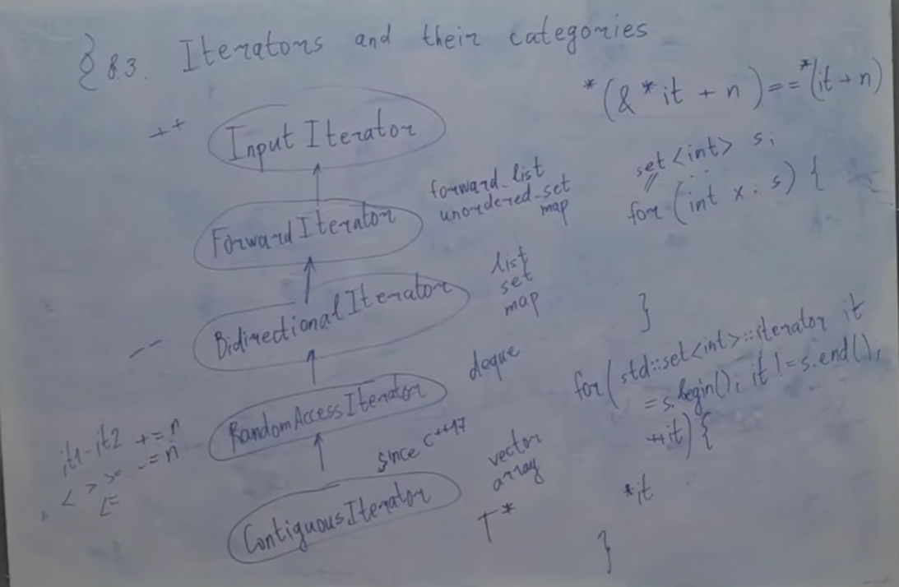
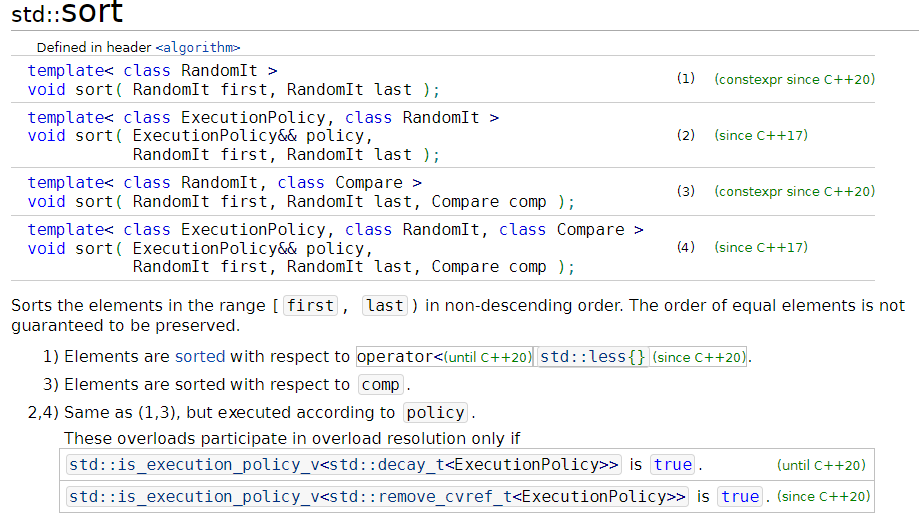
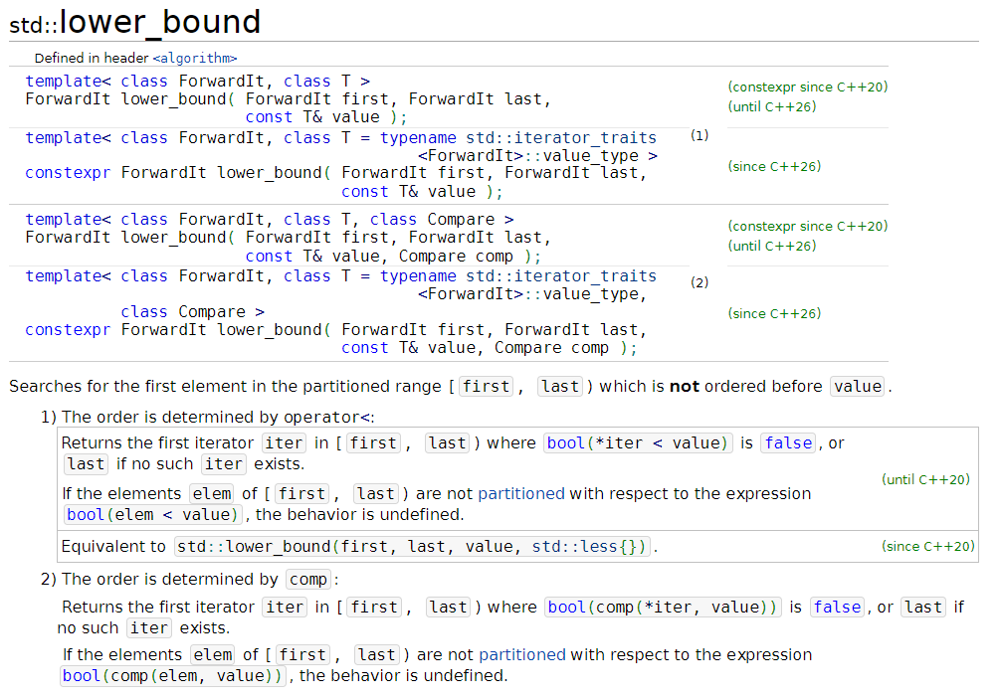

# Iterators and their categories
## Что такое итератор
[Итератор](https://en.cppreference.com/w/cpp/iterator) - это такой тип, который позволяет нам, неформально говоря, делать обход последовательности. Это некоторое обобщение указателя, которое позволяет нам себя разыменовывать и инкрементировать
Формально: Iterators are a generalization of pointers that allow a C++ program to work with different data structures (for example, containers and ranges(since C++20)) in a uniform manner. The iterator library provides definitions for iterators, as well as iterator traits, adaptors, and utility functions.
Since iterators are an abstraction of pointers, their semantics are a generalization of most of the semantics of pointers in C++. This ensures that every function template that takes iterators works as well with regular pointers.

Итератор - это тип, удовлетворяющий некоторому набору свойств. Самые базовые из них: его можно разыменовывать и инкрементировать, а еще сравнивать на равенство. Еще есть какие-то технические свойства по типу: его можно конструировать по умолчанию, его можно копировать конструировать, и т.д.
Формально обычный указатель - это тоже итератор
## Категории итераторов
Тип считается ...Iterator, если:
* **[InputIterator](https://en.cppreference.com/w/cpp/iterator/input_iterator)** - разыменовывание, инкремент, равенство, неравенство
* **[ForwardIterator](https://en.cppreference.com/w/cpp/iterator/forward_iterator)** - является InputIterator, и вдобавок к этому еще гарантирует нам то, что если мы будем ходить по одной и той же последовательности несколько раз, не меняя ее, то мы будем видеть одно и то же. Пример: итераторы из forward_list, unordered_set, unordered_map
* **[BidirectionalIterator](https://en.cppreference.com/w/cpp/iterator/bidirectional_iterator)** - является ForwardIterator, и вдобавок к этому еще умеет делать **--**. Пример: итераторы из list, set, map
* **[RandomAccessIterator](https://en.cppreference.com/w/cpp/iterator/random_access_iterator)** - является BidirectionalIterator, и вдобавок к этому еще умеет делать: **+=n**, **-=n**, **it1-it2**, **<**, **>**, **<=**, **>=**. Пример: итератор из deque
* **[ContiguousIterator](https://en.cppreference.com/w/cpp/iterator/contiguous_iterator)** (since c++17) - является RandomAccessIterator, и вдобавок к этому еще гарантирует, что он эквивалентен указателю: если мы разыменуем итератор, потом обратно возьмем адрес, прибавим n, и снова разыменуем, то это было бы все равно, что к итератору прибавили n и разыменовали 
    

    *(&*it+n)==*(it+n)
Пример: итераторы из vector, array, любой поинтер

## [range-based-for](https://en.cppreference.com/w/cpp/language/range-for)
*since c++11*

    set<int> s;
    for (int x : s){

    }
*until c++11*

    for (std::set<int>::iterator it = s.begin(); it != s.end(); ++it){
        *it
    }

[Named Requirements](https://en.cppreference.com/w/cpp/named_req):
* [Container](https://en.cppreference.com/w/cpp/named_req/Container)
* [Iterator](https://en.cppreference.com/w/cpp/named_req/Iterator)
* [InputIterator](https://en.cppreference.com/w/cpp/named_req/InputIterator)
* [BidirectionalIterator](https://en.cppreference.com/w/cpp/named_req/BidirectionalIterator)
* [RandomAccessIterator](https://en.cppreference.com/w/cpp/named_req/RandomAccessIterator)
* [ContiguousIterator](https://en.cppreference.com/w/cpp/named_req/ContiguousIterator)

Напишем код на сайте [cppinsights](https://cppinsights.io/) - сайт, который удаляет весь синтаксический сахар

    #include <iostream>
    #include <set>

    int main()
    {
        std::set<int> s = {1,2,3,4,5};
        for (int x : s){
            std::cout << x;
        }
    }
Компилятор превратил наш код в:

    #include <iostream>
    #include <set>

    int main()
    {
        std::set<int, std::less<int>, std::allocator<int> > s = std::set<int, std::less<int>, std::allocator<int> >{std::initializer_list<int>{1, 2, 3, 4, 5}, std::less<int>(), std::allocator<int>()};
        {
            std::set<int, std::less<int>, std::allocator<int> > & __range1 = s;
            std::_Rb_tree_const_iterator<int> __begin1 = __range1.begin();
            std::_Rb_tree_const_iterator<int> __end1 = __range1.end();
            for(; operator!=(__begin1, __end1); __begin1.operator++()) {
            int x = __begin1.operator*();
            std::cout.operator<<(x);
            }
            
        }
        return 0;
    }
## [Algorithm library](https://en.cppreference.com/w/cpp/algorithm)
[Sort](https://en.cppreference.com/w/cpp/algorithm/sort)

Алгоритмы, которые в принципе существуют над последовательностями, классифицируются по требованию на итератор входной

std::sort - это quicksort с какими-то оптимизациями (на самом деле [introsort](https://ru.wikipedia.org/wiki/Introsort)), он требует RandomAccessIterator.
А, например, BubbleSort требует ForwardIterator, и std::is_sorted тоже, в то время как std::next_permutation требует BidirectionalIterator.
std::copy и std::copy_if требует только InputIterator

Существует несколько задач по алгоритмам, которые можно сформулировать в терминах видов итераторов.
Например:
* *Дан массив. Известно, что все числа встречаются дважды, а одно число встречается только один раз. Как найти это число?*
Решение: xor всех элементов. Но если бы мы писали библиотечную функцию, которая решает эту задачу, мы бы попросили InputIterator, потому что это однопроходный алгоритм
* *Дан массив интов размера n. Известно, что одно из чисел встречается строго больше, чем n/2 раз. Найдите это число (за линейное время с константной памятью).* Решение: легко, а как решить это, используя только InputIterator? Посмотрим на аналогию с танцами: приходят люди на танцы, у нас есть пул людей, которые сейчас стоят ждут в очереди, и приходит следующий человек. Если он находит себе в пару человека, который он отличается от него, то он идет с ним в пару. Т.е. мы помним число и количество раз сколько оно встретилось, т.е. мы помним два числа, когда мы видим очередное число, если оно совпадает с тем, которое мы храним, мы увеличиваем счетчик, иначе уменьшаем счетчик. Таким образом, в конце у нас гарантированно останется число, которое было больше n/2 раз, чем остальные

[std::lower_bound](https://en.cppreference.com/w/cpp/algorithm/lower_bound) - достаточно лишь ForwardIterator

Но почему? На самом деле здесь есть подвох: бинпоиск работает логарифмическое время, но оно логарифмическое относительно операции над T по стандарту. На самом деле, про бинпоиск в стандарте сказано следующее: он делает логарифмическое количество сравнений, а вот сдвиги итератора не учитываются. И на самом деле это разумно: представим, что мы делаем бинпоиск на массиве огромных очень длинных строк. Сравнение строк - долгая операция. Тогда нам разумно сделать бинпоиск на ForwardIterator, т.е. если у нас есть связанный список из строк, нам может быть осмысленно сделать бинпоиск на этом связанном списке с ForwardIterator, сэкономив таким образом количество вызовов операций сравнения строк, потому что инкремент оператора дешевый, а сравнение дорогое может быть. (А если оператор RandomAccessIterator, то он это понимает, и сразу делает +=)

В [deque](https://en.cppreference.com/w/cpp/container/deque) метод [push_back](https://en.cppreference.com/w/cpp/container/deque/push_back) работает за константное время, в то время как в [vector](https://en.cppreference.com/w/cpp/container/vector) метод [push_back](https://en.cppreference.com/w/cpp/container/vector/push_back) работает за амортизированную константу. Дело в том, что как и в случае с бинпоиском, стандарт, когда оценивает сложность операции в контейнере, он оценивает ее относительно операции над T. А операции над самой памятью и над поинтерами не учитываются, потому что не очень понятно, как их учитывать: что такое выделение памяти, это не очень понятно, что по сложности из себя представляет. А в vector не константное время их происходит, а линейное, потому что нам нужно вызвать деструктор там и вызвать конструктор на новом месте

## Как по iterator понять, какой у него вид, и как из под iterator что-нибудь достать?
Трюк, который позволяет понять, от какого типа мы вызвались

    #include <iostream>
    #include <vector>

    template <typename InputIterator>
    void find_most_often_number(InputIterator begin, InputIterator end){
        auto x = *begin; // несовсем верно
    }
    template <typename T>
    void f(T) = delete;

    int main(){
        std::vector<bool> vb(10);
        f(*vb.begin());
    }
Компилятор ругается:

    iterators.cpp: In function ‘int main()’:
    iterators.cpp:13:6: error: use of deleted function ‘void f(T) [with T = std::_Bit_reference]’
    13 |     f(*vb.begin());
        |     ~^~~~~~~~~~~~~
    iterators.cpp:9:6: note: declared here
        9 | void f(T) = delete;
        |      ^
Т.е. например для булевого вектора это будет некорректный тип, нельзя написать auto, потому что тип разыменованного begin - это не всегда то, что нужно, это не всегда тот тип, из которого реально состоит последовательность, это может быть какая-то обертка над ним

Есть целый набор метофункций, для узнавания много чего про итераторы: [std::iterator_traits](https://en.cppreference.com/w/cpp/iterator/iterator_traits)

    template <typename InputIterator>
    void find_most_often_number(InputIterator begin, InputIterator end){
        typename std::iterator_traits<InputIterator>::value_type x = *begin;
    }
[Например, iterator_category - это такой тип, который олицетворяет категорию итератора](https://en.cppreference.com/w/cpp/iterator/iterator_tags)

Почитать самому
[std::output_iterator](https://en.cppreference.com/w/cpp/iterator/output_iterator)