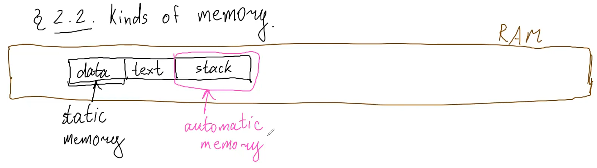

## Курс лекций по программированию на C++ МФТИ ФПМИ 2023-24 учебный год, 1 курс, продвинутый поток.
[Плейлист](https://www.youtube.com/playlist?list=PLmSYEYYGhnBviRYhIDty-CSTDS16a3whl)

# Лекция 1
- общие слова о C и C++
- статическая и динамическая типизация
- основные типы данных и операции над ними


# Лекция 2
## Неявные преобразования типов
- integer promotions (повышают диапозон значений)
```cpp
char + int = int
int + long long = long long
// !но
int + unsigned int = unsigned int
```
- floating point promotions (так же)
- bool <- int
- int <-> float (-> с отбрасываеним дробной части)


# Лекция 3
## Области видимости
- scope - фигурные скобки, также есть один глобальный scope
```cpp
namespace N {
    int x;
}

int main() {
    std::cout << N::x;
    using N::x; // притащили x в наш scope
    std::cout << x;
}

using namespace N; // притащили глобально весь namespace
```
- ODR (one definition rule)\
Каждая использумая сущность в программе должна быть 1 раз определена. Но объявлять можно сколько угодно раз. Класс можно определить несколько раз, если все определения дословно идентичны.
```cpp
// объявление - сколько угодно
void f(int x);
void f(int x);

// определение - только 1
void f(int x) {
    //...
}
```

- перегрузка функций (function overloading)
```cpp
int f();
int f(int x);
int f(double x);
// должны отличаться принимаемые типы!
```

- statements


- логические операторы
    - ленивые вычисления
    - branch prediction
    

- lvalue, rvalue\
в самом простом приближении (на самом деле всё сложнее):\
lvalue - ему можно что-то присвоить\
rvalue - нельзя


# Лекция 4
## Выражения и операторы
- лево и право ассоциативные
- [приоритет операторов](https://en.cppreference.com/w/cpp/language/operator_precedence)
- [order of evaluation](https://en.cppreference.com/w/cpp/language/eval_order)
- sequenced before rules


# Лекция 5
## Ошибки
- compilation errors
- лексические ошибки
- синтаксические ошибки
- семантические ошибки
- runtime error
- undefined behaviour (большая беда языка)
- the as-if rule (компилятор имеет право как угодно менять действия нашей программы, только чтобы наблюдаемое поведение корректной программы оставалось таким же)
- warinings


# Лекция 6
## Указатели
- `*` и `&`
```cpp
int x = 10;
int* p = &x;
std::cout << *p;

void* vp = &x;
// (для приведения типов)
```

- `nullptr`
```cpp
NULL // in C
nullptr // in C++
```


# Лекция 7
## Память
- статическая
- динамическая
- автоматическая
- стек: примерно 8мб


на самом деле вот так:


- static\
проинициализируется, когда в 1 раз зайдем в функцию
```cpp
void f() {
    static int x = 0; // тоже в статической памяти
    //...
}
```

- динамическая память\
операторы `new`, `delete`
```cpp
int* p = new int;
delete p;

int *pa = new int[1000];
delete[] pa;
```


# Лекция 8
## Массивы
```cpp
int a[10];
int b[3] = {1, 2, 3};
int c[] = {1, 2, 3}; // можно не указывать размер
int d[5] = {}; // заполнятся нулями
int* e[10]; //  массив из 10 указателей на int
int (*f)[10]; // указатель на массив из 10 int
```
- указатели на функцию\
function to pointer conversion
```cpp
bool cmp(int x, int y) {
    return x < y;
}

int main() {
    // можно не писать &, можно просто указать название функции
    bool (*p) (int, int) = &cmp; 
    std::cout << (void*)p;
}
```

как читать указатели? (начало лекции 9)\
идем вправо, потом влево. затем поднимаемся на уровень выше. и повторяем
```cpp
void (*pf)(int); // указатель на функцию, которая принимает int, а возвращает void
// 0) начинаем с названия, pf это:
// 1) -> пусто; <- указатель
// 2) ^
// 2) -> на фукнцию, которая принимает int; <- а возвращает void
```
если справа видим круглые скобки, то это функция\
например, в шаге 2) `(int)`

```cpp
void (*pfa[10])(int); // массив из 10 указателей на функцию, которая принимает int, а возвращает void 
// 0) начинаем с названия, pfa это:
// 1) -> массив из 10; <- указателей
// 2) ^
// 2) -> на фукнцию, которая принимает int; <- а возвращает void
```

```cpp
void (*(*pff[10])(int))(int); // массив из  10 указателей на функцию, которая принимает int, а возвращает указатель на другую функцию, которая принимает int, а возвращает void 

// 0) начинаем с названия, pff это:
// 1) -> массив из 10; <- указателей
// 2) ^
// 2) -> на фукнцию, которая принимает int; <- а возвращает указатель
// 3) ^
// 4) -> на фукнцию, которая принимает int; <- а возвращает void
```
[полезная ссылка](http://www.unixwiz.net/techtips/reading-cdecl.html)

- аргументы по умолчанию\
только последние

```cpp
void point(int x = 3, int y = 4) {}
```

- variadic functions (легаси)\
любое число аргументов
```cpp
void simple_printf(const char* fmt...) {}
```


# Лекция 9
## Ссылки (references)
- амперсанд после типа
- можно считать, что это новое имя старого объекта
- на низком уровне реализуется через указатель, но не всегда
```cpp
int x = 5;
int& y = x; // ссылка на x
int& t = y; // тоже ссылка на x, нет ссылки на ссылку
sizeof(y); // = sizeof(x)
&y; // = &x
int& r; // нельзя без инициализации
```

- `error: call of overloaded ‘f(int&)’ is ambiguous`. не можем различить, вызываться от оригинального объекта, или от ссылки
```cpp
void f(int &y) {
    ++y;
}
void f(int x) {
    ++x;
}
int main() {
    int x = 5;
    int& y = x;
    f(y);
    f(x);
}
```

- ссылку нельзя проинициализировать через rvalue
- формально говоря `++x` возвращает `int&`, также и с разыменованием указателя `*p` (в си это не так, там нет такого понятия. но в плюсах можно думать об этом так)
- lvalue to rvalue conversion
```cpp
int& g(int& x) {/*...*/}
int main() {
    int x = 10;
    int t = g(x); // g(x) - lvalue, но используем как rvalue 
}
```
- нельзя путать (ну это skill issue)\
\
и нельзя путать с `int&&` (rvalue-ссылка)

- dangling reference\
возвращаем ссылку, но такого объекта уже нет
```cpp
int& f(int& x) {
    int y = ++x;
    return y;
}
int main() {
    int x = 0;
    int& y = f(x); // UB
}
```

- static (аналогично глобальные переменные)
```cpp
int& f() {
    static int y = 0;
    return y; // y существует всё время работы программы
}
int main() {
    int& y = f(); // OK
}
```

- указатель (шок контент)
```cpp
int& f() {
    int* p = new int(1);
    return *p;
}
int main() {
    int& x = f();
    delete &x; // OK
}
```

- можно:
    - ссылка на указатель
    - ссылка на массив
    ```cpp
    int a[10];
    int (&b)[10] = a;
    // читается так же, как в прошлой лекции
    ```
    - ссылка на функцию
    ```cpp
    void f(int);
    void (&g)(int) = f;
    ```
- нельзя:
    - указатель на ссылку (нет такого типа. но можно создать указатель на исходный объект)
    - массив ссылок
    - вектор ссылок (т.к. там указатель на `T`)


# Лекция 10
## Константы
- интуиция: другой тип, у которого отсутствует часть операций исходного типа (моцифицирующих)
```cpp
const int c = 2;
с = 2; // CE
int const a = 10; // можно писать const справа
```
- указатели
```cpp
int x = 5;
int* p = &x;

const int* pc = p; // указатель на const int
int* const cp = p; // const указатель на int 
const int* const cpc = p; // const указатель на const int
```
- неявное преобразование константности `int* -> const int*`. в обратную сторону нельзя.\
но это всего лишь запрет на некоторые операции, а не запрет, что объект не поменяется.
```cpp
int x = 5;
const int* p = &x;
++x;
std::cout << *p; // увидим новое значение
```

- аналогично, ссылки
```cpp
int x = 5;
const int& r = x; // новое название для x, с ограниченными правами
int& const rc = x; // CE. ссылка сама по себе не может быть переставлена на что-то другое
```

- константные ссылки, (используются для передачи аргументов, если не собираемся менять объект).\
!!! Lifetime expansion: обычные ссылки инициализировать через rvalue нельзя, а константные можно. Создаётся временный объект. Компилятор считает это имя оригинальным именем объекта. Когда эта ссылка выйдет из области видимости, тогда объект уничтожится.
```cpp
void f(const std::string& s) {/*...*/}

int main() {
    f("asdf"); // OK
    const int& x = 5; // тоже OK
}
```
[советы про const](https://isocpp.org/wiki/faq/const-correctness)


# Лекция 11
## [Приведения типов](../casting/theory.md)

## Стадии сборки
1) препроцессинг
    - директивы `#include`, `#define`, `#if`, `#pragma`, ...
    - `.cpp -> .cpp`, но без директив
2) комплиция
    - получаем ассемблер код
    - `.cpp -> .s`
3) ассемблирование
    - получаем объектный файл с бинарным кодом
    - `.s -> .o` (или динамические `.so`, `.dll`)
4) линковка
    - собирает объектные файлы в исполняемый файл
    - резолвим вызовы всех функций
    - `.o -> executable`

