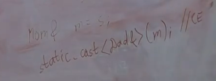

## Курс лекций по программированию на C++ МФТИ ФПМИ 2023-24 учебный год, 1 курс, продвинутый поток.
[Плейлист](https://www.youtube.com/playlist?list=PLmSYEYYGhnBviRYhIDty-CSTDS16a3whl)

# Лекция 1
- общие слова о C и C++
- статическая и динамическая типизация
- основные типы данных и операции над ними


# Лекция 2
## Неявные преобразования типов
- integer promotions (повышают диапозон значений)
```cpp
char + int = int
int + long long = long long
// !но
int + unsigned int = unsigned int
```
- floating point promotions (так же)
- bool <- int
- int <-> float (-> с отбрасываеним дробной части)


# Лекция 3
## Области видимости
- scope - фигурные скобки, также есть один глобальный scope
```cpp
namespace N {
    int x;
}

int main() {
    std::cout << N::x;
    using N::x; // притащили x в наш scope
    std::cout << x;
}

using namespace N; // притащили глобально весь namespace
```
- ODR (one definition rule)\
Каждая использумая сущность в программе должна быть 1 раз определена. Но объявлять можно сколько угодно раз. Класс можно определить несколько раз, если все определения дословно идентичны.
```cpp
// объявление - сколько угодно
void f(int x);
void f(int x);

// определение - только 1
void f(int x) {
    //...
}
```

- перегрузка функций (function overloading)
```cpp
int f();
int f(int x);
int f(double x);
// должны отличаться принимаемые типы!
```

- statements


- логические операторы
    - ленивые вычисления
    - branch prediction
    

- lvalue, rvalue\
в самом простом приближении (на самом деле всё сложнее):\
lvalue - ему можно что-то присвоить\
rvalue - нельзя


# Лекция 4
## Выражения и операторы
- лево и право ассоциативные
- [приоритет операторов](https://en.cppreference.com/w/cpp/language/operator_precedence)
- [order of evaluation](https://en.cppreference.com/w/cpp/language/eval_order)
- sequenced before rules


# Лекция 5
## Ошибки
- compilation errors
- лексические ошибки
- синтаксические ошибки
- семантические ошибки
- runtime error
- undefined behaviour (большая беда языка)
- the as-if rule (компилятор имеет право как угодно менять действия нашей программы, только чтобы наблюдаемое поведение корректной программы оставалось таким же)
- warinings


# Лекция 6
## Указатели
- `*` и `&`
```cpp
int x = 10;
int* p = &x;
std::cout << *p;

void* vp = &x;
// (для приведения типов)
```

- `nullptr`
```cpp
NULL // in C
nullptr // in C++
```


# Лекция 7
## Память
- статическая
- динамическая
- автоматическая
- стек: примерно 8мб


на самом деле вот так:


- static\
проинициализируется, когда в 1 раз зайдем в функцию
```cpp
void f() {
    static int x = 0; // тоже в статической памяти
    //...
}
```

- динамическая память\
операторы `new`, `delete`
```cpp
int* p = new int;
delete p;

int* pa = new int[1000];
delete[] pa;
```


# Лекция 8
## Массивы
```cpp
int a[10];
int b[3] = {1, 2, 3};
int c[] = {1, 2, 3}; // можно не указывать размер
int d[5] = {}; // заполнятся нулями
int* e[10]; //  массив из 10 указателей на int
int (*f)[10]; // указатель на массив из 10 int
```
- указатели на функцию\
function to pointer conversion
```cpp
bool cmp(int x, int y) {
    return x < y;
}

int main() {
    // можно не писать &, можно просто указать название функции
    bool (*p) (int, int) = &cmp; 
    std::cout << (void*)p;
}
```

как читать указатели? (начало лекции 9)\
идем вправо, потом влево. затем поднимаемся на уровень выше. и повторяем
```cpp
void (*pf)(int); // указатель на функцию, которая принимает int, а возвращает void
// 0) начинаем с названия, pf это:
// 1) -> пусто; <- указатель
// 2) ^
// 3) -> на фукнцию, которая принимает int; <- а возвращает void
```
если справа видим круглые скобки, то это функция\
например, в шаге 3) `(int)`

```cpp
void (*pfa[10])(int); // массив из 10 указателей на функцию, которая принимает int, а возвращает void 
// 0) начинаем с названия, pfa это:
// 1) -> массив из 10; <- указателей
// 2) ^
// 3) -> на фукнцию, которая принимает int; <- а возвращает void
```

```cpp
void (*(*pff[10])(int))(int); // массив из  10 указателей на функцию, которая принимает int, а возвращает указатель на другую функцию, которая принимает int, а возвращает void 

// 0) начинаем с названия, pff это:
// 1) -> массив из 10; <- указателей
// 2) ^
// 3) -> на фукнцию, которая принимает int; <- а возвращает указатель
// 4) ^
// 5) -> на фукнцию, которая принимает int; <- а возвращает void
```
[полезная ссылка](http://www.unixwiz.net/techtips/reading-cdecl.html)

- аргументы по умолчанию\
только последние

```cpp
void point(int x = 3, int y = 4) {}
```

- variadic functions (легаси)\
любое число аргументов
```cpp
void simple_printf(const char* fmt...) {}
```


# Лекция 9
## Ссылки (references)
- амперсанд после типа
- можно считать, что это новое имя старого объекта
- на низком уровне реализуется через указатель, но не всегда
```cpp
int x = 5;
int& y = x; // ссылка на x
int& t = y; // тоже ссылка на x, нет ссылки на ссылку
sizeof(y); // = sizeof(x)
&y; // = &x
int& r; // нельзя без инициализации
```

- `error: call of overloaded ‘f(int&)’ is ambiguous`. не можем различить, вызываться от оригинального объекта, или от ссылки
```cpp
void f(int& y) {
    ++y;
}
void f(int x) {
    ++x;
}
int main() {
    int x = 5;
    int& y = x;
    f(y);
    f(x);
}
```

- ссылку нельзя проинициализировать через rvalue
- формально говоря `++x` возвращает `int&`, также и с разыменованием указателя `*p` (в си это не так, там нет такого понятия. но в плюсах можно думать об этом так)
- lvalue to rvalue conversion
```cpp
int& g(int& x) {/*...*/}
int main() {
    int x = 10;
    int t = g(x); // g(x) - lvalue, но используем как rvalue 
}
```
- нельзя путать (ну это skill issue)\
\
и нельзя путать с `int&&` (rvalue-ссылка)

- dangling reference\
возвращаем ссылку, но такого объекта уже нет
```cpp
int& f(int& x) {
    int y = ++x;
    return y;
}
int main() {
    int x = 0;
    int& y = f(x); // UB
}
```

- static (аналогично глобальные переменные)
```cpp
int& f() {
    static int y = 0;
    return y; // y существует всё время работы программы
}
int main() {
    int& y = f(); // OK
}
```

- указатель (шок контент)
```cpp
int& f() {
    int* p = new int(1);
    return *p;
}
int main() {
    int& x = f();
    delete &x; // OK
}
```

- можно:
    - ссылка на указатель
    - ссылка на массив
    ```cpp
    int a[10];
    int (&b)[10] = a;
    // читается так же, как в прошлой лекции
    ```
    - ссылка на функцию
    ```cpp
    void f(int);
    void (&g)(int) = f;
    ```
- нельзя:
    - указатель на ссылку (нет такого типа. но можно создать указатель на исходный объект)
    - массив ссылок
    - вектор ссылок (т.к. там указатель на `T`)


# Лекция 10
## Константы
- интуиция: другой тип, у которого отсутствует часть операций исходного типа (модифицирующих)
```cpp
const int c = 2;
с = 2; // CE
int const a = 10; // можно писать const справа
```
- указатели
```cpp
int x = 5;
int* p = &x;

const int* pc = p; // указатель на const int
int* const cp = p; // const указатель на int 
const int* const cpc = p; // const указатель на const int
```
- неявное преобразование константности `int* -> const int*`. в обратную сторону нельзя.\
но это всего лишь запрет на некоторые операции, а не запрет, что объект не поменяется.
```cpp
int x = 5;
const int* p = &x;
++x;
std::cout << *p; // увидим новое значение
```

- аналогично, ссылки
```cpp
int x = 5;
const int& r = x; // новое название для x, с ограниченными правами
int& const rc = x; // CE. ссылка сама по себе не может быть переставлена на что-то другое, по этому не бывает константных ссылок
```

- константные ссылки (в смысле ссылка на const объект), (используются для передачи аргументов, если не собираемся менять объект).\
!!! Lifetime expansion: обычные ссылки инициализировать через rvalue нельзя, а константные можно. Создаётся временный объект. Компилятор считает это имя оригинальным именем объекта. Когда эта ссылка выйдет из области видимости, тогда объект уничтожится.
```cpp
void f(const std::string& s) {/*...*/}

int main() {
    f("asdf"); // OK
    const int& x = 5; // тоже OK
}
```
[советы про const](https://isocpp.org/wiki/faq/const-correctness)


# Лекция 11
## [Приведения типов](../casting/theory.md)

## Стадии сборки
1) препроцессинг
    - директивы `#include`, `#define`, `#if`, `#pragma`, ...
    - `.cpp -> .cpp`, но без директив
2) комплиция
    - получаем ассемблер код
    - `.cpp -> .s`
3) ассемблирование
    - получаем объектный файл с бинарным кодом
    - `.s -> .o` (или динамические `.so`, `.dll`)
4) линковка
    - собирает объектные файлы в исполняемый файл
    - резолвим вызовы всех функций
    - `.o -> executable`


# Лекция 12
## ООП
- выравнивание полей\
1-байтные переменные кладутся по адресам, кратным 1\
2-байтные переменные кладутся по адресам, кратным 2\
4-байтные переменные кладутся по адресам, кратным 4\
8-байтные переменные кладутся по адресам, кратным 8\


The alignment of the struct is the alignment of the most-aligned field in it
```cpp
struct S {
    int x = 1;
    double d = 3.14;
};
// 16 байт (4 int, 4 padding, 8 double)
```
- гарантируется порядок полей в структуре
- аггрегатная инициализация
```cpp
struct S {
    int x = 1;
    double d = 3.14;
};
int main() {
    S s{2, 4.5};
}
```
можно с именами, но в таком же порядке!
```cpp
struct xyz {
    int a;
    int b;
    int c;
};
int main() {
    xyz klm = { .a = 99, .c = 100 };
}
```

- методы
```cpp
struct S {
    void f(int x);
    void g(int y) {
        //...
    }
};
void S::f(int x) {/*...*/} // qualified id
```
- this - указатель на объект\
`->` обращение к полю/методу по указателю

- inner class
```cpp
struct A {
    int x = 1;
    double d = 3.14;
    struct AA {
        char c;
    };
};
int main() {
    A::AA a;
}
```

```cpp
struct A {
    int x = 1;
    double d = 3.14;
    struct AA { // можно даже без названия - анонимная структура
        char c;
    } a;
};
int main() {
    A::AA a;
}
```

- local class
```cpp
int main() {
    struct S {
        int x = 1;
        int y = 2;
    };
    S s;
}
```

## Модификаторы доступа
- классы и структуры\
в плюсах почти нет разницы. в структуре по умолчанию всё публичное, в классе приватное
```cpp
class C {
    int x;
};
int main() {
    C c;
    c.x; // CE
}
```
- public, private\
к private можем обращаться только внутри методов
- protected обсудим позже
- !! приватность проверяется после перегрузки


# Лекция 13
## Друзья
- функции или классы, которые не являются членами нашего класса, но им разрешен доступ к приватной части\
объявляем через friend в любом месте внутри класса (определить можно и внутри, и снаружи)
```cpp
class C {
private:
    int x{5};
    friend void g(C, int);
    friend class CC; // все методы этого класса будут друзьями
};

void g(C c, int y) {
    std::cout << c.x + y << "\n";
}
```

## Конструкторы
```cpp
class Complex {
    double re = 0.0;
    double im = 0.0;
public:
    Complex (double real) {
        re = real;
    }
};
int main() {
    // здесь 4 раза вызывается одинаковый конструктор
    Complex c(5.0);
    Complex c2 = 6.0;
    // если есть хоть 1 конструктор, то аггрегатная инициализация перестаёт работать
    Complex c3{7.0};
    Complex c4 = {8.0};
}
```

- uniform initialization
```cpp
struct Coord { int x, y; };
struct BadGrid { BadGrid(int width, int height); };
struct GoodGrid { explicit GoodGrid(int width, int height); };
```

[статья 1](https://quuxplusone.github.io/blog/2019/02/18/knightmare-of-initialization/)
[статья 2](https://quuxplusone.github.io/blog/2022/06/03/aggregate-parens-init-considered-kinda-bad/)

- member initializer list
```cpp
class Complex {
    double re = 0.0;
    double im = 0.0;
public:
    // re не проинициализируется 0 по умолчанию
    // это выполнится перед конструктором
    Complex (double re) : re(re) {}
    Complex (double re, double im) : re(re), im(im) {} // желательно писать в таком же порядке
};
```

- std::initializer_list (C++11)
```cpp
class String {
    char* arr = nullptr;
    size_t sz = 0;
    size_t cap = 0;
public:
    String() {} // default constructor
    
    String(size_t n, char c) : arr(new char[n+1]), sz(n), cap(n+1) {
        std::fill(arr, arr+n, c);
        arr[sz] = '\0';
    }

    String(std::initializer_list<char> list)
        : arr(new char[list.size()])
        , sz(list.size())
        , cap(sz+1)
    {
        std::copy(list.begin(), list.end(), arr);
        arr[sz] = '\0';
    }
};

int main() {
    String s; // default initialization
    String s2 = {'a', 'b', 'c'};
    String s3 = {2, 'b'}; // тоже вызовется от std::initializer_list
    // !! но если бы его не было, вызвался бы String(size_t n, char c)
}
```

- если не объявили конструкторы, то компилятор сгенерирует сам конструктор по умолчанию (он будет просто инциализировать поля по умолчанию). Если объявили хоть один конструктор, то комплиятор не будет этого делать. Но можно попросить (C++11)
```cpp
class String {
    char* arr = nullptr;
    size_t sz = 0;
    size_t cap = 0;
public:
    String() = default; // explicitly declared, implicitly defined
    
    String(size_t n, char c) : arr(new char[n+1]), sz(n), cap(n+1) {
        memset(arr, c, n);
        // std::fill(arr, arr+n, c);
        arr[sz] = '\0';
    }
};
```

- или можно запретить генерировать (C++11)
```cpp
class C {
//...
    C() = delete;
};
```

- но не всегда может сгенерироваться конструктор по умолчанию
```cpp
class C {
    // не знаем как проинициализировать по умолчанию
    int& r;
    const int c;
};
```

## Деструкторы
- вызываются в обратном порядке констуркторам (как стек). Сначала выполняется код деструктора нашего класса, а потом его полей.
```cpp
~String() {
    delete[] arr;
}
```

## Конструктор копирования
- генерируется по умолчанию (просто копирует поля). Причем даже если есть и другие конструкторы
- константная ссылка, хотя можно и без const
- так же лучше делать с member initializer list
```cpp
String(const String& other)
    : arr(new char[other.cap])
    , sz(other.sz)
    , cap(other.cap)
{
    memcpy(arr, other.arr, sz+1);
}

int main() {
    String s(2, 'a');
    String s2 = s; // конструктор копирования

    String s3 = s3; // UB
}
```
## Делегирующие конструкторы (C++11)
- вызываем только 1 конструктор и нельзя использовать member initializer list
```cpp
class String {
    char* arr = nullptr;
    size_t sz = 0;
    size_t cap = 0;

    String(size_t n, char c) : arr(new char[n+1]), sz(n), cap(n+1) {
        arr[sz] = '\0';
    }
public:
    String() = default;

    String(size_t n, char c) : String(n) {
        memset(arr, c, n);
    }
    String(std::initializer_list<char> list) : String(list.size()) {
        std::copy(list.begin(), list.end(), arr);
    }
    String(const String& other) : String(other.sz) {
        memcpy(arr, other.arr, sz+1);
    }
};
```

## Оператор присваивания
```cpp
String& operator=(const String& other) {
    if (this == other) { // в таком случае обязательно надо проверять!
        return *this;
    }
    delete[] arr;
    sz = other.sz;
    cap = other.cap;
    arr = new char[other.cap];
    memcpy(arr, other.arr, sz+1);
    return *this;
}
```

- тоже можно попросить сгенерировать (но тоже не всегда получится)
- идиома copy and swap
```cpp
void swap(String &other) {
    std::swap(arr, other.arr);
    std::swap(sz, other.sz);
    std::swap(cap, other.cap);
}
String& operator=(const String& other) {
    String copy = other; // конструктор копирования
    swap(copy);
    return *this;
}
```
еще проще можно сделать так
```cpp
String& operator=(String other) { // конструктор копирования при вызове
    swap(other);
    return *this;
}
```
в таких случаях можно не делать проверку на присваивание самому себе

## Правило трех
Реккомендация по написанию классов: Если в классе есть нетривиальный конструктор копирования, или нетривиальный оператор присваивания, или нетривиальный деструктор, то нужно чтобы все 3 они были нами написаны.


# Лекция 15
## Const, mutable
- отсутствуют методы, которые явно не помечены, что должны присустствовать у константных объектов
```cpp
struct S {
    void f() {
        std::cout << "Hi!";
    }
};
int main() {
    const S s;
    s.f(); // CE
}
```

```cpp
struct S {
    void f() const {
        std::cout << "Hi!";
    }
};
int main() {
    const S s;
    s.f(); // OK
}
```
вывод: все методы, которые, предполагается, что будут вызваны у константных объектов, надо помечать const
- не имеет никакого отношения к конструкторам и деструкторам

- в const методах нельзя вызывать неконстантные операции у полей
```cpp
struct S {
    int x = 0;
    void f() const {
        ++x; // CE
        std::cout << "Hi!";
    }
};
```

- перегрузка
```cpp
struct S {
    void f() const {
        std::cout << 1;
    }
    void f() {
        std::cout << 2;
    }
};
```

- компилятор неявно навешивает const на все поля. Если это указатель, то он неявно превращается в const указатель (но не указатель на const!), то есть как будто появляется const справа. Однако на ссылку нельзя навесить const справа (подразумевается, что неизменными должны быть сами байты, которые кодируют ссылку, но не объект, на который она указывает). Поэтому для ссылок нет разницы между константным методом и обычным
```cpp
int x = 0;
struct S {
    int& r = x;
    void f(int y) const {
        r = y; // OK
    }
};
```
поэтому вот такой прикол
```cpp
struct S {
    int x = 1;
    int& r = x;
    void f(int y) const {
        r = y; // поменяет x в const методе
    }
};
```

- mutable (противоядие от const)
```cpp
struct S {
    mutable int x = 1;
    void f(int y) const {
       x = y;
    }
};
```

## Static
```cpp
struct S {
    static void f() {
        std::cout << "Hi!";
    }
};
int main() {
    S::f();
}
```

- нельзя внутри класса инициализировать неконстантные статические члены, но const можно
```cpp
struct S {
    static int x = 10; // CE
    const static int y = 5; // OK
};
int S::x = 1; // OK
```

- singleton 
```cpp
struct Singleton {
private:
    Singleton() {}
    static Singleton* ptr;

    Singleton(const Singleton&) = delete;
    Signleton& operator=(const Singleton&) = delete;
public:
    static Singleton& getObject() {
        if (ptr == nullptr) {
            ptr = new Singleton();
        }
        return *ptr;
    }
    // добавить деструктор
};
Singleton* Singleton::ptr = nullptr;

int main() {
    Singleton& s = Singleton::getObject();
}
```

## Приведение типов
- explicit запрещает неявную конверсию\
по кодстайлу рекомендуется делать так для конструкторов одного аргумента
```cpp
struct Latitude {
    double value;
    explicit Latitude(double value) : value(value) {}
};
```
также с aggregate initialization
```cpp
struct BadGrid {
    BadGrid(int width, int height);
};
struct GoodGrid {
    explicit GoodGrid(int width, int height);
};
int main() {
    BadGrid g1 = {10, 20}; // OK
    GoodGrid g2 = {10, 20}; // CE
}

```

- приведение типа к чему-то
```cpp
struct Latitude {
    double value;
    explicit Latitude(double value) : value(value) {}
    operator double() const { // к double
        return value;
    }
};
```

- но можно запретить неявную. Остается только явная (static_cast)
```cpp
struct Latitude {
    double value;
    explicit Latitude(double value) : value(value) {}
    explicit operator double() const { // запретили неявную
        return value;
    }
};
```

## Литеральные суффиксы
- их можно определять)
- `"sdfsadf"s // это std::string`


# Лекция 16
## Перегрузка операторов
```cpp
struct Complex {
    double re = 0.0;
    double im = 0.0;
    Complex(double re) : re(re) {}
    Complex(double re, double im) : re(re), im(im) {}

    Complex operator+(const Complex& other) const { // чтобы могли вызываться от const объектов
        return Complex(re + other.re, im + other.im);
    }
    // если определить внтури класса, то оператор не симметричный. запрещаем левому агрументу быть не объектом класса
};

int main() {
    Complex c(1.0);
    c + 3.14; // OK
    3.14 + c; // CE
}
```

```cpp
struct Complex {
    double re = 0.0;
    double im = 0.0;
    Complex(double re) : re(re) {}
    Complex(double re, double im) : re(re), im(im) {}
};

// здесь уже без const
Complex operator+(const Complex& a, const Complex& b) {
    return Complex(a.re + b.re, a.im + b.im);
}

int main() {
    Complex c(1.0);
    c + 3.14; // OK
    3.14 + c; // OK
}
```

- плохая реализация
```cpp
struct Complex {
    double re = 0.0;
    double im = 0.0;
    Complex(double re) : re(re) {}
    Complex(double re, double im) : re(re), im(im) {}

    // очень медленно на больших объектах
    Complex& operator+=(const Complex &other) {
        // 1) новый объект *this + other
        // 2) operator=
        *this = *this + other;
        return *this;
    }
};
Complex operator+(const Complex& a, const Complex& b) {
    return Complex(a.re + b.re, a.im + b.im);
}
```
надо `+` выражать через `+=`
```cpp
struct Complex {
    double re = 0.0;
    double im = 0.0;
    Complex(double re) : re(re) {}
    Complex(double re, double im) : re(re), im(im) {}

    Complex& operator+=(const Complex &other) {
        re += other.re;
        im += other.im;
        return *this;
    }
};

Complex operator+(const Complex& a, const Complex& b) {
    Complex result = a;
    result += b;
    return result;
}

int main() {
    Complex a(1.0);
    Complex b(2.0);
    Complex c(3.0);
    // так как мы явно не запретили присваиваивание для rvalue
    a + b = c; // OK
}
```
надо фиксить так (C++11)
```cpp
// применим только к lvalue
Complex& operator=(const Complex &other) &  {/**/}
// применим только к rvalue
Complex& operator=(const Complex &other) &&  {/**/}
```
- опять про копирования\
если возвращаем локальную переменную по значению наружу - RVO
```cpp
Complex operator+(const Complex& a, const Complex& b) {
    Complex result = a; // 1) копирование
    result += b;        // 2) в зависимости от объекта
    return result;      // 3) RVO - нет копирования
}

// так не сработает, не локальная переменная
Complex operator+(Complex a, const Complex& b) {
    return a += b;
}
```
- потоки вывода
```cpp
std::ostream& operator<<(std::ostream& out, const std::string& str) {/**/}
std::istream& operator>>(std::istream& in, std::string& str) {/**/}
```
- операторы сравнения
```cpp
bool operator<(const Complex& a, const Complex& b) {
    return a.re < b.re || a.re == b.re && a.im < b.im;
}
```
```
a > b  == b < a
a <= b == !(a > b)
a >= b == !(a < b)

a == b == !(a < b) && !(b < a)
a != b == a < b || b < a
// но лучше равенство определить руками
```
- operator spaceship (Three-way comparison) (C++20)\
partial_ordering (<, >, =, не сравним)\
weak_ordering (<, >, =)\
strong_ordering (<, >, =) и еще `a == b => f(a) == f(b)`
```cpp
struct Complex {
    double re = 0.0;
    double im = 0.0;
    Complex(double re) : re(re) {}
    Complex(double re, double im) : re(re), im(im) {}

    // по умолчанию - лексикографически
    std::weak_ordering operator<=>(const Complex& other) const = default;
};
```

```cpp
struct Complex {
    double re = 0.0;
    double im = 0.0;
    Complex(double re) : re(re) {}
    Complex(double re, double im) : re(re), im(im) {}

    std::weak_ordering operator<=>(const Complex& other) const {
        return std::weak_ordering::equivalent;
    }
    // operator== не доопределяется
};
```
- инкремент, декремент
```cpp
struct UserID {
    int value = 0;

    UserID& operator++() {
        ++value;
        return *this;
    }
    UserID operator++(int) {
        UserID copy = *this;
        ++value;
        return copy;
    }
}
```
- operator()
```cpp
// функтор
struct Greater {
    bool operator() (int x, int y) {
        return x > y;
    }
}
int main() {
    std::vector<int> v(10);
    std::sort(v.begin(), v.end(), Greater());
}
```

# Лекция 17
## Указатель на члены класса
```cpp
struct S {
    int x;
    double y;

    void f(int z) {
        std::cout << x + z;
    }
};

int main() {
    int S::* p = &S::x; // указатель на поле класса

    S s{1, 3.14};
    S* ps = &s;
    std::cout << s.*p; // достанет int из объекта
    std::cout << ps->*p; // то же самое, но по указателю

    void (S::* pf)(int) = &S::f; // указатель на метод класса
    (s.*pf)(3);
    (s->*pf)(5);
}
```

## Enums and enum classes
- enum
```cpp
enum E {
    White,
    Gray,
    Black
};

int main() {
    E e = White;
    int e1 = White; // OK
    std::cout << e; // OK
}
```
- enum class (C++11)
```cpp
enum class E {
    White,
    Gray,
    Black
};

int main() {
    E e = E::White;
    int e1 = E::White; // CE
    std::cout << e;    // CE
    // можно делать static_cast
}
```
- можно задать значения
```cpp
enum class E {
    White = 2,
    Gray = 9,
    Black= 6
};
```
- наследования
```cpp
enum class E : int8_t {
    White = 2,
    Gray = 9,
    Black= 6
};
```

## Наследования
- public, private, protected\
protected член класса доступен всем другим членам класса, друзьям и всем наследникам 
```cpp
struct Base {
protected:
    int x;
public:
    void f() {}
};

struct Derived : Base {
    int y;
    void g() {
        std::cout << x;
    }
}

int main() {
    Derived d;
    std::cout << d.x; // CE
}
```
- можно добавить модицикатор доступа при самом наследовании\
у классов по умолчанию родитель private, у структур public
```cpp
struct Derived : public Base {
    int y;
    void g() {
        std::cout << x;
    }
}

int main() {
    Derived d;
    std::cout << d.x; // CE
}
```
чтобы обратиться к полю, надо пройти через 2 двери. Надо и чтобы Derived не запрещал доступ к Base, и чтобы Base не запрещал доступ к своим полям.

- protected
```cpp
struct Granny {
    int x;
    void f() {}
};
struct Mom : protected Granny {
    int y;
    void g() {}
};
struct Son : Mom {
    int z;
    void h() {
        std::cout << x; // OK
    }
};
int main() {
    Son s;
    s.z; // OK
    s.y(); // OK
    s.x; // CE
}
```
- видимость и доступность полей и методов\
частное предпочтительнее общего
```cpp
struct Base {
    void f() {
        std::cout << 1;
    }
};
struct Derived : Base {
    void f() {
        std::cout << 2;
    }
};
int main() {
    Derived d;
    d.f(); // 2
}
```
Это не перегрузка функций. f() затмевает родительскую функцию. Функция из Base даже не рассматривается
```cpp
struct Base {
    void f(int) {
        std::cout << 1;
    }
};
struct Derived : Base {
    void f(double) {
        std::cout << 2;
    }
};
int main() {
    Derived d;
    d.f(0); // 2

    // но можно вызвать явно
    d.Base::f(0); // 1
}
```
тут было еще много разных душных кейсов, которые я не захотел записывать


# Лекция 18
## Размещение объектов в памяти
```cpp
struct Base {
    int x;
};
struct Derived : Base {
    double y;
};
int main() {
    std::cout << sizeof(Derived); // 16
    // 4 (int) + 4 (padding) + 8 (double)
}
```
- EBO (Empty Base Optimization)
```cpp
struct Base {
    void f() {}
};
struct Derived : Base {
    double y;
    void g() {}
};
int main() {
    std::cout << sizeof(Base);    // 1
    std::cout << sizeof(Derived); // 8
}
```
## Конструкторы, деструкторы при наследовании
Сначала создаётся объект родителя (инциализация полей + конструтор), только потом объект наследника (инициализация полей + конструктор)
```cpp
struct Base {
    int x;
    Base(int x) : x(x) {}
};
struct Derived : Base {
    int y;
    Derived(int y) : y(y) {}
};
int main() {
    Derived d = 3.14; // CE
    // нет нужного конструктора для Base
}
```
- явный вызов родительского конструктора
```cpp
struct Base {
    int x;
    Base(int x) : x(x) {}
};
struct Derived : Base {
    int y;
    Derived(int y) : Base(0), y(y) {}
};
int main() {
    Derived d = 3.14; // OK
}
```
- наследование конструкторов (C++11)
```cpp
struct Base {
    int x;
    Base(int x) : x(x) {}
};
struct Derived : Base {
    int y = 0;
    using Base::Base; // унаследовали конструктор из Base
};
```
конструкторы копирования и перемещения не наследуется

## Приведение типов при наследовании
основная идея наследования
```cpp
struct Base {
    int x;
};
struct Derived : Base {
    int y;
}
void f(Base& b) { // смотрим на Derived, как будто он Base
    cout << b.x;
}
int main() {
    Derived d;
    f(d);
}
```

аналогично для указателей
```cpp
void f(Base* b) {
    cout << b->x;
}
int main() {
    Derived d;
    f(&d);
}
```
можно и по значению
```cpp
// slicing (срезка при копировании)
// в новый объект явно скопируется та часть Base, которая внутри Derived
// вызовется нетривиальный конструктор копирования, если он есть
void f(Base b) {
    cout << b.x;
}
int main() {
    Derived d;
    f(d);
}
```

# Лекция 19
## [Приведение типов при наследовании](../oop/inheritance/theory.md#приведение-типов-при-наследовании)
- публичное наследование

possibly UB - при попытке обращения к полям и методам Derived будет UB
- приватное наследование\
если мы не член класса и не друг, нам недоступен тот факт, что Derived это на самом деле Base


## [Множественное наследование](../oop/inheritance/theory.md#multiple-inheritance)

- как располагается в памяти

- как должен работать каст\
сын - частный случай папы. Но адрес папы не такой, как адрес сына.
Подобъект папы начинается с адреса на 4 большего, чем сам исходный объект.

по этому неявный каст должен сдвинуть адрес.
Пример неявного каста одного указателя к другому, при котором численное значение адреса меняется

- если поля или методы называются одинаково
\
Если в сыне объявили метод f, то дальше поиск не пойдет, он затмевает родительские - уже разбирали.
Но если в сыне не будет метода f, то CE.
Причем если просто унаследовали 2 одинаковых метода, то ничего не будет.
Но если собираемся вызвать - уже CE.\

Тут Мещерин сказал, что будет перегрузка. Но её нет! Но можно явно вызвать нужный метод
```cpp
s.M::f(5);
s.D::f(3.14);
```
## [Diamond problem](../oop/inheritance/theory.md#diamond-problem-ромбовидное-наследование)


```cpp
Son s;
s.g; // CE - неоднозначность
s.Granny::g; // CE - неоднозначность
s.Mom::g; // OK
```
```cpp
Granny& g = s; // CE - неоднозначный каст
// нужно скастится к маме/папе, потом уже к бабушке
```
```cpp
// если в бабушке метод void f()
s.f(); // CE
```
- касты между родителями одного уровня
\
так как не понятно, как сдвинуть адрес. В зависимости от того, как перечислены
наследуемые классы, надо делать либо сдвиг вправо, либо сдвиг влево

- inaccessible base class\
к полям правой бабушки никак нельзя обратиться. Так не надо никогда делать\


- указатели на методы
\
но в чем тут проблема?

указатель на метод хранит не только указатель на функцию, но и сдвиг объекта (на сколько байт начало того объекта, чей это метод, сдвинуто относительно начала того объекта, от которого мы вызвались)

## [Виртуальное наследование](../oop/inheritance/theory.md#virtual-inheritance)
Хотим, чтобы если мы 2 раза унаследуемся от одного и того же прородитель с разными промежуточными родителями, то этот прородитель не дублировался

- virtual


- как это работает

ptr создается для тех классов, у которых есть виртуальный предок. ptr на самом деле указывает не сюда.
для каждого из типов в статической памяти будет создана некоторая структура данных, в которой будет для каждого виртуального предка будет статически указан сдвиг относительно начала объекта это предка - vtable


- при виртуальном наследовании static_cast вниз не работает\
не понятно, насколько сдвигаться - CE


- на самом деле таблица не одна на класс\
чтобы уметь кастоваться от папы к бабушке, надо знать не только оффсет бабушки относительно сына, но и оффсет нашего текущего объекта от реального начала объекта - top offset (так как папа лежит не первый, ему надо прыгнуть на 32 - его оффсет)

в маме top offset 0, в папе 16

- можно унаследовать класс один раз виртуально, другой раз не виртуально\

дальше опять куча примеров про какой-то бред


# Лекция 20
## [Виртуальные функции](../oop/polymorphism/theory.md#идея-виртуальных-функций)
```cpp
struct Base {
    void f() {
        std::cout << 1;
    }
};

struct Derived : Base {
    void f() {
        std::cout << 2;
    }
};

int main() {
    Derived d;
    Base& b = d;
    b.f(); // 1
}
```
но хотим, чтобы выполнялся частный случай
```cpp
struct Base {
    virtual void f() {
        std::cout << 1;
    }
};

struct Derived : Base {
    // можно так, но не обязательно
    // virtual void f() {
    void f() {
        std::cout << 2;
    }
};

int main() {
    Derived d;
    Base& b = d;
    b.f(); // 2
}
```
решение, какую функцию вызвать принимается в runtime\
но вот так будет настоящая копия
```cpp
int main() {
    Derived d;
    Base b = d;
    b.f(); // 1
}
```

- полиморфный тип - у которого хотя бы 1 виртуальная функция (или хотя бы одна виртуальная функция унаследована)

- деструктор
```cpp
struct Base {
    virtual void f() {
        std::cout << 1;
    }
};

struct Derived : Base {
    int* p = new int(0);
    void f() {
        std::cout << 2;
    }
    ~Derived(){
        delete p;
    }
};

int main() {
    Base* b = new Derived();
    delete b; // деструктор Base -> утечка памяти
}
```
вывод: деструктор нужно делать виртуальным
```cpp
struct Base {
    virtual void f() {
        std::cout << 1;
    }
    virtual ~Base() = default;
};
```
или без default, но тогда не сможем работать с объектом Base

- сигнатура должна совпадать полностью
```cpp
struct Base {
    void f() const {
        std::cout << 1;
    }
};

struct Derived : Base {
    void f() {
        std::cout << 3;
    }
};

int main() {
    Derived d;
    Base& b = d;
    b.f(); // 1
}
```
так же с возвращаемым типом

- [override](../oop/polymorphism/theory.md#override) может нас спасти (CE, если такой виртуальной функции нет у родителя) (C++11)\
!никак не влияет на поведение работы с виртуальными фукнциями, просто добавляет CE, если такой функции нет - подсказка для нас самих
```cpp
struct Derived : Base {
    void f() override {
        std::cout << 3;
    }
};
```

- [final](../oop/polymorphism/theory.md#final) - запрещает всем дальнейшим наследникам переопределять функцию (с такой же сигнатурой) (C++11)
```cpp
struct Derived : Base {
    void f() final {
        std::cout << 3;
    }
};
```
`final` автоматически означает `override`. поэтому из слов `virtual`, `override`, `final` всегда требуется только одно

- другой смысл для классов
```cpp
struct Derived final : Base {};
```
от Derived больше нельзя наследоваться

- private
```cpp
struct Granny {
    virtual void f() const {
        std::cout << 1;
    }
};

struct Mom : Granny {
private:
    void f() const override {
        std::cout << 2;
    }
};

struct Son : Mom {
    void f() const final {
        std::cout << 3;
    }
};

int main() {
    Mom m;
    Granny& g = m;
    g.f(); // 2
}
```
виртуальные функции это runtime явления, а приватность - compile time. в compile time никак нельзя определить, какая функция будет выбрала в runtime.

но!
```cpp
struct Granny {
private:
    virtual void f() const {
        std::cout << 1;
    }
};

struct Mom : Granny {
    void f() const override {
        std::cout << 2;
    }
};

struct Son : Mom {
    void f() const final {
        std::cout << 3;
    }
};

int main() {
    Mom m;
    Granny& g = m;
    g.f(); // CE
}
```
берем имя f() из бабушки, но оно приватно => CE

- [абстрактный класс](../oop/polymorphism/theory.md#abstract-classes-and-pure-virtual-function) - есть хотя бы 1 pure virtual функция\
аналог интерфейса
```cpp
struct Shape {
    virtual double area() const = 0; // pure virtual
    virtual ~Shape() = default;
};
```
нельзя создать объект абстрактного типа, но можно создавать ссылки и указатели такого типа на потомков

- но можно всё таки определить pure virtual функцию
```cpp
struct Shape {
    virtual double area() const = 0;
    virtual ~Shape() = default;
};

double Shape::area() {
    return 0.0;
}
```

- [полиморфизм](../oop/polymorphism/theory.md#что-такое-полиморфизм)
```cpp
struct Shape {
    virtual double area() const = 0;
    virtual ~Shape() = default;
};

struct Square : Shape {
    double a;
    Square(double a) : a(a) {}
    double area() const override {
        return a * a;
    }
};

struct Circle : Shape {
    double r;
    Circle(double r): r(r) {}
    double area() const override {
        return 3.14159265358 * r * r;
    }
};

int main() {
    std::vector<Shape*> v;
    v.push_back(new Square(1.0));
    v.push_back(new Circle(1.0));
    for (Shape* s : v) {
        std::cout << s->area() << "\n";
    }
    for (Shape* s : v) {
        delete s;
    }
}
```

- можно явно попросить вызвать родиельскую
```cpp
int main() {
    Circle c(1.0);
    c.Shape::area();
}
```

# Лекция 21
## [dynamic_cast](../casting/theory.md#5-rtti-and-dynamic_cast)
- dynamic_cast (runtime cast) - только для для полиморфных типов (исходный тип должен быть полиморфным)
```cpp
struct Base {
    virtual void f() {}
    virtual ~Base() = default;
};

struct Derived : Base {
    void f() override {}
};

int main() {
    Derived d;
    Base& b = d;
    dynamic_cast<Derived&>(b);
}
```
проверит, на самом ли деле под b лежит Derived&. иначе кинет std::bad_cast
```cpp
dynamic_cast<Derived*>(&b);
```
аналогично проверит, но вернет `nullptr`\
довольная дорогая операция

- можно делать каст от любого полиморфного типа к void*

- умеет кастовать вбок (от мамы к папе) (исходный тип должен быть полиморфным)

- можно делать dynamic_cast вверх, даже если тип не полиморфный (как и static_cast)

- можно делать dynamic_cast вниз при виртуальном наследовании от полиморфного типа

## RTTI
- в каждом объекте полиморфного типа хранится runtime type information

- оператор typeid\
возвращает std::type_info
```cpp
std::cout << typeid(b).name(); // название типа, который реально был под ссылкой
// const char*
```
работает и не для полиморфных типов\
type_info можно сравнивать

## [Расположение в памяти полиморфных объектов](../casting/theory.md#6-memory-layout-of-polymorphic-objects)
формально не является стандартом C++

- vtable


- наследования

каст от сына к бабушке должен сместить указатель (причем это умеет даже static_cast)\
обратно сделать dynamic_cast уже не получится, т.к. бабушка не полиморфна (но static_cast можно в обе стороны!)

# Лекция 22
## Множественное наследование

- обычное наследование

первый ptr общий для мамы и сына, второй для папы (они ведут в разные таблицы)

если вызываем f() из папы, но сам объект - сын, надо вычесть top offset, чтобы могли работать с полями сына

- виртуальное наследование

virtual offset - оффсет виртуального родителя от начала\
top offset - оффсет нашего объекта от реального начала

## [Проблемы с виртуальными функциями](../casting/theory.md#8-non-obvious-problems-with-virtual-functions)

- нельзя не определить виртуальную функцию (кроме pure virtual), так как компилятор должен сгенерировать vtable c указателем на функцию, а линкер не сможет ее найти

- из конструктора вызывается не виртуальная функция, а обычная

мне лень писать все примеры, потому что это полный бред. можно почитать по ссылке выше

## Некоторые статьи
[Multiple Inheritance Considered Useful](https://www.drdobbs.com/cpp/multiple-inheritance-considered-useful/184402074) - статья про множественное наследование и виртуальные функции (в 7 страницах ☠️)

[Shahar Mike's Web Spot](https://shaharmike.com/cpp/) - блог какого-то крутого чувака, где есть подробные статьи про vtables с разбором, как они работают и располагаются в памяти


# Лекция 23
## Шаблоны

- шаблоны функций
```cpp
template <typename T>
void swap(T& x, T& y) {
    T t = x;
    x = y;
    y = t;
}

template <typename T>
T max(T x, T y) {
    return x > y ? x : y;
}
// это, конечно, плохие реализации
```
можно писать
```cpp
template <class T> // old style
```
разницы нет, кроме очень редких случаев (не будем разбирать)

- шаблоны классов
```cpp
template <typename T>
class vector {
    T* arr;
    size_t sz;
    size_t cap;
};
```

- шаблоны using (C++11)
```cpp
template <typename T>
using mymap = std::map<T, T, std::greater<T>>;
```

- шаблоны переменных (constexpr) (C++14) - разберём позже
- концепты (C++20) - разберём позже

- выведение шаблонного параметра (Template argument deduction)
```cpp
int a = 0;
int b = 1;
swap(a, b); // можно не указывать явно
```
но вот так CE
```cpp
int a = 0;
long long b = 1;
swap(a, b); // не понятно, какой T имеется в виду
```

- кодогенерация - главная идея шаблонов!\
глядя на то, от каких T мы вызываемся, компилятор должен понять, какой код сгенерировать
```cpp
int a1 = 0, b1 = 1;
swap(a1, b1);

long long a2 = 0, b2 = 1;
swap(a2, b2);

swap(a1, a2); // CE
```
стадия генерации должна пройти целиком до того, как начнется стадия выбора версий !!! (дальше будет поправка)

но можно указать явно, какую версию использовать (без deduction)
```cpp
swap<long long>(a1, b1); // CE
```
теперь будет CE, из-за того, что нельзя проинициализировать неконстантную ссылку на long long через int, но если принимать по значению - OK (сделается каст от int к long long)

- с классами аналогично
```cpp
std::vector<int> v;
std::vector<double> v; // сгенерирует 2 абсолютно разных класса

v2 = v; // CE, нет конверсии от одного к другому
// т.к. это 2 абсолютно разных класса
```

## Перегрузка шаблонных функций

- частное лучше общего
```cpp
template <typename T>
void f(T x) {}

void f(int x) {} // идеальное соответствие типа

int main() {
    int x = 0;
    f(x); // OK, выберется 2 версия
}
```
(поправка к теме кодогенерации)\
на самом деле, если есть выбор между шаблонной версией и не шаблонной, то это решение принимается раньше - до того, как компилятор начинет генерировать шаблонную версию. в примере выше шаблонная версия не сгенерируется. (на самом деле это тоже не совсем правда, дальше будет 2 поправка)

!но, если частная версия не так хорошо подходит, как общая, то выберется общая
```cpp
template <typename T>
void f(T x) {}

void f(long long x) {}

int main() {
    int x = 0;
    f(x); // сгенерируется шаблонная для int
}
```
итого есть 2 правила:
1) частное лучше общего
2) не смотря на это, точное соответствие лучше чем хоть какой-то каст

но, опять же, можно указать явно
```cpp
template <typename T>
void f(T x) {
    std::cout << 1;
}

void f(int x) {
    std::cout << 2;
}

int main() {
    int x = 0;
    f<long long>(x); // 1
    f<int>(x); // 1, обязываем компилятор выбрать именно шаблонную версию
}
```
здесь нет deduction, поэтому всё проще

- шаблонные аргументы по умолчанию\
они должны быть последними, как и обычные аргументы у функций
```cpp
template <typename T = int>
void f(T x) {}
```

```cpp
template <typename T, typename U = int>
U f(T x) {
    return 0;
}
```
тогда при вызове можно указывать не все типы

- ссылки\
смысл ссылок в том, чтобы они были неотличимы от исходной переменной
```cpp
template <typename T = int>
void f(T& x) {
    std::cout << 1;
}

template <typename T = int>
void f(T x) {
    std::cout << 2;
}

int main() {
    int x = 0;
    f(x); // CE
}
```
здесь CE будет и без шаблонов\
но
```cpp
f(1); // 2
```

## Cпециализации шаблонов
- классы
```cpp
template <typename T>
class vector {
    T* arr;
    size_t sz;
    size_t cap;
};

// full specialization
template <>
class vector<bool> {
    char* arr;
    size_t sz;
    size_t cap;
};
```
в шаблонном префиксе указываем те аргументы, которые пригодятся для объяснения, какую именно специализацию хотим объявить (`template <>` - ничего не нужно для этой специализации), а дальше указываем саму специализацию справа от названия класса
```cpp
template <typename T, typename U>
class S {};

// partial specialization
template <typename T>
class S<T, T> {};
```
`template <typename T>` - нужен T

можно делать так
```cpp
template <typename T>
class S {};

template <typename T>
class S<T&> {};

template <typename T>
class S<const T> {};
```
но, нельзя переопределять классы с другим количеством шаблонных параметров
```cpp
template <typename T, typename U>
struct A {};

template <typename T> // CE
struct A {};
```
не существует перегрузки классов!

# Лекция 24
## Cпециализации шаблонов
- функции
```cpp
template <typename T, typename U>
void f(T, U) {
    std::cout << 1;
}

template <typename T>
void f(T, T) {
    std::cout << 2;
}

int main() {
    f(0, 0); // 2
}
```
вторая версия более частная

- окунаемся

для функций запрещена частичная специализация

но можно переопределять функцию с другим количеством шаблонных параметров (в отличии от классов), т.к. у функций есть перегрузка. здесь №2 не является специализацей №1

для функций можно делать только полную специализацию `template <>`. здесь №3 - специализация для №1, но №2 выигрывает, т.к. она исходно более частная, чем №1

```cpp
template <typename T, typename U>
void f(T, U) {
    std::cout << 1;
}
template <>
void f(int, int) {
    std::cout << 3;
}
template <typename T>
void f(T, T) {
    std::cout << 2;
}

int main() {
    f(0, 0); // 2
}
```
но, если поменять местами, №3 - уже специализация для №2. и тогда выигрывает ветка №2, а именно её специализация - №3

```cpp
template <typename T, typename U>
void f(T, U) {
    std::cout << 1;
}
template <typename T>
void f(T, T) {
    std::cout << 2;
}
template <>
void f(int, int) {
    std::cout << 3;
}

int main() {
    f(0, 0); // 3
}
```
помимо всего прочего, можно объявить вообще не шаблонную функцию
```cpp
template <typename T, typename U>
void f(T, U) {
    std::cout << 1;
}
template <typename T>
void f(T, T) {
    std::cout << 2;
}
template <>
void f(int, int) {
    std::cout << 3;
}
void f(int, int) {
    std::cout << 4;
}

int main() {
    f(0, 0); // 4
}
```
здесь у нас как бы 3 версии (ветки) перегрузки, у одной из которых есть ещё специализация: шаблонная версия №1 с 2 параметрами, шаблонная версия №2 с 1 параметром, обычная версия №4 - не шаблонная, а у шаблонной версии №2 есть частный случай - №3

(2 поправка к теме кодогенерации)\
на самом деле: компилятор смотрит на версии перегрузки (их здесь 3 - №1,№2,№4). но у некоторых из них ещё могут быть специализации (№2). тем не менее, компилятор сначала выбирает между версиями перегрузки, а потом уже решает, нет ли у неё специализации, подходящей для данного случая.

сначала из шаблонов выбирается наиболее подходящий шаблон или принимается решение, что шаблон не нужен вообще (как в последнем примере). потом в подходящий шаблон (если был выбран шаблон) подставляются аргументы, и решается, какая из специализаций подходит лучше всего. то есть генерируются версии для специализаций и делается перегрузка между тем, что получилось

последний пример
```cpp
template <typename T, typename U>
void f(T, U) {
    std::cout << 1;
}
template <>
void f(int, int) {
    std::cout << 3;
}
template <typename T>
void f(T, T) {
    std::cout << 2;
}
template <>
void f(int, int) {
    std::cout << 4;
}

int main() {
    f(0, 0); // 4
}
```
здесь №3 - специализация №1, №4 - специализация №2. при первом выборе версии перегрузки выберется №2, т.к. она более частная, а дальше выберется специализация №4, т.к. она лучшая

хыхы пон, удачи это запомнить

## Non-type template parameters (nttp)
не только типы могут быть параметрами шаблона

(в C++20 всё изменилось) - обсудим позже

- целочисленные типы, char, bool
```cpp
template <typename T, size_t N>
class array {
    T arr[N];
};

array<int, 100> a;
```

```cpp
template <size_t M, size_t N, typename Field = Rational>
class Matrix {};

template <size_t N, typename Field = Rational>
using SquareMatrix = Marix<N, N, Field>;

int main() {
    Matrix<5, 5> m;
    SquareMatrix<5> sm;
}
```
```cpp
template <size_t M, size_t K, size_t N, typename Field = Rational>
Matrix<M, N, Field> operator*(const Matrix<M, K, Field>& a, const Matrix<K, N, Field>& b);
```
можно перемножать только матрицы нужных размеров над одним полем, иначе CE

- можно подставлять только константы, известные в compile time
```cpp
int x = 5;
Matrix<x, x> m; // CE
```
```cpp
const int x = 5;
Matrix<x, x> m; // OK
Matrix<5, 5> m2; // OK
```
но, очевидно
```cpp
int x;
std::cin >> x;
const int y = x;
Matrix<y, y> m; // CE, 'y' is not usable in constant expression
```

- constexpr (C++11) - забегаем вперёд\
гарантирует, что значение переменной известно, в момент компиляции

```cpp
int x; cin >> x;
constexpr int y = x; // CE именно на этой строчке
Matrix<y, y> m;
```
строго говоря, в шаблоны мы можем передавать именно такие константы


## Шаблонные аргументы, которые сами являются шаблонами
Template template parameters

хотим указать, что шаблонным параметром является другой шаблонный класс

```cpp
template <typename T, template <typename> class Container>
class Stack {
    Container<T> container;
};
```
тут есть разница между class и typename. до C++17 надо было писать class. начиная с C++17 можно typename
```cpp
template <typename T, template <typename> typename Container>
class Stack {
    Container<T> container;
};
```
здесь Container это не конечный тип, а шаблон. его нужно параметризовать типом уже в теле класса
```cpp
template <typename T, template <typename, typename> typename Container = std::vector>
class Stack {
    Container<T, std::allocator<T>> container;
};
```

- адаптеры над контейнерами (`std::stack`, `std::queue`, `std::priority_queue`) принимают вторым шаблонным аргументом конкретный тип контейнера (`std::vector<T>`) из-за аллокатора. Без этого мы бы не смогли туда передавать контейнер без аллокатора, например свой кастомный контейнер

## Compile time вычисления

- Фиббоначи
```cpp
template <size_t N>
struct Fibonacci {
    static constexpr int value = Fibonacci<N-1>::value + Fibonacci<N-2>::value;
};
// template instantiation depth exceeds maximum of 900 (use ‘-ftemplate-depth=’ to increase the maximum)

int main() {
    std::cout << Fibonacci<20>::value;
}
```
`static` - хотим сделать поле частью типа, а не одного объекта
```cpp
template <size_t N>
struct Fibonacci {
    static constexpr int value = Fibonacci<N-1>::value + Fibonacci<N-2>::value;
};

template <>
struct Fibonacci<0> {
    static constexpr int value = 0;
};

template <>
struct Fibonacci<1> {
    static constexpr int value = 1;
};

int main() {
    std::cout << Fibonacci<20>::value; // O(n) по памяти и времени
}
```
на самом деле даже с -O0 такое оптимизируется
[godbolt](https://godbolt.org/z/6rWhjr4oT)
```cpp
main:
        push    rbp
        mov     rbp, rsp
        mov     esi, 6765
        mov     edi, OFFSET FLAT:std::cout
        call    std::basic_ostream<char, std::char_traits<char> >::operator<<(int)
        mov     eax, 0
        pop     rbp
        ret
```
- проверка числа на простоту
```cpp
template<int N, int D>
struct IsPrimeHelper {
    static constexpr bool value = N%D == 0 ? false : IsPrimeHelper<N, D-1>::value;
};

template<int N>
struct IsPrimeHelper<N, 1> {
    static constexpr bool value = true;
};

template<int N>
struct IsPrime {
    static constexpr bool value = IsPrimeHelper<N, N-1>::value;
};

template<>
struct IsPrime<1> {
    static constexpr bool value = false;
};

int main() {
    std::cout << IsPrime<257>::value; // O(n) по памяти и времени
}
```

- шаблонная переменная (C++14)
```cpp
template <int N>
const bool is_prime = IsPrime<N>::value; // метафункция

int main() {
    std::cout << is_prime<257>;
}
```

- static_assert\
только от константных выражений
```cpp
int main() {
    static_assert(is_prime<257>);
}
```
кидает CE, если false

# Лекция 25
## Dependent names
когда мы работаем с шаблонами, компилятор не всегда знает, является ли имя функцией, типом или чем-то другим, что приводит к потенциальным ошибкам при компиляции

```cpp
template <typename T>
struct S {
    using A = int;
};

template <>
struct S<double> {
    static const int A = 5;
};

// int x = 0;

template <typename T>
void f() {
    S<T>::A* x; // CE, error: dependent-name ‘S<T>::A’ is parsed as a non-type, but instantiation yields a type
}

int main() {
    f<int>();
}
```
в одной из версий шаблона имя может обозначать тип, а в другой переменную. `int* x` или `5*x` -> declaration или expression?
(представим, что есть глобальная переменная x)

- по дефолту компилятор считает, что все dependent names это expression

- перед зависимым именем надо писать `typename`, чтобы компилятор парсил его как названия типа, а не как expression

```cpp
template <typename T>
void f() {
    typename S<T>::A* x;
}
```
ещё пример
```cpp
template <typename T>
void printValue() {
    T::value_type x; // CE
}
```
```cpp
template <typename T>
void printValue() {
    typename T::value_type x; // OK, typename указывает компилятору, что это тип
}
```
начиная с C++20 количество контекстов, в которых он воспринимает это как переменную уменьшилось

- другая проблема
```cpp
#include <array>

template <typename T>
struct S {
    template <int N>
    using A = std::array<int, N>;
};

template <>
struct S<double> {
    static const int A = 5;
};

template <typename T>
void f() {
    typename S<T>::A<10> x; // CE (хотя в новых версиях g++ такой проблемы нет)
}

int main() {
    f<int>();
}
```
такое можно распарсить, как `A < 10 > x`. слова `typename` здесь не достаточно. оно заставляет компилятор считать это названием типа, но не шаблона

решение
```cpp
template <typename T>
void f() {
    typename S<T>::template A<10> x;
}
```
- ещё пример
```cpp
template <typename T>
struct S {
    template <int N>
    void foo(int) {}
};

template <typename T>
void bar(int x, int y) {
    S<T> s;
    s.foo<5>(x + y); // CE, error: invalid operands of types ‘<unresolved overloaded function type>’ and ‘int’ to binary ‘operator<’
}

int main() {
    bar<int>(2, 3);
}
```
аналогично, такое можно распарсить, как `s.foo < 5 > (x + y)`.

решение
```cpp
template <typename T>
void bar(int x, int y) {
    S<T> s;
    s.template foo<5>(x + y);
}
```

- пример с наследованием
```cpp
template <typename T>
struct Base {
    int x = 0;
};

template <>
struct Base<double> {};

template <typename T>
struct Derived : Base<T> {
    void f() {
        ++x; // CE, error: ‘x’ was not declared in this scope
    };
};
```
в зависимости от T, x может как присустствовать, так и отсутствовать в классе. может были либо полем, либо названием типа, либо названием метода.

решение
```cpp
template <typename T>
struct Derived : Base<T> {
    void f() {
        ++this->x;
    };
};
```
если хотим обратиться к полю шаблонного родителя, надо писать `this`.

или
```cpp
template <typename T>
struct Derived : Base<T> {
    void f() {
        ++Base<T>::x;
    };
};
```

- почитать ещё можно тут [cppreference](https://en.cppreference.com/w/cpp/language/dependent_name)

- two phase translation ([Two-phase name lookup](https://en.cppreference.com/w/cpp/language/two-phase_lookup))\
компилятор генерирует шаблонный код в 2 прохода. 1) до того, как мы подставили T. мы смотрим на синтаксис и базовые семантические проверки (имена, не зависимые от T). 2) после подстановки T. там всплывают другие ошибки. поэтому часто, если не использовали какой-то шаблонный код, то много ошибок компиляции может не найтись. но как только мы инстанцировали шаблон, выпадет куча ошибок.

## type_traits (C++11)

- метафункции - функции от типов\
функции (в обобщённом смысле), которые принимают типы и возвращают типы/значения
- [`std::is_same`](https://en.cppreference.com/w/cpp/types/is_same)

простейшая метафункция - хотим проверить, равны ли 2 типа
```cpp
template <typename T, typename U>
struct is_same {
    static constexpr bool value = false;
};

template <typename T>
struct is_same<T, T> {
    static constexpr bool value = true;
};

template <typename T, typename U>
void f(const T& x, const U& y) {
    // ...
    if constexpr (is_same<T, U>::value) { // C++17
        x = y; // здесь можно делать что-то, что применимо только к к одинаковым типам
    }
    // ...
}
```
можно через typeid, но в runtime. Но если никакого полиморфизма нет, то можно просто для разных пар T, U в compile time сгенерировать разный код

под `if constexpr` проверится compile time условие. Если оно ложно, код под ифом даже не сгенерируется для данной пары

если написать только `if`, но код ниже всё равно будет пытаться скомпилироваться, даже для разных типов. сама проверка произойдёт только в рантайме. поэтому код сверху даже не скомпилируется, т.к. нельзя присвоить инту строку


- [`std::remove_reference`](https://en.cppreference.com/w/cpp/types/remove_reference)
```cpp
template <typename T>
struct remove_reference {
    using type = T;
};

template <>
struct remove_reference<T&> {
    using type = T;
};

template <typename T>
void f() {
    typename remove_reference<T>::type x;
}
```

- [`std::remove_const`](https://en.cppreference.com/w/cpp/types/remove_cv)
```cpp
template <typename T>
struct remove_const {
    using type = T;
};

template <>
struct remove_const<const T> {
    using type = T;
};
```

- [`std::integral_constant`](https://en.cppreference.com/w/cpp/types/integral_constant)\
грубо говоря, просто константа конкретного типа
```cpp
template<class T, T v>
struct integral_constant {
    static constexpr T value = v;
    // ...
};
```
частные случаи для bool
```cpp
template< bool B >
using bool_constant = integral_constant<bool, B>;
```
```cpp
std::true_type  // std::integral_constant<bool, true>
std::false_type // std::integral_constant<bool, false>
```

- [`std::is_array`](https://en.cppreference.com/w/cpp/types/is_array)
```cpp
template<class T>
struct is_array : std::false_type {};
 
template<class T>
struct is_array<T[]> : std::true_type {};
 
template<class T, std::size_t N>
struct is_array<T[N]> : std::true_type {};
```
аналогично, как писали до этого. просто для простоты наследуемся от `std::true_type` и `std::false_type`

- [`std::is_member_pointer`](https://en.cppreference.com/w/cpp/types/is_member_pointer)
```cpp
template<class T>
struct is_member_pointer_helper : std::false_type {};
 
template<class T, class U>
struct is_member_pointer_helper<T U::*> : std::true_type {};
 
template<class T>
struct is_member_pointer : is_member_pointer_helper<typename std::remove_cv<T>::type> {};
```

- [`std::rank`](https://en.cppreference.com/w/cpp/types/rank) - размерность массива (количество скобок `[]`)
```cpp
template<class T>
struct rank : public std::integral_constant<std::size_t, 0> {};
 
template<class T>
struct rank<T[]> : public std::integral_constant<std::size_t, rank<T>::value + 1> {};
 
template<class T, std::size_t N>
struct rank<T[N]> : public std::integral_constant<std::size_t, rank<T>::value + 1> {};
```
- [`std::conditional`](https://en.cppreference.com/w/cpp/types/conditional) - тернарый мета оператор
```cpp
template <bool B, typename T, typename F>
struct conditional {
    using type = F;
};

template <typename T, typename F>
struct conditional<true, T, F> {
    using type = T;
};
```

- [`std::remove_extent`](https://en.cppreference.com/w/cpp/types/remove_extent) - удаляет все скобочки `[]` из типа (делает из массива обычный тип)
```cpp
template<class T>
struct remove_extent { using type = T; };
 
template<class T>
struct remove_extent<T[]> { using type = T; };
 
template<class T, std::size_t N>
struct remove_extent<T[N]> { using type = T; };
```

- [`std::decay`](https://en.cppreference.com/w/cpp/types/decay) - снимает с типа все возможные украшения

массив превращает в поинтер, функцию или ссылку на функцию в поинтер, остальное - `std::remove_cv`
```cpp
template<class T>
struct decay
{
private:
    typedef typename std::remove_reference<T>::type U;
public:
    typedef typename std::conditional< 
        std::is_array<U>::value,
        typename std::add_pointer<typename std::remove_extent<U>::type>::type,
        typename std::conditional< 
            std::is_function<U>::value,
            typename std::add_pointer<U>::type,
            typename std::remove_cv<U>::type
        >::type
    >::type type;
};
```

- [все функции](https://en.cppreference.com/w/cpp/header/type_traits)

это всё появилось в C++11, а также шаблонные using. в C++14 доопределили структуры, которые возвращали тип (`::type`), шаблонными using для удобства. но также в C++14 добавили шаблонные переменные. в C++17 доопределили структуры, которые возвращали значения (`::value`), шаблонными переменными

вот такой вот хихик

- лучше не использовать все эти структуры в чистом виде, а использовать шаблонные using (C++14)
```cpp
template <bool B, typename T, typename F>
using conditional_t = typename conditional<B, T, F>::type;
```
`_t` в конце

- а еще шаблонные переменные (C++17)
```cpp
template <typename T, typename U>
const bool is_same_v = is_same<T, U>::value;
```
`_v` в конце

## Variadic templates
- шаблоны с переменным количеством аргументов (C++11)
```cpp
template <typename... Types> // объявили пачку типов
void f(Types... tx) { // распаковали пачку типов
    // теперь tx это пачка переменных
    g(tx...); // её можно распаковать дальше
}
```
эти типы могут быть разными! при этом, пакет может быть и пустым
```cpp
void print() {} // база рекурсии

// хотя бы 1 аргумент должен быть
template <typename Head, typename... Tail>
void print(const Head& head, const Tail&... tail) {
    std::cout << head << ' ';
    print(tail...);
}

int main() {
    print(1, 2.0, "abc");
}
```

- `is_homogeneous`\
проверяет, что все типы в пакете одинаковые
```cpp
template <typename First, typename Second, typename... Types>
struct is_homogeneous {
    static constexpr bool value = std::is_same<First, Second> && is_homogeneous<Second, Types...>::value;
};

template <typename First, typename Second>
struct is_homogeneous<First, Second> {
    static constexpr bool value = std::is_same_v<First, Second>;
};
```
т.к. нельзя переопределять классы с другим количеством шаблонных параметров. поэтому здесь вторая стуктура - специализация первой с пустым пакетом аргументов

- оператор `sizeof...()` - в compile time возвращает размер пакета
```cpp
template <typename Head, typename... Tail>
void print(const Head& head, const Tail&... tail) {
    std::cout << sizeof...(tail) << " "; // размер
    print(tail...);
}
```
- такое можно делать и в C-стиле с помощью макросов [cppreference](https://en.cppreference.com/w/c/variadic)

- также статья [C++20 idioms for parameter packs](https://www.scs.stanford.edu/~dm/blog/param-pack.html), но для прочтения надо хорошо понимать нововведения C++20


# Лекция 26
## Выражения свёртки

- [Fold expressions](https://en.cppreference.com/w/cpp/language/fold) - C++17

берем expression, в котором фигурирует пакет и бинарным оператором его соединяем с многоточием. и это всё выполняется в compile time
```cpp
template <typename... Types>
struct all_pointers {
    static constexpr bool value = (std::is_pointer_v<Types> && ...);
    // обязательно скобки!
};
```
обозначает: для всех типов из пакета повторить `std::is_pointer_v` через конъюнкцию

- `is_homogeneous`

```cpp
template <typename Head, typename... Tail>
struct is_homogeneous {
    static constexpr bool value = (std::is_same_v<Head, Tail> && ...);
};
```
проверяем, что Head равен всем в Tail

- `print`
```cpp
template <typename... Types>
void print(const Types&... types) {
    (std::cout << ... << types);
    std::cout << "\n";
}

int main() {
    print();
    print(1, 2, "sdf");
}
```
можно через пробел
```cpp
template <typename... Types>
void print(const Types&... types) {
    ((std::cout << types << ' '), ...);
    std::cout << "\n";
}

int main() {
    print();
    print(1, 2, "sdf");
}
```

- как это раскрывается\
тут есть разная ассоциативность


## CRTP - [Curiously recurring template pattern](https://ru.wikipedia.org/wiki/Curiously_recurring_template_pattern)
[cppreference](https://en.cppreference.com/w/cpp/language/crtp)

```cpp
template <typename T>
struct Base {
    void interface() {
        // ...
        static_cast<T*>(this)->implementation();
        // ...
    }
    static void static_func() {
        // ...
        T::static_sub_func();
        // ...
    }
};

struct Derived : Base<Derived> {
    void implementation() {}
    static void static_sub_func() {}
};
```
`Base` знает, что `T` это его потомок. благодаря этому, мы можем имитировать поведение виртуальных функций

`interface()` определена у базового класса, но для разных `T` она себя ведёт по-разному.

в `Base` нельзя объявить объект типа `T` - получится циклическая зависимость. Но можно объявить `T*` или `T&`.

функция `Base<Derived>::interface()` известна компилятору, хотя и объявлена перед объявлением структуры `struct Derived`. Тем не менее, эта функция не инстанцируется до момента фактического вызова, который должен произойти после объявления `Derived`.

```cpp
template <typename T>
struct Base {
    void interface() {
        static_cast<T*>(this)->implementation();
    }
};

struct A : Base<A> {
    void implementation() {
        std::cout << "A::implementation()" << std::endl;
    }
};
struct B : Base<B> {
    void implementation() {
        std::cout << "B::implementation()" << std::endl;
    }
};

template <typename T>
void f(Base<T>& b) {
    b.interface();
}

int main() {
    A a;
    B b;
    f(a); // A::implementation()
    f(b); // B::implementation()
}
```
но это не совсем честный полиморфизм, потому что, например, нельзя сделать контейнер базового класса, в отличии от динамического полиморфизма
```cpp
int main() {
    A a;
    B b;
    std::vector<Base<?>> v;
    v.push_back(a);
    v.push_back(b);
    for (auto obj : v) {
        obj.interface();
    }
}
```

## [Expression templates](https://en.wikipedia.org/wiki/Expression_templates)
Способ создавать структуры, представляющие compile time вычисления, где выражения вычисляются по мере необходимости

Пример - складывание геометрических векторов. Если мы не хотим считать сумму векторов целиком, а только получить какой-то i-ый элемент (ленивое складывание)

Код можно посмотреть в википедии, не буду копировать его сюда

## Исключения
- `throw` - альтернативый способ выйти из функции на ряду с `return`
```cpp
int divide(int a, int b) {
    if (b == 0) {
        throw std::logic_error("Divide by zero!");
    }
    return a / b;
}
```
происходит раскрутка стека. уничтожаются локальные переменные в порядке, обратном созданию (как и при обычном выходе из функции), и мы выскакиваем на уровень выше.

в какой момент это прекращается?

-  `try+catch` - ловим исключение\
```cpp
try {
    divide(10, 0);
} catch (std::logic_error& err) {
    std::cout << err.what() << std::endl;
}
```
исключение может прилететь и из глубины, если его ещё никто не поймал. есть будет подходящий catch, то мы поймаем исключение. ловить можно по значению, ссылке, константной 

можно писать `catch(...)` - ловим любое исключение

исключения - очень тяжеловесная операция

- комментарий про раскручивание стека


- какие операторы стандартной библиотеки бросают исключения
    - `throw`
    - оператор `new` - `std::bad_alloc`
    ```
    terminate called after throwing an instance of 'std::bad_alloc'
    what():  std::bad_alloc
    Aborted (core dumped)
    ```
    [std::terminate](https://en.cppreference.com/w/cpp/error/terminate) - бросается рантаймом C++ если исключение брошено и не поймано (и много других пунктов)\
    [std::abort](https://en.cppreference.com/w/cpp/utility/program/abort) - бросается после terminate, просит ос убить программу с вердиктом abort (сишная функция)
    - `dynamic_cast` к ссылке - `std::bad_cast`
    - `typeid` от nullptr - `std::bad_typeid`

## Разница между исключением и runtime error
- runtime error
```cpp
try {
    std::vector<int> v;
    v[1'000'000] = 1; // Segmentation fault (core dumped)
} catch(...) {
    std::cout << "Caught!\n";
}
```
```cpp
int x; std::cin >> x;
try {
    std::cout << 5/x; // Floating point exception (core dumped)
} catch(...) {
    std::cout << "Caught!\n";
}
```
это не плюсовый exception! это исключительная ситуация процессора

`Segmentation fault`, `Floating point exception`, `Aborted` - виды RE, но далеко не все из них обусловлены плюсовыми exception. если падаем из-за плюсового exception, то низкоуровневая причина падения - `Aborted`.

плюсовые exception - уровень абстракции над этим всем. `std::runtime_error` - частный случай exception, который ничего не имеет общего с низкоуровнеывми RE ошибками

- иерархия исключений [cppreference](https://en.cppreference.com/w/cpp/error/exception)


обычно, logic_error - ошибка, в которой виноват пользователь. runtime_error - что-то пошло не так


# [Лекция 27](../RAII/theory.md)
более подробный текст по ссылке выше

- причины, почему программы падают


## Exceptions handling
```cpp
struct A {
    A() { std::cout << "A\n"; }
    A(const A&) { std::cout << "copy\n"; }
    ~A() { std::cout << "~A\n"; }
}; 

void f(int x) {
    A a;
    if (x == 0) {
        throw a;
    }
}

int main() {
    try {
        f(0);
    } catch (...) {
        std::cout << "caught!\n";
    }
}
```
объект скопируется в динамическую память (может быть в какую-то заранее выделенную статическую - это уже implementation defined) 
```
A
copy
~A
caught!
~A
```

если ловим по значению, будет ещё одно копирование - обратно на стек
```cpp
try {
    f(0);
} catch (A a) {
    std::cout << "caught!\n";
}
```
```
A
copy
~A
copy
caught!
~A
~A
```
по ссылке копирования не будет

- `bad_alloc`
```cpp
try{
    new int[400'000'000'000];
} catch (std::bad_alloc& ex) {
    std::cout << &ex << '\n';
}
```
под него резервируется память заранее в статической памяти (Emergency buffer)

- `throw` внутри `catch`
```cpp
try {
    f(0);
} catch (A& a) {
    throw a; // старый объект а уничтожится, создаётся новый
}
```
но можно кинуть дальше (наверх!) тот же объект
```cpp
try {
    f(0);
} catch (A& a) {
    throw;
}
```
если делаем throw, дальнейшие catch того же уровня игнорируются, ловить будут только catch уровнем выше
```cpp
try {
    try {
        f(0);
    } catch (A& a) {
        std::cout << "caught!" << &a << '\n';
        throw;
    }
} catch (A& a) {
    std::cout << "caught again!" << &a << '\n'; // такой же адрес
}
```
но если бы сделали `throw a;`, объект бы скопировался

- если исключение не ловится, то компилятор не гарантирует, что вызовутся деструкторы\
снова вставлю комментарий с прошлой лекции


- multiple catch

для catch не применяются правила перегрузки, не делается выбор, какая конверсия лучше. ловится ровно тот тип, который мы указали

2 исключения:
1) можно навесить `const`
2) можно ловить наследника по ссылке на родителя, или по значению (срезка)

нет никакой перегрузки, выбирается первый подходящий catch

```cpp
struct Mom {};
struct Son : Mom {};

int main() {
    try {
        Son s;
        throw s; // caught Mom
    } catch (Mom) {
        std::cout << "caught Mom";
    } catch (Son) {
        std::cout << "caught Son";
    } catch (...) {
        std::cout << "other";
    }
}
```
но если наследование приватное, то выведется `caught Son`, из main не можем использовать тот факт, что сын наследник мамы

тут ещё бредовые примеры, про множественное наследование

## RAII (Resource Acquisition Is Initialization)

рассмотрим проблему при владении ресурсом и исключениях
```cpp
void g(int y) {
    if (y == 0) {
        throw 1;
    }
}

void f(int x) {
    int* p = new int(x);
    g(*p);
    delete p;
}
```

для решения воспользуемся тем, что в языке есть деструкторы - сделаем обертку, которая будет освобождать память в деструкторе. тогда не важно каким образом мы выйдем из функции, delete всё равно будет вызван. такая обертка называется умным указателем

его нельзя явно копировать, потому что появится проблема множественно владения ресурсом и double free

можно явно запретить копирование - получим [std::unique_ptr](https://en.cppreference.com/w/cpp/memory/unique_ptr)
```cpp
template <typename T>
struct unique_ptr {
    T* p;
    unique_ptr(T* p): p(p) {}
    unique_ptr(const unique_ptr&) = delete;
    unique_ptr& operator=(const unique_ptr&) = delete;
    ~unique_ptr() { delete p; }
    T& operator*() {
        return *p;
    }
};
```
можно хранить счётчик ссылок - [std::shared_ptr](https://en.cppreference.com/w/cpp/memory/shared_ptr)

## Исключения в конструкторах
```cpp
struct A {
    A() { std::cout << "A"; }
    ~A() { std::cout << "~A"; }
};
struct S {
    A a;
    S(int x) {
        std::cout << "S";
        if (x == 0) throw 1;
    }
    ~S() { std::cout << "~S"; }
};

int main() {
    try {
        S s(0);
    } catch (...) {}
}
```
вызовется деструктор A, т.к. оно уже успело создаться
```
AS~A
```
но вот так будет утечка памяти
```cpp
struct S {
    A* a;
    S(int x) : a(new A()) {
        std::cout << "S";
        if (x == 0) throw 1;
    }
    ~S() {
        std::cout << "~S";
        delete a;
    }
};
```
решение - RAII

- исключение в списке инициализации
```cpp
struct A {
    A(int x) {
        std::cout << "A";
        if (x == 0) throw 1;
    }
    ~A() {
        std::cout << "~A";
    }
};

struct S{
    A a;
    A aa;
    A aaa;
    S(int x) a(1), aa(0), aaa(2) {
        std::cout << "S";
    ~S(){
        std::cout << "~S";
    }
};
```
вызовутся деструкторы всех тех полей, которые успели создаться уже к этому моменту, то есть а(1)

-  Function try block [cppreference](https://en.cppreference.com/w/cpp/language/try)
```cpp
struct S {
    A a;
    A aa;
    A aaa;
    S(int x) try : a(1), aa(0), aaa(2) {
        std::cout << "S";
    } catch (...) {
        std::cout << "caught!";
    }
    ~S(){
        std::cout << "~S";
    }
};
```
но что будет с таким объектом?
```cpp
int main() {
    S s(0);
}
```
если мы написали такой function try block в конструкторе, то автоматически делается throw из него, поэтому в main прилетит исключение

такое можно писать для любой функции
```cpp
void f() try {

} catch (...) {

}
```

## Исключения в деструкторах
это зло!

проблема в том, что деструктор сам по себе мог быть вызван по причине того, что было брошено исключение

до C++11 нельзя бросать исключение из деструктора, если деструктор был вызван по причине летящего исключения. начиная с C++11 просто нельзя бросать исключение из деструктора (вызывается terminate)

можно разрешить с помощью `noexcept(false)`
```cpp
~S() noexcept(false) {
    std::cout << "~S";
    throw 1;
}
```
но, если деструктор вызван по причине того, что было брошено исключение, то всё равно произойдет terminate
```cpp
try {
    S s(0);
    throw 1; // terminate
} catch(...) {}
```
как в деструкторе проверить, летит ли уже исключение?\
[std::uncaught_exception](https://en.cppreference.com/w/cpp/error/uncaught_exception) (deprecated in C++17, removed in C++20)\
[std::uncaught_exceptions](https://en.cppreference.com/w/cpp/error/uncaught_exception) (since C++17)

возможна ситуация, когда одновременно летит несколько exceptions


# Лекция 28
## Exception safety
есть 4 уровня безопасности относительно исключений ([cppreference](https://en.cppreference.com/w/cpp/language/exceptions)):

1) Nothrow (or nofail) exception guarantee — the function never throws exceptions.
2) Strong exception guarantee — If the function throws an exception, the state of the program is rolled back to the state just before the function call (for example, [std::vector::push_back](https://en.cppreference.com/w/cpp/container/vector/push_back)). (большинство фукнций стандартных контейнеров)
3) Basic exception guarantee — If the function throws an exception, the program is in a valid state. No resources are leaked, and all objects' invariants are intact. 
4) No exception guarantee — If the function throws an exception, the program may not be in a valid state: resource leaks, memory corruption, or other invariant-destroying errors may have occurred.

Generic components may, in addition, offer exception-neutral guarantee: if an exception is thrown from a template parameter (e.g. from the Compare function object of std::sort or from the constructor of T in std::make_shared), it is propagated, unchanged, to the caller.

- [Dynamic exception specification](https://en.cppreference.com/w/cpp/language/except_spec) (deprecated in C++11, removed in C++17)

до C++11 можно было писать так
```cpp
void f() throw {}
```
но сейчас так делать не надо

- [noexcept](https://en.cppreference.com/w/cpp/language/noexcept_spec) (C++11) - спецификатор

помечает функцию, как не кидающей исключение
```cpp
void f() noexcept {

}
```
если мы пишем noexcept, то мы обещаем, что мы не будем бросать исключения из своей функции, но можно делать так
```cpp
void f() noexcept try {

} catch (...) {

}
```
если из noexcept функции всё-таки брошено исключение, то произойдёт terminate

можно делать условный noexcept
```cpp
template <typename T>
void f() noexcept(std::is_reference_v<T>) {
}
```

- [noexcept](https://en.cppreference.com/w/cpp/language/noexcept) - оператор

в compile time проверяет, является ли данное выражение noexcept
```cpp
template <typename T>
void g() {}

int main(){
    std::cout << noexcept(g<int>()); // 0
}
```
для функций проверяет, помечена ли она noexcept, для стандартных операторов noexcept являются все, кроме new, dynamic_cast, typeid, throw

так можно помечать функцию noexcept в зависимости от условия
``` cpp
template <typename T>
void g() {}

template <typename T>
void f() noexcept(noexcept(g<T>())) {
}
```

- смысл `noexcept`

`operator[]` у вектора не noexcept, но он исключений не кидает

на самом деле, noexcept помечаются функции, которые в принципе не могут пойти неудачно. когда мы пишем noexcept или когда видим noexcept, то мы должны понимать это так, что ничего плохого не может произойти от вызова этого метода.

все деструкторы являются noexcept по умолчанию (С++11), этого слова явно не написано

## Внутреннее устройство vector
сейчас нас интересует только реализация `push_back`, остальные методы реализуются просто

рассмотрим самую простую реализацию, используя только уже изученные инструменты (приближенно к C++03)

- 1 проблема\
нужно научиться делать аллокацию, но не создавая объектов, сколько мы хотим
```cpp
template <typename T>
class vector {
    T* arr_;
    size_t sz_;
    size_t cap_;

public:
    void reserve(size_t newcap) {
        T* newarr = new T[newcap]; // вызываются конструкторы по умолчанию
        //...
    }

    void push_back(const T& value) {
        if (sz_ == cap_) {
            reserve(cap_ > 0 ? cap_ * 2 : 1);
        }
        //...
    }
};
```
такой код не работает для объектов, у которых нет конструктора по умолчанию
```cpp
struct S {
    int x;
    S(int x) : x(x) {}
};
```
с нашим уровнем знаний нельзя написать ничего лучше
```cpp
T* newarr = reinterpret_cast<T*>(new char[newcap * sizeof(T)]);
```

- 2 проблема\
нужно скопировать объекты их старой памяти в новую. мы пытаемся сделать присваивание сырым байтам, под `newarr[index]` ещё нет никакого объекта
```cpp
void reserve(size_t newcap) {
    T* newarr = reinterpret_cast<T*>(new char[newcap * sizeof(T)]);
    for (size_t index = 0; index < sz_; ++index) {
        newarr[index] = arr_[index]; // UB
    }
    //...
}
```
решение с `memcpy` не будет работать, если одно из полей объекта является указателем или ссылкой на другое его поле
```cpp
struct Strange {
    int x;
    int& r;
    Strange(int y) : x(y), r(x) {}
};
```
но такие объекты должны переживать реаллокацию\
спойлер: std::string является таким типом 

нужно по данному адресу вызвать конструктор данного типа (на сырой памяти)\
решение: оператор `placement new` [cppreference](https://en.cppreference.com/w/cpp/language/new)

```cpp
new(newarr + index) T(arr_[index]);
```

- 3 проблема\
как вызвать деструкторы для объектов в старой памяти
```cpp
void reserve(size_t newcap) {
    T* newarr = reinterpret_cast<T*>(new char[newcap * sizeof(T)]);
    for (size_t index = 0; index < sz_; ++index) {
        new(newarr + index) T(arr_[index]);
    }

    delete[] arr_; // удаляем массив char из newcap * sizeof(T) элементов
    //...
}
```
нужно руками вызвать деструкторы, и не только по этому. reserve можно вызывать не обязательно, когда sz == cap. можно сделать reserve, даже если массив не заполнен целиком. в этом случае нужно вызвать именно столько деструкторов, сколько было объектов

```cpp
for (size_t index = 0; index < sz_; ++index) {
    (arr_ + index)->~T();
}
delete[] reinterpret_cast<char*>(arr_);
```

по моему, можно сделать и так
```cpp
arr_[index].~T();
```

- 3 проблема - exception safety\
хотим безопасный относительно исключений reserve
```cpp
void reserve(size_t newcap) {
    if (newcap < cap_) {
        return;
    }

    T* newarr = reinterpret_cast<T*>(new char[newcap * sizeof(T)]);
    for (size_t index = 0; index < sz_; ++index) {
        new(newarr + index) T(arr_[index]);
    }

    for (size_t index = 0; index < sz_; ++index) {
        (arr_ + index)->~T();
    }
    delete[] reinterpret_cast<char*>(arr_);
    
    arr_ = newarr;
    cap_ = newcap;
}
```
1) если `new` кинет исключение, мы к этому моменту ещё ничего не испортили. так наверх и вылетим с исключением `std::bad_alloc`
2) `placement new` сам по себе не кидает исключение, но T может кинуть исключение в конструкторе. нужно удалить всё то, что мы успели скопировать
3) считаем, что деструкторы не кидают исключений
4) `delete` тоже не кидает исключений
```cpp
void reserve(size_t newcap) {
    if (newcap < cap_) {
        return;
    }

    T* newarr = reinterpret_cast<T*>(new char[newcap * sizeof(T)]);
    size_t index = 0;
    try {
        for (; index < sz_; ++index) {
            new(newarr + index) T(arr_[index]);
        }
    } catch (...) {
        for (size_t oldindex = 0; oldindex < index; ++oldindex) {
            (newarr + oldindex)->~T();
        }
        delete[] reinterpret_cast<char*>(newarr);
        throw;
    }

    for (size_t index = 0; index < sz_; ++index) {
        (arr_ + index)->~T();
    }
    delete[] reinterpret_cast<char*>(arr_);
    
    arr_ = newarr;
    cap_ = newcap;
}
```
но ведь мы писали push_back
```cpp
void push_back(const T& value) {
    if (sz_ == cap_) {
        reserve(cap_ > 0 ? cap_ * 2 : 1);
    }
    new(arr_ + sz_) T(value);
    ++sz_;
}
```
5) пытаемся положить на новое место новый элемент. а вдруг он кинет исключение. тогда надо всё вернуть как было.

вывод: выражать push_back через reserve - плохая идея. нужно в том же блоке try пытаться положить новый элемент

## `vector<bool>`
there is one impostor among us

operator[] возвращает не ссылку, а новый временный объект bit_reference. и ему можно присваивать

```cpp
std::vector<bool> v(10);
v[5] = true;
```

!пример ситуации, когда rvalue можно и нужно что-то присваивать

```cpp
template <>
class vector<bool> {
    char* arr_ = nullptr;
    size_t sz_ = 0;
    size_t cap_ = 0;

    struct BitReference {
        char* cell;
        uint8_t index;

        BitReference(char* cell, uint8_t index)
            : cell(cell), index(index) {}

        BitReference operator=(bool b) {
            if (b) {
                *cell |= (1 << index);
            } else {
                *cell &= ~(1 << index);
            }
            return *this;
        }

        operator bool() const {
            return *cell & (1 << index);
        }
    };
public:
    BitReference operator[](size_t index) {
        return BitReference(arr_ + index / 8, index % 8);
    }
};
```
[полный код с лекции](./code/lec28/vector.cpp)


# Лекция 29
опять немного про вектор

- инвалидация указателей/ссылок - UB\


## Внутреннее устройство deque
важное отличие `deque` от `vector` - он такими свойствами не обладает. это главное, почему он используется под капотом в `stack`, `queue`, `priority_queue`

как реализовать такой контейнер?

- храним внешний массив указателей на T - buckets


- когда первый или последний слой заполнены, реаллоцируем внешний массив


- внутренние массивы так же являются сырыми байтами, кладем элементы через `placement new`

- `operator[]` работает за `O(1)`, т.к. размер бакетов константный - это можно легко пересчитывать

- у дека нет `reserve`, `shrink_to_fit`

- [std::stack](https://en.cppreference.com/w/cpp/container/stack),
[std::queue](https://en.cppreference.com/w/cpp/container/queue), [std::priority_queue](https://en.cppreference.com/w/cpp/container/priority_queue) по умолчанию работают над деком

- почему в стеке `pop()` возвращает void а не T?\
чтобы возвращать T, его всегда нужно было бы куда-то скопировать

## [Итераторы](../iterators/theory.md)
более подробный текст по ссылке выше

не во всех контейнерах можно обращаться по индексу\
[итератор](https://en.cppreference.com/w/cpp/iterator) - тип, который позволяет делать обход последовательности (обобщение указателя). его также можно разыменовывать и инкрементировать

- типы итераторов
1) Input Iterator\
    `!=`, `->`
2) Forward Iterator\
    будем видеть одно и то же при проходах
3) Bidirectional Iterator\
    `--`
4) Random Access Iterator\
    `+=n`, `-=n`, `it1-it2`, `<`, `>`, `<=`, `>=`
5) Contiguous Iterator (C++17)\
    сплошной кусок памяти

есть ещё [output_iterator](https://en.cppreference.com/w/cpp/iterator/output_iterator) - в него можно писать, обсудим отдельно


- [range-based for](https://en.cppreference.com/w/cpp/language/range-for)
```cpp
std::set<int> s;
for (int x : s) {
    // x
}
```
означает
```cpp
for (std::set<int>::iterator it = s.begin(); it != s.end(); ++it) {
    // *it
}
```
на самом деле не совсем так, он запоминает изначальные being и end перед циклом

- [cppinsights.io](https://cppinsights.io/) - сайт, который удаляет весь синтаксический сахар

вот на самом деле, во что развернётся for из примера выше
```cpp
#include <set>

int main()
{
  std::set<int, std::less<int>, std::allocator<int> > s = std::set<int, std::less<int>, std::allocator<int> >();
  {
    std::set<int, std::less<int>, std::allocator<int> > & __range1 = s;
    std::_Rb_tree_const_iterator<int> __begin1 = __range1.begin();
    std::_Rb_tree_const_iterator<int> __end1 = __range1.end();
    for(; operator!=(__begin1, __end1); __begin1.operator++()) {
      int x = __begin1.operator*();
    }
    
  }
  return 0;
}
```

- [Named Requirements](https://en.cppreference.com/w/cpp/named_req) - некоторые свойства типов, которые формально описаны. в том числе, контейнеры и итераторы

- [Algorithms library](https://en.cppreference.com/w/cpp/algorithm) - алгоритмы стандартной библиотеки, работают с итераторами. название шаблонного параметра подсказывает нам, какой тип итератора нужен\
    - [std::sort](https://en.cppreference.com/w/cpp/algorithm/sort) требует Random Access Iterator
    - [std::next_permutation](https://en.cppreference.com/w/cpp/algorithm/next_permutation) требует Bidirectional Iterator
    - [std::lower_bound](https://en.cppreference.com/w/cpp/algorithm/lower_bound) нужен Forward Iterator. на самом деле бинпоиск работает логарифмическое время относительно операций над T (логарифмическое кол-во сравнений), сдвиги итератора не учитываются. для больших объектов (например, строки) может быть осмысленно сделать бинпоиск на связном списке, сэкономив кол-во вызовов операций сравнения. но для Random Access Iterator, оно будет делать `+=`

- как по итератору, понять его вид?

с C++11 есть `auto`, но это не всегда корректно
```cpp
template <typename InputIterator>
void find_most_often_number(InputIterator begin, InputIterator end) {
    auto x = *begin;
    // ...
}
```
например, для `vector<bool>` это bit_reference

есть набор метафункций для итераторов - [std::iterator_traits](https://en.cppreference.com/w/cpp/iterator/iterator_traits)

можно узнать тип
```cpp
template <typename InputIterator>
void find_most_often_number(InputIterator begin, InputIterator end) {
    typename std::iterator_traits<InputIterator>::value_type x = *begin;
}

int main() {
    std::vector<bool> vb(10);
    find_most_often_number(vb.begin(), vb.end());
}
```

также можно узнать, какая категория итератора [iterator_category](https://en.cppreference.com/w/cpp/iterator/iterator_tags) - пустые структуры (теги). они сделаны с наследованием для удобства проверки на равентсво категорий итератора


# Лекция 30
- [std::distance](https://en.cppreference.com/w/cpp/iterator/distance) - количество шагов от first до last\
если Random Access Iterator, то она работает за константное время, иначе за линейное

[std::is_base_of](https://en.cppreference.com/w/cpp/types/is_base_of) - является ли родителем

```cpp
template <typename Iterator>
typename std::iterator_traits<Iterator>::difference_type
distance(Iterator first, Iterator last) {
    if constexpr (std::is_base_of_v<
        std::random_access_iterator_tag,
        typename std::iterator_traits<Iterator>::iterator_category
    >) {
        return last - first;
    } else {
        int i = 0;
        for (; first != last; ++first) {
            ++i;
        }
        return i;
    }
}

int main() {
    std::vector<bool> vb(10);
    std::cout << ::distance(vb.begin(), vb.end());
}
```
можно без `if constexpr` средставми старого C++, но более костыльно - через перегрузку функций

- [std::advance](https://en.cppreference.com/w/cpp/iterator/advance) - двигает итератор на n шагов

- [std::prev](https://en.cppreference.com/w/cpp/iterator/prev), [std::next](https://en.cppreference.com/w/cpp/iterator/next) - двигает назад или вперёд на n шагов и возвращает итератор

## Реализация итераторов
будем дописывать [код вектора](./code/lec28/vector.cpp)
 с 28 лекции
```cpp
class iterator {
    T* ptr;

    iterator(T* ptr) : ptr(ptr) {}
public:
    iterator(const iterator&) = default;
    iterator& operator=(const iterator&) = default;

    T& operator*() const { return *ptr; }
    T* operator->() const { return ptr; } // вот такой костыль языка

    iterator& operator++() {
        ++ptr;
        return *this;
    }
    iterator& operator++(int) {
        iterator copy = *this;
        ++ptr;
        return copy;
    }
};
```
здесь под const iterator - подразумевается аналог константного указателя (поэтому `operator*` и `operator->` помечены const, но возвращают обычную ссылку! на T)

- const_iterator - аналог указателя на const\
он уже возвращает const ссылку на T
```cpp
class const_iterator {
    const T* ptr;

    const_iterator(T* ptr) : ptr(ptr) {}
public:
    const_iterator(const const_iterator&) = default;
    const_iterator& operator=(const const_iterator&) = default;

    const T& operator*() const { return *ptr; }
    const T* operator->() const { return ptr; }

    const_iterator& operator++() {
        ++ptr;
        return *this;
    }
    const_iterator& operator++(int) {
        const_iterator copy = *this;
        ++ptr;
        return copy;
    }
};
```
но как не копипастить это 2 раза?
```cpp
template <bool IsConst>
class base_iterator {
public:
    using pointer_type = std::conditional_t<IsConst, const T*, T*>;
    using reference_type = std::conditional_t<IsConst, const T&, T&>;
    using value_type = T;

private:
    pointer_type ptr;
    base_iterator(T* ptr) : ptr(ptr) {}

    friend class vector<T>;
public:
    base_iterator(const base_iterator&) = default;
    base_iterator& operator=(const base_iterator&) = default;

    reference_type operator*() const { return *ptr; }
    pointer_type operator->() const { return ptr; }

    base_iterator& operator++() {
        ++ptr;
        return *this;
    }
    base_iterator& operator++(int) {
        base_iterator copy = *this;
        ++ptr;
        return copy;
    }

    operator base_iterator<true>() const {
        return {ptr};
    }
};
```
последний итератор разрешает неявно кастоваться от неконстантного итератора к константному

затем в публичной части
```cpp
using iterator = base_iterator<false>;
using const_iterator = base_iterator<true>;

iterator begin() { return {arr_}; }
iterator end() { return {arr_ + sz_}; }

const_iterator begin() const { return {arr_}; }
const_iterator end() const { return {arr_ + sz_}; }
```
но есть ещё `cbegin`, `cend` - одинаковый для константного и неконстантного контейнера

```cpp
const_iterator cbegin() const { return {arr_}; }
const_iterator cend() const { return {arr_ + sz_}; }
```

- [std::reverse_iterator](https://en.cppreference.com/w/cpp/iterator/reverse_iterator) - отдельный класс в стандартной библиотеке

это адаптер над итератором, он хранит в себе итератор и разворачивает все действия в обратную сторону


т.е. `++` это `--` и наоборот, `*` или `->` это `current - 1`

так же раньше был [std::iterator](https://en.cppreference.com/w/cpp/iterator/iterator) (deprecated in C++17) - это другое, им не надо пользоваться (итераторы, это внутренние типы контейнеров!)

поэтому напишем
```cpp
using reverse_iterator = std::reverse_iterator<iterator>;
using const_reverse_iterator = std::reverse_iterator<const_iterator>;
```
`rbegin`, `rend`, `crbegin`, `crend` добавятся сами

- инвалидация итераторов\
аналогично - UB
```cpp
std::vector<int> v(10);
std::vector<int>::iterator x = v.begin() + 5;
v.push_back(1);
std::cout << *x;
```
соответственно это тоже UB
```cpp
std::vector<int> v = {1, 2, 3, 4, 5};
for (int& x : v) {
    v.push_back(x);
}
```
даже не смотря на то, что `begin` и `end` запоминаются заранее, вектор может сделать реаллокацию в теле цикла, и старые итераторы инвалидируются

- fun fact

[одно из свойств итератора вектора](https://en.cppreference.com/w/cpp/container/vector/swap), что мы должны уметь свапать векторы, но при этом чтобы итераторы сохранялись валидными

в деке указатели и ссылки не инвалидируются, но итераторы инвалидируются (нужно хранить указатель на элемент внешнего массива, но внешний массив может реаллоцироваться при `push_back`)

[итоговый код vector](./code/lec30/vector.cpp)

## Output iterator
```cpp
int a[10] = {1, 2, 3, 4, 5};
std::vector<int> v(5);
std::copy(a, a + 10, v.begin()); // UB
```
`copy` разыменовывает, присваивает и инкрементирует. он ничего не знает про то, что лежит под итератором

- `output iterator` гарантирует, что можно его разыменовывать, инкрементировать и присваивать сколько угодно раз

- [std::back_insert_iterator](https://en.cppreference.com/w/cpp/iterator/back_insert_iterator) - output итератор, который докладывает элементы в контейнер, для которого он сконструирован

```cpp
int a[10] = {1, 2, 3, 4, 5};
std::vector<int> v;
std::copy(a, a + 5, std::back_insert_iterator<std::vector<int>>(v));
for (int x : v) {
    std::cout << x << " "; // 1 2 3 4 5
}
```
как его реализовать?
```cpp
template <typename Container>
class back_insert_iterator {
    Container& container;
public:
    back_insert_iterator(Container& container) : container(container) {}

    back_insert_iterator& operator=(const typename Container::value_type& value) {
        container.push_back(value);
        return *this;
    }
    back_insert_iterator& operator++() { return *this; }
    back_insert_iterator operator++(int) { return *this; }
    back_insert_iterator& operator*() { return *this; }
};
```

также есть функция [std::back_inserter](https://en.cppreference.com/w/cpp/iterator/back_inserter), которая просто создаёт такой итератор, без указания шаблонного параметра
```cpp
template<class Container>
std::back_insert_iterator<Container> back_inserter(Container& c)
{
    return std::back_insert_iterator<Container>(c);
}
```
```cpp
std::copy(a, a + 5, std::back_inserter(v));
```

также есть [std::front_inserter](https://en.cppreference.com/w/cpp/iterator/front_inserter) и [std::inserter](https://en.cppreference.com/w/cpp/iterator/inserter)

[std::insert_iterator](https://en.cppreference.com/w/cpp/iterator/insert_iterator) принимает контейнер и итератор в контейнере, вызывает insert в этом контейнере, по данному итератору

