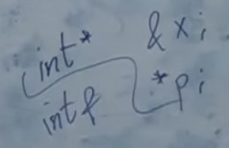

## Курс лекций по программированию на C++ МФТИ ФПМИ 2023-24 учебный год, 1 курс, продвинутый поток.
[Плейлист](https://www.youtube.com/playlist?list=PLmSYEYYGhnBviRYhIDty-CSTDS16a3whl)

# Лекция 1
- общие слова о C и C++
- статическая и динамическая типизация
- основные типы данных и операции над ними


# Лекция 2
## Неявные преобразования типов
- integer promotions (повышают диапозон значений)
```cpp
char + int = int
int + long long = long long
// !но
int + unsigned int = unsigned int
```
- floating point promotions (так же)
- bool <- int
- int <-> float (-> с отбрасываеним дробной части)


# Лекция 3
## Области видимости
- scope - фигурные скобки, также есть один глобальный scope
```cpp
namespace N {
    int x;
}

int main() {
    std::cout << N::x;
    using N::x; // притащили x в наш scope
    std::cout << x;
}

using namespace N; // притащили глобально весь namespace
```
- ODR (one definition rule)\
Каждая использумая сущность в программе должна быть 1 раз определена. Но объявлять можно сколько угодно раз. Класс можно определить несколько раз, если все определения дословно идентичны.
```cpp
// объявление - сколько угодно
void f(int x);
void f(int x);

// определение - только 1
void f(int x) {
    //...
}
```

- перегрузка функций (function overloading)
```cpp
int f();
int f(int x);
int f(double x);
// должны отличаться принимаемые типы!
```

- statements


- логические операторы
    - ленивые вычисления
    - branch prediction
    

- lvalue, rvalue\
в самом простом приближении (на самом деле всё сложнее):\
lvalue - ему можно что-то присвоить\
rvalue - нельзя


# Лекция 4
## Выражения и операторы
- лево и право ассоциативные
- [приоритет операторов](https://en.cppreference.com/w/cpp/language/operator_precedence)
- [order of evaluation](https://en.cppreference.com/w/cpp/language/eval_order)
- sequenced before rules


# Лекция 5
## Ошибки
- compilation errors
- лексические ошибки
- синтаксические ошибки
- семантические ошибки
- runtime error
- undefined behaviour (большая беда языка)
- the as-if rule (компилятор имеет право как угодно менять действия нашей программы, только чтобы наблюдаемое поведение корректной программы оставалось таким же)
- warinings


# Лекция 6
## Указатели
- `*` и `&`
```cpp
int x = 10;
int* p = &x;
std::cout << *p;

void* vp = &x;
// (для приведения типов)
```

- `nullptr`
```cpp
NULL // in C
nullptr // in C++
```


# Лекция 7
## Память
- статическая
- динамическая
- автоматическая
- стек: примерно 8мб


на самом деле вот так:


- static\
проинициализируется, когда в 1 раз зайдем в функцию
```cpp
void f() {
    static int x = 0; // тоже в статической памяти
    //...
}
```

- динамическая память\
операторы `new`, `delete`
```cpp
int* p = new int;
delete p;

int *pa = new int[1000];
delete[] pa;
```


# Лекция 8
## Массивы
```cpp
int a[10];
int b[3] = {1, 2, 3};
int c[] = {1, 2, 3}; // можно не указывать размер
int d[5] = {}; // заполнятся нулями
int* e[10]; //  массив из 10 указателей на int
int (*f)[10]; // указатель на массив из 10 int
```
- указатели на функцию\
function to pointer conversion
```cpp
bool cmp(int x, int y) {
    return x < y;
}

int main() {
    // можно не писать &, можно просто указать название функции
    bool (*p) (int, int) = &cmp; 
    std::cout << (void*)p;
}
```

как читать указатели? (начало лекции 9)\
идем вправо, потом влево. затем поднимаемся на уровень выше. и повторяем
```cpp
void (*pf)(int); // указатель на функцию, которая принимает int, а возвращает void
// 0) начинаем с названия, pf это:
// 1) -> пусто; <- указатель
// 2) ^
// 2) -> на фукнцию, которая принимает int; <- а возвращает void
```
если справа видим круглые скобки, то это функция\
например, в шаге 2) `(int)`

```cpp
void (*pfa[10])(int); // массив из 10 указателей на функцию, которая принимает int, а возвращает void 
// 0) начинаем с названия, pfa это:
// 1) -> массив из 10; <- указателей
// 2) ^
// 2) -> на фукнцию, которая принимает int; <- а возвращает void
```

```cpp
void (*(*pff[10])(int))(int); // массив из  10 указателей на функцию, которая принимает int, а возвращает указатель на другую функцию, которая принимает int, а возвращает void 

// 0) начинаем с названия, pff это:
// 1) -> массив из 10; <- указателей
// 2) ^
// 2) -> на фукнцию, которая принимает int; <- а возвращает указатель
// 3) ^
// 4) -> на фукнцию, которая принимает int; <- а возвращает void
```
[полезная ссылка](http://www.unixwiz.net/techtips/reading-cdecl.html)

- аргументы по умолчанию\
только последние

```cpp
void point(int x = 3, int y = 4) {}
```

- variadic functions (легаси)\
любое число аргументов
```cpp
void simple_printf(const char* fmt...) {}
```


# Лекция 9
## Ссылки (references)
- амперсанд после типа
- можно считать, что это новое имя старого объекта
- на низком уровне реализуется через указатель, но не всегда
```cpp
int x = 5;
int& y = x; // ссылка на x
int& t = y; // тоже ссылка на x, нет ссылки на ссылку
sizeof(y); // = sizeof(x)
&y; // = &x
int& r; // нельзя без инициализации
```

- `error: call of overloaded ‘f(int&)’ is ambiguous`. не можем различить, вызываться от оригинального объекта, или от ссылки
```cpp
void f(int &y) {
    ++y;
}
void f(int x) {
    ++x;
}
int main() {
    int x = 5;
    int& y = x;
    f(y);
    f(x);
}
```

- ссылку нельзя проинициализировать через rvalue
- формально говоря `++x` возвращает `int&`, также и с разыменованием указателя `*p` (в си это не так, там нет такого понятия. но в плюсах можно думать об этом так)
- lvalue to rvalue conversion
```cpp
int& g(int& x) {/*...*/}
int main() {
    int x = 10;
    int t = g(x); // g(x) - lvalue, но используем как rvalue 
}
```
- нельзя путать (ну это skill issue)\
\
и нельзя путать с `int&&` (rvalue-ссылка)

- dangling reference\
возвращаем ссылку, но такого объекта уже нет
```cpp
int& f(int& x) {
    int y = ++x;
    return y;
}
int main() {
    int x = 0;
    int& y = f(x); // UB
}
```

- static (аналогично глобальные переменные)
```cpp
int& f() {
    static int y = 0;
    return y; // y существует всё время работы программы
}
int main() {
    int& y = f(); // OK
}
```

- указатель (шок контент)
```cpp
int& f() {
    int* p = new int(1);
    return *p;
}
int main() {
    int& x = f();
    delete &x; // OK
}
```

- можно:
    - ссылка на указатель
    - ссылка на массив
    ```cpp
    int a[10];
    int (&b)[10] = a;
    // читается так же, как в прошлой лекции
    ```
    - ссылка на функцию
    ```cpp
    void f(int);
    void (&g)(int) = f;
    ```
- нельзя:
    - указатель на ссылку (нет такого типа. но можно создать указатель на исходный объект)
    - массив ссылок
    - вектор ссылок (т.к. там указатель на `T`)


# Лекция 10
## Константы
- интуиция: другой тип, у которого отсутствует часть операций исходного типа (моцифицирующих)
```cpp
const int c = 2;
с = 2; // CE
int const a = 10; // можно писать const справа
```
- указатели
```cpp
int x = 5;
int* p = &x;

const int* pc = p; // указатель на const int
int* const cp = p; // const указатель на int 
const int* const cpc = p; // const указатель на const int
```
- неявное преобразование константности `int* -> const int*`. в обратную сторону нельзя.\
но это всего лишь запрет на некоторые операции, а не запрет, что объект не поменяется.
```cpp
int x = 5;
const int* p = &x;
++x;
std::cout << *p; // увидим новое значение
```

- аналогично, ссылки
```cpp
int x = 5;
const int& r = x; // новое название для x, с ограниченными правами
int& const rc = x; // CE. ссылка сама по себе не может быть переставлена на что-то другое
```

- константные ссылки, (используются для передачи аргументов, если не собираемся менять объект).\
!!! Lifetime expansion: обычные ссылки инициализировать через rvalue нельзя, а константные можно. Создаётся временный объект. Компилятор считает это имя оригинальным именем объекта. Когда эта ссылка выйдет из области видимости, тогда объект уничтожится.
```cpp
void f(const std::string& s) {/*...*/}

int main() {
    f("asdf"); // OK
    const int& x = 5; // тоже OK
}
```
[советы про const](https://isocpp.org/wiki/faq/const-correctness)


# Лекция 11
## [Приведения типов](../casting/theory.md)

## Стадии сборки
1) препроцессинг
    - директивы `#include`, `#define`, `#if`, `#pragma`, ...
    - `.cpp -> .cpp`, но без директив
2) комплиция
    - получаем ассемблер код
    - `.cpp -> .s`
3) ассемблирование
    - получаем объектный файл с бинарным кодом
    - `.s -> .o` (или динамические `.so`, `.dll`)
4) линковка
    - собирает объектные файлы в исполняемый файл
    - резолвим вызовы всех функций
    - `.o -> executable`


# Лекция 12
## ООП
- выравнивание полей\
1-байтные переменные кладутся по адресам, кратным 1\
2-байтные переменные кладутся по адресам, кратным 2\
4-байтные переменные кладутся по адресам, кратным 4\
8-байтные переменные кладутся по адресам, кратным 8\


The alignment of the struct is the alignment of the most-aligned field in it
```cpp
struct S {
    int x = 1;
    double d = 3.14;
};
// 16 байт (4 int, 4 padding, 8 double)
```
- гарантируется порядок полей в структуре
- аггрегатная инициализация
```cpp
struct S {
    int x = 1;
    double d = 3.14;
};
int main() {
    S s{2, 4.5};
}
```
можно с именами, но в таком же порядке!
```cpp
struct xyz {
    int a;
    int b;
    int c;
};
int main() {
    xyz klm = { .a = 99, .c = 100 };
}
```

- методы
```cpp
struct S {
    void f(int x);
    void g(int y) {
        //...
    }
};
void S::f(int x) {/*...*/} // qualified id
```
- this - указатель на объект\
`->` обращение к полю/методу по указателю

- inner class
```cpp
struct A {
    int x = 1;
    double d = 3.14;
    struct AA {
        char c;
    };
};
int main() {
    A::AA a;
}
```

```cpp
struct A {
    int x = 1;
    double d = 3.14;
    struct AA { // можно даже без названия - анонимная структура
        char c;
    } a;
};
int main() {
    A::AA a;
}
```

- local class
```cpp
int main() {
    struct S {
        int x = 1;
        int y = 2;
    };
    S s;
}
```

## Модификаторы доступа
- классы и структуры\
в плюсах почти нет разницы. в стурктуре по умолчанию всё публичное, в классе приватное
```cpp
class C {
    int x;
};
int main() {
    C c;
    c.x; // CE
}
```
- public, private\
к private можем обращаться только внутри методов
- protected обсудим позже
- !! приватность проверяется после перегрузки


# Лекция 13
## Друзья
- функции или классы, которые не являются членами нашего класса, но им разрешен доступ к приватной части\
объявляем через friend в любом месте внутри класса (определить можно и внутри, и снаружи)
```cpp
class C {
private:
    int x{5};
    friend void g(C, int);
    friend class CC; // все методы этого класса будут друзьями
};

void g(C c, int y) {
    std::cout << c.x + y << "\n";
}
```

## Конструкторы
```cpp
class Complex {
    double re = 0.0;
    double im = 0.0;
public:
    Complex (double real) {
        re = real;
    }
};
int main() {
    // здесь 4 раза вызывается одинаковый конструктор
    Complex c(5.0);
    Complex c2 = 6.0;
    // если есть хоть 1 конструктор, то аггрегатная инициализация перестаёт работать
    Complex c3{7.0};
    Complex c4 = {8.0};
}
```

- uniform initialization
```cpp
struct Coord { int x, y; };
struct BadGrid { BadGrid(int width, int height); };
struct GoodGrid { explicit GoodGrid(int width, int height); };
```

[статья 1](https://quuxplusone.github.io/blog/2019/02/18/knightmare-of-initialization/)
[статья 2](https://quuxplusone.github.io/blog/2022/06/03/aggregate-parens-init-considered-kinda-bad/)

- member initializer list
```cpp
class Complex {
    double re = 0.0;
    double im = 0.0;
public:
    // re не проинициализируется 0 по умолчанию
    // это выполнится перед конструктором
    Complex (double re) : re(re) {}
    Complex (double re, double im) : re(re), im(im) {} // желательно писать в таком же порядке
};
```

- std::initializer_list (C++ 11)
```cpp
class String {
    char* arr = nullptr;
    size_t sz = 0;
    size_t cap = 0;
public:
    String() {} // default constructor
    
    String(size_t n, char c) : arr(new char[n+1]), sz(n), cap(n+1) {
        std::fill(arr, arr+n, c);
        arr[sz] = '\0';
    }

    String(std::initializer_list<char> list)
        : arr(new char[list.size()])
        , sz(list.size())
        , cap(sz+1)
    {
        std::copy(list.begin(), list.end(), arr);
        arr[sz] = '\0';
    }
};

int main() {
    String s; // default initialization
    String s2 = {'a', 'b', 'c'};
    String s3 = {2, 'b'}; // тоже вызовется от std::initializer_list
    // !! но если бы его не было, вызвался бы String(size_t n, char c)
}
```

- если не объявляли конструкторы, то компилятор сгенерирует сам конструктор по умолчанию (он будет просто инциализировать поля по умолчанию). Если объявили хоть один конструктор, то комплиятор не будет этого делать. Но можно попросить (C++ 11)
```cpp
class String {
    char* arr = nullptr;
    size_t sz = 0;
    size_t cap = 0;
public:
    String() = default; // explicitly declared, implicitly defined
    
    String(size_t n, char c) : arr(new char[n+1]), sz(n), cap(n+1) {
        memset(arr, c, n);
        // std::fill(arr, arr+n, c);
        arr[sz] = '\0';
    }
};
```

- или можно запретить генерировать (C++ 11)
```cpp
class C {
//...
    C() = delete;
};
```

- но не всегда может сгенерироваться конструктор по умолчанию
```cpp
class C {
    // не знаем как проинициализировать по умолчанию
    int& r;
    const int c;
};
```

## Деструкторы
- вызываются в обратном порядке констуркторам (как стек). Сначала выполняется код деструктора нашего класса, а потом его полей.
```cpp
~String() {
    delete[] arr;
}
```

## Конструктор копирования
- генерируется по умолчанию (просто копирует поля). Причем даже если есть и другие конструкторы
- константная ссылка, хотя можно и без const
- так же лучше делать с member initializer list
```cpp
String(const String& other)
    : arr(new char[other.cap])
    , sz(other.sz)
    , cap(other.cap)
{
    memcpy(arr, other.arr, sz+1);
}

int main() {
    String s(2, 'a');
    String s2 = s; // конструктор копирования

    String s3 = s3; // UB
}
```
## Делегирующие конструкторы (C++ 11)
- вызываем только 1 конструктор и нельзя использовать member initializer list
```cpp
class String {
    char* arr = nullptr;
    size_t sz = 0;
    size_t cap = 0;

    String(size_t n, char c) : arr(new char[n+1]), sz(n), cap(n+1) {
        arr[sz] = '\0';
    }
public:
    String() = default;

    String(size_t n, char c) : String(n) {
        memset(arr, c, n);
    }
    String(std::initializer_list<char> list) : String(list.size()) {
        std::copy(list.begin(), list.end(), arr);
    }
    String(const String& other) : String(other.sz) {
        memcpy(arr, other.arr, sz+1);
    }
};
```

## Оператор присваивания
```cpp
String& operator=(const String& other) {
    if (this == other) { // в таком случае обязательно надо проверять!
        return *this;
    }
    delete[] arr;
    sz = other.sz;
    cap = other.cap;
    arr = new char[other.cap];
    memcpy(arr, other.arr, sz+1);
    return *this;
}
```

- тоже можно попросить сгенерировать (но тоже не всегда получится)
- идиома copy and swap
```cpp
void swap(String &other) {
    std::swap(arr, other.arr);
    std::swap(sz, other.sz);
    std::swap(cap, other.cap);
}
String& operator=(const String& other) {
    String copy = other; // конструктор копирования
    swap(copy);
    return *this;
}
```
еще проще можно сделать так
```cpp
String& operator=(String other) { // конструктор копирования при вызове
    swap(other);
    return *this;
}
```
в таких случаях можно не делать проверку на присваивание самому себе

## Правило трех
Реккомендация по написанию классов: Если в классе есть нетривиальный конструктор копирования, или нетривиальный оператор присваивания, или нетривиальный деструктор, то нужно чтобы все 3 они были нами написаны.


# Лекция 15
## Const, mutable
- отсутствуют методы, которые явно не помечены, что должны присустствовать у константных объектов
```cpp
struct S {
    void f() {
        std::cout << "Hi!";
    }
};
int main() {
    const S s;
    s.f(); // CE
}
```

```cpp
struct S {
    void f() const {
        std::cout << "Hi!";
    }
};
int main() {
    const S s;
    s.f(); // OK
}
```
вывод: все методы, которые, предполагается, что будут вызваны у константных объектов, надо помечать const
- не имеет никакого отношения к конструкторам и деструкторам

- в const методах нельзя вызывать неконстантные операции у полей
```cpp
struct S {
    int x = 0;
    void f() const {
        ++x; // CE
        std::cout << "Hi!";
    }
};
```

- перегрузка
```cpp
struct S {
    void f() const {
        std::cout << 1;
    }
    void f() {
        std::cout << 2;
    }
};
```

- компилятор неявно навешивает const на все поля. Если это указатель, то он неявно превращается в const указатель (но не указатель на const!), то есть как будто появляется const справа. Однако на ссылку нельзя навесить const справа (подразумевается, что неизменными должны быть сами байты, которые кодируют ссылку, но не объект, на который она указывает). Поэтому для ссылок нет разницы между константным методом и обычным
```cpp
int x = 0;
struct S {
    int& r = x;
    void f(int y) const {
        r = y; // OK
    }
};
```
поэтому вот такой прикол
```cpp
struct S {
    int x = 1;
    int& r = x;
    void f(int y) const {
        r = y; // поменяет x в const методе
    }
};
```

- mutable (противоядие от const)
```cpp
struct S {
    mutable int x = 1;
    void f(int y) const {
       x = y;
    }
};
```

## Static
```cpp
struct S {
    static void f() {
        std::cout << "Hi!";
    }
};
int main() {
    S::f();
}
```

- нельзя внутри класса инициализировать неконстантные статические члены, но const можно
```cpp
struct S {
    static int x = 10; // CE
    const static int y = 5; // OK
};
int S::x = 1; // OK
```

- singleton 
```cpp
struct Singleton {
private:
    Singleton() {}
    static Singleton* ptr;

    Singleton(const Singleton&) = delete;
    Signleton& operator=(const Singleton&) = delete;
public:
    static Singleton& getObject() {
        if (ptr == nullptr) {
            ptr = new Singleton();
        }
        return *ptr;
    }
    // добавить деструктор
};
Singleton* Singleton::ptr = nullptr;

int main() {
    Singleton& s = Singleton::getObject();
}
```

## Приведение типов
- explicit запрещает неявную конверсию\
по кодстайлу рекомендуется делать так для конструкторов одного аргумента
```cpp
struct Latitude {
    double value;
    explicit Latitude(double value) : value(value) {}
};
```
также с aggregate initialization
```cpp
struct BadGrid {
    BadGrid(int width, int height);
};
struct GoodGrid {
    explicit GoodGrid(int width, int height);
};
int main() {
    BadGrid g1 = {10, 20}; // OK
    GoodGrid g2 = {10, 20}; // CE
}

```

- приведение типа к чему-то
```cpp
struct Latitude {
    double value;
    explicit Latitude(double value) : value(value) {}
    operator double() const { // к double
        return value;
    }
};
```

- но можно запретить неявную. Остается только явная (static_cast)
```cpp
struct Latitude {
    double value;
    explicit Latitude(double value) : value(value) {}
    explicit operator double() const { // запретили неявную
        return value;
    }
};
```

## Литеральные суффиксы
- их можно определять)
- `"sdfsadf"s // это std::string`


