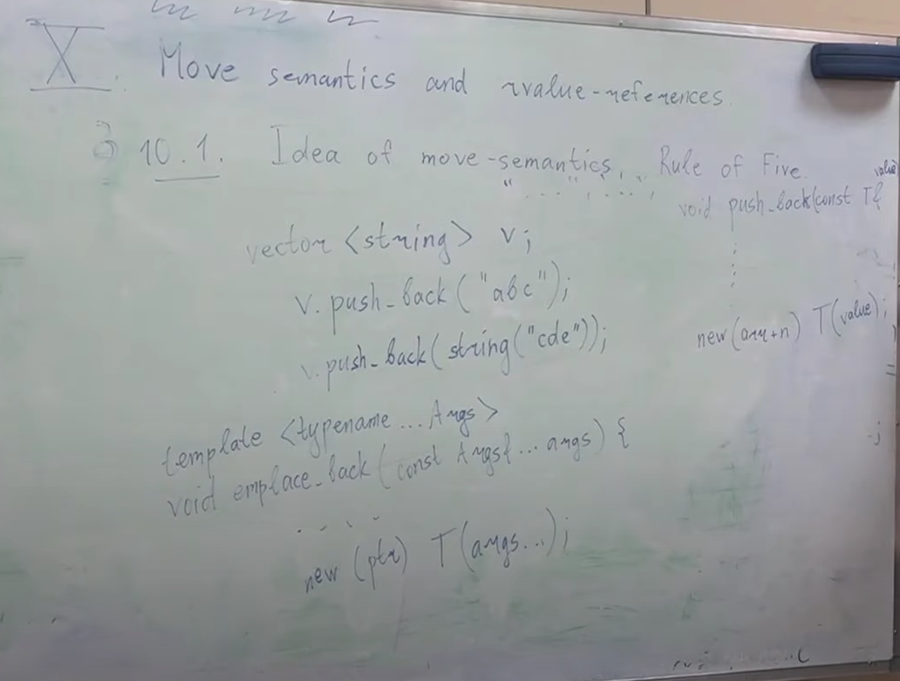
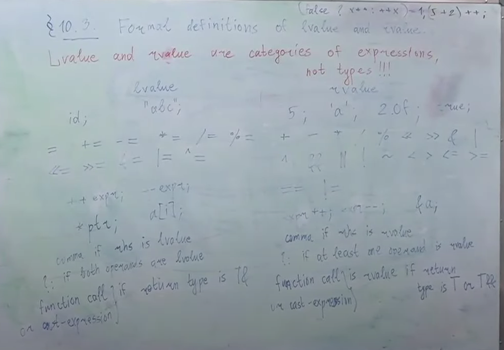

# Move semantics and rvalue-references 
## Idea of move-semantics
Рассмотрим пример:

    vector<string> v;
    v.push_back("abc");
В то время как push_back имеет сигнатуру:

    void push_back(const T& value);
где T - это string. Мы инициализируем ее сишной строкой, сишная строка конвертируется в std::string (временная строка), к которой привязывается эта константная ссылка, как к временному объекту. Далее в push_back в какой-то момент написано:

    new(arr+n) T(value);
T - это string, value - это тоже string. Т.е. создается второй string из первого string. У нас был string, который создался, чтобы быть передан в push_back, а потом из него создался второй string, который положился в vector, а этот временный string уничтожился.
Как нам научиться класть в контейнеры объекты так, чтобы не копировать второй раз? Даже если мы напишем:

    v.push_back(string("cde"));
то ничего не поменяется
Есть **emplace_back** - это функция, которая принимает не объект T, а аргументы, из которых создает T на месте

    template<typename ... Args>
    void emplace_back(const Args&... args){
        ...
        new(ptr) T(args...);
    }
Объект string создался бы один. Но это решает проблему поверхностно, заметание коверы под ковер. А что, если у нас вектор векторов строк, то что? Мы не будем создавать промежуточный вектор строк, но будет все равно создавать промежуточные string

Возьмем код:
    
    #include <iostream>

    struct S{
        string data;
        S(const string& str) : data(str){}
    };

    int main(){
        S("abc");
    }
Все равно создается промежуточная строка. Что делать?

Еще одна проблема:

    string s("abc");
    throw s;
Когда мы создали локальный объект и пытаемся его бросить, нам нужно переложить его в динамическую память, т.е. скопировать. Можно ли сделать что-то умнее? (понятно, что с std::string все будет ок, но что насчет произвольных классов?)

Можно определить для классов не [copy constructor](https://en.cppreference.com/w/cpp/language/copy_constructor), а [move constructor](https://en.cppreference.com/w/cpp/language/move_constructor)
Семантика будет примерно такой же: все еще будет создана промежуточная строка, но она будет создана не засчет того, что мы скопируем полностью данные, а мы скопируем ptr и заберем владение.
Тогда мы сможем в push_back не создавать вторую полноценную строку, а просто первая строка у нас создалась, а когда мы уже new вызываем, мы ее муваем, а не копируем

    class string{
    public:
        string(string&& other) 
        : arr(other.arr), sz(other.sz), cap(other.cap) {
            other.arr = nullptr;
            other.sz = other.cap = 0;
        }
        
        string& operator=(string&& other) {
            if (this == &other){
                return this;
            }
            delete[] arr;
            
            arr = other.arr; other.arr = nullptr;
            sz = other.sz; other.sz = 0;
            cap = other.cap; other.cap = 0;
            return *this;
        }

    private:
        char* arr;
        size_t sz;
        size_t cap;
    };

## Rule of Three
Если у нас в классе есть хотя бы один нетривиальный:
* copy конструктор
* copy оператор присваивания
* деструктор

то все три должны быть нетривиальными

## Rule of Five
Если у нас в классе есть хотя бы один нетривиальны:
* copy конструктор
* copy assignment оператор (оператор присваивания)
* деструктор
* move конструктор
* move assignment оператор (оператор присваивания)

то все пять должны быть нетривиальными.

Что делает дефолтный move constructor: просто поэлементно будут вызваны move конструкторы полей, а в случае если поля это не классы, а просто типы, то это будет обычная инициализация (для int, double и прочее move и copy - одно и то же). Для строк не подходит дефолтный мув конструктор, потому что он скопирует указатель, но ничего не занулит, у нас будет два указателя на одно и то же
Тем не менее, мы можем вообще не писать move конструктор и move оператор присваивания, и тогда просто move будет работать как копирование.
Начиная с c++03: если мы в классе вообще не упомянули ни move конструктор, ни move оператор присваивания, то в случае попытки их вызова будет вызываться копирующий аналог
Если есть хотя бы один нетривиальный пункт из Rule of Three, то компилятор не генерирует за нас дефолтные move конструктор и move assigment оператор. Если мы вообще ничего не пишем, то и компилятор будет генерировать все дефолт

Бывают типы, которые мувать можно, а копировать нельзя (например std::unique_ptr)

## Как компилятор понимает: move или copy?
Короткий ответ такой: если компилятор видит, что мы вызываемся от rvalue, то он автоматически вызывает мувающую операцию, если может, а от lvalue вызывает копирующую операцию

# Mistic function std::move
## Что это?
Можно принудительно заставить компилятор вызвать мувающую операцию, несмотря на то, что переменная была lvalue - для этого есть [std::move](https://en.cppreference.com/w/cpp/utility/move)

    struct S{
        string data;
        // Говорит выбери мувающую версию, а не копирующую
        // Но здесь это не сработает, здесь будет копирование
        // по той причине, что здесь const написано, а мувающая версия
        // принимает неконстантный тип
        // S(const string& data) : data(std::move(data)) {}

        // Для объектов lvalue
        S(const string& data) : data(data) {}

        // Чтобы компилятор смог, здесь нужно тоже принять по такой ссылке:
        // Для объектов rvalue
        S(string&& data) : data(std::move(data)) {}
    };
Если бы мы не написали std::move, то у нас все равно было бы копирование. Роль move в том, чтобы перенаправить перегрузку функции по другому пути. По-умолчанию, когда мы вызываемся из какого-то объекта, мы идем по пути копирования. Move - это способ перенаправить нас в другую перегрузку.

    void push_back(const T& value){
        ...
        new(ptr) T(value);
    }
    
    void push_back(T&& value){
        new(ptr) T(std::move(value));
    }

## move при бросании исключений

    string s = "abc";
    throw s;
В стандарте написано, что по возможности вызывается move конструктор, а не copy конструктор.

## Правильная реализцая swap через move
    
    // Очень плохая реализация
    template <typename T>
    void swap(T& x, T& y){
        T tmp = x;
        x = y;
        y = tmp;
    }

    // Хорошая реализация
    template <typename T>
    void swap(T& x, T& y){
        T tmp = std::move(x);
        x = std::move(y);
        y = std::move(tmp);
    }

## Наивная реализация move
Реализация move, которая работает в 90% случаев. Она покроет все те случаи, которые были выше

    template <typename T>
    T&& move(T& x){
        return static_cast<T&&>(x);
    }
Здесь auto move(auto x) не поможет, потому что будет куча копирований.
Неявно не скатилось бы, нужно явно скастовать, потому что из T& в T&& неявного каста не бывает, и роль move чтобы сделать каст явно.
Это неправильная реализация, но она будет работать в 90% случаев.
move это просто каст к rvalue.

    string s = "abc";
    std::move(s);
С объектом ничего не произойдет, сама по себе функция std::move ничего не делает с объектом. На самом деле, функция std::move она не то что с объектом ничего не делает, она даже на стадии выполнения никаких инструкций не выполняет. Уже на этапе выполнения std::move это 0 действий, потому что это static_cast просто, т.е. для процессора std::move не означает никаких инструкций, эта вся штука только для этапа компиляций имеет смысл, и нужна только для того, чтобы компилятор перенаправился в другую версию перегрузки
Если мы вызываемся от std::move, и у нас есть конструкторы от **T&** и **T&&**, то мы попадем в версию **T&&**, а если вызываемся без std::move, то мы попадем в версию **T&**
# Formal definition of lvalue and rvalue
*[Инфа с cppreference](https://en.cppreference.com/w/cpp/language/value_category)*

lvalue and rvalue are categories of [expressions](https://en.cppreference.com/w/cpp/language/expressions), not types!!!

    int&& // не rvalue!!
Expressoins - это синтаксическая конструкция, которая состоит из идентификаторов, литералов, соединенных операторами и скобочками
Все инструкции бывают либо expression, либо declaration, либо control statement

Философски:
* lvalue - то, что в памяти лежит
* rvalue - то, что необязательно в памяти лежит

Формальное определение:
* lvalue:
    * id - любая переменная сама по себе, это lvalue, неважно какой у нее тип
    * Строковые литералы: **"abc"**
    * **=**, **+=**, **-=**, __*=__, **/=**, **%=**, **<<=**, **>>=**, **&=**, **|=**, **^=**
    * **++expr**, **--expr**
    * __*ptr__, **a[i]**
    * **comma** if rhs is lvalue
    * **?**: if both operands are lvalue
    * **function call** is lvalue, if return type is T&
    * **cast-expression** is lvalue, if return type is T&
* rvalue:
    * Литералы: **'5'**, **'a'**, **2.0f**, **true** (кроме случаев, когда это строковый литерал)
    * **+**, **-**, __*__, **/**, **%**, **<<**, **>>**, **&**, **|**, **^**, **~**, **&&**, **||**, **!**, **<**, **>**, **<=**, **>=**, **==**, **!=** - над примитивными типами 
    * **expr++**, **expr--** - над примитивными типами
    * **&a**
    * **comma** if rhs is rvalue
    * **?** at least one operand is rvalue
    * **function call** is rvalue, if return type is T or T&&
    * **cast-expression** is rvalue, if return type is T or T&&
    * **new**
    
Некорректно:

    (5+2)++ // потому что это value, а инкремент можно вызывать у lvalue

## rvalue-references and their properties
rvalue ссылкой называется тип такого вида: **T&&**, где T - некоторый фиксированный тип

**Свойства:**
* Первое свойство rvalue ссылки: будучи возвращенной из функции, она является rvalue выражением
* Второе свойство rvalue ссылки: проинициализировать его можно только rvalue выражением
Пример 1:

    int x = 5;
    int&& y = x; // CE

Пример 2:

    int&& y = 6; // продление жизни (lifetime prolongation)
Пример 3:
    
    int&& y = 6;
    y = 7;
Приме 4:

    int&& y = 6;
    y = 7;
    int&& z = y; // CE, потому что имя переменной - это всегда lvalue, неважно какой у нее тип
Пример 5:

    int&& y = 6;
    y = 7;
    int&& z = std::move(y);
Пример 6:

    int x = 5;
    int&& t = static_cast<int&&>(x);
Пример 7:

    int x = 5;
    int&& t = static_cast<int&&>(x);
    t = 1; // x = 1

## Real implementation of std::move
Ну вроде так крч

    // FUNCTION TEMPLATE move
    template <class _Ty>
    [[nodiscard]] constexpr remove_reference_t<_Ty>&& move(_Ty&& _Arg) noexcept { // forward _Arg as movable
        return static_cast<remove_reference_t<_Ty>&&>(_Arg);
    }

## std::forward
// TODO
Идейная реализция:

    template<typename T>
    T&& forward(T&& param)
    {
        if (is_lvalue_reference<T>::value)
            return param;
        else
            return move(param);
    }

Real implementation

    // FUNCTION TEMPLATE forward
    template <class _Ty>
    [[nodiscard]] constexpr _Ty&& forward(
        remove_reference_t<_Ty>& _Arg) noexcept { // forward an lvalue as either an lvalue or an rvalue
        return static_cast<_Ty&&>(_Arg);
    }

    template <class _Ty>
    [[nodiscard]] constexpr _Ty&& forward(
        remove_reference_t<_Ty>&& _Arg) noexcept { // forward an rvalue as an rvalue
        static_assert(!is_lvalue_reference_v<_Ty>, "bad forward call");
        return static_cast<_Ty&&>(_Arg);
    }