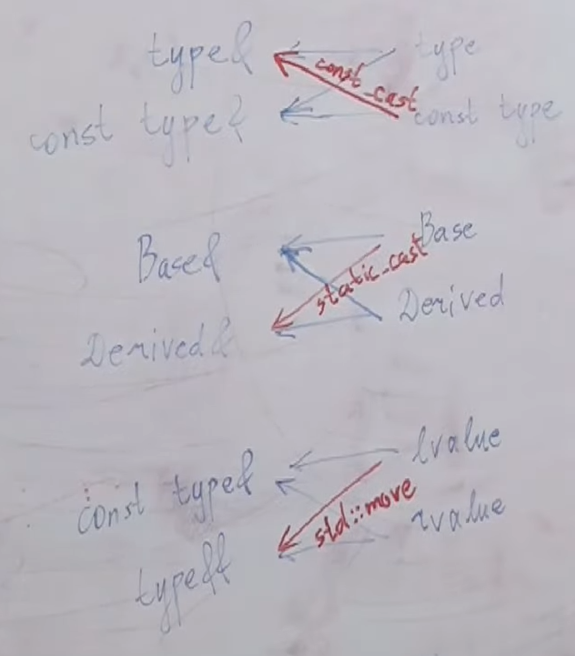
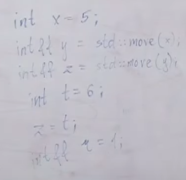
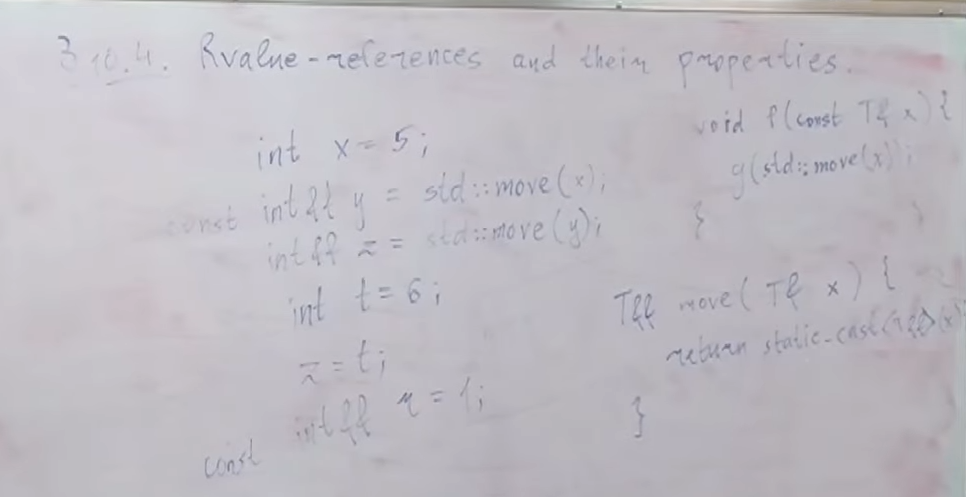

# Move semantics and rvalue-references 
## Idea of move-semantics
Рассмотрим пример:

    vector<string> v;
    v.push_back("abc");
В то время как push_back имеет сигнатуру:

    void push_back(const T& value);
где T - это string. Мы инициализируем ее сишной строкой, сишная строка конвертируется в std::string (временная строка), к которой привязывается эта константная ссылка, как к временному объекту. Далее в push_back в какой-то момент написано:

    new(arr+n) T(value);
T - это string, value - это тоже string. Т.е. создается второй string из первого string. У нас был string, который создался, чтобы быть передан в push_back, а потом из него создался второй string, который положился в vector, а этот временный string уничтожился.
Как нам научиться класть в контейнеры объекты так, чтобы не копировать второй раз? Даже если мы напишем:

    v.push_back(string("cde"));
то ничего не поменяется
Есть **emplace_back** - это функция, которая принимает не объект T, а аргументы, из которых создает T на месте

    template<typename ... Args>
    void emplace_back(const Args&... args){
        ...
        new(ptr) T(args...);
    }
Объект string создался бы один. Но это решает проблему поверхностно, заметание коверы под ковер. А что, если у нас вектор векторов строк, то что? Мы не будем создавать промежуточный вектор строк, но будет все равно создавать промежуточные string

Возьмем код:
    
    #include <iostream>

    struct S{
        string data;
        S(const string& str) : data(str){}
    };

    int main(){
        S("abc");
    }
Все равно создается промежуточная строка. Что делать?

Еще одна проблема:

    string s("abc");
    throw s;
Когда мы создали локальный объект и пытаемся его бросить, нам нужно переложить его в динамическую память, т.е. скопировать. Можно ли сделать что-то умнее? (понятно, что с std::string все будет ок, но что насчет произвольных классов?)

Можно определить для классов не [copy constructor](https://en.cppreference.com/w/cpp/language/copy_constructor), а [move constructor](https://en.cppreference.com/w/cpp/language/move_constructor).
Семантика будет примерно такой же: все еще будет создана промежуточная строка, но она будет создана не засчет того, что мы скопируем полностью данные, а мы скопируем ptr и заберем владение.
Тогда мы сможем в push_back не создавать вторую полноценную строку, а просто первая строка у нас создалась, а когда мы уже new вызываем, мы ее муваем, а не копируем

    class string{
    public:
        string(string&& other) 
        : arr(other.arr), sz(other.sz), cap(other.cap) {
            other.arr = nullptr;
            other.sz = other.cap = 0;
        }
        
        string& operator=(string&& other) {
            if (this == &other){
                return this;
            }
            delete[] arr;
            
            arr = other.arr; other.arr = nullptr;
            sz = other.sz; other.sz = 0;
            cap = other.cap; other.cap = 0;
            return *this;
        }

    private:
        char* arr;
        size_t sz;
        size_t cap;
    };

## Rule of Three
Если у нас в классе есть хотя бы один нетривиальный:
* copy конструктор
* copy оператор присваивания
* деструктор

то все три должны быть нетривиальными

## Rule of Five
Если у нас в классе есть хотя бы один нетривиальны:
* copy конструктор
* copy assignment оператор (оператор присваивания)
* деструктор
* move конструктор
* move assignment оператор (оператор присваивания)

то все пять должны быть нетривиальными.

Что делает дефолтный move constructor: просто поэлементно будут вызваны move конструкторы полей, а в случае если поля это не классы, а просто типы, то это будет обычная инициализация (для int, double и прочее move и copy - одно и то же). Для строк не подходит дефолтный мув конструктор, потому что он скопирует указатель, но ничего не занулит, у нас будет два указателя на одно и то же.
Тем не менее, мы можем вообще не писать move конструктор и move оператор присваивания, и тогда просто move будет работать как копирование.
Начиная с c++03: если мы в классе вообще не упомянули ни move конструктор, ни move оператор присваивания, то в случае попытки их вызова будет вызываться копирующий аналог.
Если есть хотя бы один нетривиальный пункт из Rule of Three, то компилятор не генерирует за нас дефолтные move конструктор и move assigment оператор. Если мы вообще ничего не пишем, то и компилятор будет генерировать все дефолт.

Бывают типы, которые мувать можно, а копировать нельзя (например std::unique_ptr).

## Как компилятор понимает: move или copy?
Короткий ответ такой: если компилятор видит, что мы вызываемся от rvalue, то он автоматически вызывает мувающую операцию, если может, а от lvalue вызывает копирующую операцию.

# Mistic function std::move
## Что это?
Можно принудительно заставить компилятор вызвать мувающую операцию, несмотря на то, что переменная была lvalue - для этого есть [std::move](https://en.cppreference.com/w/cpp/utility/move)

    struct S{
        string data;
        // Говорит выбери мувающую версию, а не копирующую
        // Но здесь это не сработает, здесь будет копирование
        // по той причине, что здесь const написано, а мувающая версия
        // принимает неконстантный тип
        // S(const string& data) : data(std::move(data)) {}

        // Для объектов lvalue
        S(const string& data) : data(data) {}

        // Чтобы компилятор смог, здесь нужно тоже принять по такой ссылке:
        // Для объектов rvalue
        S(string&& data) : data(std::move(data)) {}
    };
Если бы мы не написали std::move, то у нас все равно было бы копирование. Роль move в том, чтобы перенаправить перегрузку функции по другому пути. По-умолчанию, когда мы вызываемся из какого-то объекта, мы идем по пути копирования. Move - это способ перенаправить нас в другую перегрузку.

    void push_back(const T& value){
        ...
        new(ptr) T(value);
    }
    
    void push_back(T&& value){
        new(ptr) T(std::move(value));
    }

## move при бросании исключений

    string s = "abc";
    throw s;
В стандарте написано, что по возможности вызывается move конструктор, а не copy конструктор.

## Правильная реализцая swap через move
    
    // Очень плохая реализация
    template <typename T>
    void swap(T& x, T& y){
        T tmp = x;
        x = y;
        y = tmp;
    }

    // Хорошая реализация
    template <typename T>
    void swap(T& x, T& y){
        T tmp = std::move(x);
        x = std::move(y);
        y = std::move(tmp);
    }

## Наивная реализация move
Реализация move, которая работает в 90% случаев. Она покроет все те случаи, которые были выше

    template <typename T>
    T&& move(T& x){
        return static_cast<T&&>(x);
    }
Здесь auto move(auto x) не поможет, потому что будет куча копирований.
Неявно не скатилось бы, нужно явно скастовать, потому что из T& в T&& неявного каста не бывает, и роль move чтобы сделать каст явно.
Это неправильная реализация, но она будет работать в 90% случаев.
move это просто каст к rvalue.

    string s = "abc";
    std::move(s);
С объектом ничего не произойдет, сама по себе функция std::move ничего не делает с объектом. На самом деле, функция std::move она не то что с объектом ничего не делает, она даже на стадии выполнения никаких инструкций не выполняет. Уже на этапе выполнения std::move это 0 действий, потому что это static_cast просто, т.е. для процессора std::move не означает никаких инструкций, эта вся штука только для этапа компиляций имеет смысл, и нужна только для того, чтобы компилятор перенаправился в другую версию перегрузки.
Если мы вызываемся от std::move, и у нас есть конструкторы от **T&** и **T&&**, то мы попадем в версию **T&&**, а если вызываемся без std::move, то мы попадем в версию **T&**.
# Formal definition of lvalue and rvalue
*[Инфа с cppreference](https://en.cppreference.com/w/cpp/language/value_category)*

lvalue and rvalue are categories of [expressions](https://en.cppreference.com/w/cpp/language/expressions), not types!!!

    int&& // не rvalue!!
Expressoins - это синтаксическая конструкция, которая состоит из идентификаторов, литералов, соединенных операторами и скобочками
Все инструкции бывают либо expression, либо declaration, либо control statement

Философски:
* lvalue - то, что в памяти лежит
* rvalue - то, что необязательно в памяти лежит

Формальное определение:
* lvalue:
    * id - любая переменная сама по себе, это lvalue, неважно какой у нее тип
    * Строковые литералы: **"abc"**
    * **=**, **+=**, **-=**, __*=__, **/=**, **%=**, **<<=**, **>>=**, **&=**, **|=**, **^=**
    * **++expr**, **--expr**
    * __*ptr__, **a[i]**
    * **comma** if rhs is lvalue
    * **?**: if both operands are lvalue
    * **function call** is lvalue, if return type is T&
    * **cast-expression** is lvalue, if return type is T&
* rvalue:
    * Литералы: **'5'**, **'a'**, **2.0f**, **true** (кроме случаев, когда это строковый литерал)
    * **+**, **-**, __*__, **/**, **%**, **<<**, **>>**, **&**, **|**, **^**, **~**, **&&**, **||**, **!**, **<**, **>**, **<=**, **>=**, **==**, **!=** - над примитивными типами 
    * **expr++**, **expr--** - над примитивными типами
    * **&a**
    * **comma** if rhs is rvalue
    * **?** at least one operand is rvalue
    * **function call** is rvalue, if return type is T or T&&
    * **cast-expression** is rvalue, if return type is T or T&&
    * **new**
    
Некорректно:

    (5+2)++ // потому что это value, а инкремент можно вызывать у lvalue

## rvalue-references and their properties
rvalue ссылкой называется тип такого вида: **T&&**, где T - некоторый фиксированный тип

**Свойства:**
* Первое свойство rvalue ссылки: будучи возвращенной из функции, она является rvalue выражением
* Второе свойство rvalue ссылки: проинициализировать его можно только rvalue выражением

Пример 1:

    int x = 5;
    int&& y = x; // CE

Пример 2:

    int&& y = 6; // продление жизни (lifetime prolongation)
Пример 3:
    
    int&& y = 6;
    y = 7;
Приме 4:

    int&& y = 6;
    y = 7;
    int&& z = y; // CE, потому что имя переменной - это всегда lvalue, неважно какой у нее тип
Пример 5:

    int&& y = 6;
    y = 7;
    int&& z = std::move(y);
Пример 6:

    int x = 5;
    int&& t = static_cast<int&&>(x);
Пример 7:

    int x = 5;
    int&& t = static_cast<int&&>(x);
    t = 1; // x = 1

### Способ, как можно интуитивно понимать std::move
Что такое type по сравнению с его const аналогом? Это тип, над которым определено больше операций, чем над константным. Если мы хотим константный тип принять по ссылке типа, т.е. разрешить над ним операции, которые по умолчанию над ним запрещены, мы должны явно писать каст.
То же самое с наследованием: что такое Derived по-отношению к Base? Это тип, для которого некоторые операции определены дополнительно. Что такое Base по-отношению к Derived? Это тип, для которого часть операций Derived не определена.

std::move это в каком-то виде cast, но не между типами, а между value. Над lvalue определены какие-то операции, а над rvalue определено больше операций, потому что над rvalue определена операция как забрать его данные и опустошить его, а себе присвоить то, что ему принадлежало.

### Свойства rvalue-ссылок. Взаимодействие rvalue-ссылок и const

Что, если мы напишем const? Правило константности действует независимо от правил вида value. Мы можем сказать

    int x = 5;
    const int&& y = std::move(x);
    // int&& z = std::move(y); 
    // так нельзя, можно только с const_cast
    int&& z = std::move(const_cast<int&&>(y));

Если бы мы написали:

    T&& move(T& x){
        return static_cast<T&&>(x);
    }
то было бы все ок. А если бы

    T&& move(const T& x){
        return static_cast<T&&>(x);
    }
То был бы CE, потому что нельзя static_cast скастовать от const T к неконстантному T

С другой стороны:

    void f(const T& x){
        g(std::move(x));
    }
то произойдет копирование: если мы вызываем std::move, а тип константный, то нам в T вшивается конст, тогда static_cast будет к const T&& и вернем мы const T&&. И если у нас *g* у нас определена от const T& и от T&&, то мы попадем в const T&, потому что несмотря на то, что в одно у нас принимается rvalue, а в другое и rvalue, и lvalue, мы отдаем rvalue, но во втором случае нарушается константность: мы не можем отдать константное rvalue туда, где ожидается неконстантное rvalue. Поэтому если мы мувнем константный тип, то ничего не случится плохого, мы все равно попадем в копирующую версию

T&& - это такой тип, который во всем аналогичен T&, кроме двух основных пунктов: инициализировать его можно только через rvalue, и если вернуть такой тип из функции, то это выражение будет считаться rvalue. В основном этот тип работает так же, как и lvalue
### reference qualifiers
Рассмотрим пример

    #include <iostream>

    struct S{
        std::string str;
        
        std::string getData() const{
            return str;
        }
    };

    int main(){
        S{"abc"}.getData();
    }

Сначала создастся строка str от "abc", а когда мы скажем getData(), у нас из str создастся еще одна строка и вернется 

Было бы неплохо, если бы когда мы вызываемся у rvalue объекта, то getData у нас бы мувала строку, а не копировала. Это можно сделать (since c++11), для этого существует *Reference qualifiers* (по анологии с *Const qualifiers*)

    std::string getData()&& {
        return std::move(str);
    }
Этот метод доступен только для rvalue объектов: если объект, от которого мы вызываемся, является rvalue, то мы попадем в эту версию

Симметрично этому мы можем написать

    std::string getData()& {
        return std::move(str);
    }
для вызова только из lvalue

Но если мы напишем

    std::string getData() const & {
        return std::move(str);
    }
то мы сможем вызываться как от rvalue, так и от lvalue. Такая запись означает, что мы как будто приняли себя по константной ссылке

Перегрузка между константным и неконстантным объектом

    struct S{
        std::string str;
        
        std::string getData() const & {
            return str;
        }
        std::string getData()&& {
            return std::move(str);
        }
    };

Перегрузка между lvalue и rvalue

    struct S{
        std::string str;
        
        std::string getData()& {
            return str;
        }
        std::string getData()&& {
            return std::move(str);
        }
    };

*Когда мы пишем оператор присваивания, нужно писать &, чтобы к rvalue ничего нельзя было присвоить*

# Forwarding references, std::forward
## Почему rvalue ссылок недостаточно для решения всех проблем
У нас было два пушбека

    void push_back(const T&);
    void push_back(T&&);
и они отключаются только

    new(ptr) T(value)
    new(ptr) T(std::move(value))
Но на самом деле это обман, там не это написано. Там написано allocator.construct()

    template <typename... Args>
    void emplace_back(const Args&... args);
Нас не спасет две перегрузки, потому что аргументов много, и некоторые из них могут быть lvalue, а некоторые rvalue. Т.е. нам надо как бы $2^n$ перегрузок, где n - количество аргументов.
Т.е. если стек вызовов состоит из 1 вызова функции, то мы решили проблему. Но если нам нужно пойти дальше и передать это в следующую функцию с сохранением вида value, мы не решили проблему. И эта проблема появляется когда мы пытаемся вызвать construct или emplace_back.

Короче, проблема такая: нам нужно уметь передавать аргументы дальше в функции с сохранением вида value того, по которому мы их приняли на данный момент.
Если мы в emplace_back часть аргументов нам отдали как rvalue, а часть аргументов отдали как lvalue, мы должны и дальше в construct отдать соответствующие аргументы как lvalue, а другие как rvalue 

На самом деле сигнатура функции emplace_back выглядит так:

    template <typename... Args>
    void emplace_back(Args&&... args);
И нам нужно разобраться, как это работает. На самом деле, во всех таких ситуациях мы принимаем *&&* и никакого *const*. Точно также выглядит сигнатура функции construct в аллокаторе.

Как же это работает?
Есть волшебная функция **[std::forward](https://en.cppreference.com/w/cpp/utility/forward)**

Правильная передача аргументов с сохранением вида value в следующую функцию выглядит так:

    void consturct(u* ptr, Args&&... args){
        new(ptr) u(std:;forward<Args>(args)...);
    }
Мы принимаем их вот по такой ссылке, но передаем дальше с помощью std::forward. Утверждается, что функция std::forward в зависимости от того, приняли ли мы аргументы как lvalue или rvalue изначально, и дальше передает их как lvalue и rvalue соответственно, если только мы их приняли по такой ссылке.

## Понятие универсальных ссылок (forwarding (universal) references)
Есть противоречие с тем, что было выше в конспектах: почему вообще в 
   
    Args&&... args 
можно вообще передать хоть какое-то lvalue? И это действительно проблема, поэтому нужно ввести костыль в стандарт: если вот такая ссылка является шаблонным параметром функции, то правило неверное xD

Более формально: если такая ссылка является типом аргумента в функции, для которой тип является шаблонным параметром, то это по другим правилам работает, и тут не применяется правило, что это только через rvalue можно инициализировать. И сделано это ровно для того, чтобы вот таким синтаксисом можно было принимать как lvalue, так и rvalue.

Еще раз: если функция принимает тип вида *T&&* , где *T* - это шаблонный параметр данной функции, то такая ссылка работает по иным правилам, нежели обычная rvalue ссылка

**ВАЖНО ЧТОБЫ ТИП БЫЛ ШАБЛОННЫМ ПАРАМЕТРОМ САМОЙ ЭТОЙ ФУНКЦИИ, А НЕ ВЫШЕЛЕЖАЩЕГО КЛАССА**

При этом, если бы было написано:

    const Args&&
    vector<Args>&&
то эти два случая не были бы исключениями из правил.

## Упражнение: создание вектора из переменного числа аргументов
Рассмотрим пример, в котором мы хотим написать конструктор от произвольного количества строк, причем строки могут быть как lvalue, так и rvalue

    struct S{
        vector<string> v;
        
        template<typename... Args>
        S(Args&&... args){
            static_asset(...) // что все типы конвертируются в string
            v.reserve(sizeof...(args));
            (v.push_back(std::forward<Args>(args)), ...);
        }
    };

## Правила вывода шаблонного типа для обычных и для универсальных ссылок
Представим, что у нас есть функция, которая принимает T по универсальной ссылке

    template<typename T>
    void f(T&& x);
    
    template<typename T>
    void f(T& x);

    template<typename T>
    void f(T x);
Правила, по которым компилятор решает, чему равно T, будут разными в этих случаях, и это опять таки исключение из правил, добавленное специально для таких ссылок, и благодаря этому можно реализовать forward.

Забудем, другой пример:

    template<typename T>
    void h(T&& x);
    
    template<typename T>
    void g(T& x);

    template<typename T>
    void f(T x);
И вот у нас есть

    int x = 0;
    f(x); // T = int
    g(x); // T = int
    h(x); // T = int&
    
    int& y = x;
    f(y); // T = int
    g(y); // T = int
    h(y); // T = int&

    int&& z = move(x);
    f(z); // T = int
    g(z); // T = int
    h(z); // T = int&
    

Правило следующее: если у нас функция принимает универсальную ссылку, то не работает старое правило вывода типа T, а работает новое правило: он навешивает дополнительно & на T, если мы вызываемся от lvalue. Т.е. ссылка отбрасывается кроме случая, когда мы вызываемся по универсальной ссылке. А в случае, когда мы вызываемся от универсальной ссылке, откуда-то берется лишний амперсанд. Но почему &, а не &&, и почему это не зависит от типа выражения, от которого мы вызываемся?

Для такой (в функции h) ссылки есть правило: если мы вызываемся от lvalue, то она его принимает, но T становится равным типу без ссылок с навешенным амперсандом, а если мы вызываемся от rvalue, то она его принимает и T выводится как обычно.

Если мы вызываем

    h(1); // T = int
    h(std::move(x)); // T = int

В языке C++ есть такое правило **reference collapsing rules**, оно гласит: если в момент вывода типа переменной в шаблоне у нас накладываются амперсанды один на другой, то они преобразуются по следующему правилу:
* & + & -> &
* && + & -> &
* & + && -> &
* && + && -> &&

Исходя из этих правил можно понять, какой тип будет у *x* в каждом случае. Для *f* и *g* очевидно, а вот для *h* если мы передаем lvalue, то T это будет тип с амперсандом, а на него еще два амперсанда навешалось, тогда это будет один амперсанд. А если мы передаем rvalue, то T это просто int и на него навесилось два амперсанда, оно получилось просто T&&.

Таким образом, благодаря вот этому костылю для универсальных ссылок они могут принимать как lvalue, так и rvalue, причем если они принимают lvalue, то компилятор искусственно добавляет амперсанд на T, и благодаря этому, если мы в эту функцию примем lvalue, то мало того, что оно ее примет, оно еще и тип будет иметь с одним амперсандом, а если мы приняли rvalue, то оно будет с двумя амперсандами.

Это подсказывает нам как работает forward: он понимает, какой тип на самом деле, какой вид value в зависимости от того, что в шаблонном аргументе: там либо один амперсанд, либо нет амперсанда. Исходя из этого forward понимает, ему кастить к rvalue или нет 

# Real implementation of std::move
Ну вроде так крч

    // FUNCTION TEMPLATE move
    template <class _Ty>
    [[nodiscard]] constexpr remove_reference_t<_Ty>&& move(_Ty&& _Arg) noexcept { // forward _Arg as movable
        return static_cast<remove_reference_t<_Ty>&&>(_Arg);
    }

# std::forward
// TODO
Идейная реализция:

    template<typename T>
    T&& forward(T&& param)
    {
        if (is_lvalue_reference<T>::value)
            return param;
        else
            return move(param);
    }

Real implementation

    // FUNCTION TEMPLATE forward
    template <class _Ty>
    [[nodiscard]] constexpr _Ty&& forward(
        remove_reference_t<_Ty>& _Arg) noexcept { // forward an lvalue as either an lvalue or an rvalue
        return static_cast<_Ty&&>(_Arg);
    }

    template <class _Ty>
    [[nodiscard]] constexpr _Ty&& forward(
        remove_reference_t<_Ty>&& _Arg) noexcept { // forward an rvalue as an rvalue
        static_assert(!is_lvalue_reference_v<_Ty>, "bad forward call");
        return static_cast<_Ty&&>(_Arg);
    }