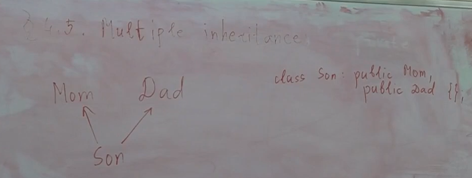

Сначала приколюха: пустая структура/класс занимает 1 байт в памяти, потому что это минимум, сколько может занимать объект, потому что у разных объектов должны быть разные адреса. Если бы sizeof пустой структуры был бы 0, то мы могли бы объявить массив таких структур размера 100, и этот бы массив тоже имел бы размер 0, и тогда получается, что адрес начала и конца этого массива ничем бы не отличались. Крч кринж какой-то, адреса разных объектов должны быть разными, мы должны уметь отличать объекты по их адресам.

Например, в операторе присваивания мы бы не смогли проверить, что мы присваиваем самим себе. Т.е. если бы у нас не было правила, что не бывает объектов размера 0, то эта проверка могла бы некорректно работать в случае объектов размера 0.

C++ гарантирует нам, что у разных объектов разные адреса

Ну а в таком случае у нас размеры 1 и 8 соответственно

    #include <iostream>

    struct Base{
        void f() {}
    };

    struct Derived : Base{
        double y;
        void g() {}
    };

    int main(){
        std::cout << sizeof(Base) << std::endl;
        std::cout << sizeof(Derived) << std::endl;
    }

# Приведение типов при наследовании
Рассмотрим пример:

    #include <iostream>

    struct Base{
        int x = 1;
    };

    struct Derived : Base{
        int y = 2;
    };

    void f(Base& b){
        std::cout << b.x << std::endl;
    }

    int main(){
        Derived d;
        f(d);
    }
Ключевая идея наследования в том, что вот так можно делать: если у нас есть наследник, а функция принимает родителя, то ей можно подсунуть наследника вместо родителя, и все будет прекрасно работать.
Вся идея наследования в том, чтобы можно было так делать, чтобы можно было использовать наследника там, где ожидается родитель, потому что наследник умеет все то же, что и родитель, и возможно что-то еще.

Это напоминает const и не const: когда мы в функции принимаем что-то по константной ссылке, то мы туда можем отдать как константу, так и не константу, потому что константа - это просто тип, у которого убрана часть операций. То же самое и с наследованием. В обратную сторону будет CE.

Мы можем даже по значению передавать Derived там где ожидается Base. И в этой ситуации произойдет явление, которое называется **slicing** (срезка при копировании). Будет неявно сгенерирован конструктор Base у Derived, который просто заберет ту часть, которая относилась к Base и все. Также можно даже передавать по указателю.

Представим, что у Base нетривиальный конструктор копирования:

    #include <iostream>

    struct Base{
        int x = 1;
        Base(const Base& other)
        : x(other.x) { 
            std::cout << "Copy!" << std::endl; 
        }
    };

    struct Derived : Base{
        int y = 2;
    };

    void f(Base b){
        std::cout << b.x << std::endl;
    }

    int main(){
        Derived d;
        f(d);
    }
*Т.к. мы у Base определили конструктор копирования, то дефолтный конструктор у него тоже пропал*

В данном коде у нас выведется:

    Copy!
    1

---

У нас есть Base и Derived, и нас интересует следующее: сможем ли мы скастовать Base к Derived, Derived& и т.д.

Почему possibly UB? Если мы отдали указатель или ссылку на Base туда, где ожидался Derived, то это конечно скомпилируется, но если реально под этой ссылкой был Base, а не Derived, то при попытке обращения к полям и методам Derived будет UB.

Но это только для public наследования. Для private наследования иначе: приватное наследование идейно означает, что если мы не член класса и не друг, то в этой функции нам недоступен тот факт, что Derived это на самом деле Base.

Если наследование protected, то это так же, как и при приватном, просто в зависимости от того, где мы находимся, теперь нам можно еще это делать в методах наследника, а не только в методах исходного класса.

# Multiple inheritance
Не везде разрешено множественное наследование. А что плохого в нем? 
## Первая проблема
Главная проблема множественного наследования: что будет, если мы несколько раз наследуемся от одного и того же через разных промежуточных родителей?

Как это будет располагаться в памяти? Сначала в память кладутся родители, затем сын, причем в том порядке, в котором мы их перечислили

Есть вопросик: у нас есть функция

    void f(Dad&);
Можем ли мы в такую функцию отдать сына? По-идее можем, ведь сын - это частный случай папы, все ок. Но как, если адрес папы не такой, как адрес сына? Подобъект папы в этом объекте начинается с адреса на 4 большего, чем сам объект исходный. Т.е. получается, что когда мы пытаемся отдать в функцию сына по ссылке на папу, то неявный каст должен сдвинуть адрес чтоли? Ладно, хер с ней с ссылкой, а что с указателем? 

    void f(Dad*);
Т.е. если мы берем адрес сына и превращаем его неявно в адрес папы, то указатель должен сдвинуться на 4?

Конечно же надо будет сдвинуть указатель на 4. При неявных кастах иногда разрешается изменение численного значения указателя. То же самое и с
    
    Dad* p = &s;

В стандартной библиотеке есть множественное наследование, например в [iostream](https://en.cppreference.com/w/cpp/io/basic_iostream) - он одновременно наследник и istream, и ostream

## Вторая проблема
Что будет, если поля или методы называются одинаково

Если мы в сыне объявим метод, который затмевает по названию эти методы, то туда поиск имен уже не пойдет. Но если в сыне мы не объявили метод, а в маме и папе был метод с одинаковыми названиями, причем необязательно с одинаковыми аргументами, то будет перегрузка между ними. Т.е. если мы пишем s.f() от чего-то, то методы мамы и методы папы для нас равноправные, и компилятор просто делает перегрузку между ними уже: все эти методы попадают в множество, из которого делается перегрузка.

Если мы унаследовали два одинаковых метода, то это все еще не CE, но если мы вызвали s.f(), то будет CE.

Но мы можем явно сказать, к кому хотим обратиться:

    s.Dad::f();

Примечание: сдвиг указателя происходит, если мы кастуем себя к тому родителю, который не первый.

## Diamond problem (ромбовидное наследование)
Самое интересное происходит, если у нас есть Mom, Dad, Granny, Son, где Mom Dad наследуются от Granny, а Son наследуется от Mom и Dad.

    struct Granny {
        int g = 0;
    };
    struct Mom : public Granny {
        int m = 1;
    };

    struct Dad : public Granny {
        int d = 2;
    };
    struct Son : public Mom, public Dad {
        int s = 3;
    };
При этом sizeof(Son) это 20 байт.

В памяти у нас будет две копии Granny:

Если мы напишем 
    
    s.g;
то будет ошибка CE из-за неоднозначность (ambiguous name), потому что есть два поля с именем g в сыне: одно от мамы, одно от папы. При этом приватность не как не влияет на поиск имен: все то, что было выше в конспектах (и будет ниже), никак не меняется от приватности, т.е. когда здесь все срабатывает, то только тогда надо смотреть на приватность. Поиск имен, выбор версии перегрузки никак не зависит от приватности: ни от приватности наследование, ни от приватности полей или методов. Поэтому все равно будет неоднозначность, даже если одна бабушка приватная и одна публичная.

Но мы можем сказать

    s.Mom::g;
но мы не можем сказать

    s.Granny::g;
будет CE, потому что это будет неоднозначность, потому что Granny неоднозначно.

Попробуем сделать каст к Granny

    Granny& g = s;
будет CE по причине **ambiguous cast**. Можно понять это как каст к первой бабушке, а можно понять как каст ко второй бабушке, и непонятно к какой. То же самое будет при касте указателя, при попытке сделать слайсинг, при статик касте - это неважно.

Но как сделать каст к бабушке? Если напишем

    static_cast<Mom::Granny&>(s);
то все равно получим CE, потому что Granny которая в Mom, и Granny которая просто - это один и тот же тип с точки зрения эквивалентности типов, и для static_cast важно, какой это тип, и поэтому это тоже CE, все равно неоднозначный каст, потому что внутри мамы Granny не означает ничего иного, вот если бы внутри мамы был объявлен еще внутренний класс Granny, и это было бы что-то иное по сравнению с обычной Granny, то тогда это бы на что-то влияло, но так это не влияет. Поэтому нам нужно сначала скастить к Mom/Dad, и только затем к Granny.

---
Следующий пример: представим, что у нас в Granny есть метод f, и мы пишем 
    
    s.f();
Что может пойти не так? Если f - это метод бабушки, то это точно неоднозначно, если он не переопределен где-либо.

Но в чем неоднозначность, если метод один и тот же? Метод то один и тот же, но он может пользоваться полями, а поля зависят от того, от какой бабушки мы вызвались. Поэтому этот метод можно двояко понять.

*Замечание: если напишем static void f() , то все заработает:*

    #include <iostream>

    struct Granny {
        int g = 0;
        static void f(){
            std::cout << "static void f in Granny!" << std::endl;
        }
    };
    struct Mom : public Granny {
        int m = 1;
    };

    struct Dad : public Granny {
        int d = 2;
    };
    struct Son : public Mom, public Dad {
        int s = 3;
    };

    int main(){
        Son s;
        s.f();
        return 0;
    }

---
Разберем еще один пример:

    Mom& m = s;
    static_cast<Dad&>(m);
будет ли это работать? По факту под этой ссылкой лежит сын, поэтому теоретически можно было бы взять и сдвинуть указатель на 4, и там бы папа оказался, т.е. можно было разрешить такой каст в теории. Но такой каст запрещен: это CE. На самом деле даже теоретически такой каст нельзя позволить. Допустим, у нас есть класс Daughter, у которого первый родитель это Dad, а второй это Mom, и в зависимости от того, какой у нас объект под нами на самом деле, нам нужно делать либо сдвиг вправо делать, либо сдвиг влево, и вообще сдвиг неизвестно насколько нам нужно делать. Поэтому такой каст нельзя разрешить. Т.е. static_cast вбок запрещен.

Вдобавок к этому, каст от бабушки к сыну вниз тоже неопределен, потому что непонятно, от какой именно бабушки, т.е. если бы у нас был static_cast от Granny к Son, но при этом она была бы его единственной бабушкой, то понятно, как это работает, потому что статик касту понятно, какой сдвиг сделать при касте. Но если у нас static_cast от Granny к Son, и бабушек две, то статик касту непонятно, какой бабушкой себя считать на данный момент. Но можно от Granny к Dad/Mom, а затем к Son

---
Новый пример: представим, что мы унаследовались от Dad, которая наследница Granny, а еще мы унаследовались напрямую от Granny

Как нам обратиться к полю Granny? Если мы напишем 

    s.Granny::g;
то это будет неоднозначность, потому что бабушек две, и прямая Granny никак не приоритетнее, нежели Granny у Dad.

Такая ситуация называется **inaccessible base class**. Если мы допустили такое наследование, то у нас есть поля и методы, к которым мы никак не можем обратиться напрямую, у нас просто нет синтаксиса обратиться к этим полям. Потому что любая попытка обратиться к *g* будет неоднозначность. Обратиться к *g* через Dad мы можем 

    s.Dad::g;
но обратиться к прямому *g* явно мы никак не можем, легально по крайней мере, и все, что остается нам делать, это reinterpret_cast со сдвигами указателей.

Это очень плохое наследование, такого не надо делать. Если так написать, то компилятор кинет нам warning - inaccessible base class. 

---
Представим такую схему:

Напишем

    void(Mom::*p)() = &Mom::f;
    (s.*p)();
можем ли мы так сделать? Мы берем указатель на метод мамы, и по этому указателю вызываем метод у сына. Вообще, мы по-идее должны уметь, потому что метод мамы у сына присутствует. Что такое указатель на метод? Вообще, указатель на метод хранит в себе адрес непосредственно функции, по которой этот метод вызывать. Но если мы делаем такой вызов
    
    (s.*p)();
то просто вызывается эта функция по соответствующему адресы. Но все становится несколько интереснее, если мы напишем:

    void(Dad::*p)() = &Dad::f;
    (s.*p)();
У нас f - это адрес функции. Что из себя представляют указатели на методы? По-идее, указатели на методы - это просто указатели на функцию, и по-идее sizeof(p) должен быть 8. Но благодаря этому примеру сейчас мы поймем, что нет, и что указатели на методы устроены сложнее, чем просто указатели на функции, и что sizeof(p) равен 16, а не 8.

Представим, что у папы есть метод f, а мы вызываемся от сына. Адрес функции остается понятно каким, но мы вызываемся от объекта сына, и внутри этой функции мы должны как-то понимать, что на самом деле поля, с которыми мы сейчас собираемся работать, они сдвинуты относительно начала нашего объекта, от которого мы вызывались.

И на самом деле указатель на метод состоит из двух частей: он хранит адрес функции непосредственно, а еще сдвиг, в котором записано число, показывающее то, на сколько байт начало того объекта, чей это метод, сдвинут относительно начала того объекта, от которого мы вызвались. И в подавляющем большинстве случаев это число будет 0, но в данном случае это число будет 4, потому что мы вызвали папин метод от сына, и в методе мы должны понимать, что адрес объекта, от которого мы работает как будто, она на 4 правее относительно начала того объекта. Это объясняет, почему указатели на методы нельзя хранить как обычные указатели, они реализованы сложнее, а именно они хранят указатель и сдвиг.

**Но вообще это будет CE**. Мы должны написать

    void(Son::*ps)() = p; // implicit cast
именно в этот момент меняется shift, потому что функция остается той же самой, но мы ее теперь понимаем, как указатель на метод сына, а не папы, а значит сдвиг должен измениться на 4

# Virtual inheritance
Вернемся к примеру, когда были Son, Mom, Dad, Granny. Нам не нравится, что у нас создается две копии. Мы хотим так наследоваться, чтобы копия была одна. Такая возможность есть (кстати говоря, вроде как питон делает это по-умолчанию).

Для этого мы можем объявить наследование **виртуальным**:

    struct Granny{};
    struct Mom: public virtual Granny {};
    struct Dad: public virtual Granny {};
    struct Son: public Mom, public Dad {};
т.е. мы пишем virtual перед каждым упоминанием той самой бабушки, которую мы хотим **не** дублировать. Это приводит к тому, что в графе наследования бабушка становится всего одна, и копии его больше нет. И теперь если мы скажем

    Son s;
    s.g;
    Granny& g = s;
или вызов какого-то метода бабушки, то все будет однозначно работать, и будет прекрасно компилироваться, потому что бабушка теперь одна.

Теперь куча вопросов, главный из которых: как это работает?

Как это часто бывает, пытаясь решить одну проблему мы породили 5 новых.

*Кстати, виртуальное наследование используется в STL в basic_iostream, basic_istream, basic_ostream и basic_ios*
