**Theory of fault-tolerant distributed systems**
# Лекция 1. Модель распределенной системы
## Зачем нужна распределенность
Современный мир без распределенных систем сложно себе представить

Виды:
* KV Store - гигантская хеш таблица (упорядоченная)
    * Set(k, v)
    * Get(k)
* File system
* Coordination Service - распределенные системы, которые нужны, чтобы строить другие системы
    * Например, ~Atomics
* Message Queues
* Databases

Зачем нам делать что-то распределенным?
1) В одну машину все не помещается
2) Распределенные системы - это не только про большие данные. Одна машина может отказать, система должна быть отказоустойчива
3) Мы не хотим доверять каким-то машинам, одной или несколько, они могут быть злоумышленниками

Для того, чтобы строить алгоритмы, мы должны иметь модель мира, в котором мы собираемся работать

## Общая модель: узлы, каналы, отправка сообщений, клиенты, истории, модель согласованности
Что такое распределенная система?
В отличие от алгоритмов, которые что-то сортируют или ищут, мы от модели ждем каких-то гарантий
В коде клиента система выглядит как переменная, и мы выполняем над ней какие-то операции. Мы не единственные, кто так делаем, нас таких много. Внутри системы удобно говорить про **модель MessagePassing**, а снаружи разумно использовать **модель SharedMemory**

**History**

## Моделирование сети
### Гарантии доставки
Что может с сообщением случиться? У нас есть абстракция надежного канала, мы в него отправляем сообщение из узла *a* в узел *b*, и узел *b* даже начинает что-то получать и сообщение обрабатывать, и вдруг соединение рвется (например, кто-то задел провод), и все гарантии в связи с этим разрывом пропадают
Соединения либо гарантируют нам доставку, либо сообщат, что оно порвалось

### Асинхронность и частичная синхронность
**Synchronous model**:
Есть константа $\delta$
$ delay(m) \le $ $\delta$ - задержка при доставки сообщения ограничена дельтой
Хорошая сеть может работать очень быстро, доставляя сообщение между двумя узлами за миллисекунду, почему бы не взять за дельту пару миллисекунд?
Такое бывает, но не всегда. Мы можем ожидать, что сеть работает быстро в каких-то частях нашего алгоритма, но мы хотим, чтобы наш алгоритм был устойчив к тому, что эта гарантия возьмет и нарушится, потому что мы физический мир не можем заставить так работать. Может быть куча случаев ошибки извне.

**Asynchronous model**:
Если наш алгоритм будет работать в таких предположениях, не ожидая верхней границы, то он сможет работать в реальном мире
* **Safety** свойство (минимальная задача алгоритма): система не должна уходить в плохие состояния, т.е. система не должна делать что-то плохое
* **Liveness** свойство: система должна делать что-то хорошее

**Partial synchrony**
У нас жизнь устроена так: есть ось времени, и некоторое время мы живем в асинхронной модели, тогда все плохо. А потом в какой-то волшебный момент __t*__ у нас эта гарантия начинает соблюдаться

## Партишены и split brain
**Partition** - это явление, когда сеть раскалывает кластер на две части, так, что связность в пределах одной части сохраняется, но линки, которые пересекают эти партишены, перестают работать. В итоге наша система раскалывается на две части, и хуже того, она еще и клиентов раскалывает
**Split brain** - ситуация, когда система в случае партишена начинает работать независимо в двух частях

## Моделирование узлов, сбои узлов
Каждый узел - это автомат или актор, который работает однопоточно и принимает сообщение из сети, и вызывает какой-то обработчик, и когда этот обработчик вызван, узел меняет свое внутреннее состояние, принимает какое-то новое, и, возможно, отвечает какими-то новыми сообщениями

Можно представить себе, что реальная программа исполняется на пуле потоков
Можно представить себе, что вот эти все файберы и фьючеры бегут на экзекуторе, которой по пинку выполняет очередную задачу

* Crash
* Restart
* Византийские отказы

## Время, часы и их применения
Есть какая-то ось времени, но доступа ко времени мы не имеем. У нас есть часы. В теории, часы - это такая функция, которая по времени возвращает нам некоторое значение (в идеале возвращает t, тождественная функция)
Часы - это объект физического мира. И, как и все в физическом мире, они несовершенны
А как мы собираемся использовать время в алгоритме?

У нас есть now(), есть t1 и t2, мы можем сделать t1 < t2 (сравнивать показания времени) и t2 - t1 (измерять интервал времени).
Зачем нам нужно измерять интервал времени? Для timeout, для failure detection

Зачем нам сравнивать мгновенные показания времени? Для того, чтобы упорядочивать собычтия
У нас есть Петя, и он сделал запись X, и получил подтверждение. Затем Петя сказал Васе про изменение. А Вася, вместо того, чтобы читать, сделал новую запись Y. Запись X случилась до записи Y, и мы ожидаем, что если после всего этого пойти в систему и спросить "Что лежит по ключу K?", то она вернет Y. Для этого система должна понять, что в нее записали X и записали Y, и при этом запись Y - это более свежая запись. Как бы мы могли это достичь? Пусть узел, который получил запись X, присвоил ей временную метку - показание локальных часов: 12:00. А после записи Y другая машина присвоила записи временную метку 11:59. Потому что часы разное время показывали. Получилось, что для системы X произошел раньше, чем Y

**Scew** - рассинхронизированные часы

**Drift** - часы могут тикать иногда быстрее, иногда медленнее, чем идеальные часы

## Синхронизация часов, нижняя оценка
Представим очень простой мир, где есть два узла. И узел n1 хочет свести свои часы с узлом n2

Пусть у нас есть ограничение на мир: любое сообщение доставляется в таком промежутке времени: $delay(m) \in [\delta-u, \delta]$
, где u - uncertainty , в то время как drift никакого нет
Синхронизировать часы (в такой модели) - это значит узлы должны выбрать своим часам какую-то поправку: $sc_i(t) = c_i(t) + o_i$
Кто-то в таком мире принес нам алгоритм и говорит: "Его можно запустить на двух узлах и через какое-то время можно подобрать такие поправки, что: $|sc_i(t) - sc_j(t)| \le \varepsilon$ "
Насколько маленьким может быть этот эпсилон? Рассуждения демонстрируют общую технику, которая будет использовать дальше:
Мы построим два исполнения, и они будут разными, которые, во-первых, будут различными, т.е. будут давать разные поправки в двух исполнениях, а во-вторых, алгоритм на двух узлах не смогут эти два исполнения отличить друг от друга, поэтому они выберут одинаковые поправки. И на этой коллизии у нас построится нижняя оценка

Мы управляем сетью и у нас есть два узла: $n_1$ и $n_2$. Пусть у нас от узла $n_1$ к узлу $n_2$ сообщения идут максимально долго насколько могут, а в обратную сторону максимально быстро. Мы строим такую сеть и алгоритм работает и синхронизирует часы. А теперь мы сделаем операцию, которая называется сдвигом - **shift**. Мы все события, которые происходили на узле $n_1$, оставляем на тех же местах, но переворачиваем сеть: т.е. теперь сообщение от узла $n_1$ к узлу $n_2$ летят очень быстро, а обратно очень медленно. Что произошло? Для узла $n_1$ ничего не произошло вообще, он не чувствует разницы. А для узла $n_2$ событие съехало немного назад, но он же не тупой и может это понять: в первом случае он получил в 12:00, а во втором случае в 11:59. Во втором исполнении переведем часы второго узла на $+u$. Утверждается, что хоть и во времени все съехало, но у $n_2$ нет возможность это почувствовать, потому что времени он не знает, он знает только то, что показывают ему часы, а часы показывают ему то же самое. Что мы получили? Мы запустили алгоритм в первом и втором исполнении, он синхронизировал часы. И в обоих случаях часы, синхронизированные для $n_1$ вообще не отличаются. Посмотрим на $sc_1(t*)$. Они принадлежат от -eps до +eps. А теперь подумаем, как работают синхронизированные часы для $n_2$. Алгоритм не чувствует разницы на узле $n_2$ между двумя исполнениями, а значит он выберет одну и ту же аддитивную поправку, но как бы сами часы отличались на $u$, т.е. синхронизированные часы узла $n_2$ в этих двух исполнениях должны отличаться ровно на $u$, и при этом они оба должны отличаться не более, чем на eps, чем $sc_1(t*)$. Т.е. $\varepsilon$ $\ge u/2$

В случае n узлов оценка немного меняется: $\varepsilon$ $\ge (1 - 1/n)u$
## GPS и синхронизация часов
У нас беда с часами - мы не можем оценить асимметрию в сети, мы не можем оценить время round trip'а, а может быть иногда у нас нет этого round trip'a, у нас коммуникация односторонняя, и время доставки сообщения мы знаем довольно таки неплохо

Как найти нас на плоскости

Добавим реализма: мы вышли в лодке в туман рыбачить. У нас есть карта и часы. На карте отмечено 3 маяка. Мы знаем, где они находятся, но не знаем, где мы находимся. Но мы знаем, что маяки раз в 5 минут издают какую-то пронзительную и уникальную сирену. И тогда наша система становится вот такой уже:
 - навигационное уравнение GPS
4 координаты, 4 уравнения, 4 спутника
Система GPS нас позиционирует не только в пространстве, она нас позиционирует по времени, и чтобы позиционировать в пространстве, ей нужно синхронизировать часы на ресивере с часами в космическом сегменте спутника

## Google Cloud Spanner, Google TrueTime, ожидание вместо коммуникации
Непонятно, откуда тут возник GPS
Почти все те системы, про которые было написано выше, впервые написали в гугле.
Spanner - это одна из систем, которая предоставляет гугл. Это геораспределенная база данных, и чтобы ее написать, инженерам гугл понадобился новый подход к часам. Они используют часы в своих алгоритмах, но не now(), потому что доверия к ней нет. Они построили сервис - [TrueTime](https://cloud.google.com/spanner/docs/true-time-external-consistency). Как все это устроено? Мы можем на каждой машине спросить:

    TT.Now() -> [e, l]
    // e - earliest
    // l - latest
И система TrueTime гарантирует, что настоящее время внутри этого интервала
Чуть формальнее: если мы задаем запрос TrueTime.Now() в момент времени $t_0$, и получаем ответ в момент времени $t_1$, то этот интервал $[t_0, t_1]$ пересекается с интервалом $[e, l]$. Беда в том, что мы не знаем $t_0$ и $t_1$
Нам гарантируют это, и стремятся сделать так, чтобы ширина этого интервала была как можно меньше: $|l - e| \le 6ms$

Как это связано с GPS? TrueTime работает на каждой машине. И в датацентре помимо обычных машин, которые пользуются этим сервисом, стоят т.н. time-master'а. Бывает два типа тайм мастеров:
1) Машины, на которых установлены GPS антенны, которые синхронизируются с GPS для того, чтобы синхронизировать часы
2) Armageddon master - машины с атомными часами. У нас атомные часы в космосе, атомные часы у нас (для отказоустойчивости)
Исходя из всей этой информации, каждая машина выводит себе оценку этого интервала $[e, l]$. И выводит забавно: раз в 30 секунд каждая машина общается с этими мастерами и получает себе оценку интервала. А теперь через 25 секунд приходит Google Spanner и спрашивает у TrueTime текущее время. Что вернет нам TrueTime? TrueTime закладывает между точками синхронизации дрейф в 200 миллионных долей и вернется промежуток больше

Читать как иврит справа налево

## Зачем распределенным системам TrueTime?
Время - это такая хитрость, общее разделяемое состояние между машинами в сети. Чтобы мы могли что-то сделать, надо чтобы машины поговорили друг с другом, чтобы они друг о друге что-то узнали. У них есть что-то общее - время. Они могут говорить явно друг с другом, отправляя сообщения. Google используют TrueTime для того, чтобы не говорить. Они строят не просто базу данных в кластере, они строят геораспределенную систему такую, в которой узлы стоят физически далеко друг от друга. И когда мы общаемся по сети внутри ДЦ, там действительно могут быть тайминги очень маленькие (1ms). Когда мы пересылаем байтики через Атлантику или с Восточного на Западное побережье США, там уже тайминги сотни миллисекунд. И мы с помощью некоторой хитрости можем понять, как можно эту коммуникацию, которая может быть долгой, можно заменить на локальное ожидание, т.е. мы просто сидим и ничего не делаем, и засчет этого что-то становится лучше. Но сидим мало: 6ms, вместо того, чтобы общаться долго и ждать 100ms. Это большая хитрость за счет того, что время у узлов общее.

## Итоги
Можно сказать следующее: (в данном курсе) мы живем чаще всего в асинхронной модели, т.е. мы не делаем предположений о скорости доставки сообщений, мы не делаем предполоожение о скорости работы часов, и мы не делаем предположений о дрейфе часов (в тех случаях, когда мы доказываем, что системы не нарушают каких-то гарантий, т.е. safety. Когда мы доказываем, что система не делает ничего плохого, мы используем асинхронную модель, где нет параметров времени никаких. Когда мы доказываем, что система вообще говоря делает что-то полезно и отвечает пользователю, то мы тогда привлекаем таймауты, какие-то оценки, время доставки сообщений и прочее)

# Семинар 1. Среда исполнения распределённой системы
*Когда у нас есть одни часы, мы знаем, который час, но когда у нас много часов, мы плохо понимаем, что происходит*

## Разные временные оси
[Иллюстрация временных осей в мире](http://leapsecond.com/java/gpsclock.htm)

* TAI - международное атомное время (названо по-французски, поэтому буквы в непривычном).
Почему атомные часы, а не что-то другое? Тут нужно понять, что мы вообще понимаем под временем, что мы считаем эталонным временем? 
Раньше люди использовали естественную меру времени: астрономическую. Например, когда солнце в зените, а затем когда оно снова в зените, то видимо прошел день. Чтобы из этого получить секунду, мы делим сутки на 86400. Мы получили секунду, но в чем беда? Земля несколько неравномерно вращается, т.е. Земля - это не самый точный периодический процесс. Если мы хотим определить секунду через какое-то астрономическое явление, связанное с Солнцем и Землей, то нам нужно что-то усреднить еще. Когда-то секунда равнялась 1/86400 какого-то среднего дня. Сейчас секунда определяется иначе: [Секунда — время, равное 9 192 631 770 периодам излучения, соответствующего переходу между двумя сверхтонкими уровнями основного состояния атома цезия-133.](https://ru.wikipedia.org/wiki/Секунда). Теперь астрономические явления становятся отвязанными от определения секунды.
* GPS - там тоже атомные часы, но время отличается. На самом деле атомные часы в космосе и атомные часы на Земле - это немного разные часы ([пруф](http://themarginal.com/emc2/applications_of_relativity_in_gps.htm)). В DC серверы стоят в стойках, их кто-то охлаждает, температура в стойке вверху и внизу разная, кварцевые часы очень чувствительны к температуре и они дрейфуют по-разному наверху и внизу стойки, уже расходятся и очень неприятно. Атомные часы вообще супер чувствительные: если поставить их напол, а потом поднять их на руки, то они уже по-разному будут идти. В случае GPS мы их вообще в космос запускаем: там гравитация меньше, и часы летают вокруг земли на огромной скорости. ОТО предсказывает, что атомные часы, находящиеся на орбите Земли, будут тикать чуть быстрее, и будут опережать атомные часы на земле на 45 microseconds per day. В то время как СТО предсказывает, что атомные часы, летая на большой скорости, будут двигаться немного медленнее, на 7 microseconds per day. И когда их туда запускают, их заводят так, чтобы они на 38 микросекунд медленнее шли, чем на Земле, чтобы с ними можно было сопоставляться на Земле. **Но это все забавная история, дело на самом деле не в этом. Все из-за того, что есть UTC.**
* UTC - есть два способа это расшифровать. С одной стороны, это Coordinated Universal Time (англ.), с другой стороны это Temps Universel Coordonne (фр.), и по какой-то причине ни одно из них с UTC не складывается. Беда в том, что довольно плохо, что мы отвязали секунду от астрономических явлений, но при этом мы их как бы наблюдаем, и давайте сделаем так, чтобы сходилось одно с другим. Если Земля вращается немного быстрее или медленнее относительно эталона секунды, то мы сделаем так, чтобы если вдруг у нас накапливалась лишняя секунда или куда-то пропадала из вращения Земли, то мы бы ее либо добавляли, либо извлекали из этого дня. Так получается явление под названием **секунда координации (leap second)**

## Високосные секунды
[Статья на вики](https://en/wikipedia.org/wiki/Leap_second)

Земля вращается то чуть медленнее, то чуть быстрее, поэтому иногда в день вставляют лишнюю секунду (которая выглядит как 23:59:60). Это такое техническое решение, чтобы связать временную ось и Солнце. Именно поэтому у нас есть три шкалы: UTC, GPS, TAI.

* TAI: никак не учитывает секунды координации, оно считает секунды по определению секунды, т.е. нет високосных секунд.
* GPS: тоже считает секунды по определению секунды, но эта ось времени запустилась немного позже, и оно было сначала синхронизировано с UTC, в итоге в GPS есть несколько високосных секунд.
* UTC: есть все високосные секунды

Зачем же нам об этом знать (кроме того, что это забавно)? Мы сделали астрономов счастливыми, а пострадали разработчиками, поскольку работа со временем это коллосальная боль всегда (например, time zones). Есть проблема: например, есть [Unix time](https://en.wikipedia.org/wiki/Unix_time), где в сутках 86400 секунд, но в сутках бывает +- 1 секунда еще, и этот Unix time ведет себя странно: он возвращает количество секунд с начала эпохи, но при этом иногда нужно в эти тайм стемпы добавить лишние секунды, какой-то тайм стемп повторяется. Т.е. наш Unix time ведет себя иногда немонотонно, а ведь это "очень естественно" ожидание от времени, что время идет назад xD. Короче, мы можем пострадать в своих распределенных системах, если будем полагать на монотонность течения времени.

[Пример, когда так пострадали](https://blog.cloudflare.com/how-and-why-the-leap-second-affected-cloudflare-dns/). Здесь часы в Go шли немонотонно, после чего родился такой [issue](https://github.com/golang/go/issues/12914), что хорошо бы, когда мы вычитаем две временные метки, мы всегда получали бы что-то неотрицательное. И если мы сейчас посмотрим на [реализацию часов в Go](https://github.com/golang/go/blob/master/src/time/time.go), то там есть на самом деле два числа:

    wall uint64
    ext int64
И что это значит? На самом деле у нас в компьютере два вида часов, которыми мы можем пользоваться. Т.е. два типа часов, не в смысле какого-то физического механизма, а гарантии и операций, которые над ними допустимы. 

## Монотонные часы
У нас есть Wall time часы - они показывают время, которое мы ожидаем, это время на разных часах в разных узлах у этих часов общая точка отсчета, но они видут себя немонотонно. Второй вид часов - монотонные часы, они ведут себя монотонно, но у них нет точки отсчета общей.

Мы можем сравнивать показания wall time часов с разных машин в нашем алгоритме, но мы не можем рассчитывать, что эти часы синхронизированы вообще, и мы доказали, что этого не добиться. Но вообще сравнение показаний часов на разных машинах - это физически разумная операция. А вот сравнение показания монотонных часов на разных машинах - это абсолютно бессмысленная операция, потому что у них разная точка отсчета, но мы можем заводить какие-то timeout, timer и прочее.

Что же случилось в Go? Добавили в реализацию часов две компоненты: wall time и показания монотонных часов. Например, если мы замеряем интервал времени, то нам не нужнен wall time.

[То же самое есть в C++](https://en.cppreference.com/w/cpp/chrono#Clocks): [system_clock](https://en.cppreference.com/w/cpp/chrono/system_clock) и [steady_clock](https://en.cppreference.com/w/cpp/chrono/steady_clock). Т.е. когда мы вычитаем показание now, мы всегда получаем какой-то duration некоторый, но вот операции, которые допустимы с самими временными метками, это уже разные наборы операций для этих типов часов.

Теперь представим, что мы пишем не одну программу, которая использует время, и должны быть аккуратными, а мы пишем целый Google, и у нас очень много программ: у нас очень много сетевых приложений, тысячи разработчиков, которые написали многие миллионы строк кода, и нам говорят: "Скоро в Time scale (во время) вставят високосную секунду", и мы в панике, потому что кто знает, где эта секунда взорвется, что взорвется от того, что у нас часы пойдут немонотонно в какой-то момент. На самом деле это давно решенная проблема, и способ ее решения называется [Leap Smearing](https://developers.google.com/time/smear). Это решение не на уровне приложений, конечно. Мы не можем заставить всех разработчиков проверить свой код и нигде не ошибиться. Вместо этого мы можем просто избежать этот ход назад: мы можем в своем DC развернуть собственный сервис NTP, который будет подсказывать компьютерам в этом DC несовсем честные секунды, а немного увеличенные секунды. Секунды у нас будут идти чуть медленнее, чем должны, но зато их будет правильное количество, и тогда у нас time stamp'ы не пропадут и не повторятся.

## Устройство датацентра
Мы хотем делать отказоустойчивые системы, и эта отказоустойчивость достигается не только на уровне алгоритмов, но и на уровне железной инфраструктуры. Например, Google пытается всё резервировать, в том числе и источники питания (вдруг сбой), и кабели (кто-то порвет сети: экскаватор, грызуны и пр.).

[Статья Google](https://storage.googleapis.com/pub-tools-public-publication-data/pdf/45855.pdf), в которой они пишут, что их сеть глобальная, но при этом частная: все байты, которые путешествуют внутри систем Google, они путешествуют только по их каналам, по их коммутаторам, по их оборудованиям. И они его контролируют и резервируют на всех уровнях, в т.ч. прокладывают собственные кабели по морскому дну.

Что происходит внутри DC? Есть какие-то шкафы - **Rack** (стойка). Все машины, которые есть в DC, уложены в стойки. В [DC Яндекса](https://yandex.ru/company/technologies/datacenter) стойки содержат до 80 серверов, и они подключены к внешнему миру и другим серверным стойкам через коммутаторы, которые в этих стойках стоят. При этом, если в стойке выходит из строя коммутатор, то мы теряем не одну машину, а сразу несколько.

**Failure domain** - часть системы, которое выходит из строя, в результате какого-то одного сбоя.

Если мы хотим хранить что-нибудь надежно, то мы должны хранить это на несколько машинах. При этом если реплики нашей системы, которые хранят одни и те же данные, находятся в одной стойке, то поломка сетевого коммутатора приводит к тому, что мы теряем все копии. В реальных системах нужно это учитывать (пример: система хранения HDFS (там это учитывается)).
Мы должны резервировать коммутаторы, причем даже мб от разных производителей.

Серверные стояки мы должны объединить в один кластер. [Доклад Google про все на свете](https://static.googleusercontent.com/media/research.google.com/en//people/jeff/Stanford-DL-Nov-2010.pdf) - на заре времен делали так:

На заре времен делали так: брали эти стойки, у каждой из них был коммутатор, который называется **top of rack switch** (потому что он наверху стойки, но на самом деле он может быть не наверху), и у нас есть такой агрегирующий **switch**, который соединяется со всеми стойками, и дальше все через этот switch могут общаться друг с другом. Но есть проблема: если у нас это оборудование ломается, то весь наш кластер разваливается, у нас единая точка отказа (**single pointer failure** - вывод какого-то одного компонента не должен приводить к тому, что вся система становится недоступна). Другая проблема: эта коробка не резиновая, т.е. у нас ограниченное количество портов. Третья проблема: как жили большие компании в 2010-х? У каждого свои сервисы, свои машины для обработки запросов, каждому сервису нужны физические машины, чтобы запускать код. Любой сервис должен рассчитывать на пиковую нагрузку, а для этого нужно ресурсы резервировать, т.е. мы заказываем больше машин, чем обычно используется, а потом машины просто стоят и не используются, что является большой тратой в больших масштабах. К чему пришло человечество?

## Устройство сети
Не нужно делать много маленьких кластеров, нужно делать один большой гигантский кластер. У нас система геораспределенная, и мы хотим в каждой точке сделать очень большой кластер, где будет десятки тысяч машин, и что мы хотим от такой сети? Во-первых, мы хотим, чтобы в такой сети не было много избыточности, в смысле маршрутов, чтобы ни одна какая-то сетевая коробка не приводила к тому, что какие-то две машины потеряют связанность. Во-вторых, мы хотим, чтобы у нас была очень большая пропускная способность любого разреза в сети. В-третьих, мы хотим, чтобы в нашу сеть можно было спокойно добавлять новые машины, чтобы она масштабировалась. В-четвертых, мы хотим, чтобы в ней не требовались специальные какие-то коммутаторы с очень большим числом портов.

Как собрать такую сеть? [Старое решение](https://engineering.fb.com/2014/11/14/production-engineering/introducing-data-center-fabric-the-next-generation-facebook-data-center-network/) и [новое решение](https://engineering.fb.com/2019/03/14/data-center-engineering/f16-minipack/) из facebook. Посмотрим на старое решение, ибо в новых топологиях что-то очень громоздкое:

Серые точки - это стойки. Сам кружочек - это коммутатор, который их связывает с внешним миром. Из этих стоек мы собираем т.н. поды (**pod** - единица расширения сети, т.е. если нам нужно добавить новые машины в сеть, мы строим новый pod):

Мы хотим, чтобы внутри этого пода у нас была какая-то избыточность. У нас есть 4 switch'a, и мы к каждому из них цепляем все серверные стойки. В итоге у нас есть 4 способа каждой машине с каждой поговорить.

А дальше мы делаем много таких подов, и нам теперь нужно, чтобы мы могли связать стойки из разных плоскостей. Для этого мы пересекаем их перпендикулярными плоскостями (Spine Planes), которые организованы точно также. В основании этих плоскостей вот эти самые свитчи из подов. Spine Switches объединяют Fabric Switches.

Итого у нас изобилие маршрутов, которыми мы можем связать две любые машины в этом кластере. Реальная сеть выглядит так:

все намного сложнее, и ломается это все тоже интереснее.

Чем отличается ожидание от реальности (в смысле времени доставки сообщения). Ожидание: берем линейку, прикладываем к глобусу, получаем расстояние, и, учитывая скорость света, получаем время. Реальность: оптоволокно - это не вакуум, там есть некоторый коэф. преломления, так что скорость примерно в 1.5 раза ниже, по пути еще масса разных неприятностей, например, очень сложно положить непрерывный кабель, потому что он катушками продается, и нужно их спаивать, и в этих местах появляются какие-то погрешности, нужно усиливать сигнал, и это все замедляется (или то, что экскаваторы рвут кабели, и нужно что-то заново сваривать). Что еще может влиять на задержку сообщения между двумя DC? Нам нужно несколько проводов: например, один раскопают, другой на техобслуживании, и нам нужен третий, который нас спасет, и глупо их тянуть рядом, потому что не сработает, в итоге мы тянем какой-то провод по какому-то затейлевому маршруту, и длина увеличивается. Кроме того, очень странно соединять DC просто друг с другом, нужно соединять их с людьми: если окажется, что у нас есть два DC, а между ними Москва, то мб нужно тянуть провод не от двух DC друг то друга и до Москвы, а нужно просто Москву соединить с двумя DC. Дальше еще хуже: если мы хотим соединить две коробки DC по прямой, то это очень сложно сделать в реальности, из-за того, что кучу всего нужно согласовывать с кучей владельцев чего-либо. В итоге задержки увеличиваются из-за таких ограничений нашей реальности.

Но мы же сказали, что мы ничего этого не наблюдаем, т.к. у нас есть протокол TCP, который от нас все это скрывает.

## TCP
Полезно понимать, как устроен TCP, т.к. наша абстракция надежного канала более-менее повторяет идею TCP, вдобавок TCP сама по себе распределенная система.

На уровне сети нет никакого протокола TCP. Сетевые коробки между нашими машинами ничего не знают про наш протокол. В итоге TCP, вот эта абстракция соединения, существует только в головах двух машин, в операционных системах двух машин, и физически этот провод никак не представлен, никто о нем больше не знает. **[И это приводит к довольно странным ситуациям](https://web.archive.org/web/20220823105029/https://tritondatacenter.com/blog/tcp-puzzlers)**. У нас есть сервер kodos, клиент соединяется с ним и называется kang, и мы перехватываем все системные вызовы. Как же TCP соединение будет вести себя, если мы будем как-то воздействовать на сервер и клиент. По-началу они соединились, и мы видим на сервере и на клиенте TCP соединение. 

Сначала убьем серверный процесс: машина жива, а процесс погиб, а клиент нам что-то отправил, и хочет что-то получить обратно. Что будет с его взглядом на соединение с его стороны? TCP реализован ОС; ОС видит, что процесс умер, и клиенту можно отправить сообщение о том, что больше ждать нечего, и клиент узнает, что поток с его стороны закончился.

*[Есть замечательная книжка](https://hpbn.co/building-blocks-of-tcp/#congestion-avoidance-and-control) про то, как делить общую сеть, не зная про других клиентов, как адаптировать свою нагрузку на нее*

А что будет, если мы перезагрузим сервер? Вообще говоря, клиент ничего об этом не узнает, потому что у него в голове соединение есть, он, например, ничего в сеть не пишет, а сервер забыл уже про все, потому что он перезагрузился и все с чистого листа. Т.е. если мы перезагрузим сервер, а затем на клиенте напишем write в socket, то вот этот сам системный вызов завершится успешно. И когда мы записали сообщение серверу, а потом ждем ответа, то в обратную сторону мы уже получим ошибку, потому что сервер уже не знает про нас, уходи, и мы уходим. 

А что, если мы вообще выключим сервер? Попробуем что-то записать, и что с ней будет? TCP - это транспортный протокол, он реализован протоколом маршрутизации над IP, и потеря какого-то пакетика нормальная ситуация, и сам TCP это учитывает. TCP предоставляет нам абстракцию потока байт, и мы если мы не можем отправить весь поток, то мы отправляем такие кусочки этого пакета, и если нам сервер говорит, что он получил там 4,5,6 сегмент и 3 не получал, то мы его переотправляем, т.е. если что-то потерялось то это мало что означает, и TCP не будет воспринимать это как проблему. Это, конечно, некоторая трудность, но мб она разрешится, мб сеть сейчас перегружена. Мы не можем на стороне клиента понять две конфигурации мира: где с сетью проблемы, и где узел. Но у нас есть какой-нибудь механизм keep_alive и рано или поздно он сработает, допустим по какому-то очень большому таймеру, и мы все же соединение прервем. Это произойдет очень нескоро, и мы должны писать код, который учитывает это, что мы не должны столько ждать, что машина уже мертвая, но при этом соединение открыто еще очень долго.

TCP подвержена тем же самым проблемам задачи синхронизации часов, что и сами распределенные системы: мы не можем изнутри одной машины понять, что происходит глобально в мире, поэтому наши знания всегда неточные и неполные, и поэтому когда мы пишем код, мы должны хорошо понимать, к каким конфигурациям это может привести.

## Дополнение про всякое
В системе Google Spanner используется другой подход: мы, как инженеры гугл, не считаем, что все ломается, а наоборот: мы решаем задачи отказоустойчивости не только на уровне алгоритмов, мы опускаемся еще ниже и начинаем решать задачи на уровне самой железной инфраструктуры. И мы не строим надежные алгоритмы над неустойчивыми уязвимыми физическими абстракции, мы наоборот делаем физический мир устойчивым: мы делаем надежные часы, которые не могут бесконечно дрейфовать и на которые мы можем рассчитывать, мы строим глобальную сеть, в которой не бывает partition'нов, потому что все зарезервировано, все на свете. И в таких предположениях нам немного легче писать код. Но это работает только если мы работаем в гугл, потому что никто такой подход повторить не может.

Еще один важный момент, который нигде в учебниках не отражен, и о нем только начинают писать в статьях, состоит в том, что распределенные системы, которые пишут люди, в основном работают не прямо в DC, а они работают в облаках, и тут появляется еще один слой абстракции и еще один слой косвенности - это виртуализация, это контейнеры, это планировщики кластеров, которые выделяют виртуальные машины, которые делят между ними ресурсы. Современные системы должны учитывать даже это, если хотят быть производительными.

Если знания и существуют, то только в статьях, а ни в каких учебниках, потому что они отстают и их пишут очень странные люди, которые занимаются очень абстрактными задачами, а мы хотим говорить про те задачи, которые мотивированы реальной жизнью, которые где-то у кого-то возникают. И только из статей этих людей мы можем узнать, как все происходит, из статей, как они что-то сделали и чему научились.

# Лекция 2. Линеаризуемость. Репликация регистра, алгоритм ABD
## KV Storage
### История
Мы построили модель, которая будет решать наши задачи. Пока что мы живем в моделе, где узлы отказывают, просто выключаясь навсегда. Т.е. узлы ведут себя в планах протокола, и византийских отказов у нас нет, и злоумышленников у нас тоже нет.

KV Storage
* Set(key, value)
* Get(key)

В начале 2000-х годов Google и Amazon написали статьи про Google Bigtable и Amazon Dynamo, это были KV системы. Почему они были KV Storage? Потому что ничего лучше не получалось сделать. Бизнесу нужны БД: таблицы, колонки, транзакции; другое дело что если мы находимся в начале 2000х: БД у нас есть, а распределенных БД у нас нет, и мы пытаемся научить наши системы масштабироваться и быть отказоустойчивыми. У нас это не получается, это трудная задача и мы начинаем постепенно выбрасывать из них какие-то фичи: таблицы, транзакции, запросы, и у нас остается вот такое отображение KV Storage.

### Слои архитектуры распределенной БД
Почему мы говорим о том, что мы все еще ничего не умеем? Если мы посмотрим на современные БД, то окажется, что они пользователям дают табличную модель, декларативный язык запросов, транзакции, но под капотом они реализованы поверх KV Storage. Но сам по себе KV тоже очень сложная задача, в ней тоже много архитектурных слоев.

Мы хотим сделать KV Storage. Что это значит? Оно должно масштабироваться и быть отказоустойчивым. Но задачу мы начинаем решать на уровне одной машины. В чем сложность? В том, что машина должна переживать рестарты, т.е. хранить ключи не в памяти, а на жестком диске. У нас API с произвольным доступом - у нас есть произвольные ключи и мы что-то по ним спрашивам: пишем или читаем. А диск так не умеет - он умеет читать и писать (эффективно) только последовательно.

Поэтому первая задача, которая возникает в пределах одной машины - это реализация хранилища. Мы должны на самом низком уровне в пределах одного узла построить эффективно систему с произвольном доступом поверх диска, который умеет последовательный доступ эффективно (это системы типа LevelDB и RoseDB).

Решаем задачу в пределах одного узла. Теперь мы хотим добавить отказоустойчивость: т.е. мы начинаем данные реплецировать, чтобы переживать смерть отдельных дисков.

Далее у нас проблема, когда данные перестают вмещаться на одной машине, и мы начинаем заниматься распределением этих данных по кластеру: у нас есть теперь много машин и очень большой диапазон ключей **keyspace**. Мы разделим его на отрезки, каждый из них мы назовем range - это ключи $[b, d]$. Мы скажем, что каждый range будет реплецироваться независимо. Т.е. для каждого диапазона будет несколько машин, которые реплецируют этот диапазон. Скажем, что на этом уровне мы наши данные шардировали.

Наконец, последний уровень - уровень транзакций, потому что без транзакций в KV Storage мы не получим транзакции на уровне SQL. Примерно так KV Storage строят. Поверх этого добавляют еще слой с распределенным выполнением запросов, который реализует как раз SQL, и получается что-то более-менее современное.

Сегодня будем решать задачу **репликации**: мы хотим понять, как хранить отказоустойчиво данные, которые помещаются в одну машину. Более того, мы задачу совсем упростим и скажем, что мы храним не диапазон ключей, а одну ячейку памяти, чтобы нам было проще, потому что очевидно мы пока не умеем делать Local Storage, а если мы научимся чисто задачу репликации решать, а затем добавим к ней задачу хранилища, то получим два нижних уровня.

Мы будем решать задачу репликации регистра. У нас есть объект **Register**, и он умеет две операции

**Register**
* Write(v)
* Read()

Можно сказать, что мы будем заниматься репликацией ячейки памяти, или же мы будем моделировать распределяемую память в распределенной системе. Мы разбирались, как же ячейки памяти в одном компьютере ведет себя, когда с ними работают разные потоки. Ответ был сложен, и это на самом деле соотносится с тем, о чем мы сейчас говорим. На самом деле связь совершенно прямая: процессор - это распределенная система, потому что там есть ядра, у них есть свои кэши, они общаются через некоторую шину. Там, конечно, все гораздо более асинхронно и там ничего не ломается (т.е. если сломается, то можно компьютер просто выкинуть), но суть проблемы та же: у нас есть разные ядра, у них какое-то свое понимание о том, в каком состоянии находится ячейка памяти, им нужно друг с другом общаться по процессорной шине. Т.е. можно сказать, что курс **Concurrency** можно обобщить на этот курс **TFTDS**. Только у нас дело сложнее, потому что есть отказы, асинхронность, короче все довольно сложно.

## История, модель согласованности
Мы собираемся что-то реплецировать, нам одной машины мало и мы будем обходиться несколькими, и вот эти несколько машин должны хранить значение нашего регистра, нашей ячейки памяти. Сложность в том, что эти машины соединены проводами, по ним сигнал доставляется не слишком быстро (нижняя граница: скорость света), поэтому мы не рассчитываем, что у нас есть три копии ячейки памяти, и они будут в каждый момент времени абсолютно синхронными - они будут отличаться. А мы раньше говорили, что у нас будут клиенты, которые с этой ячейкой памяти будут общаться через разные машины. Т.е. один пользователь что-то пишет, получает подтверждение, а другой пользователь что-то читает, и мы ожидаем, что система попытается свою распределенность и несинхронность внутреннюю скрыть. Мы не хотим, чтобы пользователь наблюдал, что у нас есть разные копии ячейки, и они в разные моменты времени содержат разные значения на самом деле. Т.е. пользователь хочет получить простую абстракцию.

Чего бы мы могли ожидать от распределенной ячейки памяти, какого поведения? Пусть у нас есть идеальный регистр и есть какая-то реализация распределенная отказоустойчивая. Пользователь начинает задавать запросы. Что она ему генерирует? Эта реализация генерирует пользователю истории: пользователь один сделал Write(1), пользователь два сделал Write(2) чуть позже, а пользователь три все это читал. И что это чтение вернуло этому пользователю? 

*Конкурентная история*

Есть такое мнение, что мы должны прочесть 2, потому что запись 2 была после записи 1. Вопрос непростой, и мы можем давать гарантии разные. Например минимальную гарантию: если мы что-то записали и потом читаем, то мы свою запись прочтем, т.е. она не потеряется. Можно сказать, что мы читаем свои записи и они не теряются, но с другой стороны если у нас был клиент 1 и он записал значение X и получил подтверждение от системы, а потом пообщался как-то с клиентом 2, а потом клиент 2 прочитал, то он должен обязательно увидеть запись 1 клиента. Потому что это чтение упорядочено причинностью с первой записью. И можно каким-то образом заставить систему эту причинность учитывать. Наверное это было бы разумно.

А как это сделать, когда эта коммуникация находится за пределами системы? Забегая вперед, и говоря не про гарантии, а алгоритмы, можно было бы заставить систему возвращать какой-нибудь токен клиенту 1, который нужно было бы передавать клиенту 2, чтобы он отправил его это вместе со своим чтением, и система бы поняла что причинность есть. Но мы сейчас хотим сформулировать ожидания от системы не вдаваясь в какие-то подробности и реализации: мы хотим такой простой API, и никаких дополнительных деталей типо токенов, которые из системы возвращаются и двигаются через коммуникацию клиентов.

Ответ пока не ясен, как система себя должна вести, хотя, конечно, есть некая интуиция, к которой мы и клоним. Даже если забыть про concurrency, мы же хорошо понимаем как ведет себя ячейка памяти, когда с ней работают последовательно в одном потоке.

Пусть мы выписываем операции:

    W(1) -> W(2) -> R -> W(3) -> R
если нам дадут цепочку операций, то мы очевидно для каждой операции можем легко сказать, что ячейка памяти должна нам вернуть в каждом чтении: просто последнюю предшествующую запись. Потому что у нас все упорядочено, и последняя пердшествующая определена однозначно. Мы скажем, что у нашего объекта есть такая спецификация, т.е. набор допустимых последовательных историй.

*Последовательная история*

А теперь мы скажем, что у нас есть спецификация и конкретная реализациия, и конкретная реализация порождает набор некоторых конкурентных историй. Мы введем понятие **модели согласованности**.

**Модель согласованности** - она дает ответ на такой вопрос: "А какие конкурентные истории может порождать реализация для заданной спецификации?".

Посмотрим на иерархию моделей согласованности. Мы видим целое дерево, и кое-что мы можем понять здесь. Самая слабая гарантия где-то в основании этой диаграммы - **Read Your Writes**. А еще есть здесь знакомая гарантия -  **Sequential** (это **Sequential consistency**). Т.е. если у нас есть ячейка памяти, и есть много клиентов, которые с ней работают, то мы скажем, что наша реализация - это **Sequential consistency**, если она порождает истории такие, что каждая такая вот порождаемая нашей реализацией история имеет некоторое линейное объяснение, в котором те же самые чтения в последовательной истории возвращают те же самые результаты, что и в конкурентной истории, и при этом сохраняется результат операции внутри каждого клиента. Sequential consistency - это частный случай модели согласованности.

*Иерархия моделей согласованности*

Мы не хотим этого же требовать от нашего распределенного регистра, мы хотим другую гарантию. Эта модель согласованности называется **Linearizability** (линеаризуемость). Она дает больше гарантий. Что же эта гарантия нам говорит? Для любой истории, которая порождается реализацией некоторого объекта (в данном случае регистра) существует последовательная история, принадлежащая спецификации этого объекта такая, что эта история построена из тех же операций, что и в конкурентной истории, и все операции возвращают те же самые результаты, и самое важное: если в исходной конкурентной истории есть две операции O1 и O2 такие, что операция O1 завершилась в физическом времени до того, как началась операция O2, то мы потребуем, чтобы в этой линейной истории эти две операции шли в таком же порядке.

$$
\forall h \in Impl(O) \quad \exists h^* \in Spec(O)
$$

$$
\text{---} \, O_1 \quad \text{---} \, O_2 \quad \Rightarrow \quad O_1 \prec_{h^*} O_2
$$

Это самое естественное требование, которое можно задать.

Что такое $h^*$ ? Можно сказать, что это, с одной стороны, внутренний логический порядок, в котором система принимает и обрабатывает наши операции, ну не буквально конечно, а скорее это порядок, которым мы объясним себе и другим что произошло.

Если там R вернуло 1, то линеаризация выглядит так:

    W(2) -> W(1) -> R: 1
Мы можем конкурентную историю объяснить последовательной. У нас было две конкурентные операции, упорядоченнные по времени, и мы сохранили их относительный порядок.

Есть еще одна линеаризация:

    W(1) -> R: 1 -> W(2)

Сейчас мы не пытаемся сказать, в каком именно порядке случились эти операции внутри системы. Система распределенная, там вообще может не быть линейного порядка, там в конце концов не лежит какой-то один мьютекс, который все упорядочивает. Но мы можем объяснить себе, что система выполнила эти три операции в одном из каких-то этих порядков. Мы могли бы и прочесть два:

    W(1) -> W(2) -> R: 2
Короче, куча вариантов.

Любая история, которая порождается реализацией, линеаризуема. Т.е. для любой конкуретной истории, порождаемой нашей реализацией, найдется последовательная история, соответствующее поведению регистра однопоточного, такая, что: если две операции конкурентной истории были упорядочены во времени, то и в нашем объяснении линейном они будут в таком же порядке относительно друг друга.

Мы говорим, что наша реализация регистра линеаризуема, если наша реализация порождает только линеаризуемые истории. Т.е. любая история, которая порождена нашей реализацией, линеаризуема.

Если мы даем пользователю линеаризуемую систему, то он может не думать про то, что она распределенная, он может думать, что она действует атомарно, операции как бы случаются в ней одна за одной, и конкуренция не важна. 

Но все-таки мы требуем ограничение Real-time ordering. Как же так: в гарантии фигурирует физическое время, а мы говорили о том, что узлы к нему доступы не имеют. У узлов есть часы, эти часы несовершенны, и синхронизировать их тоже нельзя. Кто же может понять, что одна операция завершилась до другой? Сами клиенты не могут, система не может, почему же опеределение такое? На самом деле ответ довольно естественный. Что ожидают пользователи от системы? Они знают, что одна операция предшествует другой только тогда, когда они сами делают эти операции, или когда клиенты общаются между собой. Т.е. иногда клиенты знают, что две операции упорядочены относительно друг друга, но они знают об этом не потому что у них часы очень точные и синхронизированные, а потому что между этими операции отношения **Happens-before** (причинность). Т.е. пользователи не думают про время, они думают про happens-before и ожидают, что наша система будет его учитывать. Т.е. у нас операция для пользователя $O_1$ может предшествовать в отношении HB операции $O_2$.

А что система про все это знает? Она не знает про HP и не может узнать. Эта коммуникация HP происходит за пределами системы, но системе же нужно внутри себя как-то упорядочевать эти записи. Один из примеров, как делать не стоит, но пусть: скажем, что клиент 2 пишет, и в системе возникает две записи, и они возникают на разных узлах и в разное время, и система должна сама внутри себя понять, какая запись более свежая, а какая более старая. Система должна внутри себя выстроить некоторый порядок, например, снабдить эти записи версиями (или временными метками, как угодно) - **timestamps**. Есть два взгляда на порядок: у клиента есть HP, внутри системы есть глобальный порядок на версии. Мы должны согласовать два этих порядка, т.е. нужно каким-то образом сделать так, чтобы timestamps были согласованы c happens-before. Они не знают друг про друга, но у них есть общее время. Если операции упорядочены отношением HP, то значит они упорядочены во времени. Так что если мы будем соблюдать гарантию Linearizability внутри системы, то мы конечно же HB для пользователей тоже учтем. Мы про него не знаем, и мы дадим немного более сильные гарантии, чем пользователь хочет, ну и ладно, зато мы его порадуем.

*Для регистра есть синоним - атомарность, в то время как Linearizability ~ External Consistency*

Можно огрубить, и сказать, что внутри системы есть мьютекс, и этот мьютекс выстраивает нам линеаризацию. Еще говорят (тоже нестрого), как будто бы внутри каждого из этих отрезков можно выбрать точку, когда операция случается как будто атомарно.

## Задача репликации регистра
Мы хотим построить линеаризуемую ячейку памяти (aka. атомарный регистр). Мы работаем в асинхронной модели; операции: Write(v), Read; сбои узлов: Crash/Restart.

Мы хотим регистр реплицировать. Выберем несколько машин, которые будут хранить его копию. Сколько выбрать машин? Мы хотим отказоустойчивость. Сделаем выбор подсознательно: пусть будет 3 машины. Нужно как-то ограничить задачу, упростить ее, чтобы решить ее. Три реплики нам даны и не могут меняться, т.е. мы живем в статической конфигурации (на самом деле в реальности машины отказывают, ломаются, и их нужно заменять на новые, мы пока так не умеем). Еще мы скажем, что клиент, который выполняет операции, будет знать эти машины: он будет знать сколько их, их адреса, и будет коммуницировать с ними. Это обман (см. конспект выше), но все можно вернуть в правильную модель (будет дальше объяснение). Третье допущение: у нас есть пока только 1 клиент, который пишет (на самом деле это звучит неразумно, но даже с такой конфигурацией задача не является тривиальной, а потом мы это починим).

## Baseline алгоритм
У нас появляется писатель, и он делает $\omega(v_1)$. Видимо он должен пойти на реплики и сказать: "Я хочу записать значение $v_1$", и наверное он хочет записать на все реплики, раз уж их 3, то нужно на все писать. Вопрос лишь в том, когда операция для клиента завершится. Видимо он ждет подтверждение от реплик, но какое количество подтверждений ему нужно? Во-первых, точно не одно, потому что машина сломается и два других сообщения потеряются. Во-вторых, писать на 3 - тоже не отказоустойчиво, потому что мы же хотим сбои переживать, мы хотим чтобы наша система обрабатывала запросы даже тогда, когда какая-то реплика недоступна. Мы хотим писать на все машины, но синхронно дожидаться ответа не от 1 и не от 3 машин, соответственно мы хотим дождаться 2 подтверждения.

Мы сделали $\omega(v_1)$ и она состоялась. Далее мы делаем $\omega(v_2)$: мы снова пишем на все три реплики, и ждем два подтверждения. Каждая реплика при этом хранит копию ячейки памяти. Может быть так, что первая запись дойдет до 3 реплики позже, чем вторая запись. Т.е. у нас реплики несинхронные, они в один момент времени могут хранить разные значения. Нужно, чтобы сама система понимала, какие из значений более новое, а какое более старое.

Чтобы это понять, внутри системы нужно эти записи упорядочивать, поэтому клиент будет снабжать свои записи временными метками. Ему это делать несложно, потому что он один и он может в голове увеличивать счетчик и отправлять запись на машины. + мы всегда говорим клиенту, что подтверждаем его запись, даже если мы ее проигнорировали.

Мы научились делать записи. Теперь мы должны читать. У нас есть три реплики, они хранят разные значения. Где же хранится свежее? Ответ такой: **правильное значение хранится на любой двойке реплик**. Т.е. если мы начинаем чтение, то мы поступаем так: мы снова отправляем запрос всем трем, и снова по тем же причинам дожидаемся двух ответов и выбираем значение, у которого timestamp больше.

## Quorum System (система кворумов), Majorities
Мы выбрали произвольное число три (записи) и как-то неизбежно получили число два (подтверждения). Похоже на какой-то произвол (на самом деле так и было). Даже в такой конфигурации с таким произволом без потерь доступности системы мы способны переживать 1 отказ: $f \leq 1$ .

Как мы подбирали это количество подтверждений на чтение и на запись? Мы хотим, чтобы если запись состоялось, и мы потом читаем, то как мы добьемся того, что чтение непременно увидит эту запись? Нам важно, чтобы узлы, которые подтвердили запись, пересекались с множеством узлов, которые ответили на чтение этого клиента. Эту несложную интуицию можно обобщить в понятие, которое называется **Quorum System**.

У нас есть $P$ - множество всех узлов, Q - подмножество $2^P$ - система кворумов, когда для любых двух множеств из семейства $Q$ они пересекаются.

**Quorum System**

$$ 
    P - множество\ всех\ узлов
$$

$$
    Q \subseteq 2^P 
$$

$$
    \forall A, B \in Q : A \cap B \neq \emptyset
$$

Мы когда пишем в систему, сколько бы у нас узлов не было, мы дожидаемся ответа с любого кворума.

Это была система кворумов Majorities.

Вообще, **кворум** - это минимальное количество голосов, необходимое для принятия решения.

## Отказоустойчивость
### Число отказов
Можно написать:
$f < \lceil n/2 \rceil$

Какое число реплик нам нужно выбирать?
Посмотрим на четность количества реплик:
* $2k-1$ реплик, количество кворумов $k$, $f = k-1$
* $2k$ реплик, количество кворумов $k+1$, $f = k-1$

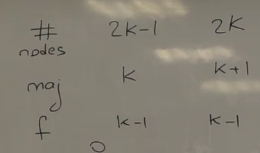

Т.е. выгодно брать нечетное количество реплик.

Вообще, если у нас чтения гораздо больше, чем записей, то мы можем менять систему кворумов (т.е. можем варьировать количество кворумов, чтобы ускорить например чтение, но замедлится запись (например у нас 5 узлов, мы пишем на четыре, а читаем с двух)).

Кворум - это инструмент, с которым мы хотим достичь линеаризуемость.

Никто не знает текущий $f$. Полезно подумать, что происходит с нашей системой, когда $f$ переполняется. Мы скажем, что у нас кворумы, поэтому кворум не соберется, поэтому система перестанет отвечать. Главное, что система не начнет отвечать неправильно.

### Поведение при партишенах

Это полезно в разговоре о партишенах. Мы выяснили, что у нас число узлов нечетное, т.е. пополам не расколится, есть большая часть и меньшая. Split brain не возникает, потому что есть большая часть и там кворумы собираются, и эта часть продолжает работать, а меньшая часть не собирает ни одного кворума, поэтому пользователю не отвечает. Так что меньшая половина этого мозга отмирает, а большая продолжает функционировать.

Если мы пишем на четыре, а читаем с двух, то мы чтение сможем обслуживать из обеих частей, но не сможем сделать ни одной записи.

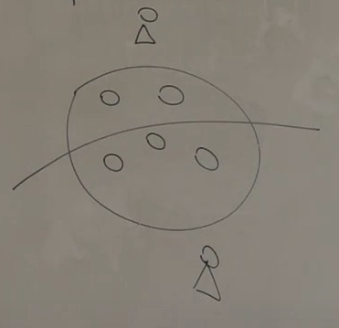

Partition случился, split brain не случился, успех.

## Нарушение линеаризуемости
Рассмотрим пример: если у нас запись завершилась и мы потом мы читаем, то кворумы нам дадут гарантию, что мы запись эту увидем. Но может быть другой случай, когда у нас запись затянулась:
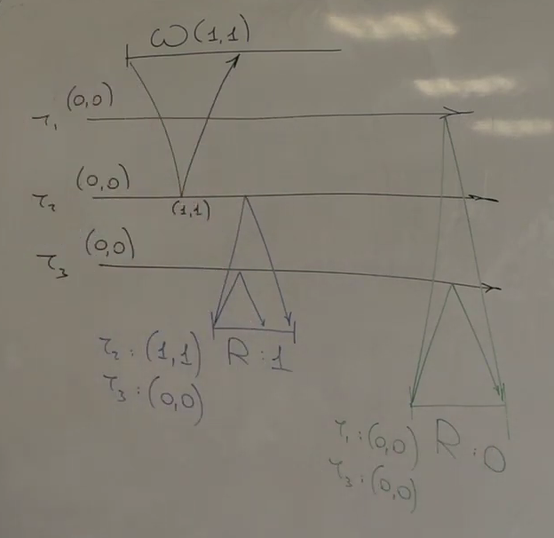

Вышло не очень клево. Наш алгоритм сгенерировал нам такую историю:
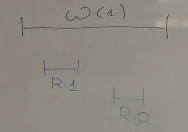

Эта истори не будет линеаризуемой, потому что что говорит требование линеаризуемости? Должна быть последовательная история, которая должна все объяснять, и если у нас в истории будет два вызова, которые не пересекались, то они должны идти в том же порядке. Т.е. в истории мы должны сохранить порядок r1, r0, а w(1) пересекалась со всеми, и мы можем поставить ее везде. Если мы сделаем

    w(1) -> r1 -> r0
то у нас должны быть оба чтения r1. Если сделаем:

    r1 -> w(1) -> r0
бред, а если мы сделаем:

    r1 -> r0 -> w(1)
тоже бред.

Т.е. видимо наша реализация не является атомарной и линеаризуемой. Беда.

## Фаза записи в операции чтения
Наш алгоритм не был безнадёжен. Мы его поправим.

У нас есть чтение и оно чиатет единицу, и оно не уверено, может быть кворум еще не собран, и чтение после может прочесть более старое значение. Как нам добитьсяся того, чтобы чтение, которое началось после нас, непременно прочитало бы единицу (т.е. значение не старше). Поможем закончить запись: после операции Read допишем значение в кворум. Если мы прочли два одинаковых значения, то можно не волноваться, эта запись точно состоялась, а если мы записали два разных значения, то мы не уверены про статус новой записи, она могла записаться, или же запись все еще тянется, поэтому мы добиваем эту запись.

Теперь в Read у нас две фазы: Read и Write.

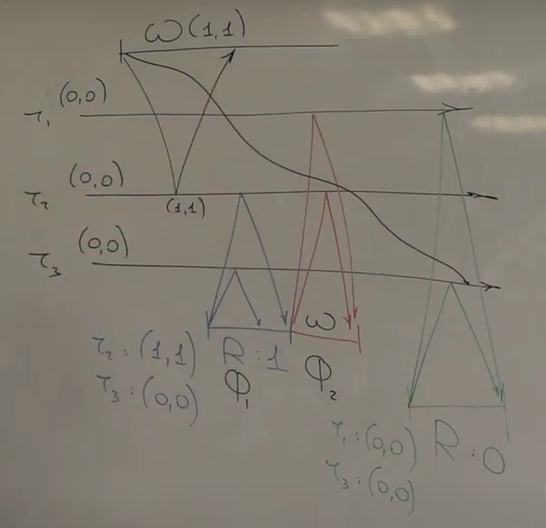

На самом деле нас это может не спасти: второе чтение может просочиться раньше и прочтет 0, но в этом случае это означает, что наша запись в первом чтении затянулась, и мы пересеклись со вторым чтением, и тут уже никакие гарантии нам не важны, потому что про пересекающиеся операции мы ничего не обещаем. (А если наша запись в первом чтении завершилась до начала второго чтения, то второе чтение прочтет запись из первого чтения).

## Доказательство линеаризуемости
Мы хотим показать, что полученный алгоритм является линеаризуемым. Каким образом это можно показать? Нужно предъявить линеаризуемость для любой истории. Вот мы взяли алгоритм, запустили его, сгенерировалась какая-то история. Нужно все операции, которые были в этой истории, выстроить в некотором порядке. Построим этот порядок.

Записи мы легко упорядочеваем, они упорядочеваются самим пишущим клиентом, он у нас один. Нужно расположить где-то чтение так, чтобы если мы эти операции будем выполнять в таком порядке, забыв про реализацию, они бы нам вернули то же самое.

У нас чтение выбирает максимум из тех временных меток, которое она увидела на кворуме. Давайте этот максимум возьмем и скажем, что это timestamp чтения.

В итоге у нас есть много чтений, мы их после записи и поставим:
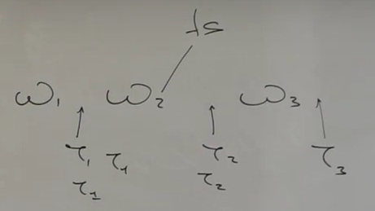

Конечно же, если у нас два чтения были упорядочены с одним timestamp'ом, мы их в таком порядке и поставим между записями, а если не были упорядочены, то в произвольном порядке, главное, чтобы после записи.

Если мы прогоним все слева направо, то чтение вернет то же самое, что и исполнение. Это линейный порядок, который претендует на то, чтобы быть линеаризацией. И чтобы быть линеаризацией, нужно следующее: если у нас есть две операции $O_1$ и $O_2$, такие, что между ними есть какой-то временной зазор, то в этом порядке timestamp'ов эти операции идут также, т.е. $ts(O_1) \leq ts(O_2)$ . Мы требуем гарантию относительно времени, и мы сейчас и показываем, что наши timestamps со временем согласованы. Это очень интуитивно: есть два случая более-менее
* Что, если $O_2$ - это запись? У нее timestamp больше, потому что writer выбрал новый timestamp, которого в системе вообще не было, потому что он генерирует timestamp'ы. Так что у $O_2$ timestamp больше, значит он стоит точно правее и в истории.
* Что, если $O_2$ - это чтение? Тогда чем может быть $O_1$? На самом деле не важно, это может быть или чтением, или записью, но чем бы оно ни было, у этой операции есть фаза записи, но либо это единственная фаза, либо это вторая фаза.

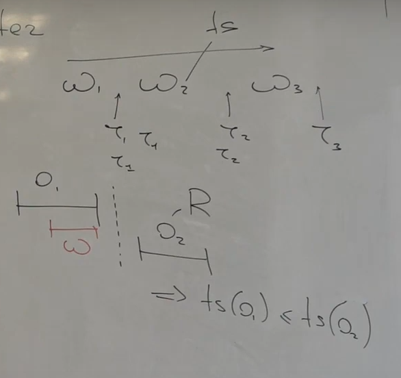

Ну и смотрим на эту картинку.
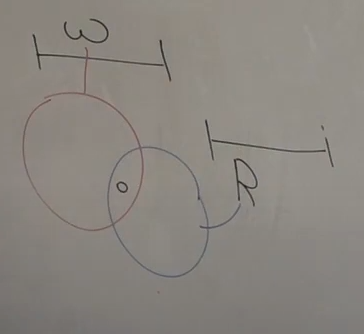
На второй фазе чтения или на единственной фазе записи мы записали что-то на кворум со своим timestamp, потом мы операции чтения $O_2$ пересеклись с этим кворумом на запись, получили этот timestamp, и значит он у нас не меньше.

## Случай нескольких писателей
Мы решали задачу, где у нас один writer. Нас такие системы не интересуют, поэтому теперь у нас много writer'ов. В чем сложность перехода? У нас один writer выполнял свои операции одна за одной и просто в голове увеличивал счетчик, ему было легко выбирать timestamps. А теперь мы хотим выбирать timestamps распределенно, на разных writer'ах. Чтобы все эти рассуждения (которые были) работали, нам нужно, чтобы timestamps выбирались распределенно монотонно, т.е. если бы у нас были бы две записи и они были бы во времени упорядочены, то timestamps находились бы в таком же соотношении: $ts(w_1) < ts(w_2)$. Как можно попробовать этого добиться?

### Выбор временных меток по часам
Cassandra делает так: мы пишем $Write(v, Now())$ . И это разумно: это не клиентское время, потому что в лекции обман - клиент сам ничего не пишет на узлы, в реальности клиент отправляет команду write, эта команда приземляется на какой-то узел, который называется **координатором**, и этот узел выбирает timestamp уже и собирает эти кворумы, а потом подтверждает операцию клиенту. Тем не менее, координаторы для разных записей могут быть разными, и часы у них могут быть несинхронизированы.
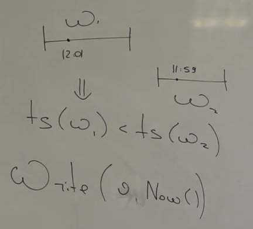

### Фаза чтения в операции записи
Мы хотим, что если запись состоялась, то следующая запись получит timestamp строго больший. Но если эта запись состоялась, то значит она уже записалась на кворум. Мы writer и у нас 3 реплики: мы сначала прочитаем с кворумов что-нибудь, выберем себе timestamp как $max()+1$ (на самом деле не воркает), а дальше сделали запись. Происходит две фазы: Read и Write, а глобально происходит Write. Т.е. в Read мы выбрали Timestamp, а во Write мы с ним записали. Нам нужна эта фаза, чтобы обеспечить свойство $ts(w_1) < ts(w_2)$. Вот этот синий кворум пересечется с кворумом на запись операции W1, у нас снова кворум на чтение пересекся с кворумом на запись.
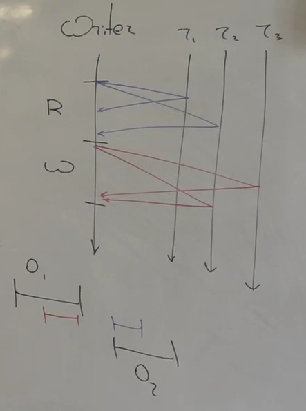

Почему на самом деле $max()+1$ не подходит? У нас могла быть другая конкурентная операция записи, и будет плохо, если он выберет тот же самый $max()+1$.

### True Time
Есть такие правильные часы (инфа выше), которые возвращают нам отрезок времени, в котором время точно содержится.

    TT.Now() -> [e, l]
Зачем он нужен Google и зачем он нужен нам? Google он нужен для генерации распределенных монотонных timestamp'ов. Чтобы две операции выбрали себе timestamp'ы, им нужно сделать лишнюю фазу коммуникации - пообщаться с другими узлами, чтобы узнать их прошлое. Так вот, True Time был нужен как раз для того, что если у нас реплики далеко, и коммуникация дорогая между ними, потому что они далеко физически, мы можем эту коммуникацию заменить на ожидание. Мы можем выбрать timestamp просто подождав и ничего не сделав, вместо того, чтобы общаться по сети.

Правило в Spanner: Commit Wait

## Чего мы добились?
Мы решили задачу в асинхронной модели. Т.е. мы нигде не ожидали поведение от часов, скорость доставки сообщений. Т.е. если отказов меньше половины, то это значит, что любая операция завершится, и это довольно неплохо. И мы получили линеаризуемость - тоже очень сильную гарантию. Но мы ничего не сказали про эффективность и как ее собираемся измерять. Нужно в каких-то понятиях оценить, насколько этот алгоритм хорош.

## Рестарты
У нас узлы взрываются - и это не проблема. А что, если узлы рестартуют? Если мы собрали кворум на запись, то мы ожидаем, что следующее чтение обязательно запись увидит. Поэтому если мы что-то пишем на реплику и она нам подтверждает, то она перед подтверждением должна надежно сохранить данные на диск, чтобы потом это обещание не потерть.

Так что рестарты поддерживаются очень просто: мы всего лишь сохраняем на диск все наши записи.

А теперь можно подумать о том, на что мы тратим время? У нас есть более-менее две величины:
* Round Trip Time - время, чтобы сходить туда и обратно
* Disk

Непонятно, что из этого доминирует. Если мы живем в DC на жестких лисказ, то у нас RTT меньше 1ms, а время записи на диск с flush - это 10ms. А если мы работаем в геораспределенной инсталяции, когда у нас RT требует >100ms, а еще у нас SSD, запись на который >10microsec. Поэтому в зависимости от того, какие у нас диски и как далеко мы расположили реплики, у нас может быть либо одно больше, либо другое. И вообще вся у нас операция называется **Кворумным флашем** (когда мы что-то пишем, мы должны собрать с кворума подтверждение, а для каждого подтверждения нужно записать на диск).

Мы построили ячейку памяти, мы решили задачу репликации такого регистра. Да, мы не умеем переконфигурировать систему, у нас обман с тем, что клиент знает про всех, но это мы пофиксим. Что нас действительно беспокоит, так это то, что мы хотим в нашей архитектуре БД поверх KV и Distributed построить транзакции, а чтобы построить транзакции, нужно делать что-то сложнее, чем чтение и записи.

Грубо говоря, у нас в атомиках есть не только store и load, а также CAS. Можно ли взять этот алгоритм и в него ввернуть эту операцию CAS? Заставляет задуматься...

# Семинар 2. Использование concurrency
*[Репозиторий с кодом](https://gitlab.com/Lipovsky/distsys-course/-/blob/main/tasks/all-tasks/2-atomic-kv/kv/node/main.cpp)*

Сейчас будет объяснение, зачем нужен курс по Concurrency.

Мы на лекции придумали алгоритм, вроде бы он понятен - нарисовали стрелочки, кворумы собираются, отвечаем пользователю. Алгоритм придуман, гарантии он соблюдает, у него есть отказоустойчивость какая-то понятная, он дает нам абстракцию линеаризуемого регистра, но остается сложность в практическом измерении: как этот алгоритм выразить в коде? И вообще, насколько сильно при разборе алгоритма мы отдалились от реальности? У нас была модель, которая уже прятала под ковер какие-то подробности реального мира (ну и кода в том числе), но и на самом деле клиент не наблюдает все узлы системы напрямую и не может общаться напрямую с узлами системы. Вдобавок к этому, узлы системы общаются друг с другом, отправляя асинхронные сообщения. Мы живем в модели **Message Passing**. Насколько все это разумно? Насколько все это далеко или близко к настоящему коду? В этом семинарые поймем, как все это соотносится с реальностью и как это писать (учитывая курс Concurrency).
## Переход к клиент-серверной модели
Когда мы обсуждали модель, мы говорили, что у нас есть узлы системы, и у нас есть клиенты. Да, мы рисуем везде стрелочки, в том плане, что мы отправляем какую-нибудь команду $Set(k, v)$, потом получаем подтверждение - ответное сообщение, вдобавок какие-то сообщения отправляют узлы друг другу. Снаружи нам удобнее говорить не про отправку сообщений, а про модель **клиент-сервер**, когда мы отправляем запрос и получаем в обратную сторону ответ, потому что в конце-концов мы, как клиенты, распределенности не наблюдаем, мы не хотим знать, что в системе у нас 5 узлов, мы просто подключаемся к какому-то адресу, к какой-то точке входа, и пишем в своем клиенте.

Т.е. мы создаем клиента, а потом говорит $Set$:

    client = KVStore(addr)
    client.Set(k, v)
Допустим, эта операция асинхронная, но как бы под капотом все равно летят сообщения, мы, видимо, открываем какое-то соединение, подключаемся к какой-то машине, отправляем ей какое-то сообщение, она его получает. Но в коде у нас синхронный вызов (может быть даже асинхронный, пусть **future**, не очень важно, мы получим future, подпишемся на нее), а внутри у нас отправка сообщений. И на лекции (второй) мы тоже рисовали алгоритмы, как будто бы у нас есть таймлайны и вот мы отправляем какие-то запросы и собираем какие-то кворумы, 1 стрелка - одно сообщение. А теперь мы хотим написать это в коде.

Можно задуматься: а действительно ли нам была бы удобна операция $Send(m, p)$ - отправить сообщение $m$ узлу $p$. Хотели бы мы так писать код?
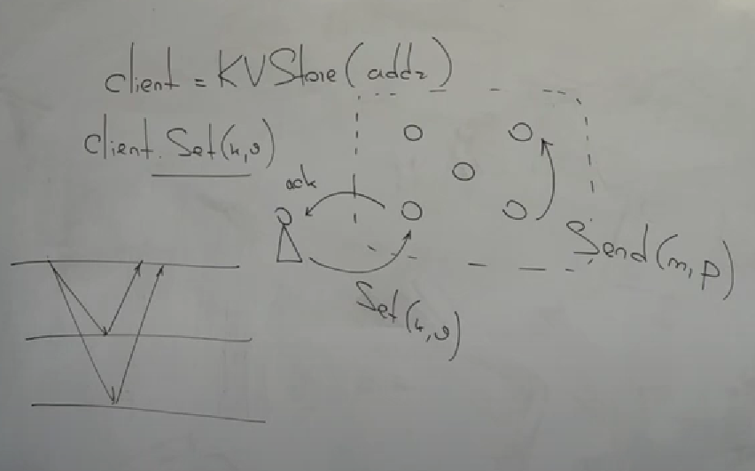

Сначала следует прокомментировать следующее: на лекции была неправда. Мы говорили, что у нас есть клиент, и он знает прям про машины системы. Зачем нам это было нужно на лекции? Затем, чтобы мы могли картинки рисовать: у нас был клиент, у нас были узлы системы, мы начинали какую-то операцию и собирали какой-то кворум. Нам было так удобно, чтобы рисовать мало стрелочек. На самом деле в реальном мире клиент не взаимодействует с узлами напрямую и не знает про эти узлы. Почему он не знает? Потому что на самом деле он работает не с системой из трех фиксированных узлов, которые реализуют ячейку памяти, он работает с KV Storage, в котором много узлов, и могут добавляться новые, а какие-то могут быть на обслуживании, поэтому мы на стороне клиента про какие-то конкретные адреса машин скорее мы хотели не знать (есть исключения, [например](https://cassandra.apache.org/doc/latest/cassandra/architecture/dynamo.html), но в целом это так).
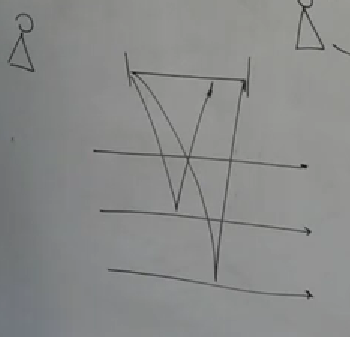

## Роли узлов

Мы действуем на самом деле честно: мы свою команду отправляем какому-то узлу. И когда мы говорим: "У нас есть протокол, где мы собираем кворумы", на самом деле это не мы собираем кворумы, не клиент, мы всего лишь адресуем свой запрос в какую-то случайную машину нашей системы, и эта машина уже собирает кворумы: она выбирает timestamp для записи и потом пишет что-то на кворум.

Если мы подумаем, как это написать, то мы на самом деле поймем, что на самом деле каждый узел, с одной стороны, участвует в реализации атомарного регистра (это реплика атомарного регистра), а с другой стороны на уровне алгоритма каждый узел играет разные роли. Когда узел получает запрос от клиента, мы скажем, что он координатор: его задача выбрать timestamp и собрать кворумы. А с другой стороны, у нас есть еще ситуация, когда узел просто получает команду на запись, смотрит на ее timestamp, сравнивает со своим локальным и обновляет или не обновляет. И, получается, сначала этот узел [который получает запрос от клиента] получает команду, выбирает timestamp и отправляет всем запись (в том числе и себе), а потом он как бы сам же ее получает и обрабатывает, хочет он под таким timestamp'ом ее писать или не хочет, потому что вдруг пока он сам себе отправлял кто-то другой пришел с более свежей записью. Так что каждый узел он, с одной стороны, один и в одном протоколе репликации, а с другой стороны, у него есть разные наборы методов, у него есть с одной стороны клиентские методы $W(v)$ и $Read()$, а с другой стороны у него есть метод "Запиши мне значение с такой временной меткой". У клиента никакой временной метки нет, но когда узел получил этот запрос, он выбрал временную метку и сам себе (в том числе) отправил команду $localWrite(v, ts)$, а еще и другим, чтобы собрать кворум.
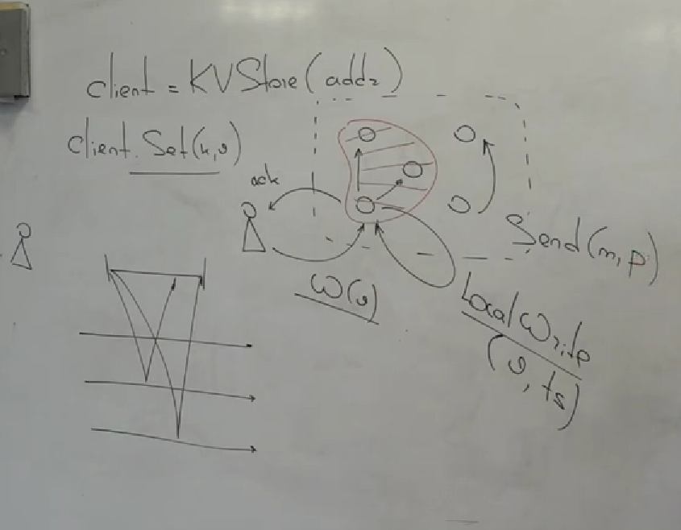

*Мы в модели атомарного регистра*

*На самом деле писать можно по-разному, на свете есть и другие модели программирования, сейчас рассматриваем 1 способ писать код*

К чему мы пришли? У нас один объект - один регистр, но при этом у одного узла есть разные наборы методов: есть клиентские и внутренние операции "Запиши" или "Прочти значение и верни мне timestamp".

Когда мы координатор операции, мы отправляем другим узлам команду $LocalRead() \rightarrow (v, ts)$ . Есть два набора методов, а это означает, что, если мы хотим это запрограммировать, то разумно эти разные наборы методов выразить в каких-то разных сущностях. Можно представить себе, что у нас есть один узел и он умеет все эти сообщения реагировать (4 обработчика). Мы хотим, чтобы это было как-то декомпозированно.

Скажем следующее: на уровне протокола вот эта декомпозиция приводит к понятию роли. В нашем протоколе регистра есть роли:
* **Coordinator** - активен, он получает запрос от клиента и инициирует вот эту запись. Он выбирает timestamp, отправляет всем команды $LocalRead()$ и $LocalWrite(v, ts)$ и собирает кворумы. Он находится уже внутри системы, поэтому клиенту вообще не нужно думать про временные метки. 
* **Replica** - пассивна, просто получает команды по-типу "прочти текущее значение у себя и верни мне его", мы читаем и возвращаем значение и его временную метку, или нам говорят "запиши значение" и мы получаем это значение, сравниваем временную метку этого значения со своей локальной, и, если она больше, то мы перезаписываем.

Все, что мы рисовали на лекции (второй) вот этих клиентов - на самом деле это были координаторы, и это просто роль узла. Разумеется, каждый узел может играть разные роли в разные моменты времени для разных запросов.

Мы хотим, чтобы в коде это было как-то выражено.

## RPC
Есть координатор и он собирает эти кворумы. Разве ему удобно будет использовать операцию $Send$ и какой-нибудь обработчик $HandleMessage$ ? Такая модель подразумевает, что у нас коммуникация односторонняя. Но с другом стороны, когда мы отправляем $LocalRead$ или $LocalWrite$, мы же ожидаем, что нам ответят что-то? Поэтому когда мы захотим это запрограммировать, мы захотим, чтобы у нас модель была другая. Внутри системы у нас был **Message Passing**, а между клиентом и системой **клиент-сервер**. Так наверное мы и в системе хотим сделать клиент-сервер. Т.е. мы не просто отправляем сообщение и ждем ответа как независимые действия, мы хотим склеить их в какое-то одно действие. Мы хотим, чтобы у нас каждая роль была сервером. И какой будет API? Чтение и запись - это то, что спрашивает клиент. При этом сам координатор является сервером для клиента снаружи и является клиентом для серверов-реплик, и он посылает серверам-репликам запросы например $LocalWrite$ и ждет синхронно подтверждение, ведь чтобы собрать ему кворум, он должен дождаться этих ответов.

Короче, то, что было в рисунках - полная ерунда, и это стоит забыть. Если мы говорим про написание кода, то мы хотим говорить, что у нас есть сервер, мы соединяемся с ним и задаем ему запросы. Вопрос только в том, как это выраженно в коде.

Мы говорим сейчас про программирование. Эти роли должны быть выраженны в коде как какие-то видимо классы, потому что это разные состояния и разные методы. Мы хотим в коде кворумы как-то разумно собирать. Координатор является для реплики клиентом, а она является сервером, и мы хотим в коде как-то эту коммуникацию клиент-сервер выразить удобно для себя.

Мы говорим про **Remote Procedure Call** (RPC). Мы, как координатор, хотим работать с узлом репликой, как будто бы она некоторый объект и мы вызываем у него методы. Собственно клиент так и работает: для него система является каким-то объектом, и он на нем методы зовет, и мы, как координатор, хотим общаться с другими узлами точно также. Мы хотим как будто бы на них вызывать метод $LocalWrite$ и чтобы когда он завершался, мы знали, что реплика подтвердила нам эту запись. И это очень естественно, потому что у нас реплика и координатор - это разные роли, а разные роли хорошо бы выразить в какой-то сущности в коде в одной.

Мы не хотим программировать на callback'ах, но это означает, что на их месте что-то возникает, а именно RPC. Мы хотим задавать запросы. В коде буквально два класса: Coordinator и Replica, и у класса координатор есть методы 

    void Set(Key key, Value value);
    Value Get(Key key);
, и у класса реплика есть методы

    void LocalWrite(Key key, StampedValue target_value);
    StampedValue LocalRead(Key key);
И когда координатор общается с репликами, он делает RPC вызов

    void Set(Key key, Value value) {
        WriteTimestamp write_ts = ChooseWriteTimestamp();
        WHIRL_LOG_INFO("Write timestamp: {}", write_ts);

        std::vector<Future<void>> writes;

        // Broadcast
        for (const auto& peer : ListPeers(/*with_me=*/true)) {
            writes.push_back(
                rpc::Call("Replica.LocalWrite")
                    .Args<Key, StampedValue>(key, {value, write_ts})
                    .Via(Channel(peer))
                    .Context(await::context::ThisFiber())
                    .AtLeastOnce());
        }

        // Await acknowledgements from the majority of storage replicas
        Await(Quorum(std::move(writes), /*threshold=*/Majority())).ThrowIfError();
    }
Он говорит: "Я вызываю на объекте Replica метод LocalWrite, передаю туда аргументами ключ и значение с timestamp'ом", а Channel - это такая абстракция для коммуникации между клиентом и сервером, т.е. это такое логическое соединение, к которому можно передавать запросы и получить ответ.

У клиента есть канал, и когда мы через него шлем rpc вызов, то мы шлем его в случайную машину:

    void Set(Key key, Value value) {
        Await(rpc::Call("KV.Set)
                .Args(key, value)
                .Via(channel_)
                .Start()
                .As<void>())
            .ThrowIfError();
    }
И на случайной машине в сервисе-координаторе запускается обработчик метода Set.

Мы хотим работать через rpc вызовы. Мы общаемся с удаленной машиной, но мы общаемся, как будто бы метод вызываем на ней. Т.е. у нас не какие-то абстрактные сообщения, у нас прямо типы, и под капотом отправляются сообщения, мы ждем обратное сообщение, но при этом эти пары связываются друг с другом, собственно rpc - это про то, чтобы связывать запросы и ответы. Это происходит как раз в объекте Channel.

[Пример rpc](https://grpc.io/docs/languages/go/quickstart/)

## Concurrency. Последвовательная и параллельная композиция

### Concurrency
Привлечем Concurrency. Оно возникает естественно: у нас каждый узел может быть координатором, а клиентов снаружи у нас много, и в один и тот же узел может прийти много запросов от пользователей, и он станет координаторов сразу для многих клиентских запросов, значит в нем уже появляется concurrency, и нам нужно разобраться, как действия координатора будут выражены в терминах всяких future, потоков, coroutines, и прочее. Т.е. на одном узле возникают разные конкурентные события, и как же мы их опишем?

Чем занимается координатор: он получает запрос от клиента, выбирает timestamp и пытается собрать кворум. Что значит собрать кворум? Это значит отправить запрос всем и дождаться большинства. Не всякий может ждать (например callback не может ждать, он может просто вызваться и отработать). Чтобы ждать, нужно быть на худой конец потоков, а лучше файбером, потому что очень непрактично заводить по потоку на каждый запрос каждого клиента, гораздо практичнее заводить потоков по числу ядер, а на них, на этом ограниченном числе потоков, исполнять файберы.

### Последовательная композиция
Когда мы (клиент), приходим в какую-то машину кластера со своим запросом, то мы фактически вызываем метод в сервисе-координаторе, и метод вызывается файбере, потому что этот файбер планирует дальше собирать кворумы и ждать. И это вообще супер естественно, потому что по алгоритму у нас получилось так, что координатор собирает не один, а два кворума. Т.е. он сначала отправляет всем, ждет, потом снова отправляет всем и ждет. Это называется **последовательная композиция**.

**Последовательная композиция**: сначала мы выполняем фазу 1, а затем фазу 2. Обработчик каждого rpc вызова - это файбер.

Как собирать кворумы? Мы координатор и хотим вызвать метод $LocalWrite$ или $LocalRead$ на всех репликах. Как в коде нам это написать? Каждая фаза - это действие и ожидание, потом точка с запятой и снова действие и ожидание. Чтобы ставить точку с запятой нам нужен поток. Потоки не практично, поэтому нам нужны файберы на threadpool.

[Формальная логика, которая лежит в основе Golang](https://en.wikipedia.org/wiki/Communicating_sequential_processes)

А что мы делаем внутри фазы? Мы могли бы сделать блокирующий API, т.е. мы отправили запрос, заблокировались, машина получила его, подумала, ответила нам, мы получили ответ, поматчили его с запросом, нашли файбер, который его ждал, и разблокировали его. Хотим ли мы делать так?

Если мы посмотрим, [как сделано в Go](https://pkg.go.dev/net/rpc/), то мы увидим синхронные и асинхронные API.

Нам нужно асинхронное API, потому что мы не хотим по-очереди опрашивать все машины, чтобы они нам что-то прочитали или записали, потому что это бессмыслица, потому что машины могут умереть. Мы хотим отправить на все параллельно наши команды, а потом дождаться, пока мы не соберем кворум, т.е. нам нужно асинхронное API.

### Параллельная композиция
Здесь неизбежно появляются **future**. Когда мы делаем запрос, то нам отдают просто future. Что мы можем с ним делать? У нас есть операция $Await$, которая позволяет заблокироваться на future. Вот если мы хотим сделать синхронный вызов, то мы получаем из rpc вызова future и дожидаемся ее, файбер блокируется пока не получит ответ.

Мы хотим сделать иначе: сделать три запроса и дождаться два ответа. Сама по себе блокировка на future она нам здесь не полезна (std::future бесполезна, потому что почти не решает задач).

Мы хотим собрать кворум. Мы собираем три future по числу узлов, с которыми мы общаемся (с репликами), берем эти future и отправляем их в комбинатор Quorum, который получает порог, который ему нужно достичь (сколько нужно получить future со значением), и возвращает нам новый future.

    // Await responses from the majority of replicas

    // 1) Combine futures from read RPC-s to single quorum future
    Future<std::vector<StampedValue>> quorum_reads = 
        Quorum(std::move(reads), /*threshole=*/Majority());
    // 2) Block current fiber until quorum collected
    Result<std::vector<StampedValue>> results = Await(std::move(quorum_reads));
    // 3) Unpack vector or throw error
    std::vector<StampedValue> stamped_values = results.ValueOrThrow();
Если нам нужно собрать два кворума, т.е. пройти через две фазы, то мы просто этот код дублируем.

У нас как бы есть стек удаленных вызовов, каждый вызов - это общение по сети.
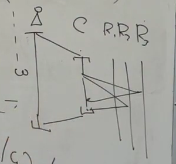

Что мы получили, через какие сущности мы выразили наш протокол? У нас получилось 3 измерения (на самом деле есть четвертое, про которое будет в конце лекции):
* RPC, Service
* Fibers
* Futures + Combinators

Мы на такой вот базис разложили все наши протоколы, т.е. нам для того, чтобы писать распределенные системы, можно было бы взять какую-то библиотеку RPC и concurrency, где есть futures и есть fibers (т.е. синхронная композиция и асинхронная композиция).

## Cancellation
Какие гарантии относительно отказов дают наши линки? Мы посылаем что-то в сеть и мы не понимаем, дойдет это или нет, может потеряться и тогда нужно ретраить. Как же мы все эти retry и restart учтем в коде? Мы хотим, чтобы в коде это выражалось максимально компактно.

В данном коде это выражено через $AtLeastOnce()$ - это реализовано через каналов. Это означает, что если мы отправим этот запрос в сеть, а нам в ответ соединение порвется или придет какая-то ошибка другая, то мы будем просто retry'ить, и future итоговое (которое мы получаем из вызова rpc::Call), оно закомплитится тогда, когда пройдет успешно retry. Т.е. retry происходит под капотом. У нас есть комбинатор, за ним есть 3 запроса и вот они retry'ются.

Мы запустили 3 запроса, получили 3 future, потом обернули все это в комбинатор и ожидаем, что вот за этими future тремя будут ретраи происходит, и комбинатор не будет ничего ретраить, комбинатор ожидает, что future закомплитится тогда, когда запрос пройдет успешно. Так что за вот этим кворумным комбинатором есть 3 каких-то алгоритма, которые ретраят что-то, и два из них добьются своих целей и получат ответы, и кворум соберется, и код разблокируется и побежит дальше, запрос закончится, клиент получит ответ. А третья машина будет не существовать, и где-то в нашем коде на нашем узле в тредпуле будет несчастная задачка ретраить эти запросы, и будет делать это бесконечно долго.

Есть две важные детали concurrency:

1. Остановка
2. Отмена

У нас есть асинхронная операция и нам нужно ее отменить. Беда в том, что future - это такое API, которое не позволяет нам это делать. Future - это такой односторонний канал, т.е. мы можем от producer'а передать что-то consumer'у. Нам нужно как-то в обратную сторону передать сообщение, что операция асинхронная больше не нужна. В Go для этого есть сущность **[Context](https://pkg.go.dev/context)** - у него есть разные функции, но в том числе это более-менее влажок про асинхронную отмену.

Мы в rpc::Call говорим не просто, что его нужно ретраить, мы говорим еще, что у нас есть контекст. И этот контекст - это способ передать вот этим трем RPC вызовам сигнал о том, что эти ретраи больше не нужны, этот запрос больше не нужен. И сделано это супер разумно: мы передаем готовый контекст - это контекст текущего файбера.

    .Context(await::context::ThisFiber())
У нас есть файбер, который обрабатывает запрос $Set$. Клиент отправил нам $Set$, у нас на сервере запустился файбер, который запускает $Set$ на координаторе, выполняет координаторские обязанности. Файбер побежал, сделал 3 запроса, мы начали эти 3 запроса ретраить. В какой-то момент 2 запроса завершились успешно, кворум собрался, файбер дождался, разблокировался, завершился и разрушился. И вот когда файбер разрушается, то протухает этот контекст. Когда он протухает, в нем выставляется флажок, что операция отменена, и асинхронная операция, которая крутилась где-то в фоне и не зависела от этого файбера вообще, она через контекст получила сигнал о том, что ей нужно отменяться. Это происходит здесь неявно, но это вот максимально изящно насколько это можно выразить. Т.е. где-то вызовется деструктор объекта какого-то, который проставит в контексте флажок, что операция отменена, что контекст протух.

Этот алгоритм однофазный и неправильный, а мы же хотим алгоритм двухфазный, и мы хотим собрать один кворум, а затем второй кворум. Поэтому мы хотим на самом деле 2 контекста иметь, т.е. мы хотим отправить 3 запроса, собрать кворум, и чтобы после этой строчки ненужные нам операции прекратились, а потом запустить 3 новые операции. Назовем штуку StopToken, и у StopToken есть объект StopScope. Этот скоуп умеет строить токены, а в деструкторе вызывает $stop_source_.RequestStop()$, который токен делает протухшим. Поэтому если мы хотим сделать алгоритм двухфазным, то мы должны сконструировать два объекта скоупа в своем блоке из фигурных скобок, и когда мы будем из этого блока из фигурных скобок в файбере выходить, этот объект будет разрушаться, он будет проставлять в контексте флажок, что токен асинхронной операции эээ, ну крч пора отменяться, и этот фоновый RPC вызов будет cancel'литься. Т.е. у нас есть механизм стоп токенов, которые про отмену
В итоге получается
* RPC, Service
* Fibers
* Futures + Combinators
* Cancellation

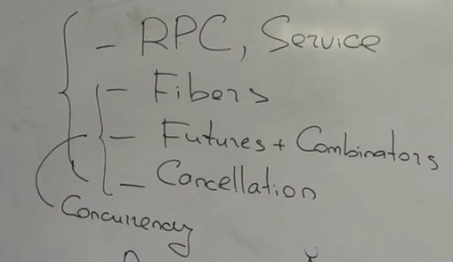

# Лекция 3. Atomic Broadcast, State Machine Replication, Consensus
## Recap: линеаризуемость, алгоритм ABD (Attiya, Bar-Noy, Dolav)
Мы начали с низкого уровня и сказали, что наши данные помещаются на одну машину и мы должны их там надежно хранить. Для этого у нас есть уровень **Local Storage**. В прошлый раз мы договорились, что интерфейс - это **KV Storage**. Дальше мы начинаем реплецировать ключи со значениями, которые по прежнему вмещаются на одной машине - **Replication**. Дальше мы говорим, что у нас много ключей, и поэтому нужно разбить реплики на разные машины - **Distribution**. И, чтобы реализовать полноценный SQL, нужен слой транзакций - **Txns**.

В прошлый раз мы решали задачу **Atomic (Linearizable) Register**.
* Write(v)
* Read

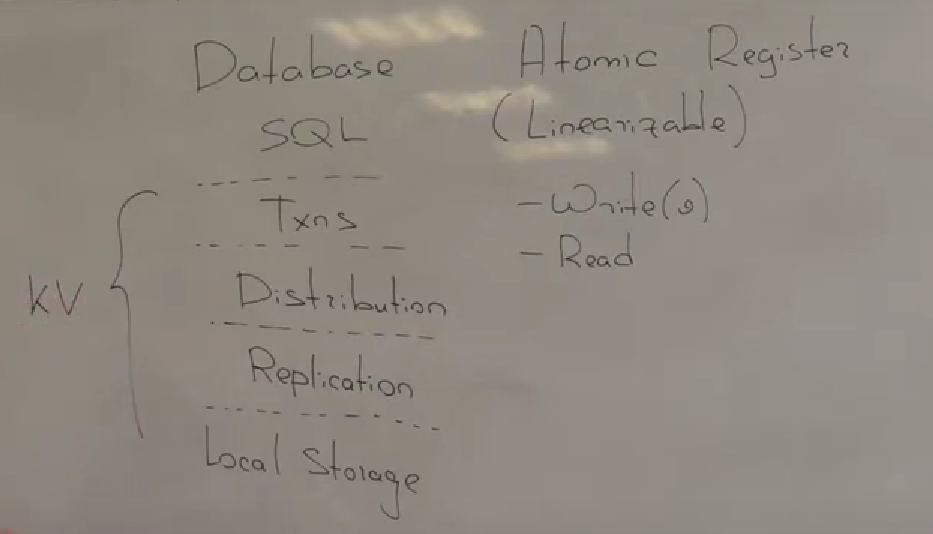

Переход от совокупности ячеек памяти к одной ячейке памяти достаточно интуитивный, но на самом деле здесь возможно спрятана какая-то сложность, потому что если вспомнить concurrency, то можно понять следующее: если у нас есть когерентные кеши в том виде, в котором они работаю в процессоре, без инструкций барьеров, то каждая отдельная ячейка будет **[sequential consistency](https://en.wikipedia.org/wiki/Sequential_consistency)**, но при этом проблема возникает, когда мы берем совокупность ячеек, они не будут sequential consistency в совокупности. А здесь мы взяли и от совокупности ячеек ушли к одной. Стоит подумать, легальный ли это переход?

Для начала вспомним про линеаризуемость. В прошлый раз мы сказали, что у нас есть некоторая задача - линеаризация ячейки памяти. Мы хорошо понимаем, как себя ячейка памяти ведет, когда с ней выполняют операции последовательно. У нас есть понятие спецификации ячейки памяти или любого другого объекта. Спецификация - это набор последовательных историй, т.е. набор всех таких исполнений, где операции выполняются подряд без конкуренций, и для каждого такого исполнения мы знаем, чем каждая операция в нем закончится.
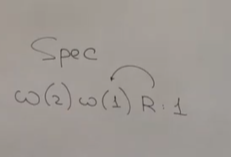

Мы пишем какую-то реализацию, и эта реализация, когда обслуживает клиентов, порождает конкурентные истории, где вызовы пересекаются во времени. 
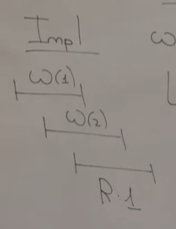

Свойство требования линеаризумости для нашей реализации заключалась в следующем: скажем, что наша реализация произвольного объекта с какой-то заданной спецификацией линеаризуема тогда, когда эта линеаризация порождает только линеаризуемые истории.

Что такое линеаризуемые истории? История линеаризуема, если про нее можно сказать следующее: все операции в ней как будто бы произошли в некотором порядке внутри системы, и этот порядок уважает реальное время. Т.е. если одна операция завершилась в физическом времени до того, как началась другая операция, то мы требуем, чтобы в порядке этом линейном, который все объясняет, эти операции были в том же отношении.
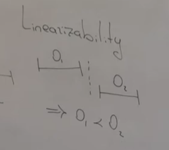

Требование линеаризуемости не требовала ничего от вызовов, которые не пересекаются во времени, а требовала от вызовов, которые пересекаются. Потому что пользователь снаружи системы свои операции упорядочить через причинность, когда клиенты обмениваются сообщениями друг с другом. Система об этом ничего не знает, но она уверена, что если вызовы упорядочены клиентом через **happens before**, то конечно же они будут упорядочены во времени, и если мы свой порядок применения операций согласуем с упорядоченностью во времени, то мы точно happens before для пользователя не нарушим. И с другой стороны: если у нас вызовы пересекаются во времени, то это означает, что пользователь между ними никакой причинности не выстроил, а значит он ожидать ничего и не должен.

Как мы решали задачу линеаризации линеаризуемого регистра? Мы выбирали реплики и сначала строили наивный алгоритм, где у нас writer отправлял свою запись на все реплики и дожидался синхронного подтверждения с кворума, а reader потом читал, для чтения он должен набрать кворум (в том примере кворум - 2 машины из 3 всего). Если у нас чтение и запись не пересекаются во времени, если у нас чтение после записи, то, если мы нарисуем кворум, который собрал запись, и если мы нарисуем кворум, который собрал чтение, то у нас будет пересечение по крайней мере 1 узел, и через этот узел чтение и узнает про последнюю запись.

Затем у нас был пример: есть одна длинная запись, которая долго не могла завершиться, но она в самом начале успевала записать $(1, 1)$ на вторую реплику, и у нас было два чтения. Первое чтение стартовало и собирало кворум из 2 и 3 реплик, и из 2 реплики получало более свежее значение, и завершалось единицей. Потом начиналось другое чтение, чуть позже во времени, оно собирало кворум из 1 и 3 реплик, и на них пока свежих апдейтов не было, и чтение возвращало 0. Мы получили нелинеаризуемую историю. Чтобы починить это исполнение, мы добавляли в чтение синхронную фазу записи: мы чтение не завершали до тех пор, пока мы не убедимся, что на кворуме лежит эта единица, и теперь у нас в операции чтение две фазы: фаза чтение и фаза запись.
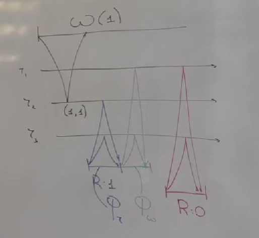

Потом мы столкнулись с проблемой, что writer один, потому что так ему было легко выбирать временные метки, чтобы реплики могли различать какое значение более старое, а какое более новое. Мы придумали как выбирать распределенно монотонные временные метки. Для этого можно было бы использовать TrueTime, или же можно было бы добавить в операции записи фазу чтения. Т.е. мы сначала опрашивали кворум, выбирали из него старшую временную метку, и брали себе условно $max+1$ (**на самом деле не воркает, нужно добавить к ней еще что-то уникальное**).

В итоге и чтение, и запись у нас становились двухфазными, очень похожими друг на друга, и все это получалось линеаризуемо.

Почему мы бросили много ячеек памяти и стали работать только с одной? Потому что линеаризуемость проще, чем sequential consistency. Линеаризуемость про атомарность, и можно строго доказать, что если у нас есть один линеаризуемый объект и другой линеаризуемый объект, и мы берем историю, где работаю и с одним, и с другим, то из линеаризуемости отдельных объектов следует линеаризуемость истории для двух объектов в совокупности.

Короче, такой переход от репликации диапазона ключей к репликации одной ячейки памяти был легален, потому что мы деалем линеаризуемую ячейку.

## ABD и операция CAS
Одного алгоритма будет недостаточно, потому что, например, в прошлый раз мы не пытались даже решать задачу переконфигурации. Но дело даже не в этом. Дело в том, что если мы хотим реализовать базу данных, нам придется подняться на несколько уровней вверх и сделать транзакции, а для того, чтобы сделать транзакции, нам нужны какие-то более сложные операции, нежели чтение и записи. Весь опыт курса Concurrency должен говорить о том, что load и store в атомиках недостаточно, нужны какие-то более сложные операции.

Как бы мы могли более сложные операции поддержать в таком алгоритме? Мы хотели бы добавить операцию $CAS(e, t)$ - если значение равно ожидаемому, то записать желаемое значение, и вернуть true, если не совпало, то вернуть false.

Чтобы выполнить такую операцию, нужно хорошо понимать, чему сейчас равно значение ячейки, причем это должна понимать каждая реплика. А каждая реплика у нас живет своей жизнью. И, чтобы у нас реплики сходились к одному значению, мы внутри этого алгоритма выбирали timestamp'ы. Временные метки и были у нас порядком линеаризации, т.е. логический порядок, в котором система должна применять операции записи.

Посмотрим на какую-то реплику. Пусть в нее прилетают две записи: сначало запись с ts 2, а потом запись с ts 1. Как реплика реагирует на такие операции? Когда реплика получает запись с ts=2, она обновляет у себя локальное значение и отправляет подтверждение пользователю. Когда приходит запись с ts=1, то мы знаем, что это уже устаревшее значение. Мы локально ничего не обновляем, но пользователю мы все равно отвечаем, что все хорошо.

Сама операция записи - **Blind Write**, т.е. такая операция игнорирует прошлое, никак его не учитывает. И вот реплика получает более старую запись, и она так логически должна была применить в прошлом, но как бы в прошлое ее легко встроить, потому что более новая запись как бы все следы этой старой записи стерла. Поэтому алгоритм так может делать.
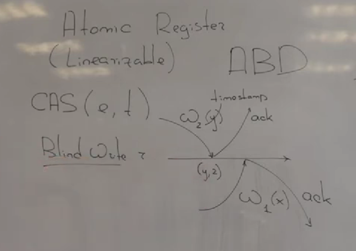

Теперь представим, что у нас есть операция CAS, и что же делать реплике? Вот на ней прямо сейчас хранится значение $x$ , и нам сначала прилетает $CAS_2(y, z)$, а потом прилетает $CAS_1(x, y)$ . Если мы считаем, что порядок на временных метках, который выбирают наши координаторы, это логический порядок применения операций, то кажется, что после выполнения этих двух операций реплика должна прийти к значению $z$ , потому что у нее есть сначала $x$ , потом первый $CAS_1(x, y)$ , потом $CAS_2(y, z)$.

$$x \xrightarrow{\text{CAS}_1(x, y)} y \xrightarrow{\text{CAS}_2(y, z)} z$$

Но вот эти команды приходят в каком-то порядке, алгоритм никак этот порядок не форсировал, он опирался только на ts. Что же делают реплики, когда она получает $CAS_2$ ?
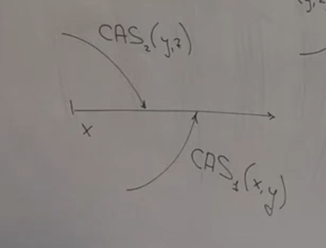
Нужно вспомнить, как мы выбирали timestamp'ы. Мы их выбирали с помощью логических часов, или с помощью синхронизированных часов (если вдруг это получится), но важно следующее: когда мы получаем ts=2, мы не знаем, выберется ли в системе ts меньше. Непонятно, что делать в этой ситуации. Если мы просто опираемся на такие аргументы и такое значение, то мы должны вернуть координатору ответ false. Но с другой стороны, если нам в будущем придет $CAS_1$, и мы пойдем, что он встраивается перед $CAS_2$, то оказывается, что прошлое изменилось, и его нужно пересчитать, а мы ответ уже дали. И мы так делать конечно не сможем.

Не то, чтобы это какое-то строгое доказательство, что операцию CAS невозможно так реализовать, но явно наш алгоритм испытывает трудности, и непонятно, как операцию CAS туда добавить, видимо нужно придумать другой алгоритм, но это будет уже не ABD.

Более компактная формулировка проблемы: у нас есть порядок на временных метках, которые задают порядок применения операций, с одной стороны. А с другой стороны сами операции приходят на каждую реплику в произвольном порядке. И непонятно, когда операцию считать готовой к применению.

## Totally Ordered (Atomic) Broadcast
В этой лекции мы починим эту проблему. Видимо мы хотим строить наш алгоритм на какой-то более удобной абстракции. Т.е. у нас проблема, что порядок есть, а в доставке сообщений он никак не задействован. Попытаемся придумать такой механизм транспорта этих самых команд, который бы нам и давал нужный порядок. Мы скажем следующее: было бы очень естественно, если бы команды на каждую реплику приходили в порядке применения. Ну или мы считали, что порядок, в котором команды приходят на реплику, это и есть порядок применения этих команд, и он видимо для каждой реплики должен быть один и тот же.

Сейчас придумаем не то чтобы алгоритм, а некий механизм, который позволит реализовать CAS.

Мы хотим сейчас выдумать примитив коммуникации, который позволит нам решать задачу репликации. Какие гарантии он будет давать, что он будет уметь?

Нарисуем 3 узла: это не реплики, это просто узлы. Atomic Broadcast дает нам одну операцию. Вот какой-то узел хочет отправить другим сообщение. Он хочет отправить не только к какому-то конкретному узлу сообщение, как позволяют нам провода, он хочет отправить его всем. Для этого у него есть специальная команда **A-BCast(m)** . Узел вызывает эту команду и начинается какая-то магия, и эта магия приводит к тому, что на каждом узле (в том числе когда-то на самом этом узле) вызывается обработчик **A-Deliver(m)**. Важно, что он когда-то вызывается и на самом узле, который отправлял это сообщение $m$, и вызывается не сразу. Стрелочки не прямые, потому что это не буквально отправка сообщения, это некоторый алгоритм. Вот он работает на каждом узле и в какой-то момент он принимает решение, что можно на данном узле выбрать обработчик A-Delivered(m) для сообщения m.
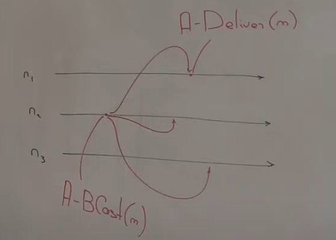

Пока непонятно, где здесь порядок. Давайте добавим еще один узел, который отправляет сообщение: A-BCast(m'). Чего мы потребуем от этого broadcast'а? Для сообщения m' также обработчик доставки должен быть вызван на каждом несбоенном узле. Еще мы ожидаем, что эти два сообщения m и m' будут доставлены на каждый узел в одном и том же порядке.
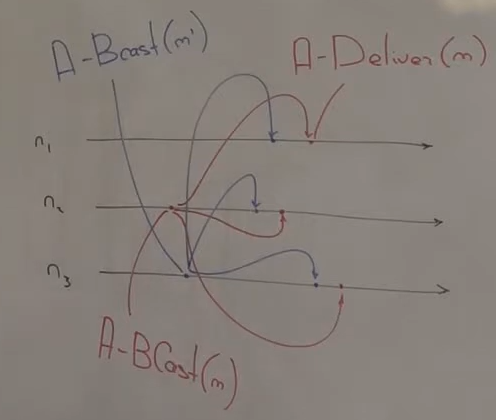

Какие формальные гарантии потребуем?
* Validity - если несбоенный узел стартует broadcast, то когда-нибудь в будущем этот broadcast вызовет обработчик на самом этом узле
* Agreement - если у нас какой-то несбоенный узел доставил сообщение, то другим несбоенным узлам broadcast доставим им сообщение и на них вызовется обработчик
* Total order - есть общий порядок доставки между узлами

Менее формально: если у нас есть бесконечное время и узел не сломается, то ему запрещается это бесконечное время не доставлять самому себе отправленное сообщение. Т.е. это требование, что с ним должно произойти что-то хорошее, если он бесконечно работает. А вообще про первые 2 свойства можно сказать следующее: несбоенные узлы получат один и тот же набор сообщений, и каждое отправленное broadcast'ом сообщение будет получено.

Третье свойство следует сформулировать аккуратно: нельзя сказать, что для любой пары сообщений они доставлены в одном и том же порядке, этого мало. Например: у нас есть три узла, и третий быстро отказывает, а первые два узла отправили красное и синее сообщение. Третий узел взорвался, поэтому все сообщения он получить не сможет. Если мы возьмем два любых узла, и возьмем два их префикса доставленных сообщений, то один не является префиксом другого. Здесь это не соблюдается, и мы такое исполнение запрещаем.
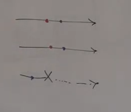

Наше требование Total Order: если мы возьмем любую пару узлов, и возьмем два префикса доставленных сообщений, то один является префиксом другого.

[Модель памяти на ARM](https://blog.acolyer.org/2016/02/02/arm-v8/) - процессор организован сложно, там не просто есть кэши есть у ядер, эти кэши организованы в некоторую иерархию, и когда мы что-то пишем в ячейку памяти, то наша запись по этой иерархии ползет вверх по памяти. Если у нас два ядра в разных концах этой иерархии, в разных листьях, далеких друг от друга, выполняют две записи, то возможно такое, что есть два наблюдателя на двух других ядрах, которые получат вот эти две записи в разном порядке. Такая конструкция называется **Non Multicopy Atomic Write**.

## AB как транспорт команд, State Machine Replication
Мы собираемся использовать AB для репликации, причем мы сможем реплицировать не только ячейку памяти с операциями $Read$ и $Write$, а мы скажем, что у нас есть произвольный автомат, т.е. у нас какой-то объект, и у него можно представить любой набор операций. Давайте скажем, что у нас вместа набора операций есть такая операция $Apply(cmd)$, которая переводит автомат из одного состояния в другое $s \rightarrow s'$ , и плюс еще что-то возвращает $s.Apply(c) \rightarrow (s',r)$ .

У нас есть такой автомат. Как же мы собираемся его реплицировать? Заведем себе реплики и пусть у нас есть какой-то красный клиент, который выполняет какую-то красную команду (какая именно команда нам сейчас неважно). Каждая реплика хранит свою копию автомата. Операция стартовала и клиент отправил команду на какую-то реплику. Мы эту реплику назовем красным координатором. Он начнет операцию broadcast, и A-BCast(c1) собирается вот эту команду доставить на остальные реплики, в том числе на себя.
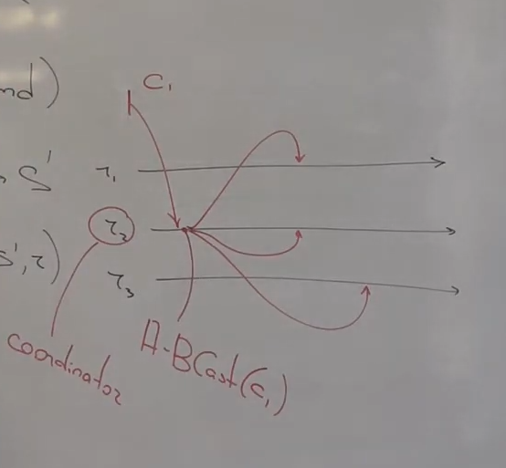

Зачем мы это сейчас делаем? Мы взяли прошлый алгоритм и увидели, что с операцией CAS проблемы. И вот у нас есть примитив, который может гарантировать один и тот же порядок доставки. Так вот будем использовать его как транспорт команд. Вот тот порядок, в котором этот примитив доставляет команды на реплики, это и будет логический порядок применений этих операций к автомату. И когда координатор, выполнив broadcast, сам получает свою же собственную команду, когда на нем вызывается atomic broadcast'ом обработчик, то в этом обработчике мы применяем ее к своей копии автомата - мы говорим $s.Apply(c_1)$ и то, что она вернула, возвращаем пользователю, отправляя весь результат. После этого операция завершилась.
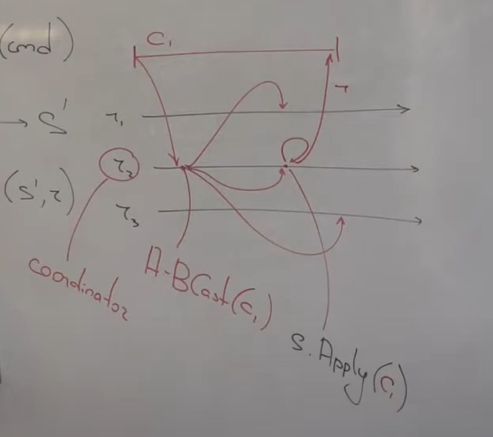

Добавим синего клиента, который хочет выполнить команду $c_2$ , он отправляет ее на другой узел - на синего координатора. Он также начинает broadcast, и когда мы применяем команду к себе, тогда возвращаем ответ пользователю.
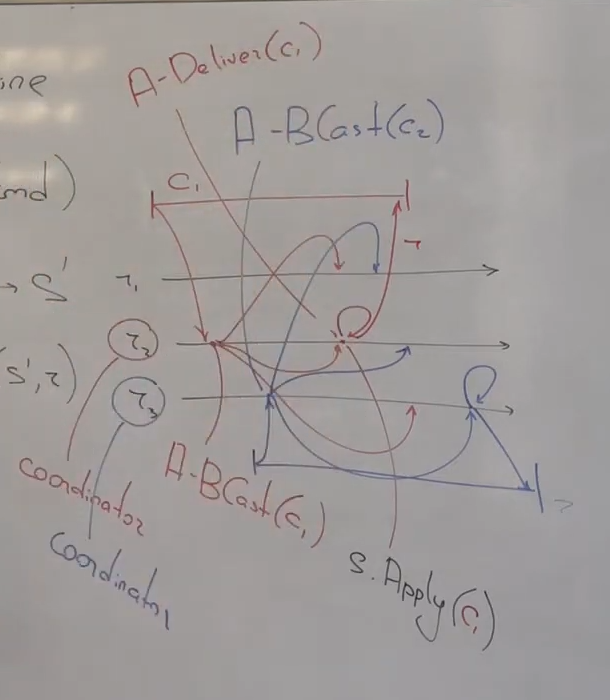

Все очень разумно: отправляем команду, произвольный узел становится координатором, он инициирует A-BCast, и когда эта операция приходит на него самого, т.е. на этом координаторе вызывается обработчик своей же команды, то операция применяется к автомату, и реплика сдвигается немного вперед. Для нас atomic broadcast - это просто транспорт команд. Он гарантирует, что все реплики получат команды от клиентов в одном и том же порядке, а значит будут проходить просто по одной истории изменений.

Вся эта конструкция имеет название **State Machine Replication** , а сам автомат, который реплецируется таким образом, называется **Replicated State Machine (RSM)**.
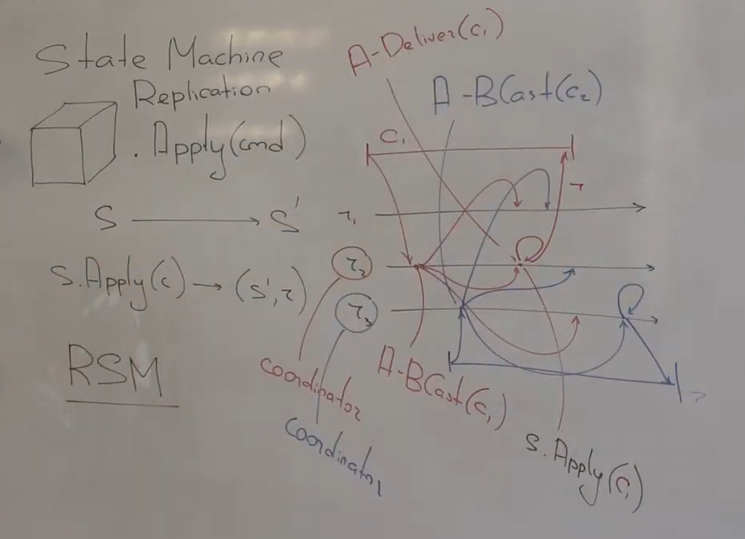

Зафиксируем наш прогресс: нам хочется иметь atomic broadcast, и если вдруг мы построим такой примитив коммуникации, то, используя его как транспорт команд, мы сможем реплецировать произвольные объекты.

*Дополнение:*

Мы на реплике 2 получили свою команду, применили ее к автомату, ответили пользователю. При этом на реплику 3 эта команда еще не приехала. Она может быть даже на 1 реплику еще не приехала, просто так нарисовали. Но при этом мы все равно команду подтверждаем. Беспокоит ли нас это? Когда мы говорили про наши алгоритмы на прошлой лекции, мы должны были собрать кворум, чтобы мы имели право завершить операцию. Здесь никаких кворумов не видно. На самом деле здесь есть кворумы, просто они в реализации этого Atomic Broadcast находятся. Т.е. алгоритм описан в термиах вот такого высокоуровнего примитива, и в нем стрелочка - это не отправка сообщения на самом деле, это что-то более сложное. Так что нужно разделять слои репликации, которые поверх протокола Atomic Broadcast, и сам Atomic Broadcast. Судя по тому, насколько просто мы решили задачу с помощью этого примитива, видимо сложность вся здесь будет.

## RSM в продакшене: ZooKeeper, YandexDB
Верно ли, что сама эта конструкция имеет смысл где-то в реальном мире?

[ZooKeeper](https://zookeeper.apache.org/doc/current/zookeeperOver.html) - это распределенная система, которая позволяет строить другие распределенные системы. Это такой маленький строительный компонент, внутри это дерево, а узлы в дереве - это атомики, т.е. это такая пачка атомиков, с помощью которой мы можем делать распределенное lock-free.

Состояние ZooKeeper реплецированно. Если мы захотим узнать, как он внутри реплецирован, то там реализован протокол [Zab](https://marcoserafini.github.io/assets/pdf/zab.pdf) - но там немного не такая схема бродкаста.

Есть облачные провайдеры, никто DC не строит. Нам нужна система хранения. Есть Google Spanner, у яндекса есть Yandex DB, она интересна тем, что она использует RSM как базовый строительный механизм.

Мир неидеален, и Google абсолюнто все резервирует и учитывает. В гугл, когда машины работают с локальными дисками, они, как правило, работают не с локальными дисками, мы диски делаем виртуальными поверх распределенной файловой системы.

Какой подход используется в YDB? Они строят распределенную систему, где много сервисов и много узлов, каждый из которых ненадежен. Давайтет скажем, что система состоит не из физических узлов, а состоит из RSM'ов, которые называются таблетками. Если мы будем строить систему не из узлов, а из вот таких вот tablet'ов, из RSM, то окажется, что в ней каждый узел надежен, т.е. он не ломается уже, ну т.е. конкретный физический узел может сломаться, но это лишь одна из реплик автомата, а другие узлы продолжат работать и продолжат обслуживать наши операции
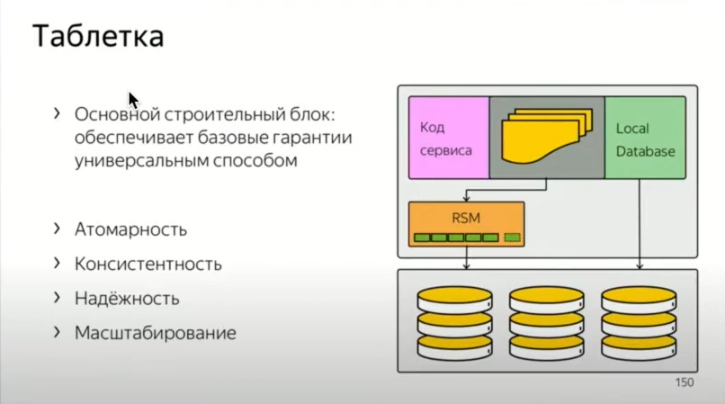
Таким образом, мы избавились от отказов в какой-то степени. Это, конечно, не решает все проблемы, все равно у нас система остается распределенной, но тем не менее узлы в нем уже становятся надежнее. Это сложно сделать, потому что под этими RSM есть другой уровень распределенной системы, который это все реализует, но мы строим сначала этот низкий уровень, потом строим RSM, и потом мы живем уже в другом мире. 

## Док-во линеаризуемости
Чтобы показать, что наша реализация линеаризуема, нужно для любой истории, которая реализовалась, предъявить линеаризацию.

У нас каждая реплика проходит через одну и ту же историю доставки, историю применения команд. Давайте скажем, что это и есть линеаризация. Мы хотим показать следующее: если у нас есть две операции, которые упорядочены во времени, то значит каждый узел эти операции в таком же порядке и получил.

Посмотрим от противного: нарисуем картинку, где такое не случилось. У нас была красная операция, она отправила свою команду на первую реплику, там эта команда довольно быстро себе доставилась и клиент получил ответ. И был синий клиент, который начался позже, чем завершилась красная операция. У него команда ставилась на третью реплику, там она быстро применилась и он быстро получил ответ. 
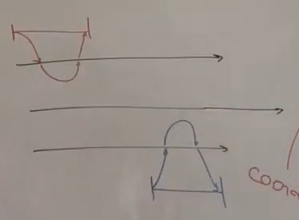

Но вдруг так звезды расположились, что если мы посмотрим на реплику 2, то там команды атомик бродкастом были доставлены были следующим образом: сначала синяя, потом красная. Могло ли такое случиться? Если такое случилось, то наш алгоритм не линеаризуем. Давайте убедимся, что это вранье.
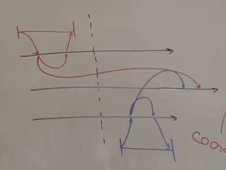

У нас есть Total Order, и если вдруг машина доставила красную команду, а до этого синюю, то значит и реплика 1 если она доставила красную команду, то перед этим синюю доставить. 
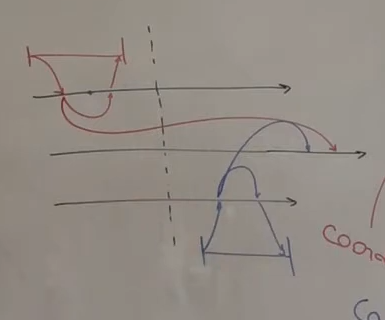

Получилось, что синее сообщение было получено первым узлом в физическом времени до того, как оно было отправлено третьим узлом. А значит мы получили линеаризуемый реплицируемый автомат.

## Недетерминизм
Хватит ли нам этого для счастья? Естественно, если учтем, что у нас уже есть готовый Atomic Broadcast. Верно ли, что все наши проблемы решены на свете? На самом деле нет, и даже для одного RSM это мало. 

Что еще нам нужно учесть для RSM? Есть нюанс, который мы принимаем как данность. Вот у нас есть Atomic Broadcast, который гарантирует как транспорт команд, что эти команды доставлены на каждую реплику в одном и том же порядке, и это как будто бы автоматически означает, что каждая реплика пройдет через одну и ту же историю изменений. На самом деле нет, это будет выполнено только при условии еще одном, когда операция $s.Apply(c) \rightarrow (s',r)$ является детерминированной. А есть разные способы детерминизм потерять.

Например мы используем время. Допустим у нас есть распределенная файловая система и нам на разные реплики прилетает команда Create, и какое время создания мы напишем? Если мы напишем свое собственное время создания, то, возможно, у нас на разных репликах это время разное, а потом пользователь создаст два файла, начнет сравнивать их время создания со своим порядком и он может удивиться. Что бы мы могли сделать? Пусть координатор выбирает время, но для разных файлов у нас могли быть разные координаторы, поэтому время создания одного файла будет одинаково у всех, но время создания двух разных файлов может быть немонотонно уже относительно самих операций создания. Неприятность.

Или мы используем операции с плавающей точкой. Тоже то, как они выполняются, зависит сильно от процессора.

Или мы используем хеш таблицы. К чему это приводит? Пусть мы пишем на C++, и для C++ у гугла есть библиотека [abseil](https://github.com/abseil/abseil-cpp) - библиотека общих компонент, гугл потихоньку релизит свою базу. Там есть [швейцарские хеш таблицы](https://abseil.io/blog/20180927-swisstables) - гугл считает, что они самые быстрые на свете. Почему это важно для нас? Дальше мы собираемся по этим хеш таблицам итерироваться, и мы не ожидаем, что порядок на хеш таблицах будет какой-то определенный, но все же мы считаем, что он будет детерменированный. Т.е. если у нас есть две хеш таблицы на двух узлах, и мы вставляем в них одни и те же элементы в одном и том же порядке, что реплика и будет в RSM делать, то мы ожидаем, что и порядок итераций потом будет общий. Но дальше мы смотрим в исходный код и видим, что хеш функция не какая-то фиксированная:

    ABSL_CONST_INIT const void* const MixingHashState::kSeed = &kSeed;
Сид - параметр хеш функции для нашей таблицы, и он устроен довольно затейливо, т.е. в качестве сида выбирается адрес этой переменной сид. Сложность здесь в том, что даже если мы собираем одну и ту же программу одним и тем же компилятором, и запускаем на разных машинах, то у нас может быть в ОС такой механизм, как [Address space layout randomization (ASLR)](https://en.wikipedia.org/wiki/Address_space_layout_randomization). Т.е. при запуске процесса наша переменная может оказаться в разных виртуальных адресах (ну а физические конечно будут разные). И получается, что хеш функции на разных узлах нашей хеш таблицы будут разными, и получается, что и порядок итераций будет разный. Кто знает, как мы от этого зависим в нашем коде. [В Go прямо говорят, что не нужно ни на что надеяться лучше](https://go.dev/blog/maps).
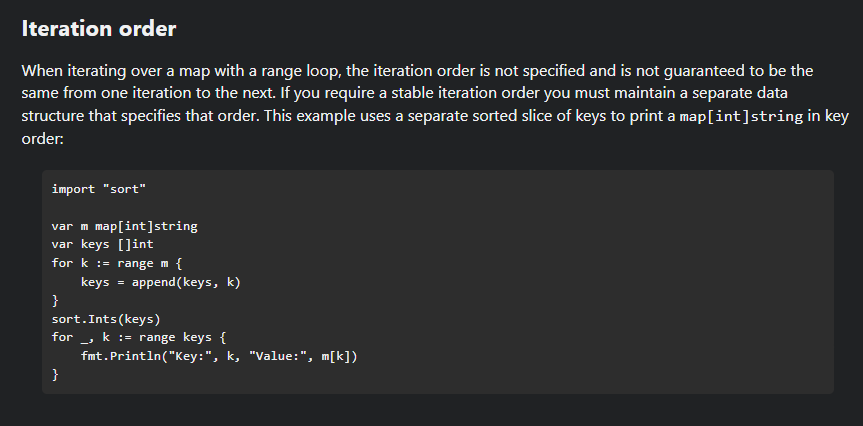

Или мы используем priority_queue - и непонятно, как он будет реагировать на то, если у нас ключи одинаковые.

## RSM - еще не все
Это была проблема про некоторую аккуратность, а есть довольно содержательные проблемы, т.е. ограничения скорее.

### Exactly once semantics
Первое: есть клиент, и он снаружи находится от нашей системы, и одной RSM ему для счастья мало. 

Вот мы клиент, и есть реплика какая-то, и мы ей отправляем свою команду. Наверное мы не ждем ответа вечно, потому что в конце концов реплика могла умереть, поэтому мы заводим какой-то timeout, и в какой-то момент timeout срабатывает и наше ожидание протухает. Мы ответ не получили, что делать? Либо запрос поретраить, или не поретраить. Но если ретраим, то у нас снова стандартная проблема распределенных систем: мы не понимаем, что глобально происходит. Может быть эта команда записи доставилась на эту реплику, эта реплика ее применила успешно, т.е. отправила broadcast там, ее там все получили, применили, реплика узнала ответ, но перед ответом взорвалась неожиданно, и команда применилась к системе, но мы об этом не узнали. А может быть так, что она взорвалась прямо сразу, и команду вообще не получала. Если мы сделаем ретрай, то, возможно, мы доприменим эту команду, возможно мы применим ее второй раз и может случиться какая-то беда.

Нам не хватает семанитики **Exactly-Once**. Сам по себе Atomic Broadcast эту задачу пока не решает.

*Шутка: There are only two hard problems in distributed systems: 2. Exactly-once delivery 1. Guaranteed order of messages 2. Exactly-once delivery*

### Транзакции
Есть еще одна проблема в том, что RSM имеет такое врожденное ограничение, что RSM реплецирует состояние, которое помещается просто в одну машину, а мы знаем, что состояние наше в одну машину поместится, ну в ZooKeeper'е поместится, а вообще не поместится, поэтому нам нужно заводить много RSM'ов. У каждого из них будет внутренний какой-то свой порядок операций, т.е. свой Total Order, но между RSM'ами этого Total Order'а общего не будет. Поэтому если мы хотим сделать поверх этих RSM'ов какие-то более сложные операции, которые задевают много этих отказоустойчивых узлов, то нам необходимы будут еще транзакции. 

Если обращаться к дизайну KV Storage и Database, то шарды, которые реализуют отдельные range, это как раз отдельные RSM, но разные RSM, которые хранят разные range, они независимы друг от друга, и между ними никакого сквозного порядка операций нет.

## Consensus
Нам нужно сделать Broadcast. К сожалению, сегодня прямо его мы не сделаем, мы его немного упростим и сегодня на этом остановимся.

Broadcast состоит из двух задач:
* Первые два свойства (Validity, Agreement) говорят, что несбоенные узлы доставят один и тот же набор сообщений, и каждое сообщение будет доставлено.
* Total Order говорит, что будет общий порядок доставки этих сообщений.

Если мы хотим сделать Atomic Broadcast, то нужно сделать две вещи: во-первых, нужно сообщение доставить, а во-вторых, в одном и том же порядке.

С одной стороны нужно доставить - **Reliable Broadcast**, неважно в каком порядке, просто чтобы все несбоенные узлы про все сообщения узнали. А дальше пусть эти узлы договорятся друг с другом про общий порядок. И тут нам пригодится задача **Consensus**.

**Consensus** - есть узлы (пусть 3, для простоты). Каждому из них на вход дается некоторое значение $Vinoput$. Каждый узел должен реализовать один единственный алгоритм $Propose(Vinput)$ (синхронный алгоритм) - узел его вызывает, передает туда свой input и когда-то возвращает некоторое $V^*$ .
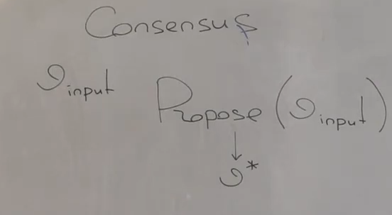
Алгоритм синхронный, т.е. мы запускаемся, работаем и возвращаем что-то.

Что мы делаем? Мы выбираем общее значение: у каждого узла есть свое предложение, каждый узел его предлагает другим и в конце концов они должны что-то выбрать.

Свойства, требования:
* **Validity** - разрешается возвращать из Propose только то, что было предложенно кем-то
* **Agreement** - все узлы должны получить одно и то же, выбирать одно и то же. Если на двух узлах Propose завершился, то он вернул одно и то же значение - это свойство
* **Termination** - хорошо бы, чтобы алгоритм завершался

Все чертовски просто, нужно договориться об общем значении. У каждого узла есть своя версия, он ее предлагает.

Вопрос (для понимания): Я, узел, предлагаю значение, а другие узлы еще не начали предлагать. Что же мне разрешается вернуть? Наверное, пока другие не предложили, я могу вернуть только свой input, но я вправе завершиться только тогда, когда я буду уверен, другие Propose, когда они начнутся, получат мой input. Если я не могу это гарантировать (свойство Agreement), то и завершаться я не должен.

Легко представить себе, как сделать консенсус не отказоустойчивым (мы, конечно, хотим отказоустойчивость). Пусть у нас есть три узла, и узел 1 будет главным, и мы ему будем отправлять все сообщения, в том числе и свое тоже, и вот то сообщение, которое он получит первым, он и будет считать выбранным, и всем его будет возвращать. Другое дело, что такой дизайн не переживает смерти одного узла, вот этого самого главного.

## Сведение AB к consensus
Можно заметить, что если мы умеем решать AB, то мы и консенсус тоже можем решать элементарно, т.е. эта задача не сложнее вроде бы.

Как решить consensus с помощью AB? Пусть каждый узел в Propose выполнит A-BCast и выберет то, что вернет ему первый вызванный обработчик доставки.

На самом деле эти задачи эквивалентны. Мы хотим AB решить через consensus и reliable broadcast.

Что такое **reliable broadcast**? Он гарантирует, что все сообщения, которые были отправлены корректными узлами, будут получены всеми другими корректными узлами, и все получат один и тот же набор сообщений.

Как сделать такой примитив, без порядка? Мы инициируем Reliable Broadcast и он состоит в том, что мы просто отправляем сообщение всем, в том числе и сразу себе. Т.е. у нас отправка broadcast'ом это все равно что отправка сообщения. Но это не будет reliable broadcast, потому что у нас может быть так, что узел, допустим узел 2, отправил сообщение себе и быстро его получил, отправил сообщение узлу 1, а узлу 3 не отправил, потому что взорвался перед этим. Это не Agreement.

Reliable Broadcast устроен чуть сложнее: когда какой-то узел получает первый раз новое сообщение, он его для верности ретрансмитит всем, чтобы уж точно дошло. Не слишком эффективно, но задача решена.

В жизни вообще никто так не делает, например в блокчейнах число узлов динамическое. Так что если у нас есть задача, чтобы все получили одно и то же, то мы можем использовать какой-нибудь протокол по-типу Gossip, у которого вообще гарантии какие-то более-менее вероятностные, ну просто вот когда-нибудь мы все размажем по кластеру, или там по набору узлов.

Как же мы с помощью консенсуса построить бродкаст? Мы собираемся с помощью консенсуса договориться об общем порядке доставки сообщений, и нам нужен будет не один консенсус, а много консенсусов.

Мы построим серию консенсусов таким образом, что каждый консенсус будет выбирать очередное сообщение или пачку сообщений, которые нужно доставить всем.

$$
C^1 \quad \longrightarrow \quad C^2 \quad \longrightarrow \quad C^3 \\
\downarrow \\
B^2
$$

Пусть мы умеем решать задачу консенсуса и у нас есть RB. Как нам теперь построить AB? Как будет выглядить операция A-BCast(m)? Мы отправляем всем сообщение с помощью R-BCast(m). Как будет выглядеть обработчик доставки сообщения, доставленное R-BCast(m), на каждом узле: R-Deliver(m) ? Мы поместим полученное сообщение во множество сообщений, доставленных RB.
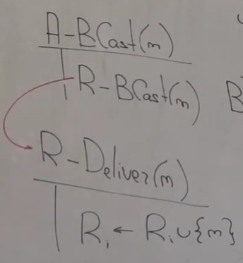
У каждого узла есть множество $R_i$ , изначально оно пустое - это просто мн-во сообщений, про которое узел знает. Т.е. это мн-во, которое в конечном итоге нужно упорядочить и для которого нужно вызвать обработчики доставки.

Кроме $R_i$ есть еще $A_i$ - это мн-во тех сообщений, которое мы уже на данном узле доставили, т.е. для которых мы вызвали обработчик A-Deliver. А теперь нужно разобраться, как же мы вызываем эти обработчики доставки на каждом узле? 

Для этого мы пишем несложный фоновый процесс. Во-первых, у нас есть round'ы, а дальше мы делаем следующее: пока у нас есть сообщения, которые мы получили через Reliable Broadcast, т.е. которые нужно доставить Atomic Broadcast'ом, но которые еще не были доставленны в этот узел, то мы переходим к очередному round'у и используем consensus. Ну у нас консенсусов потенциально много, мы начинаем консенсус и в качестве своего сообщения предлагаем те сообщения, которыми нами получены уже, но еще не доставлены в смысле Atomic Broadcast'а, и получаем некоторый набор сообщений $B^r$, после чего мы на всех сообщениях из этой пачки вызываем обработчик доставки Atomic Broadcast'ом, и добавляем этот $B^r$ во множество $A_i$.
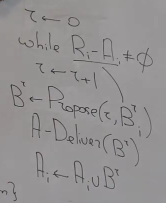

Теперь мы умеем выполнять операцию A-BCast и вызывать A-Deliver, а значит наша задача решена.

Пояснение:
* Этот процесс работает на каждой машине. На каждой машине есть мн-во $R_i$, оно пополняется Reliable Broadcast'ом, и мы смотрим: если у нас есть сообщение, о котором мы знаем, что нас просят его доставить Atomic Broadcast'ом, а мы еще не доставили, то мы формируем такую пачку из всех недоставленных нами сообщений, и говорим, что сейчас мы хотим в раунде $r$ доставить эту пачку сообщений.
* Мы предполагаем, что у нас есть две решенные задачи: задача Consensus и задача Reliable Broadcast. Задача Reliable Broadcast - доставлять всем несбоенным узлам один и тот же набор сообщений и доставлять все, что будет отправленно несбоенными узлами. Задача Consensus - у нас есть операция Propose: узлы предлагают что-то и выбирают одно и то же из того что было предложено. Мы делаем Atomic Broadcast: мы сначала доставить все сообщения, а из множества этих доставленных сообщений мы должны дальше выбрать порядок некоторый, зафиксировать на них порядок. Задача Consensus'а нам нужна для того, чтобы узлы, которые получают сообщение в абы каком порядке этот порядок выбирали, и для этого у нас будет серия консенсусов, и каждый консенсус будет выбирать очередное сообщение в этом порядке, или очередную пачку сообщений в данном случае.
* Когда мы делаем Atomic Broadcast, мы просто делаем Reliable Broadcast. Когда мы сообщение доставляем RB'ом, то мы помещаем его во множество $R_i$ - это те сообщения, которые мы должны доставить AB'ом, т.е. вызвать для них обработчик A-Deliver. А как же мы будем вызывать обработчик A-Deliver? Фоновая процедура выбирает, в каком же порядке эти обработчики вызывать. Что мы делаем? Запускаем очередной раунд, строим очередную задачу консенсуса, в ней мы предлагаем своих кандидатов, консенсус на всех узлах делает один и тот же выбор, выбирает одну и ту же пачку, и мы в некотором детерминированном порядке вызываем обработчики для всех сообщений из этой пачки.

Что мы вообще к этому моменту сделали? $Static\ Machine\ Replication\ \rightarrow Totally\ Ordered\ (Atomic)\ Broadcast \rightarrow Consensus$ . Отказоустойчивость вот State Machine Replication будет целиком зависеть от решения Consensus, т.е. сколько отказов консенсус переживет, столько отказов в конченом итоге будет переживать наш RSM. Но мы пока этого здесь не знаем, нам на этом уровне абстракции это неважно. Здесь никаких кворумов не собирается, у нас такие локальные процедуры для каждого узла. Единственная сложность - Propose, который должен гарантировать три своих свойства.

Чтобы доказать Agreement и TotalOrder, нужно сказать следующее: если у нас какой-то узел вызвал Propose в нулевом раунде, это означает, что у него $A_i$ пустое, $R_i$ непустое, значит там есть какое-то сообщение, а Reliable Broadcast гарантирует, что это сообщение будет доставлено по свойству Agreement, а значит у них тоже будет вызван Propose в первом раунде, а значит все вызовут Propose и он завершится, и доставит всем одно и то же, поэтому все пройдут в A-Deliver. А дальше какая-то индукция про то, что если в каком-то r-том раунде есть кто-то, кто дошел до фазы Propose, значит все остальные рано или поздно туда дойдут, потому что у всех $A_i$ общее, значит в $R_i$ есть что-то, чего нет в $A_i$ у всех, значит сообщение будет доставлено всем RB'ом, значит все вызовут Propose, значит все то же самое.

Последний нетривиальный момент: почему мы выбираем пачки, а не одно сообщение? Почему неверно было бы сказать, что мы просто берем из этой разницы произвольное сообщение и предлагаем его в Propose. Сломается свойство Validity, потому что у узла есть сообщение, он отправляет его, сразу кладет его в $R_i$ себе, и вот он в фоновом процессе есть, и если он всегда выбирает в качестве своего выбора это сообщение, то другие могут другие сообщения выбирать из тех, что у них есть, и этот узел может постоянно проигрывать со своим сообщением, бесконечно долго. Вот если мы выбираем всю разницу, то такого не бывает, потому что если какой-то узел сделал AB, то он сделал RB, значит по свойству RB это сообщение рано или поздно будет у всех в $R_i$, и в каком-то раунде просто в каждой пачке, которую предлагает каждый узел, вот это сообщение $m$ уже будет, поэтому неважно, какой выбор будет сделан, все равно сообщение будет доставленно. Т.е. либо мы отправляем всю пачку в Propose, либо мы говорим, что мы предлагаем самое старое из полученных нами сообщений, но вот любое нельзя.

**Итог**: если мы умеем строить RSM, то наша жизнь становиться проще, мы думаем уже в терминах не сбоенных узлов, а надежных, которые состоят из нескольких физических, но при этом атомарны, и мы можем не думать про то, как внутри реплецируются между собой. Эту задачу мы умеем решать, если у нас есть Atomic Broadcast, который служит транспортом команд в репликации. А чтобы сделать этот транспорт команд, который гарантирует общий порядок, нам нужно решить задачу консенсуса, и именно от решения этой задачи будут зависеть все свойства. Если там будет termination в конце, то у нас доставка будет завершаться. Если у нас будет Agreement, значит и Total Order будет. И с другой стороны, если мы в consensus нарушим Agreement, то TotalOrder у нас пострадает, и вся репликация у нас разойдется. Отказоустойчивость consensus повлияет на отказоустойчивость всей конструкции с репликацией автомата. В отличии от Atomic Broadcast задача Consensus не бесконечна, просто нужно 1 раз сделать выбор. Такая декомпозиция, такое сведение не то чтобы разумно делать в промышленном коде.

