**Theory of fault-tolerant distributed systems**
# Лекция 1. Модель распределенной системы
## Зачем нужна распределенность
Современный мир без распределенных систем сложно себе представить

Виды:
* KV Store - гигантская хеш таблица (упорядоченная)
    * Set(k, v)
    * Get(k)
* File system
* Coordination Service - распределенные системы, которые нужны, чтобы строить другие системы
    * Например, ~Atomics
* Message Queues
* Databases

Зачем нам делать что-то распределенным?
1) В одну машину все не помещается
2) Распределенные системы - это не только про большие данные. Одна машина может отказать, система должна быть отказоустойчива
3) Мы не хотим доверять каким-то машинам, одной или несколько, они могут быть злоумышленниками

Для того, чтобы строить алгоритмы, мы должны иметь модель мира, в котором мы собираемся работать

## Общая модель: узлы, каналы, отправка сообщений, клиенты, истории, модель согласованности
Что такое распределенная система?
В отличие от алгоритмов, которые что-то сортируют или ищут, мы от модели ждем каких-то гарантий
В коде клиента система выглядит как переменная, и мы выполняем над ней какие-то операции. Мы не единственные, кто так делаем, нас таких много. Внутри системы удобно говорить про **модель MessagePassing**, а снаружи разумно использовать **модель SharedMemory**

**History**
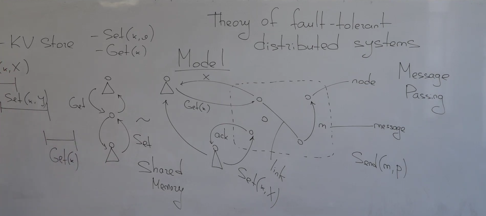

## Моделирование сети
### Гарантии доставки
Что может с сообщением случиться? У нас есть абстракция надежного канала, мы в него отправляем сообщение из узла *a* в узел *b*, и узел *b* даже начинает что-то получать и сообщение обрабатывать, и вдруг соединение рвется (например, кто-то задел провод), и все гарантии в связи с этим разрывом пропадают
Соединения либо гарантируют нам доставку, либо сообщат, что оно порвалось
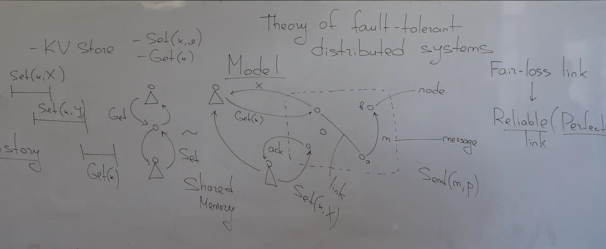
### Асинхронность и частичная синхронность
**Synchronous model**:
Есть константа $\delta$
$ delay(m) \le $ $\delta$ - задержка при доставки сообщения ограничена дельтой
Хорошая сеть может работать очень быстро, доставляя сообщение между двумя узлами за миллисекунду, почему бы не взять за дельту пару миллисекунд?
Такое бывает, но не всегда. Мы можем ожидать, что сеть работает быстро в каких-то частях нашего алгоритма, но мы хотим, чтобы наш алгоритм был устойчив к тому, что эта гарантия возьмет и нарушится, потому что мы физический мир не можем заставить так работать. Может быть куча случаев ошибки извне.

**Asynchronous model**:
Если наш алгоритм будет работать в таких предположениях, не ожидая верхней границы, то он сможет работать в реальном мире
* **Safety** свойство (минимальная задача алгоритма): система не должна уходить в плохие состояния, т.е. система не должна делать что-то плохое
* **Liveness** свойство: система должна делать что-то хорошее

**Partial synchrony**
У нас жизнь устроена так: есть ось времени, и некоторое время мы живем в асинхронной модели, тогда все плохо. А потом в какой-то волшебный момент __t*__ у нас эта гарантия начинает соблюдаться
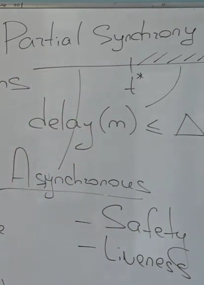
## Партишены и split brain
**Partition** - это явление, когда сеть раскалывает кластер на две части, так, что связность в пределах одной части сохраняется, но линки, которые пересекают эти партишены, перестают работать. В итоге наша система раскалывается на две части, и хуже того, она еще и клиентов раскалывает
**Split brain** - ситуация, когда система в случае партишена начинает работать независимо в двух частях
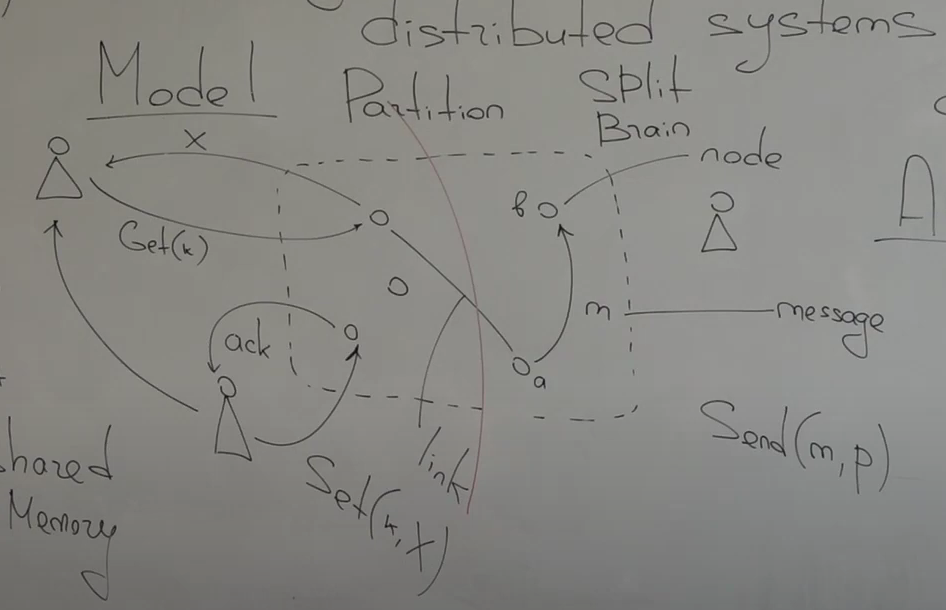
## Моделирование узлов, сбои узлов
Каждый узел - это автомат или актор, который работает однопоточно и принимает сообщение из сети, и вызывает какой-то обработчик, и когда этот обработчик вызван, узел меняет свое внутреннее состояние, принимает какое-то новое, и, возможно, отвечает какими-то новыми сообщениями

Можно представить себе, что реальная программа исполняется на пуле потоков
Можно представить себе, что вот эти все файберы и фьючеры бегут на экзекуторе, которой по пинку выполняет очередную задачу

* Crash
* Restart
* Византийские отказы

## Время, часы и их применения
Есть какая-то ось времени, но доступа ко времени мы не имеем. У нас есть часы. В теории, часы - это такая функция, которая по времени возвращает нам некоторое значение (в идеале возвращает t, тождественная функция)
Часы - это объект физического мира. И, как и все в физическом мире, они несовершенны
А как мы собираемся использовать время в алгоритме?

У нас есть now(), есть t1 и t2, мы можем сделать t1 < t2 (сравнивать показания времени) и t2 - t1 (измерять интервал времени).
Зачем нам нужно измерять интервал времени? Для timeout, для failure detection

Зачем нам сравнивать мгновенные показания времени? Для того, чтобы упорядочивать собычтия
У нас есть Петя, и он сделал запись X, и получил подтверждение. Затем Петя сказал Васе про изменение. А Вася, вместо того, чтобы читать, сделал новую запись Y. Запись X случилась до записи Y, и мы ожидаем, что если после всего этого пойти в систему и спросить "Что лежит по ключу K?", то она вернет Y. Для этого система должна понять, что в нее записали X и записали Y, и при этом запись Y - это более свежая запись. Как бы мы могли это достичь? Пусть узел, который получил запись X, присвоил ей временную метку - показание локальных часов: 12:00. А после записи Y другая машина присвоила записи временную метку 11:59. Потому что часы разное время показывали. Получилось, что для системы X произошел раньше, чем Y

**Scew** - рассинхронизированные часы

**Drift** - часы могут тикать иногда быстрее, иногда медленнее, чем идеальные часы

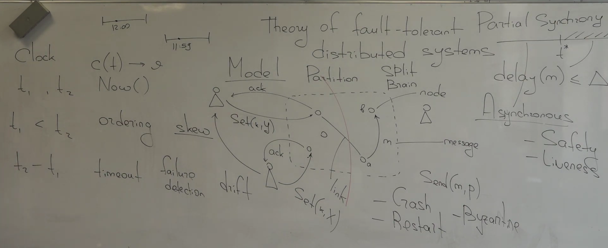

## Синхронизация часов, нижняя оценка
Представим очень простой мир, где есть два узла. И узел n1 хочет свести свои часы с узлом n2
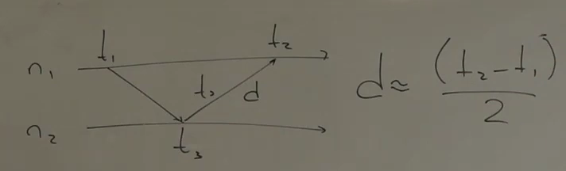
Пусть у нас есть ограничение на мир: любое сообщение доставляется в таком промежутке времени: $delay(m) \in [\delta-u, \delta]$
, где u - uncertainty , в то время как drift никакого нет
Синхронизировать часы (в такой модели) - это значит узлы должны выбрать своим часам какую-то поправку: $sc_i(t) = c_i(t) + o_i$
Кто-то в таком мире принес нам алгоритм и говорит: "Его можно запустить на двух узлах и через какое-то время можно подобрать такие поправки, что: $|sc_i(t) - sc_j(t)| \le \varepsilon$ "
Насколько маленьким может быть этот эпсилон? Рассуждения демонстрируют общую технику, которая будет использовать дальше:
Мы построим два исполнения, и они будут разными, которые, во-первых, будут различными, т.е. будут давать разные поправки в двух исполнениях, а во-вторых, алгоритм на двух узлах не смогут эти два исполнения отличить друг от друга, поэтому они выберут одинаковые поправки. И на этой коллизии у нас построится нижняя оценка

Мы управляем сетью и у нас есть два узла: $n_1$ и $n_2$. Пусть у нас от узла $n_1$ к узлу $n_2$ сообщения идут максимально долго насколько могут, а в обратную сторону максимально быстро. Мы строим такую сеть и алгоритм работает и синхронизирует часы. А теперь мы сделаем операцию, которая называется сдвигом - **shift**. Мы все события, которые происходили на узле $n_1$, оставляем на тех же местах, но переворачиваем сеть: т.е. теперь сообщение от узла $n_1$ к узлу $n_2$ летят очень быстро, а обратно очень медленно. Что произошло? Для узла $n_1$ ничего не произошло вообще, он не чувствует разницы. А для узла $n_2$ событие съехало немного назад, но он же не тупой и может это понять: в первом случае он получил в 12:00, а во втором случае в 11:59. Во втором исполнении переведем часы второго узла на $+u$. Утверждается, что хоть и во времени все съехало, но у $n_2$ нет возможность это почувствовать, потому что времени он не знает, он знает только то, что показывают ему часы, а часы показывают ему то же самое. Что мы получили? Мы запустили алгоритм в первом и втором исполнении, он синхронизировал часы. И в обоих случаях часы, синхронизированные для $n_1$ вообще не отличаются. Посмотрим на $sc_1(t*)$. Они принадлежат от -eps до +eps. А теперь подумаем, как работают синхронизированные часы для $n_2$. Алгоритм не чувствует разницы на узле $n_2$ между двумя исполнениями, а значит он выберет одну и ту же аддитивную поправку, но как бы сами часы отличались на $u$, т.е. синхронизированные часы узла $n_2$ в этих двух исполнениях должны отличаться ровно на $u$, и при этом они оба должны отличаться не более, чем на eps, чем $sc_1(t*)$. Т.е. $\varepsilon$ $\ge u/2$
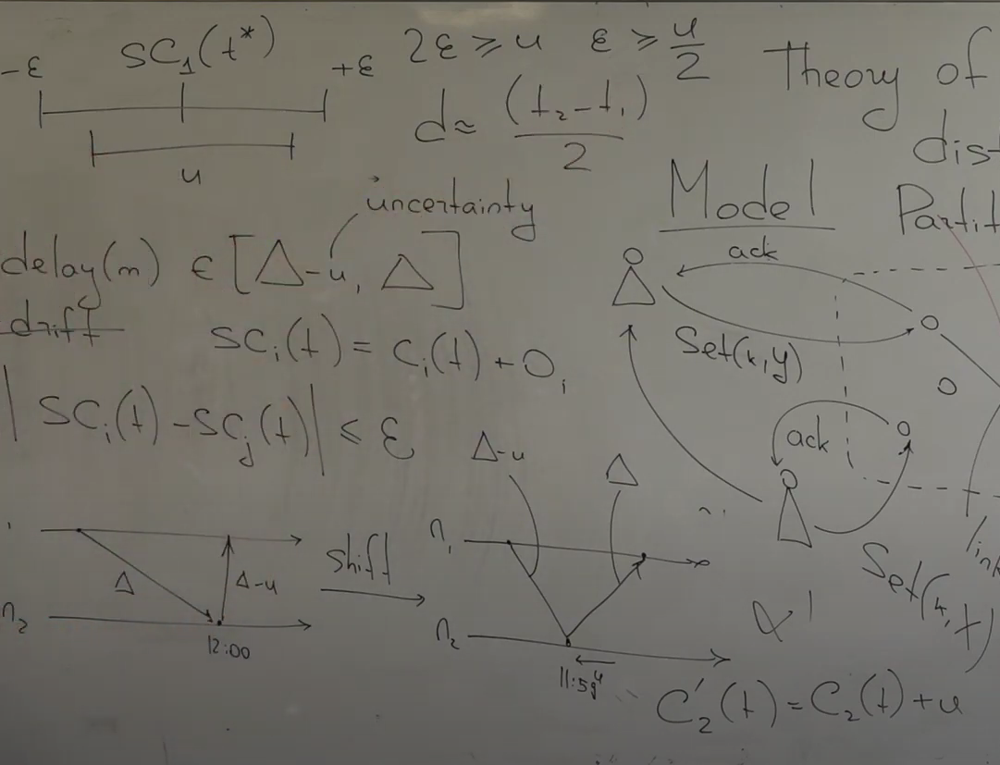
В случае n узлов оценка немного меняется: $\varepsilon$ $\ge (1 - 1/n)u$
## GPS и синхронизация часов
У нас беда с часами - мы не можем оценить асимметрию в сети, мы не можем оценить время round trip'а, а может быть иногда у нас нет этого round trip'a, у нас коммуникация односторонняя, и время доставки сообщения мы знаем довольно таки неплохо

Как найти нас на плоскости
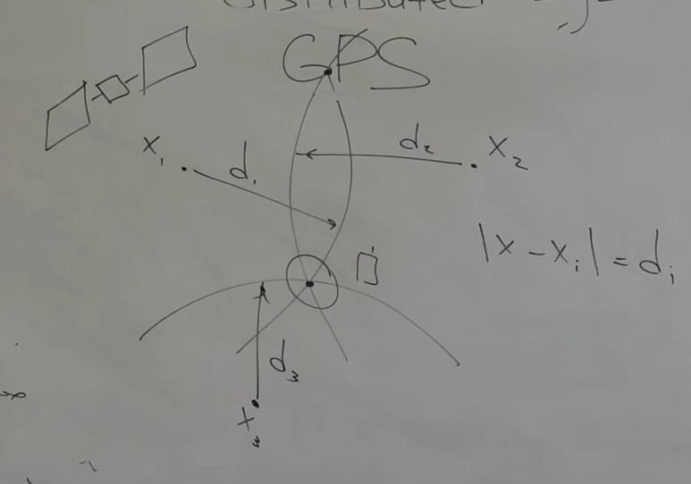

Добавим реализма: мы вышли в лодке в туман рыбачить. У нас есть карта и часы. На карте отмечено 3 маяка. Мы знаем, где они находятся, но не знаем, где мы находимся. Но мы знаем, что маяки раз в 5 минут издают какую-то пронзительную и уникальную сирену. И тогда наша система становится вот такой уже:
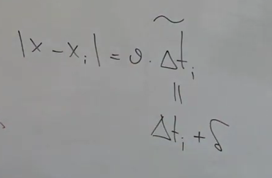 - навигационное уравнение GPS
4 координаты, 4 уравнения, 4 спутника
Система GPS нас позиционирует не только в пространстве, она нас позиционирует по времени, и чтобы позиционировать в пространстве, ей нужно синхронизировать часы на ресивере с часами в космическом сегменте спутника

## Google Cloud Spanner, Google TrueTime, ожидание вместо коммуникации
Непонятно, откуда тут возник GPS
Почти все те системы, про которые было написано выше, впервые написали в гугле.
Spanner - это одна из систем, которая предоставляет гугл. Это геораспределенная база данных, и чтобы ее написать, инженерам гугл понадобился новый подход к часам. Они используют часы в своих алгоритмах, но не now(), потому что доверия к ней нет. Они построили сервис - [TrueTime](https://cloud.google.com/spanner/docs/true-time-external-consistency). Как все это устроено? Мы можем на каждой машине спросить:

    TT.Now() -> [e, l]
    // e - earliest
    // l - latest
И система TrueTime гарантирует, что настоящее время внутри этого интервала
Чуть формальнее: если мы задаем запрос TrueTime.Now() в момент времени $t_0$, и получаем ответ в момент времени $t_1$, то этот интервал $[t_0, t_1]$ пересекается с интервалом $[e, l]$. Беда в том, что мы не знаем $t_0$ и $t_1$
Нам гарантируют это, и стремятся сделать так, чтобы ширина этого интервала была как можно меньше: $|l - e| \le 6ms$

Как это связано с GPS? TrueTime работает на каждой машине. И в датацентре помимо обычных машин, которые пользуются этим сервисом, стоят т.н. time-master'а. Бывает два типа тайм мастеров:
1) Машины, на которых установлены GPS антенны, которые синхронизируются с GPS для того, чтобы синхронизировать часы
2) Armageddon master - машины с атомными часами. У нас атомные часы в космосе, атомные часы у нас (для отказоустойчивости)
Исходя из всей этой информации, каждая машина выводит себе оценку этого интервала $[e, l]$. И выводит забавно: раз в 30 секунд каждая машина общается с этими мастерами и получает себе оценку интервала. А теперь через 25 секунд приходит Google Spanner и спрашивает у TrueTime текущее время. Что вернет нам TrueTime? TrueTime закладывает между точками синхронизации дрейф в 200 миллионных долей и вернется промежуток больше

Читать как иврит справа налево
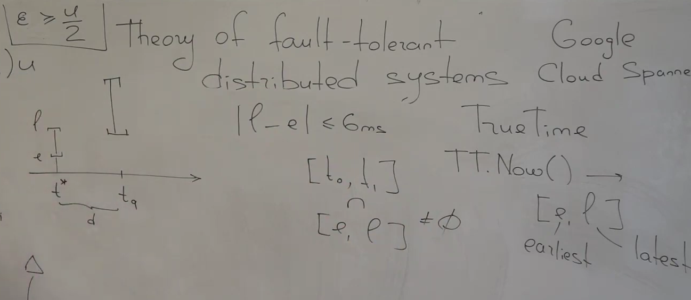

## Зачем распределенным системам TrueTime?
Время - это такая хитрость, общее разделяемое состояние между машинами в сети. Чтобы мы могли что-то сделать, надо чтобы машины поговорили друг с другом, чтобы они друг о друге что-то узнали. У них есть что-то общее - время. Они могут говорить явно друг с другом, отправляя сообщения. Google используют TrueTime для того, чтобы не говорить. Они строят не просто базу данных в кластере, они строят геораспределенную систему такую, в которой узлы стоят физически далеко друг от друга. И когда мы общаемся по сети внутри ДЦ, там действительно могут быть тайминги очень маленькие (1ms). Когда мы пересылаем байтики через Атлантику или с Восточного на Западное побережье США, там уже тайминги сотни миллисекунд. И мы с помощью некоторой хитрости можем понять, как можно эту коммуникацию, которая может быть долгой, можно заменить на локальное ожидание, т.е. мы просто сидим и ничего не делаем, и засчет этого что-то становится лучше. Но сидим мало: 6ms, вместо того, чтобы общаться долго и ждать 100ms. Это большая хитрость за счет того, что время у узлов общее.

## Итоги
Можно сказать следующее: (в данном курсе) мы живем чаще всего в асинхронной модели, т.е. мы не делаем предположений о скорости доставки сообщений, мы не делаем предполоожение о скорости работы часов, и мы не делаем предположений о дрейфе часов (в тех случаях, когда мы доказываем, что системы не нарушают каких-то гарантий, т.е. safety. Когда мы доказываем, что система не делает ничего плохого, мы используем асинхронную модель, где нет параметров времени никаких. Когда мы доказываем, что система вообще говоря делает что-то полезно и отвечает пользователю, то мы тогда привлекаем таймауты, какие-то оценки, время доставки сообщений и прочее)

# Семинар 1. Среда исполнения распределённой системы
*Когда у нас есть одни часы, мы знаем, который час, но когда у нас много часов, мы плохо понимаем, что происходит*

## Разные временные оси
[Иллюстрация временных осей в мире](http://leapsecond.com/java/gpsclock.htm)

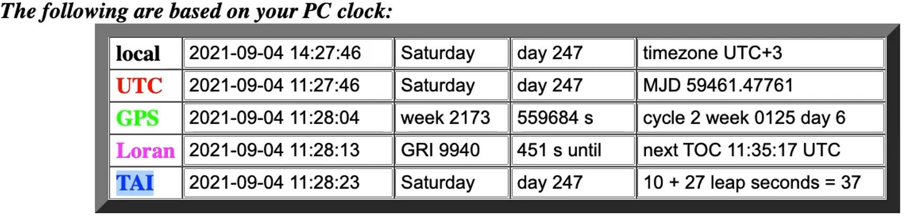

* TAI - международное атомное время (названо по-французски, поэтому буквы в непривычном).
Почему атомные часы, а не что-то другое? Тут нужно понять, что мы вообще понимаем под временем, что мы считаем эталонным временем? 
Раньше люди использовали естественную меру времени: астрономическую. Например, когда солнце в зените, а затем когда оно снова в зените, то видимо прошел день. Чтобы из этого получить секунду, мы делим сутки на 86400. Мы получили секунду, но в чем беда? Земля несколько неравномерно вращается, т.е. Земля - это не самый точный периодический процесс. Если мы хотим определить секунду через какое-то астрономическое явление, связанное с Солнцем и Землей, то нам нужно что-то усреднить еще. Когда-то секунда равнялась 1/86400 какого-то среднего дня. Сейчас секунда определяется иначе: [Секунда — время, равное 9 192 631 770 периодам излучения, соответствующего переходу между двумя сверхтонкими уровнями основного состояния атома цезия-133.](https://ru.wikipedia.org/wiki/Секунда). Теперь астрономические явления становятся отвязанными от определения секунды.
* GPS - там тоже атомные часы, но время отличается. На самом деле атомные часы в космосе и атомные часы на Земле - это немного разные часы ([пруф](http://themarginal.com/emc2/applications_of_relativity_in_gps.htm)). В DC серверы стоят в стойках, их кто-то охлаждает, температура в стойке вверху и внизу разная, кварцевые часы очень чувствительны к температуре и они дрейфуют по-разному наверху и внизу стойки, уже расходятся и очень неприятно. Атомные часы вообще супер чувствительные: если поставить их напол, а потом поднять их на руки, то они уже по-разному будут идти. В случае GPS мы их вообще в космос запускаем: там гравитация меньше, и часы летают вокруг земли на огромной скорости. ОТО предсказывает, что атомные часы, находящиеся на орбите Земли, будут тикать чуть быстрее, и будут опережать атомные часы на земле на 45 microseconds per day. В то время как СТО предсказывает, что атомные часы, летая на большой скорости, будут двигаться немного медленнее, на 7 microseconds per day. И когда их туда запускают, их заводят так, чтобы они на 38 микросекунд медленнее шли, чем на Земле, чтобы с ними можно было сопоставляться на Земле. **Но это все забавная история, дело на самом деле не в этом. Все из-за того, что есть UTC.**
* UTC - есть два способа это расшифровать. С одной стороны, это Coordinated Universal Time (англ.), с другой стороны это Temps Universel Coordonne (фр.), и по какой-то причине ни одно из них с UTC не складывается. Беда в том, что довольно плохо, что мы отвязали секунду от астрономических явлений, но при этом мы их как бы наблюдаем, и давайте сделаем так, чтобы сходилось одно с другим. Если Земля вращается немного быстрее или медленнее относительно эталона секунды, то мы сделаем так, чтобы если вдруг у нас накапливалась лишняя секунда или куда-то пропадала из вращения Земли, то мы бы ее либо добавляли, либо извлекали из этого дня. Так получается явление под названием **секунда координации (leap second)**

## Високосные секунды
[Статья на вики](https://en/wikipedia.org/wiki/Leap_second)

Земля вращается то чуть медленнее, то чуть быстрее, поэтому иногда в день вставляют лишнюю секунду (которая выглядит как 23:59:60). Это такое техническое решение, чтобы связать временную ось и Солнце. Именно поэтому у нас есть три шкалы: UTC, GPS, TAI.

* TAI: никак не учитывает секунды координации, оно считает секунды по определению секунды, т.е. нет високосных секунд.
* GPS: тоже считает секунды по определению секунды, но эта ось времени запустилась немного позже, и оно было сначала синхронизировано с UTC, в итоге в GPS есть несколько високосных секунд.
* UTC: есть все високосные секунды

Зачем же нам об этом знать (кроме того, что это забавно)? Мы сделали астрономов счастливыми, а пострадали разработчиками, поскольку работа со временем это коллосальная боль всегда (например, time zones). Есть проблема: например, есть [Unix time](https://en.wikipedia.org/wiki/Unix_time), где в сутках 86400 секунд, но в сутках бывает +- 1 секунда еще, и этот Unix time ведет себя странно: он возвращает количество секунд с начала эпохи, но при этом иногда нужно в эти тайм стемпы добавить лишние секунды, какой-то тайм стемп повторяется. Т.е. наш Unix time ведет себя иногда немонотонно, а ведь это "очень естественно" ожидание от времени, что время идет назад xD. Короче, мы можем пострадать в своих распределенных системах, если будем полагать на монотонность течения времени.

[Пример, когда так пострадали](https://blog.cloudflare.com/how-and-why-the-leap-second-affected-cloudflare-dns/). Здесь часы в Go шли немонотонно, после чего родился такой [issue](https://github.com/golang/go/issues/12914), что хорошо бы, когда мы вычитаем две временные метки, мы всегда получали бы что-то неотрицательное. И если мы сейчас посмотрим на [реализацию часов в Go](https://github.com/golang/go/blob/master/src/time/time.go), то там есть на самом деле два числа:

    wall uint64
    ext int64
И что это значит? На самом деле у нас в компьютере два вида часов, которыми мы можем пользоваться. Т.е. два типа часов, не в смысле какого-то физического механизма, а гарантии и операций, которые над ними допустимы. 

## Монотонные часы
У нас есть Wall time часы - они показывают время, которое мы ожидаем, это время на разных часах в разных узлах у этих часов общая точка отсчета, но они видут себя немонотонно. Второй вид часов - монотонные часы, они ведут себя монотонно, но у них нет точки отсчета общей.

Мы можем сравнивать показания wall time часов с разных машин в нашем алгоритме, но мы не можем рассчитывать, что эти часы синхронизированы вообще, и мы доказали, что этого не добиться. Но вообще сравнение показаний часов на разных машинах - это физически разумная операция. А вот сравнение показания монотонных часов на разных машинах - это абсолютно бессмысленная операция, потому что у них разная точка отсчета, но мы можем заводить какие-то timeout, timer и прочее.

Что же случилось в Go? Добавили в реализацию часов две компоненты: wall time и показания монотонных часов. Например, если мы замеряем интервал времени, то нам не нужнен wall time.

[То же самое есть в C++](https://en.cppreference.com/w/cpp/chrono#Clocks): [system_clock](https://en.cppreference.com/w/cpp/chrono/system_clock) и [steady_clock](https://en.cppreference.com/w/cpp/chrono/steady_clock). Т.е. когда мы вычитаем показание now, мы всегда получаем какой-то duration некоторый, но вот операции, которые допустимы с самими временными метками, это уже разные наборы операций для этих типов часов.

Теперь представим, что мы пишем не одну программу, которая использует время, и должны быть аккуратными, а мы пишем целый Google, и у нас очень много программ: у нас очень много сетевых приложений, тысячи разработчиков, которые написали многие миллионы строк кода, и нам говорят: "Скоро в Time scale (во время) вставят високосную секунду", и мы в панике, потому что кто знает, где эта секунда взорвется, что взорвется от того, что у нас часы пойдут немонотонно в какой-то момент. На самом деле это давно решенная проблема, и способ ее решения называется [Leap Smearing](https://developers.google.com/time/smear). Это решение не на уровне приложений, конечно. Мы не можем заставить всех разработчиков проверить свой код и нигде не ошибиться. Вместо этого мы можем просто избежать этот ход назад: мы можем в своем DC развернуть собственный сервис NTP, который будет подсказывать компьютерам в этом DC несовсем честные секунды, а немного увеличенные секунды. Секунды у нас будут идти чуть медленнее, чем должны, но зато их будет правильное количество, и тогда у нас time stamp'ы не пропадут и не повторятся.

## Устройство датацентра
Мы хотем делать отказоустойчивые системы, и эта отказоустойчивость достигается не только на уровне алгоритмов, но и на уровне железной инфраструктуры. Например, Google пытается всё резервировать, в том числе и источники питания (вдруг сбой), и кабели (кто-то порвет сети: экскаватор, грызуны и пр.).

[Статья Google](https://storage.googleapis.com/pub-tools-public-publication-data/pdf/45855.pdf), в которой они пишут, что их сеть глобальная, но при этом частная: все байты, которые путешествуют внутри систем Google, они путешествуют только по их каналам, по их коммутаторам, по их оборудованиям. И они его контролируют и резервируют на всех уровнях, в т.ч. прокладывают собственные кабели по морскому дну.

Что происходит внутри DC? Есть какие-то шкафы - **Rack** (стойка). Все машины, которые есть в DC, уложены в стойки. В [DC Яндекса](https://yandex.ru/company/technologies/datacenter) стойки содержат до 80 серверов, и они подключены к внешнему миру и другим серверным стойкам через коммутаторы, которые в этих стойках стоят. При этом, если в стойке выходит из строя коммутатор, то мы теряем не одну машину, а сразу несколько.

**Failure domain** - часть системы, которое выходит из строя, в результате какого-то одного сбоя.

Если мы хотим хранить что-нибудь надежно, то мы должны хранить это на несколько машинах. При этом если реплики нашей системы, которые хранят одни и те же данные, находятся в одной стойке, то поломка сетевого коммутатора приводит к тому, что мы теряем все копии. В реальных системах нужно это учитывать (пример: система хранения HDFS (там это учитывается)).
Мы должны резервировать коммутаторы, причем даже мб от разных производителей.

Серверные стояки мы должны объединить в один кластер. [Доклад Google про все на свете](https://static.googleusercontent.com/media/research.google.com/en//people/jeff/Stanford-DL-Nov-2010.pdf) - на заре времен делали так:
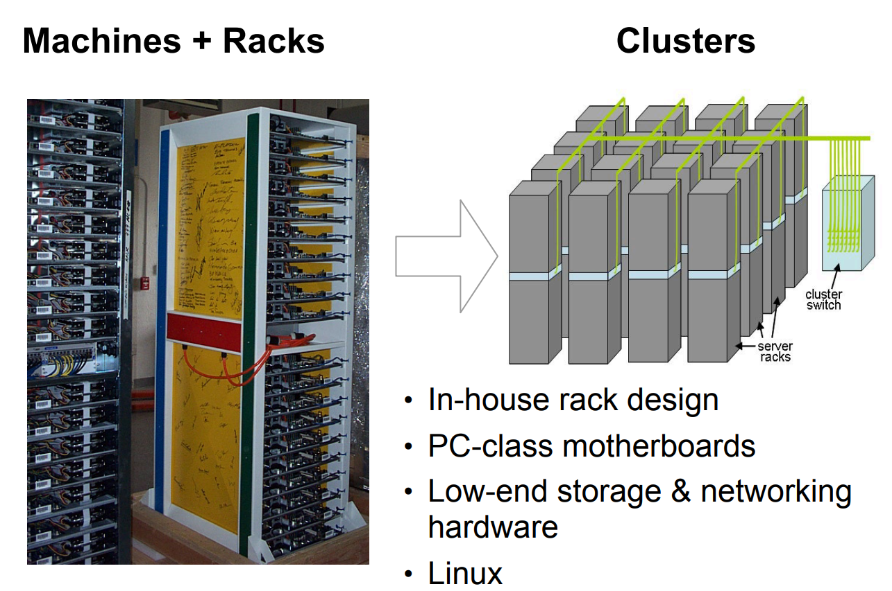

На заре времен делали так: брали эти стойки, у каждой из них был коммутатор, который называется **top of rack switch** (потому что он наверху стойки, но на самом деле он может быть не наверху), и у нас есть такой агрегирующий **switch**, который соединяется со всеми стойками, и дальше все через этот switch могут общаться друг с другом. Но есть проблема: если у нас это оборудование ломается, то весь наш кластер разваливается, у нас единая точка отказа (**single pointer failure** - вывод какого-то одного компонента не должен приводить к тому, что вся система становится недоступна). Другая проблема: эта коробка не резиновая, т.е. у нас ограниченное количество портов. Третья проблема: как жили большие компании в 2010-х? У каждого свои сервисы, свои машины для обработки запросов, каждому сервису нужны физические машины, чтобы запускать код. Любой сервис должен рассчитывать на пиковую нагрузку, а для этого нужно ресурсы резервировать, т.е. мы заказываем больше машин, чем обычно используется, а потом машины просто стоят и не используются, что является большой тратой в больших масштабах. К чему пришло человечество?

## Устройство сети
Не нужно делать много маленьких кластеров, нужно делать один большой гигантский кластер. У нас система геораспределенная, и мы хотим в каждой точке сделать очень большой кластер, где будет десятки тысяч машин, и что мы хотим от такой сети? Во-первых, мы хотим, чтобы в такой сети не было много избыточности, в смысле маршрутов, чтобы ни одна какая-то сетевая коробка не приводила к тому, что какие-то две машины потеряют связанность. Во-вторых, мы хотим, чтобы у нас была очень большая пропускная способность любого разреза в сети. В-третьих, мы хотим, чтобы в нашу сеть можно было спокойно добавлять новые машины, чтобы она масштабировалась. В-четвертых, мы хотим, чтобы в ней не требовались специальные какие-то коммутаторы с очень большим числом портов.

Как собрать такую сеть? [Старое решение](https://engineering.fb.com/2014/11/14/production-engineering/introducing-data-center-fabric-the-next-generation-facebook-data-center-network/) и [новое решение](https://engineering.fb.com/2019/03/14/data-center-engineering/f16-minipack/) из facebook. Посмотрим на старое решение, ибо в новых топологиях что-то очень громоздкое:

Серые точки - это стойки. Сам кружочек - это коммутатор, который их связывает с внешним миром. Из этих стоек мы собираем т.н. поды (**pod** - единица расширения сети, т.е. если нам нужно добавить новые машины в сеть, мы строим новый pod):
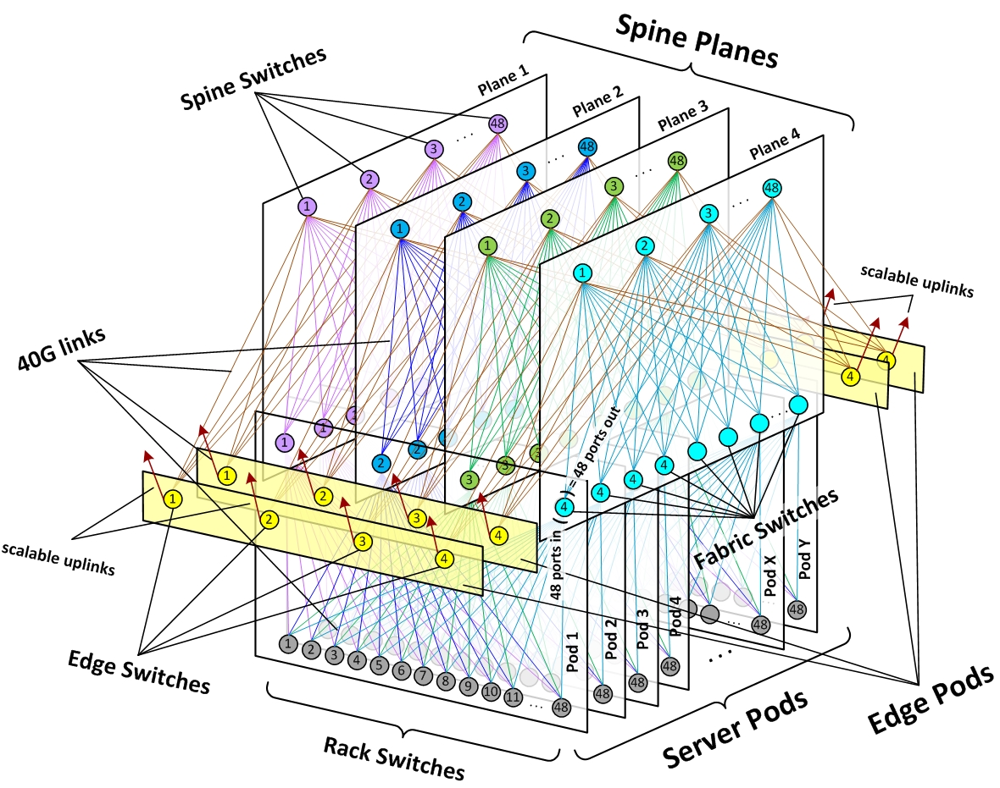

Мы хотим, чтобы внутри этого пода у нас была какая-то избыточность. У нас есть 4 switch'a, и мы к каждому из них цепляем все серверные стойки. В итоге у нас есть 4 способа каждой машине с каждой поговорить.

А дальше мы делаем много таких подов, и нам теперь нужно, чтобы мы могли связать стойки из разных плоскостей. Для этого мы пересекаем их перпендикулярными плоскостями (Spine Planes), которые организованы точно также. В основании этих плоскостей вот эти самые свитчи из подов. Spine Switches объединяют Fabric Switches.

Итого у нас изобилие маршрутов, которыми мы можем связать две любые машины в этом кластере. Реальная сеть выглядит так:
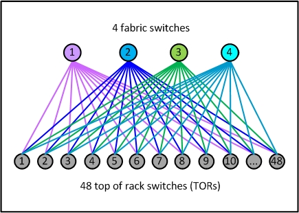
все намного сложнее, и ломается это все тоже интереснее.

Чем отличается ожидание от реальности (в смысле времени доставки сообщения). Ожидание: берем линейку, прикладываем к глобусу, получаем расстояние, и, учитывая скорость света, получаем время. Реальность: оптоволокно - это не вакуум, там есть некоторый коэф. преломления, так что скорость примерно в 1.5 раза ниже, по пути еще масса разных неприятностей, например, очень сложно положить непрерывный кабель, потому что он катушками продается, и нужно их спаивать, и в этих местах появляются какие-то погрешности, нужно усиливать сигнал, и это все замедляется (или то, что экскаваторы рвут кабели, и нужно что-то заново сваривать). Что еще может влиять на задержку сообщения между двумя DC? Нам нужно несколько проводов: например, один раскопают, другой на техобслуживании, и нам нужен третий, который нас спасет, и глупо их тянуть рядом, потому что не сработает, в итоге мы тянем какой-то провод по какому-то затейлевому маршруту, и длина увеличивается. Кроме того, очень странно соединять DC просто друг с другом, нужно соединять их с людьми: если окажется, что у нас есть два DC, а между ними Москва, то мб нужно тянуть провод не от двух DC друг то друга и до Москвы, а нужно просто Москву соединить с двумя DC. Дальше еще хуже: если мы хотим соединить две коробки DC по прямой, то это очень сложно сделать в реальности, из-за того, что кучу всего нужно согласовывать с кучей владельцев чего-либо. В итоге задержки увеличиваются из-за таких ограничений нашей реальности.

Но мы же сказали, что мы ничего этого не наблюдаем, т.к. у нас есть протокол TCP, который от нас все это скрывает.

## TCP
Полезно понимать, как устроен TCP, т.к. наша абстракция надежного канала более-менее повторяет идею TCP, вдобавок TCP сама по себе распределенная система.

На уровне сети нет никакого протокола TCP. Сетевые коробки между нашими машинами ничего не знают про наш протокол. В итоге TCP, вот эта абстракция соединения, существует только в головах двух машин, в операционных системах двух машин, и физически этот провод никак не представлен, никто о нем больше не знает. **[И это приводит к довольно странным ситуациям](https://web.archive.org/web/20220823105029/https://tritondatacenter.com/blog/tcp-puzzlers)**. У нас есть сервер kodos, клиент соединяется с ним и называется kang, и мы перехватываем все системные вызовы. Как же TCP соединение будет вести себя, если мы будем как-то воздействовать на сервер и клиент. По-началу они соединились, и мы видим на сервере и на клиенте TCP соединение. 

Сначала убьем серверный процесс: машина жива, а процесс погиб, а клиент нам что-то отправил, и хочет что-то получить обратно. Что будет с его взглядом на соединение с его стороны? TCP реализован ОС; ОС видит, что процесс умер, и клиенту можно отправить сообщение о том, что больше ждать нечего, и клиент узнает, что поток с его стороны закончился.

*[Есть замечательная книжка](https://hpbn.co/building-blocks-of-tcp/#congestion-avoidance-and-control) про то, как делить общую сеть, не зная про других клиентов, как адаптировать свою нагрузку на нее*

А что будет, если мы перезагрузим сервер? Вообще говоря, клиент ничего об этом не узнает, потому что у него в голове соединение есть, он, например, ничего в сеть не пишет, а сервер забыл уже про все, потому что он перезагрузился и все с чистого листа. Т.е. если мы перезагрузим сервер, а затем на клиенте напишем write в socket, то вот этот сам системный вызов завершится успешно. И когда мы записали сообщение серверу, а потом ждем ответа, то в обратную сторону мы уже получим ошибку, потому что сервер уже не знает про нас, уходи, и мы уходим. 

А что, если мы вообще выключим сервер? Попробуем что-то записать, и что с ней будет? TCP - это транспортный протокол, он реализован протоколом маршрутизации над IP, и потеря какого-то пакетика нормальная ситуация, и сам TCP это учитывает. TCP предоставляет нам абстракцию потока байт, и мы если мы не можем отправить весь поток, то мы отправляем такие кусочки этого пакета, и если нам сервер говорит, что он получил там 4,5,6 сегмент и 3 не получал, то мы его переотправляем, т.е. если что-то потерялось то это мало что означает, и TCP не будет воспринимать это как проблему. Это, конечно, некоторая трудность, но мб она разрешится, мб сеть сейчас перегружена. Мы не можем на стороне клиента понять две конфигурации мира: где с сетью проблемы, и где узел. Но у нас есть какой-нибудь механизм keep_alive и рано или поздно он сработает, допустим по какому-то очень большому таймеру, и мы все же соединение прервем. Это произойдет очень нескоро, и мы должны писать код, который учитывает это, что мы не должны столько ждать, что машина уже мертвая, но при этом соединение открыто еще очень долго.

TCP подвержена тем же самым проблемам задачи синхронизации часов, что и сами распределенные системы: мы не можем изнутри одной машины понять, что происходит глобально в мире, поэтому наши знания всегда неточные и неполные, и поэтому когда мы пишем код, мы должны хорошо понимать, к каким конфигурациям это может привести.

## Дополнение про всякое
В системе Google Spanner используется другой подход: мы, как инженеры гугл, не считаем, что все ломается, а наоборот: мы решаем задачи отказоустойчивости не только на уровне алгоритмов, мы опускаемся еще ниже и начинаем решать задачи на уровне самой железной инфраструктуры. И мы не строим надежные алгоритмы над неустойчивыми уязвимыми физическими абстракции, мы наоборот делаем физический мир устойчивым: мы делаем надежные часы, которые не могут бесконечно дрейфовать и на которые мы можем рассчитывать, мы строим глобальную сеть, в которой не бывает partition'нов, потому что все зарезервировано, все на свете. И в таких предположениях нам немного легче писать код. Но это работает только если мы работаем в гугл, потому что никто такой подход повторить не может.

Еще один важный момент, который нигде в учебниках не отражен, и о нем только начинают писать в статьях, состоит в том, что распределенные системы, которые пишут люди, в основном работают не прямо в DC, а они работают в облаках, и тут появляется еще один слой абстракции и еще один слой косвенности - это виртуализация, это контейнеры, это планировщики кластеров, которые выделяют виртуальные машины, которые делят между ними ресурсы. Современные системы должны учитывать даже это, если хотят быть производительными.

Если знания и существуют, то только в статьях, а ни в каких учебниках, потому что они отстают и их пишут очень странные люди, которые занимаются очень абстрактными задачами, а мы хотим говорить про те задачи, которые мотивированы реальной жизнью, которые где-то у кого-то возникают. И только из статей этих людей мы можем узнать, как все происходит, из статей, как они что-то сделали и чему научились.

# Лекция 2. Линеаризуемость. Репликация регистра, алгоритм ABD
## KV Storage
### История
Мы построили модель, которая будет решать наши задачи. Пока что мы живем в моделе, где узлы отказывают, просто выключаясь навсегда. Т.е. узлы ведут себя в планах протокола, и византийских отказов у нас нет, и злоумышленников у нас тоже нет.

KV Storage
* Set(key, value)
* Get(key)

В начале 2000-х годов Google и Amazon написали статьи про Google Bigtable и Amazon Dynamo, это были KV системы. Почему они были KV Storage? Потому что ничего лучше не получалось сделать. Бизнесу нужны БД: таблицы, колонки, транзакции; другое дело что если мы находимся в начале 2000х: БД у нас есть, а распределенных БД у нас нет, и мы пытаемся научить наши системы масштабироваться и быть отказоустойчивыми. У нас это не получается, это трудная задача и мы начинаем постепенно выбрасывать из них какие-то фичи: таблицы, транзакции, запросы, и у нас остается вот такое отображение KV Storage.

### Слои архитектуры распределенной БД
Почему мы говорим о том, что мы все еще ничего не умеем? Если мы посмотрим на современные БД, то окажется, что они пользователям дают табличную модель, декларативный язык запросов, транзакции, но под капотом они реализованы поверх KV Storage. Но сам по себе KV тоже очень сложная задача, в ней тоже много архитектурных слоев.

Мы хотим сделать KV Storage. Что это значит? Оно должно масштабироваться и быть отказоустойчивым. Но задачу мы начинаем решать на уровне одной машины. В чем сложность? В том, что машина должна переживать рестарты, т.е. хранить ключи не в памяти, а на жестком диске. У нас API с произвольным доступом - у нас есть произвольные ключи и мы что-то по ним спрашивам: пишем или читаем. А диск так не умеет - он умеет читать и писать (эффективно) только последовательно.

Поэтому первая задача, которая возникает в пределах одной машины - это реализация хранилища. Мы должны на самом низком уровне в пределах одного узла построить эффективно систему с произвольном доступом поверх диска, который умеет последовательный доступ эффективно (это системы типа LevelDB и RoseDB).

Решаем задачу в пределах одного узла. Теперь мы хотим добавить отказоустойчивость: т.е. мы начинаем данные реплецировать, чтобы переживать смерть отдельных дисков.

Далее у нас проблема, когда данные перестают вмещаться на одной машине, и мы начинаем заниматься распределением этих данных по кластеру: у нас есть теперь много машин и очень большой диапазон ключей **keyspace**. Мы разделим его на отрезки, каждый из них мы назовем range - это ключи $[b, d]$. Мы скажем, что каждый range будет реплецироваться независимо. Т.е. для каждого диапазона будет несколько машин, которые реплецируют этот диапазон. Скажем, что на этом уровне мы наши данные шардировали.
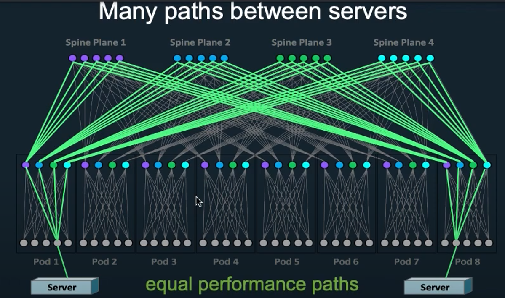

Наконец, последний уровень - уровень транзакций, потому что без транзакций в KV Storage мы не получим транзакции на уровне SQL. Примерно так KV Storage строят. Поверх этого добавляют еще слой с распределенным выполнением запросов, который реализует как раз SQL, и получается что-то более-менее современное.

Сегодня будем решать задачу **репликации**: мы хотим понять, как хранить отказоустойчиво данные, которые помещаются в одну машину. Более того, мы задачу совсем упростим и скажем, что мы храним не диапазон ключей, а одну ячейку памяти, чтобы нам было проще, потому что очевидно мы пока не умеем делать Local Storage, а если мы научимся чисто задачу репликации решать, а затем добавим к ней задачу хранилища, то получим два нижних уровня.
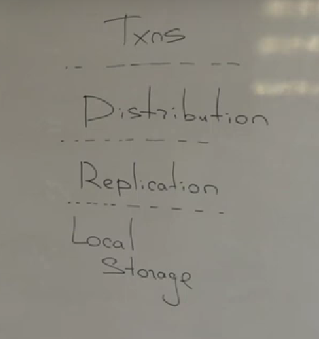

Мы будем решать задачу репликации регистра. У нас есть объект **Register**, и он умеет две операции

**Register**
* Write(v)
* Read()

Можно сказать, что мы будем заниматься репликацией ячейки памяти, или же мы будем моделировать распределяемую память в распределенной системе. Мы разбирались, как же ячейки памяти в одном компьютере ведет себя, когда с ними работают разные потоки. Ответ был сложен, и это на самом деле соотносится с тем, о чем мы сейчас говорим. На самом деле связь совершенно прямая: процессор - это распределенная система, потому что там есть ядра, у них есть свои кэши, они общаются через некоторую шину. Там, конечно, все гораздо более асинхронно и там ничего не ломается (т.е. если сломается, то можно компьютер просто выкинуть), но суть проблемы та же: у нас есть разные ядра, у них какое-то свое понимание о том, в каком состоянии находится ячейка памяти, им нужно друг с другом общаться по процессорной шине. Т.е. можно сказать, что курс **Concurrency** можно обобщить на этот курс **TFTDS**. Только у нас дело сложнее, потому что есть отказы, асинхронность, короче все довольно сложно.

## История, модель согласованности
Мы собираемся что-то реплецировать, нам одной машины мало и мы будем обходиться несколькими, и вот эти несколько машин должны хранить значение нашего регистра, нашей ячейки памяти. Сложность в том, что эти машины соединены проводами, по ним сигнал доставляется не слишком быстро (нижняя граница: скорость света), поэтому мы не рассчитываем, что у нас есть три копии ячейки памяти, и они будут в каждый момент времени абсолютно синхронными - они будут отличаться. А мы раньше говорили, что у нас будут клиенты, которые с этой ячейкой памяти будут общаться через разные машины. Т.е. один пользователь что-то пишет, получает подтверждение, а другой пользователь что-то читает, и мы ожидаем, что система попытается свою распределенность и несинхронность внутреннюю скрыть. Мы не хотим, чтобы пользователь наблюдал, что у нас есть разные копии ячейки, и они в разные моменты времени содержат разные значения на самом деле. Т.е. пользователь хочет получить простую абстракцию.
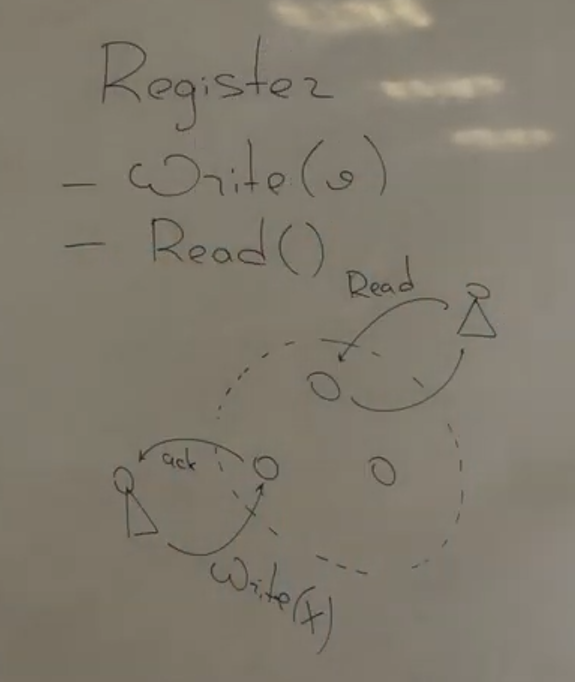

Чего бы мы могли ожидать от распределенной ячейки памяти, какого поведения? Пусть у нас есть идеальный регистр и есть какая-то реализация распределенная отказоустойчивая. Пользователь начинает задавать запросы. Что она ему генерирует? Эта реализация генерирует пользователю истории: пользователь один сделал Write(1), пользователь два сделал Write(2) чуть позже, а пользователь три все это читал. И что это чтение вернуло этому пользователю? 
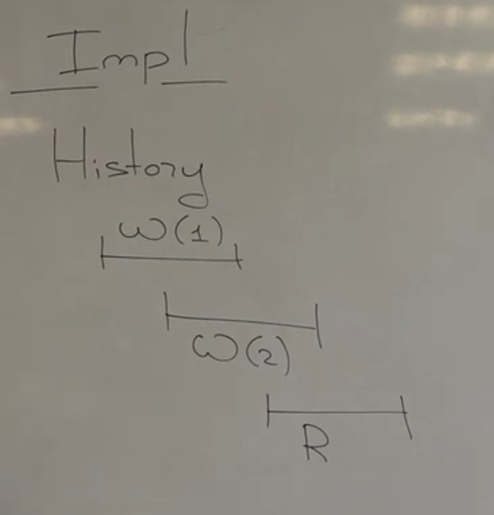
*Конкурентная история*

Есть такое мнение, что мы должны прочесть 2, потому что запись 2 была после записи 1. Вопрос непростой, и мы можем давать гарантии разные. Например минимальную гарантию: если мы что-то записали и потом читаем, то мы свою запись прочтем, т.е. она не потеряется. Можно сказать, что мы читаем свои записи и они не теряются, но с другой стороны если у нас был клиент 1 и он записал значение X и получил подтверждение от системы, а потом пообщался как-то с клиентом 2, а потом клиент 2 прочитал, то он должен обязательно увидеть запись 1 клиента. Потому что это чтение упорядочено причинностью с первой записью. И можно каким-то образом заставить систему эту причинность учитывать. Наверное это было бы разумно.
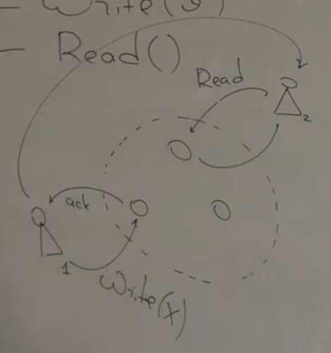

А как это сделать, когда эта коммуникация находится за пределами системы? Забегая вперед, и говоря не про гарантии, а алгоритмы, можно было бы заставить систему возвращать какой-нибудь токен клиенту 1, который нужно было бы передавать клиенту 2, чтобы он отправил его это вместе со своим чтением, и система бы поняла что причинность есть. Но мы сейчас хотим сформулировать ожидания от системы не вдаваясь в какие-то подробности и реализации: мы хотим такой простой API, и никаких дополнительных деталей типо токенов, которые из системы возвращаются и двигаются через коммуникацию клиентов.

Ответ пока не ясен, как система себя должна вести, хотя, конечно, есть некая интуиция, к которой мы и клоним. Даже если забыть про concurrency, мы же хорошо понимаем как ведет себя ячейка памяти, когда с ней работают последовательно в одном потоке.

Пусть мы выписываем операции:

    W(1) -> W(2) -> R -> W(3) -> R
если нам дадут цепочку операций, то мы очевидно для каждой операции можем легко сказать, что ячейка памяти должна нам вернуть в каждом чтении: просто последнюю предшествующую запись. Потому что у нас все упорядочено, и последняя пердшествующая определена однозначно. Мы скажем, что у нашего объекта есть такая спецификация, т.е. набор допустимых последовательных историй.
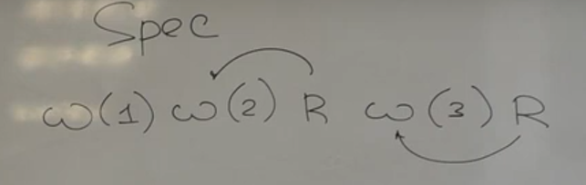
*Последовательная история*

А теперь мы скажем, что у нас есть спецификация и конкретная реализациия, и конкретная реализация порождает набор некоторых конкурентных историй. Мы введем понятие **модели согласованности**.

**Модель согласованности** - она дает ответ на такой вопрос: "А какие конкурентные истории может порождать реализация для заданной спецификации?".

Посмотрим на иерархию моделей согласованности. Мы видим целое дерево, и кое-что мы можем понять здесь. Самая слабая гарантия где-то в основании этой диаграммы - **Read Your Writes**. А еще есть здесь знакомая гарантия -  **Sequential** (это **Sequential consistency**). Т.е. если у нас есть ячейка памяти, и есть много клиентов, которые с ней работают, то мы скажем, что наша реализация - это **Sequential consistency**, если она порождает истории такие, что каждая такая вот порождаемая нашей реализацией история имеет некоторое линейное объяснение, в котором те же самые чтения в последовательной истории возвращают те же самые результаты, что и в конкурентной истории, и при этом сохраняется результат операции внутри каждого клиента. Sequential consistency - это частный случай модели согласованности.

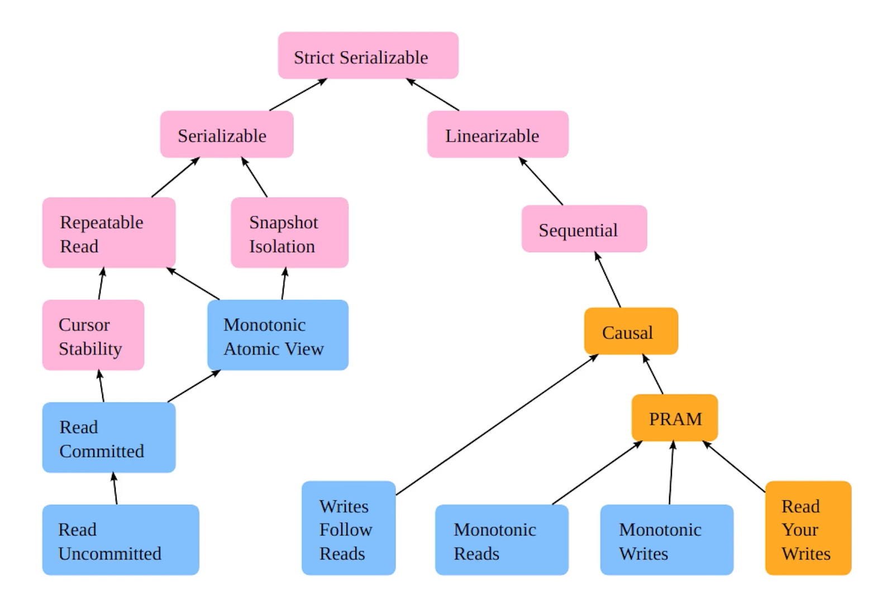
*Иерархия моделей согласованности*

Мы не хотим этого же требовать от нашего распределенного регистра, мы хотим другую гарантию. Эта модель согласованности называется **Linearizability** (линеаризуемость). Она дает больше гарантий. Что же эта гарантия нам говорит? Для любой истории, которая порождается реализацией некоторого объекта (в данном случае регистра) существует последовательная история, принадлежащая спецификации этого объекта такая, что эта история построена из тех же операций, что и в конкурентной истории, и все операции возвращают те же самые результаты, и самое важное: если в исходной конкурентной истории есть две операции O1 и O2 такие, что операция O1 завершилась в физическом времени до того, как началась операция O2, то мы потребуем, чтобы в этой линейной истории эти две операции шли в таком же порядке.

$$
\forall h \in Impl(O) \quad \exists h^* \in Spec(O)
$$

$$
\text{---} \, O_1 \quad \text{---} \, O_2 \quad \Rightarrow \quad O_1 \prec_{h^*} O_2
$$

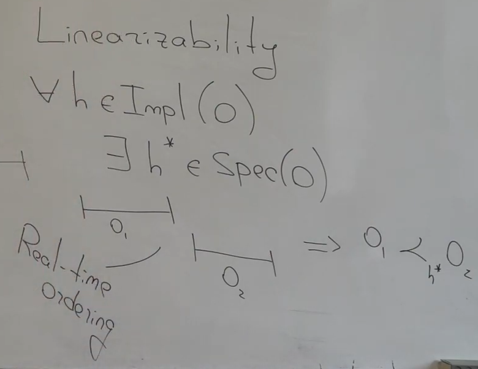

Это самое естественное требование, которое можно задать.

Что такое $h^*$ ? Можно сказать, что это, с одной стороны, внутренний логический порядок, в котором система принимает и обрабатывает наши операции, ну не буквально конечно, а скорее это порядок, которым мы объясним себе и другим что произошло.

Если там R вернуло 1, то линеаризация выглядит так:

    W(2) -> W(1) -> R: 1
Мы можем конкурентную историю объяснить последовательной. У нас было две конкурентные операции, упорядоченнные по времени, и мы сохранили их относительный порядок.
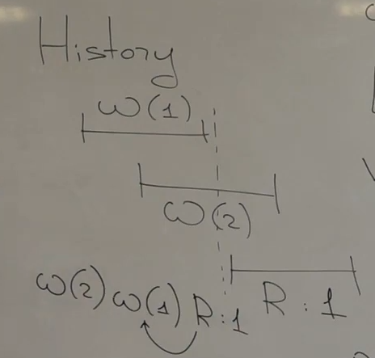

Есть еще одна линеаризация:

    W(1) -> R: 1 -> W(2)

Сейчас мы не пытаемся сказать, в каком именно порядке случились эти операции внутри системы. Система распределенная, там вообще может не быть линейного порядка, там в конце концов не лежит какой-то один мьютекс, который все упорядочивает. Но мы можем объяснить себе, что система выполнила эти три операции в одном из каких-то этих порядков. Мы могли бы и прочесть два:

    W(1) -> W(2) -> R: 2
Короче, куча вариантов.

Любая история, которая порождается реализацией, линеаризуема. Т.е. для любой конкуретной истории, порождаемой нашей реализацией, найдется последовательная история, соответствующее поведению регистра однопоточного, такая, что: если две операции конкурентной истории были упорядочены во времени, то и в нашем объяснении линейном они будут в таком же порядке относительно друг друга.

Мы говорим, что наша реализация регистра линеаризуема, если наша реализация порождает только линеаризуемые истории. Т.е. любая история, которая порождена нашей реализацией, линеаризуема.

Если мы даем пользователю линеаризуемую систему, то он может не думать про то, что она распределенная, он может думать, что она действует атомарно, операции как бы случаются в ней одна за одной, и конкуренция не важна. 

Но все-таки мы требуем ограничение Real-time ordering. Как же так: в гарантии фигурирует физическое время, а мы говорили о том, что узлы к нему доступы не имеют. У узлов есть часы, эти часы несовершенны, и синхронизировать их тоже нельзя. Кто же может понять, что одна операция завершилась до другой? Сами клиенты не могут, система не может, почему же опеределение такое? На самом деле ответ довольно естественный. Что ожидают пользователи от системы? Они знают, что одна операция предшествует другой только тогда, когда они сами делают эти операции, или когда клиенты общаются между собой. Т.е. иногда клиенты знают, что две операции упорядочены относительно друг друга, но они знают об этом не потому что у них часы очень точные и синхронизированные, а потому что между этими операции отношения **Happens-before** (причинность). Т.е. пользователи не думают про время, они думают про happens-before и ожидают, что наша система будет его учитывать. Т.е. у нас операция для пользователя $O_1$ может предшествовать в отношении HB операции $O_2$.
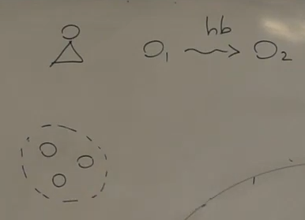

А что система про все это знает? Она не знает про HP и не может узнать. Эта коммуникация HP происходит за пределами системы, но системе же нужно внутри себя как-то упорядочевать эти записи. Один из примеров, как делать не стоит, но пусть: скажем, что клиент 2 пишет, и в системе возникает две записи, и они возникают на разных узлах и в разное время, и система должна сама внутри себя понять, какая запись более свежая, а какая более старая. Система должна внутри себя выстроить некоторый порядок, например, снабдить эти записи версиями (или временными метками, как угодно) - **timestamps**. Есть два взгляда на порядок: у клиента есть HP, внутри системы есть глобальный порядок на версии. Мы должны согласовать два этих порядка, т.е. нужно каким-то образом сделать так, чтобы timestamps были согласованы c happens-before. Они не знают друг про друга, но у них есть общее время. Если операции упорядочены отношением HP, то значит они упорядочены во времени. Так что если мы будем соблюдать гарантию Linearizability внутри системы, то мы конечно же HB для пользователей тоже учтем. Мы про него не знаем, и мы дадим немного более сильные гарантии, чем пользователь хочет, ну и ладно, зато мы его порадуем.
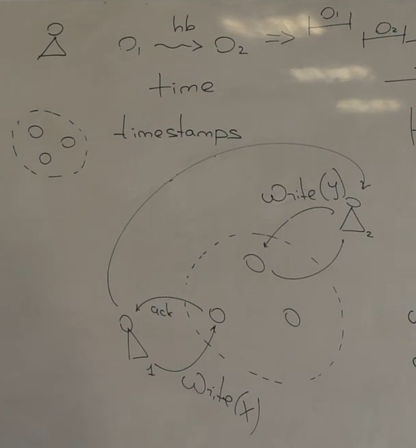

*Для регистра есть синоним - атомарность, в то время как Linearizability ~ External Consistency*

Можно огрубить, и сказать, что внутри системы есть мьютекс, и этот мьютекс выстраивает нам линеаризацию. Еще говорят (тоже нестрого), как будто бы внутри каждого из этих отрезков можно выбрать точку, когда операция случается как будто атомарно.
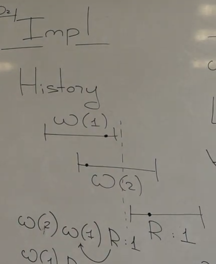

## Задача репликации регистра
Мы хотим построить линеаризуемую ячейку памяти (aka. атомарный регистр). Мы работаем в асинхронной модели; операции: Write(v), Read; сбои узлов: Crash/Restart.

Мы хотим регистр реплицировать. Выберем несколько машин, которые будут хранить его копию. Сколько выбрать машин? Мы хотим отказоустойчивость. Сделаем выбор подсознательно: пусть будет 3 машины. Нужно как-то ограничить задачу, упростить ее, чтобы решить ее. Три реплики нам даны и не могут меняться, т.е. мы живем в статической конфигурации (на самом деле в реальности машины отказывают, ломаются, и их нужно заменять на новые, мы пока так не умеем). Еще мы скажем, что клиент, который выполняет операции, будет знать эти машины: он будет знать сколько их, их адреса, и будет коммуницировать с ними. Это обман (см. конспект выше), но все можно вернуть в правильную модель (будет дальше объяснение). Третье допущение: у нас есть пока только 1 клиент, который пишет (на самом деле это звучит неразумно, но даже с такой конфигурацией задача не является тривиальной, а потом мы это починим).
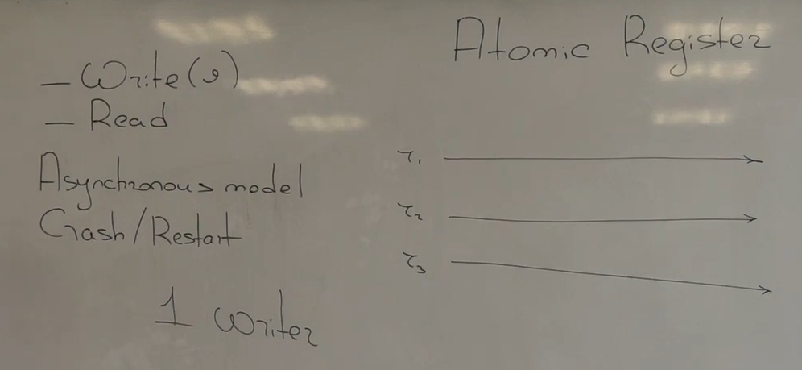

## Baseline алгоритм
У нас появляется писатель, и он делает $\omega(v_1)$. Видимо он должен пойти на реплики и сказать: "Я хочу записать значение $v_1$", и наверное он хочет записать на все реплики, раз уж их 3, то нужно на все писать. Вопрос лишь в том, когда операция для клиента завершится. Видимо он ждет подтверждение от реплик, но какое количество подтверждений ему нужно? Во-первых, точно не одно, потому что машина сломается и два других сообщения потеряются. Во-вторых, писать на 3 - тоже не отказоустойчиво, потому что мы же хотим сбои переживать, мы хотим чтобы наша система обрабатывала запросы даже тогда, когда какая-то реплика недоступна. Мы хотим писать на все машины, но синхронно дожидаться ответа не от 1 и не от 3 машин, соответственно мы хотим дождаться 2 подтверждения.

Мы сделали $\omega(v_1)$ и она состоялась. Далее мы делаем $\omega(v_2)$: мы снова пишем на все три реплики, и ждем два подтверждения. Каждая реплика при этом хранит копию ячейки памяти. Может быть так, что первая запись дойдет до 3 реплики позже, чем вторая запись. Т.е. у нас реплики несинхронные, они в один момент времени могут хранить разные значения. Нужно, чтобы сама система понимала, какие из значений более новое, а какое более старое.
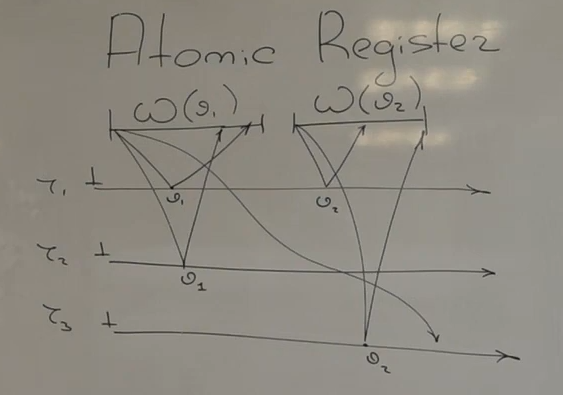

Чтобы это понять, внутри системы нужно эти записи упорядочивать, поэтому клиент будет снабжать свои записи временными метками. Ему это делать несложно, потому что он один и он может в голове увеличивать счетчик и отправлять запись на машины. + мы всегда говорим клиенту, что подтверждаем его запись, даже если мы ее проигнорировали.
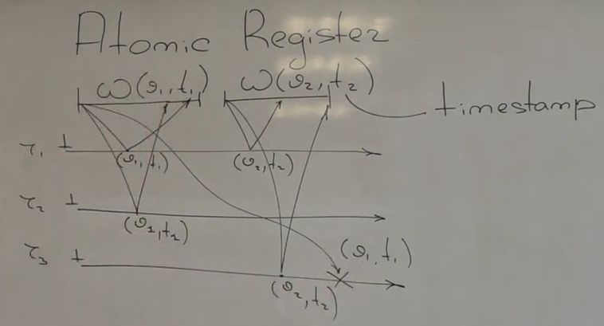

Мы научились делать записи. Теперь мы должны читать. У нас есть три реплики, они хранят разные значения. Где же хранится свежее? Ответ такой: **правильное значение хранится на любой двойке реплик**. Т.е. если мы начинаем чтение, то мы поступаем так: мы снова отправляем запрос всем трем, и снова по тем же причинам дожидаемся двух ответов и выбираем значение, у которого timestamp больше.
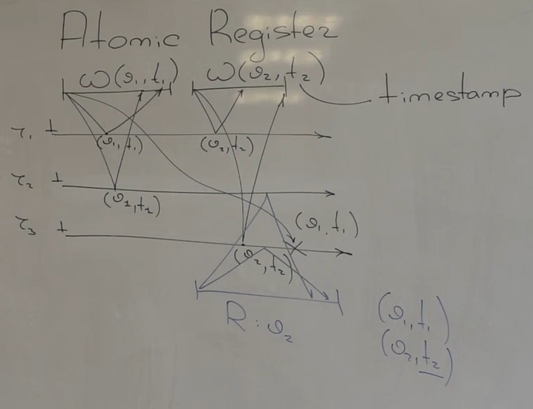

## Quorum System (система кворумов), Majorities
Мы выбрали произвольное число три (записи) и как-то неизбежно получили число два (подтверждения). Похоже на какой-то произвол (на самом деле так и было). Даже в такой конфигурации с таким произволом без потерь доступности системы мы способны переживать 1 отказ: $f \leq 1$ .

Как мы подбирали это количество подтверждений на чтение и на запись? Мы хотим, чтобы если запись состоялось, и мы потом читаем, то как мы добьемся того, что чтение непременно увидит эту запись? Нам важно, чтобы узлы, которые подтвердили запись, пересекались с множеством узлов, которые ответили на чтение этого клиента. Эту несложную интуицию можно обобщить в понятие, которое называется **Quorum System**.

У нас есть $P$ - множество всех узлов, Q - подмножество $2^P$ - система кворумов, когда для любых двух множеств из семейства $Q$ они пересекаются.

**Quorum System**
$$ 
    P - множество всех узлов
$$

$$
    Q \subseteq 2^P 
$$

$$
    \forall A, B \in Q : A \cap B \neq \emptyset
$$

Мы когда пишем в систему, сколько бы у нас узлов не было, мы дожидаемся ответа с любого кворума.

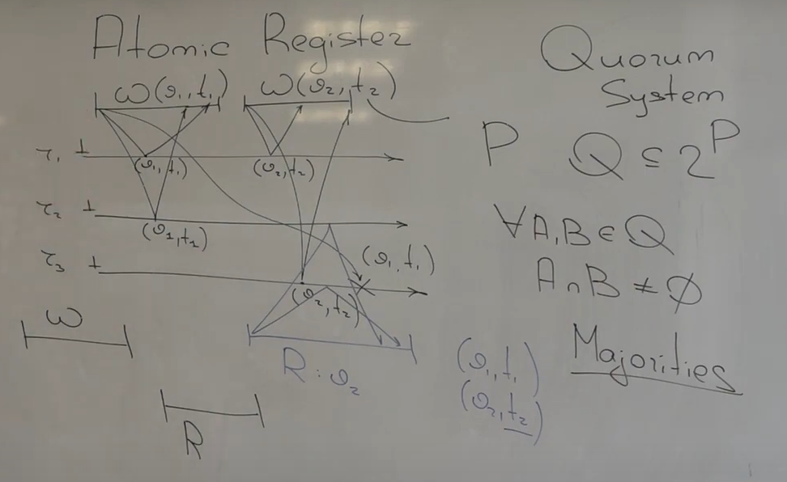

## Отказоустойчивость
### Число отказов

### Поведение при партишенах