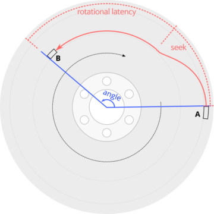
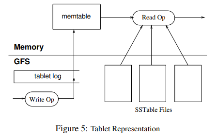
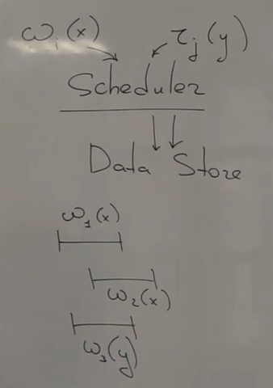
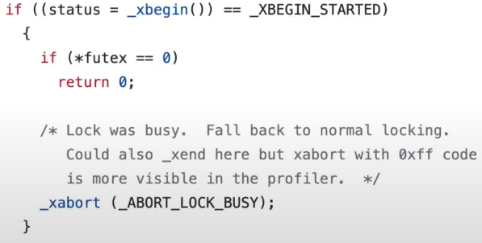
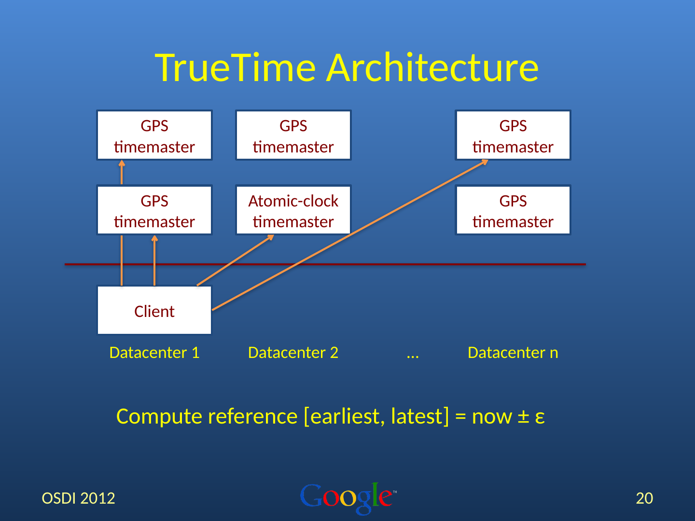
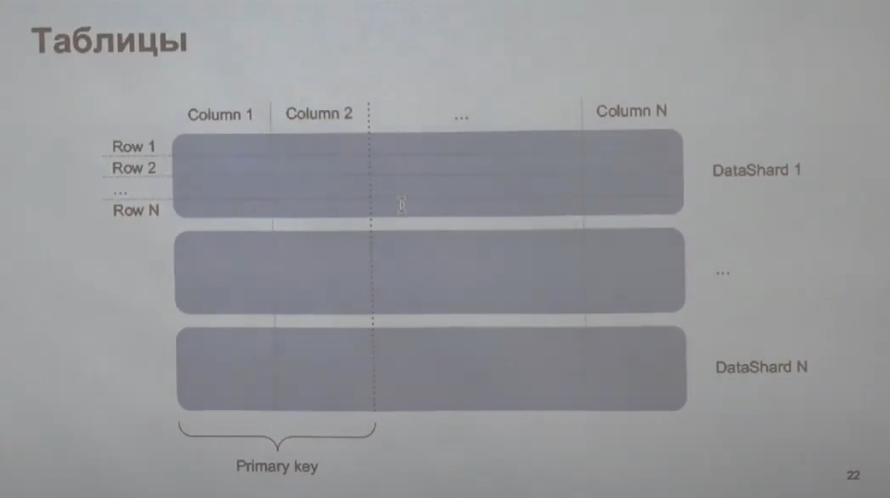
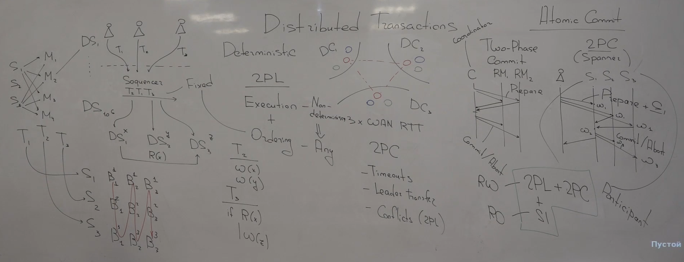
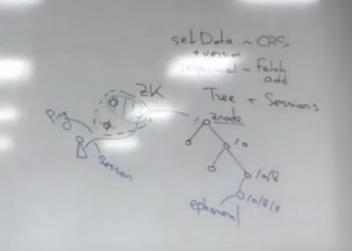

**Theory of fault-tolerant distributed systems**

**[Лекции](https://youtube.com/playlist?list=PL4_hYwCyhAvaYKF6HkyCximCvlExxxnrC)**

**[Семинары](https://youtube.com/playlist?list=PL4_hYwCyhAvZd6B5fN3yAB0zOCjhgpfgg)**

# Лекция 1. Модель распределенной системы
## Зачем нужна распределенность
Современный мир без распределенных систем сложно себе представить

Виды:
* KV Store - гигантская хеш таблица (упорядоченная)
    * Set(k, v)
    * Get(k)
* File system
* Coordination Service - распределенные системы, которые нужны, чтобы строить другие системы
    * Например, ~Atomics
* Message Queues
* Databases

Зачем нам делать что-то распределенным?
1) В одну машину все не помещается
2) Распределенные системы - это не только про большие данные. Одна машина может отказать, система должна быть отказоустойчива
3) Мы не хотим доверять каким-то машинам, одной или несколько, они могут быть злоумышленниками

Для того, чтобы строить алгоритмы, мы должны иметь модель мира, в котором мы собираемся работать

## Общая модель: узлы, каналы, отправка сообщений, клиенты, истории, модель согласованности
Что такое распределенная система?
В отличие от алгоритмов, которые что-то сортируют или ищут, мы от модели ждем каких-то гарантий
В коде клиента система выглядит как переменная, и мы выполняем над ней какие-то операции. Мы не единственные, кто так делаем, нас таких много. Внутри системы удобно говорить про **модель MessagePassing**, а снаружи разумно использовать **модель SharedMemory**

**History**


## Моделирование сети
### Гарантии доставки
Что может с сообщением случиться? У нас есть абстракция надежного канала, мы в него отправляем сообщение из узла *a* в узел *b*, и узел *b* даже начинает что-то получать и сообщение обрабатывать, и вдруг соединение рвется (например, кто-то задел провод), и все гарантии в связи с этим разрывом пропадают
Соединения либо гарантируют нам доставку, либо сообщат, что оно порвалось

### Асинхронность и частичная синхронность
**Synchronous model**:
Есть константа $\delta$
$ delay(m) \le $ $\delta$ - задержка при доставки сообщения ограничена дельтой
Хорошая сеть может работать очень быстро, доставляя сообщение между двумя узлами за миллисекунду, почему бы не взять за дельту пару миллисекунд?
Такое бывает, но не всегда. Мы можем ожидать, что сеть работает быстро в каких-то частях нашего алгоритма, но мы хотим, чтобы наш алгоритм был устойчив к тому, что эта гарантия возьмет и нарушится, потому что мы физический мир не можем заставить так работать. Может быть куча случаев ошибки извне.

**Asynchronous model**:
Если наш алгоритм будет работать в таких предположениях, не ожидая верхней границы, то он сможет работать в реальном мире
* **Safety** свойство (минимальная задача алгоритма): система не должна уходить в плохие состояния, т.е. система не должна делать что-то плохое
* **Liveness** свойство: система должна делать что-то хорошее

**Partial synchrony**
У нас жизнь устроена так: есть ось времени, и некоторое время мы живем в асинхронной модели, тогда все плохо. А потом в какой-то волшебный момент __t*__ у нас эта гарантия начинает соблюдаться

## Партишены и split brain
**Partition** - это явление, когда сеть раскалывает кластер на две части, так, что связность в пределах одной части сохраняется, но линки, которые пересекают эти партишены, перестают работать. В итоге наша система раскалывается на две части, и хуже того, она еще и клиентов раскалывает
**Split brain** - ситуация, когда система в случае партишена начинает работать независимо в двух частях

## Моделирование узлов, сбои узлов
Каждый узел - это автомат или актор, который работает однопоточно и принимает сообщение из сети, и вызывает какой-то обработчик, и когда этот обработчик вызван, узел меняет свое внутреннее состояние, принимает какое-то новое, и, возможно, отвечает какими-то новыми сообщениями

Можно представить себе, что реальная программа исполняется на пуле потоков
Можно представить себе, что вот эти все файберы и фьючеры бегут на экзекуторе, которой по пинку выполняет очередную задачу

* Crash
* Restart
* Византийские отказы

## Время, часы и их применения
Есть какая-то ось времени, но доступа ко времени мы не имеем. У нас есть часы. В теории, часы - это такая функция, которая по времени возвращает нам некоторое значение (в идеале возвращает t, тождественная функция)
Часы - это объект физического мира. И, как и все в физическом мире, они несовершенны
А как мы собираемся использовать время в алгоритме?

У нас есть now(), есть t1 и t2, мы можем сделать t1 < t2 (сравнивать показания времени) и t2 - t1 (измерять интервал времени).
Зачем нам нужно измерять интервал времени? Для timeout, для failure detection

Зачем нам сравнивать мгновенные показания времени? Для того, чтобы упорядочивать события. 
У нас есть Петя, и он сделал запись X, и получил подтверждение. Затем Петя сказал Васе про изменение. А Вася, вместо того, чтобы читать, сделал новую запись Y. Запись X случилась до записи Y, и мы ожидаем, что если после всего этого пойти в систему и спросить "Что лежит по ключу K?", то она вернет Y. Для этого система должна понять, что в нее записали X и записали Y, и при этом запись Y - это более свежая запись. Как бы мы могли это достичь? Пусть узел, который получил запись X, присвоил ей временную метку - показание локальных часов: 12:00. А после записи Y другая машина присвоила записи временную метку 11:59. Потому что часы разное время показывали. Получилось, что для системы Y произошел раньше, чем X

**Scew** - рассинхронизированные часы

**Drift** - часы могут тикать иногда быстрее, иногда медленнее, чем идеальные часы


## Синхронизация часов, нижняя оценка
Представим очень простой мир, где есть два узла. И узел n1 хочет свести свои часы с узлом n2

Пусть у нас есть ограничение на мир: любое сообщение доставляется в таком промежутке времени: $delay(m) \in [\delta-u, \delta]$
, где u - uncertainty , в то время как drift никакого нет
Синхронизировать часы (в такой модели) - это значит узлы должны выбрать своим часам какую-то поправку: $sc_i(t) = c_i(t) + o_i$
Кто-то в таком мире принес нам алгоритм и говорит: "Его можно запустить на двух узлах и через какое-то время можно подобрать такие поправки, что: $|sc_i(t) - sc_j(t)| \le \varepsilon$ "
Насколько маленьким может быть этот эпсилон? Рассуждения демонстрируют общую технику, которая будет использовать дальше:
Мы построим два исполнения, и они будут разными, которые, во-первых, будут различными, т.е. будут давать разные поправки в двух исполнениях, а во-вторых, алгоритм на двух узлах не смогут эти два исполнения отличить друг от друга, поэтому они выберут одинаковые поправки. И на этой коллизии у нас построится нижняя оценка

Мы управляем сетью и у нас есть два узла: $n_1$ и $n_2$. Пусть у нас от узла $n_1$ к узлу $n_2$ сообщения идут максимально долго насколько могут, а в обратную сторону максимально быстро. Мы строим такую сеть и алгоритм работает и синхронизирует часы. А теперь мы сделаем операцию, которая называется сдвигом - **shift**. Мы все события, которые происходили на узле $n_1$, оставляем на тех же местах, но переворачиваем сеть: т.е. теперь сообщение от узла $n_1$ к узлу $n_2$ летят очень быстро, а обратно очень медленно. Что произошло? Для узла $n_1$ ничего не произошло вообще, он не чувствует разницы. А для узла $n_2$ событие съехало немного назад, но он же не тупой и может это понять: в первом случае он получил в 12:00, а во втором случае в 11:59. Во втором исполнении переведем часы второго узла на $+u$. Утверждается, что хоть и во времени все съехало, но у $n_2$ нет возможность это почувствовать, потому что времени он не знает, он знает только то, что показывают ему часы, а часы показывают ему то же самое. Что мы получили? Мы запустили алгоритм в первом и втором исполнении, он синхронизировал часы. И в обоих случаях часы, синхронизированные для $n_1$ вообще не отличаются. Посмотрим на $sc_1(t*)$. Они принадлежат от -eps до +eps. А теперь подумаем, как работают синхронизированные часы для $n_2$. Алгоритм не чувствует разницы на узле $n_2$ между двумя исполнениями, а значит он выберет одну и ту же аддитивную поправку, но как бы сами часы отличались на $u$, т.е. синхронизированные часы узла $n_2$ в этих двух исполнениях должны отличаться ровно на $u$, и при этом они оба должны отличаться не более, чем на eps, чем $sc_1(t*)$. Т.е. $\varepsilon$ $\ge u/2$

В случае n узлов оценка немного меняется: $\varepsilon$ $\ge (1 - 1/n)u$
## GPS и синхронизация часов
У нас беда с часами - мы не можем оценить асимметрию в сети, мы не можем оценить время round trip'а, а может быть иногда у нас нет этого round trip'a, у нас коммуникация односторонняя, и время доставки сообщения мы знаем довольно таки неплохо

Как найти нас на плоскости


Добавим реализма: мы вышли в лодке в туман рыбачить. У нас есть карта и часы. На карте отмечено 3 маяка. Мы знаем, где они находятся, но не знаем, где мы находимся. Но мы знаем, что маяки раз в 5 минут издают какую-то пронзительную и уникальную сирену. И тогда наша система становится вот такой уже:
 - навигационное уравнение GPS
4 координаты, 4 уравнения, 4 спутника
Система GPS нас позиционирует не только в пространстве, она нас позиционирует по времени, и чтобы позиционировать в пространстве, ей нужно синхронизировать часы на ресивере с часами в космическом сегменте спутника

## Google Cloud Spanner, Google TrueTime, ожидание вместо коммуникации
Непонятно, откуда тут возник GPS
Почти все те системы, про которые было написано выше, впервые написали в гугле.
Spanner - это одна из систем, которая предоставляет гугл. Это геораспределенная база данных, и чтобы ее написать, инженерам гугл понадобился новый подход к часам. Они используют часы в своих алгоритмах, но не now(), потому что доверия к ней нет. Они построили сервис - [TrueTime](https://cloud.google.com/spanner/docs/true-time-external-consistency). Как все это устроено? Мы можем на каждой машине спросить:

    TT.Now() -> [e, l]
    // e - earliest
    // l - latest
И система TrueTime гарантирует, что настоящее время внутри этого интервала
Чуть формальнее: если мы задаем запрос TrueTime.Now() в момент времени $t_0$, и получаем ответ в момент времени $t_1$, то этот интервал $[t_0, t_1]$ пересекается с интервалом $[e, l]$. Беда в том, что мы не знаем $t_0$ и $t_1$
Нам гарантируют это, и стремятся сделать так, чтобы ширина этого интервала была как можно меньше: $|l - e| \le 6ms$

Как это связано с GPS? TrueTime работает на каждой машине. И в датацентре помимо обычных машин, которые пользуются этим сервисом, стоят т.н. time-master'а. Бывает два типа тайм мастеров:
1) Машины, на которых установлены GPS антенны, которые синхронизируются с GPS для того, чтобы синхронизировать часы
2) Armageddon master - машины с атомными часами. У нас атомные часы в космосе, атомные часы у нас (для отказоустойчивости)
Исходя из всей этой информации, каждая машина выводит себе оценку этого интервала $[e, l]$. И выводит забавно: раз в 30 секунд каждая машина общается с этими мастерами и получает себе оценку интервала. А теперь через 25 секунд приходит Google Spanner и спрашивает у TrueTime текущее время. Что вернет нам TrueTime? TrueTime закладывает между точками синхронизации дрейф в 200 миллионных долей и вернется промежуток больше

Читать как иврит справа налево


## Зачем распределенным системам TrueTime?
Время - это такая хитрость, общее разделяемое состояние между машинами в сети. Чтобы мы могли что-то сделать, надо чтобы машины поговорили друг с другом, чтобы они друг о друге что-то узнали. У них есть что-то общее - время. Они могут говорить явно друг с другом, отправляя сообщения. Google используют TrueTime для того, чтобы не говорить. Они строят не просто базу данных в кластере, они строят геораспределенную систему такую, в которой узлы стоят физически далеко друг от друга. И когда мы общаемся по сети внутри ДЦ, там действительно могут быть тайминги очень маленькие (1ms). Когда мы пересылаем байтики через Атлантику или с Восточного на Западное побережье США, там уже тайминги сотни миллисекунд. И мы с помощью некоторой хитрости можем понять, как можно эту коммуникацию, которая может быть долгой, можно заменить на локальное ожидание, т.е. мы просто сидим и ничего не делаем, и засчет этого что-то становится лучше. Но сидим мало: 6ms, вместо того, чтобы общаться долго и ждать 100ms. Это большая хитрость за счет того, что время у узлов общее.

## Итоги
Можно сказать следующее: (в данном курсе) мы живем чаще всего в асинхронной модели, т.е. мы не делаем предположений о скорости доставки сообщений, мы не делаем предполоожение о скорости работы часов, и мы не делаем предположений о дрейфе часов (в тех случаях, когда мы доказываем, что системы не нарушают каких-то гарантий, т.е. safety. Когда мы доказываем, что система не делает ничего плохого, мы используем асинхронную модель, где нет параметров времени никаких. Когда мы доказываем, что система вообще говоря делает что-то полезно и отвечает пользователю, то мы тогда привлекаем таймауты, какие-то оценки, время доставки сообщений и прочее)


# Семинар 1. Среда исполнения распределённой системы
*Когда у нас есть одни часы, мы знаем, который час, но когда у нас много часов, мы плохо понимаем, что происходит*

## Разные временные оси
[Иллюстрация временных осей в мире](http://leapsecond.com/java/gpsclock.htm)


* TAI - международное атомное время (названо по-французски, поэтому буквы в непривычном порядке).
Почему атомные часы, а не что-то другое? Тут нужно понять, что мы вообще понимаем под временем, что мы считаем эталонным временем? 
Раньше люди использовали естественную меру времени: астрономическую. Например, когда солнце в зените, а затем когда оно снова в зените, то видимо прошел день. Чтобы из этого получить секунду, мы делим сутки на 86400. Мы получили секунду, но в чем беда? Земля несколько неравномерно вращается, т.е. Земля - это не самый точный периодический процесс. Если мы хотим определить секунду через какое-то астрономическое явление, связанное с Солнцем и Землей, то нам нужно что-то усреднить еще. Когда-то секунда равнялась 1/86400 какого-то среднего дня. Сейчас секунда определяется иначе: [Секунда — время, равное 9 192 631 770 периодам излучения, соответствующего переходу между двумя сверхтонкими уровнями основного состояния атома цезия-133](https://ru.wikipedia.org/wiki/Секунда). Теперь астрономические явления становятся отвязанными от определения секунды.
* GPS - там тоже атомные часы, но время отличается. На самом деле атомные часы в космосе и атомные часы на Земле - это немного разные часы ([пруф](http://themarginal.com/emc2/applications_of_relativity_in_gps.htm)). В DC серверы стоят в стойках, их кто-то охлаждает, температура в стойке вверху и внизу разная, кварцевые часы очень чувствительны к температуре и они дрейфуют по-разному наверху и внизу стойки, уже расходятся и очень неприятно. Атомные часы вообще супер чувствительные: если поставить их напол, а потом поднять их на руки, то они уже по-разному будут идти. В случае GPS мы их вообще в космос запускаем: там гравитация меньше, и часы летают вокруг земли на огромной скорости. ОТО предсказывает, что атомные часы, находящиеся на орбите Земли, будут тикать чуть быстрее, и будут опережать атомные часы на земле на 45 microseconds per day. В то время как СТО предсказывает, что атомные часы, летая на большой скорости, будут двигаться немного медленнее, на 7 microseconds per day. И когда их туда запускают, их заводят так, чтобы они на 38 микросекунд медленнее шли, чем на Земле, чтобы с ними можно было сопоставляться на Земле. **Но это все забавная история, дело на самом деле не в этом. Все из-за того, что есть UTC.**
* UTC - есть два способа это расшифровать. С одной стороны, это Coordinated Universal Time (англ.), с другой стороны это Temps Universel Coordonne (фр.), и по какой-то причине ни одно из них с UTC не складывается. Беда в том, что довольно плохо, что мы отвязали секунду от астрономических явлений, но при этом мы их как бы наблюдаем, и давайте сделаем так, чтобы сходилось одно с другим. Если Земля вращается немного быстрее или медленнее относительно эталона секунды, то мы сделаем так, чтобы если вдруг у нас накапливалась лишняя секунда или куда-то пропадала из вращения Земли, то мы бы ее либо добавляли, либо извлекали из этого дня. Так получается явление под названием **секунда координации (leap second)**

## Високосные секунды
[Статья на вики](https://en/wikipedia.org/wiki/Leap_second)

Земля вращается то чуть медленнее, то чуть быстрее, поэтому иногда в день вставляют лишнюю секунду (которая выглядит как 23:59:60). Это такое техническое решение, чтобы связать временную ось и Солнце. Именно поэтому у нас есть три шкалы: UTC, GPS, TAI.

* TAI: никак не учитывает секунды координации, оно считает секунды по определению секунды, т.е. нет високосных секунд.
* GPS: тоже считает секунды по определению секунды, но эта ось времени запустилась немного позже, и оно было сначала синхронизировано с UTC, в итоге в GPS есть несколько високосных секунд.
* UTC: есть все високосные секунды

Зачем же нам об этом знать (кроме того, что это забавно)? Мы сделали астрономов счастливыми, а пострадали разработчики, поскольку работа со временем это коллосальная боль всегда (например, time zones). Есть проблема: например, есть [Unix time](https://en.wikipedia.org/wiki/Unix_time), где в сутках 86400 секунд, но в сутках бывает +- 1 секунда еще, и этот Unix time ведет себя странно: он возвращает количество секунд с начала эпохи, но при этом иногда нужно в эти тайм стемпы добавить лишние секунды, какой-то тайм стемп повторяется. Т.е. наш Unix time ведет себя иногда немонотонно, а ведь это "очень естественно" ожидание от времени, что время идет назад xD. Короче, мы можем пострадать в своих распределенных системах, если будем полагать на монотонность течения времени.

[Пример, когда так пострадали](https://blog.cloudflare.com/how-and-why-the-leap-second-affected-cloudflare-dns/). Здесь часы в Go шли немонотонно, после чего родился такой [issue](https://github.com/golang/go/issues/12914), что хорошо бы, когда мы вычитаем две временные метки, мы всегда получали бы что-то неотрицательное. И если мы сейчас посмотрим на [реализацию часов в Go](https://github.com/golang/go/blob/master/src/time/time.go), то там есть на самом деле два числа:

    wall uint64
    ext int64
И что это значит? На самом деле у нас в компьютере два вида часов, которыми мы можем пользоваться. Т.е. два типа часов, не в смысле какого-то физического механизма, а гарантии и операций, которые над ними допустимы. 

## Монотонные часы
У нас есть Wall time часы - они показывают время, которое мы ожидаем, это время на разных часах в разных узлах у этих часов общая точка отсчета, но они видут себя немонотонно. Второй вид часов - монотонные часы, они ведут себя монотонно, но у них нет точки отсчета общей.

Мы можем сравнивать показания wall time часов с разных машин в нашем алгоритме, но мы не можем рассчитывать, что эти часы синхронизированы вообще, и мы доказали, что этого не добиться. Но вообще сравнение показаний часов на разных машинах - это физически разумная операция. А вот сравнение показания монотонных часов на разных машинах - это абсолютно бессмысленная операция, потому что у них разная точка отсчета, но мы можем заводить какие-то timeout, timer и прочее.

Что же случилось в Go? Добавили в реализацию часов две компоненты: wall time и показания монотонных часов. Например, если мы замеряем интервал времени, то нам не нужнен wall time.

[То же самое есть в C++](https://en.cppreference.com/w/cpp/chrono#Clocks): [system_clock](https://en.cppreference.com/w/cpp/chrono/system_clock) и [steady_clock](https://en.cppreference.com/w/cpp/chrono/steady_clock). Т.е. когда мы вычитаем показание now, мы всегда получаем какой-то duration некоторый, но вот операции, которые допустимы с самими временными метками, это уже разные наборы операций для этих типов часов.

Теперь представим, что мы пишем не одну программу, которая использует время, и должны быть аккуратными, а мы пишем целый Google, и у нас очень много программ: у нас очень много сетевых приложений, тысячи разработчиков, которые написали многие миллионы строк кода, и нам говорят: "Скоро в Time scale (во время) вставят високосную секунду", и мы в панике, потому что кто знает, где эта секунда взорвется, что взорвется от того, что у нас часы пойдут немонотонно в какой-то момент. На самом деле это давно решенная проблема, и способ ее решения называется [Leap Smearing](https://developers.google.com/time/smear). Это решение не на уровне приложений, конечно. Мы не можем заставить всех разработчиков проверить свой код и нигде не ошибиться. Вместо этого мы можем просто избежать этот ход назад: мы можем в своем DC развернуть собственный сервис NTP, который будет подсказывать компьютерам в этом DC несовсем честные секунды, а немного увеличенные секунды. Секунды у нас будут идти чуть медленнее, чем должны, но зато их будет правильное количество, и тогда у нас time stamp'ы не пропадут и не повторятся.

## Устройство датацентра
Мы хотем делать отказоустойчивые системы, и эта отказоустойчивость достигается не только на уровне алгоритмов, но и на уровне железной инфраструктуры. Например, Google пытается всё резервировать, в том числе и источники питания (вдруг сбой), и кабели (кто-то порвет сети: экскаватор, грызуны и пр.).


[Статья Google](https://storage.googleapis.com/pub-tools-public-publication-data/pdf/45855.pdf), в которой они пишут, что их сеть глобальная, но при этом частная: все байты, которые путешествуют внутри систем Google, они путешествуют только по их каналам, по их коммутаторам, по их оборудованиям. И они его контролируют и резервируют на всех уровнях, в т.ч. прокладывают собственные кабели по морскому дну.

Что происходит внутри DC? Есть какие-то шкафы - **Rack** (стойка). Все машины, которые есть в DC, уложены в стойки. В [DC Яндекса](https://yandex.ru/company/technologies/datacenter) стойки содержат до 80 серверов, и они подключены к внешнему миру и другим серверным стойкам через коммутаторы, которые в этих стойках стоят. При этом, если в стойке выходит из строя коммутатор, то мы теряем не одну машину, а сразу несколько.

**Failure domain** - часть системы, которое выходит из строя, в результате какого-то одного сбоя.

Если мы хотим хранить что-нибудь надежно, то мы должны хранить это на несколько машинах. При этом если реплики нашей системы, которые хранят одни и те же данные, находятся в одной стойке, то поломка сетевого коммутатора приводит к тому, что мы теряем все копии. В реальных системах нужно это учитывать (пример: система хранения HDFS (там это учитывается)).
Мы должны резервировать коммутаторы, причем даже мб от разных производителей.

Серверные стойки мы должны объединить в один кластер. [Доклад Google про все на свете](https://static.googleusercontent.com/media/research.google.com/en//people/jeff/Stanford-DL-Nov-2010.pdf) - на заре времен делали так:


На заре времен делали так: брали эти стойки, у каждой из них был коммутатор, который называется **top of rack switch** (потому что он наверху стойки, но на самом деле он может быть не наверху), и у нас есть такой агрегирующий **switch**, который соединяется со всеми стойками, и дальше все через этот switch могут общаться друг с другом. Но есть проблема: если у нас это оборудование ломается, то весь наш кластер разваливается, у нас единая точка отказа (**single pointer failure** - вывод какого-то одного компонента не должен приводить к тому, что вся система становится недоступна). Другая проблема: эта коробка не резиновая, т.е. у нас ограниченное количество портов. Третья проблема: как жили большие компании в 2010-х? У каждого свои сервисы, свои машины для обработки запросов, каждому сервису нужны физические машины, чтобы запускать код. Любой сервис должен рассчитывать на пиковую нагрузку, а для этого нужно ресурсы резервировать, т.е. мы заказываем больше машин, чем обычно используется, а потом машины просто стоят и не используются, что является большой тратой в больших масштабах. К чему пришло человечество?

## Устройство сети
Не нужно делать много маленьких кластеров, нужно делать один большой гигантский кластер. У нас система геораспределенная, и мы хотим в каждой точке сделать очень большой кластер, где будет десятки тысяч машин, и что мы хотим от такой сети? Во-первых, мы хотим, чтобы в такой сети не было много избыточности, в смысле маршрутов, чтобы ни одна какая-то сетевая коробка не приводила к тому, что какие-то две машины потеряют связанность. Во-вторых, мы хотим, чтобы у нас была очень большая пропускная способность любого разреза в сети. В-третьих, мы хотим, чтобы в нашу сеть можно было спокойно добавлять новые машины, чтобы она масштабировалась. В-четвертых, мы хотим, чтобы в ней не требовались специальные какие-то коммутаторы с очень большим числом портов.

Как собрать такую сеть? [Старое решение](https://engineering.fb.com/2014/11/14/production-engineering/introducing-data-center-fabric-the-next-generation-facebook-data-center-network/) и [новое решение](https://engineering.fb.com/2019/03/14/data-center-engineering/f16-minipack/) из facebook. Посмотрим на старое решение, ибо в новых топологиях что-то очень громоздкое:


Серые точки - это стойки. Сам кружочек - это коммутатор, который их связывает с внешним миром. Из этих стоек мы собираем т.н. поды (**pod** - единица расширения сети, т.е. если нам нужно добавить новые машины в сеть, мы строим новый pod):


Мы хотим, чтобы внутри этого пода у нас была какая-то избыточность. У нас есть 4 switch'a, и мы к каждому из них цепляем все серверные стойки. В итоге у нас есть 4 способа каждой машине с каждой поговорить.

А дальше мы делаем много таких подов, и нам теперь нужно, чтобы мы могли связать стойки из разных плоскостей. Для этого мы пересекаем их перпендикулярными плоскостями (Spine Planes), которые организованы точно также. В основании этих плоскостей вот эти самые свитчи из подов. Spine Switches объединяют Fabric Switches.

Итого у нас изобилие маршрутов, которыми мы можем связать две любые машины в этом кластере. Реальная сеть выглядит так:

все намного сложнее, и ломается это все тоже интереснее.

Чем отличается ожидание от реальности (в смысле времени доставки сообщения). Ожидание: берем линейку, прикладываем к глобусу, получаем расстояние, и, учитывая скорость света, получаем время. Реальность: оптоволокно - это не вакуум, там есть некоторый коэф. преломления, так что скорость примерно в 1.5 раза ниже, по пути еще масса разных неприятностей, например, очень сложно положить непрерывный кабель, потому что он катушками продается, и нужно их спаивать, и в этих местах появляются какие-то погрешности, нужно усиливать сигнал, и это все замедляется (или то, что экскаваторы рвут кабели, и нужно что-то заново сваривать). Что еще может влиять на задержку сообщения между двумя DC? Нам нужно несколько проводов: например, один раскопают, другой на техобслуживании, и нам нужен третий, который нас спасет, и глупо их тянуть рядом, потому что не сработает, в итоге мы тянем какой-то провод по какому-то затейлевому маршруту, и длина увеличивается. Кроме того, очень странно соединять DC просто друг с другом, нужно соединять их с людьми: если окажется, что у нас есть два DC, а между ними Москва, то мб нужно тянуть провод не от двух DC друг то друга и до Москвы, а нужно просто Москву соединить с двумя DC. Дальше еще хуже: если мы хотим соединить две коробки DC по прямой, то это очень сложно сделать в реальности, из-за того, что кучу всего нужно согласовывать с кучей владельцев чего-либо. В итоге задержки увеличиваются из-за таких ограничений нашей реальности.

Но мы же сказали, что мы ничего этого не наблюдаем, т.к. у нас есть протокол TCP, который от нас все это скрывает.


## TCP
Полезно понимать, как устроен TCP, т.к. наша абстракция надежного канала более-менее повторяет идею TCP, вдобавок TCP сама по себе распределенная система.

На уровне сети нет никакого протокола TCP. Сетевые коробки между нашими машинами ничего не знают про наш протокол. В итоге TCP, вот эта абстракция соединения, существует только в головах двух машин, в операционных системах двух машин, и физически этот провод никак не представлен, никто о нем больше не знает. **[И это приводит к довольно странным ситуациям](https://web.archive.org/web/20220823105029/https://tritondatacenter.com/blog/tcp-puzzlers)**. У нас есть сервер kodos, клиент соединяется с ним и называется kang, и мы перехватываем все системные вызовы. Как же TCP соединение будет вести себя, если мы будем как-то воздействовать на сервер и клиент. По-началу они соединились, и мы видим на сервере и на клиенте TCP соединение. 

Сначала убьем серверный процесс: машина жива, а процесс погиб, а клиент нам что-то отправил, и хочет что-то получить обратно. Что будет с его взглядом на соединение с его стороны? TCP реализован ОС; ОС видит, что процесс умер, и клиенту можно отправить сообщение о том, что больше ждать нечего, и клиент узнает, что поток с его стороны закончился.

*[Есть замечательная книжка](https://hpbn.co/building-blocks-of-tcp/#congestion-avoidance-and-control) про то, как делить общую сеть, не зная про других клиентов, как адаптировать свою нагрузку на нее*

А что будет, если мы перезагрузим сервер? Вообще говоря, клиент ничего об этом не узнает, потому что у него в голове соединение есть, он, например, ничего в сеть не пишет, а сервер забыл уже про все, потому что он перезагрузился и все с чистого листа. Т.е. если мы перезагрузим сервер, а затем на клиенте напишем write в socket, то вот этот сам системный вызов завершится успешно. И когда мы записали сообщение серверу, а потом ждем ответа, то в обратную сторону мы уже получим ошибку, потому что сервер уже не знает про нас, уходи, и мы уходим. 

А что, если мы вообще выключим сервер? Попробуем что-то записать, и что с ней будет? TCP - это транспортный протокол, он реализован протоколом маршрутизации над IP, и потеря какого-то пакетика нормальная ситуация, и сам TCP это учитывает. TCP предоставляет нам абстракцию потока байт, и мы если не можем отправить весь поток, то мы отправляем такие кусочки этого пакета, и если нам сервер говорит, что он получил там 4,5,6 сегмент и 3 не получал, то мы его переотправляем, т.е. если что-то потерялось то это мало что означает, и TCP не будет воспринимать это как проблему. Это, конечно, некоторая трудность, но мб она разрешится, мб сеть сейчас перегружена. Мы не можем на стороне клиента понять две конфигурации мира: где с сетью проблемы, и где узел. Но у нас есть какой-нибудь механизм keep_alive и рано или поздно он сработает, допустим по какому-то очень большому таймеру, и мы все же соединение прервем. Это произойдет очень нескоро, и мы должны писать код, который учитывает это, что мы не должны столько ждать, что машина уже мертвая, но при этом соединение открыто еще очень долго.

TCP подвержена тем же самым проблемам задачи синхронизации часов, что и сами распределенные системы: мы не можем изнутри одной машины понять, что происходит глобально в мире, поэтому наши знания всегда неточные и неполные, и поэтому когда мы пишем код, мы должны хорошо понимать, к каким конфигурациям это может привести.


## Дополнение про всякое
В системе Google Spanner используется другой подход: мы, как инженеры гугл, не считаем, что все ломается, а наоборот: мы решаем задачи отказоустойчивости не только на уровне алгоритмов, мы опускаемся еще ниже и начинаем решать задачи на уровне самой железной инфраструктуры. И мы не строим надежные алгоритмы над неустойчивыми уязвимыми физическими абстракции, мы наоборот делаем физический мир устойчивым: мы делаем надежные часы, которые не могут бесконечно дрейфовать и на которые мы можем рассчитывать, мы строим глобальную сеть, в которой не бывает partition'нов, потому что все зарезервировано, все на свете. И в таких предположениях нам немного легче писать код. Но это работает только если мы работаем в гугл, потому что никто такой подход повторить не может.

Еще один важный момент, который нигде в учебниках не отражен, и о нем только начинают писать в статьях, состоит в том, что распределенные системы, которые пишут люди, в основном работают не прямо в DC, а они работают в облаках, и тут появляется еще один слой абстракции и еще один слой косвенности - это виртуализация, это контейнеры, это планировщики кластеров, которые выделяют виртуальные машины, которые делят между ними ресурсы. Современные системы должны учитывать даже это, если хотят быть производительными.

Если знания и существуют, то только в статьях, а ни в каких учебниках, потому что они отстают и их пишут очень странные люди, которые занимаются очень абстрактными задачами, а мы хотим говорить про те задачи, которые мотивированы реальной жизнью, которые где-то у кого-то возникают. И только из статей этих людей мы можем узнать, как все происходит, из статей, как они что-то сделали и чему научились.


# Лекция 2. Линеаризуемость. Репликация регистра, алгоритм ABD
## KV Storage
### История
Мы построили модель, которая будет решать наши задачи. Пока что мы живем в моделе, где узлы отказывают, просто выключаясь навсегда. Т.е. узлы ведут себя в планах протокола, и византийских отказов у нас нет, и злоумышленников у нас тоже нет.

KV Storage
* Set(key, value)
* Get(key)

В начале 2000-х годов Google и Amazon написали статьи про Google Bigtable и Amazon Dynamo, это были KV системы. Почему они были KV Storage? Потому что ничего лучше не получалось сделать. Бизнесу нужны БД: таблицы, колонки, транзакции; другое дело что если мы находимся в начале 2000х: БД у нас есть, а распределенных БД у нас нет, и мы пытаемся научить наши системы масштабироваться и быть отказоустойчивыми. У нас это не получается, это трудная задача и мы начинаем постепенно выбрасывать из них какие-то фичи: таблицы, транзакции, запросы, и у нас остается вот такое отображение KV Storage.

### Слои архитектуры распределенной БД
Почему мы говорим о том, что мы все еще ничего не умеем? Если мы посмотрим на современные БД, то окажется, что они пользователям дают табличную модель, декларативный язык запросов, транзакции, но под капотом они реализованы поверх KV Storage. Но сам по себе KV тоже очень сложная задача, в ней тоже много архитектурных слоев.

Мы хотим сделать KV Storage. Что это значит? Оно должно масштабироваться и быть отказоустойчивым. Но задачу мы начинаем решать на уровне одной машины. В чем сложность? В том, что машина должна переживать рестарты, т.е. хранить ключи не в памяти, а на жестком диске. У нас API с произвольным доступом - у нас есть произвольные ключи и мы что-то по ним спрашивам: пишем или читаем. А диск так не умеет - он умеет читать и писать (эффективно) только последовательно.

Поэтому первая задача, которая возникает в пределах одной машины - это реализация хранилища. Мы должны на самом низком уровне в пределах одного узла построить эффективно систему с произвольном доступом поверх диска, который умеет последовательный доступ эффективно (это системы типа LevelDB и RoseDB).

Решаем задачу в пределах одного узла. Теперь мы хотим добавить отказоустойчивость: т.е. мы начинаем данные реплецировать, чтобы переживать смерть отдельных дисков.

Далее у нас проблема, когда данные перестают вмещаться на одной машине, и мы начинаем заниматься распределением этих данных по кластеру: у нас есть теперь много машин и очень большой диапазон ключей **keyspace**. Мы разделим его на отрезки, каждый из них мы назовем range - это ключи $[b, d]$. Мы скажем, что каждый range будет реплецироваться независимо. Т.е. для каждого диапазона будет несколько машин, которые реплецируют этот диапазон. Скажем, что на этом уровне мы наши данные шардировали.


Наконец, последний уровень - уровень транзакций, потому что без транзакций в KV Storage мы не получим транзакции на уровне SQL. Примерно так KV Storage строят. Поверх этого добавляют еще слой с распределенным выполнением запросов, который реализует как раз SQL, и получается что-то более-менее современное.

Сегодня будем решать задачу **репликации**: мы хотим понять, как хранить отказоустойчиво данные, которые помещаются в одну машину. Более того, мы задачу совсем упростим и скажем, что мы храним не диапазон ключей, а одну ячейку памяти, чтобы нам было проще, потому что очевидно мы пока не умеем делать Local Storage, а если мы научимся чисто задачу репликации решать, а затем добавим к ней задачу хранилища, то получим два нижних уровня.


Мы будем решать задачу репликации регистра. У нас есть объект **Register**, и он умеет две операции

**Register**
* Write(v)
* Read()

Можно сказать, что мы будем заниматься репликацией ячейки памяти, или же мы будем моделировать распределяемую память в распределенной системе. Мы разбирались, как же ячейки памяти в одном компьютере ведет себя, когда с ними работают разные потоки. Ответ был сложен, и это на самом деле соотносится с тем, о чем мы сейчас говорим. На самом деле связь совершенно прямая: процессор - это распределенная система, потому что там есть ядра, у них есть свои кэши, они общаются через некоторую шину. Там, конечно, все гораздо более асинхронно и там ничего не ломается (т.е. если сломается, то можно компьютер просто выкинуть), но суть проблемы та же: у нас есть разные ядра, у них какое-то свое понимание о том, в каком состоянии находится ячейка памяти, им нужно друг с другом общаться по процессорной шине. Т.е. можно сказать, что курс **Concurrency** можно обобщить на этот курс **TFTDS**. Только у нас дело сложнее, потому что есть отказы, асинхронность, короче все довольно сложно.

## История, модель согласованности
Мы собираемся что-то реплецировать, нам одной машины мало и мы будем обходиться несколькими, и вот эти несколько машин должны хранить значение нашего регистра, нашей ячейки памяти. Сложность в том, что эти машины соединены проводами, по ним сигнал доставляется не слишком быстро (нижняя граница: скорость света), поэтому мы не рассчитываем, что у нас есть три копии ячейки памяти, и они будут в каждый момент времени абсолютно синхронными - они будут отличаться. А мы раньше говорили, что у нас будут клиенты, которые с этой ячейкой памяти будут общаться через разные машины. Т.е. один пользователь что-то пишет, получает подтверждение, а другой пользователь что-то читает, и мы ожидаем, что система попытается свою распределенность и несинхронность внутреннюю скрыть. Мы не хотим, чтобы пользователь наблюдал, что у нас есть разные копии ячейки, и они в разные моменты времени содержат разные значения на самом деле. Т.е. пользователь хочет получить простую абстракцию.


Чего бы мы могли ожидать от распределенной ячейки памяти, какого поведения? Пусть у нас есть идеальный регистр и есть какая-то реализация распределенная отказоустойчивая. Пользователь начинает задавать запросы. Что она ему генерирует? Эта реализация генерирует пользователю истории: пользователь один сделал Write(1), пользователь два сделал Write(2) чуть позже, а пользователь три все это читал. И что это чтение вернуло этому пользователю? 

*Конкурентная история*

Есть такое мнение, что мы должны прочесть 2, потому что запись 2 была после записи 1. Вопрос непростой, и мы можем давать гарантии разные. Например минимальную гарантию: если мы что-то записали и потом читаем, то мы свою запись прочтем, т.е. она не потеряется. Можно сказать, что мы читаем свои записи и они не теряются, но с другой стороны если у нас был клиент 1 и он записал значение X и получил подтверждение от системы, а потом пообщался как-то с клиентом 2, а потом клиент 2 прочитал, то он должен обязательно увидеть запись 1 клиента. Потому что это чтение упорядочено причинностью с первой записью. И можно каким-то образом заставить систему эту причинность учитывать. Наверное это было бы разумно.


А как это сделать, когда эта коммуникация находится за пределами системы? Забегая вперед, и говоря не про гарантии, а алгоритмы, можно было бы заставить систему возвращать какой-нибудь токен клиенту 1, который нужно было бы передавать клиенту 2, чтобы он отправил его это вместе со своим чтением, и система бы поняла что причинность есть. Но мы сейчас хотим сформулировать ожидания от системы не вдаваясь в какие-то подробности и реализации: мы хотим такой простой API, и никаких дополнительных деталей типо токенов, которые из системы возвращаются и двигаются через коммуникацию клиентов.

Ответ пока не ясен, как система себя должна вести, хотя, конечно, есть некая интуиция, к которой мы и клоним. Даже если забыть про concurrency, мы же хорошо понимаем как ведет себя ячейка памяти, когда с ней работают последовательно в одном потоке.

Пусть мы выписываем операции:

    W(1) -> W(2) -> R -> W(3) -> R
если нам дадут цепочку операций, то мы очевидно для каждой операции можем легко сказать, что ячейка памяти должна нам вернуть в каждом чтении: просто последнюю предшествующую запись. Потому что у нас все упорядочено, и последняя пердшествующая определена однозначно. Мы скажем, что у нашего объекта есть такая спецификация, т.е. набор допустимых последовательных историй.

*Последовательная история*

А теперь мы скажем, что у нас есть спецификация и конкретная реализациия, и конкретная реализация порождает набор некоторых конкурентных историй. Мы введем понятие **модели согласованности**.

**Модель согласованности** - она дает ответ на такой вопрос: "А какие конкурентные истории может порождать реализация для заданной спецификации?".

Посмотрим на иерархию моделей согласованности. Мы видим целое дерево, и кое-что мы можем понять здесь. Самая слабая гарантия где-то в основании этой диаграммы - **Read Your Writes**. А еще есть здесь знакомая гарантия -  **Sequential** (это **Sequential consistency**). Т.е. если у нас есть ячейка памяти, и есть много клиентов, которые с ней работают, то мы скажем, что наша реализация - это **Sequential consistency**, если она порождает истории такие, что каждая такая вот порождаемая нашей реализацией история имеет некоторое линейное объяснение, в котором те же самые чтения в последовательной истории возвращают те же самые результаты, что и в конкурентной истории, и при этом сохраняется результат операции внутри каждого клиента. Sequential consistency - это частный случай модели согласованности.


*Иерархия моделей согласованности*

Мы не хотим этого же требовать от нашего распределенного регистра, мы хотим другую гарантию. Эта модель согласованности называется **Linearizability** (линеаризуемость). Она дает больше гарантий. Что же эта гарантия нам говорит? Для любой истории, которая порождается реализацией некоторого объекта (в данном случае регистра) существует последовательная история, принадлежащая спецификации этого объекта такая, что эта история построена из тех же операций, что и в конкурентной истории, и все операции возвращают те же самые результаты, и самое важное: если в исходной конкурентной истории есть две операции O1 и O2 такие, что операция O1 завершилась в физическом времени до того, как началась операция O2, то мы потребуем, чтобы в этой линейной истории эти две операции шли в таком же порядке.

$$
\forall h \in Impl(O) \quad \exists h^* \in Spec(O)
$$

$$
\text{---} \, O_1 \quad \text{---} \, O_2 \quad \Rightarrow \quad O_1 \prec_{h^*} O_2
$$


Это самое естественное требование, которое можно задать.

Что такое $h^*$ ? Можно сказать, что это, с одной стороны, внутренний логический порядок, в котором система принимает и обрабатывает наши операции, ну не буквально конечно, а скорее это порядок, которым мы объясним себе и другим что произошло.

Если там R вернуло 1, то линеаризация выглядит так:

    W(2) -> W(1) -> R: 1
Мы можем конкурентную историю объяснить последовательной. У нас было две конкурентные операции, упорядоченнные по времени, и мы сохранили их относительный порядок.


Есть еще одна линеаризация:

    W(1) -> R: 1 -> W(2)

Сейчас мы не пытаемся сказать, в каком именно порядке случились эти операции внутри системы. Система распределенная, там вообще может не быть линейного порядка, там в конце концов не лежит какой-то один мьютекс, который все упорядочивает. Но мы можем объяснить себе, что система выполнила эти три операции в одном из каких-то этих порядков. Мы могли бы и прочесть два:

    W(1) -> W(2) -> R: 2
Короче, куча вариантов.

Любая история, которая порождается реализацией, линеаризуема. Т.е. для любой конкуретной истории, порождаемой нашей реализацией, найдется последовательная история, соответствующее поведению регистра однопоточного, такая, что: если две операции конкурентной истории были упорядочены во времени, то и в нашем объяснении линейном они будут в таком же порядке относительно друг друга.

Мы говорим, что наша реализация регистра линеаризуема, если наша реализация порождает только линеаризуемые истории. Т.е. любая история, которая порождена нашей реализацией, линеаризуема.

Если мы даем пользователю линеаризуемую систему, то он может не думать про то, что она распределенная, он может думать, что она действует атомарно, операции как бы случаются в ней одна за одной, и конкуренция не важна. 

Но все-таки мы требуем ограничение Real-time ordering. Как же так: в гарантии фигурирует физическое время, а мы говорили о том, что узлы к нему доступы не имеют. У узлов есть часы, эти часы несовершенны, и синхронизировать их тоже нельзя. Кто же может понять, что одна операция завершилась до другой? Сами клиенты не могут, система не может, почему же опеределение такое? На самом деле ответ довольно естественный. Что ожидают пользователи от системы? Они знают, что одна операция предшествует другой только тогда, когда они сами делают эти операции, или когда клиенты общаются между собой. Т.е. иногда клиенты знают, что две операции упорядочены относительно друг друга, но они знают об этом не потому что у них часы очень точные и синхронизированные, а потому что между этими операции отношения **Happens-before** (причинность). Т.е. пользователи не думают про время, они думают про happens-before и ожидают, что наша система будет его учитывать. Т.е. у нас операция для пользователя $O_1$ может предшествовать в отношении HB операции $O_2$.


А что система про все это знает? Она не знает про HP и не может узнать. Эта коммуникация HP происходит за пределами системы, но системе же нужно внутри себя как-то упорядочевать эти записи. Один из примеров, как делать не стоит, но пусть: скажем, что клиент 2 пишет, и в системе возникает две записи, и они возникают на разных узлах и в разное время, и система должна сама внутри себя понять, какая запись более свежая, а какая более старая. Система должна внутри себя выстроить некоторый порядок, например, снабдить эти записи версиями (или временными метками, как угодно) - **timestamps**. Есть два взгляда на порядок: у клиента есть HP, внутри системы есть глобальный порядок на версии. Мы должны согласовать два этих порядка, т.е. нужно каким-то образом сделать так, чтобы timestamps были согласованы c happens-before. Они не знают друг про друга, но у них есть общее время. Если операции упорядочены отношением HP, то значит они упорядочены во времени. Так что если мы будем соблюдать гарантию Linearizability внутри системы, то мы конечно же HB для пользователей тоже учтем. Мы про него не знаем, и мы дадим немного более сильные гарантии, чем пользователь хочет, ну и ладно, зато мы его порадуем.


*Для регистра есть синоним - атомарность, в то время как Linearizability ~ External Consistency*

Можно огрубить, и сказать, что внутри системы есть мьютекс, и этот мьютекс выстраивает нам линеаризацию. Еще говорят (тоже нестрого), как будто бы внутри каждого из этих отрезков можно выбрать точку, когда операция случается как будто атомарно.


## Задача репликации регистра
Мы хотим построить линеаризуемую ячейку памяти (aka. атомарный регистр). Мы работаем в асинхронной модели; операции: Write(v), Read; сбои узлов: Crash/Restart.

Мы хотим регистр реплицировать. Выберем несколько машин, которые будут хранить его копию. Сколько выбрать машин? Мы хотим отказоустойчивость. Сделаем выбор подсознательно: пусть будет 3 машины. Нужно как-то ограничить задачу, упростить ее, чтобы решить ее. Три реплики нам даны и не могут меняться, т.е. мы живем в статической конфигурации (на самом деле в реальности машины отказывают, ломаются, и их нужно заменять на новые, мы пока так не умеем). Еще мы скажем, что клиент, который выполняет операции, будет знать эти машины: он будет знать сколько их, их адреса, и будет коммуницировать с ними. Это обман (см. конспект выше), но все можно вернуть в правильную модель (будет дальше объяснение). Третье допущение: у нас есть пока только 1 клиент, который пишет (на самом деле это звучит неразумно, но даже с такой конфигурацией задача не является тривиальной, а потом мы это починим).


## Baseline алгоритм
У нас появляется писатель, и он делает $\omega(v_1)$. Видимо он должен пойти на реплики и сказать: "Я хочу записать значение $v_1$", и наверное он хочет записать на все реплики, раз уж их 3, то нужно на все писать. Вопрос лишь в том, когда операция для клиента завершится. Видимо он ждет подтверждение от реплик, но какое количество подтверждений ему нужно? Во-первых, точно не одно, потому что машина сломается и два других сообщения потеряются. Во-вторых, писать на 3 - тоже не отказоустойчиво, потому что мы же хотим сбои переживать, мы хотим чтобы наша система обрабатывала запросы даже тогда, когда какая-то реплика недоступна. Мы хотим писать на все машины, но синхронно дожидаться ответа не от 1 и не от 3 машин, соответственно мы хотим дождаться 2 подтверждения.

Мы сделали $\omega(v_1)$ и она состоялась. Далее мы делаем $\omega(v_2)$: мы снова пишем на все три реплики, и ждем два подтверждения. Каждая реплика при этом хранит копию ячейки памяти. Может быть так, что первая запись дойдет до 3 реплики позже, чем вторая запись. Т.е. у нас реплики несинхронные, они в один момент времени могут хранить разные значения. Нужно, чтобы сама система понимала, какие из значений более новое, а какое более старое.


Чтобы это понять, внутри системы нужно эти записи упорядочивать, поэтому клиент будет снабжать свои записи временными метками. Ему это делать несложно, потому что он один и он может в голове увеличивать счетчик и отправлять запись на машины. + мы всегда говорим клиенту, что подтверждаем его запись, даже если мы ее проигнорировали.


Мы научились делать записи. Теперь мы должны читать. У нас есть три реплики, они хранят разные значения. Где же хранится свежее? Ответ такой: **правильное значение хранится на любой двойке реплик**. Т.е. если мы начинаем чтение, то мы поступаем так: мы снова отправляем запрос всем трем, и снова по тем же причинам дожидаемся двух ответов и выбираем значение, у которого timestamp больше.


## Quorum System (система кворумов), Majorities
Мы выбрали произвольное число три (записи) и как-то неизбежно получили число два (подтверждения). Похоже на какой-то произвол (на самом деле так и было). Даже в такой конфигурации с таким произволом без потерь доступности системы мы способны переживать 1 отказ: $f \leq 1$ .

Как мы подбирали это количество подтверждений на чтение и на запись? Мы хотим, чтобы если запись состоялось, и мы потом читаем, то как мы добьемся того, что чтение непременно увидит эту запись? Нам важно, чтобы узлы, которые подтвердили запись, пересекались с множеством узлов, которые ответили на чтение этого клиента. Эту несложную интуицию можно обобщить в понятие, которое называется **Quorum System**.

У нас есть $P$ - множество всех узлов, Q - подмножество $2^P$ - система кворумов, когда для любых двух множеств из семейства $Q$ они пересекаются.

**Quorum System**

$$ 
    P - множество\ всех\ узлов
$$

$$
    Q \subseteq 2^P 
$$

$$
    \forall A, B \in Q : A \cap B \neq \emptyset
$$

Мы когда пишем в систему, сколько бы у нас узлов не было, мы дожидаемся ответа с любого кворума.


Это была система кворумов Majorities.

Вообще, **кворум** - это минимальное количество голосов, необходимое для принятия решения.

## Отказоустойчивость
### Число отказов
Можно написать:
$f < \lceil n/2 \rceil$

Какое число реплик нам нужно выбирать?
Посмотрим на четность количества реплик:
* $2k-1$ реплик, количество кворумов $k$, $f = k-1$
* $2k$ реплик, количество кворумов $k+1$, $f = k-1$


Т.е. выгодно брать нечетное количество реплик.

Вообще, если у нас чтения гораздо больше, чем записей, то мы можем менять систему кворумов (т.е. можем варьировать количество кворумов, чтобы ускорить например чтение, но замедлится запись (например у нас 5 узлов, мы пишем на четыре, а читаем с двух)).

Кворум - это инструмент, с которым мы хотим достичь линеаризуемость.

Никто не знает текущий $f$. Полезно подумать, что происходит с нашей системой, когда $f$ переполняется. Мы скажем, что у нас кворумы, поэтому кворум не соберется, поэтому система перестанет отвечать. Главное, что система не начнет отвечать неправильно.


### Поведение при партишенах

Это полезно в разговоре о партишенах. Мы выяснили, что у нас число узлов нечетное, т.е. пополам не расколится, есть большая часть и меньшая. Split brain не возникает, потому что есть большая часть и там кворумы собираются, и эта часть продолжает работать, а меньшая часть не собирает ни одного кворума, поэтому пользователю не отвечает. Так что меньшая половина этого мозга отмирает, а большая продолжает функционировать.

Если мы пишем на четыре, а читаем с двух, то мы чтение сможем обслуживать из обеих частей, но не сможем сделать ни одной записи.


Partition случился, split brain не случился, успех.

## Нарушение линеаризуемости
Рассмотрим пример: если у нас запись завершилась и мы потом мы читаем, то кворумы нам дадут гарантию, что мы запись эту увидем. Но может быть другой случай, когда у нас запись затянулась:


Вышло не очень клево. Наш алгоритм сгенерировал нам такую историю:


Эта истори не будет линеаризуемой, потому что что говорит требование линеаризуемости? Должна быть последовательная история, которая должна все объяснять, и если у нас в истории будет два вызова, которые не пересекались, то они должны идти в том же порядке. Т.е. в истории мы должны сохранить порядок r1, r0, а w(1) пересекалась со всеми, и мы можем поставить ее везде. Если мы сделаем

    w(1) -> r1 -> r0
то у нас должны быть оба чтения r1. Если сделаем:

    r1 -> w(1) -> r0
бред, а если мы сделаем:

    r1 -> r0 -> w(1)
тоже бред.

Т.е. видимо наша реализация не является атомарной и линеаризуемой. Беда.

## Фаза записи в операции чтения
Наш алгоритм не был безнадёжен. Мы его поправим.

У нас есть чтение и оно чиатет единицу, и оно не уверено, может быть кворум еще не собран, и чтение после может прочесть более старое значение. Как нам добитьсяся того, чтобы чтение, которое началось после нас, непременно прочитало бы единицу (т.е. значение не старше). Поможем закончить запись: после операции Read допишем значение в кворум. Если мы прочли два одинаковых значения, то можно не волноваться, эта запись точно состоялась, а если мы записали два разных значения, то мы не уверены про статус новой записи, она могла записаться, или же запись все еще тянется, поэтому мы добиваем эту запись.

Теперь в Read у нас две фазы: Read и Write.


На самом деле нас это может не спасти: второе чтение может просочиться раньше и прочтет 0, но в этом случае это означает, что наша запись в первом чтении затянулась, и мы пересеклись со вторым чтением, и тут уже никакие гарантии нам не важны, потому что про пересекающиеся операции мы ничего не обещаем. (А если наша запись в первом чтении завершилась до начала второго чтения, то второе чтение прочтет запись из первого чтения).

## Доказательство линеаризуемости
Мы хотим показать, что полученный алгоритм является линеаризуемым. Каким образом это можно показать? Нужно предъявить линеаризуемость для любой истории. Вот мы взяли алгоритм, запустили его, сгенерировалась какая-то история. Нужно все операции, которые были в этой истории, выстроить в некотором порядке. Построим этот порядок.

Записи мы легко упорядочеваем, они упорядочеваются самим пишущим клиентом, он у нас один. Нужно расположить где-то чтение так, чтобы если мы эти операции будем выполнять в таком порядке, забыв про реализацию, они бы нам вернули то же самое.

У нас чтение выбирает максимум из тех временных меток, которое она увидела на кворуме. Давайте этот максимум возьмем и скажем, что это timestamp чтения.

В итоге у нас есть много чтений, мы их после записи и поставим:


Конечно же, если у нас два чтения были упорядочены с одним timestamp'ом, мы их в таком порядке и поставим между записями, а если не были упорядочены, то в произвольном порядке, главное, чтобы после записи.

Если мы прогоним все слева направо, то чтение вернет то же самое, что и исполнение. Это линейный порядок, который претендует на то, чтобы быть линеаризацией. И чтобы быть линеаризацией, нужно следующее: если у нас есть две операции $O_1$ и $O_2$, такие, что между ними есть какой-то временной зазор, то в этом порядке timestamp'ов эти операции идут также, т.е. $ts(O_1) \leq ts(O_2)$ . Мы требуем гарантию относительно времени, и мы сейчас и показываем, что наши timestamps со временем согласованы. Это очень интуитивно: есть два случая более-менее
* Что, если $O_2$ - это запись? У нее timestamp больше, потому что writer выбрал новый timestamp, которого в системе вообще не было, потому что он генерирует timestamp'ы. Так что у $O_2$ timestamp больше, значит он стоит точно правее и в истории.
* Что, если $O_2$ - это чтение? Тогда чем может быть $O_1$? На самом деле не важно, это может быть или чтением, или записью, но чем бы оно ни было, у этой операции есть фаза записи, но либо это единственная фаза, либо это вторая фаза.


Ну и смотрим на эту картинку.

На второй фазе чтения или на единственной фазе записи мы записали что-то на кворум со своим timestamp, потом мы операции чтения $O_2$ пересеклись с этим кворумом на запись, получили этот timestamp, и значит он у нас не меньше.


## Случай нескольких писателей
Мы решали задачу, где у нас один writer. Нас такие системы не интересуют, поэтому теперь у нас много writer'ов. В чем сложность перехода? У нас один writer выполнял свои операции одна за одной и просто в голове увеличивал счетчик, ему было легко выбирать timestamps. А теперь мы хотим выбирать timestamps распределенно, на разных writer'ах. Чтобы все эти рассуждения (которые были) работали, нам нужно, чтобы timestamps выбирались распределенно монотонно, т.е. если бы у нас были бы две записи и они были бы во времени упорядочены, то timestamps находились бы в таком же соотношении: $ts(w_1) < ts(w_2)$. Как можно попробовать этого добиться?

### Выбор временных меток по часам
Cassandra делает так: мы пишем $Write(v, Now())$ . И это разумно: это не клиентское время, потому что в лекции обман - клиент сам ничего не пишет на узлы, в реальности клиент отправляет команду write, эта команда приземляется на какой-то узел, который называется **координатором**, и этот узел выбирает timestamp уже и собирает эти кворумы, а потом подтверждает операцию клиенту. Тем не менее, координаторы для разных записей могут быть разными, и часы у них могут быть несинхронизированы.


### Фаза чтения в операции записи
Мы хотим, что если запись состоялась, то следующая запись получит timestamp строго больший. Но если эта запись состоялась, то значит она уже записалась на кворум. Мы writer и у нас 3 реплики: мы сначала прочитаем с кворумов что-нибудь, выберем себе timestamp как $max()+1$ (на самом деле не воркает), а дальше сделали запись. Происходит две фазы: Read и Write, а глобально происходит Write. Т.е. в Read мы выбрали Timestamp, а во Write мы с ним записали. Нам нужна эта фаза, чтобы обеспечить свойство $ts(w_1) < ts(w_2)$. Вот этот синий кворум пересечется с кворумом на запись операции W1, у нас снова кворум на чтение пересекся с кворумом на запись.


Почему на самом деле $max()+1$ не подходит? У нас могла быть другая конкурентная операция записи, и будет плохо, если он выберет тот же самый $max()+1$.

### True Time
Есть такие правильные часы (инфа выше), которые возвращают нам отрезок времени, в котором время точно содержится.

    TT.Now() -> [e, l]
Зачем он нужен Google и зачем он нужен нам? Google он нужен для генерации распределенных монотонных timestamp'ов. Чтобы две операции выбрали себе timestamp'ы, им нужно сделать лишнюю фазу коммуникации - пообщаться с другими узлами, чтобы узнать их прошлое. Так вот, True Time был нужен как раз для того, что если у нас реплики далеко, и коммуникация дорогая между ними, потому что они далеко физически, мы можем эту коммуникацию заменить на ожидание. Мы можем выбрать timestamp просто подождав и ничего не сделав, вместо того, чтобы общаться по сети.

Правило в Spanner: Commit Wait

## Чего мы добились?
Мы решили задачу в асинхронной модели. Т.е. мы нигде не ожидали поведение от часов, скорость доставки сообщений. Т.е. если отказов меньше половины, то это значит, что любая операция завершится, и это довольно неплохо. И мы получили линеаризуемость - тоже очень сильную гарантию. Но мы ничего не сказали про эффективность и как ее собираемся измерять. Нужно в каких-то понятиях оценить, насколько этот алгоритм хорош.

## Рестарты
У нас узлы взрываются - и это не проблема. А что, если узлы рестартуют? Если мы собрали кворум на запись, то мы ожидаем, что следующее чтение обязательно запись увидит. Поэтому если мы что-то пишем на реплику и она нам подтверждает, то она перед подтверждением должна надежно сохранить данные на диск, чтобы потом это обещание не потерть.

Так что рестарты поддерживаются очень просто: мы всего лишь сохраняем на диск все наши записи.

А теперь можно подумать о том, на что мы тратим время? У нас есть более-менее две величины:
* Round Trip Time - время, чтобы сходить туда и обратно
* Disk

Непонятно, что из этого доминирует. Если мы живем в DC на жестких лисказ, то у нас RTT меньше 1ms, а время записи на диск с flush - это 10ms. А если мы работаем в геораспределенной инсталяции, когда у нас RT требует >100ms, а еще у нас SSD, запись на который >10microsec. Поэтому в зависимости от того, какие у нас диски и как далеко мы расположили реплики, у нас может быть либо одно больше, либо другое. И вообще вся у нас операция называется **Кворумным флашем** (когда мы что-то пишем, мы должны собрать с кворума подтверждение, а для каждого подтверждения нужно записать на диск).

Мы построили ячейку памяти, мы решили задачу репликации такого регистра. Да, мы не умеем переконфигурировать систему, у нас обман с тем, что клиент знает про всех, но это мы пофиксим. Что нас действительно беспокоит, так это то, что мы хотим в нашей архитектуре БД поверх KV и Distributed построить транзакции, а чтобы построить транзакции, нужно делать что-то сложнее, чем чтение и записи.

Грубо говоря, у нас в атомиках есть не только store и load, а также CAS. Можно ли взять этот алгоритм и в него ввернуть эту операцию CAS? Заставляет задуматься...

# Семинар 2. Использование concurrency
*[Репозиторий с кодом](https://gitlab.com/Lipovsky/distsys-course/-/blob/main/tasks/all-tasks/2-atomic-kv/kv/node/main.cpp)*

Сейчас будет объяснение, зачем нужен курс по Concurrency.

Мы на лекции придумали алгоритм, вроде бы он понятен - нарисовали стрелочки, кворумы собираются, отвечаем пользователю. Алгоритм придуман, гарантии он соблюдает, у него есть отказоустойчивость какая-то понятная, он дает нам абстракцию линеаризуемого регистра, но остается сложность в практическом измерении: как этот алгоритм выразить в коде? И вообще, насколько сильно при разборе алгоритма мы отдалились от реальности? У нас была модель, которая уже прятала под ковер какие-то подробности реального мира (ну и кода в том числе), но и на самом деле клиент не наблюдает все узлы системы напрямую и не может общаться напрямую с узлами системы. Вдобавок к этому, узлы системы общаются друг с другом, отправляя асинхронные сообщения. Мы живем в модели **Message Passing**. Насколько все это разумно? Насколько все это далеко или близко к настоящему коду? В этом семинарые поймем, как все это соотносится с реальностью и как это писать (учитывая курс Concurrency).
## Переход к клиент-серверной модели
Когда мы обсуждали модель, мы говорили, что у нас есть узлы системы, и у нас есть клиенты. Да, мы рисуем везде стрелочки, в том плане, что мы отправляем какую-нибудь команду $Set(k, v)$, потом получаем подтверждение - ответное сообщение, вдобавок какие-то сообщения отправляют узлы друг другу. Снаружи нам удобнее говорить не про отправку сообщений, а про модель **клиент-сервер**, когда мы отправляем запрос и получаем в обратную сторону ответ, потому что в конце-концов мы, как клиенты, распределенности не наблюдаем, мы не хотим знать, что в системе у нас 5 узлов, мы просто подключаемся к какому-то адресу, к какой-то точке входа, и пишем в своем клиенте.

Т.е. мы создаем клиента, а потом говорит $Set$:

    client = KVStore(addr)
    client.Set(k, v)
Допустим, эта операция асинхронная, но как бы под капотом все равно летят сообщения, мы, видимо, открываем какое-то соединение, подключаемся к какой-то машине, отправляем ей какое-то сообщение, она его получает. Но в коде у нас синхронный вызов (может быть даже асинхронный, пусть **future**, не очень важно, мы получим future, подпишемся на нее), а внутри у нас отправка сообщений. И на лекции (второй) мы тоже рисовали алгоритмы, как будто бы у нас есть таймлайны и вот мы отправляем какие-то запросы и собираем какие-то кворумы, 1 стрелка - одно сообщение. А теперь мы хотим написать это в коде.

Можно задуматься: а действительно ли нам была бы удобна операция $Send(m, p)$ - отправить сообщение $m$ узлу $p$. Хотели бы мы так писать код?


Сначала следует прокомментировать следующее: на лекции была неправда. Мы говорили, что у нас есть клиент, и он знает прям про машины системы. Зачем нам это было нужно на лекции? Затем, чтобы мы могли картинки рисовать: у нас был клиент, у нас были узлы системы, мы начинали какую-то операцию и собирали какой-то кворум. Нам было так удобно, чтобы рисовать мало стрелочек. На самом деле в реальном мире клиент не взаимодействует с узлами напрямую и не знает про эти узлы. Почему он не знает? Потому что на самом деле он работает не с системой из трех фиксированных узлов, которые реализуют ячейку памяти, он работает с KV Storage, в котором много узлов, и могут добавляться новые, а какие-то могут быть на обслуживании, поэтому мы на стороне клиента про какие-то конкретные адреса машин скорее мы хотели не знать (есть исключения, [например](https://cassandra.apache.org/doc/latest/cassandra/architecture/dynamo.html), но в целом это так).


## Роли узлов

Мы действуем на самом деле честно: мы свою команду отправляем какому-то узлу. И когда мы говорим: "У нас есть протокол, где мы собираем кворумы", на самом деле это не мы собираем кворумы, не клиент, мы всего лишь адресуем свой запрос в какую-то случайную машину нашей системы, и эта машина уже собирает кворумы: она выбирает timestamp для записи и потом пишет что-то на кворум.

Если мы подумаем, как это написать, то мы на самом деле поймем, что на самом деле каждый узел, с одной стороны, участвует в реализации атомарного регистра (это реплика атомарного регистра), а с другой стороны на уровне алгоритма каждый узел играет разные роли. Когда узел получает запрос от клиента, мы скажем, что он координатор: его задача выбрать timestamp и собрать кворумы. А с другой стороны, у нас есть еще ситуация, когда узел просто получает команду на запись, смотрит на ее timestamp, сравнивает со своим локальным и обновляет или не обновляет. И, получается, сначала этот узел [который получает запрос от клиента] получает команду, выбирает timestamp и отправляет всем запись (в том числе и себе), а потом он как бы сам же ее получает и обрабатывает, хочет он под таким timestamp'ом ее писать или не хочет, потому что вдруг пока он сам себе отправлял кто-то другой пришел с более свежей записью. Так что каждый узел он, с одной стороны, один и в одном протоколе репликации, а с другой стороны, у него есть разные наборы методов, у него есть с одной стороны клиентские методы $W(v)$ и $Read()$, а с другой стороны у него есть метод "Запиши мне значение с такой временной меткой". У клиента никакой временной метки нет, но когда узел получил этот запрос, он выбрал временную метку и сам себе (в том числе) отправил команду $localWrite(v, ts)$, а еще и другим, чтобы собрать кворум.


*Мы в модели атомарного регистра*

*На самом деле писать можно по-разному, на свете есть и другие модели программирования, сейчас рассматриваем 1 способ писать код*

К чему мы пришли? У нас один объект - один регистр, но при этом у одного узла есть разные наборы методов: есть клиентские и внутренние операции "Запиши" или "Прочти значение и верни мне timestamp".

Когда мы координатор операции, мы отправляем другим узлам команду $LocalRead() \rightarrow (v, ts)$ . Есть два набора методов, а это означает, что, если мы хотим это запрограммировать, то разумно эти разные наборы методов выразить в каких-то разных сущностях. Можно представить себе, что у нас есть один узел и он умеет все эти сообщения реагировать (4 обработчика). Мы хотим, чтобы это было как-то декомпозированно.

Скажем следующее: на уровне протокола вот эта декомпозиция приводит к понятию роли. В нашем протоколе регистра есть роли:
* **Coordinator** - активен, он получает запрос от клиента и инициирует вот эту запись. Он выбирает timestamp, отправляет всем команды $LocalRead()$ и $LocalWrite(v, ts)$ и собирает кворумы. Он находится уже внутри системы, поэтому клиенту вообще не нужно думать про временные метки. 
* **Replica** - пассивна, просто получает команды по-типу "прочти текущее значение у себя и верни мне его", мы читаем и возвращаем значение и его временную метку, или нам говорят "запиши значение" и мы получаем это значение, сравниваем временную метку этого значения со своей локальной, и, если она больше, то мы перезаписываем.

Все, что мы рисовали на лекции (второй) вот этих клиентов - на самом деле это были координаторы, и это просто роль узла. Разумеется, каждый узел может играть разные роли в разные моменты времени для разных запросов.

Мы хотим, чтобы в коде это было как-то выражено.


## RPC
Есть координатор и он собирает эти кворумы. Разве ему удобно будет использовать операцию $Send$ и какой-нибудь обработчик $HandleMessage$ ? Такая модель подразумевает, что у нас коммуникация односторонняя. Но с другом стороны, когда мы отправляем $LocalRead$ или $LocalWrite$, мы же ожидаем, что нам ответят что-то? Поэтому когда мы захотим это запрограммировать, мы захотим, чтобы у нас модель была другая. Внутри системы у нас был **Message Passing**, а между клиентом и системой **клиент-сервер**. Так наверное мы и в системе хотим сделать клиент-сервер. Т.е. мы не просто отправляем сообщение и ждем ответа как независимые действия, мы хотим склеить их в какое-то одно действие. Мы хотим, чтобы у нас каждая роль была сервером. И какой будет API? Чтение и запись - это то, что спрашивает клиент. При этом сам координатор является сервером для клиента снаружи и является клиентом для серверов-реплик, и он посылает серверам-репликам запросы например $LocalWrite$ и ждет синхронно подтверждение, ведь чтобы собрать ему кворум, он должен дождаться этих ответов.

Короче, то, что было в рисунках - полная ерунда, и это стоит забыть. Если мы говорим про написание кода, то мы хотим говорить, что у нас есть сервер, мы соединяемся с ним и задаем ему запросы. Вопрос только в том, как это выраженно в коде.

Мы говорим сейчас про программирование. Эти роли должны быть выраженны в коде как какие-то видимо классы, потому что это разные состояния и разные методы. Мы хотим в коде кворумы как-то разумно собирать. Координатор является для реплики клиентом, а она является сервером, и мы хотим в коде как-то эту коммуникацию клиент-сервер выразить удобно для себя.

Мы говорим про **Remote Procedure Call** (RPC). Мы, как координатор, хотим работать с узлом репликой, как будто бы она некоторый объект и мы вызываем у него методы. Собственно клиент так и работает: для него система является каким-то объектом, и он на нем методы зовет, и мы, как координатор, хотим общаться с другими узлами точно также. Мы хотим как будто бы на них вызывать метод $LocalWrite$ и чтобы когда он завершался, мы знали, что реплика подтвердила нам эту запись. И это очень естественно, потому что у нас реплика и координатор - это разные роли, а разные роли хорошо бы выразить в какой-то сущности в коде в одной.

Мы не хотим программировать на callback'ах, но это означает, что на их месте что-то возникает, а именно RPC. Мы хотим задавать запросы. В коде буквально два класса: Coordinator и Replica, и у класса координатор есть методы 

    void Set(Key key, Value value);
    Value Get(Key key);
, и у класса реплика есть методы

    void LocalWrite(Key key, StampedValue target_value);
    StampedValue LocalRead(Key key);
И когда координатор общается с репликами, он делает RPC вызов

    void Set(Key key, Value value) {
        WriteTimestamp write_ts = ChooseWriteTimestamp();
        WHIRL_LOG_INFO("Write timestamp: {}", write_ts);

        std::vector<Future<void>> writes;

        // Broadcast
        for (const auto& peer : ListPeers(/*with_me=*/true)) {
            writes.push_back(
                rpc::Call("Replica.LocalWrite")
                    .Args<Key, StampedValue>(key, {value, write_ts})
                    .Via(Channel(peer))
                    .Context(await::context::ThisFiber())
                    .AtLeastOnce());
        }

        // Await acknowledgements from the majority of storage replicas
        Await(Quorum(std::move(writes), /*threshold=*/Majority())).ThrowIfError();
    }
Он говорит: "Я вызываю на объекте Replica метод LocalWrite, передаю туда аргументами ключ и значение с timestamp'ом", а Channel - это такая абстракция для коммуникации между клиентом и сервером, т.е. это такое логическое соединение, к которому можно передавать запросы и получить ответ.

У клиента есть канал, и когда мы через него шлем rpc вызов, то мы шлем его в случайную машину:

    void Set(Key key, Value value) {
        Await(rpc::Call("KV.Set)
                .Args(key, value)
                .Via(channel_)
                .Start()
                .As<void>())
            .ThrowIfError();
    }
И на случайной машине в сервисе-координаторе запускается обработчик метода Set.

Мы хотим работать через rpc вызовы. Мы общаемся с удаленной машиной, но мы общаемся, как будто бы метод вызываем на ней. Т.е. у нас не какие-то абстрактные сообщения, у нас прямо типы, и под капотом отправляются сообщения, мы ждем обратное сообщение, но при этом эти пары связываются друг с другом, собственно rpc - это про то, чтобы связывать запросы и ответы. Это происходит как раз в объекте Channel.

[Пример rpc](https://grpc.io/docs/languages/go/quickstart/)

## Concurrency. Последвовательная и параллельная композиция

### Concurrency
Привлечем Concurrency. Оно возникает естественно: у нас каждый узел может быть координатором, а клиентов снаружи у нас много, и в один и тот же узел может прийти много запросов от пользователей, и он станет координаторов сразу для многих клиентских запросов, значит в нем уже появляется concurrency, и нам нужно разобраться, как действия координатора будут выражены в терминах всяких future, потоков, coroutines, и прочее. Т.е. на одном узле возникают разные конкурентные события, и как же мы их опишем?

Чем занимается координатор: он получает запрос от клиента, выбирает timestamp и пытается собрать кворум. Что значит собрать кворум? Это значит отправить запрос всем и дождаться большинства. Не всякий может ждать (например callback не может ждать, он может просто вызваться и отработать). Чтобы ждать, нужно быть на худой конец потоков, а лучше файбером, потому что очень непрактично заводить по потоку на каждый запрос каждого клиента, гораздо практичнее заводить потоков по числу ядер, а на них, на этом ограниченном числе потоков, исполнять файберы.

### Последовательная композиция
Когда мы (клиент), приходим в какую-то машину кластера со своим запросом, то мы фактически вызываем метод в сервисе-координаторе, и метод вызывается файбере, потому что этот файбер планирует дальше собирать кворумы и ждать. И это вообще супер естественно, потому что по алгоритму у нас получилось так, что координатор собирает не один, а два кворума. Т.е. он сначала отправляет всем, ждет, потом снова отправляет всем и ждет. Это называется **последовательная композиция**.

**Последовательная композиция**: сначала мы выполняем фазу 1, а затем фазу 2. Обработчик каждого rpc вызова - это файбер.

Как собирать кворумы? Мы координатор и хотим вызвать метод $LocalWrite$ или $LocalRead$ на всех репликах. Как в коде нам это написать? Каждая фаза - это действие и ожидание, потом точка с запятой и снова действие и ожидание. Чтобы ставить точку с запятой нам нужен поток. Потоки не практично, поэтому нам нужны файберы на threadpool.

[Формальная логика, которая лежит в основе Golang](https://en.wikipedia.org/wiki/Communicating_sequential_processes)

А что мы делаем внутри фазы? Мы могли бы сделать блокирующий API, т.е. мы отправили запрос, заблокировались, машина получила его, подумала, ответила нам, мы получили ответ, поматчили его с запросом, нашли файбер, который его ждал, и разблокировали его. Хотим ли мы делать так?

Если мы посмотрим, [как сделано в Go](https://pkg.go.dev/net/rpc/), то мы увидим синхронные и асинхронные API.

Нам нужно асинхронное API, потому что мы не хотим по-очереди опрашивать все машины, чтобы они нам что-то прочитали или записали, потому что это бессмыслица, потому что машины могут умереть. Мы хотим отправить на все параллельно наши команды, а потом дождаться, пока мы не соберем кворум, т.е. нам нужно асинхронное API.

### Параллельная композиция
Здесь неизбежно появляются **future**. Когда мы делаем запрос, то нам отдают просто future. Что мы можем с ним делать? У нас есть операция $Await$, которая позволяет заблокироваться на future. Вот если мы хотим сделать синхронный вызов, то мы получаем из rpc вызова future и дожидаемся ее, файбер блокируется пока не получит ответ.

Мы хотим сделать иначе: сделать три запроса и дождаться два ответа. Сама по себе блокировка на future она нам здесь не полезна (std::future бесполезна, потому что почти не решает задач).

Мы хотим собрать кворум. Мы собираем три future по числу узлов, с которыми мы общаемся (с репликами), берем эти future и отправляем их в комбинатор Quorum, который получает порог, который ему нужно достичь (сколько нужно получить future со значением), и возвращает нам новый future.

    // Await responses from the majority of replicas

    // 1) Combine futures from read RPC-s to single quorum future
    Future<std::vector<StampedValue>> quorum_reads = 
        Quorum(std::move(reads), /*threshole=*/Majority());
    // 2) Block current fiber until quorum collected
    Result<std::vector<StampedValue>> results = Await(std::move(quorum_reads));
    // 3) Unpack vector or throw error
    std::vector<StampedValue> stamped_values = results.ValueOrThrow();
Если нам нужно собрать два кворума, т.е. пройти через две фазы, то мы просто этот код дублируем.

У нас как бы есть стек удаленных вызовов, каждый вызов - это общение по сети.


Что мы получили, через какие сущности мы выразили наш протокол? У нас получилось 3 измерения (на самом деле есть четвертое, про которое будет в конце лекции):
* RPC, Service
* Fibers
* Futures + Combinators


Мы на такой вот базис разложили все наши протоколы, т.е. нам для того, чтобы писать распределенные системы, можно было бы взять какую-то библиотеку RPC и concurrency, где есть futures и есть fibers (т.е. синхронная композиция и асинхронная композиция).

## Cancellation
Какие гарантии относительно отказов дают наши линки? Мы посылаем что-то в сеть и мы не понимаем, дойдет это или нет, может потеряться и тогда нужно ретраить. Как же мы все эти retry и restart учтем в коде? Мы хотим, чтобы в коде это выражалось максимально компактно.

В данном коде это выражено через $AtLeastOnce()$ - это реализовано через каналов. Это означает, что если мы отправим этот запрос в сеть, а нам в ответ соединение порвется или придет какая-то ошибка другая, то мы будем просто retry'ить, и future итоговое (которое мы получаем из вызова rpc::Call), оно закомплитится тогда, когда пройдет успешно retry. Т.е. retry происходит под капотом. У нас есть комбинатор, за ним есть 3 запроса и вот они retry'ются.

Мы запустили 3 запроса, получили 3 future, потом обернули все это в комбинатор и ожидаем, что вот за этими future тремя будут ретраи происходит, и комбинатор не будет ничего ретраить, комбинатор ожидает, что future закомплитится тогда, когда запрос пройдет успешно. Так что за вот этим кворумным комбинатором есть 3 каких-то алгоритма, которые ретраят что-то, и два из них добьются своих целей и получат ответы, и кворум соберется, и код разблокируется и побежит дальше, запрос закончится, клиент получит ответ. А третья машина будет не существовать, и где-то в нашем коде на нашем узле в тредпуле будет несчастная задачка ретраить эти запросы, и будет делать это бесконечно долго.

Есть две важные детали concurrency:

1. Остановка
2. Отмена

У нас есть асинхронная операция и нам нужно ее отменить. Беда в том, что future - это такое API, которое не позволяет нам это делать. Future - это такой односторонний канал, т.е. мы можем от producer'а передать что-то consumer'у. Нам нужно как-то в обратную сторону передать сообщение, что операция асинхронная больше не нужна. В Go для этого есть сущность **[Context](https://pkg.go.dev/context)** - у него есть разные функции, но в том числе это более-менее влажок про асинхронную отмену.

Мы в rpc::Call говорим не просто, что его нужно ретраить, мы говорим еще, что у нас есть контекст. И этот контекст - это способ передать вот этим трем RPC вызовам сигнал о том, что эти ретраи больше не нужны, этот запрос больше не нужен. И сделано это супер разумно: мы передаем готовый контекст - это контекст текущего файбера.

    .Context(await::context::ThisFiber())
У нас есть файбер, который обрабатывает запрос $Set$. Клиент отправил нам $Set$, у нас на сервере запустился файбер, который запускает $Set$ на координаторе, выполняет координаторские обязанности. Файбер побежал, сделал 3 запроса, мы начали эти 3 запроса ретраить. В какой-то момент 2 запроса завершились успешно, кворум собрался, файбер дождался, разблокировался, завершился и разрушился. И вот когда файбер разрушается, то протухает этот контекст. Когда он протухает, в нем выставляется флажок, что операция отменена, и асинхронная операция, которая крутилась где-то в фоне и не зависела от этого файбера вообще, она через контекст получила сигнал о том, что ей нужно отменяться. Это происходит здесь неявно, но это вот максимально изящно насколько это можно выразить. Т.е. где-то вызовется деструктор объекта какого-то, который проставит в контексте флажок, что операция отменена, что контекст протух.

Этот алгоритм однофазный и неправильный, а мы же хотим алгоритм двухфазный, и мы хотим собрать один кворум, а затем второй кворум. Поэтому мы хотим на самом деле 2 контекста иметь, т.е. мы хотим отправить 3 запроса, собрать кворум, и чтобы после этой строчки ненужные нам операции прекратились, а потом запустить 3 новые операции. Назовем штуку StopToken, и у StopToken есть объект StopScope. Этот скоуп умеет строить токены, а в деструкторе вызывает $stop_source_.RequestStop()$, который токен делает протухшим. Поэтому если мы хотим сделать алгоритм двухфазным, то мы должны сконструировать два объекта скоупа в своем блоке из фигурных скобок, и когда мы будем из этого блока из фигурных скобок в файбере выходить, этот объект будет разрушаться, он будет проставлять в контексте флажок, что токен асинхронной операции эээ, ну крч пора отменяться, и этот фоновый RPC вызов будет cancel'литься. Т.е. у нас есть механизм стоп токенов, которые про отмену
В итоге получается
* RPC, Service
* Fibers
* Futures + Combinators
* Cancellation


# Лекция 3. Atomic Broadcast, State Machine Replication, Consensus
## Recap: линеаризуемость, алгоритм ABD (Attiya, Bar-Noy, Dolav)
Мы начали с низкого уровня и сказали, что наши данные помещаются на одну машину и мы должны их там надежно хранить. Для этого у нас есть уровень **Local Storage**. В прошлый раз мы договорились, что интерфейс - это **KV Storage**. Дальше мы начинаем реплецировать ключи со значениями, которые по прежнему вмещаются на одной машине - **Replication**. Дальше мы говорим, что у нас много ключей, и поэтому нужно разбить реплики на разные машины - **Distribution**. И, чтобы реализовать полноценный SQL, нужен слой транзакций - **Txns**.

В прошлый раз мы решали задачу **Atomic (Linearizable) Register**.
* Write(v)
* Read


Переход от совокупности ячеек памяти к одной ячейке памяти достаточно интуитивный, но на самом деле здесь возможно спрятана какая-то сложность, потому что если вспомнить concurrency, то можно понять следующее: если у нас есть когерентные кеши в том виде, в котором они работаю в процессоре, без инструкций барьеров, то каждая отдельная ячейка будет **[sequential consistency](https://en.wikipedia.org/wiki/Sequential_consistency)**, но при этом проблема возникает, когда мы берем совокупность ячеек, они не будут sequential consistency в совокупности. А здесь мы взяли и от совокупности ячеек ушли к одной. Стоит подумать, легальный ли это переход?

Для начала вспомним про линеаризуемость. В прошлый раз мы сказали, что у нас есть некоторая задача - линеаризация ячейки памяти. Мы хорошо понимаем, как себя ячейка памяти ведет, когда с ней выполняют операции последовательно. У нас есть понятие спецификации ячейки памяти или любого другого объекта. Спецификация - это набор последовательных историй, т.е. набор всех таких исполнений, где операции выполняются подряд без конкуренций, и для каждого такого исполнения мы знаем, чем каждая операция в нем закончится.


Мы пишем какую-то реализацию, и эта реализация, когда обслуживает клиентов, порождает конкурентные истории, где вызовы пересекаются во времени. 


Свойство требования линеаризумости для нашей реализации заключалась в следующем: скажем, что наша реализация произвольного объекта с какой-то заданной спецификацией линеаризуема тогда, когда эта линеаризация порождает только линеаризуемые истории.

Что такое линеаризуемые истории? История линеаризуема, если про нее можно сказать следующее: все операции в ней как будто бы произошли в некотором порядке внутри системы, и этот порядок уважает реальное время. Т.е. если одна операция завершилась в физическом времени до того, как началась другая операция, то мы требуем, чтобы в порядке этом линейном, который все объясняет, эти операции были в том же отношении.


Требование линеаризуемости не требовала ничего от вызовов, которые не пересекаются во времени, а требовала от вызовов, которые пересекаются. Потому что пользователь снаружи системы свои операции упорядочить через причинность, когда клиенты обмениваются сообщениями друг с другом. Система об этом ничего не знает, но она уверена, что если вызовы упорядочены клиентом через **happens before**, то конечно же они будут упорядочены во времени, и если мы свой порядок применения операций согласуем с упорядоченностью во времени, то мы точно happens before для пользователя не нарушим. И с другой стороны: если у нас вызовы пересекаются во времени, то это означает, что пользователь между ними никакой причинности не выстроил, а значит он ожидать ничего и не должен.

Как мы решали задачу линеаризации линеаризуемого регистра? Мы выбирали реплики и сначала строили наивный алгоритм, где у нас writer отправлял свою запись на все реплики и дожидался синхронного подтверждения с кворума, а reader потом читал, для чтения он должен набрать кворум (в том примере кворум - 2 машины из 3 всего). Если у нас чтение и запись не пересекаются во времени, если у нас чтение после записи, то, если мы нарисуем кворум, который собрал запись, и если мы нарисуем кворум, который собрал чтение, то у нас будет пересечение по крайней мере 1 узел, и через этот узел чтение и узнает про последнюю запись.

Затем у нас был пример: есть одна длинная запись, которая долго не могла завершиться, но она в самом начале успевала записать $(1, 1)$ на вторую реплику, и у нас было два чтения. Первое чтение стартовало и собирало кворум из 2 и 3 реплик, и из 2 реплики получало более свежее значение, и завершалось единицей. Потом начиналось другое чтение, чуть позже во времени, оно собирало кворум из 1 и 3 реплик, и на них пока свежих апдейтов не было, и чтение возвращало 0. Мы получили нелинеаризуемую историю. Чтобы починить это исполнение, мы добавляли в чтение синхронную фазу записи: мы чтение не завершали до тех пор, пока мы не убедимся, что на кворуме лежит эта единица, и теперь у нас в операции чтение две фазы: фаза чтение и фаза запись.


Потом мы столкнулись с проблемой, что writer один, потому что так ему было легко выбирать временные метки, чтобы реплики могли различать какое значение более старое, а какое более новое. Мы придумали как выбирать распределенно монотонные временные метки. Для этого можно было бы использовать TrueTime, или же можно было бы добавить в операции записи фазу чтения. Т.е. мы сначала опрашивали кворум, выбирали из него старшую временную метку, и брали себе условно $max+1$ (**на самом деле не воркает, нужно добавить к ней еще что-то уникальное**).

В итоге и чтение, и запись у нас становились двухфазными, очень похожими друг на друга, и все это получалось линеаризуемо.

Почему мы бросили много ячеек памяти и стали работать только с одной? Потому что линеаризуемость проще, чем sequential consistency. Линеаризуемость про атомарность, и можно строго доказать, что если у нас есть один линеаризуемый объект и другой линеаризуемый объект, и мы берем историю, где работаю и с одним, и с другим, то из линеаризуемости отдельных объектов следует линеаризуемость истории для двух объектов в совокупности.

Короче, такой переход от репликации диапазона ключей к репликации одной ячейки памяти был легален, потому что мы деалем линеаризуемую ячейку.

## ABD и операция CAS
Одного алгоритма будет недостаточно, потому что, например, в прошлый раз мы не пытались даже решать задачу переконфигурации. Но дело даже не в этом. Дело в том, что если мы хотим реализовать базу данных, нам придется подняться на несколько уровней вверх и сделать транзакции, а для того, чтобы сделать транзакции, нам нужны какие-то более сложные операции, нежели чтение и записи. Весь опыт курса Concurrency должен говорить о том, что load и store в атомиках недостаточно, нужны какие-то более сложные операции.

Как бы мы могли более сложные операции поддержать в таком алгоритме? Мы хотели бы добавить операцию $CAS(e, t)$ - если значение равно ожидаемому, то записать желаемое значение, и вернуть true, если не совпало, то вернуть false.

Чтобы выполнить такую операцию, нужно хорошо понимать, чему сейчас равно значение ячейки, причем это должна понимать каждая реплика. А каждая реплика у нас живет своей жизнью. И, чтобы у нас реплики сходились к одному значению, мы внутри этого алгоритма выбирали timestamp'ы. Временные метки и были у нас порядком линеаризации, т.е. логический порядок, в котором система должна применять операции записи.

Посмотрим на какую-то реплику. Пусть в нее прилетают две записи: сначало запись с ts 2, а потом запись с ts 1. Как реплика реагирует на такие операции? Когда реплика получает запись с ts=2, она обновляет у себя локальное значение и отправляет подтверждение пользователю. Когда приходит запись с ts=1, то мы знаем, что это уже устаревшее значение. Мы локально ничего не обновляем, но пользователю мы все равно отвечаем, что все хорошо.

Сама операция записи - **Blind Write**, т.е. такая операция игнорирует прошлое, никак его не учитывает. И вот реплика получает более старую запись, и она так логически должна была применить в прошлом, но как бы в прошлое ее легко встроить, потому что более новая запись как бы все следы этой старой записи стерла. Поэтому алгоритм так может делать.


Теперь представим, что у нас есть операция CAS, и что же делать реплике? Вот на ней прямо сейчас хранится значение $x$ , и нам сначала прилетает $CAS_2(y, z)$, а потом прилетает $CAS_1(x, y)$ . Если мы считаем, что порядок на временных метках, который выбирают наши координаторы, это логический порядок применения операций, то кажется, что после выполнения этих двух операций реплика должна прийти к значению $z$ , потому что у нее есть сначала $x$ , потом первый $CAS_1(x, y)$ , потом $CAS_2(y, z)$.

$$x \xrightarrow{\text{CAS}_1(x, y)} y \xrightarrow{\text{CAS}_2(y, z)} z$$

Но вот эти команды приходят в каком-то порядке, алгоритм никак этот порядок не форсировал, он опирался только на ts. Что же делают реплики, когда она получает $CAS_2$ ?

Нужно вспомнить, как мы выбирали timestamp'ы. Мы их выбирали с помощью логических часов, или с помощью синхронизированных часов (если вдруг это получится), но важно следующее: когда мы получаем ts=2, мы не знаем, выберется ли в системе ts меньше. Непонятно, что делать в этой ситуации. Если мы просто опираемся на такие аргументы и такое значение, то мы должны вернуть координатору ответ false. Но с другой стороны, если нам в будущем придет $CAS_1$, и мы пойдем, что он встраивается перед $CAS_2$, то оказывается, что прошлое изменилось, и его нужно пересчитать, а мы ответ уже дали. И мы так делать конечно не сможем.

Не то, чтобы это какое-то строгое доказательство, что операцию CAS невозможно так реализовать, но явно наш алгоритм испытывает трудности, и непонятно, как операцию CAS туда добавить, видимо нужно придумать другой алгоритм, но это будет уже не ABD.

Более компактная формулировка проблемы: у нас есть порядок на временных метках, которые задают порядок применения операций, с одной стороны. А с другой стороны сами операции приходят на каждую реплику в произвольном порядке. И непонятно, когда операцию считать готовой к применению.

## Totally Ordered (Atomic) Broadcast
В этой лекции мы починим эту проблему. Видимо мы хотим строить наш алгоритм на какой-то более удобной абстракции. Т.е. у нас проблема, что порядок есть, а в доставке сообщений он никак не задействован. Попытаемся придумать такой механизм транспорта этих самых команд, который бы нам и давал нужный порядок. Мы скажем следующее: было бы очень естественно, если бы команды на каждую реплику приходили в порядке применения. Ну или мы считали, что порядок, в котором команды приходят на реплику, это и есть порядок применения этих команд, и он видимо для каждой реплики должен быть один и тот же.

Сейчас придумаем не то чтобы алгоритм, а некий механизм, который позволит реализовать CAS.

Мы хотим сейчас выдумать примитив коммуникации, который позволит нам решать задачу репликации. Какие гарантии он будет давать, что он будет уметь?

Нарисуем 3 узла: это не реплики, это просто узлы. Atomic Broadcast дает нам одну операцию. Вот какой-то узел хочет отправить другим сообщение. Он хочет отправить не только к какому-то конкретному узлу сообщение, как позволяют нам провода, он хочет отправить его всем. Для этого у него есть специальная команда **A-BCast(m)** . Узел вызывает эту команду и начинается какая-то магия, и эта магия приводит к тому, что на каждом узле (в том числе когда-то на самом этом узле) вызывается обработчик **A-Deliver(m)**. Важно, что он когда-то вызывается и на самом узле, который отправлял это сообщение $m$, и вызывается не сразу. Стрелочки не прямые, потому что это не буквально отправка сообщения, это некоторый алгоритм. Вот он работает на каждом узле и в какой-то момент он принимает решение, что можно на данном узле выбрать обработчик A-Delivered(m) для сообщения m.


Пока непонятно, где здесь порядок. Давайте добавим еще один узел, который отправляет сообщение: A-BCast(m'). Чего мы потребуем от этого broadcast'а? Для сообщения m' также обработчик доставки должен быть вызван на каждом несбоенном узле. Еще мы ожидаем, что эти два сообщения m и m' будут доставлены на каждый узел в одном и том же порядке.


Какие формальные гарантии потребуем?
* Validity - если несбоенный узел стартует broadcast, то когда-нибудь в будущем этот broadcast вызовет обработчик на самом этом узле
* Agreement - если у нас какой-то несбоенный узел доставил сообщение, то другим несбоенным узлам broadcast доставим им сообщение и на них вызовется обработчик
* Total order - есть общий порядок доставки между узлами (если мы возьмем любую пару узлов, и возьмем два префикса доставленных сообщений, то один является префиксом другого)

Менее формально: если у нас есть бесконечное время и узел не сломается, то ему запрещается это бесконечное время не доставлять самому себе отправленное сообщение. Т.е. это требование, что с ним должно произойти что-то хорошее, если он бесконечно работает. А вообще про первые 2 свойства можно сказать следующее: несбоенные узлы получат один и тот же набор сообщений, и каждое отправленное broadcast'ом сообщение будет получено.

Третье свойство следует сформулировать аккуратно: нельзя сказать, что для любой пары сообщений они доставлены в одном и том же порядке, этого мало. Например: у нас есть три узла, и третий быстро отказывает, а первые два узла отправили красное и синее сообщение. Третий узел взорвался, поэтому все сообщения он получить не сможет. Если мы возьмем два любых узла, и возьмем два их префикса доставленных сообщений, то один не является префиксом другого. Здесь это не соблюдается, и мы такое исполнение запрещаем.


Наше требование Total Order: если мы возьмем любую пару узлов, и возьмем два префикса доставленных сообщений, то один является префиксом другого.

[Модель памяти на ARM](https://blog.acolyer.org/2016/02/02/arm-v8/) - процессор организован сложно, там не просто есть кэши есть у ядер, эти кэши организованы в некоторую иерархию, и когда мы что-то пишем в ячейку памяти, то наша запись по этой иерархии ползет вверх по памяти. Если у нас два ядра в разных концах этой иерархии, в разных листьях, далеких друг от друга, выполняют две записи, то возможно такое, что есть два наблюдателя на двух других ядрах, которые получат вот эти две записи в разном порядке. Такая конструкция называется **Non Multicopy Atomic Write**.

## AB как транспорт команд, State Machine Replication
Мы собираемся использовать AB для репликации, причем мы сможем реплицировать не только ячейку памяти с операциями $Read$ и $Write$, а мы скажем, что у нас есть произвольный автомат, т.е. у нас какой-то объект, и у него можно представить любой набор операций. Давайте скажем, что у нас вместа набора операций есть такая операция $Apply(cmd)$, которая переводит автомат из одного состояния в другое $s \rightarrow s'$ , и плюс еще что-то возвращает $s.Apply(c) \rightarrow (s',r)$ .

У нас есть такой автомат. Как же мы собираемся его реплицировать? Заведем себе реплики и пусть у нас есть какой-то красный клиент, который выполняет какую-то красную команду (какая именно команда нам сейчас неважно). Каждая реплика хранит свою копию автомата. Операция стартовала и клиент отправил команду на какую-то реплику. Мы эту реплику назовем красным координатором. Он начнет операцию broadcast, и A-BCast(c1) собирается вот эту команду доставить на остальные реплики, в том числе на себя.


Зачем мы это сейчас делаем? Мы взяли прошлый алгоритм и увидели, что с операцией CAS проблемы. И вот у нас есть примитив, который может гарантировать один и тот же порядок доставки. Так вот будем использовать его как транспорт команд. Вот тот порядок, в котором этот примитив доставляет команды на реплики, это и будет логический порядок применений этих операций к автомату. И когда координатор, выполнив broadcast, сам получает свою же собственную команду, когда на нем вызывается atomic broadcast'ом обработчик, то в этом обработчике мы применяем ее к своей копии автомата - мы говорим $s.Apply(c_1)$ и то, что она вернула, возвращаем пользователю, отправляя весь результат. После этого операция завершилась.


Добавим синего клиента, который хочет выполнить команду $c_2$ , он отправляет ее на другой узел - на синего координатора. Он также начинает broadcast, и когда мы применяем команду к себе, тогда возвращаем ответ пользователю.


Все очень разумно: отправляем команду, произвольный узел становится координатором, он инициирует A-BCast, и когда эта операция приходит на него самого, т.е. на этом координаторе вызывается обработчик своей же команды, то операция применяется к автомату, и реплика сдвигается немного вперед. Для нас atomic broadcast - это просто транспорт команд. Он гарантирует, что все реплики получат команды от клиентов в одном и том же порядке, а значит будут проходить просто по одной истории изменений.

Вся эта конструкция имеет название **State Machine Replication** , а сам автомат, который реплецируется таким образом, называется **Replicated State Machine (RSM)**.


Зафиксируем наш прогресс: нам хочется иметь atomic broadcast, и если вдруг мы построим такой примитив коммуникации, то, используя его как транспорт команд, мы сможем реплецировать произвольные объекты.

*Дополнение:*

Мы на реплике 2 получили свою команду, применили ее к автомату, ответили пользователю. При этом на реплику 3 эта команда еще не приехала. Она может быть даже на 1 реплику еще не приехала, просто так нарисовали. Но при этом мы все равно команду подтверждаем. Беспокоит ли нас это? Когда мы говорили про наши алгоритмы на прошлой лекции, мы должны были собрать кворум, чтобы мы имели право завершить операцию. Здесь никаких кворумов не видно. На самом деле здесь есть кворумы, просто они в реализации этого Atomic Broadcast находятся. Т.е. алгоритм описан в термиах вот такого высокоуровнего примитива, и в нем стрелочка - это не отправка сообщения на самом деле, это что-то более сложное. Так что нужно разделять слои репликации, которые поверх протокола Atomic Broadcast, и сам Atomic Broadcast. Судя по тому, насколько просто мы решили задачу с помощью этого примитива, видимо сложность вся здесь будет.


## RSM в продакшене: ZooKeeper, YandexDB
Верно ли, что сама эта конструкция имеет смысл где-то в реальном мире?

[ZooKeeper](https://zookeeper.apache.org/doc/current/zookeeperOver.html) - это распределенная система, которая позволяет строить другие распределенные системы. Это такой маленький строительный компонент, внутри это дерево, а узлы в дереве - это атомики, т.е. это такая пачка атомиков, с помощью которой мы можем делать распределенное lock-free.

Состояние ZooKeeper реплецированно. Если мы захотим узнать, как он внутри реплецирован, то там реализован протокол [Zab](https://marcoserafini.github.io/assets/pdf/zab.pdf) - но там немного не такая схема бродкаста.

Есть облачные провайдеры, никто DC не строит. Нам нужна система хранения. Есть Google Spanner, у яндекса есть Yandex DB, она интересна тем, что она использует RSM как базовый строительный механизм.

Мир неидеален, и Google абсолюнто все резервирует и учитывает. В гугл, когда машины работают с локальными дисками, они, как правило, работают не с локальными дисками, мы диски делаем виртуальными поверх распределенной файловой системы.

Какой подход используется в YDB? Они строят распределенную систему, где много сервисов и много узлов, каждый из которых ненадежен. Давайтет скажем, что система состоит не из физических узлов, а состоит из RSM'ов, которые называются таблетками. Если мы будем строить систему не из узлов, а из вот таких вот tablet'ов, из RSM, то окажется, что в ней каждый узел надежен, т.е. он не ломается уже, ну т.е. конкретный физический узел может сломаться, но это лишь одна из реплик автомата, а другие узлы продолжат работать и продолжат обслуживать наши операции

Таким образом, мы избавились от отказов в какой-то степени. Это, конечно, не решает все проблемы, все равно у нас система остается распределенной, но тем не менее узлы в нем уже становятся надежнее. Это сложно сделать, потому что под этими RSM есть другой уровень распределенной системы, который это все реализует, но мы строим сначала этот низкий уровень, потом строим RSM, и потом мы живем уже в другом мире. 

## Док-во линеаризуемости
Чтобы показать, что наша реализация линеаризуема, нужно для любой истории, которая реализовалась, предъявить линеаризацию.

У нас каждая реплика проходит через одну и ту же историю доставки, историю применения команд. Давайте скажем, что это и есть линеаризация. Мы хотим показать следующее: если у нас есть две операции, которые упорядочены во времени, то значит каждый узел эти операции в таком же порядке и получил.

Посмотрим от противного: нарисуем картинку, где такое не случилось. У нас была красная операция, она отправила свою команду на первую реплику, там эта команда довольно быстро себе доставилась и клиент получил ответ. И был синий клиент, который начался позже, чем завершилась красная операция. У него команда ставилась на третью реплику, там она быстро применилась и он быстро получил ответ. 


Но вдруг так звезды расположились, что если мы посмотрим на реплику 2, то там команды атомик бродкастом были доставлены были следующим образом: сначала синяя, потом красная. Могло ли такое случиться? Если такое случилось, то наш алгоритм не линеаризуем. Давайте убедимся, что это вранье.


У нас есть Total Order, и если вдруг машина доставила красную команду, а до этого синюю, то значит и реплика 1 если она доставила красную команду, то перед этим синюю доставить. 


Получилось, что синее сообщение было получено первым узлом в физическом времени до того, как оно было отправлено третьим узлом. А значит мы получили линеаризуемый реплицируемый автомат.

## Недетерминизм
Хватит ли нам этого для счастья? Естественно, если учтем, что у нас уже есть готовый Atomic Broadcast. Верно ли, что все наши проблемы решены на свете? На самом деле нет, и даже для одного RSM это мало. 

Что еще нам нужно учесть для RSM? Есть нюанс, который мы принимаем как данность. Вот у нас есть Atomic Broadcast, который гарантирует как транспорт команд, что эти команды доставлены на каждую реплику в одном и том же порядке, и это как будто бы автоматически означает, что каждая реплика пройдет через одну и ту же историю изменений. На самом деле нет, это будет выполнено только при условии еще одном, когда операция $s.Apply(c) \rightarrow (s',r)$ является детерминированной. А есть разные способы детерминизм потерять.

Например мы используем время. Допустим у нас есть распределенная файловая система и нам на разные реплики прилетает команда Create, и какое время создания мы напишем? Если мы напишем свое собственное время создания, то, возможно, у нас на разных репликах это время разное, а потом пользователь создаст два файла, начнет сравнивать их время создания со своим порядком и он может удивиться. Что бы мы могли сделать? Пусть координатор выбирает время, но для разных файлов у нас могли быть разные координаторы, поэтому время создания одного файла будет одинаково у всех, но время создания двух разных файлов может быть немонотонно уже относительно самих операций создания. Неприятность.

Или мы используем операции с плавающей точкой. Тоже то, как они выполняются, зависит сильно от процессора.

Или мы используем хеш таблицы. К чему это приводит? Пусть мы пишем на C++, и для C++ у гугла есть библиотека [abseil](https://github.com/abseil/abseil-cpp) - библиотека общих компонент, гугл потихоньку релизит свою базу. Там есть [швейцарские хеш таблицы](https://abseil.io/blog/20180927-swisstables) - гугл считает, что они самые быстрые на свете. Почему это важно для нас? Дальше мы собираемся по этим хеш таблицам итерироваться, и мы не ожидаем, что порядок на хеш таблицах будет какой-то определенный, но все же мы считаем, что он будет детерменированный. Т.е. если у нас есть две хеш таблицы на двух узлах, и мы вставляем в них одни и те же элементы в одном и том же порядке, что реплика и будет в RSM делать, то мы ожидаем, что и порядок итераций потом будет общий. Но дальше мы смотрим в исходный код и видим, что хеш функция не какая-то фиксированная:

    ABSL_CONST_INIT const void* const MixingHashState::kSeed = &kSeed;
Сид - параметр хеш функции для нашей таблицы, и он устроен довольно затейливо, т.е. в качестве сида выбирается адрес этой переменной сид. Сложность здесь в том, что даже если мы собираем одну и ту же программу одним и тем же компилятором, и запускаем на разных машинах, то у нас может быть в ОС такой механизм, как [Address space layout randomization (ASLR)](https://en.wikipedia.org/wiki/Address_space_layout_randomization). Т.е. при запуске процесса наша переменная может оказаться в разных виртуальных адресах (ну а физические конечно будут разные). И получается, что хеш функции на разных узлах нашей хеш таблицы будут разными, и получается, что и порядок итераций будет разный. Кто знает, как мы от этого зависим в нашем коде. [В Go прямо говорят, что не нужно ни на что надеяться лучше](https://go.dev/blog/maps).


Или мы используем priority_queue - и непонятно, как он будет реагировать на то, если у нас ключи одинаковые.


## RSM - еще не все
Это была проблема про некоторую аккуратность, а есть довольно содержательные проблемы, т.е. ограничения скорее.

### Exactly once semantics
Первое: есть клиент, и он снаружи находится от нашей системы, и одной RSM ему для счастья мало. 

Вот мы клиент, и есть реплика какая-то, и мы ей отправляем свою команду. Наверное мы не ждем ответа вечно, потому что в конце концов реплика могла умереть, поэтому мы заводим какой-то timeout, и в какой-то момент timeout срабатывает и наше ожидание протухает. Мы ответ не получили, что делать? Либо запрос поретраить, или не поретраить. Но если ретраим, то у нас снова стандартная проблема распределенных систем: мы не понимаем, что глобально происходит. Может быть эта команда записи доставилась на эту реплику, эта реплика ее применила успешно, т.е. отправила broadcast там, ее там все получили, применили, реплика узнала ответ, но перед ответом взорвалась неожиданно, и команда применилась к системе, но мы об этом не узнали. А может быть так, что она взорвалась прямо сразу, и команду вообще не получала. Если мы сделаем ретрай, то, возможно, мы доприменим эту команду, возможно мы применим ее второй раз и может случиться какая-то беда.

Нам не хватает семанитики **Exactly-Once**. Сам по себе Atomic Broadcast эту задачу пока не решает.

*Шутка: There are only two hard problems in distributed systems: 2. Exactly-once delivery 1. Guaranteed order of messages 2. Exactly-once delivery*

### Транзакции
Есть еще одна проблема в том, что RSM имеет такое врожденное ограничение, что RSM реплецирует состояние, которое помещается просто в одну машину, а мы знаем, что состояние наше в одну машину поместится, ну в ZooKeeper'е поместится, а вообще не поместится, поэтому нам нужно заводить много RSM'ов. У каждого из них будет внутренний какой-то свой порядок операций, т.е. свой Total Order, но между RSM'ами этого Total Order'а общего не будет. Поэтому если мы хотим сделать поверх этих RSM'ов какие-то более сложные операции, которые задевают много этих отказоустойчивых узлов, то нам необходимы будут еще транзакции. 

Если обращаться к дизайну KV Storage и Database, то шарды, которые реализуют отдельные range, это как раз отдельные RSM, но разные RSM, которые хранят разные range, они независимы друг от друга, и между ними никакого сквозного порядка операций нет.

## Consensus
Нам нужно сделать Broadcast. К сожалению, сегодня прямо его мы не сделаем, мы его немного упростим и сегодня на этом остановимся.

Broadcast состоит из двух задач:
* Первые два свойства (Validity, Agreement) говорят, что несбоенные узлы доставят один и тот же набор сообщений, и каждое сообщение будет доставлено.
* Total Order говорит, что будет общий порядок доставки этих сообщений.

Если мы хотим сделать Atomic Broadcast, то нужно сделать две вещи: во-первых, нужно сообщение доставить, а во-вторых, в одном и том же порядке.

С одной стороны нужно доставить - **Reliable Broadcast**, неважно в каком порядке, просто чтобы все несбоенные узлы про все сообщения узнали. А дальше пусть эти узлы договорятся друг с другом про общий порядок. И тут нам пригодится задача **Consensus**.

**Consensus** - есть узлы (пусть 3, для простоты). Каждому из них на вход дается некоторое значение $Vinoput$. Каждый узел должен реализовать один единственный алгоритм $Propose(Vinput)$ (синхронный алгоритм) - узел его вызывает, передает туда свой input и когда-то возвращает некоторое $V^*$ .

Алгоритм синхронный, т.е. мы запускаемся, работаем и возвращаем что-то.

Что мы делаем? Мы выбираем общее значение: у каждого узла есть свое предложение, каждый узел его предлагает другим и в конце концов они должны что-то выбрать.

Свойства, требования:
* **Validity** - разрешается возвращать из Propose только то, что было предложенно кем-то
* **Agreement** - все узлы должны получить одно и то же, выбирать одно и то же. Если на двух узлах Propose завершился, то он вернул одно и то же значение - это свойство
* **Termination** - хорошо бы, чтобы алгоритм завершался

Все чертовски просто, нужно договориться об общем значении. У каждого узла есть своя версия, он ее предлагает.

Вопрос (для понимания): Я, узел, предлагаю значение, а другие узлы еще не начали предлагать. Что же мне разрешается вернуть? Наверное, пока другие не предложили, я могу вернуть только свой input, но я вправе завершиться только тогда, когда я буду уверен, другие Propose, когда они начнутся, получат мой input. Если я не могу это гарантировать (свойство Agreement), то и завершаться я не должен.

Легко представить себе, как сделать консенсус не отказоустойчивым (мы, конечно, хотим отказоустойчивость). Пусть у нас есть три узла, и узел 1 будет главным, и мы ему будем отправлять все сообщения, в том числе и свое тоже, и вот то сообщение, которое он получит первым, он и будет считать выбранным, и всем его будет возвращать. Другое дело, что такой дизайн не переживает смерти одного узла, вот этого самого главного.

## Сведение AB к consensus
Можно заметить, что если мы умеем решать AB, то мы и консенсус тоже можем решать элементарно, т.е. эта задача не сложнее вроде бы.

Как решить consensus с помощью AB? Пусть каждый узел в Propose выполнит A-BCast и выберет то, что вернет ему первый вызванный обработчик доставки.

На самом деле эти задачи эквивалентны. Мы хотим AB решить через consensus и reliable broadcast.

Что такое **reliable broadcast**? Он гарантирует, что все сообщения, которые были отправлены корректными узлами, будут получены всеми другими корректными узлами, и все получат один и тот же набор сообщений.

Как сделать такой примитив, без порядка? Мы инициируем Reliable Broadcast и он состоит в том, что мы просто отправляем сообщение всем, в том числе и сразу себе. Т.е. у нас отправка broadcast'ом это все равно что отправка сообщения. Но это не будет reliable broadcast, потому что у нас может быть так, что узел, допустим узел 2, отправил сообщение себе и быстро его получил, отправил сообщение узлу 1, а узлу 3 не отправил, потому что взорвался перед этим. Это не Agreement.

Reliable Broadcast устроен чуть сложнее: когда какой-то узел получает первый раз новое сообщение, он его для верности ретрансмитит всем, чтобы уж точно дошло. Не слишком эффективно, но задача решена.

В жизни вообще никто так не делает, например в блокчейнах число узлов динамическое. Так что если у нас есть задача, чтобы все получили одно и то же, то мы можем использовать какой-нибудь протокол по-типу Gossip, у которого вообще гарантии какие-то более-менее вероятностные, ну просто вот когда-нибудь мы все размажем по кластеру, или там по набору узлов.

Как же мы с помощью консенсуса построить бродкаст? Мы собираемся с помощью консенсуса договориться об общем порядке доставки сообщений, и нам нужен будет не один консенсус, а много консенсусов.

Мы построим серию консенсусов таким образом, что каждый консенсус будет выбирать очередное сообщение или пачку сообщений, которые нужно доставить всем.

$$
C^1 \quad \longrightarrow \quad C^2 \quad \longrightarrow \quad C^3 \\
\downarrow \\
B^2
$$

Пусть мы умеем решать задачу консенсуса и у нас есть RB. Как нам теперь построить AB? Как будет выглядить операция A-BCast(m)? Мы отправляем всем сообщение с помощью R-BCast(m). Как будет выглядеть обработчик доставки сообщения, доставленное R-BCast(m), на каждом узле: R-Deliver(m) ? Мы поместим полученное сообщение во множество сообщений, доставленных RB.

У каждого узла есть множество $R_i$ , изначально оно пустое - это просто мн-во сообщений, про которое узел знает. Т.е. это мн-во, которое в конечном итоге нужно упорядочить и для которого нужно вызвать обработчики доставки.

Кроме $R_i$ есть еще $A_i$ - это мн-во тех сообщений, которое мы уже на данном узле доставили, т.е. для которых мы вызвали обработчик A-Deliver. А теперь нужно разобраться, как же мы вызываем эти обработчики доставки на каждом узле? 

Для этого мы пишем несложный фоновый процесс. Во-первых, у нас есть round'ы, а дальше мы делаем следующее: пока у нас есть сообщения, которые мы получили через Reliable Broadcast, т.е. которые нужно доставить Atomic Broadcast'ом, но которые еще не были доставленны в этот узел, то мы переходим к очередному round'у и используем consensus. Ну у нас консенсусов потенциально много, мы начинаем консенсус и в качестве своего сообщения предлагаем те сообщения, которыми нами получены уже, но еще не доставлены в смысле Atomic Broadcast'а, и получаем некоторый набор сообщений $B^r$, после чего мы на всех сообщениях из этой пачки вызываем обработчик доставки Atomic Broadcast'ом, и добавляем этот $B^r$ во множество $A_i$.


Теперь мы умеем выполнять операцию A-BCast и вызывать A-Deliver, а значит наша задача решена.

Пояснение:
* Этот процесс работает на каждой машине. На каждой машине есть мн-во $R_i$, оно пополняется Reliable Broadcast'ом, и мы смотрим: если у нас есть сообщение, о котором мы знаем, что нас просят его доставить Atomic Broadcast'ом, а мы еще не доставили, то мы формируем такую пачку из всех недоставленных нами сообщений, и говорим, что сейчас мы хотим в раунде $r$ доставить эту пачку сообщений.
* Мы предполагаем, что у нас есть две решенные задачи: задача Consensus и задача Reliable Broadcast. Задача Reliable Broadcast - доставлять всем несбоенным узлам один и тот же набор сообщений и доставлять все, что будет отправленно несбоенными узлами. Задача Consensus - у нас есть операция Propose: узлы предлагают что-то и выбирают одно и то же из того что было предложено. Мы делаем Atomic Broadcast: мы сначала доставить все сообщения, а из множества этих доставленных сообщений мы должны дальше выбрать порядок некоторый, зафиксировать на них порядок. Задача Consensus'а нам нужна для того, чтобы узлы, которые получают сообщение в абы каком порядке этот порядок выбирали, и для этого у нас будет серия консенсусов, и каждый консенсус будет выбирать очередное сообщение в этом порядке, или очередную пачку сообщений в данном случае.
* Когда мы делаем Atomic Broadcast, мы просто делаем Reliable Broadcast. Когда мы сообщение доставляем RB'ом, то мы помещаем его во множество $R_i$ - это те сообщения, которые мы должны доставить AB'ом, т.е. вызвать для них обработчик A-Deliver. А как же мы будем вызывать обработчик A-Deliver? Фоновая процедура выбирает, в каком же порядке эти обработчики вызывать. Что мы делаем? Запускаем очередной раунд, строим очередную задачу консенсуса, в ней мы предлагаем своих кандидатов, консенсус на всех узлах делает один и тот же выбор, выбирает одну и ту же пачку, и мы в некотором детерминированном порядке вызываем обработчики для всех сообщений из этой пачки.

Что мы вообще к этому моменту сделали? $Static\ Machine\ Replication\ \rightarrow Totally\ Ordered\ (Atomic)\ Broadcast \rightarrow Consensus$ . Отказоустойчивость вот State Machine Replication будет целиком зависеть от решения Consensus, т.е. сколько отказов консенсус переживет, столько отказов в конченом итоге будет переживать наш RSM. Но мы пока этого здесь не знаем, нам на этом уровне абстракции это неважно. Здесь никаких кворумов не собирается, у нас такие локальные процедуры для каждого узла. Единственная сложность - Propose, который должен гарантировать три своих свойства.

Чтобы доказать Agreement и TotalOrder, нужно сказать следующее: если у нас какой-то узел вызвал Propose в нулевом раунде, это означает, что у него $A_i$ пустое, $R_i$ непустое, значит там есть какое-то сообщение, а Reliable Broadcast гарантирует, что это сообщение будет доставлено по свойству Agreement, а значит у них тоже будет вызван Propose в первом раунде, а значит все вызовут Propose и он завершится, и доставит всем одно и то же, поэтому все пройдут в A-Deliver. А дальше какая-то индукция про то, что если в каком-то r-том раунде есть кто-то, кто дошел до фазы Propose, значит все остальные рано или поздно туда дойдут, потому что у всех $A_i$ общее, значит в $R_i$ есть что-то, чего нет в $A_i$ у всех, значит сообщение будет доставлено всем RB'ом, значит все вызовут Propose, значит все то же самое.

Последний нетривиальный момент: почему мы выбираем пачки, а не одно сообщение? Почему неверно было бы сказать, что мы просто берем из этой разницы произвольное сообщение и предлагаем его в Propose. Сломается свойство Validity, потому что у узла есть сообщение, он отправляет его, сразу кладет его в $R_i$ себе, и вот он в фоновом процессе есть, и если он всегда выбирает в качестве своего выбора это сообщение, то другие могут другие сообщения выбирать из тех, что у них есть, и этот узел может постоянно проигрывать со своим сообщением, бесконечно долго. Вот если мы выбираем всю разницу, то такого не бывает, потому что если какой-то узел сделал AB, то он сделал RB, значит по свойству RB это сообщение рано или поздно будет у всех в $R_i$, и в каком-то раунде просто в каждой пачке, которую предлагает каждый узел, вот это сообщение $m$ уже будет, поэтому неважно, какой выбор будет сделан, все равно сообщение будет доставленно. Т.е. либо мы отправляем всю пачку в Propose, либо мы говорим, что мы предлагаем самое старое из полученных нами сообщений, но вот любое нельзя.

**Итог**: если мы умеем строить RSM, то наша жизнь становиться проще, мы думаем уже в терминах не сбоенных узлов, а надежных, которые состоят из нескольких физических, но при этом атомарны, и мы можем не думать про то, как внутри реплецируются между собой. Эту задачу мы умеем решать, если у нас есть Atomic Broadcast, который служит транспортом команд в репликации. А чтобы сделать этот транспорт команд, который гарантирует общий порядок, нам нужно решить задачу консенсуса, и именно от решения этой задачи будут зависеть все свойства. Если там будет termination в конце, то у нас доставка будет завершаться. Если у нас будет Agreement, значит и Total Order будет. И с другой стороны, если мы в consensus нарушим Agreement, то TotalOrder у нас пострадает, и вся репликация у нас разойдется. Отказоустойчивость consensus повлияет на отказоустойчивость всей конструкции с репликацией автомата. В отличии от Atomic Broadcast задача Consensus не бесконечна, просто нужно 1 раз сделать выбор. Такая декомпозиция, такое сведение не то чтобы разумно делать в промышленном коде.

# Семинар 3. Local Storage, LSM и B+, HDD и SSD


        Database
    
           SQL
    ----------------
          TXNS
    ----------------
      Distribution
    ----------------
       Replication
    ----------------
      Local Storage
Нужно разобраться как устроен уровень Local Storage, как на одной машине хранить много ключей со значениями. Чего мы хотим?

API:
* Put(k, v)
* Get(k)
* Delete(k)
* ScanRange(l, h) - понадобится транзакций, l - low, h - high

Этого достаточно для всей Database.

Возьмем из [ACID](https://ru.wikipedia.org/wiki/ACID) две гарантии.

Гарантии:
* Atomicity - если начали запись, и в момент выполнения записи машина перезагрузилась, то эта запись либо откатилась, либо накатилась целиком.
* Durability - если что-то положили в LocalStorage, а потом машина перезагрузилась, то она не в праве запись потерять.

Реализация API должна быть максимально эффективной.

Мы делаем **Storage Engine** - это буквально библиотека, которую мы цепляем к своему проекту, к своему узлу распределенной системы базы данных, и этот узел наш использует библиотеку для хранения данных.

Класс систем, которые используют такое локальной хранилище с таким API гораздо шире, чем базы данных.

Как мы собираемся обеспечить гарантии и насколько быстро можем реализовать операции? Сначала нужно разобраться с тем, как устроены HDD и SSD.


## HDD
### Устройство
**[Как устроен жесткий диск](https://blog.stuffedcow.net/2019/09/hard-disk-geometry-microbenchmarking/)**


В диске есть блины, на них есть циклические дороги - **треки**, и эти треки поделены на **сектора**. Сектор - это единица чтения записи для диска.

### Стоимость случайного чтения
Как устроено чтение? Для того, чтобы переместиться и что-то прочесть на нужной дорожке, нужна рука со считывающей головкой. Диск состоит множества дорожек - это разные кольца (а не одна дорожка в виде спирали).

Как быстро мы работаем с диском? Во-первых, мы читаем такие немаленькие секторы. Во-вторых, чтобы прочитать два разных сектора, то нам нужно передвинуть руку с одной дорожки на другую, и пока мы руку двигаем, диск вращается, и вот пока мы передвигали считывающую иглу, диск уже повернулся на какой-то угол, а затем мы ждем, пока он повернется наконец к нам, т.е. сектор окажется под нами.


Сколько это все занимает времени? У нас две компоненты: seek и rotational latency.

Диски вращаются со скоростью 10000 об/мин => 6ms на оборот. А seek занимает 5-10ms. И это очень много, потому что если мы потратили 5-10ms на перемещение от сектора A до сектора B, а сектора по 512 байт, то это означает, что если мы читаем произвольные секторы хаотично, то мы можем прочитать $512 * 100 * 200 \approx единицы\ MB$ . В то же время, если мы читаем последовательно, то просто диск вращается и мы с него считываем, а чтение с диска вращающегося довольно маленькое и его можно не учитывать, и если мы читаем подряд, то в секунду сможем прочесть уже **сотни MB**.

Короче, произвольный доступ в HDD - очень плохой паттерн, с ним нужно работать иначе.

Как устроена логическая адресация поверх блинов?

На первой картинке не очень хорошая реализация, потому что мы можем читать первую дорожку, рука стоит на месте, диск вращается, мы читаем подряд, мы достигаем конца дорожки и нужно повернуться на следующий, и пока мы поворачиваем, мы начало дорожки пропускаем, и ждем лишнего оборота. Поэтому начала дорожек смещаются (вторая картинка).

### Хрупкость
Диски подвержены вибрации, которая приводит к тому, что при чтении с нашего диска спозиционироваться правильно на нужном секторе не получается, в итоге диск делает лишние обороты. (Мем: если покричать на жесткий диск, то его скорость временно просядет)

Диски очень хрупкая вещь, и это самый ненадежный компонент в кластере.

### B
Пока мы делаем вывод, что если мы работаем поверх жестких дисков, то мы должны **учитывать их механику** и должны **избегать произвольного доступа**.

Сделаем сначала что-то наивное: напишем упорядоченный контейнер, пусть **RB-tree**. Возьмем и просто уложим его в памяти, у нас же есть syscall $mmap()$, мы можем отобразить какой-то файл в память, завести там RB-tree и жить себе спокойно. Но это не будет работать эффективно, но так хотя бы мы задачу решили.

Как это все ускорить? Нужно сделать B-tree. Когда мы делаем RB-tree, мы делаем очень много переходов, потому что в каждом узле у нас только один ключ. Вместо того, чтобы делать узел с двумя ссылками, мы просто делаем более широкие узлы. Сделаем ключи широкими, и тогда у нас ветвления будут сильно выше.


Пара нюансов: мы хотим не B-tree, а $B^+-tree$. RB-tree хранит в своих узлах только ключи и значения, мы так делать не хотим, потому что просто лишние байтики, поэтому мы будем хранить во внутренних узлах B-tree только ключи, а значения будем хранить уже в листьях. Мы это делаем с той целью, что все верхние уровни B-tree с навигацией скорее всего поместятся в оперативной памяти и в кэш файловой системы, а листья с данными уже будут храниться на диске. И вот мы сначала найдем нужный лист, прочитаем его с диска и извлечем нужное значение. Или если нам хочется сделать сканирование целого диапазона ключей, то мы еще свяжем листья ссылками, и прочтем один лист, потом по ссылке перейдем сразу к следующей ссылке и т.д.

А что делать, если у нас верхние уровни хранятся в памяти, мы их там обновляем, и машина перезагружается? Мы же хотели Durability, а у нас машина перезагрузилась, и мы эти апдейты в верхних уровнях B-tree на диске не отразили. Решение стандартное, нам нужно логирование **Write-Ahead Log**. Помимо того, что мы пишем апдейты на диск, т.е. применяем их в структуре самого дерева, мы его еще помещаем лог.


## LSM (Log-Structured Merge Tree)
Поговорим про решение, которое лучше чем $B-tree$ и $B^+-tree$. При этом решение будет гораздо проще. В нем все естественно.

Мы должны уметь три операции Put Get Delete поверх жесткого диска, мы должны трансформировать доступ по произвольным ключам в линейный доступ к диску.

### SSTable
Решим сначала простую задачу: пусть наш Dataset не меняется. Мы хотим:
* Get
* ScanRange
* Durability
* Immutable Dataset

Как представить данные, в которых можно эффективно что-то искать, которые хранились бы на диске? Отсортируем данные, и это называется **SSTable (Sorted String Table)**. 

У нас есть отсортированный файл, и что нам делать с Get ? Бинарный поиск не подходит, просто разделим файл на блоки, у каждого блока есть некоторый offset в этом файле и ключ, с которого он начинается. Возьмем этот отсортированный файл и приложим к нему индекс, где будет для каждого ключа хранится offset, и мы выберем размер блока таким, чтобы Index у нас помещался в оперативной памяти.

Когда приходит Get, мы просто находим offset блока, в котором этот ключ может находится, и читаем этот блок, потому что диск сам будет читать блоками, поэтому мы этот блок и читаем достаточно большой. Ну а для ScanRange тут вообще все отлично: находим, где может находиться этот ключ, читаем блоки и внутри них уже сканируем.


Файл может быть сколь угодно большим.

### Log
Вторая задача:
* Durability
* Put

Get работает, но его скорость нам неважна.

У нас есть файл на диске [Append-Only](https://en.wikipedia.org/wiki/Append-only), и когда к нам приходит новый Put, мы помещаем его в конец лога.

Конечно Append в конец файла может быть несовсем атомарным, поэтому нам нужно делать checksum.

Как устроен Get? Просто берем и сканируем Log неспеша.


### MemTable. Как писать
Теперь мы хотим быстро искать.

Заведем MemTable - это контейнер в памяти, который дублирует содержимое лога. Если мы что-то вставляем, то мы вставляем это сначала в лог, а потом в memtable: $Put = Put_{log} + Put_{memtable}$. А когда мы ищем, мы ищем в MemTable. Порядок вставки важен, потому что мы можем записать в memtable, затем придете с запросом, прочитаем из memtable, а потом перезагрузимся и запись потеряем.

Что делать, если MemTable становится слишком большим и переполняет оперативную память? Если он слишком большой, тогда просто сдампим его в виде сортированной таблицы.


### Как читать
Как работает Get? Сначала идем в Memtable. Если там значения нет, то ключ может быть даже в разных SSTable, потому что мы могли ключ перезаписывать. А чтение каждой SSTable хоть и быстро устроен, потому что у нас есть Index, все же нужно к диску обратиться, а если у нас SSTable много, то мы будем делать много seek'ов. Так что мы берем и начинаем множить эти SSTable. Если мы видим, что есть два маленьких, то мы их мёрджим и получаем большой, и т.д.


### Как удалять
Можно сказать следующее: $Delete(k) = Put(k, t)$, где t - [tombstone](https://en.wikipedia.org/wiki/Tombstone_(programming)). Tombstone означает, что ключа на самом деле нет, и если мы сливаем в фоне два SSTable, и у нас есть запись более свежая с tombstone и запись более старая с каким-то значением, то запись со старым значением стирается, а запись с tombstone продолжает путешествие.

Все равно есть проблемы. Во-первых, есть избыточность, возможно один ключ хранится много раз. Во-вторых, мы читаем несколько файлов, хотелось бы поменьше. В-третьих, мы часто читаем одни и те же блоки.

### Оптимизация чтений
Первая оптимизация: можно сделать так, чтобы самый большой SSTable хранит 90% того, что хранится на диске. И избыточность будет не больше 10 процентов.

Вторая оптимизация: как сэкономить на чтении горячих блоков? У нас есть ключи, которые читают очень часто. Нужно сделать **Block cache**. Если какие-то блоки популярные, то пусть они хранятся в кэше в оперативной памяти. Вообще, как только мы ставим кэш, нам нужно думать о согласованности кэшей, насколько кэш расходится с настоящим значением, но здесь у нас данные иммутабельны, поэтому кэш очень просто иметь.

Третья оптимизация: как сэкономить на том, что у нас есть разные SSTable и их нужно читать? Может быть не всякую SSTable нужно читать? Для этого мы решаем такую задачу: нам нужно построить множество с операциями $Add(x)$ и $Contains(x)$, чтобы это множество было очень маленьким. Мы хотим каждой SSTable добавить **Bloom Filter**.

**Bloom Filter**: мы реализуем интерфейс множества с операциями $Add(x)$ и $Contains(x)$, причем $Contains(x)$ может ошибаться, но только в одну сторону. Мы хотим делать это множество очень компактным: мы строим битовый вектор. И когда мы вставляем ключ $x$, мы по нему считаем $k$ хеш-функций, эти хеш-функции нас отображают в какие-то биты этого вектора, мы вот в эти биты записываем единички. Когда мы ищем ключ $y$, то мы тоже считаем $k$ хеш-функций и смотрим на биты в соответствующих позициях.

К каждому SSTable добавляем фильтр Блума, и сначала проверяем там.

**По каким поводам мы пишем на диск?** Во-первых, Append to Log. Во-вторых, Dump MemTable. В-третьих, Merge SSTable. И все три операции последовательны (в том числе сортировка двух сортированных файлов - merge sort). А читаем из диска всегда из SSTable.


В этой задаче мы используем для MemTable не RB-tree, а **[SkipList](https://ru.wikipedia.org/wiki/Список_с_пропусками)**. [Есть статья про скиплист](https://jeffe.cs.illinois.edu/teaching/algorithms/notes/03-treaps.pdf).


Искать в сортированном списке очень медленно, и чтобы не искать по всему списку, то мы делаем уровни шорткатов, т.е. чтобы искать мы просто стараемся идти вправо, а если не получается, то идем вниз.

Почему же в промышленной реализации используется SkipList? [Потому что Concurrency](https://mechanical-sympathy.blogspot.com/2011/09/single-writer-principle.html). В любой системе, которая хранит данные, есть операции записи и чтения, и, как правило, чтений гораздо больше, чем записей, и мы хотим чтение оптимизировать. Чтения должны работать параллельно, ну и желательно они должны блокироваться записями.

Представим, что мы делаем конкурентное дерево поиска - оно для такого не создано, т.е. очень сложно вращать что-то и одновременно с ним по дереву ходить. Со списком это делать гораздо проще. Вторая причина в том, что можно экономить на синхронизации: можно делать только одного писателя, т.е. мы не пытаемся в этот MemTable, в этот SkipList параллельно делать модификации из разных потоков, хотя у нас writer'ов может быть много. Вместо этого мы выделяем один поток, и он сгребает чужие операции записи и применяет их последовательно внутри себя. Почему это помогает? Потому что тогда [синхронизация в чтениях становится очень дешевой](https://github.com/google/leveldb/blob/master/db/skiplist.h).


Вот мы что-то вставляем, и у нас есть операция поставить поинтер из одного узла в другой, когда мы вставляем новую башню в скиплист, и есть две версии: одна без барьеров, а другая с минимальным барьером. Если у нас есть только один писатель в скиплист и много читателей, то какую синхронизацию разумно использовать? У нас есть один поток, который пишет, и другие, которые читают. Это модель [release_acquire](https://en.cppreference.com/w/cpp/atomic/memory_order), это слабые барьеры памяти. Если у нас есть много писателей, то нужно упорядочевать разные записи из разных потоков. Когда у нас писатель один, все становится сильно проще. И если мы делаем ровно одного писателя, то это означает, что он иногда использует release-записи, а иногда и relax-записи. А если мы работаем на **x86** (а сейчас в основном DC на x86), то получается, что все эти release_acquire транслируются на x86 просто в мувы, и мы ни за какие барьеры вообще не платим. Так что одного писателя делать полезно, и читатели никаким образом ими не блокируются и по сути ходят вообще без синхронизации по этому скиплисту.


### LevelDB, RocksDB
Есть каноническая реализация LSM - [LevelDB](https://github.com/google/leveldb/blob/master/doc/index.md). Ее написал Google. Код LevelDB крошечный.

А сейчас используется [RocksDB](https://github.com/facebook/rocksdb/wiki/Features-Not-in-LevelDB) - это facebook форкнули сам LevelDB и прикрутили к минимальному простому LevelDB сотни тысяч строчек. Там очень много фичей, который нет в LevelDB.


Как вообще можно сравнивать конструкции по-типу LSM? Сравнивают их по понятию **Write Amplification** - отношение данных, записанных на диск к данным, записанных в нашу базу (LSM или дерево и прочее). Т.е. мы пишем в ключ значение размером 100 байт, а перезаписываем в B-дерево в блок по 4 КБайт, в B-деревьях Write Amplification больше. А в LSM хуже с Read Amplification. А вообще есть еще Space Amplification.

[Есть клон Spanner](https://cockroachlabs.com/blog/cockroachdb-on-rocksd/), и они объясняют, почему используют RocksDB так: *The main motivation behind RocksDB adoption has nothing to do with its choice of LSM data structure. In our case, the compelling drivers were its rich feature set which turns out to be necessary for a complex product like a distributed database. At Cockroach Labs we use RocksDB as our storage engine and depend on a lot of features that are not available in other storage engines, regardless of their underlying data structure, be it LSM or BTree based*. А через год они написали [статью](https://cockroachlabs.com/blog/pebble-rocksdb-kv-store/), в которой говорят, что написали что-то свое, потому что они знают лучше.

## SSD
Сюжетный поворот: рандомное чтение в SSD это вообще отличная операция. Мы готовы читать за 10microsec, читать за 100microsec. Но на самом деле, что все, что было сделано для HDD имеет смысл и для SSD, причины те же, но устройство SSD уже другое, и причины, по которым диску нужны sequential записи совершенно другие (но даже SSD они нужны!).

Как устроен SSD? Это диск, построенный поверх флеш-памяти. У флеш-памяти есть ячейки, они организованы в страницы, страницы организованы в блоки. Размер страницы 4КБ, размер блока уже сотни страниц. Есть такие операции:
* Read(page): ~10microsec
* Program(page): отличие от записи в том, что мы можем перевести биты $1\rightarrow0$
* Erase(block): $\rightarrow1$

Беда в том, что мы вызываем Erase много раз. Когда SSD строится, то поверх этой флеш памяти строиться слой, который называется **FTL (Flash Translation Layer)**. Это чертовски сложная схема, и задача этого слоя в том, чтобы постараться перезаписывать как можно реже. Даже если мы логически перезаписываем одни и те же биты, то контроллер в SSD пытается писать в новую страницу в каком-то свободном блоке, а старую помечать, что она больше невалидная и ее можно переиспользовать, т.е. там внутри есть алгоритм сборки мусора.


Когда мы пишем в случайные страницы, то вообще SSD может это делать быстро, но происходит вот что: SSD пытается писать в свободные блоки наши новые страницы, и даже если мы много страниц перезаписываем, то они возникают в случайных местах диска.

Вот у нас есть диск, у нас есть блоки, там есть страницы, и когда мы перезаписываем разные страницы, то, с одной стороны, они новые появляются в свободном блоке, независимо от того, где они находились в логической адресации, но где-то возникают в разных блоках уже ненужные страницы. И когда SSD заполняется целиком, ему нужно этит ненужные странички собирать в новые блоки, чтобы их переиспользовать, и он начинает все это активно двигать, и это просто дорого. Диск работает медленно, потому что очень большая фрагментация.


Беда с SSD в том, что в силу ограничения технологий у SSD ограничено число циклов перезаписи в блок. Но, конечно, уровень FTL стремиться, чтобы все блоки использовались более-менее равномерно.

Представим, что мы взяли три реплики и реплицируем на них что-то, например регион KVStorage. И в эти реплики доставляется Atomic Broadcast'ом серии записи. И вот три реплики выполняют в одном и том же порядке одни и те же записи, а под ними одни и те же SSD. И эти SSD закончатся примерно в одно и то же время. Поэтому даже об этом нужно думать.

# Лекция 4. Невозможность консенсуса, теорема FLP
## Recap
Решали задачу репликации, удалось реплицировать ячейку памяти, а потом поняли, что плохо получаются сложные операции, например CAS: была реплика, она получала команды с временными метками от координаторов, и беда была в том, что были несогласованы два порядка, а именно порядок доставки сообщения на эту реплику, и порядок временных меток. Непонятно, как их было согласовать, и мы выдумали примитив Atomic Broadcast.

Atomic Broadcast позволял узлам отправлять сообщения с гарантиями: обработчики доставки будут вызваны на всех узлах в одном и том же порядке (если вообще узел до этого доживет разумеется). 


Это была не буквальная отправка сообщения, это была синхронная операция, в точке доставки вызывался обработчик A-Deliver(m). Этот примитив давал нам (кроме возможности вызывать A-BCast и A-Deliver) три свойства:
* **Agreement** - все несбоенные узлы eventually получат один и тот же набор сообщений (если у нас какой-то несбоенный узел доставил сообщение, то другим несбоенным узлам broadcast доставим им сообщение и на них вызовется обработчик)
* **Validity** - каждое сообщение, отправленное несбоенным узлом, будет этому узлу доставлено (если несбоенный узел стартует broadcast, то когда-нибудь в будущем этот broadcast вызовет обработчик на самом этом узле)
* **Total Order** - есть общий порядок на вызововы обработчиков доставки на каждом узле (если мы возьмем любую пару узлов, и возьмем два префикса доставленных сообщений, то один является префиксом другого)

Как это помогало нам с операцией CAS на регистре? Теперь нам не нужно было думать про временные метки, мы просто брали порядок доставки сообщений как порядок логический команд, которые система должна применить.


Из Atomic Broadcast построили RSM (Replicated State Machine): брали реплики, помещали на них копию нашего автомата, который умел единственную метаоперацию Apply, т.е. применить команду и перейти в новое состояние и вернуть какой-то результат. Мы на каждую реплику помещали автомат в начальном состоянии, и когда клиент приходил к нашей системе, он присылал свою команду на какой-то узел, этот узел становился координатором, он инициировал broadcast и когда broadcast вызывал обработчик доставки команды на самом координаторе, координатор операцию к своим автоматам применял, вызывал Apply и отвечал клиенту. Ну и эта конструкция линеаризуема, т.е. если две операции упорядочены во времени, одна завершается до начала другой, то и порядок, в котором каждая реплика применила эти команды, будет везде упорядочевать эти команды тем же самым образом.


Затем мы упростили Atomic Broadcast, потому что это сложная большая задача, к тому же бесконечная, т.е мы отправляем сообщения, они доставляются, и конца этому нет. Мы заменили задачу на задачу Consensus'а.

Задача Consensus'а конечная, она о том, что группа узлов должна договориться об общем выборе. У каждого узла есть начальное значение $V_{input}$ и они должны реализовать один синхронный алгоритм $Propose(V_{input})$, и Propose им возвращает некоторое общее значение, общий выбор: $Propose(V_{input}) \rightarrow V^*$.

Мы от Consensus'а хотели трех свойств:
* Validity - консенсус должен выбирать только то, что было предложено каким-то из узлов
* Agreement - если консенсус завершается на разных узлах, то эти узлы получают одно и то же значение
* Termination - нужно, чтобы консенсус завершался, будучи вызванным

Как мы сводили $AB \rightarrow Consensus$. AB про то, чтобы все получили один и тот же набор сообщений в одном и том же порядке. Можно решить сначала первую половину, потом вторую, в том плане, что сначала убедиться, что все узлы получают один и тот же набор сообщений, а потом они договариваются о порядке. Первая половина была тривиальной, она называлась **Reliable Broadcast**, а вторая половина была уже менее тривиальная, и там уже был необходим консенсус, с помощью которого узлы в AB (фактически уже в реплике RSM) договаривались о порядке сообщений или команд соответственно. Для этого они выстраивали серию консенсусов, и каждый консенсус с помощью каждого отдельного instance consensus'а они выбирали очередное доставленное сообщение: очередное сообщение, для которого нужно вызвать обработчик A-Deliver в Atomic Broadcast'е


## Эквивалентность AB и консенсуса, последствия
Мы хотим сделать RSM. Пока что мы совершили такое сведение: $RSM \rightarrow Atomic\ Broadcast \rightarrow Consensus$. Тогда мы можем решить Consensus и как-нибудь получим RSM.

На самом деле задача AB и задача консенсуса одно и то же. Можно свети консенсус к AB, причем совершенно тривиальным образом: пусть в Propose каждый узел посылает AB'ом свой input остальным, и выбирает первое значение, которое ему доставлено с помощью AB.

Решая задачу AB, мы неизбежно решаем задачу консенсуса. Если вдруг получится так, что у задачи консенсуса есть врожденные трудности, то они распространятся и на AB.

Насколько хорошо решается задача консенсуса? Разбираясь с этим вопросом мы косвенным образом увидим, что в решении задачи консенсуса неизбежно должно быть.

## Невозможность консенсуса при отказе половины узлов
Сначала поисследуем отказоустойчивость. У нас уже есть алгоритм, который реплицирует регистр, там были кворумы и мы из этого заключили, что у него ограничена отказоустойчивость, она была ограничена $f < \lceil n/2 \rceil$, где f - это число отказов, которое алгоритм переживал, оставаясь доступным, а n - это число узлов. Непонятно было, возможно ли лучше сделать?

Начнем разбираться, какая граница на отказы заложена от рождения в самой задаче Consensus'а ? Для этого нарисуем три исполнения (кружочка), назовем их $E_0$, $E_{1/2}$ и $E_1$. Эти кружочки - набор узлов (на картинке их три, но вообще их произвольное количество). Мы скажем, что в исполнении мира $E_0$ каждый узел на вход консенсуса получает нули, а в исполнении мира $E_1$ все узлы получают на вход единицу, а в $E_{1/2}$ происходит partition какой-то произвольный. Вот этот partition делит исполнение $E_{1/2}$ на две части: $A$ и $B$. Мы скажем, что все узлы в части $A$ получают на вход нули, а в части $B$ на вход в единицы.

Далее мы такой же partition нарисуем в исполнениях $E_0$ и $E_1$. Дальше скажем, что в исполнении $E_0$ узлы из части $B$ умирают, а в исполнении $E_1$ умирают все узлы из части $A$.

У нас целый набор троек исполнений, т.к. мы произвольный partition выбрали, ну а нули и единицы раздали понятным образом, и вдобавок число узлов произвольное.Как бы алгоритм консенсуса мог бы себя вести.

Сначала вспомним свойства:
* Validity
* Agreement
* Termination

Посмотрим на исполнение $E_0$: на входе у всех узлов нули, так что если алгоритм планирует завершиться в этом исполнении, то у него нет другого выбора, кроме как выбрать 0, т.е. если алгоритм завершается, то все узлы выбирают в этом исполнении 0. Точно такая же ситуация с исполнением $E_1$, тут у всех на входе единицы, поэтому алгоритм консенсуса, который соблюдает Validity (т.е. не выдумывает значение из воздуха), если он завершится, то обязан выбрать единицу. А теперь посмотрим (в предположении, что алгоритм завершится на исполнениях $E_0$ и $E_1$) на исполнение $E_{1/2}$. В $E_0$ узлы отказали в части $B$, в $E_1$ узлы отказали в части $A$, а в $E_{1/2}$ отказов вообще нет, здесь все живы, просто partition некоторое время происходит. Если вдруг алгоритм умудряется завершиться в исполнении $E_0$, то наверное алгоритм завершится и в исполнении $E_{1/2}$ в части $A$, просто потому что узлы алгоритма консенсуса в этих двух исполнениях не отличают исполнения друг от друга в этих половинах ($A$ и $A$). Т.е. если алгоритм завершится в исполнении $E_0$, то мы задержим на достаточное время partition в $E_{1/2}$, и дождемся, пока алгоритм завершится в части $A$ в $E_{1/2}$. Симметрично: если алгоритм завершается за некоторое время в части $B$ в исполнении $E_1$, и выбирает соответственно единицу, то он опять не отличает в этих ($B$ и $B$) узлах исполнения $E_1$ и $E_{1/2}$ друг от друга, и поэтому завершится в части $B$ в $E_{1/2}$, где и выберет единицу.

Что мы получим: если алгоритм завершается и в $E_0$, и в $E_1$, то он и в исполнении $E_{1/2}$ тоже завершается с двух сторон, и видимо узлы выбирают разное значение, и нарушают свойство Agreement тем самым. А мы ничего не нарушаем, потому что мы дождемся, пока он завершится и в $A$, и в $B$, а потом починим partition и все сообщения доставим. Плохо ли это? На самом деле плохо, потому что мы нарушили свойство Agreement: если мы предположили, что алгоритм может завершиться и в части $A$ без узлов $B$, и в части $B$ без узлов $A$, то он в исполнении $E_{1/2}$, где сбоев вообще нет, тоже завершится, и нарушит свойство Agreement. А нарушение свойства Agreement в консенсусе чем нам обернется на уровне AB? Мы в AB выстраивали серию консенсусов, и они нам давали TotalOrder. Нарушение Agreement обернется нам тем, что у какого-то узла выберется сообщение $m$, а у какого-то узла $m'$. Total Order нарушится, а на уровне RSM мы получим сходящиеся реплики.

Поэтому, если для произвольного partition алгоритм может завершиться с двух сторон, то он неизбежно нарушает Agreement. Поэтому мы делаем вывод: для произвольного Partition алгоритм не должен завершаться хотя бы с одной стороны, он должен блокироваться. Если он этого не сделает для какого-то partition'а, если он способен завершиться для некоторого partition'а и в части $A$, и в части $B$ независимо от остальных, то он нарушает свойство Agreement, которое мы не хотим нарушать, потому что это обернется нам крахом репликации.

Короче, для любого partition'а, который разбивает узлы на две части $A$ и $B$, произвольный алгоритм консенсуса обязан блокироваться либо в части $A$, либо в части $B$.

А еще, если алгоритм переживает смерть узлов $B$ в исполнении $E_0$ и узлов $A$ в исполнении $E_1$, то он нарушает Termination.

Алгоритм консесуса, который хочет максимизировать свою отказоустойчивость, должен блокироваться в меньшей половине partition'а. Это означает, что отказоустойчивость произвольного алгоритма консенсуса, который не нарушает Termination, это просто минимум по размеру большей половины. А это означает, что мы неспособны пережить половину или более отказов. Потому что половина - это минимум из максимальных частей партишена.


Алгоритм, который стремится отказоустойчивость максимизировать, обязан не завершаться, когда отказов становится половина или более.

*Короче, мы щас рассмотрели случаи, когда у нас произвольные исполнения завершались при отказе либо партишенах, в любом случае часть узлов не знала про другую часть узлов. В партишене вообще у нас две части завершались независимо друг от друга, это плохо. И мы говорим, что если у нас партишен, то консенсус должен блокироваться в одной из частей, чтобы мы не нарушали Agreement. Для любого партишена он алгоритм должен переживать только смерть одной из половин.*


## Интуиция: agreement при партишенах / termination при отказах
В чем простая интуиция? Алгоритм консенсуса не может отличить партишен от отказа, и если он завершается в случае отказа большого количества узлов, то в случае партишена получается такой split brain: он в обеих половинах принимает независимые и расходящиеся решения. Чтобы он этого не делал, он должен хотя бы в одной части произвольного партишена блокироваться, ну и разумно блокироваться в меньшей части.

Мы показали, что для любого partition нельзя гарантировать termination. Алгоритм, который гарантирует termination для любого partition с обеих сторон нарушает agreement. Termination хотя бы в одной из половин, и разумно жертвовать в меньшей половине termination'а. Поэтому алгоритм, который максимизирует себе отказоустойчивость, всегда блокируется в меньшей половине партишена, а минимум по максимальным размерам партишена это половина узлов, так что мы не можем пережить более чем $f < \lceil n/2 \rceil$ отказов.

Как алгоритму сейчас понять, сколько у него отказов? Мы выяснили, что он не должен завершаться, когда отказов половина или более. Но если он будет собирать кворумы из большинства узлов, то когда отказов будет половина или более, он незибежно заблокируется, а это означает, что алгоритм консенсуса, который использует кворумы в своей реализации в случае партишена завершиться с двух сторон не сможет и свойство agreement не нарушится.

## Теорема FLP (Fischer, Lynch, Paterson, 1985)
Другое ограничение задачи консенсуса менее интуитивное. 

Пусть мы живем в асинхронном мире, где у нас нет никаких предположений о времени доставки сообщений, о времени скорости работы узлов, о дрейфе часов. Мы решаем задачу консенсуса с помощью некоторого детерминированного алгоритма (на каждом узле алгоритм может быть свой, но тем не менее каждый раз детерминированная программа). Мы предполагаем, что алгоритм консенсуса пытается давать ответы узлам, даже если среди узлов есть сбоенные, т.е. какой-то узел может отказать, и это не должно блокировать нам выбор. Т.е. у нас есть отказы, и пусть даже отказов либо 0, либо 1.
* Async Model
* Deterministic Algo
* $f \leq 1$

Утверждается, что даже в таких ограничениях задача консенсуса гарантированно не решается, т.е. всех трех свойств достичь невозможно.

Validity нарушить очень трудно, никакой разумный алгоритм его нарушить не способен, так что оно у нас сохранится. Но мы уже показали, что свойства agreement и termination не всегда совместимы друг с другом. Мы хотим показать, что agreement и termination вместе даже в таких условиях достичь не получится.

Фактически нам даны свойства Validity и Agreement, потому что нам их важно сохранить, и мы разбираемся, в каких же случаях можно сохранить Termination.

Самая известная теорема в распределенных системах: FLP. Еще раз: прошлая теорема была о том, что если у нас отказов много, то мы **обязаны не завершаться**, а FLP говорит о том, **может так случиться, что мы не завершимся, и мы не сможем это никак преодолеть**.

## Моделирование алгоритма: конфигурации, переходы, граф конфигураций и траектории
Мы доказываем, что в асинхронной модели для детерминированного алгоритма даже возможности одного сбоя достаточно, чтобы не завершаться в некоторых исполнениях. Как же нам этот факт доказать для совершенно произвольного алгоритма? Нужно какой-то способ об этом произвольном алгоритме рассуждать.

Нам кто-то принес алгоритм консенсуса. Мы не знаем как он устроен, он может быть устроен на разных узлах по-разному, мы только знаем, что он детерминированный. В этой теореме будем говорить о нем неявно, представляя алгоритм в виде некоторого графа всех возможных его исполнений. Мы сначала введем понятие **configuration** - это мгновенный снимок всего мира, т.е. состояние каждого узла и состояние сети, т.е. что находится в памяти у каждого узла, где у него стоит instruction pointer сейчас и прочее, и состояние сети это содержимое всех проводов, т.е. какие сообщение сейчас отправлены, но еще не доставлены.


Мы скажем, что между такими состояниями при исполнении этого произвольного алгоритма консенсуса возможны переходы: есть конфигурация $c$, конфигурация $c'$, и переход между ними - это доставка некоторого сообщения. Пусть в сети конфигурации $c$ есть некоторое сообщение $m$, адресованное узлу $p$: $(m, p) \in Net(c)$ . Тогда мы скажем, что возможен переход из конфигурации $c$ в конфигурацию $c'$, который устроен следующим образом: узел $p$ получает сообщение $m$, каким-то образом на него реагирует, меняет свое локальное состояние и, возможно, отправляет какие-то новые сообщения в сеть, и вот это такой атомарный шаг (в реальности он конечно не атомарный, но предполагаем, что он атомарный, мы требуем чуть больше от мира, чем он способен нам дать). Понятно, что в одной конфигурации может быть несколько исходящих дуг по числу сообщений, которые сейчас находятся в сети в этой конфигурации, т.е. мы можем выбрать каждое сообщение, доставить его и перейти в какую-то новую конфигурацию.

Мы рисуем такой граф, и скажем, что произвольный алгоритм консенсуса в рассуждениях будем заменять на такой граф конфигураций, который он порождает. Граф - это все возможные исполнения алгоритма, а отдельная траектория в этом графе - это какое-то конкретное исполнение.

## Ограничения для adversary
Кто выбирает исполнение? Путь выбираем мы, потому что мы - злоумышленник. Нам кто-то дает граф алгоритма консенсуса, а мы можем по нему ходить.

Теорема FLP о том, что мы можем ходить по графу бесконечно, мешая алгоритму сделать выбор.

Что может делать Adversary? Он может убить не более одного узла. Что означает смерть узла? С точки зрения блуждания по графу исполнение, где есть смерть узла, это просто то исполнение, в котором начиная с некоторого момента на некотором суффиксе вот этом бесконечном какой-то узел просто не делает больше ходов.

Если же мы узел не убиваем (а мы и не собираемся), то мы, как adversary, который управляет сетью, обязаны доставить каждое отправленное сообщение.

Короче, мы хотим водить алгоритм по какому-то кругу, но при этом мы должны давать какие-то разумные гарантии.

Требования к нам (как к Adversary):
* Каждое отправленное сообщение доставляется
* Мы убиваем не более одного узла

## Бинарный консенсус, валентность конфигураций
Мы будем доказывать утверждение для частного случая консенсуса: бинарный консенсус, где $V_{input} \in \{0, 1\}$.

Введем понятие валентности для конфигураций:
* Бивалентная: выбор пока не сделан, т.е. в зависимости от того, как дальше побежит исполнение, может быть выбран либо 0, либо 1
* Унивалентная: выбор уже предрешен (0-val or 1-val). При этом унивалентность не означает, что сам алгоритм уже сделал выбор на каком-то узле (мы, зная про весь граф знаем, что в любом продолжении исполнения алгоритм выберет всегда 0 или 1)


## План доказательства
В нашем графе есть начальные конфигурации. Можно представить по одной начальной конфигурации на каждый возможный набор входных значений: $2^n$ начальных конфигураций, где n - количество узлов.

Если переформулировать теорему на язык графов конфигураций, то мы хотим показать, что мы можем бесконечно ходить по бивалентным конфигурациям. Во-первых, мы можем начать в некоторой бивалентной конфигурации, а потом по ним бесконечно ходить.

Будем доказывать теорему с помощью двух лемм. Первая лемма говорит, что в графе для произвольного алгоритма консенсуса существует стартовая бивалентная конфигурация, а вторая лемма говорит о том, что можно всегда перейти из одной бивалентной в другую.

Далее мы с первой леммы начнем, вторую зациклим и будем бесконечно блуждать.

Мы, как сеть, обязаны доставлять все отправленные сообщения. Т.е. если где-то в конфигурации сети есть $(m, p)$, то мы (adversary), можем ходить только по таким бесконечным путям, где рано или поздно это сообщение будет доставлено. Но у нас есть некоторая свобода: мы можем себе позволить выбрать один узел и на некотором бесконечном суффиксе его больше не замечать - это смерть узла, но смерть узла никак не влияет на граф, она влияет на выбор допустимого пути.

Что значит унивалентность? У нас есть конфигурация, в ней есть состояние узлов. На каждом узле алгоритм находится в какой-то точке. Конфигурация такова, что как бы мы исполнение не продолжали, алгоритм продолжит на каждом узле, и, если он завершится, то он выберет только 1, он уже не может выбрать 0 (либо наоборот).

## Лемма 1: найдется начальная бивалентная конфигурация
**Формулировка:** какой бы алгоритм консенсуса нам не дали, существует такой набор входных значений, для которого алгоритм консенсуса не знает заранее, что он выберет.

Докажем от противного: пусть все начальные конфигурации унивалентные, т.е. для любого набора входов выходов детереминирован.

Рассмотрим цепочку конфигураций (описываем начальную конфигурацию вектором начальных значений):


Мы говорим, что каждая конфигурация - унивалентная. Можно заметить, что в $C_0$ алгоритм консенсуса может выбрать только 0, а в $C_n$ только 1. Для каждой промежуточной конфигурации алгоритм тоже что-то выбирает (что-то одно предопределенное). У нас есть цепочка конфигураций, которая начинается с нуля, заканчивается единицей, и все промежуточные выбрали либо 0, либо 1. Легко заключить, что в этой последовательности есть пара соседних конфигураций $C_{k-1}$ и $C_k$ такие, что в $C_{k-1}$ выбирается 0, а в $C_k$ выбирается 1.


Чем отличаются эти конфигурации? Они отличаются только входом одного k-го узла, и в зависимости от входа этого k-го узла меняется выбор всего алгоритма. По условию нам дали алгоритм, который умеет переживать целый 1 отказ. Тогда убьем это k-ый узел, и теперь детерминированный алгоритм должен каким-то образом отличить исполнения конфигураций $C_{k-1}$ и $C_k$. Кажется, что он обречен, потому что единственное, чем отличались конфигурации стартовые, это состояние узла k, а он уже никому об этом не расскажет.

Значит, предположение о том, что все стартовые конфигурации унивалентные, неверное. Значит, есть хотя бы одна бивалентная конфигурация.

## Лемма 2: можно перейти в новую бивалентную конфигурацию
**Формулировка:** пусть у нас есть некоторая бивалентная конфигурация $C$. В сети этой конфигурации есть $(m, p)$. $S$ - множестве конфигураций с корнем в конфигурации $C$ таких, что каждая конфигурация из $S$ достижима из конфигурации $C$ без доставки $(m, p)$. $S_e$ - множество конфигураций, полученных переходом $(m, p)$ из $S$. Тогда во множетсве $S_e$ существует бивалентная $C'$.

\[
C \ - \ \text{bivalent}
\]

\[
\forall (m,p) \in Net(c)
\]

\[
\begin{aligned}
S \ & - \ \text{set of configurations with a root in the } C \text{ configuration} \\
  & \quad \text{such that each configuration of } S \text{ is reachable from the } C \text{ configuration} \\
  & \quad \text{without delivery of } (m,p)
\end{aligned}
\]

\[
S_e \ - \ \text{set of configurations obtained by passing } (m,p) \text{ from } S
\]

\[
\exists C' \ - \ \text{bivalent} \in S_e
\]


Будем доказывать от противного в несколько шагов, на все эти шаги предположим, что у нас в $S_e$ все конфигурации унивалентные, и попытаемся увидеть, что это приводит нас к некоторому противоречию.

### Шаг 1
**Предположим:** Если во множестве $S_e$ есть только унивалентные конфигурации, то в этом множестве есть хотя бы одна 0-вал. и хотя бы одна 1-вал.

Мы в конфигурации $C$, зафиксировали $(m, p)$, и вот мы можем блуждать по $S$, не доставляя сообщение, а потом рано или поздно должны его доставить. Это означает, что любое корректное исполнение, в котором мы не убиваем узел $p$ (а мы не собираемся его убивать в лемме 2), обязаны пройти через множество $S_e$, иначе мы (adversary) нарушим, что доставляем каждое отправленное сообщение.

Если любое исполнение проходит через $S_e$, и если там вдруг все операции 0-вал. (например), то это означает, что на любом пути допустимом из конфигурации $C$ алгоритм неизбежно выбирает 0, но у нас конфигурация $C$ бивалентная.

Значит, в $S_e$ есть и 0-вал., и 1-вал..

### Шаг 2
Покажем, что на границе множеств $S$ и $S_e$ есть такая пара соседних конфигураций $C'$ и $C''$ во множестве $S$ (они соседние, потому между ними есть прямая дуга, т.е. мы попадаем из $C'$ в $C''$ доставкой $(m', p')$). Эти конфигурации такие, что если мы из конфигурации $C'$ доставим $(m, p)$, то мы попадем в 1-вал. конфигурацию. А если же мы доставим $(m, p)$ из конфигурации $C''$, то мы попадем в 0-вал. конфигурацию (или наоборот, 0 и 1 можно переставлять местами).


У нас в $S_e$ есть по крайней мере одна 0-вал. конфигурация и по крайней мере одна 1-вал. конфигурация. Покрасим их в цвета: 0-вал. будут зелеными, а 1-вал. красными. По нашему предположению (от противного) в $S_e$ все конфигурации либо зеленые, либо красные (бивалентных нет), поэтому $S_e$ покрасится в два цвета (здесь цвет означает валентность).

Как образовано $S_e$? Мы берем произвольную конфигурацию из $S$, доставляем в ней $(m, p)$, попадаем в $S_e$ - либо в зеленый цвет, либо в красный. Поэтому покрасим в эти цвета конфигурации из множества $S$ (правда там цвета валентность не означают). Сама конфигурация $C$ бивалентная, она некоторый цвет имеет, потому что в ней есть недоставленные сообщения, если мы сразу доставим $(m, p)$, то попадем куда-то в $S_e$. Пусть $C$ будет красного цвета.

Дальше подумаем: у нас есть красный корень, и есть зеленая вершина и красная вершина, которая из красной достижима. Возьмем пару вершин из $S$ и $S_e$ разного цвета (красный корень и зеленую вершину из $S_e$). Смотрим на этот путь: в этом пути начало красное, конец зеленый, значит где-то по пути есть разноцветное ребро. Вот это разноцветное ребро и будет тем, что мы искали.

Шаг готов, мы получили такую конфигурацию.


### Шаг 3
Почему все это невозможно? У нас есть конфигураци $C'$, $C''$, и то, что получается доставкой сообщений. И у нас есть $(m, p)$, $(m', p')$. Возможны две разные ситуации:
* $p' = p$
* $p' \neq p$

Рассмотрим первый случай, когда сообщения $m$ и $m'$ адресованы двум разным узлам в сети. Мы находимся в конфигурации $C$, и если мы доставим $(m, p)$, то попадем в 1-вал. мир, а если доставим сначала $(m', p')$, а затем $(m, p)$, то попадем в 0-вал. мир. Где же тут противоречие?

У нас в сети конфигурации $C$ есть два сообщения: $m'$ и $m$. Эти два сообщения адресованы разным узлам. И понятно, что если мы сначала доставим $(m', p')$ и потом $(m, p)$, или же сначала $(m, p)$ и потом $(m', p')$, то мы придем к одной и той же конфигурации, потому что адресаты были разные, и они не могли так быстро друг на друга повлиять (в том плане что они не успевают за два этих шага друг с другом никак пообщаться, т.е. у нас сначала узел p' как-то изменил свое состояние локальное и отправил какие-то сообщения в сеть, а потом узел p как-то изменил свое состояние локальное и отправил какие-то сообщения в сеть, (либо в обратном порядке), и два этих события не могли друг на друга повлиять, потому что нужно было доставить сообщения, отправленные на первом шаге, а мы их не доставляли). Поэтому, если мы после $(m, p)$ доставим $(m', p')$, то мы из 1-вал. конфигурации попадем в 0-вал. конфигурацию. Но такого не бывает по определению унивалентности.


Рассмотрим второй случай, когда когда сообщения $m$ и $m'$ адресованы одному и тому же узлу. Здесь уже другие рассуждения, потому что порядок сообщений важен.

Нужно воспользоваться тем, что алгортим грозился переживать отказы. Вообще чем отличаются все эти конфигурации? Конфигурации отличаются состоянием узла $p$ и набором сообщений в сети, которое $p$ успел отправить, реагируя на доставки $m$ и $m'$. Все остальные узлы находятся в этих конфигурациях в одном и том же состоянии. Что мы сделаем? Мы скажем, что возьмем конфигурацию $C'$ и "виртуально убьем" в ней узел $p$. Если алгоритм консенсуса гарантирует завершение в любом исполнении, в котором возможна смерть не более одного узла, то он рано или поздно должен завершить и сделать выбор. Т.е. если мы стартуем из конфигурации $C'$, то где-то есть конечный путь, который выбирает в конце концов значение, пускай 1. Дальше возьмем его и приклеим к 0-val и 1-val конфигурациям.

Так можно сделать, потому что в этом пути узел $p$ не ходит, но ходят другие узлы, и поскольку алгоритм детерминированный и состояния всех остальных узлов кроме $p$ одинаково в этих конфигурациях, все узлы будут действовать точно также, а значит они выберут такие же значения: 1. И мы получим проблему, что мы уже где-то пришли в 0-вал. конфигурацию, а потом пришли в 1-вал. конфигурацию (или же наоборот, если бы мы выбрали путь, который придет в 0).


*Мы начали с того, что предположили, что в $S_e$ нет бивалентных конфигураций, и пришли к противоречию, а значит бивалентные конфигурации есть* 

## Строим бесконечное исполнение
Возьмем лемму 1 (которая говорит, что есть начальная бивалентная конфигурация) и лемму 2 (которая говорит, что можно переходить из бивалентной в бивалентную), и в цикле ее применяем, и блуждаем по графу.

Это почти правильно, но мы кое-что забыли учесть. Мы не показали, что мы доставляем все отправленные сообщения. На этот случай у нас написано $\forall (m, p) \in Net(c)$. Мы скажем, что, итерируя лемму 2, мы просто выбираем не произвольное сообщение, а самое старое из недоставленных.

## Разница между теоремами
Получили успех для теоремы, и крах для алгоритма консенсуса, т.е. он не может гарантировать завершения.

В первой теореме мы говорили, что консенсус невозможен при отказе половины или более узлов, а в FLP мы говорим, что консенсус невозможен при отказе всего лишь одного узла.

Короче:
* В первой теореме мы говорим, что если у нас половина или более узлов отказало, то алгоритм **не имеет права завершаться**, потому что если он завершится при отказе половины или более узлов, то в случае partition он может нарушить agreement
* В FLP мы показали, что алгоритм **может не завершаться**, т.е. мы показали, что в любом алгоритме консенсуса есть livelock

Если вспомним про алгоритм репликации регистра, то он всегда завершается: если там сообщения все доставляются, то мы неизбежно завершаемся, потому что там нет никаких retry. Мы отправляем сообщение всем, собираем с кворума, отправляем сообщение всем, собираем с кворума. Две фазы прошли, операция завершилась. Если отказов меньше половины, то кворум завершается, операция завершается успешно.

## Мы не убиваем узлы!
Теорема FLP говорит, что наш консенсус может застрять, а нарушение Termination означает, что в Atomic Broadcast какой-то из раундов консенсуса, где мы выбираем очередное сообщение, может зависнуть и значение не выбрать, и Total Order остановится. Это означает, что у нас остановится репликация, и клиенты не смогут получить ответ на свои запросы (ну некоторое время, потом мы из livelock выйдем, потому что вряд ли есть злоумышленник, который специально нас ломает таким образом).

FLP говорит о том, что даже если у нас в системе отказов нет, все узлы живые, то все равно в ней доступны периоды недоступны, коль скоро мы используем Atomic Broadcast для репликации.


## Детектор сбоев, задача выбора лидера
Мы хотим в некотором смысле преодолеть FLP. Мб проблема в том, что мы живем в асинхронной модели, в очень ограничивающей нас модели. Наверное, чтобы преодолеть FLP, нужно перейти в модель, где есть какие-то предположения о времени.

У нас была частичная синхронность, и ровно по этой причине у нас в коде должны быть timeout, timer, hard-bit и прочее. Это такое инженерное решение, но математика оно не устроит. Что можно сказать? Зачем нам предположения о времени, зачем нам timeout? Видимо мы хотим находить мертвые узлы, определять сбои.

Можно нашу цепочку сведений немного удлинить.
$$
RSM \rightarrow AB \rightarrow Consensus \rightarrow Failure\ Detector
$$
Т.е. не будем придумывать: "А в каких предположениях о времени задача консенсуса решается". Будем думать: "А в каких предположениях о времени можно построить детектор сбоев", а уже на переходе к консенсусу думать: "А какие гарантии от детектора сбоев достаточно, чтобы решать задачу консенсуса?".

**Детектор сбоев** - это такой компонент, который находится на каждом узле и умеет отвечать на такой вопрос: "Верно ли, что какой-то другой узел сейчас жив?".

Понятно, что он детектор сбоев может ошибаться. И понятно, что в силу FLP в асинхронной модели построить детектор сбоев невозможно. Но может быть его можно построить, когда у нас предположения о времени все-таки какие-то есть.

На уровне детектора сбоев можно рассуждать именно про какие-то гарантии. Оказывается, что можно строго доказать: какой самый слабый детектор сбоев, с какими гарантиями достаточен для решения задачи консенсуса? Он называется $\Omega$. Это детектор, который выбирает лидера. Он eventually должен на всех узлах сказать, что есть какой-то один узел, и он живой, и можно ему доверять. Причем сведение consensus к failure detector $\Omega$ устроено так, что $\Omega$ может сколько угодно раз ошибиться. Окажется, что этот узел уже умер, а мы говорим, что он жив, и на корректность это не повлияет. И можно все это свести к задаче выбора лидера, а потом уже решать: "А в каких предположениях о времени задача выбора лидера решается?". С одной стороны это супер теоретический результат (про это написана статья с 50 леммами, где это доказывается все), а с другой стороны реальность так и устроена, что мы будем строить алгоритм консенсуса, и у него есть свойство Agreement и Safety, оно всегда должно выполняться, и мы будем его достигать в асинхронной модели. А своство Termination и свойство Liveness должно eventually выполняться (т.е. алгоритм когда-нибудь должен завершиться), и его уже нужно достигать с помощью каких-то таймаутов. И вот scope, в котором мы используем время, это как раз scope выбора лидера в алгоритме.

Такая декомпозиция очень разумная и теоретически, и инженерно она так реализуется.

Последний любопытный факт (который нигде не понадобится): FLP можно перенести на Shared Memory и получить очень странный и неожиданный результат. Можно поставить себе такой странный вопрос: есть процессор, в нем есть операции атомарные с ячейками памяти, есть запись и есть чтение, и кажется, что записи и чтения мало, и нужно fetch_add, exchange, cas и прочее. Разумен такой вопрос: насколько полон этот набор атомарных операций, которые есть в процессоре. По-другому: какие операции более полезные, а какие менее полезные, и можно ли это измерить?

Оказывается задачу consensus можно перенести в shared memory и сказать, что мы хотим строить такой многопоточный ящик, у которого есть операция Propose(v), и который должен выбрать для всех потоков одно и то же значение, и завершиться с гарантией wait-free, т.е. завершиться независимо от того, как ходят или не ходят другие потоки. Максимальное число потоков, для которых с помощью операций чтения, записи и нашей волшебной операции задача решается - это называется числом консенсуса, и это такой универсальная линейка, которой можно измерить силу атомарной операции. 

Оказывается, что для чтения и записи ответ 1, т.е. даже для 2 потоков нельзя такую задачу решить (и доказывается это просто как FLP теорема). Для операции exchange и fetch_add это число 2. А для операции CAS это бесконечность, эта задача совершенно тривиально решается для любого количества потоков. И это такой теоретический ответ на интуицию, что CAS самая полезная операция, потому что с помощью нее в конце концов можно много что сделать.

А дальше из этого можно показать следующее: если у нас есть консенсус, то можно в Shared Memory построить аналог Atomic Broadcast, а с помощью него построить аналог RSM. Т.е. реализовать абсолютно произвольный объект с гарантией wait-free, без параллельности.

*Вообще лучше написать lock-free stack с CAS, чем wait-free вот такую штуку. Но тем не менее, прикольно, что это все параллелится с другой моделью коммуникации, и теорема буквально переносится 1 в 1.*

# Семинар 4. Распределенная файловая система, GFS
## Мотивация
Мы выяснили, что у нас есть некоторые трудности с задачей консенсуса. То, что мы должны блокироваться в случае отказа половины или более узлов - это не то, чтобы большой сюрприз, этого можно было ожидать. Но мы показали, что любой алгоритм консенсуса подвержен Livelock'у, даже если сбоев вообще не происходит. Ну и беда в том, что алгоритм консенсуса в асинхронном мире не может отличить сбоенный узел от медленного, в этом месте он и путается. Но это все не должно нам мешать в конце концов консенсус использовать для реализации каких-то промышленных систем, для решения каких-то полезных задач.

Как алгоритму блокироваться, когда отказов слишком много? Видимо нужно просто кворум из большинства узлов собирать. А как ему преодолевать FLP, т.е. какие-то лайвлоки? Ну наверное какую-то рандомизацию использовать.

Как всю эту конструкцию применять? Мы хотим использовать алгоритм консенсуса для Atomic Broadcast, а AB для RSM.

Мы хотим делать файловые системы, и хотим делать их распределенными. Мы говорили, что существуют разные классы систем: KV Storage (возникают при реализации БД), сервисы координации (реализуют как будто бы атомики и позволяют строить другие распределенные системы). А теперь еще вот файловые системы. Почему мы хотим сделать их распределенными? Файловые системы живут на диске, и в диск иногда в один все не помещается.

Первая теория, что у нас очень много данных. И даже в такой формулировке это несовсем понятно, что означает. Может быть у нас гигантский файл, который не влезает в одну машину. Например, мы хранитель где-то, и обрабатываем граф интернет. А, во-вторых, у нас может быть просто очень много файлов, и это по-другому очень много данных, и хорошо бы эти сценарии отличать. Мы сегодня должны почувствовать, когда эти сценарии отличаются.

Когда исторически эта задача возникла? Она возникла в начале 2000-х, когда гугл писал свою первую распределенную систему. Непонятно, в каком порядке они именно это писали, но статья первая была про систему **MapReduce**. Эта статья поменяла весь мир распределенных вычислений, гуглу нужна была какая-то понятная инфраструктура, чтобы кто угодно мог обрабатывать большие объемы данных. Хочется не разбираться во всех сложностях распределенных вычислений, хочется просто описать свое вычисление в терминах композиции Map и Reduce. Когда мы строим такую систему обработки даннных, то хочется иметь под ней какой-то понятный надежный слой хранения данных. Вот у нас есть диски, а поверх файловая система, и например файловая система может быть написана хорошо и переживать рестарты узла, но при этом диск может под ней рассыпаться. Возникает естественное желание на самом низком уровне хранения файлов получить отказоустойчивость чтобы не думать о том, что диски ломаются.

Что сделал гугл? В начале 2000-х они сделали файловую систему, которая живет в DC, и которая позволяет машинам не думать про то, что диск под ней может отказать.

Это когда мы приходим в облако, арендуем виртуальную машину и нам дают какую-то физическую машину. Но что будет, если это машина умрет? Мы этого даже не узнаем. Все данные, которые были на этой машине, были сохранены надежно, потому что они были сохранены где-то в какой-то системе, поверх которой интерфейс диска был эмулирован.

Короче, если мы умеем делать распределенные файловые системы, то нам не нужно думать про отказы диска. А если мы приходим в облако, то получаем **Persistent Disk**, т.е. он не может умереть вместе с машиной.

Сейчас вся инфраструктура почти на самом низком уровне как раз имеет вот такую распредеденную файловую систему, в которой все можно хранить надежно. Когда-то это был GFS, но с такой системой жить нельзя сейчас, и сейчас гугл используют **Colossus**.


## API
Что должна уметь файловая система?
* $Create(p)$
* $Delete(p)$
* $Copy(d, s)$
* $PRead(p, o, s)$ - где o - offset, s - size (на самом деле здесь не путь, а дескриптор должен быть написан, но мы это в уме пропускаем)
* $\sout{Write(p, o, d)}$ - где o - offset, d - data (случай, когда offset выбираем мы)
* $Append(p, d)$ - где d - data (случай, когда offset выбирает система)

Тут нужно думать аккуратно, от того, выберем ли мы и Write, и Append, или только какую-то одну, будет зависить колоссальное количество вещей.

Естественное желание повторить API локальной файловой системы, чтобы вообще не думать о разнице, просто сказать пользователю, что это та же файловая система, просто бесконечная. Но мы так не хотим делать. Скажем, что нам не нравится операция $Write(p, o, d)$, и мы хотим обойтись только $Append(p, d)$.

Пока мы скажем, что Append не будет

## Архитектура файловой системы. Диски и абстракция блочнного устройства
Локальная файловая система - это некоторая структура данных, которая живет на диске. Диски бывают разные, и устроены они по-разному, но когда мы пишем файловую систему, мы эти различия не наблюдаем. Мы работаем с абстракцией, которая называется **Block Device**.

**Block Device** - это такое достаточно большое хранилище, которое поделено на блоки фиксированного размера (пусть 4КБ).


## Файл - последовательность блоков
Если мы храним файлы, то файловая система должна укладывать их в эти блоки на блочном устройстве.


Файловая система должна поддерживать некую иерархию имен, путей. И для каждого файла файловая система должна хранить список блоков, которые этот файл образует, ну и всякую информацию по-типу: размер, какие-то атрибуты. У такой структуры есть название **Inode**


## Данные и метаданные
Поскольку файловая система живет на блочном устройстве, то мы должны и это дерево, и эти методанные, и сами данные положить на какие-то блоки этого блочного устройства.

Если посмотрим на дизайн Xv6, то там есть просто часть блочного устройства, которая выделена под хранение блоков данных [каких-то] файлов, и часть блоков выделена под хранение inode этих файлов, и какие-то вспомогательные части которые тоже для чего-то там нужны.

## Дизайн распределенной fs
Логически можно выделить два уровня в организации файловой системы:
* Уровень данных файлов
* Уровень метаданных

Наш план на сегодня: такое логическое распределение буквально перенести на распределенную систему. У нас есть локальное блочное устройство - это диск, а если мы говорим про распределенную систему, то у нас блочное - это такой кластер машин и конкатенация всех его дисков.


## Meta Store и Chunk Store
Уровень с данными и метаданными в нашей системе мы собираемся представить как две разные подсистемы.
* Meta Store - хранит метаданные
* Chunck Store - хранит данные (так называется, потому что блоки надо переименовать в чанки)

**Теперь Block - это Chunk**

За что будет каждая часть системы отвечать? Meta Store будет хранить иерархию файлов, само дерево, и будет хранить для каждого пути в этом дереве какие-то идентификаторы блоков, которые его образуют, т.е. идентификаторы чанков. А Chunk Store будет хранить сами чанки. Будут две подсистемы с какими-то может быть разными гарантиями, живущие на разных машинах.

## Аппенды, иммутабельность блоков, последствия. Операция Read, операция Append
Какие последствия для нас в данный момент несет отказ от операции $Write(p, o, d)$ по произвольному offset'у?

Как выглядит операция $PRead(p, o, s)$ по offset'у? Мы приходим в Meta Store и спрашиваем: "Вот у меня есть путь, и у меня есть offset, и у меня есть размер. Какие чанки я должен прочесть?", и эта подсистема находит файл пользователя, находит список блоков, она видимо для каждого блока хранит еще и его размер, и находит перечень блоков, которые нужно пользователю читать дальше. Т.е. когда мы выполняем $PRead(p, o, s)$, мы идем к Meta Store и говорим $ListChunks(p, o, s)$. Получаем список чанков, а дальше мы идем видимо в Chunk Store и их читаем: $cs.Get([c_i])$.


Что у нас с операцией $Append(p, d)$. У нас есть только $Append$, а это означает, что можно считать, что наши чанки, которые мы пишем в конце концов в Chunk Store, они иммутабельны, это вот ровно та польза, которую мы хотели извлечь. Чанки у нас не меняются, и когда мы выполняем операцию $Append$, то мы просто добавляем в файл новый чанк. 
Т.е. когда мы делаем $Append(p, d)$, то мы сначала идем в Chunk Store и говори: "Запиши мне мои данные", т.е. $cs.Put(d)$, а дальше мы приходим в Meta Store и говорим, что хотим добавить к файлу с таким путем вот этот наш самый чанк с идентификатором $id$, который выбрал Chunk Store: $ms.Append(p, id)$.


А что насчет операций $Create(p)$, $Delete(p)$, $Copy(d, s)$. Кажется, что они реализуются целиком на уровне Meta Store, они данные вообще не трогают. Операции $Create$ и $Delete$ вообще простые, т.е. мы создаем новую запись в Meta Store или удаляем существующую (ну и надо там почистить данные в фоне, но это необязательно прям щас делать). Операция $Copy$ становится проще, потому что у нас чанки иммутабельны, поэтому скопировать файл - это буквально просто скопировать его Inode, т.е. скопировать список его чанков, при этом не копируя никакие данные.

Мы можем добавить операцию $Concat$, потому что она работает только на уровне методанных.

Наше блочное устройство организовано так, что чанки хранятся на каких-то отдельных машинах.


## Дизайн Meta Store
Какого объема состояния будут у этих подсистем?

Chunk Store хранит физические данные всех файлов, поэтому мы хотим здесь 10-100 PB.
    
Meta Store хранит дерево и INodes, сколько таких данных будет? Размер Meta Store зависит от количества файлов (от количества файлов зависит пропорционально размер дерева и количество INode, которые мы должны хранить), а еще от количества чанков. Посчитаем количество чанков: 100PB это $10^14$, мы делим их на 4КБ, получается очень много.

Как влиять в Chunk Store мы увидим, но в целом то, сколько мы записали, столько и должны сохранить. На что мы можем влиять в Meta Store? На количество файлов влиять трудно, но мы можем сказать: "Не создавайте много файлов". А на количество чанков мы можем влиять, потому что в конце концов это просто параметр нашей системы.

Ни в коем случае не нужно брать чанки 4KB, возьмем чанки размером 1GB, и тогда их станет меньше, и это хорошо. Но мы тем самым каким-то образом заставить пользователя писать только большие чанки в нашу систему. В $Append$ пользователь говорит: "Я хочу что-то записать", и мы на эту запись генерируем отдельный чанк, поэтому хорошо бы, чтобы пользователь писал большие чанки. Поэтому надо будет обсудить, что это будут за пользователи, и как они устроены.

**Промежуточный итог:** в Chunk Store данных бесконечно много, и этот уровень должен масштабироваться бесконечно. Между Chunk Store и Meta Store есть большая разница, и эта разница следует из их API, от Meta Store мы хотим $Create$, $Delete$, $Copy$, а от Chunk Store две операции $Put(d) \rightarrow id$ и $Get(id) \rightarrow d$.

MetaStore это по сути некоторое дерево, где в узлах какие-то списки лежат, и над ними операции: удалить узел, создать узел, скопировать узел, перенести узел и прочее. А есть API для Chunk Store. Разница в том, что у MS операции конфликтуют друг с другом, в том плане, что от порядка их очень многое зависит: Create->Delete и Delete->Create разные истории. Если мы хотим это дерево как-то отказоустойчиво хранить в каких-то узлах, то наверное эти узлы, чтобы реплицировать это дерево, должны договориться друг с другом о том, в каком порядке они операции применяют. И очень естественно возникает RSM. Если мы сможем ограничить число файлов и сделать чанки достаточно большими, то все данные MS помещаются в одну машину, а если не помещаются в одну машину, то мы можем просто применить Atomic Broadcast и сделать RSM.

Короче говоря, Meta Store - это просто RSM.


## Дизайн Chunk Store
В CS от порядка разных Put мало что зависит. Тут конечно логически упорядочены Put и последующий Get, и это единственное, что система должна как-то учитывать, но внутри тут никакой RSM интуитивно не нужен.

### Stateless контроллер
Попробуем построить CS, не умея практически ничего.

У нас есть пул машин. Это наш такой масштабируемый диск. Где-то рядом с ним живут, допустим, три специальные машины - это MS, и внутри там RSM, который реплецирует дерево. Есть CS, и в этом CS есть просто узел, который как бы контроллер этого диска (а диск у нас это пул машин). К нему, допустим, приходят с операцией $Put(d)$ (в терминах GFS: Chunk Server - это пул машин, Chunk Master - это контроллер диска). Что этот контроллер диска делает, когда приходит операция Put? Он выбирает для нее какой-то идентификатор и должен сохранить ее на диск, разумеется не в одной копии. И поступают в самом наивном способе так: кладут чанк в трех копиях, причем две из них пишут на диск синхронно, а третью асинхронно (чтобы не задерживать операцию), т.е. мы ожидаем, что пока пишется третья копия, первые две не исчезнут.

Контроллер хранит карту кластера, он знает, где какие чанки лежат. Он хранит отображение $id \rightarrow [h]$.

Даже в такой схеме нужно уже быть аккуратными и сказать, что даже с тройной репликацией не нужно писать чанк на произвольные три реплики, нужно выбирать реплики, которые находятся в разных стойках. И это называется **Rack awareness**.

У нас простые такие иммутабельные чанки, но у нас единая точка отказа, и нужно это как-то решать.

Еще упростим задачу и скажем, что контроллеру даже не нужно хранить у себя отображение $id \rightarrow [h]$ у себя надежно, не нужно ее помнить. Он, конечно, в оперативной памяти ее поддерживает, но запоминать на диске ее не требуется, потому что если вдруг он перезагрузится и все потеряет, то ее легко восстановить: пусть просто каждая машина этого кластера периодически отправляет этому контроллеру специальное сообщение, где говорит: "У меня есть чанк с такими идентификаторами". Поэтому это отображение можно восстановить после рестарта. А теперь сделаем следующее: добавим несколько контроллеров. И мы можем прийти и записать через один контроллер, потом другой чанк через другой контроллер, и вот какая разница, ведь эти операции иметь какой-то логический порядок между собой, они полностью независимые и они друг на друга не влияют.

### G-Set, Eventual consistency
Единственное, что нас может беспокоить, что мы записали блок через один узел, т.е. получили узел, сгенерировали идентификатор, мы его получили, он где-то сохранился, а потом другой пользователь пришел читать файл, читает этот блок/чанк, читает его через другой узел-контроллер, а он ничего про этот чанк ничего не знает. Страшно ли это? Во-первых, он рано или поздно узнает, потому что все узлы отправляют свои списки чанков периодически всем контроллерам. Ну или контроллеры еще могут как-то общаться между собой. Даже если что-то зависнет на некоторое время, кто-то сломается, полежит, потом поднимется, то все равно задача простая, потому что eventually все сойдется, потому что мы реплицируем здесь очень простую структуру данных, которая называется **G-Set**, т.е. это такой растущий сет, в него только добавляются новые элементы, и все, и его очень просто реплицировать, не нужно ничего упорядочивать, просто набирая все запросы, мы восстановим структуру данных.

Эти реплики не будут синхронными, но и Broadcast им никакой не требуется. Они просто будут периодически получать хартбиты со списками чанков от каждого узла своего и наполняться знаниями. И это здорово, потому что AtomicBroadcast или Consensus нам ограничивают отказоустойчивость. И вот MS переживает отказ $f < \lceil n/2 \rceil$ узлов, а Chunk Store может пережить сбои всех узлов контроллеров условных, кроме одного, пока один жив, система будет работать. У нас конечно котроллеры не резиновые, через них много запросов проходит, и если стало слишком много, то возьмем заведем новый пул машин и там своих контроллеров рядом с ними, и потом просто будем считать условно хеш от блока и из этого выберем в какой пул машин идти.

Поэтому в CS все масштабируется все супер просто, и никакого Consensus и никакого AtomicBroadcast нам не нужен. AB нужен только в RSM, а в RSM мы и беспокоимся, что у нас очень много файлов и очень много чанков.

Поэтому в начале мы и задались вопросом: "А что значит большая файловая система?". Большие файлы мы можем хранить легко с таким дизайном, а хранить очень много файлов мы все еще не можем, потому что они переполняют память нашего RSM.

Дальше заметим, что хранить 3 копии в современном мире не очень разумно. Вспомним, что у нас чанки иммутабельные, это очень приятное для них свойство. Умеем ли мы хранить данные эффективнее, чем в 3 копиях? Мы хотим переживать отказ двух дисков в этом классе, а что, если третий умрет? Это проблема, но мы не верим, что три умрут сразу одновременно, поэтому если умрет два, то контроллер перестанет получать уведомление о том, что живи все три копии каких-то чанков, и если он видит, что какие-то чанки сейчас находятся в двух копиях, то он дореплицирует его дальше, чтобы сохранить две копии. Но вот гугл пишет, что сразу так делать не нужно, что постоянно в сети что-то флапает, поэтому не нужно прям сразу бросаться реплицировать, потому что много места потратим и сил потратим, лучше немного подождать и если за некоторое время машина не вернется, то можно считать что она потеряна и файл не потерян. Ну и вообще такая конструкция даже толерантна к повреждению файлов на диске, т.е. сам диск может как-то сбоить и если мы вместе с блоками храним чексуммы, ну или вообще если в качестве идентификатора чанка мы используем его хеш, то мы можем прочесть файл с диска, проверить, что хеш совпадает с ожиданием, а если не совпал то сказать: "У меня чанка больше нет." 


## x3 репликация и erasure encoding
В современном мире у нас есть выбор, что мы хотим: мы хотим хранить три копии и это как бы простая конструкция и данные потом быстро читаются, или мы хотим место экономить.

Можно делать чуть разумнее: у нас есть чанк, мы делим его на кусочки - блоки, и скажем, что пусть каждый блок - это коэффициент многочлена над конечным полем. Т.е. мы просто взяли строчку (чанк), разделили его на символы (блоки), каждый символ - это элемент конечного поля. Скажем, что наш чанк - это многочлен, разобьем его например на 6 кусков и посчитаем его значения в 9 точках, получили 9 кусочков новых. И сохранили эти 9 кусочков для одного чанка где-то по кластеру. И утверждается, что мы можем потерять 3 кусочка теперь и при этом интерполировать многочлен все равно, т.е. восстановить данные. У нас многочлен степени 6, и мы считаем в 9 точках, а умеем мы восстанавливать по любым 6. В итоге мы можем хранить с избыточностью в полтора, и переживать много отказов. Но конечно так делать не стоит, потому что чтобы прочесть хоть что-нибудь, нам теперь нужно интерполировать многочлены.

Люди могут делать умнее, и это называется [Код Рида - Соломона](https://ru.wikipedia.org/wiki/Код_Рида_—_Соломона). Можно делать так, чтобы исходные блоки сохранялись, т.е. тоже получить в сумме 9 блоков, но так, чтобы 6 из них были равны исходным, а 3 - это некоторые чек-суммы, а дальше можно из любых 6 из 9 восстановить все.

В продакшене применяют немного другую конструкцию, не код Рида - Соломона уже, а [LRC](https://habr.com/ru/companies/raidix/articles/330530/). И у них overhead уже $*1.33$, т.е. вместо трех копий мы уже храним в 1.33 раз больше данных физически, чем храним логически, но ценой того, что иногда нам нужно что-то пересчитать, т.е. мы обмениваем диски на вычисления некоторые.

В общем случае это называется **[Erasure Codes](https://en.wikipedia.org/wiki/Erasure_code)**, потому что у нас некоторые символы из строчки стираются, машина пропадает с ними, нужно их восстановить.

Чем этот дизайн лучше, чем GFS? Утверждается, что этот дизайн лучше, потому что в нем нет точки отказа. В GFS есть единая точка отказа - это мастер.


## LSM поверх DFS - BigTable!
Мы сделали файловую систему с очень большими файлами и у нас была проблема, что мы хотим в нее только аппендить только большими кусками, и как нам с этим жить? Во-первых, у был **MapReduce** (это batch-обработка данных, мы делим наши данные на какие-то большие куски, отдаем их разным машинам, они их просто молотят подряд и пишут на выход большие куски тоже), это хороший клиент. Во-вторых, мы говорили, что у нас есть диск, и он плохо работает со случайными записями, он хорошо работает с аппендами, и если у нас есть диск с аппендами, то поверх него можно сделать KV хранилище. Вот мы делали **LSM** (семинар 3), где у нас был лог для аппендов и сортированные таблицы иммутабельные.


Возьмем распределенную файловую систему и построим LSM на ней. В итоге мы получим **Google BigTable** - это третья система, которую гугл написала. Это масштабируемое KV хранилище, которое реализовано как LSM поверх распределенной файловой системы. Там правда есть некоторая трудность в нем: а кто собирается чтения и записи обслуживать? Но это можно решить, а физически данные этого BigTable представлены как LSM поверх распределенной файловой системы, и там мы можем хранить уже сколь угодно большие файлы, и пишем мы только последовательно опять.

Ну и много файлов нам не нужно. Вообще это проблема, с которой столкнулись GFS и яндекс, который написал свою реализацию MapReduce и GFS. Мы живем и вдруг в одну машину больше все не помещается: слишком много операций в MapReduce, слишком много файлов. И мы просим их дефрагменитровать, строить большие блоки, но все равно их слишком много и в одну машину больше не помещается. Так что дизайн GFS, в котором был только один мастер, который хранил все метаданные, это не только точка отказа одна, это еще и ограничение в масштабируемости. Наше отличие от GFS не только в том, что у нас RSM, мы еще часть задач перенесли: у нас в MS и в GFS мастер хранят дерево и айноды, но в GFS отображение $id \rightarrow [h]$ хранится тоже на мастере, потому что он за все отвечает, а мы эту задачу здесь отделили в CS, и получилось разумнее, потому что этот (CS) слой масштабируется гораздо легче, зачем все это в MS пихать.

*Наше преимущество над GFS в том, что мы не пихаем в MS, который не резиновый, в котором все должно умещаться в память в одну машину, не пихаем очень много данных (отображение* $id \rightarrow [h]$*), мы вынесли их в другой уровень. Дерево и список чанков для каждого файла мы храним в MS, а для каждого чанка список машин мы уносим из MS в CS. То, что мы можем положить в один координатор, а достать из другого, нас не волнует, потому что мы готовы ретраиться, eventually эти копии сойдутся.*

Есть DFS, строим DFS. Если мы знаем, что такое LSM, то можем устроить распределенное большое KV хранилище. В прошлый раз мы обсуждали, что есть LevelDB - стандартная реализация LSM (локальная, на одной машине), ее написал гугл. Так вот, гуглу она не нужна, гугл сделал LSM поверх DFS, а потом написали код для маленькой локальной файловой системы и выложили его. А теперь этот код форкнули и сделали RocksDB в фейсбуке, и теперь любая система, которая использует хранилище на диске, использует RocksDB, потому что когда-то в гугл в начале 2000-х решили сделать LSM поверх DFS.

## Перезапись в GFS
Дизайн GFS не обладает никакими разумными гарантиями. В нашей конструкции мы постоянно пользовались тем, что у нас что-то иммутабельно, например вся наша конструкция CS работает, потому что данные иммутабельны, и все очень легко становится. В GFS мы умеем перезаписывать чанки, но у нас конечно операция не в том, чтобы перезаписать чанк, а в том, чтобы перезаписать диапазон в файле: $Write(p,o,d)$. Эта операция, вообще говоря, затрагивает потенциально несколько чанков, потому что пользователи про границы чанков, про эти швы ничего не знает. В GFS перезапись каждого чанка - это отдельная операция. И если у нас есть перезапись, то у нас чанки неиммутабельны, и операции записи нужно упорядочивать. Но мы же не будем делать RSM для каждого чанка, мы с ума сойдем. И мы не заставим мастера упорядочевать все записи во все чанки, потому что он тоже лопнет.

Что делал GFS? GFS говорил, что пусть у каждого чанка может быть свой собственный **Primary** - это один из узлов, который этот чанк хранит. И все записи, которые этого чанка касаются, обслуживают этот Primary, и он внутри назначает логический порядок этих записей, просто нумерует их.

Почему это плохо? Во-первых, что делать, если Primary умрет? Внутри одного Primary есть история записей, а между несколько Primary общей истории уже нет, и это большая боль, и эту боль решает RSM (через одну лекцию). Во-вторых, наши записи неатомарны. Пусть у нас есть файл, и пусть в нем есть границы чанков, и пусть есть две записи, которые перезаписывают диапазон:

Запись $w'(B)$ может быть очень маленькой, но она просто попадает на границу чанков. Эти две записи конфликтуют друг с другом, нужно выбрать порядок. Порядок выбирает Primary, а Primary тут два:

Что же получается? Клиент, который пишет A и пишет B, отправляет свои записи и $P_1$ и $P_2$, и каждый из этих Primary выбирает порядок этих записей. Беда в том, что этих Primary два, они абсолютно независимы друг от друга, и $P_1$ выбирает, что у него сначала случится запись $w$, а потом $w'$, а у Primary $P_2$ сначала случится запись $w'$, а потом $w$. Получается, что в итоге, слева у нас написана B, а справа A, что не очень похоже на разумную гарантию, и очень сложно представить себе какое-то приложение, которое написано поверх такой файловой системы, которое использует эти перезаписи. Т.е. она пишет конечно что-то, но не конкурентное.


Что сделал гугл? Во-первых, они уперлись в лимит по количеству файлов, и им пришлось состояние шардировать. Они пишут в своей статье про эволюцию GFS, что им пришлось этот мастер оптимизировать, оптимизировать, и для них это очень странное явление, что они оптимизируют одну программу, они привыкли заменять одну программу на копии программ на разных узлах. С мастером это сложно было сделать, потому что нужно решать сложные Consensus, AB, RSM, и на заре времен этого не умели делать. Зато гугл написал GFS в несколько человек за год (ровно поэтому GFS такой). Дальше они, во-первых, уперлись, а, во-вторых, им нужна отказоустойчивость.

После этого они придумали новую версию GFS, которая называется **Colossus**, и он так называется, потому что на нем выстроено все остальное. Это такая очень низкая абстракция на уровне датацентра и поверх него уже строятся более сложные распределенные системы, более высокоуровневые, как бы опираясь на DFS как на надежное хранилище данных. Когда они дизайнили Colossus, то решили, что Write (который берет offset пользователя) им больше не нужен, они оставили только Append, потому что гораздо приятнее работать с иммутабельными чанками и только добавлять что-то. Такова история.


# Лекция 5. Single-Decree Paxos
## Recap
Первая задача: репликация ячейки памяти. Мы придумали для нее алгоритм с кворумами, с фазами. Потом поняли, что этот алгоритм плохо обобщается на более сложные операции, потому что в нем есть два несогласованных порядка: порядок доставки команд на каждую реплику и логический порядок на временных метках, которые этот алгоритм сам выстраивает. Чтобы эту проблему побороть, мы придумали примитив, который называется Atomic Broadcast. AB позволял узлам отправлять свои сообщения сразу всем, и этот примитив гарантировал, что обработчики доставки сообщений будут вызываться на всех узлах, участвующих в AB, в одном и том же порядке. Мы этот примитив использовали для того, чтобы реплецировать произвольный автомат. Мы сказали, что у нас есть некоторый черный ящик, пусть он умеет принимать и применять к себе какие-то команды. Мы поставим этот черный ящик, этот State Machine на каждой реплике, и когда клиент будет приходить к нам с операцией, мы его операцию будем броадкастить через AB и применять на каждой реплике эти команды в порядке их доставки, т.е. в порядке вызова обработчиков AB.

Первое достижение: переход $RSM \rightarrow Atomic\ Broadcast$. После этого перехода мы уже про линеаризацию непосредственно не говорим. Если мы умеем строить AB, то мы умеем линеаризуемо реплицировать произвольное состояние, которое умещается в одну машину. Да, мы упустили какие-то детали, сказали, что нам нужна семантика **Exactly Once** для клиента, т.е. сам клиент должен участвовать в реализации нашей State Machine. Кроме того, нам стоит подумать о транзакциях, потому что может быть состояние у нас большое, и в одну машину не помещается. Но это все отдельные нюансы, которые мы обсудим в будущем.

Мы не остановились на AB, а сказали, что задача все еще слишком сложная, и можно свести ее к задаче консенсуса: $Atomic\ Broadcast \rightarrow Consensus$. **Consensus** - это задача, где узлы должны договориться об общем выборе. Но в отличие от AB, задача консенсуса более удобная для решения, потому что в AB какие-то сообщения бесконечно отправляются и доставляются, а в Consensus мы должны всего лишь один раз выбрать общее значение, алгоритм завершается и все.

В прошлый раз мы обсудили, что эти задачи эквивалентные по сложности: $Atomic\ Broadcast \thicksim Consensus$. Решая AB, мы вынуждены решать Consensus, поэтому в прошлый раз мы обсуждали, какие же ограничения в задаче консенсуса заложены, потому что они влияют на эти сведения.

Мы выяснили два ограничения:
- Никакой алгоритм консенсуса не может переживать слишком большое количество сбоев: $f < \lceil n/2 \rceil$. Т.е. если алгоритм консенсуса хочет гарантировать Agreement (т.е. Safety свойство), то алгоритм обязан не завершаться, когда сбоев слишком много, ну или же в случае партишена в меньшей части. Иначе он нарушит Agreement, на уровне AB мы нарушим Total Order, а на уровне RSM у нас разойдутся реплики.
- FLP теорема: в асинхронной системе с отказами узлов и с детерминированным алгоритмом мы не можем гарантировать завершение алгоритма консенсуса в любом исполнении. Т.е. существует исполнение, в котором алгоритм не завершается, ну или иначе существует Livelock.

Этот Livelock мотивировал для нас переход к более сложной модели: переход от асинхронной модели к частично-асинхронной, потому что в асинхронной мы можем только гарантировать Agreement (Safety свойство), но нам необходимо предположение о времени, чтобы гарантировать Termination (Liveness свойство).

Мы собираемся строить RSM, поэтому нам необходимо решать Consensus. Люди уже строят свои промышленные системы уже с помощью этих RSM:
- YandexDB - все в RSM буквально
- Zookeeper - изолированный RSM, с помощью которого мы можем строить другие распределенные системы

Consensus мы, конечно же, решать будем, несмотря на все ограничения, но нам по пути решения нужно учитывать, как две теоремы себя проявят в нашем алгоритме.

Мы уже сказали, что учесть $f < \lceil n/2 \rceil$ довольно легко: если алгоритм должен блокироваться в меньшей части партишена, то он видимо просто кворум собирает и блокируется, когда сбоев слишком много, и когда большинство узлов недостижимо. С FLP мы, видимо, должны в каждом алгоритме консенсуса, который у нас будет, искать livelock, и если он найдется, то это значит, что мы не нарушаем FLP теорему.

Задача на сегодня: решить задачу консенсуса. Ну мы ее решать не будем, ее уже решили другие люди, а мы будем разбираться в этом решении. Мы рассмотрим (это вроде бы не первое на свете решение задачи консенсуса) первый алгоритм, который решает задачу консенсуса в изоляции в асинхронной модели. Этот алгоритм называется **Paxos**.

## Part-Time Parliament
Сначала обсудим историю его появления, потому что она настолько странная и удивительная, что ее невозможно обойти стороной.

// TODO 7.40

# Семинар 5. RPC-фреймворк
// TODO

# Лекция 6. Multi-Paxos
// TODO

# Семинар 6. TrueTime. Снимки в LSM
// TODO

# Лекция 7. RAFT
## Recap
В прошлый раз мы говорили про **Multi Paxos**: мы взяли алгоритм консенсуса, который помогает N узлам выбрать общее значение, и с помощью него строили RSM, а точнее реплицировали логи, которые помогали дальше уже репликам реплицировать состояние автомата, т.е. они читали эти логи и применяли все закоммиченные зафиксированные надежно команды к своему состоянию локально, и отвечали клиенту.

Как наш алгоритм был устроен? Мы взяли **Single-Decree Paxos**, там были две фазы: **Prepare** и **Accept**. С помощью фазы Prepare каждый **Proposer** сначала захватывал внимание **Acceptor'а**, с помощью фазы Accept он дальше предлагал им какое-то значение. А дальше мы хотели все это уложить в слоты лога. 

Начали мы с такого наивного алгоритма, где каждая реплика, получая очередную команду, выбирает первую свободную позицию в логе и становится Proposer'ом для данного слота, т.е. в этом слоте запускает свой собственный экземпляр Paxos и становится там Proposer'ом. Так мы получили какую-то наивную реализацию RSM.

Дальше мы сделали две важные оптимизации, благодаря которым мы и получили Multi Paxos. Во-первых, зачем репликам конкурировать в одних и тех же слотах? Каждый из них является Proposer'ом, может быть стоит выделить среди них какую-то одну, которая будет являться выделенным Proposer'ом или Leader'ом, и только эта реплика будет предлагать команды. Во-вторых, фаза Prepare в алгоритме Paxos нужны на случай конкуренции, когда Proposer'ы конкурируют друг с другом, а мы конкуренцию убрали, поэтому мы избавились от этой фазы в сценарии, когда у нас лидер стабильно не меняется (мы заметили, что в фазе Prepare не участвует команда, и мы виртуально проходили через фазу Prepare сразу для большого количества слотов, для всего суффикса: мы использовали один и тот же $n$ и говорили Prepare, а другие реплики смотрели на свои логи, и если они видели, что начиная с некоторого слота никаких больше команд в этих логах нет, никакие другие Proposer'ы не предлагают какие-то свои команды, то Acceptor отвечал Promise'ом не на один слот, а сразу на весь суффикс, и после этого выделенный этот Proposer (Leader), получая команды от клиентов, сразу проходил через вторую фазу Paxos (через репликацию), минуя первую фазу). Конечно конвейер мог сбиться если вдруг появится другой лидер, но в этом случае конвейер сбрасывается, лидер откатывается на первую фазу.

Мы получили довольно эффективный алгоритм. Но это не вся история. В алгоритме осталось много белых пятен. Например, лидер должен захватывать суффикс лога с помощью некоторого $n$, а как выбрать это $n$ мы не говорили. Понятно, что у нового лидера должен быть какой-то больший $n$, эти две сущности (выбор лидера и переход в новую эпоху) должны быть как-то связаны, но мы не сказали как именно. Мы не сказали, как именно реплики понимают, что команды надежно зафиксированы в логе, что они закоммичены. Разумеется, это понимает лидер, если он получил команду, прошел сразу через вторую фазу, ему ответили подтверждением, кворум собрался. Лидер мог бы говорить об этом другим репликам, но, с другой стороны, лидер может отказать, и реплики об этом не узнают. Т.е. нужен какой-то протокол, который может все таки знать, что команды закоммичены, их можно применять к своему локальному состоянию. Также у нас не было хорошего протокола выбора лидера: мы выбирали реплику с максимальным идентификатором, а может быть у нее пустой лог, и это не всегда будет эффективно.

В общем, очень многие вещи можно было бы потюнить или дорассказать.

Интуитивно понятно, что базовый алгоритм у нас есть, корректность его доказана, и нам ничего не угрожает. Можно его докрутить, но можно и ошибиться, да и в целом это какая-то когнитивная нагрузка на нас, и на любого разработчика, который хочет Multi Paxos использовать.

## Статья о RAFT, недостатки Paxos
*[статья](https://raft.github.io/raft.pdf)*

В статье все начинается с заявления, что авторы статью утверждают, что они придумали алгоритм, который позволяет реплецировать лог, и их алгоритм эквивалентент Multi Paxos (в том смысле, что он реплицирует лог в асинхронной системе, также сохраняет доступность, если жив кворум, также не теряет свою согласованность Safety свойства в асинхронной моделе, даже если количество отказов произвольное).

В чем достоинство этого алгоритма? Авторы утверждают, что он лучше, чем Paxos. В чем-то они правы, потому что статью написали в 2013 году, и после этой статьи более-менее каждая open source база данных использует в качестве алгоритма консенсуса RAFT. Чтобы понять, почему так получилось, нужно объяснить их аргументацию.

Авторы говорят, что с алгоритмом Paxos что-то не так, хоть он и был синонимом слова "консенсус" много лет.

Во-первых, в алгоритме Paxos выбрана неудачная декомпозиция. У нас есть задача репликации лога, есть этот самый лог - последовательность слотов. Лэмпорт берет лог и делит на слоты, и внутри каждого слота решает независимую задачу консенсуса, т.е. разные слоты друг с другом никак не связаны, можно думать о них в изоляции. С одной стороны, задача локализуется и сводится к задаче консенсуса. С другой стороны, Single-Decree Paxos хоть и короткий (20 строк кода), но никакого самостоятельного смысла у фаз и переменных никакого смысла нет. В прошлый раз, когда мы перешли от Single-Decree Paxos к Multi Paxos (от отдельной задачи консенсуса к логам и репликам), вот тогда мы поняли, что $n$ - это эпоха, что сравнение $n_p$ и $n$ - это блокировка старых лидеров или переход в новую эпоху за новым лидером, что фаза Prepare - это голосование за лидера, а Accept - это репликация. Всего этого смысла внутри Single-Decree Paxos нет, именно поэтому он неинтуитивен и его сложно понять.

RAFT делает разумнее: он декомпозирует задачу не горизонтально (по слотам), а вертикально (по фазам). RAFT говорит, что в жизни нашего RSM есть периоды, и вот есть период, когда эта система стабильна, и там есть один лидер, и он реплицирует команды. А потом лидер вдруг умирает и нужно выбирать нового лидера. И вот у нас фазы со стабильным лидером и репликацией сменяются фазами, где у нас выбирается новый лидер, происходит смена эпохи. Эти стадии рассматриваются по-началу в изоляции (но это несовсем правда).

Второй аргумент против Paxos и за RAFT - паксос, по их мнению, плохо подходит в качестве фундамента для построения распределенных систем. Это странное утверждение, потому что Spanner (самая большая БД на свете) использует паксос для репликации, поэтому вроде бы и подходит. Но здесь речь про то, что неудобно строить. Во-первых, у алгоритма паксос нет канонического описания, где были бы четко расписаны, какие там сообщения, как обрабатывать эти сообщения, как на них реагировать, какое состояние у реплик. Во-вторых, все равно куча пустых мест остается (обсуждали в начале). Поэтому разработчик должен хорошо понимать, что можно сделать, а что нельзя.

В статье про РАФТ есть одна страница, в которой авторы уместили весь протокол.

Ничего самому придумывать не надо. Это, с одной стороны, здорово, но, с другой стороны, в алгоритме РАФТ у нас мало свободы. В алгоритме мультипаксос все наоборот: у нас много белых пятен и большое количество степеней свободы, поэтому мы можем комбинировать разные идеи довольно свободно, и если мы умеем доказать, почему это корректно, то мы можем получить алгоритм, который будет эффективнее, чем РАФТ.

Авторы говорят, что у мультипаксоса нет хороших Open Source реализаций, что наверное важно, потому что если мы пишем свою базу данных, то наверное мы не пишем свое собственное локальное хранилище, мы берем LevelDB или RocksDB, точно также мы можем не писать консенсус сами, мы можем взять готовый консенсус, готовую библиотеку, который реализует репликацию лога, и с мультипаксосом хороших нет, потому что гугл свой код не выкладывал в open source. А авторы РАФТа сразу со статьей написали phd, в которой все детали реализации промышленной системы обсудили, на основе РАФТ и RSM, и плюс к этому автор написал референсную [реализацию РСМ поверх RAFT](https://github.com/logcabin/logcabin/blob/master/Server/RaftConsensus.cc). Можно посмотреть на [протокол](https://github.com/logcabin/logcabin/blob/master/Protocol/Raft.proto).

Кроме того, у РАФТа есть собственный [сайт](https://raft.github.io/), где есть список всех реализаций РАФТа опенсорсных.

Автора РАФТа сделали все, чтобы их алгоритм использовали, а Лэмпорт написал смешную статью про греков.

## Алгоритм
*[Презентация](https://raft.github.io/slides/raftuserstudy2013.pdf)*

Мы работаем в модели с отказами и рестартами узлов, сообщения в сети могут задерживаться или теряться, но мы не допускаем византийских отказов, т.е. мы не ожидаем, что реплика может потерять свой диск, и мы не ожидаем, что реплика может нарушать протоколы. И мы должны обслуживать клиентов, когда доступно большинство узлов в кластере.

### Выбор лидера
Рафт решает задачу репликации лога: у нас есть клиент, у нас есть допустим 3 реплики, каждая из них хранит копию лога и хранит свою копию автомата. Когда клиент посылает команду какой-то реплике (видимо лидеру, об этом чуть позже), он помещает ее в какой-то слот и реплецирует ее с помощью некоторого модуля консенсуса в логи других реплик, и после того, как реплика зафиксировала команду в своем логе и зафиксировала все команды в логе, она может применить ее к своей копии автомата.


Рафт использует подход с выбором лидера. Рафт декомпозируется на стадию, где лидер выбирается, потому что предыдущий умер, и стадию, где лидер стабильный и просто реплицирует команды (мы рассматриваем эти случаи в изоляции, по крайней мере начнем).

В рафте есть роли:
- Роль лидера - получает запрос с клиентов, выкладывает их в лог, реплицирует их
- Роль фоловера - слушает лидера, принимает от него команды и подтверждает, что он их надежно сохранил у себя
- Роль кандидат - промежуточное состояние, оно когда фоловер понимает, что старый лидер умер, он становится кандидатом и возможно избирается новым лидером после этого

Есть автомат и переходы между этими ролями, его разберем чуть позже.


Важно отметить, что эти роли взаимоисключающие, т.е. каждая реплика имеет 1 роль.

Для каждой реплики время делится на термы, пронумерованные подряд натуральными числами.

Каждый терм состоит из двух фаз: в каждом терме сначала выбирается лидер, а потом этот лидер реплицирует команды. Если лидер умирает, то видимо начинается новый терм, в нем выбирается новый лидер, и дальше он реплицирует команды, пока с ним что-то не случится. Рафт гарантирует, что в каждом терме может быть выбрано не более одного лидера. Бывают термы, в которых лидер вообще не выбран (как в Term 3 с картинки). Эта картинка у каждой реплики своя, т.е. реплика могла надолго заснуть (или лежала выключенная и потом поднялась) и какие-то термы пропустить, ничего о них не знать. И границы термов могут немного не совпадать, потому что у каждой реплики свое локальное знание.

В начале каждого терма выбирается лидер, потом он реплицирует команды. Во всем протоколе используется всего 2 сообщения:
- **RequestVote** - на фазе выбора лидера (отправляет кандидат, когда он хочет выбраться лидером)
- **AppendEntries** - на фазе репликации (отправляет лидер фоловеру, когда он реплицирует команды)

Как-то нужно понимать, что есть лидеры из старых эпох, и лидеры из новых эпох. Каждая реплика помнит, в каком терме она находится. Каждый лидер, когда он реплицирует команду с помощью AppendEntries, прикладывает к этому сообщению свой терм. Если оказывается, что терм лидера меньше, чем терм узла, которое получает от него сообщение, то этот узел считает, что лидер уже устарел и его слушать уже не надо, он из прошлого терма. **Current term** хранится надежно на каждом узле, т.е. на жестком диске.

Выбор выбирается в начале терма и реплицирует команды, и реплики должны его слушать, и как-то понимать, что он все еще жив. Для этого каждый лидер посылает фоловерам специальные сообщения-хартбиты.

На самом здесь нет выделенного сообщения хартбит, в рафте типов сообщений минимум, для хартбит используется AppendEntries. Если у лидера есть команды, то реплика получает AppendEntries, и понимает, что лидер жив. Если у лидера нет команд, то он посылает пустой AppendEntries, говорит, что он просто жив, но команд у него пока нет.

Каждый фоловер заводит себе **Election Timeout**, и если за этот таймаут от лидера не приходит ни одного AppendEntries, то фоловер считает, что видимо лидер умер, и нужно выбрать нового.

И вот мы переходим к выбору лидера.

Для начала, реплика, у которой истек этот таймер, увеличивает себе term и становится кандидатом. Ее план - стать лидером. Для этого она посылает сообщение RequestVote всем остальным репликам и ждет. Ее цель - собрать кворум. Что дальше? Может быть, большинство реплик проголосует за нее. По какому принципу они будут голосовать? Они будут голосовать пока что за первого кандидата. Если мы фоловер в терм3, а нам приходит сообщение от кандидата в терм4, то мы отдаем голос за этого кандидата и запоминаем его. Если мы кандидат, то мы получим кворум подтверждений, либо у нас истечет таймер (потому что когда мы стали кандидатом, мы завели таймер на Election Timeout), либо выбрали вообще не нас. Как узнать, что выбрали не нас? Можно считать отказы, а можно смотреть на сообщения, которые к нам приходят. Если мы перешли в терм4, стали там кандидатом, отправили RequestVote, а потом получили от кого-то AppendEntries в терм4, то это означает, что лидера выбрали, но это не мы. Просто мы знаем, что только лидер может отправлять AppendEntries. Т.е. либо мы получаем большинство подтверждений, либо мы получаем AppendEntries от нового лидера, либо у нас истекает таймер и мы снова инкрементируем счетчик терма, переходим в новый терм и там снова становимся кандидатом. 

Из такого протокола следует, что в каждом терме не может быть более одного лидера, потому что в каждом терме каждая реплика голосует не более одного раза, поэтому невозможно собрать два разных кворума за разных кандидатов. Но это не означает, что у нас не может быть двух лидеров в кластере!

У такой процедуры есть два недостатка. Простой недостаток в том, что откуда возьмется Liveness в таком решении? В рафте кластер начинает жить в состоянии фоловера. Если таймеры одинаковые, то мы можем не достичь никакого прогресса, потому что никто кворум не соберет (например, 5 реплик и двое получат по 2 голоса, а третий получит 1 голос). Получается livelock. Чтобы добиться прогресса, мы хотим рандомизировать таймауты. Таким образом, на какой-то реплике таймаут протухнет раньше, чем у других, и она первой станет кандидатом, и в одиночестве запросит голоса у других, и видимо выиграет.

Если мы любая реплика и мы получаем сообщение любое, то мы сравниваем терм локальный и терм сообщения. Если терм сообщения меньше, то мы игнорируем.

[Можно посмотреть на визуализацию](https://raft.github.io)

Полный таймаут это 2T - 2 election timeout. Но когда мы получаем хартбит, мы сбрасываем на случайное значение в диапазоне $[T, 2T]$.

### Репликация лога

Дальше, если лидер выбран, то он начинает реплицировать лог.

Что такое лог? Это последовательность слотов, в каждом слоте лежит команда и терм, в котором ее туда положили. Судя по картинке у нас есть три терма, лидер находится в терм3. Как обычно у нас логи есть, но не факт, что все команды из этого лога можно применить, потому что не все из них надежно зафиксированы. Поэтому у каждого лога есть некоторый закоммиченный префикс, про который реплика знает, что его можно безопасно применять.

Рафт пытается и здесь быть проще мультипаксоса. Мы в процедуре выбора лидера связали $n$ и лидеров, теперь лидер и эпохи связаны через переменную current term. Мы упростили протокол репликации тем, что теперь реплика играет ровно одну роль всегда. Дальше рафт упрощает задачу репликации лога тем, что состояние лога меньше, чем в мультипаксосе. В мультипаксосе могут быть дырки в логе. В рафте дырок не бывает: все операции с логом меняют его суффикс, либо добавляют что-то в конец лога, либо стирают что-то из конца лога. И есть очень простое свойство, согласно которому лидер никогда из своего лога ничего не стирает, он только добавляет. Т.е. мы стаовимся лидером, получаем команды, добавляем их в лог и реплицируем.

Что значит реплицировать?

Логи на разных репликах могут расходиться. Но рафт поддерживает простой инвариант: возьмем две произвольные реплики, возьмем их логи, посмотрим в некоторые слоты в этих двух логах (например, слот 4). Если в этом слоте лежит запись с одним и тем же термом (например 2), то это означает, что, во-первых, их команда совпадает, во-вторых, что совпадают префиксы этих логов целиком до этого слота включительно (именно поэтому дальше в слайдах про рафт нигде не пишут команды).

Как мы гарантируем такое свойство? Индуктивной проверкой.

Мы лидер, мы получили от клиента команду jmp и положили ее в пятый слот, и хотим реплицировать ее на другую реплику в другой лог. Мы посылаем AppendEntries (и прикладываем свой терм, чтобы реплика могла понять, нужно нас слушать или нет) и мы хотим убедиться, что префиксы наших логов совпадают. Предполагаем по индукции, что это свойство уже имеет песто, и нам нужно просто продлить дальше. Вместе с AppendEntries и командой нужно отправить еще позицию, от которой мы добавляем эту команду, и номер терма в этой позиции в логе лидера, в нашем логе. Т.е. мы говорим фоловеру, что мы хотим записать команду jmp после индекса 4, и у нас в логе в индексе 4 находится команда с терм2. Что делает фоловер? Он сравнивает содержимое терм в своей записи. Если он видит, что термы совпадают, то он добавляет команду. Если логи расходятся в предыдущей позиции, то команду добавлять нельзя, потому что мы нарушим **Log Consistency**.

Что делать? Видимо, нужно чинить чужие логи.

Мы лидер в терм7, мы хотим положить команду в слот 11, мы отправляем другим фоловерам вместе с этой командой информацию, что у нас последний слот - это 10, и в нем лежит команда из терм6. Если у фоловера совпадает, то он просто добавляет новую запись. А если не совпадает, то по двум причинам: либо слот 10 вообще пустой, либо он отличается. Если слот пустой, то нужно просто откатиться на какую-то позицию раньше, видимо реплика отстает и на нее нужно дореплицировать наш лог. Если же содержимое расходится, то мы должны лог у этой реплики стереть до тех пор, пока префиксы не начнут совпадать (на рисунке до позиции 3). Здесь просятся какие-то оптимизации: если мы отправили AppendEntries на реплику с позицией 10, а на реплике лог короткий, то она должна ответить, что у нее не получилось и лог длины 4, чтобы лидер мог сразу откатиться на эту позицию. А что делать реплике, у которой лог разошелся с лидером? Ну она говорит разошлось, а лидер откатывается на 1,2,4,8,... позиций назад, потому что по 1 позиции откатываться неэффективно.


### Правильный выбор лидера
Лидер, всегда верит в свой лог, и стирает логи других. Поэтому лидера нужно выбирать аккуратно. В мультипаксосе можно было неаккуратно выбирать лидера, потому что мы выбирали лидера с пустым логом и он через первую фазу Prepare, через Promise'ы узнавал про закоммиченные команды. В рафте лидер получает лог и приводит все остальные логи к своему виду. Поэтому, если мы выберем лидера с пустым логом, то он просто сотрет все, что было записано на репликах, и наш RSM пострадает от всего этого. Поэтому голосование выбора лидера из начала неправильная.

Такой выбор лидера не годится, потому что фоловеры голосуют за первого кандидата, которого они видят. Они должны голосовать, когда у нового кандидата какой-то разумный лог. А что значит разумный лог? Нужно выбрать лидера, который много повидал, у которого последняя запись в логе с большим термом. Правила голосования выглядят следующим образом:


Мы голосуем за кандидата, если:
- В текущем терме мы не голосовали
- Если последний терм в логе больше нашего, или он равен, но лог длиннее
Так мы тюним правило голосования.

Вот есть картинка:

Как такое могло получиться вообще? Сначала лидером в первом терме был кто-то, допустим S1. Во втором терме лидером стал S5, он положил в лог две команды, одну из них успел реплицировать на S4, а потом что-то случилось. Начался терм3, и лидером снова стал S5. Он положил себе еще три команды в лог, не успел ничего следать, перезагрузился и лидером стал S4. Вообще-то у него терм последний меньше, чем у S5, но он мог собрать кворум из первых 3-4 реплик. S4 кладет в свой лог одну команду от клиента, после этого снова перезагружается, наступает терм5 и в нем лидером выбирается S3, потому что собирается кворум из первых трех реплик. S3 кладет две команды себе в лог, одну из них пишет на первые три реплики. S3 перезагружается, лидером выбирается S1 (собирает кворум из S1, S2, S4, S5, а S3 не может собрать в кворум, потому что у него последний терм такой же, а лог длиннее). Пишем одну команду S2 и три команды себе, опять что-то случается и лидером в терм7 становится S2.

Понятно, что логи как-то странно расходятся. А что нам остается? Ну расходятся и расходятся. Вроде бы и неприятно, но и в паксосе они не всегда сходились. Мы проговорили, как работает процедура выбора лидера: мы заводим election timer, ждем хартбитов AppendEntries, если мы их не получаем и таймер протухает, то мы переходим в новую эпоху, становимся кандидатом, отправляемся в RequestVote'ы, в которых указываем свой терм, терм последней записи в логе и длину лога, и если мы собираем большинство голосов, то мы становимся лидером. А дальше мы верим в свой лог, реплицируем его, и сводим логи всех фоловеров к своему с помощью индуктивной проверки, сравнивая последнюю предшествующую запись.

### Применение команд из лога
Когда мы считаем, что команда надежно зафиксирована? Какая запись является закоммиченной?

У нас есть 5 реплик. Сначала лидером выберается кто-то в терм1, потом в терм2 выбирается лидером S1, пишет команду 2 на себя и в S2. Потом что-то случается и лидером в терм3 выбирается S5, потому что собирает кворум из S3, S4, S5. S5 стал лидером, получил команду от клиента, положил ее в свой лог в терм3, и перезагрузился. Наступил терм4, в нем лидером был выбран S1, потому что он собрал кворум из S1, S2, S3, S4. Он получил команду от клиента, положил в свой лог, и хочет ее реплицировать. Он пытается ее реплицировать на реплику S3, и у него не получается, потому что он посылает ей информацию, что у него предшествующий слот был равен 2, и в нем была команда из терм2, а у реплики S3 там пусто, поэтому S1 откатывается и дореплицирует туда 2. И вот желтая команда лежит на кворуме, на большинстве реплик (рисунок $c$).

Затем эпоха снова сменяется почему-то, наступают новые выборы в новом терме, и лидером в терм5 становится S5. Почему бы и нет? За нее могли проголосовать S2, S3, S4, S5. Дальше S5 благополучно намазывает свой на остальных, стирая все, что там было написано (рисунок $d$).

У нас был терм4, S1 намазал на S3 запись желтую из слота 2, а дальше либо терм сменился, и реплика стала S5 и она стерла эту запись, либо S1 продолжило в терм4 и дореплицировало красную запись (рисунок $e$), и S5 уже не мог бы стать лидером.

Чем-то рисунки $c$ и $e$ отличаются. В первом случае мы не можем считать, что желтая команда закоммичена, она может стереться. А во втором случае желтую команду уже сложно стереть, потому что лидером может стать лидером либо S1, либо S2, либо S3. По свойству рафта лидер никогда не стирает свой лог.

**В рафте говорится следующее:** мы скажем, что, если лидер в терм_k получил от клиента команду и положил ее на кворум в терм_k, то она закоммичена.
А в нашем случае определение коммита не работало, потому что на рисунке $c$ лидер в терм4 дописал команду из терм2 на кворум. А мы говорим, что лидер должен получить команду в терм4, и положить ее в терм4. А по свойству согласованности логов рафта, если у нас на кворуме совпадают команды в одном слоте, то совпадают и префиксы, значит можно и весь префикс считать закоммиченным. Так что отдельная команда закоммичена, если она написана на кворум лидером текущего терма (если она добавлена в текущем терме в лог и записана на кворум в текущем терме), либо ее сверху придавливает такая команда.


## Доказательство корректности
*Первое свойство - следствие процедуры выбора лидера. Второе свойство - по построению алгоритма. Третье свойство - простая индукция, которая следует из правила AppendEntries, что мы отвергаем его, если у нас предыдущая команда не матчится*


### Leader completeness
*Если запись в логе закоммичена (согласно нашему определению, что она была получена и записана на большинство лидером текущего терма), то эта запись сохранится в логах всех лидеров будущих термов*

**Доказательство:** у нас есть лидер в терм_n, и он пишет в лог какую-то команду $c$ и реплицирует ее на кворум. Эта команда по нашему определению является зафиксированной в логе. Мы хотим показать, что для любого $n'$ не меньшего $n$ в логе лидера терма $n'$ эта команда по-прежнему должна находиться.


Команда является закоммиченной, либо когда ее в текущем терме пишут на большинство, либо когда ее придавливают сверху такой командой. Вот второй случай нам неинтересен, потому что придавило, то будем доказывать теорему про команду, которая придавила. Поэтому мы говорим про команду $c$, которая была получена в терм_n и записана на кворуме в терм_n. Ну а по свойству Log Matching и все предшествующие ей команды тоже в логах лидеров новых останутся.

Команда была закоммичена. Это означает, что лидер терма n записал ее на некоторый кворум. В терме $n'$ был выбран новый лидер какой-то, а это означает, что за него проголосовал кворум. В пересечении у нас есть какая-то реплика $r$.


Смотрим на эту реплику. Она получила с одной стороны AE (AppendEntries), c другой стороны RV (RequestVote). Она могла получить AE только раньше RV, потому что в RV терм новее. Посмотрим на лог реплики $r$ в момент получения RV. Что мы можем сказать про команду, закоммиченную в терме $n$ в этом логе, дожила она до этого времени или нет? Мы хотим показать, что если новый лидер собрал RV, то в его логе обязана быть команда $c$. Но сейчас мы говорим про лог реплики $r$. В AE в нем оказалась команда $c$, и она была закоммичена, записана на целый кворум. Доживет ли в логе этой реплики эта команда до момента RV, или нет? По предположению индукции, в лидерах всех промежуточных термов эта команда все еще оставалась. По свойству Leader Append-Only, все промежуточные лидеры никогда не стирали логи, которые у них были. Поэтому в логе $r$ к моменту RV команда, закоммиченная в терме $n$ обязана все еще оставаться.
 

Ну а теперь посмотрим на зеленого кандидата: реплика $r$ за него проголосовала. Возможны два варианта ($c$ - зеленый кандидат):
- $lastTerm_r = lastTerm_c$ и $logLen_r \leq logLen_c$
- $lastTerm_r \leq lastTerm_c$

Первый случай: последние термы в логах равны. В этом случае один из логов является префиксом другого, а судя по неравенству $log_r$ является префиксом зеленого кандидата, и при этом в $log_r$, как мы уже выяснили, все еще есть наша закоммиченная команда. Они являются префиксами друг друга, потому что у них последний общий терм, значит в них один и тот же лидер в последнюю очередь, значит у них логи совпадают до какого-то момента. У зеленого кандидата есть продолжение лога $r$, а в логе $r$ есть закоммиченная команда, поэтому мы ее сохранили и перенесли в терм $n'$.

Второй случай: посмотрим на лидера, который записал в лог зеленого кандидата последнюю запись. $n \leq lastTerm_r < lastTerm_c < n'$ . Это означает, что лидер, который означает в зеленого кандидата последнюю запись находился в этом диапазоне, значит у него действует предположение индукции, значит у него запись из терма $n$ закоммиченная наша была, и он еще что-то сверху записал, значит она все еще есть у зеленого кандидата.

Случаи закончились, значит доказали.


*Утверждение предположения индукции говорит о том, что у лидера в терме $n'$ в логе обязательно будет закоммиченная команда. А поскольку лидеры не стирают никогда свои логи, то это означает, что эта команда будет переживать смену эпох.*

*Доказательство как в Single-Decree Paxos, можно сказать, что это то же самое утверждение.*

### State machine safety
Из Leader Completeness следует State Machine Safety.

## Liveness. PreVote, CheckQuorum
Есть теорема FLP, и мы должны что-то делать, чтобы прогресс был. Для рафт мы рандомизируем таймауты. У рафта есть одна неприятная особенность: в нем выбор лидера ломает терм. Представим, что у нас есть 5 реплик и возникает партишн. В большей части партишена, где, допустим, осталось 3 реплики, есть кворум, его можно собрать, значит 3 реплики выбирают лидера и живут дальше. А в меньшей части партишена каждая реплика заводит себе таймер и ждет хартбитов от лидера. В итоге рано или поздно таймер протухает, и эта реплика увеличивает себе терм, заводит таймер заново, посылает RV и снова ждет, и снова ничего не происходит, таймер снова истекает и т.д.. Вдруг партишн исчезает и наконец их RV приходят, и вот там терм 5, а там терм 100500, потому что их долго не было. Вроде бы все хорошо, но они приходят со своим большим термом и те реплики, которые жили в большей части партишена, переходят за ними в этот терм, и происходит процедура выбора лидера. Т.е. терм сбивается, проходит фаза выбора лидера, и в конце концов все сходится, но алгоритм немного прервал ход своей работы нормальной. Это не страшно, а просто неприятно.

Страшно становится тогад, когда возникают сбои в сети. [У CloudFlare был 6-часовой downtime из-за RAFT](https://blog.cloudflare.com/a-byzantine-failure-in-the-real-world/). Они называют это византийским сбоем, на самом деле это не византийский сбой, о чем они пишут в заметке PS в конце статьи.

Что может произойти? У нас 5 узлов и по задумке алгоритма консенсуса эти 5 узлов должны уметь друг с другом взаимодействовать. Но так получилось, что у нас поломалась какая-то сетевая коробка, и теперь не все пары узлов могут напрямую друг с другом обращться.

Как это влияет на Liveness рафта? С одной стороны, реплики 1-3 могли бы сформировать кворум, выбрать лидера и дальше работать. Пусть лидером будет 1. Он может общаться только с 2 и 3, они собирают вместе кворум, 1 становится лидером и начинает слать хартбиты. При этом 4 и 5 не получают хартбиты. Что происходит с 4 и 5? На них протухает Election Timeout, они становятся кандидатами, посылают свои RV и в кворуме 1-3 нарушается стабильность, и начинаются новые выборы. Кто выбирается дальше? Пусть выбирается 2, и он отсылает хартбиты 1-4, но 5 все равно недоволен. Короче, кто бы ни был выбран, кто-то будет недоволен всегда. И вот недовольный будет растить терм и сбивать всех остальных, и лидер будет постоянно сбиваться, и рафт не сможет перейти в стабильное состояние, нужное ему для работы.

Поэтому одного лишь протокола, описанного в статье, недостаточно. В чем беда? В том, что реплика 4 и 5 становится кандидатами, и сбивают нормальный кворум. С другой стороны, ни у 4, ни у 5 нет никаких шансов, потому что не могут кворум собрать. Так что перед тем, как они будут становиться кандидатами и посылать RV и сбивать всех остальных, они попробуют узнать, а способны ли они вообще стать лидерами. Т.е. они запустят фазу **PreVote** - это такая фаза RV, просто виртуальная. Они говорят: "А что, если я отправлю тебе RV, как ты мне ответишь?". Например, реплика 4 отправила PreVote, а реплика 2 отвечает на этот PreVote положительно, если лог реплики 4 ее устраивает, и если она сама не получает хартбиты от лидера, а если она получает хартбиты от лидера, то, видимо, она все довольна, и зачем ей реагировать на эти RV.

Такой изящный костыль. Но, как и у любого костыля, здесь есть нюансы. Оказывается, что это чинит liveness в таком сценарии, но ломает в следующем сценарии:

Мы оторвали еще один провод. Лидером у нас была реплика 4 (когда провода порвались), она шлет хартбиты в 2, их все устраивает. 5 уже неважно, она никому не помешает уже. 1 и 3 недовольны, они хартбиты не получают, они становятся кандидатами. Они могли бы собрать кворум, но при этом реплику 2 все устраивает, потому что от лидера она получает голоса. В итоге лидер 4 реплицирует свою команду на 2, но кворум не собирает при этом, т.е. команду не коммитит. А 1 и 3 не могут пройти через PreVote, потому что 2 все устраивает. Поэтому нужен второй костыль **CheckQuourm** - проверка, которая на лидере проверяет, что он сам собирает кворум.

Это две эвристики, которые нужно в продакшене использовать.

## Сравнение с Paxos
// TODO


# Семинар 7. CASPaxos
// TODO

# Лекция 8. Paxos Made Live
// TODO

# Семинар 8. Crash consistency
// TODO

# Лекция 9. Exabyte-scale KV & DFS
## Intro
### Напутственные слова про масштабируемость
Зачем нужны распределенные системы? Первая причина - отказоустойчивость. Мы не можем доверять одной машине. Она всегда может перезагрузиться, поэтому нужно хранить все на на жестком диске. Эту задачу решали с помощью **LSM**. Помимо рестартов, машина может умереть, поэтому мы решали задачу **репликации** с помощью **алгоритмов консенсуса**.

Вторая причина - масштабируемость. Наши данные могут не помещаться на одной машине, и даже на сотнях и тысячах. 


### Выбор систем для рассмотрения: KV и DFS

Сегодня будем говорить про масштабируемость систем, в качестве примера будет два класса систем: **KV Storage** и **DFS**.

Задача **Storage** это вполне себе алгоритмическая задача. Задача **Replication** тоже чисто алгоритмическая задача, она целиком про Concurrency. 

Строго говоря, в Storage есть инженерная проблема (но об этом будет отдельный семинар) про то, как жить поверх файловой системы жесткого диска, какие там есть проблемы. Задача не только в том, чтобы эффективно обращаться к данным по произвольному ключу, а еще и в том, чтобы пережить рестарт машины в произвольный момент времени. Вот мы пишем что-то в лог, добавляем что-то в запись, что мы вставляем по ключу K значение V, и где-то в середине нас перезагружают. И какие-то наши данные успели записаться в лог, какие-то не успели, т.е. система в каком-то неожиданном состоянии завершилась. И после этого она должна перезагрузиться и начать работать корректно.

### Сложность масштабирования: архитектурная, поиск узких мест

В задаче масштабирования сложность другого рода. Решение этой задачи не про алгоритмы, а про поиск узких мест и эти узкие места научиться масштабировать.

Почему говорим про масштабируемость на примере двух классов систем?
- Историческое объяснение: было два параллельных пайплайна работы с данными. Была батч-обработка, и была real-time обработка. DFS про обработку огромных массивов данных. KV про интерактивную обработку.
- Сейчас все хранится логически не на конкретной машине, а в распределенной файловой системе. Что касается KV, они сами по себе все еще актуальные, но сейчас поверх них научились делать базы данных


## KV Storage
### Шардирование, таблеты как RSM

У нас есть операции Put, Get, Delete, ScanRange. Можно было бы сказать, что у нас есть большая таблица, состоящая из пар (key, value). Но мы пока такую задачу не умеем решать, но мы умеем решать задачу в пределах одной машины - мы умеем строить LSM. Дальше мы умеем LSM реплицировать с помощью MultiPaxos или RAFT. Так что мы задачу умеем решать до тех пор, пока объем данных, которые мы храним в KV, умещается в один жесткий диск. 

А теперь у нас таблица большая - Big table **(не гугловская система)**. Она настолько большая, что не помещается в одну машину. Что сделаем? Мы поделим эту большую таблицу на какие-то части разумного размера. Каждую такую часть мы назовем **Tablet**. Ключи в этой таблице независимы (пока мы не говорим про транзакции), поэтому может разделить таблицу на части и обеспечить отказоустойчивость каждой части независимо от остальных. Каким образом? Просто сделать **RSM**.

Вот у нас есть огромная таблица и рядом с ней есть пул машин. За хранение каждого таблета будут отвечать какие-то машины. Допустим за красный таблет будет три реплики. Эти три реплики образуют RSM. Каждая из этих реплик локально хранит данные таблета в локальном хранилище (RocksDB или LevelDB), и упорядочевает апдейты в эти локальные хранилища на этих репликах с помощью MultiPaxos или RAFT.

Посмотрим на нюансы. Мы стремимся к тому, что таблица бесконечного размера. А какого размера эти таблеты? Очень трудно иметь что-то фиксированного размера. Видимо надо выбрать какую-то верхнюю границу. Мы не можем хранить в таблете больше, чем помещается в одну машину, просто потому что таковы ограничения RSM. Верно ли, что нужно делать таблеты размеров в несколько ТБ? У нас приходит пользователь в какую-то строчку со своим Put, мы должны понять, на каком таблете эта строчка лежит, и отправить туда запрос. Там это обычный Put, который попадает в RSM, RAFT, реплицируется и в конце концов применяется к локальному состоянию, т.е помещается в LevelDB. 

### Координация (балансировка нагрузки, failure detection, выбор лидеров и назначение эпох)

Есть таблица, она делится на таблеты. В конце концов пользователь неравномерно обращается к таблице, может там есть горячие ключи, горячие таблеты, есть какие-то менее активные. Мы можем только запустить систему и смотреть, как пользователь с ней работает. Он может над каким-то диапазоном делать больше операций, над каким-то меньше. И в итоге какой-то таблет (он же разделен по ключам, у него есть стартовый ключ) и между ключами будет много записей, и таблет начнет расти, и с одной стороны, он может переполнить машину реплики, а с другой стороны, это же RSM, и там все записи обслуживает один лидер, и он может стать узким местом для таблета, потому что запросов слишком много.

В этом случае мы захотим этот таблет разделить, и тогда нужно будет как-то их перебалансировать в нашем кластере, сказать, что часть данных уезжает на другие машины. А если мы начнем эти таблеты двигать, то если у нас таблеты размеров несколько ТБ, то их двигать будет тяжело. 

Поэтому мы хотим небольшие таблеты, в промышленных системах их размер измеряется **десятками-сотнями МБ**. Тогда на каждой машине может быть несколько таблетов.


Следующий шаг: видимо эти таблеты нужно балансировать. Кто этим занимается? Если мы возьмем какой-то узел, который будет этим всем заниматься, то он может умереть, и вся система остановится. Мы выделим такую роль - **ShardManager**. В данный момент это какой-то конкретный узел из кластера, который понимает, где какие таблеты находятся, т.е. какими машинами обслуживаются какие таблеты, он следит за тем, чтобы все были живы, следит за нагрузкой и умеет таблеты двигать между узлами. Мы не будем выделять конкретную машину, а сделаем какой-то набор машин (т.е. логически одна машина, один актор, но реплицированная), чтобы увеличить отказоустойчивость.


В [ZippyDB](https://engineering.fb.com/2021/08/06/core-infra/zippydb/) что еще делает ShardManager? Мы построили MultiPaxos, но кое-чего все еще не хватало, например, мы не сказали, как именно выбирается лидер, а еще мы не сказали, как новый лидер выбирает себе эпоху. RAFT решал эти проблемы. В ZippyDB используется MultiPaxos для репликации каждого таблета, и ShardManager следит за лидерами каждого таблета, и если лидер умирает, то ShardManager выбирает нового лидера для данного таблета и назначает ему новую эпоху.

Представим, что мы клиент, и у нас есть какой-то Put. Мы должны прийти в кластер (десятки тысяч машин) и попасть в нужный нам таблет к лидеру, который его обслуживает. Как мы это сделаем? Пойдем в ShardManager. И можно заметить, что ShardManager страдает, потому что мы к нему ходим по такому пустечному поводу, как маленький Put. Это все-таки координатор, он не хочет находиться на пути записи или чтения у клиентов, иначе он станет узким местом.

### Хранение метаданных в виде служебной таблицы

Кроме того, сколько у нас всего таблетов? До каких объемов мы хотим масштабироваться? До бесконечности (было бы отлично), на данном этапе развития человечества бесконечность равна экзабайтам: **Exabyte-Scale**. Больше человечеству сейчас не нужно. И тут возникают технические проблемы, а именно: вот этих таблетов очень много, и ShardManager, который следит за кластером, нужно знать, за какие таблеты какие машины отвечают. Ему нужно просто хранить такое отображение. Вот у нас есть много больших таблиц (вот в системе BigTable много больших таблиц) нужно для каждого таблета знать, кто сейчас его обслуживает. Назовем его **TabletServer**. Тут есть проблема в том, что это отображение большое, много метаданных у этого хранилища, потому что таблеты маленькие, а таблицы большие. ShardManager отказоустойчивый, потому что он реплицирован, но такой объем данных в него с трудом помещается. Мы, конечно, можем его шардировать: разные таблицы, разные таблеты, они более-менее независимы, поэтому можно взять несколько ShardManager'ов, каждый отвечает за свой набор таблетов, статически поделить по какому-то хешу, и сделать много ShardManager'ов. Это будет работать.

Можно подумать и сделать несколько элегантнее. У нас любая большая таблица - это отображение из ключей в значение. Чтобы поддерживать эти таблицы с отображением из ключей в значение, нам нужно хранить еще одно отображение из ключей в значение, ну правда служебное. Сделаем для Tablet -> TabletServer еще одну таблицу. Тут можно уже говорить про саму систему **Google BigTable**, и он так и устроен: там есть пользовательские таблицы, и мы должны для каждого таблета хранить точку обслуживания этого таблета, и это еще одна большая служебная таблица. Т.е. BigTable хранит свои метаданные в BigTable. Это удобно, потому что сам BigTable масштабируется. Не нужно каким-то специальным образом решать задачу о том, как шардировать менеджера всех таблетов, ведь мы можем положить метаданные отдельно. В конце концов ShardManager должен быть и он будет работать с таблицей Metadata, но чтобы работать с этой таблицей, ему нужно знать, кто ее обслуживает. Т.е. он хочет что-то записать, что какой-то таблет обслуживается такой-то машиной, а для этого ему нужно пойти в какой-то таблет, который обслуживает таблеты метаданных, и к нему обратиться с этим запросом. А кто обслуживает таблеты из метаданных? Видимо нам нужна еще одна таблица: метаданные метаданных. Чем это хорошо? Эта таблица еще меньше, чем таблица метаданных. И здесь уже может быть один таблет, который знает, кто обслуживает каждый метатаблет в таблице метаданных. Но для этого таблета тоже нужно знать, кто его обслуживает, чтобы в него записать. Этот таблет обслуживает в конце концов одна же машина. Куда мы эти данные положим? Знание про машину (мы должны хранить отказоустойчиво), которая обслуживает этот крайний Tablet, хранится в **Google Chubby**. Это сервис координации (дерево), в котором мы можем брать локи, и в его узлы писать небольшие данные (КБайты). Мы можем туда записать одну эту машину. Так что, когда мы (клиент) приходим с Put, мы идем в Chubby, потом идем к крайнему таблету и узнаем, какая машина обслуживает таблет метаданных для нашей таблицы и нашего ключа, и отсюда (из Metadata) узнаем уже машину, которая нам нужна, и которая обслуживает наш конкретный таблет, в который мы хотим что-то записать.


### Пример таблицы с метаданными из HBase

[HBase](https://hbase.apache.org/book.html)

Как устроен ключ в таблице с метаданными?

Имя нашей таблицы с нашими данными; ключ, с которого начинается таблет этой таблицы; что-то еще. По этому ключу мы находим точку обслуживания - машину, которая ответит нам на запрос. Мы хотим что-то записать или что-то прочесть из нашей таблицы по нашему ключу, и мы в такой таблице ищем последний ключ, не больше чем наш, и таким образом через служебную таблицу мы находим точку обслуживания и уже идем в наш целевой таблет. Но все начинается в Google Chubby.

Разумеется, мы пишем по своему ключу много раз, поэтому мы закэшируем "кто обслуживает корневой таблет", а чтобы его часто не грузить, мы закэшируем "кто обслуживает каждый таблет метаданных" или "большинство таблетов метаданных, с которыми мы работаем". Поэтому не то, чтобы все клиенты на каждую запись идут на Google Chubby, она бы не выдержала.

### Аналогия с операционными системами
Как это вообще придумать можно? Эта конструкция хорошо нам знакома. Не то, чтобы люди выдумали что-то новое.

У нас есть в ОС механизм виртуальная память. Мы (процессор) должны на каждое обращение транслировать виртуальный адрес в физический. Здесь то же самое: у нас есть ключ, мы должны его транслировать в точку обслуживания таблета. В ОС у нас есть память, она поделена на страницы. У нас здесь есть таблицы, они поделены на таблеты. В этих страницах есть наши данные. А еще есть специальные страницы, в которых лежат адреса других страниц, чтобы мы нашли по виртуальному адресу свою физическую, это страницы PageTable. Страницы PageTable образуют бор. Здесь у нас то же самое. Также, как у нас зафиксировано количество уровней в таблице страниц, также у нас зафиксировано количество уровней здесь. А как процессор находит таблицу страниц для процесса текущего? Есть указатель на корень. А где он лежит? Он лежит в регистре в процессоре. Chubby это как раз очень маленькая память, и там есть специальный регистр, который хранит корень всего этого, а дальше мы от него начинаем идти вверх и находим свою физическую страницу. Та же самая идея.


## DFS

### Дизайн: MetaStore + ChunkStore
Что мы успели сделать раньше? DFS хранит сколь угодно большие файлы, файлы мы делим на блоки. Помимо этого, у ФС есть иерархия имен, некоторое дерево. Для каждого узла этого дерева нужно помнить, из каких блоков этот файл состоит. У нас есть это дерево, для каждого файла есть структура **Inode**, и там лежат какие-то атрибуты (размер и прочее) и список блоков, и по таким идентификатором блоков их дальше можно где-то на диске найти, на блочном устройстве. Еще нам нужно хранить сами блоки где-то.

Что мы сделали? Мы сказали, что в файловой системе логически два уровня: данные и метаданные. Когда мы делаем распределенную файловую систему, мы хотим вот эти два уровня выделить в две подсистемы. Метаданные будут находиться в подсистеме **MetaStore**, а данные будут находиться в подсистеме **ChunkStore** ("чанк" потому что мы "блок" переименовали в "чанк").

Как мы строили ChunkStore и MetaStore. Во-первых, мы сказали, что не будем повторять API настоящей локальной файловой системы, мы вместо этого ограничимся какими-то более простыми операциями (мы не будем делать перезапись в файле, будем делать только Append, причем большими порциями, т.е. на каждый Append порождается новый чанк, и нужно его сначала положить в ChunkStore, а потом прийти в MetaStore и сказать, что мы создали новый чанк и нужно добавить его к списку чанков в Inode для данного файла). Благодаря такому дизайну чанки становились иммутабельными, они один раз добавлялись и все. 

У ChunkStore был простой API:
- $Put(chunk) \rightarrow id$
- $Get(id) \rightarrow chunk$

MetaStore хранил все остальное: он хранил дерево, и он хранилт INode'ы файлов, т.е. из каких чанков они состоят (вот эти самые идентификаторы, которые генерировал ChunkStore).


### Горизонтальное масштабирование ChunkStore
Как мы делали ChunkStore? Мы брали пул машин, брали какую-то выделенную машину, которая всем этим управляла - ChunkMaster. Когда мы делали Put, мы приходили к ChunkMaster, она выбирала из всего пула свободных машин для хранения данных допустим 3 машины, генерировала идентификатор и писала реплики на них. **Это не работало**, потому что ChunkMaster умирает, и мы всю информацию теряем. Перед тем, как решать эту проблему, мы сказали, что на самом деле этот контроллер необязан помнить, где что лежит. Почему? Пусть просто он поднимается пустой, абсолютно ничего не знает, но каждая машина из этого кластера будет ему периодически сообщать, какие чанки на ней лежат, с какими идентификаторами. Поэтому контроллер может подняться пустым, подождать некоторое время и постепенно в себе восстановить все состояние. Это помогает нам, когда мы хотим добавить реплики у ChunkMaster'а. Почему? Потому что нам не нужна никакая репликация между ChunkMaster'ами. Пусть теперь каждая машина сообщает о своих чанках всем ChunkMaster'ам периодически. Поэтому мы можем прийти на какой-то конкретный ChunkMaster, сделать Put через него, он положит чанк на три машины, и чуть позже эти три машины расскажут о новом чанке всем остальным ChunkMaster'ам. Они, конечно, несинхронные, но тут **Eventual Consistency**, но в конце концов все они сойдутся. Такой дизайн хорош тем, что повышается отказоустойчивость у ChunkMaster'ов, и в них не нужна задача консенсуса, нам не нужно ничего упорядочевать, мы реплицируем монотонно растущее множество.

Так мы получали ChunkStore, который вроде бы легко обеспечивал отказоустойчивость. Он рос до тех пор, пока ChunkMaster'а справлялись с нагрузкой, они могут ее делить между собой. Даже если они перестанут справляться, просто потому что очень-очень много чанков, и они не могут помнить про все, то мы эту конструкцию шардировали, т.е. просто мы делили эти чанки по хешу, а точнее просто взяли эту картинку, удвоили ее рядом, и когда к нам приходит пользователь с Put, то мы берем хеш от его данных, и идем статически либо в 1 ChunkStore, либо во 2 ChunkStore. Этот ChunkStore генерирует нам такой идентификатор, в котором будет потом зашифрованно то, где потом этот чанк искать - в 1 или во 2 ChunkStore.

Этот слой горизонтально масштабируется очень тривиально.


### MetaStore как узкое место при масштабировании

В ChunkStore данные иммутабельны, реплицировать их одно удовольствие. В MetaStore данные мутабельны, мы постоянно переименовываем, копируем, создаем, удаляем, дописываем новые чанки в INode. Конечно, в этой задаче порядок модификации важен: нам важно, в каком порядке происходит Create и Delete у файла. Поэтому MetaStore мы делали RSM'ом. Пусть у нас теперь (например) три машины хранят дерево и айноды, и реплицируют все операции добавления чанков, или переименования файлов, или создания файлов с помощью MultiPaxos или RAFT. Эта конструкция работает, в ней нет единой точки отказа.

В GFS айнода, дерево и расположение чанков на дисках хранила всего одна машина - выделенный мастер.

Здесь мы расположение чанков на дисках перенесли в ChunkStore в ChunkMaster, а все остальные метаданные мы реплицируем с помощью RSM.

Так что отказоустойчивость есть, и масштабируемость в определенных границах тоже есть. Но это не бесконечно, потому что мы упираемся в RSM. Почему упираемся в RSM? Потому что у нас может быть слишком много файлов в ФС, а еще слишком много чанков в ФС, даже если чанки большие.

Facebook пишет, что если мы делаем такой дизайн, то не то, чтобы система не будет работать, мы конечно поставим какие-то квоты, что пользователь не может заводить больше какого-то количества файлов, больше какого-то количества чанков, и система способна будет жить. Но она не будет способна бесконечно масштабироваться. И с таким дизайном мы будем способны масштабироваться до десятка ПБ данных, потому что когда мы достигнем такого объема данных в ChunkStore, мы просто упремся в количество файлов и чанков в MetaStore. Мы упираемся в RSM, потому что все, что реплицируется RSM'ом должно помещаться в одну машину. Мы здесь не можем сказать "Шардируем", потому что здесь дерево, оно логически цельное, и его сложно шардировать. Мы можем сказать, что будем хранить INode'ы на разных машинах, т.е. в целом мы можем придумать какую-то схему, которая позволит MetaStore шардировать. Другое дело, что это сложно и неудобно.

### Масштабирование MetaStore: хранение метаданных в KV, укладки дерева и файлов

Как же справиться с MetaStore и масштабироваться до экзабайтов?

Например, **HDFS** умеет так шардироваться, это называется (кажется) федерации, но это костыль.

Чем метаданные отличаются от чанков? Тем, что чанки иммутабельны, а метаданные мутабельны, и поэтому в метаданных порядок апдейтов важен. Мы точечно меняем файлы, точечно меняем записи в айнодах, ходим в произвольные места и что-то там меняем, порядок важен.

Давайте положим не только метаданные BigTable в BigTable. Давайте положим метаданные файловой системы в KV Storage. Ровно так Facebook и поступает. У них есть файловая система [Tectonic](https://www.usenix.org/system/files/fast21-pan.pdf). У них есть ChunkStore, который бесконечно масштабируется, он хранит данные файлов. У нас есть метаданные: дерево ФС, айноды файлов и пр., эти данные помещаются в KV Storage.
.
Переложить их в KV Storage можно понятным образом: 
.
Как в KV представлены директории? Директории - это набор составных ключей, где сначала идет ID директории, а потом идет имя файла. Откуда берется ID директории - неважно, там видимо такой же слой. Вот мы узнали ID директории по другому запросу по вспомогательному ключу из директории в ID директории, а теперь мы хотим, скажем, пролистать файлы директории. Для этого мы делаем итерацию по префиксу **dir_id**, и вот мы итерируемся по ключам, где второй компонент ключа служебный - это имя файла. Если мы хотим узнать, из каких блоков состоит файл, чтобы его прочитать, мы сначала получаем директорию, потом обращаемся по ключу (dir_id, filename) и узнаем **file_id**, а дальше мы листим хранилище по ключу с таким префиксом: **file_id**, и в тех ключах, которые мы перечисляем итератором, мы из второго компонента извлекаем **blk_id**. Мы знаем, что блоки нашего файла перечислены в отдельных blk_id, и задав итерацию по префиксу file_id мы сможем перечислить все его блоки и узнать в конце концов про их расположение.

Т.е. у нас каждая директория выложена как набор ключей с одинаковым префиксом, и список чанков каждого файла (их может быть очень много) тоже выложен как набор ключей.


### Ограничения DFS и транзакции в KV, partition-aware укладка
Есть проблемы. KV мы умеем масштабировать, поэтому мы умеем масштабировать метаданные файловой системы +- бесконечно. Так что мы умеем теперь бесконечно масштабировать файловую систему теперь. Но из-за такого дизайна возникает неудобство, связанное с KV. Мы кое-что потеряли относительно дизайна с RSM. Раньше мы могли делать атомарные операции. Вот хочется нам переименовать 100 файлов разных, мы берем и отправляем в RSM служебную команду, которая говорит: "атомарно переименуй мне 100 файлов", и эта служебная команда, такая вот транзакция, она через лог упорядочевается с другими командами как единое целое и RSM'ом применяется 100 переименований подряд, как будто бы атомарно, потому что это одна машина в конце концов. Здесь уже разные файлы и разные директории находятся потенциально в разных таблетах KV хранилища и атомарной работы с ними уже нет, точнее их нет, если у нас нет транзакций. В BigTable транзакций нет. В ZippyDB тоже транзакций нет.

Короче говоря, мы не можем сделать Rename из произвольного места в произвольное место файловой системы, ну там Move сделать. Но мы все же хотим какую-то атомарность иметь. Скажем, мы хотим иметь атомарность в пределах одной директории. У нас есть таблеты, и каждый таблет это RSM, поэтому внутри таблета мы можем работать с данными атомарно, мы можем там транзакции делать. Вообще говоря, в BigTable нет транзакций между разными строчками, потому что границы таблетов неизвестны, но Facebook делает так: он раскладывает данные так, чтобы ключи с одинаковым префиксом file_id попадали строго в один шард, в один таблет. Поэтому они уверены, что, вот так расположив данные в KV хранилище, любая операция над одним файлом/директорией будет атомарной. Но у нас нет атомарность на совершенно произвольных местах в дереве файловой системы.

Еще один нюанс: мы не можем легко посчитать, сколько у нас занимает поддерево, потому что это надо много запросов рекурсивно обходить. 

Facebook пишет, что у них в конце концов файлы из одной директории размазываются по разным таблетам, потому что у них разные file_id, поэтому когда они читают даже параллельно файлы из одной директории, они хорошо распределяют нагрузку по всему KV хранилищу.

## BigTable
### Дизайн таблета: RSM → LSM над DFS
Насколько разумен дизайн KV, который мы придумали?

Как выглядела вся конструкция? Мы брали узлы с дисками и на каждый узел помещали локальное хранилище LSM (LevelDB, RocksDB), чтобы если машина перезагрузится, то она данные не потеряла (уровень Storage). Но машина может совсем отказать, поэтому эти LSM мы реплицировали между машинами (уровень Replication). Этот уровень упорядочевал на разных репликах одного таблета записи в копии LevelDB. А поверх этого мы еще сделали шардирование (уровень Distribution).


Вроде разумная конструкция, но зачем здесь репликация? Потому что мы не доверяем конкретной машине с конкретным LevelDB. Она рестарты переживет, но если она сломается, то мы потеряем ее диск целиком, и ее LevelDB вместе с ним. Поэтому мы берем и этот LevelDB реплицируем, потому что он живет поверх ненадежной файловой системы. Мы делаем LSM и потом его реплицируем. Почему бы нам не перевернуть эти два уровня? Почему бы нам не сделать LSM поверх DFS?

На самом деле Google так и делает.


### Репликация данных таблета = репликация иммутабельных данных в DFS, Erasure codes
*[Bigtable: A Distributed Storage System for Structured Data](https://www.usenix.org/legacy/event/osdi06/tech/chang/chang.pdf)*

Устройство их таблета.

Это буквально один LSM, состоящий из Log, SSTable и Memtable. И мы хотели реплицировать всю эту конструкцию, потому что мы боимся, что мы потеряем диск, на котором лежит Log и SSTable. А здесь мы берем просто файловую систему, которая под капотом все реплицирует. Поэтому мы кладем в нее один лог для каждого таблета и один набор SSTable'ов.

Фактически мы перевернули два уровня: теперь у нас репликация находится под LSM.
Единственное что остается сделать - это выбрать точку обслуживания, потому что непонятно, у кого в голове Memtable и кто в Log делает записи.

Почему такой дизайн лучше? Это даже важнее, чем оптимизация Paxos (хотя это тоже важно). У нас был слой репликации над слоем хранилища, и вот хранилище было очень мутабельным, и репликация была сложная, это было консенсус, потому что он упорядочевал конкурирующие апдейты. Если мы перевернем всю конструкцию и сделаем LSM поверх DFS, то в файловую систему будут спускаться уже иммутабельные чанки. И репликация будет иммутабельных данных. А реплицировать иммутабельные данные намного проще, чем мутабельные, и намного эффективнее. У нас была репликация тройной (3 LSM на трех машинах и мы через консенсус кормили их одинаковыми последовательностями команд). Когда мы говорили про распределенную файловую систему, то говорили, что иммутабельные чанки необязательно хранить в трех копиях для того, чтобы получить отказоустойчивость в две машины (в два диска). Мы можем использовать **erasure coding**, т.е. избыточное кодирование, которое будет экономнее. Мы берем и делим наш чанк на 6 блоков, добавляем к этим 6 блокам 3 чек-суммы специальные (с помощью кода Рида-Соломона), и теперь мы переживаем 2 отказа, но оверхед по диску в 1.5, а не в 3 раза. Потому что у нас данные теперь иммутабельные. Это несовсем бесплатно, потому что их нужно уметь еще восстанавливать при потере каких-то чанков.

### Разделение слоя хранения и точек обслуживания
Второй бонус: логически разделяем хранение данных и обслуживание данных. Раньше нам нужно было 3 реплики, которые в памяти держат LSM. А здесь для каждого таблета должна быть одна машина, которая хранит у себя в памяти Memtable и обслуживает Put и Get. И при этом эта машина может легко умереть. Если она умрет, то мы выберем другую, потому что данные не потеряются, их не нужно двигать. Гораздо легче балансировать таблеты. Раньше, чтобы передвинуть таблет на другую машину, нужно было данные двигать как-то тяжело. Сейчас мы можем сказать: "эта машина перестань обслуживать запросы, обслуживай другая", а данные все равно в DFS уже лежат, их двигать не нужно (ну или их можно дореплицировать под капотом DFS, но это уже гораздо проще".

Это вообще фундаментальная идея про разделения точки обслуживания и отказоустойчивого хранения. Вот мы приходим в облако, заказываем виртуалку и получаем конкретную машину с процессором, который исполняет наш код. Вот эта машина может умереть, но диск под ней не умрет, потому что диск это некоторая абстракция. Наша файловая система в нашей виртуалке работает поверх блочного устройства сетевого, и в случае Google наш диск на самом деле хранится в системе Colossus (DFS).

Скоро будет разговор про [Google Spanner](https://research.google.com/archive/spanner-osdi2012.pdf). Это будет разговор про TrueTime, транзакции и прочее. Как устроены шарды в спаннере:

там тоже есть таблеты, у каждого таблета есть реплика в каждом DC. Это все RSM, здесь MultiPaxos работает, но при этом каждая реплика этой RSM хранит данные не на своем диске, а хранит данные в Colossus (в DFS). Т.е. Google нигде не думает про диски и с конкретными дисками не работает, а вот файловая система не ломается, т.е. она скрывает все эти сбои отдельных дисков.


### Конкуренция мастеров таблетов и распределенные блокировки


У нас есть BigTable и мы отделили хранение данных LSM от точки обслуживания - от машины, которая получает команды и пишет в Log, и хранит MemTable у себя в памяти. Но это вот одна машина. Что, если она умрет? Если она умерла, то на смену ей пришла другая. Каким образом? **Распределенные блокировки**. Для этого используется Chubby. В Chubby таблет-сервер берет распределенную блокировку. Ну мы знаем, что распределенные блокировки - это фундаментально сломанный механизм координации, и распределенной блокировкой могут владеть два узла, т.е. по мнению Chubby только один узел, но сами узлы могут думать иначе, т.е. у нас уже отобрали у нас блокировку, но мы все еще считаем, что она у нас есть. И это вот подзадача, которую нужно решать. В целом, ее решал консенсус. Но вот в таком дизайне нам нужно решать ее на уровне выше. Т.е. у нас была машина, которая обслуживала данный таблет с данными в GFS. Она почему-то залипла (это легко объяснить - потому что HBase OpenSource реализация BigTable, она написана на Java, где есть сборка мусора). Сценарий залипания таблет-серверов - это то, что ожидается. Разработчики ожидают, что машина может уснуть на Garbage Collector, потом проснуться и все еще думать, что она владеет блокировкой.

### Fencing: Single-Writer для лога LSM, переименование директории в HBase
*[Презентация](https://www.slideshare.net/slideshow/hbase-and-hdfs-understanding-filesystem-usage/22990858)*

Нужно делать Fencing. Нужно, чтобы каждый новый таблет-сервер, который обслуживает таблет, понимал, в какой он эпохе находится относительно других.


Проблема решается на уровне файловой системы.

Мы берем блокировку в Chubby. Мы - таблет-сервер, который обслуживает таблет большой таблицы, а пишем данные в файловую систему, во внешнюю систему. Так что Chubby может знать уже, что блокировку у нас забрал, но пишем мы уже не в Chubby, а в файловую систему. И вот уже на уровне файловой системы нужен какой-то механизм, который позволит файловой системе защититься от старого лидера. Ну это механизм **Lease**. Т.е. если у нас был старый лидер, он открыл файл в HDFS. В HDFS есть только один писатель. Можно представить себе механизм, что тот, кто владеет Log'ом, владеет LSM'ом **(условно говоря; в HBase сделано немного не так)**. Мы взяли блокировку в Chubby, стали лидером таблета, открыли Log на запись и пишем в него. Если вдруг мы залипли и в системе выбрался другой лидер, то он переоткрывает Log в DFS, и тем самым он инвалидирует дескрипторы у первого лидера. Первый лидер все еще думает, что он лидер, пытается в лог что-то записать, но HDFS говорит ему, что у него уже отобран Lease.

Такую задачу нам нужно решать, если мы используем дизайн с LSM поверх DFS. Т.е. нам нужно на уровне чуть выше защищаться от старого лидера, от их конкуренции, как-то его нейтрализовать.


В HBase кажется это решается переименованием директории. Это важная деталь, потому что в Facebook файловая система как раз имеет атомарность на одну директорию. Это может быть важно, если мы строим такие протоколы.


## Colossus
[Единственная презентация от Google](https://www.pdsw.org/pdsw-discs17/slides/PDSW-DISCS-Google-Keynote.pdf)
### Масштабирование GFS через BigTable – циклическая зависимость
Мы породили некоторый цикл. Мы можем построить отдельное KV: завести много машин, поставить на каждую там быстрые диски, на каждую машину поставить LSM в виде RocksDB, разбить данные горизонтально, сделать каждый таблет отдельным RSM'ом, реплицирвовать эти LSM с помощью MultiPaxos в пределах таблета. Построить автономное KV Storage. Вот Facebook так и сделали: они простроили автономное KV Storage без зависимостей и через него сделали масштабированную файловую систему. И Tectonic (DFS Facebook) используют ZippyDB и KV Storage для хранения метаданных. Тут проблем у них нет. Но если мы Google, то мы говорим, что KV Storage можно делать эффективнее, если делать наоборот: не DFS через KV, а KV через DFS, потому что мы хотим хранить LSM каждого таблета прямо в DFS сразу. Тогда получается, что мы не умеем масштабировать DFS, потому что мы не можем же в BigTable использовать DFS, а в DFS использовать BigTable.


### GFSv2: ChunkStore + MetaStore в виде BigTable над GFSv1, отношение объема метаданных к данным

На самом деле можем: вот у нас есть GFS (но он отказонеустойчивый, т.к. есть единая точка отказа - мастер). Почему бы им не воспользоваться? Напишем GFSv2, который хочет масштабироваться. Как это сделать? Нужно поделить систему на MetaStore и ChunkStore. ChunkStore у нас какой-то есть и он горизонтально масштабируется. MetaStore у нас нет, потому что в GFSv1 это отдельная машина, а мы хотим заменить ее на KV, и в это KV уложить каким-то образом дерево файловой системы. Но у гугл есть же BigTable. Положим данные MetaStore в BigTable. Правда BigTable нужная файловая система все равно. Но что приятно: она нужна, но поменьше эта файловая система. Т.е. на уровне GFSv2 мы хотим построить систему, которая масштабируется очень широко. Но у нас есть GFSv1, который не может масштабироваться очень широко, потому что он упирается в объем метаданных в мастере. Но с другой стороны, что мы собираемся в BigTable хранить? Метаданные большой файловой системы. А сколько их будет в сравнении с объемом данных GFSv2. Google говорит, что когда мы строим систему для хранения данных, то метаданные у нее - это примерно $1/10000$ от объема данных. Так вот, нам в этом BigTable для хранения метаданных GFSv2 нужно в 10к раз меньше метаданных хранить, чем хранится данных. Поэтому сделаем BigTable поверх GFSv1. Т.е. он не масштабируется, в нем есть точка отказа, но по крайней мере с масштабируемостью проблем нет, потому что масштабируемости GFSv1 достаточно, чтобы вместить все метаданные для GFSv2. Но есть точка отказа. Т.е. вся эта конструкция держится на одной машине. Что с ней делать? Не то, чтобы система остановится, это неправда и поговорим еще про это, но как-то некомфортно.


### Colossus с метаданными в Colossus, каскадирование, Chubby в основании
Переименуем GFSv2 в Colossus. Мы делаем Colossus.

У Google нет статьи про Colossus, но есть маленькая презентация, даже без записи, но по ним +- можно понять, что происходит.

Нужно сделать взаимную рекурсию: вместо GFSv1 напишем Colossus. У нас система Colossus зависит от BigTable, а BigTable зависит от Colossus. Перейдя от всего Colossus к Colossus в BigTable мы уменьшили объем данных в 10к раз. Если у нас было 100ПБайт данных, которые мы хотели хранить во всем Colossus, то в Colossus в BigTable уже будет 10ТБайт. Дальше у нас снова есть MetaStore и ChunkStore (у Colossus в BigTable), но Colossus и тут и там, почему бы не сделать ChunkStore общий, а MetaStore уже свой, и это снова BigTable, а BigTable снова нужен Colossus, чтобы данные хранить, и этому третьему Colossus уже нужно 1ГБайт данных. Сделаем еще одну итерацию и получим 100КБайт. И когда у нас останется так мало данных, мы положим их в Google Chubby.


### Bootstrapping, аналогия с компиляторами
Откуда придумать эту идею? Представим, что мы пишем новый язык программирования, и в первую очередь мы хотим проверить, что язык разумен и на нем можно программу писать. Мы выбираем программу - компилятор. Пишем на новом языке программирования компилятор для этого языка. Это довольно сложно, потому что у нас еще нет компилятора для этого языка. Поэтому мы берем C++ и пишем компилятор на нем. Но не для нашего языка, а для некоторого маленького Тьюринг-полного подмножества нашего языка. Теперь мы научились компилировать очень простые программы нашего нового языка. И вот с помощью этого компилятора мы пишем на нашем уже новом языке с простыми конструкциями компилятор для более сложной версии нашего языка. И так можно продолжать дальше. Т.е. мы каждый следующий компилятор пишем с помощью компилятора предыдущей версии. Обычное дело для компиляторов, только так все и поступают.


### Append в Colossus, Append в чанки без участия MetaStore, семантика Single-Writer
Но задача еще не решена. Представим, что мы пользователь и говорим, что хотим добавить чанк в Colossus. Что происходит, если мы делаем все неаккуратно? Когда мы делали ChunkStore и MetaStore мы говорили, что там все данные иммутабельные, поэтому нужно добавить новый чанк и записать его в MetaStore. Вот в Colossus мы создаем новый чанк в ChunkStore и дожны добавить этот MetaStore. Запись в MetaStore это запись в BigTable. Запись в BigTable - это Append в Log LSM, который хранится в новом Colossus. Append в конец этого Log - это запись еще одного чанка в новый Colossus. В итоге мы так начнем спускаться по этой рекурсии взаимной вниз, пока не запишем что-то в Chubby. И вот так на каждый чанк. Кажется, что так не будет работать.

Мы хотим, чтобы Append, которые случаются много, не трогали нижние Colossus. Поэтому, на самом деле, ChunkStore должен быть более сложным - ChunkStore должен уметь мутабельные чанки. Т.е. у нас есть чанк, и мы в него должны уметь добавлять новую порцию, не добавляя метаданных, потому что иначе мы провалимся вниз до самого Chubby. Вот GFS пробовал так делать: там были перезаписи чанков, там были аппенды чанков, и никаких хороших гарантий у них не было. Ну с перезаписями чанков там была проблема, потому что наша перезапись могла попасть на границу чанков и в итоге два Primary (таблета) будут упорядочевать их произвольным образом. Colossus запрещает перезаписи, в нем есть только Append. Но у GFS и с Append были проблемы, потому что мы что-то аппендили, аппендили, потом Primary, который отвечал за упорядочевание аппендов, перевыбирался, и в итоге новый Primary не знал про старый, а какие-то другие клиенты приходили и делали повторно свои Append'ы. Короче, ниче непонятно.

Как делает GFS и как делает любая разумная файловая система? У каждого чанка должен быть только один писатель. И это разумно: если мы KV Storage с LSM, и мы пишем в этот LSM в Log новые записи, то только мы один в этот Log и пишем, больше никто. А упорядочевать записи одного клиента очень легко, т.е. не нужно думать о том, что будет, когда кто-то сломается. Просто чанк закрывается. Т.е. если вдруг машина, которая обслуживала аппенды в чанк поломается, то чанк объявляется законченным. Если изменится писатель, то тоже чанк считается законченным. Поэтому можно делать аппенды в чанк без взаимодействия с MetaStore и при этом сохранять согласованность, потому что мы ограничели Single-Writer'ом.

Про Colossus статьи нет, но один раз Google о системе что-то [рассказал](https://www.pdsw.org/pdsw-discs17/slides/PDSW-DISCS-Google-Keynote.pdf)


## Итоги, хранение данных / метаданных в одной системе

Уроки, которые извлекли:
1. Нужно всегда искать узкое место в системе, и узкое место в нашей системе - это всегда метаданные. А как мы собираемся масштабировать это узкое место, тут уже есть варианты. Мы можем в обоих случаях как-то наивно шардировать метосостояние, придумывать что-то неудобное. А можно проявить изобретатльность и положить данные BigTable в BigTable и придумать идею, которая похожа на виртуальную память в ОС, или придумать Bootstrapping как в компиляторах. И ни первая идея, ни вторая тривиальными не являются, и не сводится к тому, что мы просто добавляем машин для масштабируемости. Иногда мы делаем что-то очень хитрое.
2. Сложная мораль: если смотреть ретроспективно на историю последних 20 лет и на Google, то очень сложно представить, что в итоге мы придумаем Colossus. Т.е. как выстроить глобальную декомпозицию на сервис координации (Chubby), на KV Storage поверх FS, на FS через KV Storage через FS. Вся эта констркуция, как одно целое, очень нетривиальная. А люди придумали ее впервые, и только они ее и сделали. Повторить ее сложно, и, кажется, неразумно, потому что Facebook даже не пытается. Проще сделать систему, которая не имеет внешних зависимостей, а в Google взяли две очень большие сложные системы и научились делать их друг через друга.

Теперь мы умеем делать локальное хранилище, умеем реплицировать и строить распределенные системы. Осталось сделать транзакции и получить Google Spanner. 

Вдобавок ко всему, Chubby отказоустойчивый, но вдруг там 5 реплик взорвутся. Но это не остановит весь Colossus. Потому что пока мы пишем в чанки и не создаем новые, то нам необязательно даже с MetaStore разговаривать. Поэтому система может жить без Chubby очень долго.

# Семинар 9. RAFT
// TODO

# Лекция 10. Спецификация распределённой системы. TLA+
// TODO

# Лекция 11. Транзакции, изоляция тразакций, 2PL и SI

## Мотивация
### Базы данных
Как устроен Database? (снизу вверх) 
- Txns - можно подумать, что это про базы данных, про таблицы, про операции, которые трогают много строчек, про ACID. Интуитивно понятно, что это, но сегодня узнаем о них гораздо шире (не освоено)
- Distribution - как именно при шардировании избежать узких мест (освоено)
- Replictaion - как, имея LSM на отдельных машинах реплицировать его так, чтобы пользователи работали с группой реплик как с одной отказоустойчивой машиной (освоено)
- Storage - мы это освоили, когда говорили про LSM, и сегодня будем говорить про Crash Consistency (освоено)


### Неатомарная запись на границе чанков в GFS
Вспомним, когда транзакции были необходимы.

Вспомним GFS - никаких таблиц не было, никаких строчек не было, никаких транзакций не было, были только файлы. Была операция, которая позволяла фрагмент файла перезаписать. Есть какой-то большой файл и мы хотим записать какой-то его фрагмент (байты A). Этот фрагмент может быть очень небольшим (мегабайты). Есть другая запись (байты B), которая пишет в тот же самый диапазон файла. Эти записи конкурируют между собой и пытаются перезаписать один и тот же диапазон в файле. Как GFS обслуживал такие перезаписи? Перезаписи обслуживались на уровне чанков. Для каждого чанка GFS среди набора его реплик выбирал реплику Primary. Эта реплика отвечала за то, чтобы принимать конфликтующие записи в чанк и упорядочевать их, и выполнять. С одной стороны, проблему конкуренции этих двух записей этот Primary решает.


Но наша беда сегодня в том, что этот маленький диапазон файла угодил на границу двух чанков. И запись в левый чанк обслуживает какой-то узел $Primary_1$, а чанк справа обслуживает узел $Primary_2$. Нам сейчас неважна отказоустойчивость (в GFS была фундаментальная проблема в том, что если Primary умирал и назначался новый Primary, то согласованности при переходе не было), пусть даже никто не отказывает. Проблема в том, что каждая из записей, и запись A, и запись B раз не попадают на границу двух чанков, то каждая из этих двух записей обслуживается сразу на двух Primary и упорядочевается независимо сразу двумя Primary. В итоге каждый Primary получает две записи - красную (A) и синюю (B), и должен их упорядочить и выполнить в каком-то порядке. Пусть $Primary_1$ сначала выполнить запись B, затем запись A. Primary у нас действует независимо друг от друга для того, чтобы снять нагрузку с Master'а системы, и это оборачивается тем, что два этих Primary для двух чанков упорядочевают две записи разным образом: $Primary_2$ сначала выполнит запись A, затем запись B. В итоге, когда две записи завершатся, то в файле этот небольшой фрагмет будет выглядеть примерно так: $AAABB$. Никто не умирал, никаких сбоев не было. Но даже перезапись этого маленького мегабайтового фрагмента файла произошла неатомарно. Здесь бы пригодились транзакции: мы бы хотели атомарно выполнить запись и в левом чанке, и в правом чанке.


### Операции с метаданными в Tectonic
Мы заменили в GFS мастера на RSM чтобы переживать отказы, а дальше столкнулись с тем, что MetaStore не масштабировался. Для этого мы переложили метаинформацию файловой системы в KV хранилище. Как мы это сделали? Мы для каждой директории список файлов этой директории хранили в виде набора ключей: $(dir-id, filename) \rightarrow file-id$ , такой служебный ключ указывал на идентификатор файлов, по которому можно было найти его список чанков. А список чанков тоже хранился в виде набора записей в KV хранилище: $(file-id, chunk-id) \rightarrow chunk-info$. Если бы мы хотели прочесть список чанков файла, то мы бы в KV хранилище брали Snapshot и читали по итератору все ключи, которые начинаются с данного идентификатора файла (file_id). А чтобы найти идентификатор файла, то мы сначала бы выполняли дополнительный look up, чтобы узнать его file_id. И мы рассматривали такой дизайн на примере файловой системы Tectonic. В ней метаданные раскладывались разумным образом: так, чтобы все записи, касающиеся одной директории и все записи, касающиеся одного файла находились в пределах одного таблета (одного шарда) и обслуживались бы атомарно. Т.е. мы можем работать со списком чанков одного файла атомарно, и мы можем работать с одной директорией атомарно. Но у нас была проблема: что, если мы хотим сделать Rename, т.е. перенести файл из одной директории в другую? Нам нужно одну запись стереть, и другую запись добавить. Беда в том, что эти записи имеют разные dir_id, а значит, что они могут находиться в разных таблетах (в разных шардах), и атомарности между этими таблетами уже нет. Другая операция, которую мы не можем сделать - это операция Concat. Нужно породить новый файл, у которого список чанков будет равен конкатенации из списков чанков первого и второго файла. И снова у нас это не получается сделать, потому что список чанков для двух исходных файлов лежат потенциально в разных таблетах в KV. Нам снова не хватает транзакций, снова не хватает атомарно работать с разными таблетами (с разными шардами).


### Exactly-Once обработка в Kafka
**[Message Queue](https://en.wikipedia.org/wiki/Message_queue)** 

[Kafka](https://en.wikipedia.org/wiki/Apache_Kafka) - это система, которая позволяет нам надежно хранить потоки данных, хранить потоки в виде очередей, где сообщения привязаны к сквозной нумерации. 

В Kafka хотели (и сделали) семантику Exactly-Once.

Мы хотим иметь в Kafka Exactly-Once Processing. Пусть у нас есть поток данных, который какой-то клиент вычитывает, каким-то образом обрабатывает и после этого записывает измененный результат в какой-то выходной поток данных. Т.е. у него есть входная очередь, какой-то обработчик, который запускается на каком-то узле, и выходная очередь, куда он сохраняет результаты своей обработки. Беда в том, что у нас две очереди и, чтобы обработка была Exactly-Once, мы должны атомарно уметь прочесть данные из входной очереди, передвинуть там курсор на чтение, обработать данные в памяти у себя и записать результат в выходную очередь. Вот передвинуть курсор во входной очереди и положить новое сообщение на новую запись в выходной очереди.

Это Exactly-Once Processing, но под капотом, чтобы его реализовать, нам тоже нужны транзакции. Мы хотим из очереди одной прочитать и в другую очередь записать. Тоже пример транзакции, но при этом никаких таблиц у нас здесь в явном виде нет.


### Смысл транзакций
Все три примера демонстириуют нам, что смысл транзакций гораздо шире, чем БД и гарантия ACID.

Смысл транзакций в следующем: пусть у нас есть некоторая система, в которой есть какие-то компоненты, каждый из которых допускает конкурентные операции, объекты с конкурентным доступом, но они устроены последовательно, сами по себе операции атомарные, линеаризуемые. Мы хотим поверх них уметь выполнять такие операции, которые трогают сразу много объектов. И такие операции (транзакции) друг относительно друга упорядочевались бы как атомарное целое.


### Lock-free select на каналах в Kotlin
Вообще транзакции не привязаны именно к распределенным системам. Про транзакции можно думать не только на уровне Spanner или BigTable, или на уровне даже локальной базы данных. Транзакции можно представить в очень маленьком масштабе. Мы говорим, что транзакции - это операции, которые атомарно относительно других транзакций трогает сразу много последовательных объектов. Представим себе процессор и память. В процессоре много ядер и они работают с общими ячейками памяти. При этом каждая ячейка памяти позволяет конкурентный доступ (мы можем обращаться из разных потоков при условии, что мы какие-то атомики используем), но при этом под капотом в процессоре есть протокол когерентности, который говорит, что каждая ячейка памяти последовательная, все чтения и записи в ней упорядочеваются. И мы бы хотели иметь возможность в процессоре выполнять не просто атомарные операции над отдельными ячейками памяти, мы бы хотели иметь атомарные операции, которые трогают сразу много ячеек. Есть каналы - это примитивы коммуникации, которые позволяют передавать данные из одного потока в другой, или из одного файбера в другой. Вместе с этими каналами хорошо бы иметь select, который позволяет из нескольких каналов атомарно дождаться первого значения и вытащить его. И если делать select с гарантией lock-free (особенно сложно), так select реализован в языке Kotlin, то есть проблема: нужно атомарно потрогать сразу несколько ячеек, в общем случае нужно потрогать аж три ячейки, ну или в простом случае 2 ячейки. Нужно передвинуть голову канала, из которого мы достаем значение, и нужно атомарно взвести в какой-то бит в selector'е, что он значение уже забрал. И вот тут можно думать про какую-то операцию MultiCAS. А вместо этого можно на уровне процессора реализовать механизм железных процессорных транзакций, который позволит нам атомарно три ячейки памяти потрогать.

## Постановка задачи: линеаризуемое хранилище, интерактивные транзакции, планировщик, расписания
Сегодня будем говорить не про распределенные системы, а про базовую теорию транзакций. Пока что мы решаем задачу, которая связана именно с concurrency: как, имея атомарные объекты и не думая про какие-то отказы, добиться атомарности на уровне операций сразу над многими объектами.

**ACID** - это требование к транзакциям в БД
- Atomicity
- Consistency
- Isolation
- Durability

**Постановка задачи:** будем считать, что у нас абстрактное хранилище **Data Store**, в котором есть операции:
- $Set(k, v)$
- $Get(k) \rightarrow v$

Мы считаем, что это хранилище линеаризуемо (оно допускает конкурентный доступ, но при этом про любую конкурентную историю можно думать в том смысле, что все операции в ней произошли в некотором порядке с сохранением порядка операций в конкурентной истории относительно реального времени). Data Store может быть память в компьютере, может быть масштабируемое KV Storage, может быть таблица в БД. Все интерпретации подходят, мы никакую конкретную не фиксируем.

Над этим хранилищем мы хотим выполнять **Txns** (транзакции). Под транзакцией мы будем понимать интерактивные программы, которые начинаются со служебной операции $StartTx$, за которой следует какое-то количество $Set$ и $Get$, и в конце концов транзакция завершается двумя способами: либо она фиксирует свои результаты через $CommitTx$, либо она отменяется через $AbortTx$ (например когда мы в транзакции захотели перевести деньги, но запросили для перевода сумму, которая превышает наш баланс). После CommitTx изменения этой транзакции должны зафиксироваться надежно в хранилище.

Транзакции, вообще говоря, интерактивные. Форма представления транзакции нам не важна, будем считать, что в общем виде это такая программа:
 

Кто обслуживает транзакции в программе? Этим занимается **Scheduler (планировщик)**. Под ним находится Data Store, а над ним находятся клиенты. Клиенты в планировщик отправляют (переименуем Get в) Read и (переименуем Set в) Write.

Вот какой-то клиент отправляет чтение в $i$ транзакции для ключа $x$: $w_i(x)$, какой-то клиент отправляет для своей транзакции $j$ чтение ключа $y$: $r_j(y)$. Планировщик получает для каждой транзакции последовательно операции, но при этом для разных транзакций конкурентно, и должен эти чтения и записи перенаправлять в хранилище. Разумеется, он хочет делать параллельно все это. Планировщик каким-то образом планирует транзакции, и на уровне хранилища получается некоторая история: 


Вот планировщик на уровне хранилища данных порождает вот такую конкурентую историю с помощью такого алгоритма планирования. Мы сказали, что само хранилище линеаризуемо, а это значит, что любая конкурентная история объясняется некоторой последовательной. Т.е. об этом конкурентом исполнении на уровне хранилища можно думать как о некотором последовательном: 


У нас есть клиенты, которые запускают транзакции, отправляют их планировщику, планировщик отправляет отдельные чтения и записи в хранилище, на уровне хранилища все операции всех транзакций выстраиваются в некоторую цепочку в конце концов. Вот такую цепочку назовем словом **Schedule** (расписание).

Таким образом, планировщик генерирует расписание. Не то, чтобы он выстраивает все операции всех транзакций в некоторую последовательность, он может работать параллельно, т.е. он может параллельно читать и писать в хранилище (если хранилище позволяет (а оно, разумеется, позволяет)). При этом можно сказать, что планировщик порождает некоторый класс вот таких последовательных расписаний.

## Модель изоляции транзакций: серийные расписания, view-сериализуемость
Наша цель на сегодня: какие требования мы предъявляем планировщику, т.е. какие расписания ему позволительно генерировать, т.е. как описать такой класс хороших расписаний (это будет понятием модели изоляции тразакций). Второй вопрос: как такой планировщик построить, который бы порождал только расписания в некотором смысле только хорошие из заданного класса.

Какие расписания мы считаем хорошими? Есть какие-то очевидные соображения. Наверное, расписания, где все операции всех транзакций выложены подряд, то это расписание, очевидно, хорошее.

**Serial Schedule** (серийное расписание) - это расписание, где сначала идут все операции одной транзакции, потом все операции другой транзакции и т.д.


Конечно, планировщик не сможет порождать только такие расписания, потому что он тогда бы выполнял по одной транзакции за раз. Наше масштабируемое KV хранилище потенциально можнт обслуживать много транзакций параллельно. Поэтому наш планировщик будет действовать сложнее и порождать разные расписания. 

Как мы могли бы предъявить требования к планировщику? Чего бы мы могли потребовать от расписаний, которые он в конечном итоге порождает. Было бы здорово, если бы все расписания, которые планировщик порождал бы, не были бы отличимы для пользователя от серийных расписаний. Тогда пользователь мог бы думать о транзакциях как об атомарных операциях. Для того, чтобы формализовать эти соображения, введем понятие **View-Equivalence**.

Два расписания **View-Equivalence**, если все чтения в этих расписаниях возвращают одни и те же значения, и сами эти расписания со своими записями переводят хранилища в одно и то же итоговое состояние. Т.е. наблюдатель, который не видит то, что делает планировщик, а наблюдает просто результаты чтений, которыми планировщик отвечает, разницы между двумя расписаниями не видит.  


Расписание $s$ является **View-Serializable**, если $s$ View-Equivalence некоторому серийному расписанию $s^*$.


Если нам дают View-сериализуемый планировщик, то пользователь может не думать о том, как транзакции под капотом этого планировщика конкурируют. Он может считать, что транзакции как будто бы выполняются в некотором порядке, как будто бы они атомарны.

Почему это требование очень удобно? Потому что если мы пишем приложение поверх БД, и данные мы меняем с помощью транзакций, то нам нужно думать лишь о том, чтобы каждая транзакция сохраняла инварианты ваших данных в хранилище. Если каждая отдельная транзакция переводит БД из корректного состояние в корректное, то этого достаточно, чтобы имея view-сериализуемость даже при конкуренции транзакций всегда иметь согласованное состояние в БД.


## Модели согласованности и изоляции, strict serializability, сериализуемость и линеаризуемость
Замечание: View-сериализуемость не требует упорядочевать транзакции в соответствии с их порядком в реальном времени.

Добавим это требование к нашему View Serializability, и получим **Strict-view serializability**. Это то, что называется **Моделью изоляции транзакций**. В ACID - это Isolation. Это семантика конкурирующих транзакций.

**Strict-view serializability** говорит нам, что если транзакции конкурируют, то можно думать, что они выполняются атомарно, и при этом сохраняется порядок предшествования в реальном времени. И если мы имеем view-сериализуемость для транзакции, то мы можем обеспечивать **Consistency** наших данных в хранилище, т.е. поддерживать какие-то наши собственные инварианты.

Вообще говоря, три буквы в акрониме ACID: Atomicity, Durability и Isolation - это свойства реализации транзакций. А вот Consistency - это буква, которую добавили для того, чтобы получался акроним, это не свойство БД, это свойство данных, которые мы храним в базе, наши собственные инварианты, которые мы можем обеспечить с помощью остальных трех букв.

[Диаграмма моделей согласованности и моделей изоляции транзакций](https://jepsen.io/consistency/models)


Strict Serializable - это корень диаграммы, и в левом поддереве модели изоляции транзакций, т.е. как мы думаем про конкуренцию транзакций. В правом поддереве у нас модели согласованности для конкурентных объектов, т.е. у нас есть отдельный объект (например: ячейка памяти), и с ней как-то конкурентно взаимодействуют.

Короче говоря, левое поддерево про изоляцию транзакций, правое поддерево про отдельные объекты.

Почему Linearizability здесь выделена как частный случай Strict Serializability? Смысл вот в чем: у нас есть хранилище, которое умеет операции записи и чтения, и мы над ним делаем транзакции. Если мы сделали транзакции, то мы должны объяснить пользователю, какова семантика конкуренции транзакций. Для этого мы определяем модель изоляции. Но в то же время мы с хранилищем можем работать как с хранилищем напрямую: просто выполнять Set и Get. И получается, что у нас могут конкурировать транзакции и точечные операции. Это довольно неудобно. Поэтому, если у нас в системе есть транзакции, то удобнее сказать, что операции Set и Get - это элементарные транзакции, состоящие из одной операции. Так вот: Linearizability является частным случаем Strict Serializability в том смысле, что если мы возьмем все транзакции и сделаем их вырожденными, т.е. оставим в них только одну операцию, то гарантия Strict Serializability превратится в Linearizability. 


## Понятие конфликта операций, конфликтная сериализуемость
Следующий наш шаг: мы хотим построить планировщик, который обеспечит нам view-сериализуемость. Но мы обречены, потому что view-сериализуемость устроена очень непонятным образом. Посмотрим на пример некоторого расписания некоторой работы планировщика. Пусть у нас было два ключа $x$ и $y$, и было три транзакции $T_1$, $T_2$ и $T_3$. Пусть транзакция $T_1$ сделала $w_1(x)$, потом $T_2$ сделала $w_2(y)$ и $w_2(x)$, а потом $T_1$ сделала $w_1(y)$. Т.е. две транзакции пишут в один и тот же набор ключей, но в разном порядке. И мы исполнили записи так, как описали. Будет ли такое расписание сериализуемым? Нет, потому что два ключа и, если расписание сериализуется, то мы должны выполнить сначала $T_1$, затем $T_2$, либо наоборот. В обоих случаях мы должны видить либо обе записи первой транзакции, либо обе записи второй транзакции. Так что планировщик, который действует таким образом, действует странно, как будто бы он сериализуемость уже нарушил.

Но тут появляется $T_3$, которая в конце делает $w_3(x)$. А вот такая история будет сериализуемой? Кажется, что такое исполнение можно выполнить серийным расписанием $T_2 T_1 T_3$. Вот это view-сериализуемое расписание. Ясно, что никакой планировщик не умеет предсказывать будущее, поэтому так он работать не может. Он не может полагаться на то, что появится транзакция $T_3$ и замаскирует наш косяк, который мы сделали.

И вообще вот задача, глядя на расписание, т.е. на последовательность таких вот операций чтения и записи из разных транзакций определить, сериализуется оно или нет, вот эта задача NP-полная. Т.е. класс view-сериализуемых расписаний очень сложно устроен.

Так что мы себе упростим задачу. Скажем, что есть все возможные view-сериализуемые расписания, но мы не будем пытаться строить планировщик, который умеет строить произвольное расписание из этого класса. Мы выделим в этом большом классе расписаний сложно устроенных некоторый подкласс раписаний, которые устроены просто, и дальше научим планировщик порождать расписания из этого класса. Ну а значит они будут по прежнему хорошими, потому что они принадлежат классу view-сериализуемых расписаний.


Как можно упростить себе задачу? Мы какими-то исполнениями готовы пожертвовать, потому что не понимаем, как они устроены. Введем вспомогательно определение **Conflict** (конфликт) в расписании.

Смотрим на расписание, т.е. на цепочку чтений и записей разных транзакций, то, как они линеаризовались на уровне хранилища. Скажем, что две операции из двух разных транзакций **конфликтуют**, если, во-первых, эти две операции обращаются к одному и тому же ключу, и, во-вторых, по крайней мере одно из этих обращений - запись.

Т.е. $w_i(x) r_j(x)$ конфликтуют. А, например, $w_i(x) w_j(y)$ и $r_i(z) r_j(z)$ не конфликтуют.

Что нам дает понятие конфликта? Затем, что если у нас есть расписание, и в нем рядом есть две операции, которые не конфликтуют, то их можно было бы выполнить в другом порядке, т.е. swap'нуть, и при этом для внешнего наблюдателя ничего бы не изменилось, т.е. все чтения вернули бы те же самые результаты, и конечное состояние БД было бы таким же, потому что две неконфликтующие операции коммутируют в этом расписании.


С помощью такого наблюдения введем понятие **конфликтной эквивалентности**. Расписания $s$ и $s'$ - **Confilct-Equivalence**, если одно расписание можно получить из другого серией swap'ов соседних неконфликтующих операций.

Расписание $s$ - **Confilct-Serializable (конфликтно сериализуемо)**, если $s$ конфликтно эквивалентно некоторому серийному расписанию, где все транзакции выполняются подряд. Т.е. конфликтная сериализуемость означает, что серией swap'ов неконфликтующих операций, стоящих рядом, можно получить расписание вида Serial Schedule.
 

Получаем подкласс - расписания, которые являются конфликтно сериализуемыми.

Подведем промежуточные итоги: у нас есть хранилище данных, над ним есть планировщик, планировщику сыпятся операции транзакций, планировщик их направляет в хранилище. Хранилище линеаризуемо, поэтому любая работа планировщика превращается в расписание, т.е. мы все наши конкурирующие Get и Set каким-то образом линеаризуем на уровне хранилища и как будто бы планировщик порождает цепочку чтений и записей. И мы дальше рассуждаем о том, какие же цепочки, какие расписания являются хорошими. Хорошими являются те, которые не отличимы от таких расписаний, где транзакции выполняются подряд. Проблема в том, что такие хорошие расписания view-сериализуемые устроены очень сложно, поэтому мы заменяем на некоторый подкласс. Очевидно, что любое конфликтно сериализуемое является view-сериализуемым. При этом мы утверждаем, что класс Conflict-Equivalence устроен очень просто, что можно легко дать критерий конфликтной сериализуемости для расписания.

## Граф конфликтов
Посмотрим на расписание и посмотрим на две его какие-то операции $o$ и $o'$. Операция $o \in T$, в то время как $o' \in T'$. Пусть две эти операции конфликтуют. Это означает, что как бы мы не swap'али неконфликтующие операции, мы не сможем две эти операции $o$ и $o'$ поменять местами, а это означает, что, если мы хотим предъявить сериализацию для этого расписания $S$, то в этой потенциальной сериализации $T$ будет обязательно предшествовать $T'$ : $T \rightarrow T'$. Т.е. любая пара конфликтующих операций в расписании задает жесткое ограничение на возможный относительный порядок двух транзакций. Это вот две конкретные операции конфликтующие.

Возьмем всю совокупность таких пар, т.е. всю совокупность таких ограничений, тогда получим **Conflict Graph (граф конфликтов (CG(S)))**. Т.е. мы можем по расписанию построить граф конфликтов, который устроен следующим образом: в этом графе конфликтов множество вершин - это множество транзакций расписания S, и между двумя вершинами (т.е. двумя транзакциями) есть направленная дуга, когда в расписании есть две операции такие, что они конфликтуют, и одна предшествует другой.


## Критерий конфликтной сериализуемости
Скажем, что расписание $s$ - конфликтно сериализуемо тогда и только тогда, когда граф конфликтов задает все возможные ограничения на сериализацию, т.е. когда граф конфликтов на расписание $s$ - ацикличный.

$s - conflict-serializable \impliedby \implies CG(s) - acyclic$

### Доказательство
**$\implies$**

Пусть у нас $s$ - конфликтно сериализуемое расписание, т.е. серией swap'ов соседних неконфликтующих операций можно привести $s$ к расписанию серийному, где все транзакции выложены подряд.


Как меняется граф при обмене двух соседних неконфликтующих операций. Что происходит с этим графом? Понятно, что могут появиться или исчезнуть дуги, которые касаются только двух транзакций, которым принадлежат две эти операции. Но поскольку эти операции не конфликтуют, то обмен этих двух соседних неконфликтующих операций не добавляет дуги и не удаляет дуги. Иначе говоря, граф конфликтов инвариантен относительно swap'а этих двух соседних неконфликтующих операций. Получается, что если мы можем расписание $s$ можем привести к серийному расписанию $s\*$, то в силу этого свойства графа графы конфликтов для $s$ и $s\*$ одинаковы. Очевидно, что граф конфликтов для расписания серийного $s\*$ ацикличный (просто по его виду, по построению). Значит, ацикличен и граф для $s$.


**$\impliedby$**

Пусть у нас граф конфликтов для расписания $s$ ацикличный. Это означает, что в этом графе есть некоторая вершина (а вершина это некоторая транзакция) $T\*$ с нулевой входящей степенью. Найдем такую вершину/транзакцию и посмотрим на расписание $s$. У нас где-то есть операция $o$ из этой транзакции $T\*$. Что означает утверждение, что в $T\*$ нет входящих дуг? Любая входящая дуга означает, что перед операцией транзакции есть конфликтующая операция из другой транзакции. Вот входящих дуг в $T\*$ нет. Это означает, что в расписании $s$ перед любой операцией $o$ из транзакции $T\*$ все операции перед ней не конфликтующие. А это означает, что серией swap'ов можно передвинуть операцию $o$ в начало расписания. Таким образом, мы можем построить по расписанию $S=S_0$ расписание $S_1$, где в самом начале есть $T\*$, а дальше что-то. Ну и дальше оторвем эту транзакцию от графа, т.е. займемся топологической сортировкой. В оставшимся графе снова есть вершина с нулевой входящей степенью и мы повторим рассуждения для нее. Таким образом мы рано или поздно swap'ами получим расписание $s$ серийное.


## Планировщик [Strict] 2PL (Two-phase locking)
Что нам дает этот критерий? Теперь мы можем строить необходимый нам планировщик следующим образом: если мы гарантируем, что планировщик будет порождать только такие расписания, что в графах конфликтов для этих расписаний не будет циклов, то это будет означать, что планировщик порождает только конфликтно сериализуемые расписания, а значит только view-сериализуемые расписания, а значит пользователь не отличает их от серийных расписаний, т.е. пользователь может не думать про concurrency.

Наша задача, с одной стороны, получить планировщик, который порождает расписания, в которых в графах конфликтов нет циклов, а с другой стороны, этот планировщик (по возможности) работает параллельно.

Рассмотрим дизайн такого планировщика. Мы хотим построить планировщик, который порождает только конфликтно сериализуемые расписания. Такой планировщик будет называться **2PL Scheduler (Two-Phase locking)**.

У нас есть хранилище. Свяжем с каждым ключом некоторую блокировку. Не то, чтобы это где-то мьютекс лежит, но вот такую условную блокировку. Когда нам прилетает какая-то операция транзакции, то, чтобы выполнить ее над хранилищем, мы сначала должны взять блокировку для заданного ключа, к которому мы обращаемся.

Рассмотрим жизнь некоторой транзакции $T$. Мы получаем некоторую запись и в первую очередь мы берем Lock для ключа, после этого мы выполняем запись. Lock мы после этого не отпускаем. Нам приходит новое чтение. Мы берем блокировку на ключ, к которому это чтение обращается, и после этого читаем. Вот мы так блокировки копим, копим. В конце концов у нас транзакция завершается, нам прилетает команда CommitTx. И вот после того, как транзакция закоммичена, т.е. мы надежно зафиксировали ее изменение в какой-то журнал (про журнал будет в этой лекции попозже), то мы наконец все блокировки отпускаем.


Конечно, если мы берем много локов, и не отпускаем их, и берем в абы каком порядке (а мы не контролируем, в каком порядке мы их берем), то дедлок у нас может возникнуть.

О хорошем: если этот алгоритм не зависнет, то он породит конфликтно сериализуемое расписание. Т.е. породит расписание, в графе конфликтов которого не будет циклов.

Уже параллелизм есть: транзакции, которые работают с разными ключами, у них разные working set'ы, вот они работают параллельно, потому что берут разные блокировки. Но если транзакции пересекаются по ключам, то они на какой-то блокировке затормозятся.

## Strict 2PL
### Доказательство корректности
У нас какие-то конкурентные истории. Мы хотим доказать, что любая такая история, если ее линеаризовать на уровне хранилища, даст нам конфликтно сериализуемое расписание. Для этого мы хотим показать, что в графе конфликтов не будет циклов.

Сделаем от противного: предположим, что мы запустили такой планировщик, он породил какое-то расписание, и в этом расписании в графе конфликтов появился цикл: $T_1 \rightarrow T_2 \rightarrow T_3 \rightarrow ... \rightarrow T_1$. Т.е. мы породили некоторое расписание, в графе конфликтов которого есть цикл. Вот посмотрим на каждую дугу в этом цикле. Посмотрим на первую дугу: что означает дуга в графе конфликтов? Что в расписании нашлась операция $o_1$ из $T_1$ и операция $o_2'$ из $T_2$ такие, что эти операции конфликтуют, и $o_1$ идет в расписании раньше, чем $o_2'$. Почему $o_1$ оказалось в расписании раньше, чем $o_2'$? Раз они конфликтуют, то они обращаются (по определению конфликта) к одному и тому же ключу. Чтобы обратиться к одному и тому же ключу, нужно взять блокировку. Так что обе эти операции брали одну и ту же блокировку. И то, что эти две операции упорядочились означает, что и критические секции упорядочились, что в свою очередь означает, что: $o_1 < Unlock(o_1) < Lock(o_2') < o_2'$ . Эти соображения справедливы для каждой други. 

Для каждой други можно извлечь соотношение $Unlock(o_1) < Lock(o_2')$.

Этого мало, потому что мы нигде не использовали свойства алгоритма 2PL. Вот из первой дуги мы вывели, что $Unlock(o_1) < Lock(o_2')$. Для второй дуги можно вывести аналогично, что $Unlock(o_2) < Lock(o_3')$.

В алгоритме 2PL есть такое свойство, что все Unlock происходят после всех Lock. У нас есть транзакция $T_2$, и в одном месте мы берем лок для ключа операции $o_2'$: $Lock(o_2')$, а в другом месте делаем анлок для ключа операции $o_2$: $Unlock(o_2)$. Просто по построению алгоритма 2PL: $Lock(o_2') < Unlock(o_2)$. Дальше мы можем получить длинную цепочку предшествований и получить: $Unlock(o_k) < Lock(o_1')$. И мы вот начинаем с $Unlock(o_1)$ и получаем, что $Unlock(o_1)$ из транзакции $T_1$ предшествует Lock'у некоторой другой операции из той же транзакции $T_1$. А это нарушение протокола 2PL: в нем любой Lock предшествует любому Unlock, а мы получили наоборот.

Это означает, что для любого расписания, которое породил такой вот планировщик, в графе конфликтов этого расписания не может быть циклов. А это означает по критерию, что такое расписание будет конфликтно сериализуемым, это в свою очередь означает, что такое расписание будет view-сериализуемым, а это (по определению) сериализуемости означает, что пользователь не отличает это расписание от расписания, где все происходило просто подряд.

Таким образом, 2PL гарантирует нам сериализуемость.


### Deadlock avoidance, стратегии wound-wait и wait-die, локальный прогресс для транзакций
Правда беда: мы в этом протоколе берем много блокировок и не отпускаем их, и порядок блокировок выбираем не мы, а пользователь, который выполняет свои операции. Может получиться так, что один пользователь сначала захочет записать в $x$, потому в $y$. А другой сначала захочет записать в $y$, потому в $x$. Попытаемся взять две блокировки, но получим Deadlock. Нужен механизм, который нас от дедлока в этом планировщике защитит.

Предлагается делать двумя способами: когда каждая транзакция стартует, то пусть она выберет себе временную метку (совершенно произвольным образом, например посмотрит на локальные часы, нам монотонность здесь никакая не нужна, никакие сильные свойства не нужны, просто примерное текущее время). Если у нас есть две транзакции, и у одной временная метка меньше, чем у другой, то первая старше, чем вторая. А теперь как мы берем локи: мы (планировщик) получаем операцию какой-то транзакции, это операция хочет сделать лок, мы пытаемся его взять. Если он свободен - то захватываем и продолжаем, если он оказался занят, то мы сравниваем timestamp нашей транзакции с временной меткой транзакции, которая владела локом.

Здесь есть две стратегии: **Wound-wait** и **Wait-Die**

**Wound-wait**: если мы (транзакция) пытаемся взять лок, которым владеет другая транзакция, то мы сравниваем наши timestamp'ы. Если наш timestamp меньше, чем у транзакции, которая владеет локом, то мы считаем, что мы можем ее поабортить, и мы эту транзакцию отменяем (преемптим). А если мы видим, что локом владеет транзакция, которая старше, чем наша, то мы ждем, пока она этот лок не отпустит.

**Wait-Die**: если у нас (транзакции) timestamp меньше, чем у транзакции, которая владеет локом, то мы ждем. А если у нас timestamp больше, то мы сами абортимся.

Почему со стратегией **Wound-wait** не будет дедлоков? Дедлок - это цикл в графе ожидания, где мы рисуем дуги из потока, который ждет, в поток, которого тот поток ждет через мьютексы. Так вот, в такой стратегии мы ждем, только если у нас timestamp'ы монотонные, т.е. у нас более молодая транзакция ждет более старую транзакцию. Так что циклов в графе ожидания быть не может. С другой стороны, почему есть прогресс? Отдельные транзакции могут перезапускаться и пробоваться снова. Когда транзакция перезапускается, то она свой timestamp сохраняет. Рано или поздно любая транзакция становится самой старой, потому что все новые транзакции получают в качестве метки текущее время, и вот самую старую транзакцию никто уже не способем спреемптить. Поэтому рано или поздно она выполнится.


### Эксклюзивные и разделяемые блокировки
Тут есть еще много нюансов, которые нужно обсудить. Например: брать эксклюзивную блокировку и на чтение, и на запись неэффективно. В протоколе можно для записи брать эксклюзивную блокировку, а для чтения брать разделяемую блокировку, чтобы если две транзакции читают один и тот же ключ, то они могли бы делать это параллельно. Легко понять, что такие изменения в алгоритме не ломают рассуждения насчет 2PL, потому что блокировки для конфликтующих операций тоже будут конфликтовать, поэтому все равно секции не будут пересекаться. Но при этом мы получим чуть больше параллелилизма

Почему мы изучаем 2PL? Это очень тупой протокол, но оказывается, что в Google Spanner применяется в том числе он. Но для того, чтобы разобраться, как именно он применяется, нужно потрудиться. На самом деле в Google Spanner есть еще другой протокол.

## Транзакционная память (HTM) и когерентность кэшей, ограничения HTM
Как этот протокол транзакций совершенно неожиданным и очень простым и элегантным способом перенести на память в процессоре? Т.е. как сделать транзакции на уровне процессора и ядер?

Мы - процессор, и мы хотим атомарно работать с несколькими ячейками памяти. Этот протокол требует от нас брать блокировки - эксклюзивные блокировки на запись ячейки памяти и разделяемые блокировки на чтение, и блокировки накапливать.

Как же нам на уровне процессора (вот прямо внутри процессора) такие блокировки реализовать, эксклюзивные и разделяемые, на ячейки памяти? Оказывается, что в процессоре уже реализованы все эти механизмы блокировок.

Есть [когерентность кэшей](https://en.wikipedia.org/wiki/Cache_coherence).

*[Тут можно потыкаться в MESI](https://scss.tcd.ie/Jeremy.Jones/VivioJS/caches/MESIHelp.htm)*

Есть протокол **MSI**. У каждого ядра процессора есть свой собственный кэш, и в этом кэше хранятся блоки памяти (кэш-линии). Разумеется, разные ядра могут в общие ячейки памяти писать и общие ячейки памяти читать. Так вот, чтобы записать что-то в ячейку памяти, мы должны сначала захватить эксклюзивное владение над соответствующей кэш-линией - **Modified**. Это состояние означает, что кэш-линия с этой ячейкой находится только в нашем кэше, а в других кэшах ее инвалидировали, ее сбросили. Если же мы читаем ячейку памяти, то мы должны снова пройти через кэш и получить кэш-линию с этой ячейкой в свой кэш в состоянии **Shared**. Это состояние означает, что есть другие Shared кэш-линии в других кэшах у других ядер, но при этом нет ни одного Modified. Modified и Shared - это же и есть по сути эксклюзивное и разделяемое владения блоком памяти. А сам протокол когерентности обеспечивает обнаружение конфликтов. Т.е. если мы хотим в ячейку памяти что-то записать, то мы должны сначала инвалидировать Modified и Shared в других кэшах.

Как теперь поверх протокола когерентности в кэшах, который уже по сути реализует нам блокировки и обнаружения конфликтов, сделать транзакции? Когда мы начинаем транзакцию в процессоре, то все наши чтения и записи будут оставаться в нашем кэше, и мы к этим трем состояниям (трем альтернативным) добавим еще некоторый флажок **T** - транзакционность. Когда мы что-то пишем под транзакцией, мы пишем в кэш, и получаем кэш-линию в состоянии Modified (т.е. она у нас только в кэше есть) + она транзакционная: $M+T$. Когда мы что-то читаем в транзакции, то мы получаем кэш-линию в состоянии Shared + ставим флажок "транзакционная": $S+T$. И если вдруг какое-то другое ядро решило записать что-то в ту же ячейку, что читали и писали мы, то протокол когерентности должен пойти и, скажем, все Modified или все Shared для этой ячейки сбросить в других кэшах. И когда мы получаем от протокола когерентности уведомление, что нашу кэш-линию (например S+T) пишет другое ядро, а у нас эта кэш-линия была под транзакцией, то мы просто все кэш-линии, которые у нас были помечены флажком $T$, выбрасываем из своего кэша (не только конкретную кэш-линию, с которой у нас случился конфликт, а и все другие).


На основе этого очень простого протокола когерентности MSI и этой очень простой надстройки T мы можем внезапно получить транзакции на уровне процессора. Чтобы закоммитить транзакцию, то мы просто стираем флажок T (M и S - операции-коммиты). После этого протокол когерентности гарантирует, что все наши изменения попадут в память.

Более того, этот механизм в современных x86 реализован. Например этот механизм используется в библиотеке [pthreads](https://github.com/bminor/glibc/blob/master/nptl/pthread_mutex_lock.c) , т.е. если мы под линуксом пишем и используем std::mutex, то мы в качестве реализации mutex используем pthread_mutex, а в этом pthread_mutex используетс: если наш процессор поддерживает железные транзакции, то поддерживается LOCK_ELISION (стирание блокировок). 

    #if ENABLE_ELISION_SUPPORT
    else if (__glibc_likely (type == PTHREAD_MUTEX_TIMED_ELISION_NP))
        {
    elision: __attribute__((unused))
        /* This case can never happen on a system without elision,
            as the mutex type initialization functions will not
        allow to set the elision flags.  */
        /* Don't record owner or users for elision case.  This is a
            tail call.  */
        return LLL_MUTEX_LOCK_ELISION (mutex);
        }
    #endif
 
Предположим, что мы пишем хеш-таблицу, и у нас есть две записи в хеш-таблицу. Мы говорим, что не хотим думать и навешаем на таблицу мьютекс, чтобы параллельности никакой не было, но при этом можно было бы работать с хеш-таблицей из разных потоков. Как теперь устроен этот мьютекс? Два потока приходят к нему. Обычно один из них блокировку захватывает, а другой ждет. Вместо этого две вставки, которые мы пишем в одну и ту же хеш-таблицу, начинают транзакцию. Они вызывают специальную инструкцию **_xbegin()**, начинают транзакцию и проверяют (просто читают), что лог в свободном состоянии. Если лог в свободном состоянии, то они добавили его в свой read set, т.е. у них в кэшах сейчас ячейка с флажком лока находится в виде кэш-линии в состоянии Shared с флажком T. И все: дальше две критические секции наших двух вставок выполняются параллельно. Т.е. у нас мьютекс, в котором критические секции выполняются параллельно. И если две эти критические секции внезапно работают с разными bucket'ами хеш-таблицы и не пересекаются (не ловят конфликты на уровне кэша), то две эти транзакции коммитятся параллельно. И получается, что у нас есть std::mutex, но две критические секции выполнились в нем фактически параллельно. Просто потому что протокол когерентности не обнаружил конфликтов на виртуальных блокировках.
Если же вдруг какие-то операции затрагивали одни и те же bucket'ы, или на уровне когерентности мы получили коллизию, то транзакция поабортится. В этом случае мы откатимся и попробуем уже честно взять mutex.


С этим механизмом есть проблема, потому что он не гарантирует прогресса, т.е. транзакция может переполнить кэш (если она очень большая) и отменить сама себя, или просто получить конфликт между своими записями на уровне кэша (что довольно глупо) и поабортиться. Тем не менее, хоть железные транзакции не могут гарантировать прогресс, они могут служить полезной оптимизацией. И, по сути, эти транзакции реализованы на основе двух наблюдений: что у нас есть 2PL с блокировками + эти блокировки и конфликты на этих блокировках уже реализованы в протоколе когерентности процессора, мы лишь немного его усложняем.

Реальность, конечно, намного сложнее, но все же мы вполне можем пользоваться такими параллельными мьютексами, параллельными критическими секциями.


## Snapshot Isolation: мультиверсионное хранилище, временные метки, правило first committer wins 
Будем рассматривать альтернативный механизм реализации планировщика.

Почему мы вообще хотим чего-то альтернативного, когда мы построили уже 2PL, который гарантирует нам сериализуемость? Дело в том, что планировщик 2PL очень пессимистичный: он для каждого и для каждой записи берет блокировку, чтобы две транзакции друг от друга изолировать. Можно делать чуть оптимистичнее.

Почему это может быть целью? Представим себе, что у нас система, в которой выполняются транзакции - это какое-то огромное распределенное хранилище. В этом хранилище есть какие-то точечные модификации, а есть какие-то огромные чтения, где мы читаем много-много данных. Т.е. пусть у нас распределенная база данных, в ней есть гигантские таблицы, и некоторые таблицы настолько большие, что мы читаем их с помощью MapReduce операции - вот настолько они большие. При этом мы хотим, чтобы пока мы читаем таблицу, мы получали ее в согласованном состоянии. Так вот, если мы залочим всю таблицу на чтение пока мы будем ее читать, то никто не сможет ничего делать больше с этой таблицей. Это неприятно. Мы бы хотели, чтобы в нашем хранилище читающие транзакции могли бы работать физически параллельно вместо с пишущими, и они бы друг друга не блокировали. Вот в 2PL у нас для этого есть конфликтующие блокировки на чтения и на записи, они друг друга исключают: читающие транзакции исключают пишущие, и наоборот (на одних и тех же ключах). 

Мы бы хотели, чтобы читающие транзакции могли бы работать параллельно с пишущими. Для этого мы воспользуемся альтернативным подходом, который называется **Snapshot Isolation (изоляция снапшотов)**.

Простое наблюдение: как сделать так, чтобы читающие транзакции могли работать одновременно с пишущими? Если пишущие транзакции меняют состояние хранилища, а читающие должны читать старое, то, видимо, хранилище должно быть мультиверсионное, т.е. нам мало просто операций записи по ключу и чтению ключа. Нам нужно, чтобы в нашем хранилище могли лежать разные версии в один и тот же момент времени.

Будем считать, что у нас есть хранилище, которое поддерживает версии. Мы начинаем с некоторой версии $s_0$, и каждая транзакция, которая в нашем хранилище что-то меняет, будет порождать новую версию: $s_0 \rightarrow s_1 \rightarrow s_2$. И каждая версия будет адресована некоторой временной меткой. Каждая версия является иммутабельной, т.е. если мы коммитим какую-то транзакцию, то в нашем хранилище порождается новая иммутабельная версия. Разумеется, мы не пытаемся копировать все хранилище. Разумеется, объем, который приносит новая версия пропорционален количеству ключей, которые мы там перезаписали. Но, тем не менее, конструкция такая.


Как выполняются транзакции? Каждая транзакция, когда она стартует, выбирает себе временную метку для чтения. Т.е. фиксирует ту версию хранилища, относительно которого будут выполняться все чтения, и дальше ее читает. Вот реализация этой конструкции должна быть такой, чтобы каждая версия больше не менялась, чтобы она фиксировалась. Новые транзакции пишущие могут порождать новые версии.

Посмотрим на транзакцию $T_1$. Вот мы выбрали в качестве референса $s_1$, т.е. **read timestamp** указывает на нее. А дальше, когда мы выполняем все свои записи, то мы не то чтобы в хранилище прямо их пишем, мы их буферизуем: просто запоминаем у себя, что мы сделали какие-то записи $w_1$, $w_2$, $w_3$.

Мы делаем StartTx (выбираем временную метку для чтения, т.е. версию, которую мы будем читать), потом выполняем какие-то записи, накапливаем их, и хотим сделать CommitTx. Т.е. мы хотим породить новую версию. Мы каким-то образом атомарно помещаем все наши записи и порождаем версию $s_3$. Вот версия 3 - это **commit timestamp**. Т.е. когда мы коммитим транзакцию, мы выбираем себе временную метку, и под ней порождаем новую версию хранилища, т.е. под ней пишем все свои записи.


Но с нами могла бы конкурировать другая транзакция $T_2$. Допустим, на $s_2$ кто-то делает StartTx и делает $w_1'$, $w_2'$, $w_3'$. Затем делают CommitTx на $s_4$. Так вот, коммит может быть успешен, а может быть неуспешен. Мы скажем, что чтобы закоммитить все свои записи, чтобы породить новую версию, мы должны убедиться, что, начиная с версии, с которой мы читали, не было изменений по тем же ключам, что мы пишем. Если окажется, что, например, запись $w_3'$ и $w_2$ конфликтуют, т.е. они обращаются к одному и тому же ключу, то это значит, что коммит транзакции $T_2$ проваливается. Это правило называется **First Committer Wins**. 


Старт транзакции - это мы буквально отщипляем ветку. Дальше мы в своей ветке локальной, никому не говоря об этом, делаем какие-то изменения. Мы их накопили, а потом решили влить их обратно в мастер. Но мы вливаем в мастер успешно только тогда, когда наши изменения не конфликтуют с теми изменениями, которые за время жизни нашей ветки накопились уже в мастере. Вот если конфликтов нет, то изменения вливаются. Если конфликты есть, то изменения откатываются.

## Про реализацию SI: реализация хранилища, выбор временных меток, атомарный коммит
Тут очень много вопросов про то, как именно это реализовать, и сегодня мы не будем ими задаваться.

Ну например: как именно сделать Multi-Versioned Store, как именно мы порождаем новые версии, как именно они там хранятся? Как именно мы выбираем временные метки (потому что они должны генерироваться монотонно в реальном времени (т.е если одна транзакция закоммитилась раньше, чем другая началась, то временная метка у новой транзакции на чтение должна быть строго больше, чем временная метка на запись у старой транзакции), это очень важно)? Как мы можем взять и атомарно записать в хранилище сразу много ключей (это тоже не очень понятно)?

Скажем, что в LevelDB мы можем атомарно записать много ключей разом, а в распределенное KV Storage в разные шарды мы не можем уже записать. 

Эти все вопросы нужно решить, и поговорим про них в следующий раз.

## Аномалия Write Skew, определение уровней изоляции через аномалии
Потеряли ли мы здесь что-нибудь относительно 2PL? Вот у нас был 2PL и в нем была параллельность, но на одних и тех же ключах параллельности не было, там были локи. Здесь мы от локов ушли и чтение делаем без блокировок, потому что мы перешли к Multi-Versioned Store. Но в смысле транзакций потеряли ли мы что-нибудь? Например: верно ли, что цепочка состояний, каждая из которых соответствует новому коммиту транзакции, это и есть сериализация? Верно ли, что порядок коммитов в цепочке - это порядок сериализации транзакций?

**Write Skew**: есть транзакции $T_1$ и $T_2$. Транзакция $T_1$ делает следующее: она читает ключ $x$, и если в ключе $x$ видит $0$, то в $y$ пишет $1$. Транзакция $T_2$ читает $y$ и если в $y$ видит $0$, то в $x$ пишет $1$. Две эти транзакции могут конфликтовать только по своим write set'ам, т.е. по множеству ключей, которые они пишут, просто потому что вот только так обнаруживаются конфликты, по записи. Что может произойти? У нас было какое-то начальное состояние $s_0$, мы от него отщепили $T_1$ и $T_2$, $T_1$ сделал запись $y \leftarrow 1$, в свою очередь $T_2$ сделал запись $x \leftarrow 1$, и после этого эти две транзакции в каком-то порядке закоммитились. Конфликта между ними не было. В итоге мы перешли из состояния, где все нули, в состояние, где в обеих ключах единицы. Но такое состояние не отвечает никакому порядку сериализации: если выполнялось бы сначала $T_1$, а потом $T_2$, то $T_2$ бы провалилось, а если бы выполнялось наоборот, то провалилось бы $T_1$. Поэтому одна из транзакций не должна оставить следов, а они обе оставили. И вот на уровне Snapshot Isolation никакого конфликта при этом нет, что довольно неприятно.

То, что получилось, называется словом **Anomaly**.


Тут есть достаточно неловкая ситуация. Вообще, БД появились гораздо раньше, чем была придумала изоляция снапшотов. Так исторически сложилось, что коммитет по стандартизации придумал [уровни изоляции транзакций](https://en.wikipedia.org/wiki/Isolation_(database_systems))


И вот гарантии в этих уровнях сформулированы очень странным образом. Гарантии сформулированы относительно проблем, которые не бывают. И вышло так, что снапшот изоляция исключат и Dirty reads, Lost updates, Non-repeatable и Phantoms. Т.е. по принципу исключения она исключает все аномалии, которые были стандартизированы, поэтому является сериализуемым **(по логике определения)**. Но при этом - нет. Существует сценарий новый, в котором этот подход дает нам несериализуемое расписание.

Поэтому, когда мы читаем в документации про БД слово "Serializable", то стоит подумать, что оно значит. Оно означает безумное определение из древнего стандарта, или оно знает Serializability в математическом смысле.


Кажется, что любая современная система использует Serializable именно в математическом смысле, что существует серийное расписание такое, что оно view-эквивалентное нашему. Но, тем не менее, для изоляции снапшотов возможны вот такие странные сценарии. С другой стороны, мы можем читать без блокировок.

Теперь немного про реализацию: как сделать Multi-Versioned Store? Пусть у нас уже есть хранилище, но которое не мультиверсионное. В нем есть операции $Put(k, v)$ и $Get(k) \rightarrow v$. Может быть есть еще $Snapshot$ + $Iterator$. Вроде бы такое API предполагает, что когда мы коммутируем состояние БД, то мы его перезаписываем, старый ключ на новый. Но если мы делаем снапшоты, то мы можем получить снапшот текущей версии. [Вот LevelDB такое API и предоставляет](https://github.com/google/leveldb/blob/master/doc/index.md).


Если наше хранилище локальное умеет вот такие операции
,
то мы поверх него можем сделать мультиверсионное хранилище довольно несложным образом. Что значит мультиверсионное хранилище? Это означает, что у нас есть операция $Put(k, v, ts)$, и есть операция $Get(k, ts-bound)$ (прочесть по ключу k максимальную версию не старше, чем временная метка ts_bound). И когда мы говорим, что в снапшот изоляции мы порождаем новую версию базы, разумеется мы не то, чтобы порождаем новую версию. Вот у нас было хранилище, где были ключи $x$ и $y$, и под версией $1$ в ключе $x$ хранилась буква $A$, а в ключе $y$ хранилась под версией $2$ буква $B$, и мы делаем коммит обоих ключей под $ts=5$. Пишем сюда $A'$ и $B'$. Мы просто добавляем по ключу $k$ значение, с новой временной меткой $5$. При этом, если другая транзакция читает что-то, то она читает из снапшота с помощью такого чтения: вот мы делаем $Get(x, ts-bound=3)$. По ключу $x$ читаем значение $A$, по ключу $y$ читаем значение $B$.


Тут, конечно, нужна аккуратность, как именно мы в это хранилище атомарно записываем много ключей, но это уже отдельная история.

## В следующий раз: транзакции поверх BigTable, транзакции в Spanner, транзакции в YandexDB
Мы не разобрали как устроен Snapshot Isolation на уровне реализации, но мы в целом понимаем, как схема работает, с какими гарантиями. Мы понимаем, что гарантии у этого подхода слабее, чем в 2PL. Но у каждого из этих подходов есть свои преимущества. 2PL гарантирует строгую сериализуемость, но это пессимистичный подход: в нем читающие и пишущие транзакции, обращающиеся к одним и тем же ключам, не могут работать параллельно. В Snapshot Isolation могут, но ценой потери сериализуемости.

В следующий раз мы посмотрим на три примера: Google BigTable (как Google для своего индексатора интернета поверх этой системы без транзакций построил транзакции, реализованные на клиенте, вообще снаружи системы, с помощью Snapshot Isolation, им гарантий таких хватило), Google Spanner (увидим, что Spanner'у хочется уметь чтение из снапшотов, но при этом он хочет еще и гарантировать сериализуемость, и Spanner умудряется совместить эти два подхода, т.е. можно скомбинировать эти два подхода и получить что-то эффективное, как Snapshot Isolation, и корректное, как 2PL), YandexDB (альтернативный подход, транзакции типа Calvin).

# Лекция 12. Распределенные транзакции в Google Spanner
## Recap
### Постановка задачи: планировщик, транзакции, изоляция транзакций, сериализуемость
Сегодняшняя лекция про то, чтобы собрать вместе все, что мы изучали три месяца: воспользуемся знаниями про MultiPaxos, про Versioned Store, про Colossus, про TrueTime, про протоколы транзакции, и соберем это в систему Google Spanner.

Сегодняшняя тема - **Distributed Transactions**. Чтобы перейти к распределенным транзакциям, нужно вспомнить про нераспределенные транзакции.

Есть такая задача: есть хранилище, которое умеет выполнять простые операции: $ds.Write(k,v)$ и $ds.Read(k)$. Мы сейчас не говорим про то, распределенное это храналище, или локальное, или это вообще память в компьютере. Это не важно. Но нам важно, что это хранилище является линеаризуемым, т.е. с ним можно работать конкурентно, и о конкурентном исполнении над этим хранилищем можно думать как о последовательном, которое еще уважает порядок операций в реальном времени. Мы хотим над таким хранилищем выполнять транзакции. Интуитивно, транзакции - это операции, которые трогают атомарно сразу несколько ключей. В нашем случае транзакции - это интерактивные программы, которые начинаются со служебной операции $StartTx$, за которыми следует серия записей и чтений, которые организованы какой-то логикой, т.е. мы читаем один ключ, смотрим на результат и на основе того, что мы прочитали, делаем какую-то запись. И завершается транзакция либо служебной операцией $CommitTx$, которая означает, что пользователь (клиент) нашей системы хочет зафиксировать все изменения, которые он сделал в хранилище, или же $AbortTx$, когда пользователь проверил какие-то инварианты в своей транзакции, они не сошлись, поэтому транзакция откатывается.

Пользователь адресовал все эти шаги транзакции компоненту, который назывался **Scheduler**. Планировщик находился между клиентами, которые выполняли транзакции, и хранилищем. Он получал от каждого клиента (пусть последовательно) все его операции, и его задача была перенаправлять их в уровень хранилища таким образом, чтобы, с одной стороны, транзакции исполнялись параллельно, а, с другой стороны, пользователь получал какую-то понятную модель исполнения этих транзакций. Можно представить себе очень простую модель, где планировщик выполняет транзакции просто последовательно: у него внутри есть какой-то один глобальный мьютекс, и он упорядочевает все транзакции. Так делать очень неэффективно, но зато мы бы знали, что транзакции выполняются очень незатейливо, и не нужно думать про то, как они конкурируют. Так делать, конечно, не нужно, и при этом нужно исполнять транзакции параллельно. Вместе с этим нужно предоставить пользователю какую-то понятную модель изоляции. Конечно же планировщик хочет запускать параллельно чтения и записи в хранилище. Между планировщиком и хранилищем порождаются конкурентные истории, состоящие из чтений и записей отдельных транзакций, а поскольку само хранилище является линеаризуемым, то об исполнении планировщиком всех записей и чтений можно думать как о некоторой последовательной истории из отдельных записей и отдельных чтений. Т.е. о любой конкурентной истории можно думать как о последовательной, и можно сказать, что планировщик порождает вот такие вот последовательные истории - **Schedule** (расписание), и модель согласованности говорит пользователю о том, какие расписания может порождать планировщик. Вот простой планировщик, который устроен внутри так, что он берет глобальный мьютекс, он порождает только серийные расписания, т.е. расписания, где все операции каждой транзакции просто идут группой. Но пользователю это не нужно, это такая избыточная гарантия, потому что пользователь не наблюдает вот этих самых расписаний. Пользователь работает только с планировщиком и видит только те результаты, которые он получает из чтений из планировщика. Он не наблюдает самих расписаний, которые рождаются между планировщиком и хранилищем. Поэтому мы сказали, что нам не нужно строить в планировщике только серийные расписания, нам достаточно строить расписания, которые неотличимы от серийных. Такие расписания мы назвали **View-Serializable**, а модель изоляции мы назвали **Serializability** (или даже Strict Serializability, если мы дополнительно требуем, чтобы планировщик порождал, во-первых, такие расписания, которые неотличимы от серийных (от последовательных), и, во-вторых, он бы уважал предшествование транзакций в реальном времени, т.е. если одна транзакция зафиксировалась до старта другой, то в этой Strict Serializability транзакции шли бы в том же самом порядке).

На лекции по транзакции (11 лекций) мы выяснили, что вот такие расписания, которые являются сериализуемыми, которые неотличимы для наблюдателя от серийных, довольно сложно устроены, что задача тестирования таких расписаний на сериализуемость NP-полная, поэтому мы не смогли бы построить такой планировщик, который порождает все такие расписания, поэтому мы ограничились некоторым подклассом. Мы сказали, что пусть планировщик не может порождать все подобные расписания, поэтому пусть он порождает только расписания, которые неотличимы от серийных в том смысле, что можно получить из нашего расписания серийное путем swap'ов соседних неконфликтующих операций. Для такого определения сериализуемости мы нашли критерий: мы сказали, что можно построить по расписанию граф конфликтов, в котором вершины - транзакции в расписании, а дуги соединяют две транзакции, если в расписании есть две операции, одна из которых предшествует другой, они конфликтуют, ну вот из этих двух транзакций, которые конфликтуют, одна предшествует другой. Т.е. граф конфликтов нам задавал систему ограничей на потенциальную сериализацию в расписании.

### Двухфазные блокировки (2PL)
Пользуясь этим критерием мы построили протокол, построили планировщик, который гарантированно порождает конфликтно сериализуемые расписания, т.е. распиания, неотличимые для пользователя от серийных, и пользователю этого будет достаточно. Этот протокол назывался Strict Two-Phase Locking (2PL).

Как он был устроен? Мы связывали с каждым ключом нашего хранилища блокировку. Когда транзакция приходила в планировщик с первой своей операцией, то планировщик, перед тем, как обслужить запись или чтение, сначала брал блокировку на соответсвующий ключ, и после этого выполнял, скажем, запись. После этого пользователь, например, начинал чтение, присылал нам соответсвующий ключ с операцией, мы для него брали блокировку и выполняли чтение. Важно, что блокировки мы после чтения и записи не отпускали, а накапливали в транзакции, и делали до тех пор, пока транзакция не решала закоммититься. В момент коммита транзакции планировщик должен был где-то надежно зафиксировать, что транзакция завершилась, что она хочет сохранить свои изменения. Если мы говорим про БД локальные, то можно представить себе журнал на жестком диске, где мы с каждой записью логируем либо откат транзакции, либо новый ключ, который мы хотим записать, и в момент коммита мы пишем служебную запись в этот журнал, что все, транзакция надежно сохранена, и даже после рестарта системы мы сможем этот журнал проиграть, повторить, и восстановить состояние. После того, как мы журнал сделали, после того, как его зафиксировали надежно, локи можно отпускать.

Почему протокол двухфазной блокировки так называется? Потому что две фазы: **Growing Phase** и **Shrinking Phase**.

Если транзакции не пересекались по множеству ключей, к которым они обращаются, то планировщик мог исполнять их параллельно, иначе одна транзакция должна видимо ждать другую.

Мы показали, что такой планировщик порождает только сериализуемые расписания, показав, что в графе конфликтов для любого расписания, который порождает такой планировщик, не может быть циклов. Т.е. мы воспользовались тем критерием, который мы построили для Conflict Serializability.

Дальше мы сделали пару наблюдений. Во-первых, если мы берем блокировку на чтение, то мы можем брать блокировку разделяемую, а для записи нам нужно брать блокировку эксклюзивную. Во-вторых, мы столкнулись с проблемой в двухфазных блокировках, которая была связана с тем, что транзакции интерактивные, планировщик заранее не знает, к каким ключам будет обращаться пользователь в своей транзакции, поэтому он не может гарантировать, что локи будут браться монотонно, а это значит, что возникают дедлоки. Поэтому нужен механизм, который позволяет из этих дедлоков выбираться.

Мы рассмотрели стратегию, которая называется **Wound-Wait**. Мы говорили, что пусть каждая транзакция на старте выбирает себе временную метку. Они необязательно должны быть строго монотонны, они должны всего лишь коррелировать с возврастом транзакций, т.е. чем раньше транзакция родилась, тем меньше у нее временная метка. И если какая-то транзакция текущая хочет взять лок, а этим локом уже владеет другая транзакция, то мы сравниваем их временные метки. И если оказывается, что наша транзакция старше, чем транзакция, которая владеет блокировкой, то мы транзакцию, которая владеет блокировкой, кикаем, она откатывается и мы блокировку подбираем. Если же оказывается, что мы младшая транзакция, т.е. наш таймстемп больше, то мы дожидаемся, пока транзакция-владелец блокировки ее не отпустит. Такой подход гарантирует, что дедлоков не будет, потому что дедлок по определению - это цикл в графе конфликтов, в графе, где дугами соединены транзакции, если одна ожидает другую, и в этой схеме видно, что если дуга есть, то эта дуга монотонная, т.е. мы ждем, только если мы младшая транзакция. Таким образом, циклов быть не может, значит не может быть дедлоков. 

С другой стороны, ровно из-за этой стратегии, которая помогает нам избегать дедлоков, у нас появляются откаты транзакций, которые происходят не по воле самой транзакции, потому что в ней не выполнились какие-то инварианты, а просто потому что наш планировщик иначе зависает. Может показаться, что это незначительный момент, но вот сегодня он будет для нас принципиально важен.

В случае, если мы сохраняем timestamp при рестарте, то транзакциям гарантируется прогресс. Рано или поздно транзакция станет самой старшей, ее уже некому будет вытеснить, и она завершится.

У этого протокола был некоторый, не то, чтобы изъян, было некоторое несовершенство.


## Изоляция снапшотов (SI)
Предположим, что среди наших транзакций есть какие-то небольшие транзакции, которые берут локи, что-то делают и уходят, а есть транзакции, которые длятся долго, и они долго что-то читают. Например, мы хотим сделать бэкап нашей БД (внутри она может быть отказоустойчивой, реплицированной, а может быть это локальная БД) и мы просто хотим зафиксировать ее текущее состояние, записать куда-то на диск, т.е. безопасно сохранить в холодном хранилище. Для этого мы хотим прочитать всю БД, какое-то ее согласованное состояние, ее моментальное состояние. При этом мы не хотим на это время брать блокировки на чтение, потому что мы заблокируем все апдейты, нам нужно работать. Или если мы говорим про распределенные системы, может быть у нас данных так много и мы хотим их прочитать в целой MapReduce операции, т.е. мы хотим даже чтение распараллелить, потому что оно супер долгое и супер большое. Вот в этом случае 2PL не применим, он слишком пессимистичен.

Альтернативный вариант: **Snapshot Isolation**. Если мы хотим одновременно и читать, и записывать новые данные в системе в наше хранилище, то, очевидно, мы должны поддерживать просто разные версии данных. Т.е. если в 2PL, когда мы пишем что-то в транзакцию, то мы перезаписываем ключи, то сейчас мы хотим, чтобы каждая транзакция, когда она что-то пишет, когда она коммитится, порождала бы новую версию хранилища. И вот эти версии были бы иммутабельными, и каждая версия адресавалась бы некоторым числом. Когда транзакция стартовала бы, она получала бы на старте временную метку, которая бы адресовала версию хранилища, относительно которой транзакция будет выполнять все свои чтения. Вот транзакция стартовала и в момент старта на шаге StartTx получила себе read_timestamp (мы не требуем, чтобы версии нумеровались подряд идущими неотрицательными числами). Мы получили read_timestamp, допустим 1, и вот относительно этой версии мы собираемся выполнять все свои чтения. Когда же мы выполняем запись в транзакцию, то мы эту запись просто буферизуем на клиенте, т.е. мы пока не сообщаем об этой записи хранилищу. И когда мы решаем транзакцию в хранилище зафиксировать, когда мы хотим сделать CommitTx, выбираем commit_timestamp, то мы просто вливаем атомарно каким-то магическим образом все наши записи в хранилище, порождая в нем новую версию под версией commit_timestamp.

Все это напоминает систему контроля версий: отщепили ветку, сделали локальные коммиты (не сообщая мастеру), вливаем изменения мастеру. В системе контроля версий не все так гладко бывает, потому что когда мы хотим сделать merge, то он не всегда происходит, потому что случаются конфликты с другими разработчиками, потому что есть конкуренция. В транзакциях тоже есть конкуренция.

Как происходит конкуренция транзакций? Допустим, есть другая транзакция - синяя. Она на старте получила временную метку 2, потом сделала свои записи, и тоже решила влить их в мастер. Но так получилось, что какие-то записи, например $w_2$ и $w_2'$ перезаписывали один и тот же ключ. Тогда получается, что с момента старта синей транзакции, с момента отщепления ветки в мастере ключ, который эта транзакция перезаписала, тоже был перезаписан. И когда мы пытаемся закоммитить эту транзакцию, то мы этот конфликт должны обнаружить и эту транзакцию откатить. Т.е. если какие-то две операции записи конфликтуют, то коммит второй транзакции будет неуспешен и поретраится. Это правило **First Committer Wins**. 

Такой подход не требует от чтений никаких блокировок. Этот подход позволяет нам гораздо больше параллелизма иметь. С другой стороны, у него есть своя цена. А именно: мы лишаемся гарантии сериализуемости. Почему? Может показаться, что история изменений хранилища, история вот этих версий - это и есть сериализация, ну каждая версия - это коммит некоторой транзакции, они в каком-то порядке выстроены. Но такой протокол позволял себе генерировать такие исполнения и такие истории, которые не объяснялись никаким последовательным применением транзакций. Мы рассматривали сценарий, который называется **Write Skew** (на языке транзакций это называется **Anomaly**).

Если две транзакции отщепились от начальной версии, то они прочитали эти два ключа, увидели там нули, и обе коммитятся, коммитятся в каком-то порядке, выбирая себе какие-то commit_timestamp'ы (ну они должны быть разные, это уже детали реализации). Важно, что на стадии коммита правило First Committer Wins никаких конфликтов не обнаружит, потому что конфликтов на write set'ах нет, транзакции пишут в разные ключи. В итоге после коммита двух этих транзакций в хранилище у нас остаются x=1 и y=1, и понятно, что такой результат не соответствует никакому порядку сериализации, ни одному, ни другому. Неприятно, но зато параллельно.


## Spanner
*[Статья про Google Spanner](https://research.google.com/archive/spanner-osdi2012.pdf)*

Мы ничего не говорили про распределенность, про отказы, про шардирование, про рестарты. Потому что все, что мы обсуждали на прошлой лекции, посвящено модели изоляции (иначе говоря: конкуренции транзакций). Мы совсем не беспокоились о том, как устроен DataStore: что там могут быть какие-то шарды, что там узлы могут перезагружаться, перезагружаться могут узлы системы, перезагружаться могут клиенты. Обо всем этом мы не заботились, потому что в конце концов оба эти протокола можно использовать и локально на одной машине, и внутри процессора, и в распределенной системе, в которой уже важно все то, что не обсудили.

Google Spanner использует двухфазный коммит, но при этом добавляет нечто особенное: Google TrueTime.

### Устройство шарда: Colossus, Multi-Paxos, стабильный лидер
Spanner представляет из себя БД, т.е. он предоставляет пользователю табличную модель, там есть строчки, колонки, ячейки, типы, схемы, распределенные SQL запросы. Но для наших целей можно думать о Spanner как о распределенном KV хранилище.

Посмотрим, как организованы шардирование, репликация и хранение.

Здесь изображен отдельный шард KV хранилища, над которым строится таблица. Каждый шард образован тремя репликами. Каждая реплика для повышения доступности находится в отдельном датацентре. Реплики между собой реплицируют данные с помощью протокола MultiPaxos. Состояние каждой реплики - это данные таблета, т.е. некоторого фрагмента какой-то большой таблицы. Примечательно, что каждая реплика в MultiPaxos хранит данные не на локальном жестком диске, который может отказать и тогда мы потеряем целиком реплику, а каждая реплика для хранения своей копии данных использует распределенную файловую систему, Colossus, которая своя в каждом датацентре. Т.е. есть три DC, в каждом свой Colossus, и реплика хранит данные в этом Colossus. Если какой-то узел, который реализует MultiPaxos, откажет, то это не значит, что система потеряет реплику навсегда, и что нужно будет это сложным образом чинить все это. Мы можем перенести реплику на другую машину, и при этом она сохранит свое персистентное состояние, потому что оно было в Colossus, оно было там реплицировано, и там могут использовать как тройная репликация, так и erasure codes. И, что нам сейчас особенно важно, в этом MultiPaxos есть стабильный лидер, мы его каким-то образом выбираем и он живет (мы рассчитываем) долго.

### Изоляция транзакций: 2PL + wound-wait
В нашей системе много шардов, и транзакции потенциально задевают тоже много шардов, вернее какое-то подмножество из всех шардов, которые обслуживают данную таблицу. Слои хранения, репликации, шардирования понятны, теперь можно приступить к разговору о транзакциях.

Spanner в первом приближении реализует протокол транзакции двухфазной блокировки. Для того, чтобы избегать дедлоков, Spanner использует стратегию wound-wait. В чем проблема? Есть отказы: клиент может отказывать, реплики какого-то шарда могут перезагружаться.

## 2PL
### Одношардовые транзакции (Single-Shard, 1PC) [Начало блока]
Сначала изучим эти проблемы в контексте транзакций, которые касаются только одного шарда. Пусть наша транзакция работает с несколькими ключами, но все эти ключи находятся в пределах одного таблета и обслуживаются одним набором реплик. Утверждается, что это сильно упрощает задачу.

### Single-Shard
Как же поверх всей этой конструкции реализуется протокол двухфазных блокировок? 
#### Lock table и Transaction manager, выполнение транзакции
В двухфазных блокировках нужно связывать с каждым ключом в хранилище блокировку. Не то, чтобы это мьютекс, это просто служебная запись. Все эти записи находятся в структуре **Lock Table**. Этот Lock Table обслуживается компонентом, который называется **Transaction Manager**. Transaction Manager - это примерно планировщик, который был изображен на доске. Transaction Manager получает записи, чтения от клиентов, берет блокировки, записывает их в таблицу, а дальше работает с данными таблета.

#### Отказ клиента, сессии, откат транзакции
Любопытно, что Transaction Manager живет только на лидере и блокировки хранит тоже только на нем. Таблица с блокировками - это не персистентное состояние. Если лидер отказал (скажем: перезагрузка RSM) и перевыберется лидер, то таблица блокировок будет потеряна. А еще может клиент отказать. И то, и то является проблемой. Подумаем о том, как мы с этим живем.

Что делать, если отказал клиент? Он же в конце концов блокировки берет. Если клиент умирает, а блокировка остается навсегда за ним, то кажется, что система остается недоступной больше.

#### 1PC
Введем понятие **"сессия"** для клиента. Клиент, когда начинает свою транзакцию, в операции StartTx он приходит в Transaction Manager и говорит, что стартует транзакцию, а Transaction Manager в свою очередь заводит для клиента некоторую запись, что есть клиент с транзакцией с id таким-то. С этим клиентом ассоциируется некоторый таймер, и клиент должен посылать какие-то хартбиты, чтобы эту сессию поддерживать в живом состоянии. Если клиент набирает блокировки, не успевает сделать коммит и отказывает (что вполне возможно, потому что мы от клиента не ожидаем отказоустойчивость), то в Transaction Manager в какой-то момент протухает таймер, и он просто отзывает все блокировки и откатывает транзакцию.

Маленькая деталь: когда клиент что-то читает, он блокировку берет сразу, а когда клиент что-то пишет, то он буферизирует запись у себя, и когда он говорит CommitTx, то отправляет все записи Transaction Manager'у, который забирает оставшиеся блокировки на запись, и если никаких конфликтов не возникло и никто не отменился, то фиксирует запись, т.е. коммит транзакции через MultiPaxos надежно в сам шард, блокировки снимает и транзакция завершается.

Пока транзакция не закоммитилась, Transaction Manager нигде не фиксирует персистентно ее записи. Т.е. мы через MultiPaxos ничего пока не пишем. Мы просто запоминаем в лидере, что мы взяли какие-то блокировки.

Что прооисходит, когда клиент умирает? Его сессии протухают, Transaction Manager отзывает блокировки и другие транзакции могут продолжить работу. Никаких следов транзакция пока не оставила.

С другой стороны, когда у нас есть один узел клиент, другой узел лидер, и между ними есть какие-то хартбиты, мы всегда можем ожидать, что кто-то зависнет, кто-то будет работать медленно, какие-то хартбиты вовремя не долетят, поэтому сессия на Transaction Manager может протухнуть, даже если клиент все еще жив. Это неприятно, но не страшно. Просто клиент перезапустит сессию.

В случае, когда мы говорим про распределенность, у нас возникает еще одна причина, по которой транзакция может откатиться и поретраиться. Это timeout сессии. Иначе с блокировками работать нельзя, их нужно ограничивать во времени.

#### "Перезагрузка" шарда (смена лидера), потеря таблицы блокировок, откат транзакции
Что делать, если перезагрузился RSM? Т.е. был перевыбран лидер. Опять нестрашно. Все записи в Lock Table сгорят, сгорят все сессии, поэтому просто отменятся все транзакции, которые еще не успели закоммититься и которые работали с этим шардом.

Как устроен [Write-ahead log](https://en.wikipedia.org/wiki/Write-ahead_logging) в локальной БД? Когда в 2PL делаем какую-то запись, мы пишем в Write-ahead log запись, что раньше по ключу x хранилось 7, и перезаписываем значение 8. Так они копятся, копятся, а в момент коммита транзакции добавляем служебную запись, что транзакция с таким id закоммичена. Когда вдруг перезагружаемся, мы должны накатить этот лог, и это не то, чтобы одна запись, это много маленьких и сообщение commit.

### Кросс-шардоваые транзакции (Cross-Shard, 2PC) [Начало блока]
Кажется, что мы сделали 2PL поверх одного шарда, и мы переживаем как перезагрузку RSM (перевыбор лидера), так и отказ клиента. Тогда кусочек транзакций готов.

Что, если транзакция трогает ключи, обслуживаемые разными шардами? Сложность распределенных транзакций именно в таком сценарии, который называется **Cross-Shard Transaction**. В кроссшардовых транзакциях появляется новая проблема, которая и составляет всю сложность распределенных транзакций. В чем разница?

Что было раньше? Мы - клиент. Когда мы стартуем транзакцию, мы приходим в Transaction Manager, регистрируем в нем с идентификатором своей транзакции, открывается сессия, и в рамках этой сесии мы читаем, пишем, берем блокировки, и в момент коммита транзакции мы все свои изменения сбрасываем в RSM в таблет, надежно их фиксируем. Что может пойти не так? Может протухнуть сессия у клиента по непонятным причинам, например, у клиента началась сборка мусора, потому что он на Java написан, потому что был перевыбран лидер, или потому что на уровне 2PL произошел конфликт (мы сказали, что для того, чтобы 2PL дедлоков избегал, нам нужно периодически откатывать транзакции даже против их воли). Вот три причины, которые могут привести к откату транзакции, но вроде бы ни одна из этих причин несмертельная.

А теперь мы работаем не с одним шардом, а с несколькими шардами. Беда именно на стадии коммита.

### Cross-Shard
#### Проблема атомарного коммита, причины отката транзакции
Мы что-то читали, читали, читали на разных шардах, брали блокировки на чтение, копили записи, и решаем транзакцию закоммитить. Теперь в коммите транзакции участвуют разные записи, и мы должны каждому отправить сообщение CommitTx со своими записями. И каждый шард независимо от других принимает решение, устраивает ли его коммит, или нет. Может быть шарду прилетели записи, которые по блокировкам конфликтуют с другими. Может быть сессия на этом шарде протухла. Может быть шард за это время перезагрузился. Все это могло происходить независимо на разных шардах. В итоге у нас могут расходиться мнения относительно того, нужно транзкцию коммитить, или не нужно. Один шард ее коммитит успешно и фиксируем изменение на уровне RSM, а другой шард отказывается, потому что протух timeout, и в итоге мы теряем атомарность транзакции. Это задача называется **задачей атомарного коммита**.

**Atomic Commit**: пусть у нас есть какие-то ресурс менеджер (что бы это ни значило) и некоторый координатор транзакции. Координатор транзакции хочет, чтобы его транзакция применилась на всех ресурс менеджерах. Каждый ресурс менеджер независимо от других принимает локальное решение о том, устраивает его транзакция или нет, готов он ее закоммитить или нет. Задача состоит в том, чтобы либо все ресурс менеджеры применили транзакцию (если все согласны), либо чтобы транзакция откатилась на всех ресурс менеджерах (если хоть один несогласен).

В нашем случае ресурс менеджер - это отдельные шарды Spanner'а.

#### Протокол двухфазного коммита (2PC)
Как же добиться атомарного коммита? В случае одношардовых транзакций у нас был коммит однофазный: мы просто отправляли коммит, и он был либо успешен, либо шард нам отвечал, что он неуспешен, и тогда транзакция откатывалась целиком. Этого было достаточно для атомарности. Но сейчас мы так делать не можем.

Нужно сделать две фазы, и это называется **Two-Phase Commit**. У нас есть узел координатор, а еще есть ресурс менеджеры. Каждый из них принимает независимо решения о коммите или откате транзакции. Мы не знаем, что они выберут, поэтому сначала отправляем каждому из них команду, которая называется **Prepare** (это 1 фаза). Т.е. мы просим ресурс менеджер подготовить транзакцию к коммиту, т.е. либо откатить ее, либо пообещать нам, что он ее гарантированно применит. Если нам ресурс менеджер пообещал, что он транзакцию применит, он больше не вправе от этого решения отказаться, т.е. если мы говорим про шард в Spanner, мы отправляем ему Prepare и просим: "шард, если тебя транзакция устраивает, то ты ни в коем случае не должен про нее больше забыть". Мы собираем ответы от всех ресурс менеджеров (от всех шардов), которые затрагивали транзакции, и если каждый шард согласен закоммитить транзакцию, он ее подготовил, то мы принимаем решение коммитить транзакцию и посылаем его всем ресурс менеджерам. Если хотя бы один шард отказал, то мы посылаем команду Abort.


#### Двухфазный коммит в Spanner
У нас ресурс менеджеры - это шарды Spanner'а, это отказоустойчивые сущности. Они могут перезагружаться логически, перевыбирая мастера, но, если они пообещали клиенту, что они транзакцию зафиксируют, то они этого уже забыть не могут.

В двухфазном коммите в Spanner координатором является клиент. Мы отправляем Prepare, каждый шард получает этот Prepare для транзакции, если сессия не протухла, если конфликтов с локами никаких нет, если лидер все еще тот же и у него есть запись о сессии, то шард, получая Prepare, надежно сохраняет все взятые блокировки в персистентное хранилище. Т.е. блокировки для транзакций, которые подготовлены шардов, находятся уже не только в памяти лидера в оперативной памяти, они еще сброшены в Paxos, который под ногами находится. Мы получаем ответ от каждого шарда, и посылаем Commit если нас все устраивает, ну а если хоть один шард отказался, то нужно уведомить остальные шарды, что транзакция уже закоммититься больше не может, нужно откатить, т.е. отпустить все взятые надежно персистентно блокировки.


Почему это не работает? Всегда нужно говорить про то, что случается при отказах. Если шард еще не успел получить Prepare и перезагрузился, или там timeout истек, то ничего страшного, он ответит на Prepare отказом, и клиент отменит транзакцию на других шардах. Если шард прошел через Prepare, то перезагрузка уже не имеет значение, потому что все данные надежно сохранены в MultiPaxos и при смене лидера они восстановятся, блокировки мы не забудем уже. Беда будет, если клиент пропадет.

#### Отказ координатора в 2PC и блокировка протокола, перенос координатора внутрь системы
Если какой-то шард пообещал клиенту, что он подготовил транзакцию, что он надежно сохранил все локи этого клиента и не потеряет их уже и не забудет ни по какому таймауту, а клиент после этого отказал и не отправил шарду сообщение (ни коммит, ни аборт), то локи остались висеть навечно. И тут уже никаким таймаутом проблема не решается, потому что до того, как идти на Prepare, шард имел право принять локальное решение о коммите транзакции, он мог ее отменить один. После Prepare он отменить ее не может, потому что он не знает, на что решились другие шарды.

Как же это починить? Это вообще фундаментальная проблема 2PC, а именно блокировка при отказе координатора. У Лэмпорта есть целая статья про то, как все это склеить с Paxos. Мы про это не будем говорить, потому что мы можем сделать координатора отказоустойчивым очень легко, просто перенеся его внутрь системы, потому что внутри системы у нас уже есть отказоустойчивые сущности, это сами шарды.

Клиент, когда переходит в фазе коммита в своей кроссшардовой транзакции, выбирает среди шардов, которые он трогает, главный - координатора, и посылает каждому шарду по-прежнему команду Prepare, но вдобавок к этому сообщает, что координатором транзакции является, скажем, S1. Каждый шард, подготовив транзакцию, отвечает о том, что он подготовил ее не клиенту уже, а вот этому координатору S1. На первом шаге происходят записи в MultiPaxos. Координатор шард S1, собрав все Prepare успешные либо получив хоть один неуспешный принимает решение о коммите или откате транзакции. Но важно: у нас шард хоть и отказоустойчивый, но он умеет перезагружаться. Нужно, чтобы он после перезагрузки ни в коем случае не забыл принятое решение. Поэтому он сначала принимает это решение, пишет его еще раз в свой MultiPaxos, и уже после этого отправляет другим шардам, которые участвовали в транзакции, результат: Commit или Abort.


Это уже почти окончательный вариант. Нужно лишь подумать о кое-каких деталях.

#### Отказ клиента на фазе Prepare
Кто здесь у нас может отказывать? Целиком отказывать может разве что клиент. Будет ли страшно, если клиент успел отправить Prepare на какие-то шарды, а на какие-то не успел? Если ни один шард не получил Prepare, то значит транзакция не закоммитилась вообще, все протухнет и отменится само собой. Если хотя бы один шард получил Prepare и принял решение, что транзакция должна быть подготовлена и зафиксировал ее надежно в своем MultiPaxos, то он об этом напишет S1 (координатору), координатор это запомнит, и он будет знать, что в этой транзакции участвуют еще, скажем, два шарда. И если он от них не дождется решения за некоторое время, то он вправе уже принять сам локально любое решение, вернее он может выбрать Commit, только если получил все положительные ответы, а если он получил хотя бы один отрицательный ответ или просто timeout, то он может консервативно транзакцию всю отменить, это всегда безопасно. Так что смерть клиента на начальном участке (фаза Prepare) ни на что не влияет, а против рестартов RSM мы боремся тем, что мы пишем надежно в хранилище, т.е. пишем в MultiPaxos.

В коммите транзакции происходит три последовательные записи: сначала мы надежно сохраняем блокировки параллельно на разных шардах, потом мы на координаторе надежно сохраняем решение о коммите транзакции или откате, и потом мы параллельно пишем данные в само хранилище, которое мы реплицируем.


#### Стоимость 2PC: три последовательные записи через консенсус
*Spanner использует 2PL для изоляции транзакций (т.е. мы говорим здесь про конкуренцию, это про много транзакций, которые одновременно в системе работают), а 2PC про отказоустойчивость про одну отдельную транзакцию*

Специфика 2PC в Spanner пока несущественная, мы перенесли координатора внутрь системы, сказали, что один из шардов системы (в Spanner шард-участник называется **Participant**, а шард-координатор **Participant leader**) является координатором транзакции, и он отвечаем за атомарный коммит.


## Неблокирующие читающие транзакции (RO) [Начало блока]
Следующий шаг реализации транзакций в Spanner: мы хотим оптимизировать чтения. Мы хотим оптимизировать транзакции, которые только читают. Да, Spanner использует двухфазные блокировки для того, чтобы сериализовать транзакции, которые и читают, и пишут. Но вот если транзакция только читает, то Spanner хочет действовать эффективнее. Мы видели, что для Read-Only транзакций блокировки в Snapshot Isolation вообще не требуются. 

## RO
### Вспоминаем SI: неблокирующие RO транзакции, отсутствие сериализации, write skew
В Snapshot Isolation для транзакций, которые читают, никакие блокировки и никакие конфликты - все это не требовалось. Они просто запускаются, получают себе временную метку и читают свою версию в хранилище мультиверсионного. С одной стороны, им хорошо, а с другой стороны, они читают что-то сомнительное, потому что все версии в хранилище - это не сериализация транзакции, т.е. мы можем породить версии, которые не объясняются никакой сериализацией. Т.е. чтение без блокировок из мультиверсионного хранилища - это хорошо, а вот First Committer Wins и поиск конфликтов только по Write Set'ам - это путь к аномалии.

### Материализация порядка в 2PL с помощью версионируемого хранилища, 2PL для RW, снапшоты для RO транзакций
Spanner решает, что можно совместить 2 подхода. Можно взять двухфазные блокировки для транзакций, которые и читают, и пишут. А если транзакция только читает, то можно использовать изоляцию снапшотов.

Что именно это означает? Нельзя же просто взять два подхода и сказать, что хотим получить сильные стороны каждого и игнорировать слабости. В порядок в изоляциии снапшотов хорошо то, что чтение происходит без блокировок оносительно стабильной версии некоторой, но плохо то, что история изменений не объясняется никакой сериализацией. С другой стороны: если мы используем 2PL, то внутри 2PL сериализация рождается. Другое дело, что она неявная, т.е. когда мы запускаем протокол 2PL и берем там какие-то блокировки, то мы знаем, что для исполнения в 2PL существует некоторая сериализация, но какая именно мы не говорим, т.е. мы нигде явно ее не строим, мы просто говорим, что в графе конфликтов для расписания, которое порождается 2PL не будет циклов, поэтому по критерию расписание будет конфликтно сериализуемо, значит неотличимо для пользователя от серийного. Но конкретной сериализации мы не знаем.

Давайте мы научимся материализовывать эту сериализацию, которая возникает в 2PL. Когда мы коммитим транзакцию, давайте не перезаписывать ключи в хранилище, а давайте порождать новую версию хранилища. Вот мы хотим сделать хранилище мультиверсионным. В Spanner хранилище, вот которое реализуется через шардирование, MultiPaxos, Colossus - это на самом деле версионируемое хранилище, т.е. мы по паре $(key, timestamp)$ храним значение, ровно потому, что в коммите транзакции, когда мы пишем данные в хранилище, мы хотим не перезаписывать, а генерировать временную метку и записывать данные под ней. Вот мы из 2PL возьмем сериализацию и материализуем ее в виде истории изменения хранилища. Таким образом, если транзакция собирается только читать, то она будет просто читать из хранилища напрямую. А если транзакция будет и читать, и писать, то пусть она использует протокол 2PL и сериализуется относительно других RW транзакций.

### Согласованность commit order и timestamp order, распределенная генерация временных меток
Если бы все было так просто, все бы уже давно так и сделали. Но в чем проблема? В том, что для транзакции, которые собираются только читать, порядок записей - это порядок на временных метках. Транзакции, которые используют 2PL упорядочеваются с помощью блокировок. Для разных транзакций упорядочевание выглядит по-разному, и, разумеется, оно должно быть согласованно.

Пусть у нас есть две транзакции, которые конкурируют, и пусть они работают с пересекающимся набором ключей. Они читают и пишут, песекаются по набору ключей, поэтому используют 2PL. Это означает, что они набирают локи. Обозначим красным отрезки, где собраны все локи. Если транзакции конфликтуют по ключам, то они берут какие-то общие локи, и вот этот отрезок между AcquireLocks и ReleaseLocks для двух этих транзакций не пересекаются (потому что есть какой-то общий лок, который они берут). Т.е. если две транзакции используют 2PL, то они как-то упорядочелись. Где-то на отрезке происходит Commit, т.е. надежно фиксируем в RSM, что запись закоммичена.

В 2PL вот так вот рождается сериализация, мы просто нигде ее физически не представляем никак. Но теперь Commit - это запись в версионируемое хранилище под некоторой временной меткой. Чего мы хотим? Мы хотим, чтобы если интервал в T1 предшествовал интервалу в транзакции T2, то из этого бы следовало, что транзакция T1 запишет свои записи в хранилище под временной меткой, которая будет обязательно меньше, чем временная метка, которая выберет для коммита транзакция T2. Потому что читающие транзакции хотят смотреть на временные метки и не знают ничего про блокировки, а 2PL работают с блокировками и упорядочеваются через них. 


Вот такая вот задача - согласовать два этих порядка.

### Генерация временных меток
#### Timestamp oracle через RSM
[Слайды с самой первой презентации Spanner в 2012 году](https://www.usenix.org/sites/default/files/conference/protected-files/corbett_osdi12_slides.pptx)

Задача: выбирать монотонные временные метки. У нас есть два интервала в двух транзакциях между взятием всех локов и отпусканием всех локов. И если два интервала не персекаются во времени, если один предшествует другому, то в первом интервале в момент коммита должна быть выбрана временная метка строго меньше, чем во втором интервале.

Как такую задачу решают обычно? Обычно строят вспомогательный сервис, который называется **Timestamp Oracle**. Чем он занимается? К нему можно прийти с запросом и он даст временную метку, и он дает их монотонно. Вопрос: как такого оракула построить? Можно взять просто RSM. Мы берем RSM, который реплицирует просто Atomic с операцией FetchAdd. Мы приходим к нему, говорим FetchAdd, он увеличивает на единицу и возвращает нам значение. Все монотонно и отказоустойчиво. Конечно же, если мы собираемся выполнять десятки-сотни тысяч транзакций в секунду, то мы не сможем прийти 100-1000к в MultiPaxos или Raft и сказать FetchAdd, он лопнет от количества команд. Мы на месте этого Timestamp Oracle будем открывать каждые 5мс окно, и копить все запросы, которые к нам приходят. Т.е. ждем 5мс, набираем, скажем, 10к инкрементов, и отправляем в MultiPaxos в RSM команду $FetchAdd(10000)$, получаем старое значение и раздаем 10к разных ответов в интервале $(old_val; old_val+10000]$ (целые числа) разным клиентам. Например, в Яндексе в YT есть транзакции, динамические таблицы, и у них есть компонент Timestamp Oracle, который генерирует временные метки для транзакции. 

#### Проблема централизованного Timestamp Oracle
Но Google делает иначе. У них реплики находятся в разных датацентрах, и датацентров у Google довольно много и они находятся на разных континентах, т.е. очень далеко друг от друга. Беда в том, что если мы построим один компонент Timestamp Oracle, это такая точка централизации, т.е. все транзакции должны посещать его. А если мы говорим про MultiPaxos, то вот этот Timestamp Oracle отказоустойчив сам по себе, и реплики могут находиться далеко друг от друга для большей доступности, но в конце концов среди них есть лидер и все ходят в него. И даже если он переживает любой array запросов, то все равно со всего глобуса мы стекаемся к какой-то конкретной машине. Т.е. кому-то повезет, а для кого-то она будет далеко.

#### Децентрадизованная генерация с помощью TrueTime, Commit wait
Что делает Google? Они говорят, что, поскольку их система геораспределенная, она масштабируется на весь глобус, мы хотим выбирать глобально монотонные временные метки по-возможности избегая координации, чтобы транзакции где-нибудь в Антарктиде и на Северном полюсе друг с другом не коммуницировали, не коммуницировали с общими узлами.

Для этого у Google есть компонент, который называется TrueTime.

Идея в том, что можно не думать про координацию и про две транзакции, можно думать только про одну транзакцию, если в качестве временных меток мы используем не какие-то монотонные числа, а прямо физическое время. Т.е. понятно, что если мы выберем в качестве временной метки для записи Now между точкой, где мы взяли последний лок и где мы первый лок отпустили, то монотонность будет сохранена. Но, поскольку Now мы не можем использовать, потому что часы могут быть рассинхронизированы, мы используем что-нибудь сложнее. Мы используем TrueTime, который возвращает вместо Now интервал $[e,l]$ и говорит, что точка запроса находится в этом интервале (ну или интервал запроса пересекается с интервалом этой операции).

Что приятно: $TT.now()$ никакой коммуникации с другими узлами не выполняет.

Ну коммуникация там, конечно, есть.

Это система, которая развернута внутри DC, в каждом DC есть GPS антенны, есть узлы timemaster'а с атомарными часами и раз в 30 секунд каждый узел в кластере общается с разными timemaster'ами, получает от них очень точное время, а потом 30 секунд с ним живет. Т.е. он знает текущее время с очень высокой точностью, а потом 30 секунд живет по своим собственным часам, просто закладывая в них большой дрейф.

Когда у него спрашивают Now, он смотрит, насколько давно он синхронизировался с timemaster'ами, и сдвигает интервал вправо. Но, поскольку он не знает, сколько времени в точности прошло между текущим запросом клиента и точкой синхронизации, он закладывает еще возможный дрейф и поэтому расширяет интервал. Даже в такой схеме, если мы закладываем дрейф в 200microsec/sec (это в 10 раз хуже, чем очень плохие кварцевые часы), то даже в такой схеме этого достаточно, чтобы получить ширину окна примерно 6ms. Т.е. этот сервис довольно точный.

90% времени TrueTime оценивает ширину интервала примерно в 0 вообще. Но если мы говорим про 99% времени, то 10ms.

Даже если мы берем такой процент, это все равно намного лучше чем коммуникация через очень большие расстояния. Т.е. мы ее делаем все равно эту коммуникацию, но мы делаем это в фоне либо общаясь только с локальными атомными часами в своем DC, либо там спутники с нами общаются через радиосигналы.

Имея такой сервис (который очень непросто повторить, кажется, что никто и не пытался больше) мы можем легко построить процедуру, которая генерирует эти самые временные метки.

Мы берем TT.now(), правую границу (потому что мы знаем, что она точно правее, чем точка, где мы взяли локи), а потом дожидаемся, пока S окажется в прошлом, чтобы попасть в этот интервал. Правой границей мы управляем, точкой, когда мы отпускаем локи, так вот, локи мы отпускаем только тогда, когда мы от TT.now() получили интервал, левая граница которого оказалась не меньше, чем выбранная S.

Таким образом, когда транзакция коммитится, она выбирает себе timestamp, она с помощью TrueTime генерирует монотонную временную метку, заменяя коммуникацию на ожидания, и после этого делает запись. Таким образом мы генерируем в 2PL версии хранилища явно, и читающая транзакция теперь может читать вообще без блокировок и читать из истории сериализованных транзакций.

### Интерфейсы для RO и RW транзакций
Но тут есть некоторый технический нюанс, совершенно маленький и на стороне клиента.

Время поговорить про [Python Client for Cloud Spanner](https://cloud.google.com/python/docs/reference/spanner/latest/index.html). У нас есть два механизма исполнения транзакций. Если транзакция RO, то она должна идти по одному пути, т.е. получать read timestamp и читать без локов из хранилища напрямую. Если у нас транзакция пишет, то она должна использовать двухфазные блокировки и выполнять протокол, который был описан до этого. Но транзакции у нас интерактивные, поэтому у нее на лбу заранее не написано, что она собирается сделать, будет ли она писать или нет.

На уровне клиентской библиотеки транзакця фактически анонсирует системе как она собирается работать. Просто для одного и другого типа транзакций есть отдельные API. Если мы говорим про транзакции, которые только читают, то в клиентской библиотеке они выглядят [так](https://cloud.google.com/python/docs/reference/spanner/latest/snapshot-usage):

    with database.snapshot() as snapshot:
        result = snapshot.read(
            table='table-name', columns=['first_name', 'last_name', 'age'],
            keyset=spanner.KeySet([['phred@example.com'], ['bharney@example.com']]))

        for row in result:
            print(row)
У нас здесь context manager, мы берем snapshot хранилища, т.е. фактически выбираем некоторую временную метку для чтения, и потом через этот snapshot читаем. Мы здесь дальше не можем ничего писать, у нас просто нет вызовов таких в объекте snapshot.

Если мы собираемся писать в транзакции, то мы должны воспользоваться [другим API](https://cloud.google.com/python/docs/reference/spanner/latest/transaction-usage):

    def _unit_of_work(transaction):

        transaction.insert(
            'citizens', columns=['email', 'first_name', 'last_name', 'age'],
            values=[
                ['phred@exammple.com', 'Phred', 'Phlyntstone', 32],
                ['bharney@example.com', 'Bharney', 'Rhubble', 31],
            ])

        transaction.update(
            'citizens', columns=['email', 'age'],
            values=[
                ['phred@exammple.com', 33],
                ['bharney@example.com', 32],
            ])

        ...

        transaction.delete('citizens',
            keyset['bharney@example.com', 'nonesuch@example.com'])

    db.run_in_transaction(_unit_of_work)
Нужно написать тело транзакции и передать его в функцию run_in_transaction. Мы передаем свое тело транзакции, и нам этот run_in_transaction вызывает этот _unit_of_work, передавая ему объект транзакции. И дальше мы через него делаем какие-то апдейты, удаления и т.д.

Почему API такое? Потому что RO транзакция рестартавать не может, т.е. как бы просто нет повода транзакцию откатывать, она просто читает из некоторого мгновенного состояния. RW транзакция откатываться может и ретраи завернуты в вспомогательную функцию run_in_transaction,т.е. тело _unit_of_work может ретраиться, ну и потому что важно, чтобы в ней не было каких-то сайд эффектов еще. Так вот, используя одно или другое API, мы сразу системе объявляем, как будет работать наша транзакция и она исполняется либо одним, либо другим способом.


### Снапшоты и нижняя оценка на временную метку коммита на шардах, интеграция с 2PC
Как выполнять чтение в нашей системе? Вот мы клиент и хотим выполнить транзакцию, которая будет только читать. У нас для этого есть API (пункт выше) для RO, где мы сгенерировали некоторую временную метку. В чем наш замысел? Наша временная метка конечно же должна быть не меньше, чем временная метка каждой закоммиченной к этому времени транзакции. Как выбрать такую временную метку? Точно также. Можно воспользоваться TrueTime'ом на машине Spanner'а, он возьмет TrueTime.latest и мы будем по этой временной метке читать, она будет не меньше, чем любая транзакция, которая уже закоммитилась.

В чем сложность? Мы приходим с этой временной меткой на какой-то шард и говорим, что хотим читать из снапшота. Но снапшот - это то, что мы в уме придумали себе. Никаких снапшотов в системе нет. В системе есть просто мультиверсионное хранилище, и туда можно записать пары $(key, timestamp) \rightarrow value$. Так вот, когда мы приходим в шард с временной меткой, шард же не знает, верно ли, что он в себе уже содержит все записи с timestamp'ом клиента и со всеми меньшими timestamp'ами, или туда еще могут прилететь какие-то другие транзакции, которые еще просто не успели доставить в него свои записи, какие-то незакоммиченные транзакции.

Пока что снапшоты - это то, что мы на доске нарисовали, а физически они никак не представлены.

Если мы клиент и приходим в шард, то мы должны каким-то образом дождаться того момента, когда мы будем уверены, что в шарде не появится новых записей с timestamp'ом меньшим или равным нашему. И для этого в Spanner'е снова есть некоторое ухищрение, а именно: каждый шард поддерживает величину **safe time** - это оценка снизу на возможные timestamp'ы транзакций, которые могут этому шарду еще прийти. Если мы приходим с timestamp'ом больше, чем safe time шарда, то мы должны ждать, пока этот safe time не дорастет до значения, большего чем наше.

*[Статья про Spanner 2013 года](https://dl.acm.org/doi/pdf/10.1145/2491245)*


И каким образом safe time поддерживается? Все это встраивается в 2PC. Каждый шард поддерживает свою нижнюю оценку и всем своим записям он их монотонно генерирует (потому что каждый шард в целом атомарен, он может генерировать монотонные временные метки даже с учетом рестартов и смены лидера), и когда шарду приходит команда Prepare от координатора, он сохраняет ее надежно, сохраняет локи, генерирует временную метку и отправляет ее координатору, а координатор в итоге выбирает временную метку коммита как $max(TT.Now().latest, lowerBoundsFromShards)$ (lowerBoundsFromShards - нижние границы, которые прислали шарды). Это такой механизм ставить границу снизу на возможные записи в данный шард, и таким образом мы можем safe time на шарде поддерживать и помогать клиенту читать только действительно снимки состояний. Если клиент читает, то он уверен, что никаких записей с меньшим timestamp'ом в этот шард уже не придет. И снова никакой коммуникации уже не нужно, мы просто ждем.


## Итог
**Итак**, Spanner - это шардированное мультверсионное хранилище. Каждый шард представляет собой набор реплик MultiPaxos, которые хранят свои данные в Colossus на жестком диске, над этими шардами исполняются распределенные транзакции. В первом приближении транзакции используют двухфазные блокировки, каждый шард хранит эти блокировки в оперативной памяти лидера, и если транзакция касается только одного шарда, то в момент коммита клиент отправляет этому шарду все свои записи, которые он накопил. Transaction manager на лидере шарда проверяет, что сессия не истекла, что сессия вообще известна, что локи не конфликтуют (в смысле wound-wait), и тогда транзакцию фиксируют. Если мы говорим про транзакции, которые касаются несколько шардов, то для того, чтобы атомарно на всех транзакцию либо закоммитить, либо откатить, мы используем протокол двухфазного коммита, ну а чтобы побороться с отказами клиента, мы переносим координацию транзакций на один из шардов (потому что отказоустойчивый компонент системы). А дальше мы говорим, что здорово было бы read only транзакции оптимизировать, и поэтому когда мы пишем в 2PL записи в хранилище, мы не перезаписываем значение в хранилище, мы порождаем новую версию. Для того, чтобы это делать согласованно, чтобы порядок на версиях был согласован с порядком в 2PL, мы используем TrueTime для распределенной генерации временных меток. В итоге получается схема 2PL + 2PC + SI. Мы использовали мультиверсионность, MultiPaxos, Colossus, транзакции, TrueTime.

Что здесь принципиально нового? Не так уж и много. Spanner - это пример хорошего дизайна в том смысле, что они взяли много всего известного и собрали во что-то большое и работающее. Из таких инноваций в Spanner - только TrueTime. 2PL и 2PC - это из прошлого века, SI чуть позже придумана, но все равно. Но тут все же есть специфика самого Google, потому что не каждой системе, не каждой компании нужно решать такие задачи, как глобальные монотонные временные метки. Если мы живем в одном DC, то может быть нам это все не нужно, потому что нам достаточно Timestamp Oracle, который использует RAFT.

Главное, что мы должны вынести: сложность, которая у нас возникла здесь по пути, сложность в распределенных транзакциях возникает именно из-за распределенности и из-за многошардовости, и вот тут рождается двухфазный коммит. Такая абсолютно фундаментальная идея, которая много где используется. Ну и вообще: можно было бы даже сказать, что сам алгоритм Paxos похож на некоторый отказоустойчивый вариант двухфазного коммита (короче, можно много еще параллелей проводить).

Что сделаем дальше? Дальше будет разговор про совершенно другой подход к транзакциям, про систему YDB, которая его использует. В этом подходе мы все еще хотим делать распределенные транзакции, но мы хотим побороться с двухфазным коммитом. Нам нравится 1PC, который был в одношардовых транзакциях. В 2PC появляется лишняя фаза и мы разберемся, по каким причинам эта фаза появляется, насколько они фундаментальные и как можно, если мы исправим эти причины, что-то пооптимизировать. Это совершенно альтернативный дизайн, который был придуман примерно в то же время, и на свете пока очень мало мест, где его смогли применить. Что забавно: у YDB и у Google Spanner недоступны системный код, но обе системы можно использовать в облаках. YDB система хранения для Yandex Cloud, Google Spanner для Google Cloud.


# Лекция 13. Детерминированные распределенные транзакции (Calvin)
## Цена двухфазного коммита в гео-распределенной системе
Сегодня будем рассматривать альтернативный подход к распределенным транзакциям, который бы позволил нам избежать двухфазного коммита.

Почему двухфазный коммит нас беспокоит? Например в Spanner у нас есть 3 датацентра, и в каждом есть по реплике одного из трех шардов. А теперь мы запускаем транзакцию, которая выполняет 2PC над этими шардами. Какова цена 2PC? В 2PC было 3 записи: сначала запись параллельная в каждый шард на фазе Prepare, где мы надежно сохранили блокировки, затем запись решение координатора, и после этого параллельные записи для фиксации изменений в данных. Каждая запись - это запись не просто на локальный жесткий диск, это запись прямо в шард системы. А запись в шард - это запись в Paxos, а Paxos у нас междудатацентровый. В итоге, когда мы делаем параллельную запись Prepare, мы выполняем коммуникацию через моря, океаны, потому что эти реплики могут находиться очень далеко друг от друга. Т.е. это не просто один round trip на коммит команды в MultiPaxos оптимизированном, это то, что называется **WAN RTT** (wide area network round trip time). И мы делаем 3 таких round trip'а. Т.е. мы сначала пишем в каждый шард, потом мы пишем в какой-то шард-координатор, потом мы пишем снова в каждый шард. В итоге 3 записи подряд.

Гораздо приятнее коммит был устроен в транзакциях, которые касались 1 шарда, потому что они были 1PC: мы просто посылали коммит, и, если этот коммит был неуспешен, потому что шард забыл про нашу сессию или истек таймаут или какой-то конфликт, то вся транзакция откатывалась. В случае кроссшардовых транзакций у каждого шарда свое независимое решение, поэтому нужно было их согласовать, поэтому у нас были двухфазные транзакции. 

Можно ли избежать 2PC? Что является причиной 2PC? Три причины:
- Timeouts
- Leader Transfer
- Conflicts (2PL)

## Двухфазный коммит и недетерминизм, источники недетерминизма: интерактивность транзакций и 2PL
Можно ли всего этого избежать? Верно ли, что все это необходимо? Если мы каким-то образом сможет избавиться от таймаутов, которые приводили к аборту транзакции, если мы сможем переживать смену лидеров в шарде, если мы сможем справляться с конфликтами в 2PL (или вообще их избежать), то нам вообще не потребуется 2PC, потому что тогда, если у нас в системе не будет всех этих недетерминированных эффектов, то тогда просто разные шарды не будут расходиться во мнении относительно успеха или отката транзакции.

Утверждается, что проблема в недетерминизме. Почему возникают таймауты? Потому что кто-то где-то завис. Смена лидера тоже внешниий эффект протокола транзакций. Конфликты тоже следствие недетерминизма.

Идея, о которой мы сейчас поговорим, называется **Deterministic Transactions**. Эта идея о том, что, если из системы, которая исполняет кроссшардовые транзакции, исключить источники недетерминизма и сделать так, чтобы транзакция применялась или откатывалась не из-за каких-то внешних эффектов среды, а только потому что в ней явно выполнился Commit или Abort, т.е. успех транзакции целиком определяется ее телом и текущим состоянием хранилища. Если мы сможем этого добиться, то тогда двухфазный коммит нам просто будет не нужен.

## Идея 1: Неинтерактивные транзакции
Начнем с таймаутов. Почему нужны таймауты? Потому что у нас транзакции интерактивные, т.е. шард слушает запись транзакции, чтение транзакции, ожидает коммита, но в какой-то момент этого всего может не случиться, потому что клиент отказал и нужно локи снять и транзакцию откатить.

Чтобы избавиться от таймаутов, то потребуем, чтобы транзакции перестали быть интерактивными. Сузим класс транзакций, которые мы готовы исполнять до транзакций, которые зафиксированы заранее. Если клиент работает с системой, то он просот пишет всю транзакцию на нектором языке (это может быть деклоративный язык, функциональный язык, в общем какой-то специальный язык для описания транзакций) и отправляет ее сразу целиком в систему. Да, мы класс транзакций сузили и нас наверное это беспокоит (но мы эту проблему решим), но если мы будем отталкиваться от того, что все наши транзакции известна с самого начала целиком, то таймауты уже не нужны.

## Идея 2: Разделение упорядочивания и исполнения транзакций
Со сменой лидера поговорим чуть позже. Сейчас поговорим про конфликты в двухфазных блокировках. Это, пожалуй, главный источник недетерминизма. Откуда там недетерминизм берется? Авторы подхода с детерминированными транзакциями утверждают, что 2PL смешивает сразу две задачи: транзакции одновременно исполняются и упорядочеваются
- Execute
- Ordering

И это две разные задачи. Они как-то запускаются, отправляют свои операции, какие-то потоки там запускаются, переключаются, все это недетерминированно, возникает какой-то порядок взятия блокировок и в зависимости от того или иного порядка при исполнении этих транзакций возникает та или иная сериализация, которая нигде даже явно не возникает. Т.е. недетерминизм возникает в Execution, и он приводит к тому, что у нас возникает какой-то порядок в сериализации.


## Архитектура детерминированных транзакций: sequencer, data shards, исполнение транзакций на шардах
У нас будут клиенты, они нам посылают свои транзакции целиком. Мы сразу же их упорядочеваем. Построим отдельный компонент **Sequencer**. Его задача получать транзакции от клиентов и просто выстраивать из них некий план. Т.е. Sequencer будет фиксировать какой-то определенный порядок, в котором транзакции нужно исполнить. Мы не полагаемся на 2PL, что в ходе исполнения родится какая-то сериализация, мы ее выбираем с самого начала, еще до того, как мы транзакции будем исполнять. Этот план динамически достраивается, т.е. приходит новый клиент с другими транзакциями и этот план продолжается. Т.е. мы хотим зафиксировать план. А дальше план исполнения транзакций отправим на отдельные шарды. Каждый из DS будет получать транзакции целиком и в одном и том же порядке. Дальше его задача эти транзакции в этом порядке исполнить.

Например, если у нас транзакция T2 выглядит так: $w(x), w(y)$, а T3 выглядит так: $if\ R(x):\ w(z)$. Пусть каждый шард последовательно выполнит общий план транзакций. Если транзакция известная заранее, она пройдет через Sequencer, если мы запомнили эти транзакции, то никакие таймауты клиентов нас уже не беспокоят. И если мы исполняем транзакции в некотором фиксированном заранее выбранном порядке (пока очень неэффективно - последовательно), то у нас не бывает никаких откатов из-за того, что как-то неудачно взялись локи. Мы просто пока выполняем транзакции одна за другой.

Беспокоит ли нас перевыбор лидера и рестарты отдельных даташардов? Мы считаем, что они отказоустойчивые, он может перезагрузиться, но страшно ли это? Нет, не страшно, потому что в случае, когда перезагружался RSM в 2PC, то он забывал все свои блокировки. Здесь же план исполнения транзакции останется, его нужно просто снова будет повторить.

Кажется, что не будет никаких причин транзакцию на одном шарде применять, а на другом откатывать. Просто если мы все источники недетерминизма исключим, то значит, что каждый шард исполнит одну и ту же серию транзакций в одном и том же порядке одинаково, и все шарды буду согласованы друг с другом и никаких детерминированных откатов не будет. А значит 2PC не нужен.

Пример, как выстраиваются исполняются транзакции: пусть DS1 хранит x, DS2 хранит y, DS3 хранит z. T2 это $w(x), w(y)$, T3 это $if\ R(x):\ w(z)$. Когда каждый шард получает T2, то он просто выполняет свою часть записей. Если мы говорим про T3, то тут уже сложнее, нужна коммуникация между шардами.


Такая общая схема, которая позволяет избежать 2PC, только нужно разобраться в деталях, как это все работает.

## Пример: YandexDB, отказоустойчивые акторы над хранилищем иммутабельных блобов
*[Презентация](https://synthesis.frccsc.ru/sigmod/seminar/2021.05.27%20Кузнецов.pdf)*

Рассмотрим YDB. YDB - это геораспределённая БД, в которой есть изолированные сериализуемые транзакции, отказоустойчивость.


YDB состоит из таблетов. Каждый таблет - это некоторый актор, т.е. некоторый компонент, который общается с другими с помощью отправки сообщений. Но этот актор является отказоустойчивым, потому что он построен поверх слоя Distributed Storage. Таблет необязательно кусочек таблицы, таблеты бывают служебными как компоненты системы самой, и таблеты, которые отвечают за фрагмент данных пользователей, за фрагмент таблицы. Так или иначе, все эти таблеты построены поверх распределенного хранилища, которое хранит некоторые иммутабельные блобы - порции данных. Поверх этого хранилища уже строится отказоустойчивый таблет (актор).


В YDB слой хранения и слой точек обслуживания разделен, т.е. каждая машина - это, с одной стороны, некоторые ресурсы для хранения, а с другой стороны, это некоторые процессоры для обслуживания каких-то действий команд пользователя или каких-то внутренних активностей. Слой хранения отвечает за иммутабельные блобы. Поверх этого хранилища строится сущность, которая называется таблет, которая по смыслу похожа на RSM, т.е. это некоторый отказоустойчивый "узел", но на самом деле это не то чтобы несколько реплик. Если у нас хранилище отказоустойчивое, т.е. репликация на этом уровне находится, то у таблета физическое представление может быть одно - это одна единственная машина, но если она отказывает, то мы просто перезапускаем таблет на другой физической машине и он поднимает свое состояние из слоя Distributed Storage.


Таблеты BigTable строились по тем же принципам: у нас есть GFS, в котором хранится Log и SSTables для LSM, из которых состоит каждый кусочек таблицы BigTable, и у нас есть просто одна машина, которая обслуживает эти данные, которые в памяти держат MemTable и пишут записи Write Ahead Log. Вот тут смысл такой же: у нас хранение и вычисление разделены, и вот хранение выделено в отдельную подсистему. Это не файловая система все же, это более примитвная конструкция, т.е. API другое и простое, но смысл в декомпозиции такой же: мы отделяем хранение от точек обслуживания и используем просто машины как пул ресурсов и тех, и других.

Шарды бывают служебные, есть шарды, которые обслуживают фрагмент таблицы. 

Каждый шард наших таблиц будет таким вот таблетом. Он отказоустойчивый: если узел, который обслуживает этот шард откажет, то он перейдет на другой узел и там запустится, поднимет данные из Distributed Storage.


## Sequencer
### Шардирование и построение общего плана
Каждый даташард надежен, Sequencer тоже должен быть отказоустойчивым, т.е. когда к нему прилетают транзакции, он должен их надежно запоминать и ни в коем случае не забывать. И если все действительно отказоустойчиво и все работает так, как нарисовано, то, очевидно, все транзакции исполняются одинаково на каждом шарде с необходимостью коммуникации и необходимости в 2PC не возникает.


Нужно обсудить еще некоторые детали, например: как сделать Sequencer? К нему прилетают транзакции, и он должен их упорядочевать. Можно себе представить MultiPaxos или RAFT, что-то, реплицирует лог (ну лог реплицирует автомат, но у нас данные - это просто последовательность транзакций, поэтому мы реплицируем прямо лог). С другой стороны, сложно представить, что даже один RSM сможет пережить все транзакции, которые есть в системе, сложно представить, что в него они все поместятся и он будет успевать.


Можно ли как-то шардировать Sequencer? Заведем несколько экземпляров. Когда будут приходить клиенты с какими-то транзакциями, каждый Sequencer отказоустойчивый, но у нас несколько разных Sequencer'ов, они строят разные планы для разного набора транзакций. Каждая транзакция (каждый клиент) выбирает какого-то Sequencer'а, скажем, по хешу от транзакции. Как устроен каждый Sequencer? Он не может построить план на бесконечности, он строит его порциями. Он открывает опять, скажем, 5ms окно и копит транзакции, которые в него попадают, каким-то образом их упорядочевает (неважно каким) и получает кусочек общего плана.

$B$ - это Batch. Это здорово, но всем шардам нужно знать про общий план исполнения транзакций, а у них есть много разных планов для разного набора транзакций. Как быть? Введем какой-то порядок, в котором будем обходить. Скажем, вот так:

Т.е. можно себе представить, что каждый даташард, т.е. каждый отказоустойчивый компонент, который отвечает за кусочек пользовательской таблицы слушает всех Sequencer'ов, раз в 5ms получает от них очередную пачку и выстраивает их в некоторый общий план, после чего применяет. Набор Sequencer'ов зафиксирован, так что все даташарды выстраивают один общий план.

### Медиаторы
Будет ли это масштабироваться? Кажется, что нет, потому что у нас могут быть миллионы даташардов. Мы не сможем дать такую нагрузку на Sequencer'ы, чтобы они посылали на миллионы машин такие планы. Нужно какое-то промежуточное звено. Сделаем так: у нас есть набор Sequencer'ов, есть DataShard (их очень много), и мы между Sequencer'ами и DataShard'ами ставим набор **Mediator**'s. Каждый Sequencer отправляет свою часть плана всем медиаторам, каждый медиатор собиарет у себя эту последовательность - уже полный план, и каждый шард по хешу от какого-то своего идентификатора выбирает себе того медиатора, которого он будет слушать. В итоге число Sequencer'ов выбирается просто исходя из нагрузки (из RPS, чтобы они смогли суммарно пережить этот поток), а число медиаторов выбирается исходя из количества даташардов, чтобы мы могли распределять все эти планы между всеми шардами.


### Использование физического времени
Другой вопрос: что такое 1,2,3 в индексах батчей? Это просто монотонные числа? Можно ли это сделать просто монотонными числами? В конце концов, каждый Sequencer если это RSM (в простом понимании, хотя это несовсем технически верно в случае YDB), может ли он буквально назначать последовательные номера этим пачкам, реплицировать их внутри себя с помощью MultiPaxos и отдавать это все медиаторам? Оказывается, что не может: каждый Sequencer отказоустойчивый, но может быть некоторое время недоступен, потому что сломалась конкретная машина и нужно перенести работу на другую машину. Мы ничего не потеряем, но при этом мы некоторое время работать не будем. В итоге мы некоторое время не будем генерировать пачки (батчи), а без них нельзя собрать общий план. В итоге, если какой-то Sequencer будет недоступен некоторое время, то у нас все сильно замедлится и мы будем ждать именно его очень долго.

По этой причине в YDB используются не такие абстрактные индексы монотоннорастущие непрерывные, а прямо физическое время. Если Sequencer перезагружается, переезжает на другую машину и понимает, что не работает 10s, то он просто посылает мгновенно всем медиаторам пустые пачки за этот интервал. Он не мог так сделать в случае переезда с индексами, которые были, потому что он не знает, какой верхний индекс, т.е. сколько он может закрыть у себя. Можно, конечно, это делать с помощью синхронизации часов с другими репликами, но в этом смысла уже нет, потому что есть [NTP](https://en.wikipedia.org/wiki/Network_Time_Protocol) и время. Мы в качестве индексов пачек используем физическое время и каждые 5ms открываем новую пачку.

Мы берем время с локальных часов и здесь от того, что часы несинхронизированы не может произойти ничего плохого. Т.е. может быть какой-то Sequencer отстанет и тогда все будут немного на нем тормозить, но, скорее всего, NTP эту проблему решит сам по себе. Какой-то монотонности или эпсилон между часами здесь не требуется, на корректность это не влияет все.

Итого: от timeout'ов мы избавились, потому что клиент сразу отправляет запрос в систему и мы его запоминаем и реплицируем, от конфликтов откатов на уровне 2PL мы избавляемся, потому что мы исполняем транзакции последовательно по заранее созданному плану, разделяя подзадачи Execution и Ordering, и от рестарта отдельных даташардов мы спасаемся тем, что просто он перезагрузился и начал с того места, где остановился. Т.е. все источники недетерминизма устранены, а, значит, устранена причина, по которой мы делали 2PC.



## Deterministic Locking: вариация 2PL, правило взятия локов, lock thread + execution threads
С одной стороны, у нас получилось все отказоустойчиво и масштабировано. С другой стороны, каждый даташард выполняет транзакции просто последовательно.

Вопрос: можно ли добиться параллельности на этом уровне? Мы сделаем это с помощью вариации 2PL. Вообще, алгоритм 2PL предназначен для того, чтобы с помощью локов выстроить транзакции в некотором порядке. Авторы детерминированных транзакций предлагают некоторую вариацию 2PL, которая тоже берет блокировки, которая тоже позволяет транзакциям исполняться параллельно, но при этом гарантирует, что она порождает не какую-то неизвестную сериализацию, а конкретно ту, которая нам спущена сверху из Sequencer. Для этого используется протокол, который называется **Deterministic Locking**.

То, что говорили про Sequencer и про DataShards - это некоторые детали устройства YDB. То, про что говорим сейчас - это задумка, которая была в оригинальной статье, которая называется **[Calvin](https://cs.yale.edu/homes/thomson/publications/calvin-sigmod12.pdf)**. Авторы этой статьи не поленились и написали [референсную реализацию на C++](https://github.com/yaledb/calvin/tree/master). [Здесь есть реализация детерминированного менеджера блокировок](https://github.com/yaledb/calvin/tree/master/src_calvin_3_partitions/scheduler), который раньше просто получал отдельные команды, брал блокировку и порождал какое-то расписание сериализуемое, а в Calvin этот менеджер порождает конкретное расписание. Каким образом? Он разделяет в 2PL взятие блокировок и исполнение транзакций. Взятие блокировок происходит в отдельном потоке, а исполнение происходит уже многопоточно. Принцип такой: если в плане, который нужно исполнить, есть две транзакции, одна из которых предшествует другой, и они пересекаются по набору ключей, т.е. по набору блокировок, которые они должны взять, то мы делаем так: мы требуем, чтобы транзакция, которая идет раньше, получила все свои блокировки до транзакции, которая идет позже. Делается это так: мы скармливаем LockManager'у транзакции по порядку, а LockManager просто обходит все блокировки, которые должна взять транзакция и встает на них в очередь. Может быть после этого транзакция готова сразу запуститься, потому что в очереди для всех блокировок никого не было, тогда она бросается в ThreadPool и там исполняется. Если же хотя бы на одной блокировке мы встали в очередь, то мы ждем. Из этого следует, что транзакция, которая следует в плане позже, на блокировке, которую она разделяет с транзакцией, которая следует раньше, обязательно окажется в очереди позже, поэтому возьмет блокировки строго позже той транзакции, которая следует раньше. Т.е. не бывает такого, чтобы мы одну блокировку транзакции, которая следует раньше, взяли раньше, чем транзакция, которая следует позже, а другую блокировку взяли позже.

Дедлоков не бывает, не бывает конфликтов, по причине которых нужно транзакцию откатывать. Это по смыслу 2PL, потому что мы берем все локи, и только после этого что-то делаем. Но в 2PL классическом мы берем локи и сразу пишем и читаем, а здесь мы сначала берем все локи, а потом пишем и читаем, но на свойства 2PL это не влияет. Мы получаем сериализуемое расписание, причем именно такое, которое мы хотели. Таким образом мы можем добиться параллелизма некоторого, но сохранить детерминированный порядок и избежать откатов. В таком исполнении внутри самой системы откатов нигде не возникает. Транзакция может откатиться только потому что в ней явно пользователь написал $AbortTx$. Если этого нет, то транзакция успешно применяется везде.


## Проблема: известный R/W set транзакции и работа со вторичным индексом в транзакции
Теперь подумаем: почему такой LockManager написать непросто? Ну то есть написать просто, но нам, как пользователям, это сильно усложняет жизнь.

Мы декомпозировали 2PL: выполнили Ordering на уровне выше в Sequencer, а потом еще в пределах даташарда мы декомпозировали взятие блокировок и само исполнение. Но когда мы так сделали, мы заработали 2 ограничения. 1 ограничение: мы должны заранее сконструировать целиком транзакцию и отдать ее системе. 2 ограничение возникло в Deterministic Locking: планировщик должен сначала взять локи, а потом исполнить транзакции.

Пример ограничения 2: есть какая-то транзакция:

$$
    y \leftarrow R(x) \\
    w(y)
$$

Эта транзакция, которая работает со вторичным индексом. У нас есть таблица, мы можем обращаться к ее строкам по первичному ключу, но может быть мы не знаем первичного ключа и мы должны взять какой-то вспомогательный индекс, по нему прочитать, узнать первичный ключ и по нему записать. Вот мы не можем для такой транзакции воспользоваться протоколом Deterministic Locking, потому что в этом протоколе сначала берутся блокировки, а потом транзакция исполняется. Но пока мы транзакцию не исполнили, мы не знаем, чему равен $y$. Надо как-то с этим быть.

Вот и получается 2 ограничения: 1 ограничение - неитерактивность, которая появляется в Sequencer, потому что мы хотим избавиться от сессий и таймаутов, 2 ограчичение - мы должны знать для транзакции ее Read/Write set, т.е. заранее на уровне даташарда мы должны знать, какие ключи транзакция собирается читать и писать (это полезно еще потому что мы не хотим нагружать шарды, которым транзакция не нужна, знанием про эту транзакцию (короче, можно пооптимизировать)).

## Решение: оптимистичное чтение + детерминированный CAS
Это ограничение можно обойти: мы транзакцию выполняем в 2 шага. На первом шаге мы выполняем оптимистичное чтение, т.е. просто идем в шард, который содержит ключ $x$, и, минуя Sequencer, минуя план исполнения транзакций, просто приходим и из шарда читаем $x$:

$$
    y' \leftarrow R(x)
$$

На второй шаге мы запускаем служебную транзакцию $Tx'$:

$$
    y \leftarrow R(x) \\
    if\ y = y': \\
    w(y') \\ 
    else: \\
    AbortTx
$$

Мы читаем текущее значение по ключу $x$, если оно совпадает с ожидаемым значением, то мы пишем по $y'$. И вот $x$ и $y'$ - это то, что известно из тела транзакции, то, что система может сама узнать и взять соответствующие блокировки.


## Откаты транзакций только из-за явных Abort'ов
Но теперь у нас транзакция может откатиться, но этот откат детерминированный. Этот откат по воле самой транзакции происходит. Нигде внутри системы никакие детали реализации не приводят к тому, что транзакция откатывается против воли пользователя. Но при этом все же откаты бывают, рестарты бывают (но они детерминированные!).

Имея такую идею можно ее обобщить и использовать для того, чтобы побороть неинтерактивность. Вот наша транзакция неинтерактивная. Мы должны их заранее отправить в систему, но что, если мы хотим работать с транзакциями так: почитали, подумали, записали, подумали, что-то еще сделали. Т.е. у нас транзакция состоит из шага $StartTx$, потом $W+R$, потом $CommitTx/AbortTx$.

## Общий рецепт для интерактивных транзакций (Multi-Cas)
Вот стартуем транзакцию. Когда мы что-то читаем, мы снова делаем оптимистичное чтение. Когда мы пишем, мы запоминаем запись. Когда мы доходим до точки коммита, мы выпускаем служебную детерминированную транзакцию, которая перечитывает все, что мы читали, сравнивает значение с тем, что мы прочитали оптимистично и если все сошлось, то мы все записываем. Т.е. та же самая идея: по сути мы делаем MultiCAS. Как сделать FetchAdd с помощью операции CompareExchange на атомиках? Прочитать, потом сделать CAS+1 если совпало. И у нас по смыслу то же самое, но просто MultiCAS, потому что мы трогаем много ключей.


## Гарантия прогресса
Если мы что-то ретраим, нужно думать про гарантии прогресса. В случае 2PL, где у нас были ретраи, мы сохраняли timestamp, и все-таки у нас каждая транзакция рано или поздно коммитилась. Здесь каждая транзакция может ретраиться вечно, важно то, что в каждой интерактивной транзакции есть только одна детерминированная транзакция в конце, и, если она проваливается, то это просто означает, что какие-то ключи изменились, т.е. какая-то другая транзакция совершила прогресс. Поэтому локального прогресса нет, но глобальный все же есть.


## Данные/метаданные, подготовка данных на шардах, сравнение с 2PC
*Как именно выстроить коммуникацию между шардами? - упражнение для читателя.*

Как именно доводить транзакцию до шардов? 
Клиент как будто бы посылает транзакцию прямо в Sequencer, который прогоняет через консенсус, передает его медиаторам, и прочее-прочее. А что такое транзакция? Это работа с данными, и данных может быть очень много.


Что на самом деле делает YDB? Клиент пишет свою транзакцию, транзакция, чтобы быть обработанной всей этой конструкцией должна быть детерминированной, должна быть доступна целиком и из ее тела должно быть можно извлечь все ключи, которые она пишет и читает, поэтому клиент (или прокси на входе в систему), берет эту транзакцию, генерирует ей уникальный идентификатор, из нее достает все ключи, к которым она обращается и данные отправляет вниз на все шарды, которые эта транзакция затрагивает. Это потенциально много данных. И каждый шард должен надежно сохранить свою порцию данных транзакции (это к очень интересным эффектам приведет сейчас). После того, как каждый шард, который в транзакции участвует, надежно сохранил свою часть транзакции (свои данные), идентификатор транзакции фиксируется в Sequencer'е, встраивается в план и этот план уже рассылается. Т.е. мы данные много раз через весь этот конвейер не прогоняем. Но по смыслу мы получаем фактически 2PC здесь, потому что раньше у нас была подготовка транзакции, а теперь мы сохраняем ее данные надежно на каждый шард перед тем, как транзакцию дальше запустить, потому что если какой-то шард ее забудет, а мы уже встроили ее в план, то все развалится.

Так что, как говорят разработчики YDB, у них по эффективности (по количеству roundtrip, по latency) это примерно одно и то же, что и 2PC, но зато в их системе нет ретраев, и это повышает пропускную способность.

Конечно, это зависит от того, какого типа у нас транзакции. Если у нас все клиенты интерактивные, то, наверное, в этом пользы не будет никакой, потому что мы просто по смыслу перенесли ретраи. Но не все сценарии применения баз данных и транзакций требуют интерактивности.

## Когда достаточно неинтерактивных транзакций
Есть еще один протокол, который реализовали в Google еще до Spanner'а: каноническая реализация изоляции снапшотов к примеру в BigTable ([тык](https://web.archive.org/web/20240910054836/https://storage.googleapis.com/pub-tools-public-publication-data/pdf/36726.pdf) и [тык](https://www.usenix.org/legacy/event/osdi10/tech/full_papers/Peng.pdf)). В BigTable есть транзакции однострочные и вот тут реализован 2PC. 
    
    class Transaction {
        struct Write { Row row; Column col; string value; };
        vector<Write> writes ;
        int start ts ;

        Transaction() : start ts (oracle.GetTimestamp()) {}
        void Set(Write w) { writes .push back(w); }
        bool Get(Row row, Column c, string* value) {
            while (true) {
                bigtable::Txn T = bigtable::StartRowTransaction(row);
                // Check for locks that signal concurrent writes.
                if (T.Read(row, c+"lock", [0, start ts ])) {
                    // There is a pending lock; try to clean it and wait
                    BackoffAndMaybeCleanupLock(row, c);
                    continue;
                }

                // Find the latest write below our start timestamp.
                latest write = T.Read(row, c+"write", [0, start ts ]);
                if (!latest write.found()) return false; // no data
                int data ts = latest write.start timestamp();
                *value = T.Read(row, c+"data", [data ts, data ts]);
                return true;
            }
        }
        // Prewrite tries to lock cell w, returning false in case of conflict.
        bool Prewrite(Write w, Write primary) {
            Column c = w.col;
            bigtable::Txn T = bigtable::StartRowTransaction(w.row);

            // Abort on writes after our start timestamp . . .
            if (T.Read(w.row, c+"write", [start ts , ∞])) return false;
            // . . . or locks at any timestamp.
            if (T.Read(w.row, c+"lock", [0, ∞])) return false;

            T.Write(w.row, c+"data", start ts , w.value);
            T.Write(w.row, c+"lock", start ts ,
                {primary.row, primary.col}); // The primary’s location.
            return T.Commit();
        }
        bool Commit() {
            Write primary = writes [0];
            vector<Write> secondaries(writes .begin()+1, writes .end());
            if (!Prewrite(primary, primary)) return false;
            for (Write w : secondaries)
            if (!Prewrite(w, primary)) return false;

            int commit ts = oracle .GetTimestamp();

            // Commit primary first.
            Write p = primary;
            bigtable::Txn T = bigtable::StartRowTransaction(p.row);
            if (!T.Read(p.row, p.col+"lock", [start ts , start ts ]))
                return false; // aborted while working
            T.Write(p.row, p.col+"write", commit ts,
                start ts ); // Pointer to data written at start ts .
            T.Erase(p.row, p.col+"lock", commit ts);
            if (!T.Commit()) return false; // commit point

            // Second phase: write out write records for secondary cells.
            for (Write w : secondaries) {
                bigtable::Write(w.row, w.col+"write", commit ts, start ts );
                bigtable::Erase(w.row, w.col+"lock", commit ts);
            }
            return true;
        }
    } // class Transaction

Тут интересно, что транзакции реализованы на стороне клиента, т.е. клиент является координатором, сам BigTable про эти транзакции ничего не знает, значит клиент может упасть в середине коммита. Для того, чтобы пережить такого клиента, сама транзакция должна быть Lock-free, т.е. если она упала посередине, то должна быть другая транзакция, которая способна дописать, то что она видит незаконченное.

Так вот, этот протокол реализован снаружи системы, поэтому он заведомо менее эффективен, и авторы об этом и пишут. Но они еще говорят, что у них такая задача, что их эффективность не очень беспокоит. Google пишет поискового Crawler'а - мы обходим интернет. У нас есть гигантская таблица, где мы храним по URL документы интернета и по хешам от документов храним URL'ы, чтобы склеивать какие-то дубли. И для того, чтобы при обходе фиксировать в какой-то большой таблице новые документы, мы выполняем транзакцию:

    bool UpdateDocument(Document doc) {
        Transaction t(&cluster);
        t.Set(doc.url(), "contents", "document", doc.contents());
        int hash = Hash(doc.contents());
        // dups table maps hash → canonical URL
        string canonical;
        if (!t.Get(hash, "canonical-url", "dups", &canonical)) {
            // No canonical yet; write myself in
            t.Set(hash, "canonical-url", "dups", doc.url());
        } // else this document already exists, ignore new copy
        return t.Commit();
    }
В этой транзакции нет никакой интерактивност: у нас есть документ, у него есть URL, мы можем посчитать хеш, а дальше нам нужно по URL что-то записать и по хешу прочитать/записать. Эта транзакция вполне может быть неинтерактивной, мы можем бросать ее в систему и система будет обходитсья вообще без ретраев и пропускная способность в этой системе будет выше, она совершает просто больше полезной работы. Более того: мы даже можем не дожидаться результата. Как только транзакция была зафиксирована на каждом шарде и в Sequencer'е, то все, мы можем уходить, потому что мы знаем, что ничто ей не помешает дальше исполниться. От клиента мы уже ничего не ждем: никаких таймаутов, никаких хартбитов; каждый шард может перезагрузиться, но у него остается тот же план запросов, который он может получить от медиатора и проиграть его заново; конфликтов на уровне исполнения транзакций, на уровне планировщика и LockManager'а тоже нет.

В этом подходе есть своя красота, потому что какой-нибудь wound-wait, т.е. вот эти откаты транзакций из-за конфликта блокировок - это некоторые костыли. Мы их изъяли, изъяли весь недетерминизм, добавили 2 ограничения: на то, чтобы узнать Read/Write set'ы и на то, чтобы исключить интерактивность. С этими ограничениями мы решили задачу гораздо проще и получили решение, которое на самом деле гораздо более модульное, чем Spanner.

В Spanner были RSM, LockManager, где-то в памяти что-то живет, короче: много всяких деталей, которые взаимодействуют друг с другом и перемешаны друг с другом. Здесь же Sequencer упорядочевает идентификаторы транзакций, планировщик берет сначала локи и потом исполняет. Все очень изолированно и слоисто. Кажется, чтобы все это рассказать, никаких особенных знаний не требуется, ну кроме того, что Paxos нужно уметь писать как-то. В YDB несовсем такая схема, т.е. там не RSM'ы, а автомат поверх реплицированного лога (LogStorage), но думать можно об этом примерно одинаково. И получается все гораздо проще. Но это не значит, что система простая!

Ключевые моменты: избавиться от недетерминизма; понять, что 2PC не является необходимым для кроссшардовых транзакций; недетерминизм исключить с помощью неинтерактивности и разделения 2PL на недетерминированное исполнение и детерминированные блокировки; таким образом, избегаем искуственных технических откатов по вине самой системы.


# Лекция 14. Византийские отказы
// TODO

# Лекция 15. PBFT
// TODO

# Лекция 16. Bitcoin
// TODO

# Лекция 17. HotStuff
// TODO

# Лекция 18. Итоги
// TODO


---
**Распределенные и параллельные вычисления**

**[Лекции](https://youtube.com/playlist?list=PL4_hYwCyhAvbof7wirWXeCH9wAfgDH0RI&si=RBn3VcFzPbVs8f-a)**

# Лекция 6. Big Data, HDFS
// TODO

# Лекция 7. MapReduce, часть 1
// TODO

# Лекция 8. MapReduce, часть 2
// TODO

# Лекция 12. ZooKeeper
## RAFT
Строим Atomic Broadcast через [RAFT](https://raft.github.io). Протокол хорошо описан, куча спецификаций и документаций, есть OpenSource реализации (которые используются в промышленных распределенных системах).

## Сервис блокировок
Это не единственный способ подходить к реализации распределенных систем, которые используют внутри себя алгоритм консенсуса. Один подход - это взять библиотеку, которая реализует консенсус, которая реализует примитив Atomic Broadcast. Другой подход, [который выбрали в Google](https://static.googleusercontent.com/media/research.google.com/ru//archive/chubby-osdi06.pdf) еще в 2006 году. Идея состояла в том, чтобы вместо решения в виде библиотеки помещать в код нашей системы (в код наших узлов), вместо этого можно вынести решение задачи консенсуса, примитив Atomic Broadcast в отдельный сервис, т.е. сделать консенсус как сервис. Консенсус необходим, если мы хотим получить линеаризуемость в качестве модели согласованности. Так вот, этот консенсус можно вынести за пределы наших узлов, нашей системы и пользоваться им как сервисом. Этот сервис с точки зрения Google (с точки зрения Google в 2006 году) выглядит как сервис блокировок, т.е. это сервис, в котором мы можем прийти, взять блокировку и что-то под этой блокировкой делать (т.е. это такой распределенный отказоустойчивый mutex).

Насколько такая модель данных адекватна - это отдельная история, мы к ней сегодня придем. Но сам поинт, что вместо того, чтобы встраивать консенсус в код наших узлов, мы можем использовать консенсус в виде внешнего сервиса.

Аргументы у Google были довольно странные: блокировки более привычны пользователям. На самом деле это не так, потому что распределенные блокировки (как мы сегодня увидим) сильно отличаются от блокировок, которые мы используем в многопоточном коде.

Спустя несколько лет в Yahoo [написали другую систему](https://usenix.org/legacy/event/atc10/tech/full_papers/Hunt.pdf) по мотивам Google Chubby. Т.е. замысел был тот же: реализовать консенсус как сервис, вынести его во внешнюю систему, но модель данных была выбрана другой.  

## ZooKeeper
Модель данных называется **[ZooKeeper](https://zookeeper.apache.org/doc/r3.4.13/zookeeperOver.html)**. ZooKeeper - это система, которая принадлежит классу систем, который называется **сервис координации**. В этом курсе мы обычно говорим про системы, которые хранят или обрабатывают данные пользователя, и которые масштабируются и отказоустойчивые.

ZooKeeper не предназначен для того, чтобы с ним работали непосредственно пользователи. Он хранит маленький объем данных. ZooKeeper - это система, которая служит кубиком, с помощью которого строятся другие распределенные системы. Если мы пишем очередь сообщений, очередь задач или условный MapReduce, то мы в дизайне своей системы для того, чтобы добиться согласованности, для того, чтобы решать разные задачи, которые в распределенных системах возникают, можно использовать ZooKeeper.

Какую модель данных он нам предоставляет? ZooKeeper хранит в себе дерево с узлами и у нас есть [операции](https://zookeeper.apache.org/doc/r3.4.13/api/index.html), которые выглядят так:
* $create$ узла по пути в дереве
* delete
* exists
* getChildren
и прочее.

Несмотря на такой API, где у нас есть дерево, пути, узлы, их можно создавать, удалять, проверять, существуют ли они, но это ни в коем случае не файловая система. Это всего лишь иерархическая организация данных. Сами узлы в дереве - это не файлы. Вообще все данные, которые хранит ZooKeeper, должны помещаться в одну машину. Отдельный узел тоже очень маленький, размер отдельного узла может быть ограничен какими-то единицами МБ. Т.е. мы можем хранить там небольшой блоб с данными. И у нас нет операции типа $Append$, т.е. мы не можем как-то точечно модифицировать узлы. У нас в API есть только операции getData и setData, которые просто читают содержимое узла и перезаписывают содержимое узла.

На данные в ZooKeeper стоит смотреть как на набор атомиков. ZooKeeper выполняет в распределенных системах ту же функцию, которую выполняют в многопоточных приложениях атомики. ZooKeeper нужен для синхронизации узлов в распределенной системе. Так же, как и у атомиков, у ZooKeeper есть более сложные операции, чем Get и Set, но об этом чуть позже.

Главное, что не нужно думать об этом, как о файловой системе. Стоит думать об этом как об иерархическом наборе атомиков, через которые можно синхронизировать узлы распределенной системы или даже какие-то сервисы распределенных систем.

## Режимы создания узла
Есть у ZooKeeper и интереснее, чем просто создать узел, прочесть данные из узла, записать в узел. Когда мы создаем узел, у нас есть разные режимы, как именно мы можем это сделать. Если мы посмотрим на команду [create](https://zookeeper.apache.org/doc/r3.4.13/api/org/apache/zookeeper/ZooKeeper.html#create-java.lang.String-byte:A-java.util.List-org.apache.zookeeper.CreateMode-):

    public java.lang.String create(java.lang.String path,
                               byte[] data,
                               java.util.List<ACL> acl,
                               CreateMode createMode)
                        throws KeeperException,
                               java.lang.InterruptedException

то мы создаем по пути $path$ узел с данными $data$ и у нас еще есть $CreateMode$. Посмотрим на [CreateNode](https://zookeeper.apache.org/doc/r3.4.13/api/org/apache/zookeeper/CreateMode.html): 

Мы можем создать, во-первых, перситентный узел, т.е. узел, который появится в дереве и будет жить там вечно до тех пор, пока его явно не удалят операцией delete. Но у нас есть еще другие варианты. У нас есть два флага, которые можно комбинировать между собой, а именно: мы можем создать узел, который называется sequential. Смысл такой: когда мы создаем sequential узлы в ZooKeeper в некоторой директории, то сам ZooKeeper для этой директории поддерживает счетчик, и каждый новый узел получает себе порядковый номер, т.е. при создании узла в директории в режиме sequential к имени узла, который мы приложили в операции create, добавляется еще один компонент, а именно [порядковый номер этого узла](https://zookeeper.apache.org/doc/r3.4.13/zookeeperProgrammers.html#Sequence+Nodes+--+Unique+Naming): ```When creating a znode you can also request that ZooKeeper append a monotonically increasing counter to the end of path. This counter is unique to the parent znode. The counter has a format of %010d -- that is 10 digits with 0 (zero) padding (the counter is formatted in this way to simplify sorting), i.e. "<path>0000000001". See Queue Recipe for an example use of this feature. Note: the counter used to store the next sequence number is a signed int (4bytes) maintained by the parent node, the counter will overflow when incremented beyond 2147483647 (resulting in a name "<path>-2147483648").```.


## setData
Если дальше проводить аналогию с атомиками (что довольно разумно), то это некоторый аналог атомарной операции FetchAdd. На самом деле, в ZooKeeper есть даже операция [CAS](https://zookeeper.apache.org/doc/r3.4.13/api/org/apache/zookeeper/ZooKeeper.html#setData-java.lang.String-byte:A-int-), которая выглядит довольно незаметно, потому что она называется $setData$, но при этом у нее есть аргумент version, и семантика этого $setData$ такая: каждая запись в ZooKeeper на узле (каждая перезапись узла) меняет его версию, увеличивает и присваивает новую версию. Сам ZooKeeper отвечает за то, чтобы эти версии монотонно росли. Так вот, если мы пишем данные в узел, то мы можем поставить ZooKeeper'у ограничение, что мы хотим записать в узел по этому пути данные, только если сейчас версия узла равна version. Это буквально compareExchange в атомиках, только даже более мощный, потому что тут нет [ABA](https://en.wikipedia.org/wiki/ABA_problem), потому что мы сравниваем не содержимое, а версии.
    
    public Stat setData(java.lang.String path,
                    byte[] data,
                    int version)
             throws KeeperException,
                    java.lang.InterruptedException

## ZooKeeper atomic broadcast
Даже это не все. Чем должен отличаться ZooKeeper от атомиков? ZooKeeper предоставляет нам (клиентам) атомики, но при этом сами клиенты отличаются от потоков в многопоточной программе, потому что поток запустился и работает, а клиент в распределенной системе подвержен отказу, он может просто взорваться и больше ничего не делать. Поэтому это не просто набор атомиков, организованных иерархически, а набор атомиков, который еще учитывает возможный отказы клиентов. По этой причие, когда мы создаем узел, у нас есть дополнительная опция. У нас есть режим **EPHEMERAL**. Для того, чтобы объяснить, что это такое, нужно немного поговорить про то, как сам ZooKeeper реализован, и как с ним работает клиент.

ZooKeeper - это система надежная. ZooKeeper - это набор реплик, которые общаются между собой и реплицируют некоторое состояние:

, реплицируют некоторое состояние они с помощью протокола Atomic Broadcast:

. Но это несовсем RSM. Там не протокол RAFT используется (потому что ZooKeeper был написан до того, как придумали RAFT), там используется не MultiPaxos. Там схема немного другая, по смыслу похожа, но все же другая. [Вот тут сама схема](https://web.stanford.edu/~ouster/cgi-bin/papers/OngaroPhD.pdf) (а вот [ссылка](https://eatonphil.com/consensus.html) на материалы с теорией по консенсусам).


Когда мы говорим про MultiPaxos или RAFT, то у нас есть клиент, он коммитит команду в реплицированный лог, копия которого есть на каждой реплике, и потом эта команда применяется к реплицированному состоянию. В ZooKeeper'е используется подход, который называется **Primary Backup**, а именно: у нас есть лидер в кластере, он получает команду от клиента, он применяет ее к своему состоянию (скажем, инкремент), и после этого реплицирует уже такие вот идемпотентные апдейты на другие реплики. Схема похожая, но все же другая, и там у нее есть некоторые интересные особенности, например, гораздо легче делать снапшоты (но это уже глубины реализации, это неважно). Важно, что ZooKeeper предоставляет нам модель согласованности, гарантирует, что он упорядочевает все апдейты, упорядочевает их с помощью примитива Atomic Broadcast и для этого использует собственный протокол, который называется [ZooKeeper Atomic BroadCast](https://marcoserafini.github.io/assets/pdf/zab.pdf), т.е это буквально [протокол](https://citeseerx.ist.psu.edu/document?repid=rep1&type=pdf&doi=83ef840bd8c7d69ae223d4d5834a357ab2aef9a5), который был придуман по мотивам MultiPaxos'а для ZooKeeper'а. Т.е. это тоже протокол, который оптимизирован, который выполняет одну фазу на быстром пути для коммита команды пользователя, тоже выбирает лидера. В общем, это некоторый RAFT, который был придуман специально для этой системы. Разумеется, чтобы этот протокол работал, чтобы система оставалась доступна, в этой системе должны оставаться живыми большинство реплик. Если у нас инсталяция ZooKeeper'а из трех узлов, то ZooKeeper будет обслуживать наши команды до тех пор, пока в нем доступны два узла. Как правило, ZooKeeper инсталирует на 3 узлах, но вообще есть как бы разные варианты. ZooKeeper можно размещать если в одном DC, то можно взять 5 или 7 узлов. Если мы размещаем реплики ZooKeeper'а в разных DC, то вот 3 узла будет достаточно.

Сам ZooKeeper является CP-системой, т.е. он внутри использует Atomic Broadcast, решает задачу консенсуса, поэтому в случае партишена часть сети, где осталось меньшинство реплик ZooKeeper'а, останется недоступной для пользователя.

## Эфемерный узел
Что еще нужно знать про устройство ZooKeeper'а? Про то, как с ним взаимодействует клиент.

Есть 3 узла в ZooKeeper, есть клиент, есть дерево, которое хранит каждый узел в ZooKeeper. Немного нотации: узлы ZooKeeper и узлы дерева разные вещи; в ZooKeeper узлы называются **znode**. У нас есть корень, и есть какая-то условно директория (тут нет такого понятия, это просто узлы, а не файловая система). Мы - клиент, и мы, помимо того, что можем создать персистентный узел и подвесить его к другому узлу или мы можем построить узел с автомотической нумерацией (с FetchAdd), мы еще можем создать **эфемерный** узел.

Почему мы добавляем еще один тип узлов? Потому что клиенты могут отказывать, для таких клиентов мы создаем новый тип узлов - эфимерные. Это примерно такой же узел, как и остальные (с некоторой поправкой: в нем нельзя создавать потомков). Этот узел отличается от других своей судьбой: если клиент умирает, то, если клиент успел создать персистентный узел в дереве, то этот узел остается жить, а вот эфемерный узел исчезает вместе с потерей клиента?

Как это реализовано? Для того, чтобы рабоать с ZooKeeper, мало просто иметь какой-нибудь HTTP API. Клиент ZooKeeper'а - это полноценный участник всей этой системы. Клиент ZooKeeper'а использует довольно сложную клиентскую библиотеку, и, когда он работает с системой, он устанавливает с ней логическую сессию. Т.е. он открывает сессию (которая идентифицируется некоторой уникальной строчкой) и в рамках нее клиент выполняет все свои операции, в том числе создание эфемерного узла. Сессия считается живой пока жив клиент, т.е. пока клиент отправляет регулярно в ZooKeeper какие-то свои операции, либо, если ему делать нечего прямо сейчас, то сама библиотека клиентская отправляет в этой сессии узлу ZooKeeper'а хартбит (в ZooKeeper'е они называются **ping**). Если сессия протухла, т.е. клиент почему-то отказал и перестал посылать хартбиты, то ZooKeeper это понимает и автоматически стирает эфемерные узлы, созданные клиентом.

Ну и флаг EPHEMERAL и флаг SEQUENTIAL можно комбинировать, т.е. мы можем создать узел с автоматической нумерацией, который исчезнет, если исчез клиент.

Аналогия с атомиками:
* setData+versions = CAS
* sequential узлы = FetchAdd
* на случай умирающих узлов у нас есть эфимерность

Но нужно быть аккуратным: что такое сессия? Это логическое соединение с системой. Разумеется, внутри клиентской библиотеки написан код, работающий с каким-нибудь TCP. Сессия реализуется в виде некоторого логического соединения с системой, через которое клиент отправляет свои операции в систему и клиентская библиотека отправляет пинги. Так вот, разрыв этого соединения - это не разрыв сессии. Допустим, у нас какой-то узел самого ZooKeeper'а может отказать и это нормальная ситуация. Клиент переконнектится к другому узлу. При этом сам ZooKeeper сессию не потеряет, потому что ZooKeeper с помощью Atomic Broadcast реплицирует с одной стороны дерево, а с другой стороны сессии.

Беда может быть в том, что клиент, допустим, залип на сборке мусора (мы видим, что нативное API для ZooKeeper'а написано на Java, где есть сборщик мусора, который может остановить программу в любой момент времени) и сессия протухнет, и клиент должен получить об этом уведомление. Протухание сессии - это самая большая неприятность, которая может произойти с клиентом, и из этой ошибки нет способа адекватным образом восстановиться, потому что мы не понимаем теперь, в каком состоянии система. Как будто бы мы перезагрузились, можно к этому вот так относиться.

С гарантиями у ZooKeeper'а довольно сложно, потому что, с одной стороны, все запросы на запись упорядочеваются через Atomic Broadcast, а вот с чтениями чуть хитрее, на самом деле в ZooKeeper чтения могут читать немного старые данные, но для большинства приложений это не очень важно.



## Задачи, решаемые с помощью ZooKeeper
Маленькое наблюдение и правильный подход к этой системе (чем ZooKeeper отличается от протокола консенсуса): если мы используем какую-то библиотеку для консенсуса в нашем коде, то мы решаем консенсус в нашей системе, в каждой системе свои независимые консенсусы. Так вот, ZooKeeper предназначен для того, чтобы он был общим. Допустим, мы пишем одну систему, другие люди в нашей компании пишут другую систему, и нам, и им нужен сервис координации, то мы можем переиспользовать один и тот же ZooKeeper. Иерархия нужна как раз для того, чтобы разные проекты разнести по разным поддеревьям. Или у нас есть одна система, просто разные инасталяции на разных кластерах, и эти системы могут использовать один общий ZooKeeper, просто разместив свои данные в разных поддеревьях. У каждой системы будет свой собственный пусть, и там будут храниться все метаданные этой системы.

Задачи абстрактные, но они возникают примерно в любой распределенной системе.

**Первая задача:** представим, что мы пишем MapReduce. У нас есть много машин (например 9), которые готовы выполнять что-то полезное. Там запускаются узлы нашей системы. Каждому узлу, чтобы запуститься, требуется иметь некоторую конфигурацию (ну там настройки кешей, какие-то порты и прочее). Т.е. на каждом узле должен быть файл с конфигурацией, назовем его **config_json**. Есть нулевая версия, которая была на старте каждого узла. Есть проблема: есть администратор, у него есть config_json_1, он хочет этот конфиг обновить на всех узлах. Понятно, что он не может так сделать, потому что не все узлы сейчас доступны, но его цель, чтобы конфигурация обновиилась на каждом узле. Такая вот очень простая распределенная задача.

Разумеется, если у нас кластер большой, то нет никакой надежды, что все узлы будут живы и можно будет собрать все узлы в каком-то временном промежутке и положить на них confg. Если у нас тысячи машин, то каждый день у нас ломаются какие-то десятки дисков, мы постоянно что-то меняем, что-то отключено, поэтому нельзя просто пройтись по всем машинам и обновить там конфигурацию. Как же быть? Как поддерживать на узлах конфиги так, чтобы их можно было легко и надежно обновлять?

Вместо того, чтобы хранить на каждом узле какую-то сложную конфигурацию, мы на каждом узле будем хранить конфигурацию, которая называется **bootstrap_json**. Все, что в этом файле будет написано - это адрес ZooKeeper'а, т.е. реплики и порты, на которых работают узлы ZooKeeper'а так, чтобы просто каждый узел системы мог к этому ZooKeeper'у прийти. Зачем? Затем, что мы в ZooKeeper положим конфигурацию для каждого узла. 

Будем считать, что мы пишем свою собственную домашнюю распределенную систему, и вот в ZooKeeper'е мы заведем для нее узел, и у нас будет какой-то узел config_json по какому-то пути. Когда администратор хочет обновить конфигурацию каждого узла, он не пытается это сделать буквально на каждом узле, потому что он не знает, когда каждый отдельный узел станет доступным. Он пишет эту конфигурацию в ZooKeeper. Эту операцию выполнить легко, потому что сам ZooKeeper является доступным, он может переживать отказы, так что администратору скорее всего это удастся. И пусть каждый узел вместо того, чтобы ждать от администратора обновление конфига, он просто ходит в узел в ZooKeeper'е. Ну допустим раз в 30 секунд будем ходить в ZooKeeper и читать конфигурацию.

И еще один момент: когда мы обновляем данные в ZooKeeper'е, т.е. когда мы говорим setData, то ZooKeeper бампает версию узла, поэтому узлу нашей системы легко понять, что конфигурация изменилась, потому что ему не нужно что-то перечитывать и сравнивать. Он читает версию этого узла и, если она увеличилась, то это означает, что администратор обновил конфигурацию и нужно сам файл перечитать.

Т.е. мы сосредоточили наши глобальные знания о том, какова сейчас конфигурация в одной отказоустойчивой системе, а все узлы просто к ней обращаются. Т.е. мы заменили коммуникацию, где админ общается со всеми, на коммуникацию, где админ общается только с ZooKeeper'ом, и узлы общаются с ZooKeeper'ом, т.е. мы прямую связь разорвали и заменили на коммуникацию с общим отказоустойчивым компонентом.

Для того, чтобы эту конструкцию запустить, достаточно просто иметь bootstrap_config, который позволит узлу вообще стартовать. Т.е. узел стартует, из этого конфига получает адрес ZooKeeper'а, путь конфига в ZooKeeper'е, и дальше из этого ZooKeeper'а по этому пути вычитывает уже свой конфиг и поднимается.


В чем проблема такого подхода? Каждый узел ходит в ZooKeeper. Если у нас тысячи узлов, и они будут раз в 10 секунд ходить в ZooKeeper, то это просто большая нагрузка на сам ZooKeeper. Можно ли это оптимизировать? Конечно же мы этого хотим, потому что конфиг не будет обновляться каждые 10 секунд, конфиг будет обновляться раз в несколько недель, а нагрузка будет постоянной у нас.

Поэтому в API ZooKeeper'а есть еще одна фича, которая позволяет такие сценарии оптимизировать.

## Stat, Watcher
У нас есть метод, который называется [exists](https://zookeeper.apache.org/doc/r3.4.13/api/org/apache/zookeeper/ZooKeeper.html#exists-java.lang.String-boolean-). Мы туда передаем путь к узлу и получаем в ответ структуру, которая называется [stat](https://zookeeper.apache.org/doc/r3.4.13/api/org/apache/zookeeper/data/Stat.html). В общем, информация про то, в каком состоянии сейчас узел, и там можно у него версию узнать. Т.е. это метаинформация про znode внутри ZooKeeper'а. В этом вызове exists мы передаем путь, а еще флажок bool watch:

    public Stat exists(java.lang.String path,
                   boolean watch)
            throws KeeperException,
                   java.lang.InterruptedException

Когда мы [создаем клиента ZooKeeper'а](https://zookeeper.apache.org/doc/r3.4.13/api/org/apache/zookeeper/ZooKeeper.html#ZooKeeper-java.lang.String-int-org.apache.zookeeper.Watcher-), мы, помимо того, что указываем строчку, в которой перечислены реплики с портами, чтобы соединяться с ними, и помимо указания таймаута для нашей сессии, то, сколько секунд без пинга ZooKeeper будет считать нас живым, мы передаем еще реализацию [Watcher'а](https://zookeeper.apache.org/doc/r3.4.13/api/org/apache/zookeeper/Watcher.html):

    public ZooKeeper(java.lang.String connectString,
                 int sessionTimeout,
                 Watcher watcher)
          throws java.io.IOException

Watcher нужен для того, чтобы не поллить, а заменить поллинг нотификацией. У watcher'а есть вего один метод process, и ему сваливается такое вот событие [WatchedEvent](https://zookeeper.apache.org/doc/r3.4.13/api/org/apache/zookeeper/WatchedEvent.html):

    process(WatchedEvent event)

WatchedEvent означает, что по некоторому пути случилось что-то. Например, в некоторой директории был создан/удален/модифицирован узел. И вместо того, чтобы каждый узел поллил конфигурацию, теперь каждый узел перечитывает конфигурацию и вешает watch. Но нужно сделать это аккуратно, нельзя просто прочесть конфигурацию, а потом сделать exist с watch'ем, потому что между этими вызовами могло случиться изменение, поэтому любая читающая операция может этот watch поставить с помощью [getData](https://zookeeper.apache.org/doc/r3.4.13/api/org/apache/zookeeper/ZooKeeper.html#getData-java.lang.String-org.apache.zookeeper.Watcher-org.apache.zookeeper.AsyncCallback.DataCallback-java.lang.Object-) и протокол такой: мы стартуем на месте узла, мы читаем наш bootstrap_config, из этого конфига получаем путь до нашего конфига в ZooKeeper'е, мы с помощью getData этот конфиг читаем и вместе с этим мы ставим watch в рамках нашей сессии.

У нас есть ZooKeeper'а, узлы системы, администратор. На старте узлы системы обращаются к ZooKeeper'у с операцией getData, они читают себе конфиг. У ZooKeeper'а теперь есть 2 watch'а, т.е. эти узлы теперь ждут изменений. Потом появляется администратор и обновляет конфиг с помощью setData, после чего ZooKeeper понимает, что данные, за которыми наблюдали два узла, изменились, и сообщит этим узлам об этом с помощью watch'а, и после этого клиенты в эти два узла пойдут и еще раз перечитают конфиги.


При этом что могло случиться? Пока они получат уведомление, перечитают, вот в этом интервале могло случиться еще одно обновление конфига. Сам по себе watch не говорит, что данные изменились на такие-то, это просто событие, что что-то поменялось. Watch одноразовый: мы повесили его, получили один notification и после этого он отменяется, больше узел ни за чем не следит. В такой схеме мы пропустим одну версию конфига. Но для задачи конфигурации это нестрашно, т.е. мы перечитаем не первую версию, а вторую уже.


Watch - это механизм кеширования на самом деле, и вот эти нотификации - это как протокол инвалидации кешей. Клиенты системы не хотят по любому поводу ходить в ZooKeeper и перечитывать данные, они хотят поддерживать локальную копию этих данных. Но для того, чтобы она согласована, нужно, чтобы в случае перезаписи в ZooKeeper'е наша копия инвалидировалась. Это буквально как в протоколе когерентности кешей: если кто-то пишет в систему, то он посылает другим запрос на инвалидацию. Вот в Google Chubby прямо так; в ZooKeeper'е немного по-другому, но смысл такой же: если кто-то подписался, а потом кто-то другой перезаписал данные, то эта перезапись приводит к триггеру нотификации, у нас на клиенте вызывается процесс адвента какого-то, и мы можем инвалидировать уже свой кеш.

И это очень разумно, потому что мы решаем задачу координации, поэтому инструменты такие же и проблемы такими же получаются.

## Задача Failure Detection
**Вторая задача:** задача обнаружения сбоенных узлов (Failure Detection). Как с ней поможет ZooKeeper?

Представим себе, что мы снова пишем собственный маленький MapReduce, у нас есть пул машин, на этих машинах должны запускаться какие-то job'ы, которые перемалывают часть каких-нибудь данных файлов, таблиц, чего угодно. Мы считаем, что каждая машина - это некоторый вычислительный ресурс, это набор процессоров, которые могут выполнять MapReduce job'ы. Мы, конечно, должны понимать, какие сейчас машины доступны, а какие нет.

Если у нас есть наша система и там есть узлы воркеры, то мы в поддереве ZooKeeper'а для нашей системы заведем еще один узел, который будет называться workers. Каждый узел, когда он стартует, он приходит в ZooKeeper и в нем создает эфемерный узел со своим fqdr (?).

Теперь, если у нас есть такой условный компонент планировщик, который получает задачи от пользователя, делит данные на части и отправляет эти части с этими задачами на узлы, то планировщик должен будет следить за директорией. Он вешает на нее watch и, если какой-то узел умирает, то у него протухает сессия, эфемерный узел исчезает, триггерится нотификация на этой директории у планировщика и планировщик, получив уведомление от системы, что директория изменилась, перечитывает ее, и обновляет список живых узлов в своей собственной памяти, которые он счиатет живыми. И дальше если он успел на какой-то узел задачу назначить, он ее переназначает на другой узел.

Т.е. тут эфемерные узлы и снова watch'и, ну и снова планировщик кеширует у себя список живых машин, т.е. если мы используем watch'и, то мы, видимо, поддерживаем копию списка у себя. Если список меняется в дереве, то мы его перечитываем и обновляем у себя после нотификации от ZooKeeper'а.


**Самое базовое применение ZooKeeper'а:** сервис Discovery. Если у нас в системе много разных сервисов, компонентов, микросервисов, то, для того, чтобы они просто могли находить друг друга, мы можем использовать ZooKeeper как DNS: мы можем в нем создавать узлы, имя которых - это имя сервиса, и уже в рамках этих узлов записывать данные о том, из каких машин он состоит, к кому можно приходить. Ну нас нужна некоторая статическая DNS запись, а именно bootstrap_config для того, чтобы найти сам ZooKeeper, а потом через него находить все остальное.  

## Задача взаимного исключения
Следующая очень естественная задача, которая возникает в распределенных системах - это задача выбора координатора.

Kafka - распределенная система. Там есть какие-то узлы, которые хранят копии логов, партиций, и выбирается среди всех узлов некоторый узел, который управляет другими узлами, в том смысле следит за тем, что в системе происходит: кто что хранит, кто жив, кто умер. Разумеется, этот узел должен быть в системе один. Если у нас такая задача возникает, то очень разумно подумать в сторону взаимного исключения. Мы хотим выбрать узел, который будет координатором, просто сделав распределенную блокировку. Т.е. пусть узел возьмет блокировку и дальше будет руководить остальными узлами, потому что он один. С такой мыслью в Google придумали Chubby. Именно поэтому Chubby был сервисом блокировок.

В ZooKeeper'е от модели блокировок на уровне API отказались, т.е. у нас нет Lock/Unlock/Acquire/Release и прочего. У нас есть операции атомиков, потому что понятно, что из атомиков можно сделать блоровку, ну то есть можно сделать SpinLock например. Вряд ли мы будем писать SpinLock для процессора, скорее всего он уже написан за нас и мы будем вообще использовать std::mutex. Знания про SpinLock'и полезны, если мы используем ZooKeeper, потому что в ZooKeeper'е нет в чистом виде блокировки, но через модель данных мы можем эти блокировки реализовать.

Представим, что мы хотим решить взаимное исключение с помощью ZooKeeper'а. У нас есть разные узлы, каждый из них готов стать координатором/лидером/мастером всей нашей системы. Как бы мы могли такую задачу решить с помощью ZooKeeper'а?

Скажем, что у нас есть персистентный узел / наша распределенная система / мастер, и на этом узле, в этой условной директории мы создаем потомка **/lock**. Вот этот узел эфемерный. Каждый узел, который хочет стать мастером системы, координатором, пытается вот по этому пути создать потомка /lock. ZooKeeper упорядочевает все операции, которые к нему приходят, в том числе все Create'ы, поэтому среди Create'ов будет первый успешный и остальные неуспешные, которые получат исключение, что узел уже существует.

Когда мы создаем узел, мы, во-первых, создаем его атомарно, если его еще не было. Create - это буквально операция Exchange в атомике: записать, если там пусто. В этом Create мы сразу положим внутрь этого узла в качестве данных просто свой адрес, чтобы другие узлы, которые провалят свой Create, после этого понимали, кто сейчас мастер. Если они попытались создать этот узел, а он уже существует, они его перечитают и узнают мастера (если вдруг им это нужно вообще).


Мы создали этот узел, стали мастером, а что делают остальные, которые проиграли? Они с помощью Exists вешают Watch, и либо этот файл все еще существует и они подвесят Watch, либо вдруг пока они вешали Watch (т.е. между Create и Exists файл был удален, потому что узел умер) и тогда они об этом опять же узнают и попробовать снова. Но если файл все еще существует и они подвесили Watch, то они просто ждут, пока не получат нотификацию, что узел /lock исчез из директории мастера, и попробуют снова.

В чем проблема этого протокола? Есть неэффективность, которая называется **[Thundering Herd](https://en.wikipedia.org/wiki/Thundering_herd_problem)**. Проблема следующая: у нас мастер был, а потом он отказал. В этом случае узел исчез, у многих подписчиков, которые готовы были его заменить, сработала нотификация, пришло сообщение о том, что узел удален, и каждый из них посылает Create в систему после этого. Выглядит не очень страшно, потому что вряд ли мастер будет умирать часто. Но с другой стороны, зависит от того, как мы ZooKeeper используем. Во-первых, ZooKeeper'ом могут пользоваться много систем. Во-вторых, в нашей системе просто может быть много компонентов, которые выбирают среди себя какого-то главного (это можно оптимизировать, так сделали в Kafka). Потенциально это может стать неэффективно, что сразу много клиентов приходит и начинает ломиться в ZooKeeper и создавать один и тот же узел, хотя удастся это только одному.

Можно ли этот сценарий оптимизировать? Разумеется можно. (**Вообще, [В ZooKeeper много чего можно сделать](https://zookeeper.apache.org/doc/r3.1.2/recipes.html))**. Есть TicketLock, и TicketLock можно сделать в ZooKeeper'е, причем это такой рекомендуемый способ изготовления блокировки в ZooKeeper'е. Вообще в ZooKeeper'е можно делать самые разные вещи и, поскольку у ZooKeeper'а API слишком низкоуровневое, т.е. он не решает никакую конкретную задачу, он скорее дает инструменты для того, чтобы это все сделать (также как в C++: у нас есть атомики, а дальше крутитись как хотите). В ZooKeeper'е берут атомики и говорят, что с помощью атомиков и Watch'ей (а Watch - это такой аналог Futex'а, где мы можем заснуть) мы можем делать разные примитивы коммуникации: разные локи, барьеры, очереди.


```
Locks
Fully distributed locks that are globally synchronous, meaning at any snapshot in time no two clients think they hold the same lock. These can be implemented using ZooKeeeper. As with priority queues, first define a lock node.

Clients wishing to obtain a lock do the following:

1. Call create( ) with a pathname of "_locknode_/lock-" and the sequence and ephemeral flags set.
2. Call getChildren( ) on the lock node without setting the watch flag (this is important to avoid the herd effect).
3. If the pathname created in step 1 has the lowest sequence number suffix, the client has the lock and the client exits the protocol.
4. The client calls exists( ) with the watch flag set on the path in the lock directory with the next lowest sequence number.
5. if exists( ) returns false, go to step 2. Otherwise, wait for a notification for the pathname from the previous step before going to step 2.
```

Предлагается сделать немного пооптимальней протокол: чтобы если кто-то лок отпускает, то после этого не все ломились в ZooKeeper'е, а только один узел, который стоит в очереди. Для этого, когда мы пытаемся захватить Lock, то мы берем директорию Lock'а и создаем там эфемерный sequential (т.е. к имени прибавится некоторый порядковый номер, который будет присвоен самой системой) узел **lock-**. Когда мы вызываем Create, мы получаем путь, который мы создали (потому что если мы создали просто персистентный узел, то это будет наш Path, а если мы сделали Sequential узел, то нам вернется порядковый номер его). Т.е. мы таким образом получили Ticket в TicketLock'е, заняли свою очередь.

Чем наш протокол отличается от TicketLock'а? Тем, что наши клиенты могут отказывать, поэтому из очереди Ticket'ов какие-то номера могут выпадать. Но может мы уже выиграли, непонятно, поэтому первое, что мы делаем - мы говорим **getChildren** и таким образом узнаем то, как мы упорядочились относительно других. Т.е. либо мы первый в директории и тогда уже новый узел, который может быть создан, получит порядковый номер больше, чем мы. Так что если мы видим с помощью getChildren, что мы наименьший лексикографически узел в директории, то мы можем быть уверенными, что мы первые в очереди на блокировку. В этом случае мы уходим довольные.

Что, если мы узнали, что мы не первый? Мы должны ждать. Ждать кого? Мы можем повесить Watch на всю директорию, и когда какой-то узел будет появляться, или какой-то узел будет освобождать блокировку, даже если перед нами другие узлы еще есть, мы будем получать нотификацию и перечитывать всю директорию - это будет неэффективно, поэтому мы вешаем Watch на узел перед нами: мы говорим **exists** на предшествующем в лексикографическом порядке узле. Этот exists мог вернуть нам false, потому что пока мы все это делали, наша очередь могла подойти. Тогда наши пердставления об очереди устарели и мы откатываемся к пункту 2 (getChildren). Но если мы подписались с помощью exists, повесили Watch на предыдущей файл, то мы просто ждем, пока он не исчезнет. Непонятно, почему он исчезнет: потому что клиент умер и выпал из очереди или потому что наша очередь просто подошла, но в обоих случаях мы откатываемся к пункту 2 (getChildren) и перечитываем список узлов и обновляем свое понимание происходящего.


Это буквально TicketLock с блокирующим ожиданием, и здесь мы делаем getChildren только тогда, когда умирает узел в очереди перед нами. Т.е. если все живы и берут блокировку в каком-то порядке, то ничего страшного не происходит, каждый Unlock, т.е. стирание узла lock- приводит всего лишь к нотификации одного ждущего узла.


Минутка забавных фактов: в линуксе есть разные спинлоки, и есть спинлоки, которые оптимизированы для протокола когерентности кешей. В линуксе есть примерно такой же спинлок, который сейчас обсуждали. Он называется [mcs spinlock](https://github.com/torvalds/linux/blob/master/kernel/locking/mcs_spinlock.h). Очень простой, очень остроумный и идея похожа.


**Что мы научились делать?** Мы научились поддерживать конфигурации в ZooKeeper'е; делать Failure Detection и просто понимать, в каком состоянии сейчас кластер находится, из каких узлов он сейчас состоит; мы научились выбирать мастера с помощью блокировок.

Но про блокировки мы еще разговор не закончили, потому что сами распределенные блокировки - это довольно хрупкая вещь, потому что они, в отличие от блокировок многопоточных, не гарантируют взаимного исключения. Про это есть [статья Мартина Клеппманна](https://martin.kleppmann.com/2016/02/08/how-to-do-distributed-locking.html) (автор кабанчика). Он говорит, что идея сомнительная: мы идем в сервис блокировок (это Google Chubby или ZooKeeper, где мы сделали свой TicketLock) и берем там блокировку по какому-то пути, а потом под этой блокировкой мы работаем с каким-то внешним состоянием, а потом Lock отпускаем, то в многопоточном варианте код, конечно, будет правильным, а в распределенном он не будет работать.

    // THIS CODE IS BROKEN
    function writeData(filename, data) {
        var lock = lockService.acquireLock(filename);
        if (!lock) {
            throw 'Failed to acquire lock';
        }

        try {
            var file = storage.readFile(filename);
            var updated = updateContents(file, data);
            storage.writeFile(filename, updated);
        } finally {
            lock.release();
        }
    }

Все потому что есть мы - клиент системы, и мы думаем, что владеем блокировкой, а есть система, которая нам эту блокировку выдала, и наше понимание о том, владеем мы блокировкой или нет, оно может с системой расходиться.

Мы взяли блокировку (она называется **Lease**, а не блокировка, тонкости различия потом обсудим). Взяли блокировку, получили ответ и эта блокировка - это эфимерный узел, и жизнь этого эфимерного узла привязна привязана к жизни сессии. Вот Lock service поддерживает нашу сессию, у него есть таймаут. Если этот таймаут истекает, а мы не посылаем пинги системе, то она разумно считает, что мы отказали. После этого блокировку у нас отнимает (**поэтому это не блокировка называется, а Lease, т.е. мы арендуем блокировку, а не захватываем ее во владение**), но мы на самом деле живы, потому что мы заснули на паузе сборки мусора. Появляется другой клиент и он эту блокировку перехватывает, и после этого под этой блокировкой пишет что-то во внешнее хранилище (**storage.writeFile(filename, updated);**). А потом мы просыпаемся (а мы заснули после **if (!lock) {...}** и перед блоком **try{...}**) и все еще думаем, что владеем блокировкой, пишем в систему и у нас ситуация: у нас есть два конкурентных вызова и они не упорядочены блокировкой теперь.

Тут есть разные варианты, как можно поступать. Для этой лекции важно скорее то, что ZooKeeper сам по себе такую проблему допускает, т.е. отдельный сервис блокировок такую проблему допускает.

Как можно эту проблему решить? Можно ли решить ее, поместив данные, с которыми мы работаем и блокировку в одну и ту же систему? Т.е. хранить в ZooKeeper'е и данные, и блокировку. Конечно, в ZooKeeper много данных не поместится, но какое-то количество данных все же поместится, и мы можем аккуратно обновлять эти данные, только если мы все еще владеем блокировкой. Если у нас отнимут блокировку, значит у нас протухла сессия, значит мы и данные обновлять не можем. Ну это такой удобный дизайн системы, когда у нас можно часть состояния поместить в ZooKeeper.

Но это не всегда возможно, поэтому в общем случае у нас проблемы. Как такие проблемы хотя бы можно замечать на месте хранилища? Можно просто локи версионировать, т.е. мы не просто владеем локом, мы владеем локом, скажем, пятым по очереди, т.е. мы с блокировками связываем еще поколение. Поэтому, если мы говорим про [Google Chubby](https://static.googleusercontent.com/media/research.google.com/ru//archive/chubby-osdi06.pdf), то в его API есть, помимо Acquire() и Release(), т.е. взятия и отпускания блокировки, есть метод **GetSequencer()**, который возвращает нам некоторый порядковый номер наш относительно других критических секций того же мьютекса. Ну а в случае с ZooKeeper'ом все еще проще, потому что у нас есть [Stat](https://zookeeper.apache.org/doc/r3.4.13/api/org/apache/zookeeper/data/Stat.html), и через этот Stat можно получить его версию, его глобальный порядковый номер. В общем, мы из самого ZooKeeper'а можем порядковый номер блокировки изъять и пользоваться им для того, чтобы сообщить вот этой самой третьей системе о том, что мы первый обладатель мьютекса. Если система поймет, что к ней уже приходил второй, то она наш запрос проигнорирует.


Вот такое упорядочевание блокировок, и это называется **fencing**. Мы берем блокировку, получаем токен. Каждый следующий клиент, который получил блокировку, получает себе больший токен, и система просто запоминая наибольший токен, который она видела, может отвергнуть более старый токен.

Такая идея используется и в большем масштабе, все же в ZooKeeper и данные, и блокировки положить нельзя, потому что данных много, но вот если мы пишем систему с чистого листа, то вот, например, в Яндекс есть Yandex DataBase, и там архитектура такая: есть подситема хранения (Distributed Storage) и у нее API такое: с одной стороны, она хранит любое количество данных (десятки-сотни ПБ), с другой стороны, она внутри реализует консенсус и задает узлам поколения.

Так что если мы заранее позаботились об этой проблеме, то можно аккуратно побороть проблему отсутствия взаимного исключения в распределенных блокировках. Действительно, два узла могут в распределенной системе думать, что они владеют блокировкой, и это неизбежно, но в такой случае можно по крайней мере заблокировать старый узел, блокировка которого на самом деле уже устарела, не дать ему модифицировать какое-то состояние.

Маленький анонс: когда мы будем говорить про Kafka, то [там ZooKeeper является тем самым консенсусом как сервис](https://confluent.io/blog/distributed-consensus-reloaded-apache-zookeeper-and-replication-in-kafka/), т.е. это компонент, который гарантирует, что данные обновляются в Kafka согласованно, что они упорядочеваются и там ничего не теряется.


Задача, где можно собрать и детектор сбоев, и конфигурации, и взаимные исключения: сделать сервис, очередь задачь, распределенный ThreadPool. У нас есть пул машин, они могут отказывать. Есть клиенты, которые в этот пул бросают задачи, например, маленькие баш скрипты, которые должны запуститься на любой машине и что-то сделать (просто какие-то команды, которые можно в систему помещать). Задача в том, чтобы эти задачи исполнялись распределенно параллельно на разных машинах, и чтобы каждая задача, которую клиент отправил в систему, исполнилась по крайней мере один раз.

# Лекция 13. Kafka
## Начало, Kafka
Сегодня мы поговорим про систему, которая, в отличие от прошлой лекции, помогает работать с данными. Apache Kafka использует ZooKeeper.

Представим себе ситуацию: мы большая компания. У нас есть сервис такси, доставки еды, поиск, рекламная сеть и прочее-прочее. У нас много разных сервисов, это разные системы, они обслуживаются и разрабатываются разными подразделениями. Это такой огромный феодальный мир, где каждый кусочек живет более-менее обособленно.

Представим себе задачу: мы пишем поиск. Для того, чтобы этот поиск был персонализирован, нам нужно агрегировать очень много разных источников данных. Нам полезно знать про пользователя, что он заказал себе суши или гамбургер, нам может быть интересно, куда он поехал, нам важно, на какие рекламные объявления он кликнул, нам важно, что он искал в поиске недавно. Нам это все нужно агрегировать в реальном времени для того, чтобы по этим данным рассчитывать какие-то профили пользователей и персонализировать выдачу для него в поиске.

Представим себе ситуацию: мы занимаемся машинным обучением и готовим поисковую формулу, которая будет ранжировать выдачу. Для этого нам нужны те же саммые данные, нам нужны действия всех пользователей. Но они нужны уже не в реальном времени уже, а в системе, которая позволяет выполнять батч обработку этих данных. Грубо говоря нам нужно положить те же самые данные в MapReduce для того, чтобы раз в неделю/день(или еще чаще) эти данные обрабатывать с помощью какого-то конвейера и высчитывать какие-то коэффициенты.

В конце концов хочется для аудита просто иметь логи: что делали пользователи наших сервисов.

Т.е. у нас есть очень-очень много источников данных разной природы, разной структуры, которые генерируются разными сервисами, за которые отвечают совершенно разные люди. Есть довольно много потребителей данных, которые тоже по-разному устроены: где-то RealTime обработка, где-то Batch-обработка, где-то просто хранение.

Представим, что производителей данных и потребителей данных нужно связать друг с другом. Напрямую это сделать не получится, потому что каждый Producer данных должен знать про каждого Consumer'а этих данных, они должны договориться о протоколе, о транспорте, о сроках хранения данных, они должны настроить скорость отправки данных, какие-то лимиты. В общем, огромное количество технической работы, которыми ни Producer'ы, ни Consumer'ы заниматься не хотят, потому что зачем Producer'у (например Поиску) думать про какую-то подсистему, которая только начинает обрабатывать данные? С другой стороны: если мы занимаемся персонализацией, то нам будет очень сложно ходить и договариваться с каждым источником данных, делать это напрямую.

Задача должна быть понятна за пределами какой-то большой айти компании. Представим себе такую задачу: у нас есть много компаний, которые просто торгуют своими акциями, у нас много покупателей потенциальных для этих акций. Покупатели очень маленькие, это отдельные люди, а компании большие, и им незачем продавать акции каждому отдельному человеку. Для этого продавцов и покупателей, компании и акционеры связаны с помощью брокера, который может агрегировать покупки и покупать сразу много акций, т.е. уменьшать накладные расходы на все эти операции.


В нашем мире, где есть очень много потребителей данных и производителей, возникает та же самая задача и можно ее решать таким же образом: можно производителей и потребителей (**Producer'ов** и **Consumer'ов**) объединить с помощью брокера.

Вот Producer'ы и Consumer'ы друг про друга напрямую не знают. Ну разумеется, например персонализация знает про то, что пользователь ездит на такси и хочет получить эти данные, но напрямую сервисы эти, напрямую персонализация и такси друг с другом не договариваются. Они общаются друг с другом через некоторую шину сообщений, через некоторого брокера, который позволяет доставлять данные от Producer'а в Consumer'а. Этот брокер (в нашем случае) называется **Apache Kafka**.

## Log, topic
Kafka предоставляет нам довольно простую модель данных, а именно **Log**


**Log** - это AppendOnly структура данных, в нее можно добавлять сообщения и в общем-то все, что с ней можно делать из мутаций. Нельзя исправлять сообщения, нельзя удалять сообщения (в середине по крайней мере), нельзя их менять. Мы просто добавляем сообщение в лог, ему присваивается новый порядковый номер.

Дальше эти сообщения могут читать клиенты. Лог - это не очередь, в том смысле, что клиенты (Consumer'ы данных) не достают эти самые сообщения, которые отправляет Producer, они их просто читают.

Если мы говорим, скажем, про сессии пользователей, или про клики на выдаче поисковой, или про рекламу, или про заказы в сервисе доставки, то для каждого Producer'а данных разумно завести свой собственный лог так, чтобы в пределах этого лога хранились какие-то гомогенные сообщения. Ну то есть "пользователь вот кликнул по такому url'у выдачи".

Можно себе представить, что огромный поисковый кластер, где там тысячи машин обрабатывают клики и запросы пользователей, эти машины пишут в свои логи и отправляют их в Kafka, а Kafka в свою очередь всем этим событиям назначает порядковые номера и укладывает в один такой общий видимо отказоустойчивый распределенно-хранящийся лог.

Дальше сервис, на котором работают поисковые демоны, он уже не думает про отдельных Consumer'ов, потому что теперь задача Kafka - чтобы Consumer'ы могли эти данные вычитывать. Персонализация или какие-то процессы, которые загружают данные в таблицу в MapReduce - это все будет независимо уже от Producer'а происходить.

Consumer'ов у одних и тех же данных может быть много. Система Batch-обработки, RT-обработки: с точки зрения Kafka - это отдельный Consumer. У каждого клиента есть своя собственная позиция в логе, до которой он в данный момент дочитал. Разумеется, Consumer'ы могут читать в разном темпе и никто из них данные не достает: они просто их вычитывают и продвигают свой курсор дальше.

Лог - это абстрактная структура данных. В Kafka лог называется **Topic**. Разумно если мы говорим про хранение разных данных для разных Producer'ов заводить разные Topic'и, чтобы в пределах топика данные были какими-то однородными: клики, поиски, заказы и прочее.

## Работа с topic
Посмотрим на то, как с этими топиками дальше можно работать. Вот в кафе все пользователи выступают в двух ролях: либо Producer, либо Consumer:
* Producer загружает данные в топики
* Consumer читает данные из топика

[Вот пример Producer'а](https://kafka.apache.org/20/javadoc/org/apache/kafka/clients/producer/KafkaProducer.html): 

    Properties props = new Properties();
    props.put("bootstrap.servers", "localhost:9092");
    props.put("acks", "all");
    props.put("retries", 0);
    props.put("batch.size", 16384);
    props.put("linger.ms", 1);
    props.put("buffer.memory", 33554432);
    props.put("key.serializer", "org.apache.kafka.common.serialization.StringSerializer");
    props.put("value.serializer", "org.apache.kafka.common.serialization.StringSerializer");

    Producer<String, String> producer = new KafkaProducer<>(props);
    for (int i = 0; i < 100; i++)
        producer.send(new ProducerRecord<String, String>("my-topic", Integer.toString(i), Integer.toString(i)));

    producer.close();

Вот мы создаем клиента (```Producer<String, String> producer = new KafkaProducer<>(props);```) и в цикле отправляем в какой-то топик (my-topic) отправляем 100 записей. Записи - это пары ключ-значение. Но это всего лишь такая фиксированная структура записи. Семантика этих ключей-значений в кафке не фиксирована. Это просто некоторые блобики и кафка внутри себя их никак не интерпретирует. Пусть Producer и Consumer за пределами системы договорятся о том, какого же содержимое этих записей, в каком они формате: там может быть JSON, Protobuf, строки, бинарные данные - что угодно. Про конкретный формат, про протокол договариваются снаружи системы, а кафка здесь выступает просто посредником.

Что здесь интересного? Мы в клиенте указываем точку входа - какую-то машину, через которую мы узнаем дальше где же кафка будет данные этого топика хранить: ```props.put("bootstrap.servers", "localhost:9092");```; указываем число ретраев: ```props.put("retries", 0);``` (если вдруг что-то где-то залипнет, мы можем сделать ретрай одного и того же сенда и в результате мы можем получить в топике дубли тех же данных); мы можем конечно батчить отправку (т.е. мы можем отправлять не по одной записи в кафку, это было бы абсолютным безумием в высоконагруженной системе), мы хотим накапливать пачки сообщений и отправлять их уже такими большими блоками: ```props.put("batch.size", 16384);```; кафка не интерпретирует содержимое этих данных, про протокол договариваются в клиенте Producer'а и в клиенте Consumer'а (код из клиента Producer'а): ```props.put("key.serializer", "org.apache.kafka.common.serialization.StringSerializer");``` и ```props.put("value.serializer", "org.apache.kafka.common.serialization.StringSerializer");```. Producer занимается тем, что отправляет данные в кафку.

[Вот пример Consumer'а](https://kafka.apache.org/20/javadoc/org/apache/kafka/clients/consumer/KafkaConsumer.html). Consumer занимается тем, что он читает данные из кафки и из топика.

    Properties props = new Properties();
    props.put("bootstrap.servers", "localhost:9092");
    props.put("group.id", "test");
    props.put("enable.auto.commit", "true");
    props.put("auto.commit.interval.ms", "1000");
    props.put("key.deserializer", "org.apache.kafka.common.serialization.StringDeserializer");
    props.put("value.deserializer", "org.apache.kafka.common.serialization.StringDeserializer");
    KafkaConsumer<String, String> consumer = new KafkaConsumer<>(props);
    consumer.subscribe(Arrays.asList("foo", "bar"));
    while (true) {
        ConsumerRecords<String, String> records = consumer.poll(100);
        for (ConsumerRecord<String, String> record : records)
            System.out.printf("offset = %d, key = %s, value = %s%n", record.offset(), record.key(), record.value());
    }

Вот мы создаем Consumer'а (```KafkaConsumer<String, String> consumer = new KafkaConsumer<>(props);```). Мы подписываемся на топики (```consumer.subscribe(Arrays.asList("foo", "bar"));```) и дальше в цикле (потому что сам топик - это бесконечный лог, он где-то начинается, а дальше растет непрерывно) мы обрабатываем данные из топика (например читаем запросы пользователя и как-то их анализируем). Для этого у нас есть вызов **poll**. Consumer опрашивает кафку, когда у нее появляются данные: ```ConsumerRecords<String, String> records = consumer.poll(100);``` , мы готовы ждать 100мс, пока либо сама кафка не наберет достаточно много сообщений для нас, либо просто истечет таймаут, и мы получим очередную пачку записей. Ну а дальше мы ее как-то обработаем (в данном случае просто напечатаем на экран).

У Consumer'а, разумеется, есть свое собственное состояние. Что делать, если Consumer вдруг перезагрузится? С какого места он начнет читать? Это state Consumer'а, его состояние. Этот State называется **Offset**. Т.е. для топика мы знаем, до какого индекса мы уже дочитали, с какого индекса нам нужно начать в следующий раз.

Кто отвечает за хранение offset'ов? За хранение offset'ов отвечает сама система. Клиент не должен помнить, на каких позициях он остановился, потому что мы говорим про распределенную систему, клиент может отказывать, клиент может переехать на другую машину и пусть его offset'ы хранится централизованно в кафке.

Эта настройка ```props.put("enable.auto.commit", "true");``` отвечает за то, что сам Consumer будет периодически в кафку фиксировать текущий прогресс клиента, до какой позиции он дочитал.

Вот такая общая модель, есть Producer'ы, есть Consumer'ы. Producer'ы добавляют в лог/топик, Consumer'ы из этого лога/топика читают записи и периодически передвигают свой курсор персистентный вперед.


## Partitions
На самом деле модель данных чуть сложнее, потому что кафка не смогла бы для каждого логического потока данных (записей) заводить просто вот отдельный такой лог/топик. Представим себе: мы пишем поисковую систему и там куча поисков в секунду, и сложно представить, что кафка сможет все эти запросы пользователей упорядочевать, т.е. каждому из них присваивать порядковый номер, которые еще непрерывно растут.

Чтобы присваивать сообщениям Producer'ов порядковые номера, нужно где-то завести машину, которая через себя будет все это пропускать и упорядочевать. Разумеется, одна машина с этим не справится. С другой стороны у нас есть Consumer'ы и они хотят читать параллельно, т.е. у нас много данных и мы готовы вычитывать и обрабатывать их на многих машинах (ну скажем: мы загружаем данные в MapReduce, почему бы нам не писать в MapReduce параллельно).

Так что в модели данных Kafka топик делится в свою очередь на **Partitions**. Логически топик - это однородные данные, но физически эти сообщения одного топика представлены в виде набора партиций, и каждая партиция уже является логом. Вот внутри каждой партиции нумерация сообщений сквозная непрерывная, но между партициями никакой связи нет, партиции более-менее независимые.


Т.е. мы ожидаем, что в пределах одного топика однородные данные, и внутри данные эти данные хранятся в виде набора партиций (в виде набора логов). Когда мы пишем в топик, то мы отправляем очередное сообщение в какую-то партицию, в самом простом случае это происходит просто по хешу от наших данных. Таким образом мы можем параллелить работу Producer'ов легко: у нас много Producer'ов (тысячи машин), они пишут в Kafka, они пишут в разные партиции, ну и мы выбираем число партиций, мы их конфигурируем исходя из ожидаемой нагрузки на запись и на чтение. Если у нас данных мало, наш топик может быть одной партицией. Если у нас данных много, мы топик дробим на много партиций.


Нужна ли нам сквозная нумерация? Как правило, мы можем без нее все же обойтись. Нам в пределах пользователя может быть нужна одна сквозная нумерация, ну тогда мы сделаем так, чтобы записи одного пользователя были в одной партиции, но сами партиции друг от друга не зависят. Все это такой способ промасштабироваться в пределах одного топика.

Разумеется, если у нас много партиций, то писать параллельно в эти партиции очень легко, а вот читать чуть сложнее. Представим: у каждого клиента есть прогресс, т.е. позиция в этом логе, на которой он остановился. Сложно представить себе, как бы могли несколько независимых клиентов параллельно читать одну партицию, ну т.е. им нужно поделить между собой данные, которые они вычитывают. Kafka позволяет нам из топика читать параллельно, просто распределяя партиции топика между Consumer'ами: один Consumer может читать несколько партиций, но одну партицию читает только один Consumer.


Разумеется, если у нас Consumer'ы просто логически разные, там RealTime-процессинг и Batch-процессинг, то это разные группы Consumer'ов, и они могут читать одни и те же партиции. Но если у нас Consumer логически один, просто он представлен в виде набора машин, то в этом случае Kafka сама умеет распределить партиции топика между конкретными узлами клиентами-Consumer'ами.

Мы можем не заботиться о том, как это распределение сделать, потому что понятно, у нас отдельные узлы, на которых запущены Consumer'ы, могут отказывать, могут перезагружаться, Consumer'ы могут пропадать, могут добавляться новые. В Kafka для этого устроен [довольно нетривиальный протокол](https://tomlee.co/2019/03/the-unofficial-kafka-rebalance-how-to/#rebalances-as-double-barriers), который обеспечивает балансировку партиций между консьюмерами.

Когда мы подключаемся к кафке, мы задаем group.id ```props.put("group.id", "test");```. Если мы параллельно с разных машин подключаемся к кафке к одному и тому же топику с одним и тем же group.id, то кафка считает, что это логически один клиент, и между всеми конкретными инстансами этого клиента нужно партиции распределить. Для этого среди узлов в Kafka (про которую мы пока не говорили) выбирается узел, который играет роль координатора группы, и дальше координатор группы в одиночку распределяет партиции между конкретными узлами-Consumer'ами.

Если вдруг появился новый Consumer, то брокер/координатор получает от клиента сообщение: "я новый Consumer и готов присоединиться к группе". Если вдруг отказал один из существующих Consumer'ов, то на брокере/координаторе истекает таймаут. По одному из этих событий координатор понимает, что нужно пересмотреть распределение партиций между Consumer'ами одной группы и проводит их там можно сказать через барьер: нужно, чтобы все консьюмеры перестали читать и мы с ними передоговоримся о наборе живых Consumer'ов и о распределении партиций. Просто так добавить нового Consumer'а конечно же нельзя, потому что он начнет читать какой-то топик, а в то же время какой-то другой Consumer его уже раньше читал, и он начнет обновлять Offset'ы для данной партиции, ну в общем тут случится какая-то несогласованность: непонятно, кто именно читает партицию, кто именно двигает для нее курсор.


Курсор при чтении из топика связан с этим самым group.id, т.е. с логическим Consumer'ом, и он свой для каждой партиции. Т.е. отдельные машины/узлы, которые запускают на себе клиентов - это уже следующий уровень, и offset'ы хранятся не для машин, а для логических клиентов. Поэтому координатор нужен здесь за тем, чтобы аккуратно перераспределять партиции и не допускать таких вот гонок, когда один Consumer, казалось бы, умер, у него протухла сессия, а потом он появился и закоммитил в старый offset.

Если координатор умрет, то это нестрашно, потому что выберется другой. Это узел системы, и эта роль не закреплена за каким-то конкретным узлом, потому что клиентов более-менее произвольное число. 

Итог: есть топики, в которых должны лежать однородные сообщения; топики делятся на партиции для параллелизм и масштабирования; есть клиенты двух видов: Producer и Consumer; Producer'ы пишут в топики, добавляют в конец; Consumer'ы читают из топика и фиксируют свой прогресс, а именно позицию курсора в каждой партиции; есть балансировка партиций между физическими экземплярами одного логического клиента.


## Manual Offset control
Поговорим про Consumer'а. Здесь ```props.put("enable.auto.commit", "true");``` мы сказали, что Consumer просто автоматически фиксирует свой прогресс, т.е. сам KafkaConsumer где-то в фоновом потоке периодически уведомляет систему о том, что клиент дочитал до какой-то позиции и можно передвинуть его Offset вперед. Но может быть мы хотим действовать аккуратнее, может быть мы хотим вручную управлять фиксацией текущих Offset'ов.

Представим себе [такой код](https://kafka.apache.org/20/javadoc/org/apache/kafka/clients/consumer/KafkaConsumer.html): 
    
    Properties props = new Properties();
    props.put("bootstrap.servers", "localhost:9092");
    props.put("group.id", "test");
    props.put("enable.auto.commit", "false");
    props.put("key.deserializer", "org.apache.kafka.common.serialization.StringDeserializer");
    props.put("value.deserializer", "org.apache.kafka.common.serialization.Strin№gDeserializer");
    KafkaConsumer<String, String> consumer = new KafkaConsumer<>(props);
    consumer.subscribe(Arrays.asList("foo", "bar"));
    final int minBatchSize = 200;
    List<ConsumerRecord<String, String>> buffer = new ArrayList<>();
    while (true) {
        ConsumerRecords<String, String> records = consumer.poll(100);
        for (ConsumerRecord<String, String> record : records) {
            buffer.add(record);
        }
        if (buffer.size() >= minBatchSize) {
            insertIntoDb(buffer);
            consumer.commitSync();
            buffer.clear();
        }
    }

Consumer здесь устроен чуть сложнее. Он опять в бесконечном цикле читает данные, он из них накапливает какие-то пачки и, если он накопил пачку какого-то достаточного размера для каких-то своих целей, то он эти данные перекладывает в базу. Ну то есть этот клиент использует Kafka как персистентный буфер для данных для того, чтобы Producer'ы туда писали данных, а этот клиент будет перекладывать их в базу для, например, быстрой аналитики, ну то есть представим себе какой-нибудь ClickHouse, который не тормозит, как известно.

Вот мы пишем этот условный ClickHouse, т.е. какую-то базу данных, а потом мы фиксируем Offset. Вот здесь мы делаем это вручную. Подумаем, что происходит с этим кодом в случае отказов, в случае рестарта машины, на котором запушен этот клиент, или в случае, когда машина целиком умирает, и этот клиент для тех же топиков переезжает на другую машину.

Представим себе, что ммашина перезагрузилась после строчки ```insertIntoDb(buffer);``` и до строчки ```consumer.commitSync();```. В этом случае, до запуска клиент прочел 100500 записей из топика и записал их базу, но не успел сделать последний commitSync и не зафиксировал, что последние 100 записей действительно были им прочитаны и обработаны. Он перезагрузился и его Offset равен сейчас 100400. Но при этом в базе лежит уже 100500 записей из топика. Он перезапустится и последние 100 записей в базе продублирует. Так мы получаем семантику **At-Least-Once**. Мы гарантируем, что каждое сообщение из топика по крайней мере 1 раз окажется в этой внешней базе данных.

Если нас это не устраивает, то мы можем переставить эти строчки местами: мы сначала зафиксируем Offset, до которых мы дочитали, а потом положим данные в базу. В этом случае, если мы перезагрузимся после строчки ```consumer.commitSync();``` и до строчки ```insertIntoDb(buffer);```, то мы получим семантику **At-Most-Once**, т.е. каждая запись из топика пойдет в базу не более одного раза.

При синхронном коммите Offset'ов мы хотя бы управляем этим. В случае, когда мы ставим ```props.put("enable.auto.commit", "true");```, то коммит оффсета происходит вообще фоново и без понятных для нас гарантий.

Конечно же, нам хотелось бы иметь семантику **Exactly-Once**, когда каждая запись из топика будет обработана ровно один раз. Но как этого достичь мы поговорим чуть позже.


## Хранение topic, partition в Kafka
Как все эти топики и партиции хранятся внутри Kafka? Как обычно. Kafka - это система, которая состоит из некоторого набора узлов, эти узлы находятся в каких-то стойках, каждый узел называется Broker'ом.

Наши топики поделены на партиции, и каждый брокер отвечает за хранение какого-то набора партиций. Партиции мы считаем небольшими, т.е. каждая партиция должна умещаться в одну машину, в одного брокера, в один диск. Разумеется, реплики партиций разумно раскладывать по разным стойкам, чтобы учитывать домены отказов, реализовывать Rack awareness для того, чтобы повысить доступность наших данных.

На что это похоже? Это более-менее стандартный дизайн. Представим себе HDFS, там что-то похожее: у нас есть много DataNode, они хранят чанки файлов. Как и в HDFS, для такой раскладки нужен какой-то узел, который будет координировать хранение этих данных, вообще понимать, где что лежит, на каких машинах-брокерах хранятся какие партиции каких топиков.

Если мы [вспомним HDFS](https://hadoop.apache.org/docs/r2.7.2/hadoop-project-dist/hadoop-hdfs/HdfsDesign.html), то за это отвечает у нас узел **Namenode** - такой вот мастер, который хранит метаданные: карту кластера.

В Kafka тоже есть подобная централизация: тоже есть узел, который называется координатором, который как раз и следит за всеми брокерами и знает про отображение партиций топиков в физические машины. Разумеется, Kafka должна быть готова к тому, что такой узел координатор откажет, поэтому этот узел не фиксированный. Поэтому координатор - это не конкретный узел, а роль. В случае отказа координатора любой другой узел системы может на себя взять его функции.

Каким образом выбирается координатор? Для этого Kafka использует ZooKeeper (не только для этого, он нужен для разных вещей). Узел, который хочет стать координатором, берет в ZooKeeper'е блокировку и становится координатором.

Если возвращаться к вопросу про координатора группы клиентов, то это такая же переходящая роль. Она не прибита к конкретному узлу, это всего лишь роль отдельного брокера. Каждый брокер может стать координатором для группы клиентов.


Следующий вопрос, который нас волнует: мы решили, что любой узел может стать координатором, но координатору же нужно знать про то, что в системе происходит, ему нужно знать про все брокеры, про все партиции, где что лежит. Так вот, координатор это все на своем жестком диске, конечно, не хранит, потому что координатор может умереть. Мы используем довольно стандартную схему: мы отделяем точку обслуживания от самих данных. Вот часть метаданных Kafka хранит в ZooKeeper'е, и когда узел становится координатором, он просто из ZooKeeper'а вычитывает нужные ему для работы данные. Если координатор меняет распределение данных на кластере, то он записывает это в ZooKeeper, который здесь является уже такой отказоустойчивой памятью. Ну и разумеется ZooKeeper помогает нам **Fencing**, т.е. решает проблему, когда у нас старый координатор не умер, а залип, а мы уже выбрали нового.


## Синхронизация partitions
Как устроена отдельная партиция топика? Есть брокеры, у них есть реплики партиций (вот у нас например красная партиция хранится на трех узлах)

Эти партиции нужно друг с другом как-то синхронизировать.

Как происходит общение с клиентом?

Когда Producer отправляет в партицию сообщение (Producer может отправлять сообщение просто в топик, и в этом случае сообщение отправится просто в одну из партиций по хешу, либо же Producer может сделать аккуратнее и направлять данные в конкретную партицию топкиа, потому что он, например, хочет, чтобы действия одного клиента были строго упорядочены). Вот одна партиция - это логически одно целое, но физически это реплики. Только одна из этих реплик обрабатывает запрос клиента. Эта реплика называется **Leader**. Она получает сообщение от клиентов, она присваивает им порядковые номера, записывает их в свою реплику партиций.

Это по смыслу похоже чем-то на RAFT, но огранизован немного не так. В RAFT'е лидер получает команду от клиента, кладет его в свой лог и раздает всем. Здесь же каждая реплика партиции независимо от других реплик в своем темпе пуллит данные из лидера, и когда она запрашивает у него, скажем, Offset с третьей позиции, то лидер понимает, что эта реплика дошла уже до такого префикса, фиксирует ее прогресс, и понимает, что сообщение лежит на большинстве. Ну в случае Kafka мы говорим не про большинство, мы говорим про некотоый кворум синхронных реплик.


## Quorum State, leader
С каждой партицией связано такое состояние **Quorum State**, и оно образовано тройкой: кто сейчас лидер, в какой эпохе этот лидер (потому что опять как и во всех протоколах консенсуса нужно блокировать старых лидеров, и мы их блокируем их просто по порядковому номеру эпохи: каждый лидер является лидером в своей эпохе), и мы считаем, что запись надежно зафиксирована в партиции только когда лидер отреплицировал ее на конкретный кворум, и он называется **ISR (In-sync replicas)**.

В данном случае ISR - это первые две реплики. Это конкретный набор реплик (даже необязательно большинство). Если лидер умирает, если он отказывает, то перевыбирается новый лидер вот из этого Quorum State, потому что в этом кворуме гарантировано есть все зафиксированные записи, т.е. все записи, которые подтверждены клиентом.


Как именно выбираются лидеры, как это все работает? Где хранится этот Quorum State? Вся эта информация хранится в ZooKeeper'е. Нужно обнаруживать, что в системе отказал лидер какой-то партиции. Допустим отказывает машина-брокер, она являлась лидером для какого-то количества партиций, вот нужно об этом узнать всем партициям, которые были задействованы, и перевыбрать нового лидера. За это все отвечает координатор, и он это все делает с помощью ZooKeeper'а.

В прошлый раз мы обсуждали, что ZooKeeper может применяться для задачи обнаружения сбоев: там есть эфемерные узлы, которые живут до тех пор, пока жива сессия клиента, который эти эфемерные узлы создал. Так вот, каждый брокер создает в ZooKeeper'е в директории с Kafka эфемерный узел, который говорит: "Я (брокер) жив", сам координатор с помощью ZooKeeper'а хранит информацию о том, какие партиции каких топиков лежат на каких брокерах, и если вдруг координатор, подписавшись на директорию с эфемерными узлами брокеров, узнает о том, что какой-то брокер отказал, то он понимает, для каких партиций этот брокер был лидером, читает их ISR из ZooKeeper'а, и для каждой пострадавшей партиции просто бампает эпоху и перевыбирает нового лидера. Т.е. детектор отказов и перевыбор лидера централизован в Kafka для разных партиций, и всем этим занимается координатор с помощью ZooKeeper'а.

Это по смыслу похоже на MultiPaxos или RAFT, техники те же, просто декомпозировано немного иначе. У нас централизован детектор сбоев, у нас централизован перевыбор лидеров для разных партиций, а еще метаданные каждой партици (Quorum State) хранится централизованно надежно в ZooKeeper'е.

Любопытное замечание про нынешнее и будущее состояние кафки. Как мы сказали, координатор играет очень важную роль: он отслеживает отказ узлов-лидеров партиций, переназначает новых лидеров, распределяет партиции между брокерами. Все свое состояние для отказоустойчивости координатор хранит в ZooKeeper'е. Если узел, который играет роль координатора, отказывает, то новый узел подхватывает освободившуюся блокировку координатора в ZooKeeper'е и загружает в себя все это состояние.

## Недостатки ZooKeeper в Kafka, альтернативы
Так вот: [Kafka хочет в конце концов отказаться от ZooKeeper'а](https://confluent.io/blog/removing-zookeeper-dependency-in-kafka/). С одной стороны, начинать строить сложную систему, когда ZooKeeper есть, гораздо проще: мы ему делегируем задачу консенсуса, мы там поддерживаем монотонную историю Quorum State для реплик, мы там выбираем лидера, обнаруживаем отказы. В общем, с помощью ZooKeeper мы реализуем много разных согласованно реплицированных партиций. Но в то же время у этого дизайна есть свои недостатки.

Во-первых, ZooKeeper - это большая зависимость Kafka, т.е. мы должны поддерживать не одну систему Kafka, а две системы Kafka+ZooKeeper. Во-вторых, такой дизайн увеличивает нам время восстановления после сбоев. Если вдруг координатор отказал, то выбрать нового не так уж и сложно, но новый координатор должен загрузить довольно большое состояние в свою машину из ZooKeeper'а. Т.е. это не то, чтобы очень страшно, это не влияет на корректность, мы никакие данные не потеряем, потому что в ZooKeeper'е они хранятся надежно, ну и система доступна до тех пор, пока доступно большинство узлов ZooKeeper'а. Но все же восстановление после сбоев замедляется.

Так вот, идея в том, чтобы просто вместо ZooKeeper'а использовать RAFT, чтобы координатор был реплицирован с помощью RAFT'а, и тогда если один узел в RAFT отказывает, то другой узел уже в себе содержит копию всех данных (просто потому что так RAFT устроен), и время восстановления после сбоя центрального узла уменьшится.

Что любопытно - координатор здесь не является точкой отказа всей системы, потому что если координатор умер, то в принципе это не мешает ZooKeeper'у обслуживать записи в отдельные партиции. Вот на быстром пути (на пути записи данных) ZooKeeper не участвует. ZooKeeper участвует тогда, когда отказывает лидер или когда отказывает какая-нибудь из реплик ISR. Ну вот если отказов нет, просто отказал координатор, то система может продоллжать работу и обслуживать записи и чтения клиентов.

Для Kafka разработчики написали спецификацию на TLA+ как именно устроена репликация. [Тык1](https://github.com/hachikuji/kafka-specification/blob/master/KafkaReplication.tla) и [Тык2](https://github.com/hachikuji/kafka-specification/blob/master/Kip101.tla).


## Хранение данных клиента
По поводу состояния клиентов. Что хранится в ZooKeeper? Карта распределения данных, блокировка координатора, состояние репликации для каждой партиции, Leader+Epoch+ISR. На старте, давным давно, Kafka, помимо этих данных, еще хранила в ZooKeeper'е Offset'ы клиентов. Ну мы договорились, что мы делигируем хранение State'а каждого клиента самой кафке, ну вот кафка тоже должна это хранить отказоустойчиво, почему бы ей это не хранить в ZooKeeper'е. Но клиентов становилось много, партиций становилось много, Offset'ы обновляются часто. В какой-то момент система перестала справляться с нагрузкой, ее нужно было масштабировать в месте хранения партиций.

Kafka идет по интересному и важному для нас пути, который поможет достичь Exactly-Once. Kafka говорит: "Давайте мы будем хранить Offset'ы для клиента для партиций в виде топика. Т.е. у нас будет специальный служебный топик, в котором данными будут не какие-то записи пользователя, а наши служебные данные. Мы будем для пользователя,партиции хранить там Offset'ы.


Когда клиент говорит commitSync, то Kafka в служебный топик записывает текущий Offset для данного клиента для партиции, с которыми он работает. Но поскольку топики - это сущности, которые масштабируются внутри Kafka, то теперь хранение Offset'ов больше не будет узким местом.

Есть один нюанс: если мы просто записываем апдейты в такой монотонно растущий топик, то чтобы прочесть текущие Offset'ы клиента, нужно будет этот топик прочесть с самого начала, что, конечно, неэффективно. Поэтому в Kafka есть служебный механизм **компактификации**. Это одна из причин, по которой в модели данных Kafka лог это не просто массив из сообщений, это массив из записей ключ-значение. Вот в случае компактификации внутри партиции топика работает фоновая процедура, которая в этой партиции забывает старые значения по одному и тому же ключу. Таким образом, чтобы прочесть Offset'ы клиентов, нам не нужно читать гигантский топик, нам достаточно читать топик, который будет уже гораздо меньше, потому что коммит офсетов может происходить каждые несколько секунд, но для одного клиента для одной партиции у нас будет одна запись в этом топике.


## Достижение семантики exactly-once
Почему это важно? Во-первых, этот механизм позволяет кафке масштабироваться. Во-вторых, он нам поможет достичь семантики Exactly-Once.

Вот у нас есть две строчки кода:

    insertIntoDb(buffer);
    consumer.commitSync();

Мы пишем что-то в БД, и мы коммитим оффсеты, т.е. пишем что-то в топик кафки. Мы можем упорядочевать две эти строчки двумя способами, получить семантику либо At-Most-Once, либо At-Least-Once. В идеальном мире мы бы хотели сдеалть и то, и другое атомарным: мы бы хотели записать в базу + закоммитить оффсеты, т.е. сделать запись в служебный топик кафки. Но эта задача безнадежная: система, в которую мы пишем данные, про кафку ничего не знает, а мы хотим какую-то распределенную транзакцию, а система транзакции может не уметь.

Все же мы можем достичь Exactly-Once в некотором ограниченном наборе случаев, когда мы читаем из топика, обрабатываем данные и их пишем не в какую-то внешнюю систему, а в другой топик самой кафки. В этом случае мы уже можем достичь семантики Exactly-Once. Если мы читаем данные из топика, процессим их, пишем в выходной топик и коммитим оффсеты, то что внутри кафки происходит? Когда мы пишем данные в выходной топик, мы пишем в какие-то партиции топкиа. Когда мы коммитим оффсеты для входного топика, то мы снова пишем какие-то записи уже в партиции служебного топика. Т.е. коммит оффсетов и запись данных в выходной топик - это на уровне кафки просто записи в два разных топика. Так что если вдруг мы на уровне кафки научимся делать транзакции, т.е. мы научимся атомарно писать в несколько топиков в несколько партиций, то тем самым мы сможем достичь сеемантики Exactly-Once при процессинге из кафки в кафку.


## Транзакции
Мы хотим сделать [транзакции в кафке](https://confluent.io/blog/transactions-apache-kafka/).

(Можно про правую часть картинки не думать пока). Вот мы Producer. Как вообще выглядит работа с транзакцией в кафке? Можно посмотреть еще раз на [Producer'а](https:/kafka.apache.org/20/javadoc/org/apache/kafka/clients/producer/KafkaProducer.html) на транзакционный пример.

    Properties props = new Properties();
    props.put("bootstrap.servers", "localhost:9092");
    props.put("transactional.id", "my-transactional-id");
    Producer<String, String> producer = new KafkaProducer<>(props, new StringSerializer(), new StringSerializer());

    producer.initTransactions();

    try {
        producer.beginTransaction();
        for (int i = 0; i < 100; i++)
            producer.send(new ProducerRecord<>("my-topic", Integer.toString(i), Integer.toString(i)));
        producer.commitTransaction();
    } catch (ProducerFencedException | OutOfOrderSequenceException | AuthorizationException e) {
        // We can't recover from these exceptions, so our only option is to close the producer and exit.
        producer.close();
    } catch (KafkaException e) {
        // For all other exceptions, just abort the transaction and try again.
        producer.abortTransaction();
    }
    producer.close();

В случае, когда мы писали просто данные в кафку, мы в цикле делали send. Мы можем делать аккуратнее. Во-первых, в кафке можно завести идемпотентного продьюсера, который даже в случае ретраев не будет дублировать данные (```From Kafka 0.11, the KafkaProducer supports two additional modes: the idempotent producer and the transactional producer. The idempotent producer strengthens Kafka's delivery semantics from at least once to exactly once delivery. In particular producer retries will no longer introduce duplicates. The transactional producer allows an application to send messages to multiple partitions (and topics!) atomically. To enable idempotence, the enable.idempotence configuration must be set to true. If set, the retries config will default to Integer.MAX_VALUE and the acks config will default to all. There are no API changes for the idempotent producer, so existing applications will not need to be modified to take advantage of this feature.```), ну это похоже все на протокол TCP, когда у нас есть Sequential Number'ы, есть нотификатор клиента и партиция запоминает для каждого продьюсера до какого своего логического индекса он записал.

Посмотрим на [код](https://web.archive.org/web/20211121065727/https://confluent.io/blog/transactions-apache-kafka/):
В случае транзакционной API мы на месте продьюсера начинаем транзакцию. Мы в пределах этой транзакции пишем в какие-то топики

    KafkaProducer producer = createKafkaProducer(
    “bootstrap.servers”, “localhost:9092”,
    “transactional.id”, “my-transactional-id”);

    producer.initTransactions();

    KafkaConsumer consumer = createKafkaConsumer(
    “bootstrap.servers”, “localhost:9092”,
    “group.id”, “my-group-id”,
    "isolation.level", "read_committed");

    consumer.subscribe(singleton(“inputTopic”));

    while (true) {
        ConsumerRecords records = consumer.poll(Long.MAX_VALUE);
        producer.beginTransaction();
        for (ConsumerRecord record : records)
            producer.send(producerRecord(“outputTopic”, record));
        producer.sendOffsetsToTransaction(currentOffsets(consumer), group);  
        producer.commitTransaction();
    }

У нас есть клиент, который является одновременно и консьюмером, и продьюсером. Т.е. он читает данные из какого-то топика, а потом он начинает транзакцию. Он данные, которые он прочел, пишет в выходной топик, и он в рамках своей транзакции фиксирует оффсеты для себя в роли консьюмера и говорит commitTransaction. Вот тут как бы разные API send и sendOffsetsToTransaction, но под капотом и то, и другое - это просто записи в топики. send - это запись в топик с данными пользователя, sendOffsetsToTransaction - это запись в служебный топик с оффсетами и компактификацией.

Как же сделана запись атомарная в несколько топиков?

Протокол простой: когда мы под транзакцией делаем send'ы, то мы эти send'ы маркируем с помощью флажка транзакционности. Т.е. мы просто добавляем в партицию выходного топика очередное сообщение, ну просто ставим на нем зарубку такую, что эта запись под транзакцией. И когда консьюмер будет этот топик читать, он не имеет право вот такую транзакционную запись сразу выдать клиенту, потому что непонятно, вообще закоммитится эта запись или нет. Что, если продьюсер просто откажет до выполнения строчки ```producer.commitTransaction();```? Поэтому, когда продьюсер пишет данные под транзакцией, он просто помечает эти записи как транзакционные, когда консьюмер их читает, он накапливает их у себя в памяти.

Как же происходит фиксация транзакции? Продьюсер должен просто в каждую транзакцию поместить специальный маркер коммита. Вот для каждой транзакции должен быть выбран уникальный идентификатор, который отличает эту транзакцию от других, и продьюсер, когда он делает commitTransaction, в каждую партицию каждого топика, в которые он писал, должен положить вот этот самый маркер коммита, который говорит, что вот теперь транзакционные записи, которые шли раньше, которые были помечены id транзакции, вот теперь они закоммичены.

Что в этом подходе не работает? Прямо так делать нельзя. Во-первых, продьюсер может не завершить транзакцию и отказать. В этом случае в топике останутся транзакционные записи, которые в памяти накапливает клиент, и память может просто переполниться. Т.е. для каждой транзакции нужно принять решение: она в конце концов докатится, или ее нужно откатить и эти записи выкинуть. Во-вторых, если продьюсер вообще не дошел до строчки ```producer.commitTransaction();```, то транзакцию нужно откатить. А если продьюсер дошел до этой строчки и, скажем, в две партиции успел записать маркеры коммита, а в третью не успел, то получилась довольно странная ситуация, что какие-то консьюмеры транзакции уже видят, а какие-то еще нет. Т.е. это проблема с отказоустойчивостью. В-третьих, проблема с атомарностью. Представим, что у нас есть два продьюсера, которые выполняют две транзакции. И вот они пишут в одни и те же партиции. Но так получилось, что первый продьюсер свой маркер коммита написал раньше, чем второй продьюсер в одну партицию, а в другую партицию сначала написал маркер коммита второй продьюсер, а потом первый. В итоге у нас как будто бы в две партиции коммиты случились в разном порядке. Просто потому что каждая партиция - это вот такая отдельная группа реплик, и в них лидеры по-разному упорядочевают эти самые коммиты.

Все эти проблемы решаются тем, что мы переносим роль координатора транзакции, т.е. роль того, кто управляет коммитом. Вот мы переносим роль координатора транзакции с продьюсера, который не обязан быть отказоустойчивым, на узел-брокер. Мы просто говори, что один из брокеров является координатором транзакции. У нас есть для транзакции набор партиций, в которые мы пишем данные и маркеры, и для одних и тех же партиций коориднатором будет выбран один и тот же брокер кластера кафки. И что делает теперь продьюсер, когда он говорит commit? Он говорит этому брокеру-координатору транзакции, что он готов закоммитить свою транзакцию.


И теперь, во-первых, когда продьюсер начинает транзакцию, он с самого начала говорит об этом координатору. Зачем? Затем, что если вдруг продьюсер напишет данные в пределах транзакции, а потом откажет, то транзакцию рано или поздно нужно будет откатить. Нужно будет в топик написать, что транзакция с таким id отменилась, и чтобы консьюмеры забыли про те записи, которые они прочитали и буферизировали у себя. Поэтому координатор должен запомнить, что транзакция началась, потому что сам координатор - это тоже не конкретный узел. Брокер-координатор может отказать, и координатор переедет в другое место кластера на другого брокера. Так вот: новый брокер должен вспомнить, что была транзакция, и что продьюсер рано или поздно должен ее закоммитить. А если он этого не сделает, то новый координатор/брокер должен эту транзакцию отменить. Поэтому для транзакции снова нужно иметь некоторое надежное состояние, нужно поддерживать ее статус. И можно это было бы делать в ZooKeeper'е, но это было бы снова не масштабируемо, поэтому координатору транзакции нужен собственный отказоустойчивый лог, в который он будет писать события, что транзакция началась, или транзакция готова закоммититься, или транзакция закоммитилась, потому что мы записали все маркеры. И вот этот лог событий для транзакций снова нужно хранить надежно масштабируемо отказоустойчиво. А для все этого мы снова можем использовать служебный топик кафки. Ну то есть кафка здесь поддерживает сама себя. Ей для функционирования нужно хранить оффсеты, нужно хранить лог транзакции, и все это в свою очередь тоже топики кафки.


Теперь продьюсер на старте транзакции говорит координатору зафиксировать его транзакцию в логе. Когда продьюсер говорит коммит, он говорит координатору, что он готов закоммититься, и координатор пишет, что транзакция перешла в статус Prepare. После этого координатор пишет флажки коммита в каждую выходную партицию. Если вдруг координатор написал два флажка и отказал, не написав третий, то выберется новый координатор, он из этого Transaction log прочтет, что транзакция была на фазе Prepare уже, прошла через нее, и ее нужно прекратить, и запишет флажок в третью партицию. Ну и поскольку координатор будет один для разных транзакций, то этот координатор гарантирует, что флажки разных транзакций будут записаны в эти партиции в одном и том же порядке.

Таким образом, мы получили отказоустойчивые распределенные транзакции над несколькими топиками. С учетом того, что мы хранили оффсеты для клиента в отдельном топике, мы получили семантику Exactly-Once. т.е. мы здесь гарантируем, что для каждой записи входного топика мы гарантированно породим только одну запись выходного топика.

## Kafka Streams
Все еще остается ограничение, что мы не можем работать так с внешним состоянием, но кафка и здесь нам предлагает кое-что.

Что мы умеем сейчас делать с помощью кафки? Мы можем читать из топика, обрабатывать в памяти и класть в топик выходной, и иметь семантику Exactly-Once. А что, если наш процессинг сложнее? Что, если мы хотим читать из топика, накапливать какое-то сложное состояние (например высчитывать какие-то средние по потоку), а потом с учетом этого писать данные в выходной топик. Т.е. у нас узел, который находится между выходным и входным топиком, он имеет свое состояние, он не stateless. Вот кафка позволяет организовать и такие вычисления, т.е. где каждый узел процессинга обладает собственным персистентным стейтом.

Это делается с помощью отдельного фреймворка, который называется **Kafka Streams**. В этом фреймворке мы моежм писать [такие программы](https://github.com/diegoicosta/kafka-confluent-examples/blob/master/kafka-streams/src/main/java/io/confluent/examples/streams/WordCountLambdaExample.java).


    KStream<String, String> textLines = builder.stream(stringSerde, stringSerde, "TextLinesTopic");

    KStream<String, Long> wordCounts = textLines
        // Split each text line, by whitespace, into words.  The text lines are the record
        // values, i.e. we can ignore whatever data is in the record keys and thus invoke
        // `flatMapValues` instead of the more generic `flatMap`.
        .flatMapValues(value -> Arrays.asList(value.toLowerCase().split("\\W+")))
        // We will subsequently invoke `countByKey` to count the occurrences of words, so we use
        // `map` to ensure the key of each record contains the respective word.
        .map((key, word) -> new KeyValue<>(word, word))
        // Count the occurrences of each word (record key).
        //
        // This will change the stream type from `KStream<String, String>` to
        // `KTable<String, Long>` (word -> count).  We must provide a name for
        // the resulting KTable, which will be used to name e.g. its associated
        // state store and changelog topic.
        .countByKey("Counts")
        // Convert the `KTable<String, Long>` into a `KStream<String, Long>`.
        .toStream();

    // Write the `KStream<String, Long>` to the output topic.
    wordCounts.to(stringSerde, longSerde, "WordsWithCountsTopic");

Т.е. у нас есть некоторый топик с документами, и мы начинаем его процессить, разбивать их на слова и делать countByKey. Т.е. мы читаем топики, процессим их, сплитим сразу, и все эти записи текут дальше. Для вот такой программы мы на уровне Kafka Streams строим такой граф вычислений и в этом графе вычислений есть узлы, которые просто читают входной топик и сплитят его. А есть какие-то узлы, которые считают в каком-то скользящем окне частоту слов. [Визуализация](https://confluent.io/blog/how-real-time-stream-processing-works-with-ksqldb/).

И в модели Kafka Streams есть два понятия: **Stream** и **Table**. Вот мы можем создать Stream, который получается обработкой данных какого-то другого стрима, ну вот есть один топик на выходе физический (readings), есть другой топик на выходе (clean).

И где-то на узле нашего кластера запускается такая стейтлес задача, которая читает один топик, процессит его, поднимает в uppercase какие-то поля из записей (потому что теперь уже топики будут в KafkaStreams схематизированы, т.е. у каждого топика, у каждого сообщения будет какая-то фиксированная схема) и пишет на выход, и делает это с помощью транзакций, т.е. семантика Exactly-Once. Мы можем легко такое вычисление запустить на кластере. И Kafka Streams нам дает декларативный язык для того, чтобы удобно описывать эти вычисления, чтобы мы не код на Java писали.

Но что, если мы хотим между двумя топиками поместить узел, который будет уже вычислять что-то с учетом средних? Вот ему нужно более сложное состояние поддерживать. Как сделать это? 

**[Ссылка](https://confluent.io/blog/enabling-exactly-once-kafka-streams/)**

Если мы говорим про произвольный процессинг, то у нас есть граф, где истоки - это какие-то топики, промежуточные узлы - это вычисления, которые читают из входного топика, пишут что-то в выходной топик и в общем случае накапливают какое-то состояние у себя. Если состояния бы не было, то мы бы просто использовали транзакции и получили бы Exactly-Once processing, такой граф, в котором каждая запись исходная проходит через граф ровно 1 раз. Но если у нас есть State, то при рестарте, казалось бы, мы не можем просто перезапустить этот процессинг на другой машине, потому что там State потерялся. Поэтому State тоже должен быть отказоустойчивым. А этот State, вообще говоря, произвольно устроен. Но опять же, даже произвольное состояние можно представить в виде топика.

Мы оффсеты представили в виде топика, мы состояние transaction manager'а представили в виде топика, мы теперь и произвольную таблицу со средними значениями представим в виде топика. Каким образом? [Очень просто](https://confluent.io/blog/kafka-streams-tables-part-1-event-streaming/): у нас любое состояние конкретное, ну там таблица, может быть представлена просто в виде Changelog'а. Вот скажем у нас есть состояние таблица счетчиков - сколько встречается каждое слово. С одной стороны, это таблица, с другой стороны, это changelog.


Если мы теперь здесь


представим изменения этой таблицы, этого состояния в виде Changelog'а, где мы добавляем очередное значение к сумме и очереное значение к знаменателю, то мы получим состояние этой таблицы со средними значениями сенсоров в виде просто служебного топика. Этот топик опять же пользователю не виден, пользователь просто создает таблицу, а под капотом этот CREATE TABLE разворачивается в создание служебного топика, и когда мы теперь хотим пропустить очередную запись через узел обработки, то мы должны записать данные в выходной топик, обновить состояние узла и зафиксировать оффсеты на входном топике.

И вот три этих действия - это на самом деле всего лишь три записи в три разных топика: в changelog состояния, в топик оффсетов входных данных и в топик выходных данных.

И мы должны сделать все это атомарно. А для этого у нас уже есть транзакции, мы их поддержали.

Мы теперь, используя транзакционное API, используем служебные топики для оффсетов транзакций и стейта, и таким образом мы можем делать отказоустойчивые стейтфул вычисления. Т.е. мы можем, и Kafka это делает в виде Framework Kafka Streams, который позволяет нам более-менее декларативно описывать граф вычислений, а дальше это декларативное описание развернется в конкретный граф с процессингом на отдельных узлах кластера и отказ любого из этих узлов кафка переживет, вычисление просто переедет на другой узел и продолжит ровно с того места, где оно восстановилось: восстановит свой стейт (ну там, например, таблицу со средними значениями) и побежит дальше. И все потому что мы научились делать транзакции, и мы все свои структуры данных представили в виде топиков. Вот одно + второе дает нам в общем случае Stateful Exactly-Once вычисления.

## Вопросы
**Вопрос:** для чего ключи нужны когда мы пишем какой-то пользовательский код. Записи с одним ключом удаляются старые или нет?


Есть механизм компактификации, когда новые записи по тому же ключу стирают старые записи. Ну не то чтобы прямо стирают. Они добавляются, а потом фоновый процесс старые записи выкидывает, сборку мусора делает. Если же мы говорим просто про произвольный топик с данными, то никакой семантики у ключа-значения нет, это просто такая фиксированная структура из двух полей.

Ну можно себе представить, что мы например собираем логи в кафке, вот логи всех действий пользователя, которые пишутся на тысячах машин, то можно писать в значение записи саму запись из лога, а в ключ метаинформацию с какой машины она доехала. Или если у нас в топике все же разнородные данные, т.е. схема данных разная, т.е. мы не знаем заранее, как десериализовать эти данные, т.е. там разные данные могут быть, то мы можем положить в ключ схему этих данных. Короче говоря, как именно мы используем ключ-значение - это уже наша воля.

**Вопрос:** для чего используется Kafka?

Используется для разных вещей, в первую очередь это какие-то статистики, аналитические данные, какие-то сенсоры и что-то подобное. Это такая надежная труба, по которой мы данные перенаправляем. Если у нас какая-то специфичная работа с этими данными, то мы просто работаем с какой-то системой напрямую, с БД например, там транзакции выполняем, и кафка нам там не нужна.


# Лекция 14. Cassandra, Dynamo
// TODO
