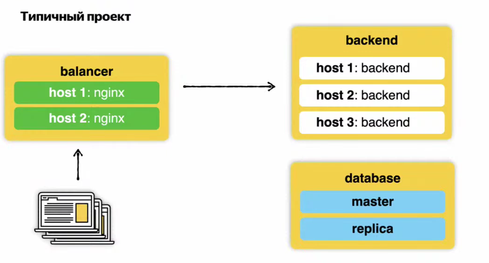
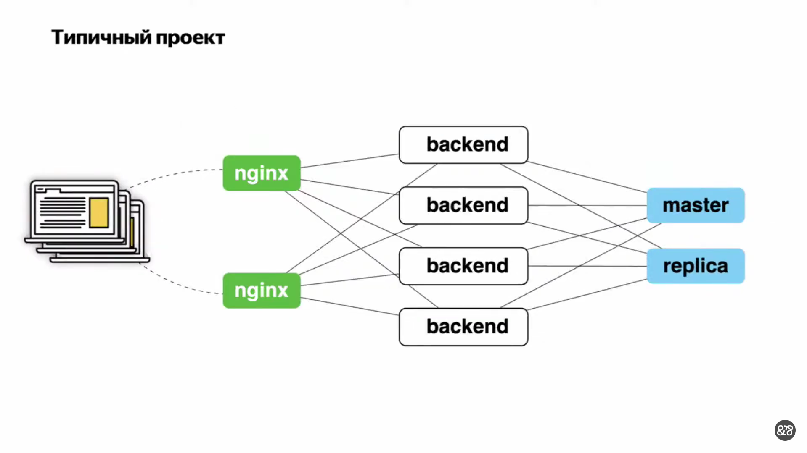
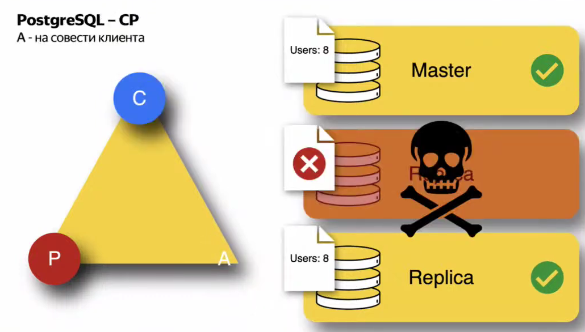
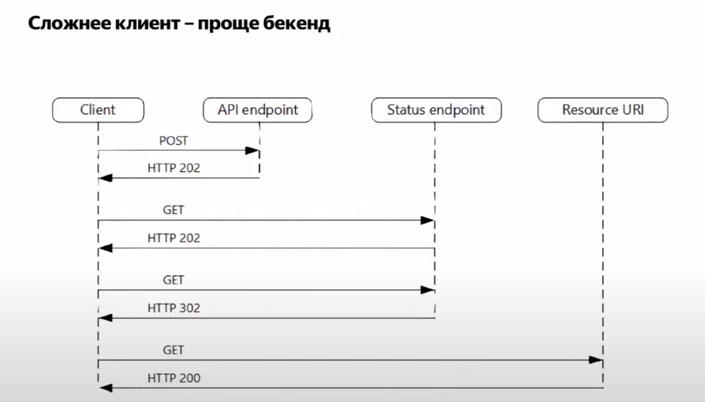

# Распределенные системы
## Что такое бэкенд?

**Требования к надеждности:**
1) Регламентирована доступность
2) Спланирована нагрузка

Обычно доступность оценивают с точки зрения SLA

Как бы классно мы не писали код, как бы надежен не был наш бэкенд, всегда нужно помнить, что есть какие-то комплектующие в датацентре, которые в любой момент могут просто взять и отказать
Надежность бэкенда - это функция, которая зависит от надежности каждого из его компонентов

### Типичный проект

Бэкенд может отказаться, балансер перенаправит нагрузку на оставшийся, но оставшийся бэкенд может сломаться от двойной нагрузки и тоже сломаться

Вроде бы все хорошо, но на самом деле не очень

Если сервисы будут расположены в одной зоне доступности, то в случае каких-то проблем в ней, проблемы заденут в целом все сервисы в этой зоне доступности, ну или в лучшем случае частично. Лучше разделять сервисы еще на две части

## CAP Теорема
[Теорема CAP](https://ru.wikipedia.org/wiki/Теорема_CAP) (известная также как теорема Брюера) — эвристическое утверждение о том, что в любой реализации [распределённых вычислений](https://ru.wikipedia.org/wiki/Распределённые_вычисления) возможно обеспечить не более двух из трёх следующих свойств:
* [согласованность данных](https://ru.wikipedia.org/wiki/Согласованность_данных) (англ. consistency) — во всех вычислительных узлах в один момент времени данные не противоречат друг другу;
* [доступность](https://ru.wikipedia.org/wiki/Доступность_информации) (англ. availability) — любой запрос к распределённой системе завершается откликом, однако без гарантии, что ответы всех узлов системы совпадают;
* устойчивость к фрагментации (англ. partition tolerance) — расщепление распределённой системы на несколько изолированных секций не приводит к некорректности отклика от каждой из секций.

**Пример 1:**

Все ок, пока Node 2 не вернется в систему. Мы не можем этим узлом отвечать, потому что пока этот узел был недоступен, он был оторван от внешнего мира, и он не сможет поддерживать консистентность в тот момент, когда он возвращается. Поэтому вся система отказывает и ждет какого-то вмешательства со стороны

**Пример 2:**

Опять же отказывает узел 2, узел 1 и 3 продолжают отвечать, затем восстанавливается узел 2 и успешно отвечать чем-то не тем.

**Пример 3:**

Опять же отказывает узел 2, узел 1 и 3 продолжают отвечать (иначе бы нарушалась доступность). Затем узел 2 восстанавливается и какие исходы могут быть:
Узел 2 не отвечает (если бы узел отвечал, то мы бы потеряли консистентность). При этом, если мы полностью отказываем, тогда мы теряем доступность

Вывод простой: при разделении любая система либо доступна, либо консистентна. Поэтому система, которая одновременно доступна и консистентна, но неустойчива к разделениям, не существует
## Eventual Consistency
[Согласованность в конечном счёте](https://ru.wikipedia.org/wiki/Согласованность_в_конечном_счёте) (англ. eventual consistency) — одна из моделей согласованности, используемая в распределённых системах для достижения высокой доступности, в рамках которой гарантируется, что в отсутствии изменений данных, через какой-то промежуток времени после последнего обновления («в конечном счёте») все запросы будут возвращать последнее обновлённое значение.
Пример согласованной в конечном счёте системы — DNS: обновлённая DNS-запись распространяется в соответствии с настройками интервалов кэширования серверов и, хоть и не моментально, но в конечном счёте все клиенты увидят обновление.
Простыми словами — изменения применяются гарантированно, но с возможной задержкой (асинхронно).

## Распределенные СУБД
Если откажет реплика, то она недоступна

### Партицирование

*Партицирование - делим данные на несколько серверов*

## Репликация
[Репликация](https://ru.wikipedia.org/wiki/Репликация_(вычислительная_техника)) (англ. replication) — механизм синхронизации содержимого нескольких копий объекта (например, содержимого базы данных). Репликация — это процесс, под которым понимается копирование данных из одного источника на другой (или на множество других) и наоборот.
При репликации изменения, сделанные в одной копии объекта, могут быть распространены в другие копии.
Примером программного решения может являться DRBD — блочное устройство, предназначенное для построения отказоустойчивых кластерных систем на операционной системе с ядром Linux.

*Репликация - одни и те же данные дублируются на все сервера*

## Восемь заблуждений распределенных систем
### Сеть надежна

### Задержка равна нулю

### Канал передачи данных "очень широкий"

### Сеть безопасна

### Топология сети не поменяется

### Есть один администратор

### Транспортные расходы равны нулю

### Сеть гомогенна

## Паттерны проектирования
### Идемпотентность
[Идемпоте́нтность](https://ru.wikipedia.org/wiki/Идемпотентность) («равносильность» от лат. idem «тот же самый» + potens «способный») — свойство объекта или операции при повторном применении операции к объекту давать тот же результат, что и при первом. Термин предложил американский математик Бенджамин Пирс (англ. Benjamin Peirce) в статьях 1870-х годов.

Зачем вообще нужна идемпотентность?

*А еще может быть не 200, а 503*

Вывод: абсолютно идемпотентного API создать не получится

### Компромиссы при идемпотентности

Даже такие гарантии не решают проблемы с идемпотентностью

### Idempotency Key in SOA (Service Oriented Architecture)

### Кэш

### Повторы

### Предохранитель (circuit breaker)

### Асинхронные запросы

### Другие паттерны проектирования
[На английском](https://learn.microsoft.com/en-us/azure/architecture/patterns/)

Книга, в которой много паттернов (+ много используется в яшке)
