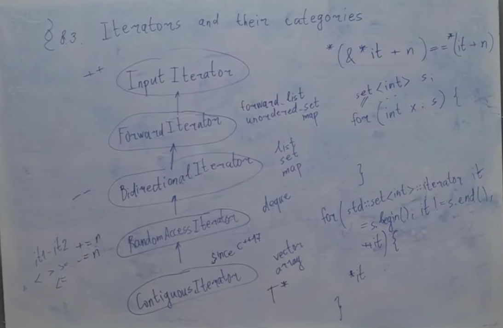
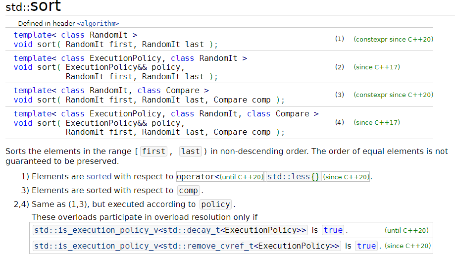

# Iterators and their categories
## Что такое итератор
[Итератор](https://en.cppreference.com/w/cpp/iterator) - это такой тип, который позволяет нам, неформально говоря, делать обход последовательности. Это некоторое обобщение указателя, которое позволяет нам себя разыменовывать и инкрементировать
Формально: Iterators are a generalization of pointers that allow a C++ program to work with different data structures (for example, containers and ranges(since C++20)) in a uniform manner. The iterator library provides definitions for iterators, as well as iterator traits, adaptors, and utility functions.
Since iterators are an abstraction of pointers, their semantics are a generalization of most of the semantics of pointers in C++. This ensures that every function template that takes iterators works as well with regular pointers.

Итератор - это тип, удовлетворяющий некоторому набору свойств. Самые базовые из них: его можно разыменовывать и инкрементировать, а еще сравнивать на равенство. Еще есть какие-то технические свойства по типу: его можно конструировать по умолчанию, его можно копировать конструировать, и т.д.
Формально обычный указатель - это тоже итератор
## Категории итераторов
Тип считается ...Iterator, если:
**[InputIterator](https://en.cppreference.com/w/cpp/iterator/input_iterator)** - разыменовывание, инкремент, равенство, неравенство
**[ForwardIterator](https://en.cppreference.com/w/cpp/iterator/forward_iterator)** - является InputIterator, и вдобавок к этому еще гарантирует нам то, что если мы будем ходить по одной и той же последовательности несколько раз, не меняя ее, то мы будем видеть одно и то же. Пример: итераторы из forward_list, unordered_set, unordered_map
**[BidirectionalIterator](https://en.cppreference.com/w/cpp/iterator/bidirectional_iterator)** - является ForwardIterator, и вдобавок к этому еще умеет делать **--**. Пример: итераторы из list, set, map
**[RandomAccessIterator](https://en.cppreference.com/w/cpp/iterator/random_access_iterator)** - является BidirectionalIterator, и вдобавок к этому еще умеет делать: **+=n**, **-=n**, **it1-it2**, **<**, **>**, **<=**, **>=**. Пример: итератор из deque
**[ContiguousIterator](https://en.cppreference.com/w/cpp/iterator/contiguous_iterator)** (since c++17) - является RandomAccessIterator, и вдобавок к этому еще гарантирует, что он эквивалентен указателю: если мы разыменуем итератор, потом обратно возьмем адрес, прибавим n, и снова разыменуем, то это было бы все равно, что к итератору прибавили n и разыменовали 
    
    *(&*it+n)==*(it+n)
Пример: итераторы из vector, array, любой поинтер

## [range-based-for](https://en.cppreference.com/w/cpp/language/range-for)
*since c++11*

    set<int> s;
    for (int x : s){

    }
*until c++11*

    for (std::set<int>::iterator it = s.begin(); it != s.end(); ++it){
        *it
    }

[Named Requirements](https://en.cppreference.com/w/cpp/named_req):
* [Container](https://en.cppreference.com/w/cpp/named_req/Container)
* [Iterator](https://en.cppreference.com/w/cpp/named_req/Iterator)
* [InputIterator](https://en.cppreference.com/w/cpp/named_req/InputIterator)
* [BidirectionalIterator](https://en.cppreference.com/w/cpp/named_req/BidirectionalIterator)
* [RandomAccessIterator](https://en.cppreference.com/w/cpp/named_req/RandomAccessIterator)
* [ContiguousIterator](https://en.cppreference.com/w/cpp/named_req/ContiguousIterator)

Напишем код на сайте [cppinsights](https://cppinsights.io/) - сайт, который удаляет весь синтаксический сахар

    #include <iostream>
    #include <set>

    int main()
    {
        std::set<int> s = {1,2,3,4,5};
        for (int x : s){
            std::cout << x;
        }
    }
Компилятор превратил наш код в:

    #include <iostream>
    #include <set>

    int main()
    {
        std::set<int, std::less<int>, std::allocator<int> > s = std::set<int, std::less<int>, std::allocator<int> >{std::initializer_list<int>{1, 2, 3, 4, 5}, std::less<int>(), std::allocator<int>()};
        {
            std::set<int, std::less<int>, std::allocator<int> > & __range1 = s;
            std::_Rb_tree_const_iterator<int> __begin1 = __range1.begin();
            std::_Rb_tree_const_iterator<int> __end1 = __range1.end();
            for(; operator!=(__begin1, __end1); __begin1.operator++()) {
            int x = __begin1.operator*();
            std::cout.operator<<(x);
            }
            
        }
        return 0;
    }
## [Algorithm library](https://en.cppreference.com/w/cpp/algorithm)
[Sort](https://en.cppreference.com/w/cpp/algorithm/sort)

