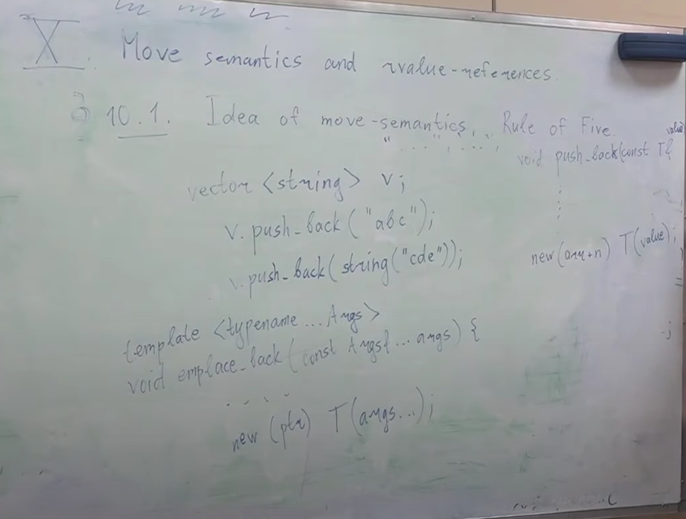

# Move semantics and rvalue-references 
## Idea of move-semantics
Рассмотрим пример:

    vector<string> v;
    v.push_back("abc");
В то время как push_back имеет сигнатуру:

    void push_back(const T& value);
где T - это string. Мы инициализируем ее сишной строкой, сишная строка конвертируется в std::string (временная строка), к которой привязывается эта константная ссылка, как к временному объекту. Далее в push_back в какой-то момент написано:

    new(arr+n) T(value);
T - это string, value - это тоже string. Т.е. создается второй string из первого string. У нас был string, который создался, чтобы быть передан в push_back, а потом из него создался второй string, который положился в vector, а этот временный string уничтожился.
Как нам научиться класть в контейнеры объекты так, чтобы не копировать второй раз? Даже если мы напишем:

    v.push_back(string("cde"));
то ничего не поменяется
Есть **emplace_back** - это функция, которая принимает не объект T, а аргументы, из которых создает T на месте

    template<typename ... Args>
    void emplace_back(const Args&... args){
        ...
        new(ptr) T(args...);
    }
Объект string создался бы один. Но это решает проблему поверхностно, заметание коверы под ковер. А что, если у нас вектор векторов строк, то что? Мы не будем создавать промежуточный вектор строк, но будет все равно создавать промежуточные string

Возьмем код:
    
    #include <iostream>

    struct S{
        string data;
        S(const string& str) : data(str){}
    };

    int main(){
        S("abc");
    }
Все равно создается промежуточная строка. Что делать?

Еще одна проблема:

    string s("abc");
    throw s;
Когда мы создали локальный объект и пытаемся его бросить, нам нужно переложить его в динамическую память, т.е. скопировать. Можно ли сделать что-то умнее? (понятно, что с std::string все будет ок, но что насчет произвольных классов?)

Можно определить для классов не [copy constructor](https://en.cppreference.com/w/cpp/language/copy_constructor), а [move constructor](https://en.cppreference.com/w/cpp/language/move_constructor)
Семантика будет примерно такой же: все еще будет создана промежуточная строка, но она будет создана не засчет того, что мы скопируем полностью данные, а мы скопируем ptr и заберем владение.
Тогда мы сможем в push_back не создавать вторую полноценную строку, а просто первая строка у нас создалась, а когда мы уже new вызываем, мы ее муваем, а не копируем

    class string{
    public:
        string(string&& other) 
        : arr(other.arr), sz(other.sz), cap(other.cap) {
            other.arr = nullptr;
            other.sz = other.cap = 0;
        }
        
        string& operator=(string&& other) {
            delete[] arr;
            
            arr = other.arr; other.arr = nullptr;
            sz = other.sz; other.sz = 0;
            cap = other.cap; other.cap = 0;
            return *this;
        }

    private:
        char* arr;
        size_t sz;
        size_t cap;
    };

## Rule of Three
Если у нас в классе есть хотя бы один нетривиальный:
* copy конструктор
* copy оператор присваивания
* деструктор

то все три должны быть нетривиальными

## Rule of Five
Если у нас в классе есть хотя бы один нетривиальны:
* copy конструктор
* copy assignment оператор (оператор присваивания)
* деструктор
* move конструктор
* move assignment оператор (оператор присваивания)

то все пять должны быть нетривиальными

Что делает дефолтный move constructor: просто поэлементно будут вызваны move конструкторы полей, а в случае если поля это не классы, а просто типы, то это будет обычная инициализация (для int, double и прочее move и copy - одно и то же). Для строк не подходит дефолтный мув конструктор, потому что он скопирует указатель, но ничего не занулит, у нас будет два указателя на одно и то же
Тем не менее, мы можем вообще не писать move конструктор и move оператор присваивания, и тогда просто move будет работать как копирование
Начиная с c++03: если мы в классе вообще не упомянули ни move конструктор, ни move оператор присваивания, то в случае попытки их вызова будет то в случае попытки их вызова будет вызываться копирующий аналог
Если есть хотя бы один нетривиальный пункт из Rule of Three, то компилятор не генерирует за нас дефолтные move конструктор и move assigment оператор. Если мы вообще ничего не пишем, то и компилятор будет генерировать все дефолт
