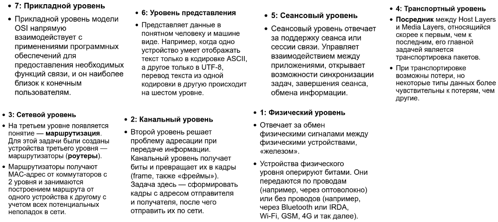
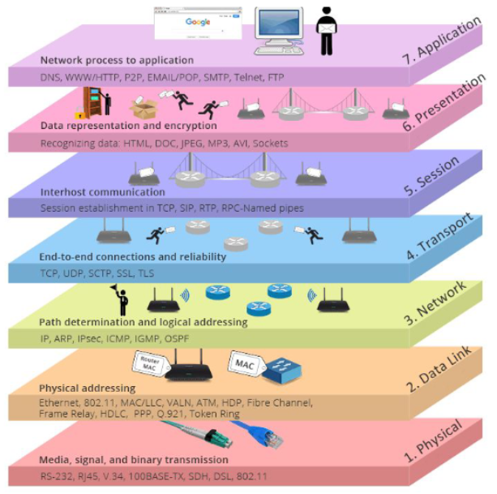
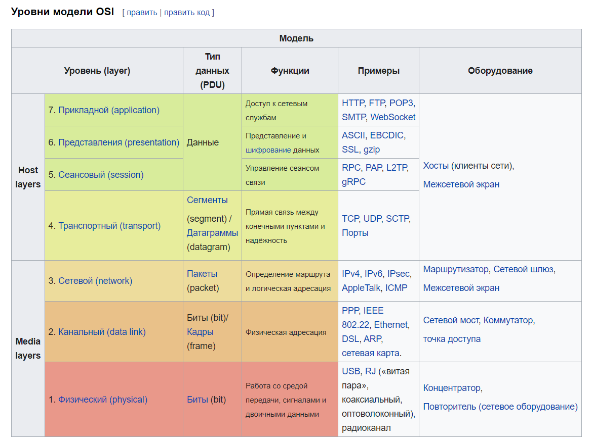
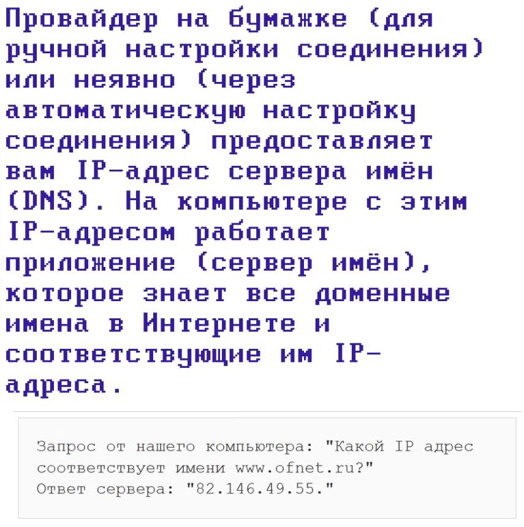
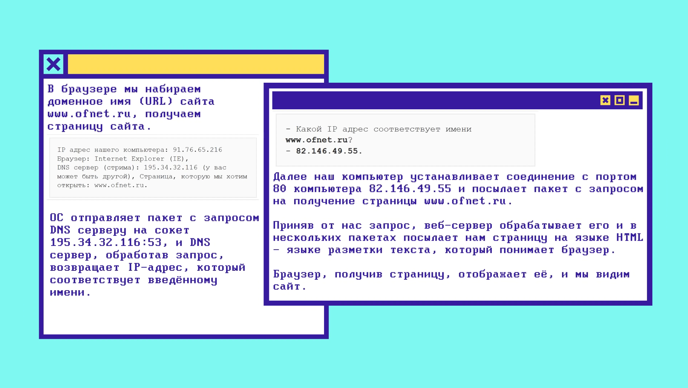
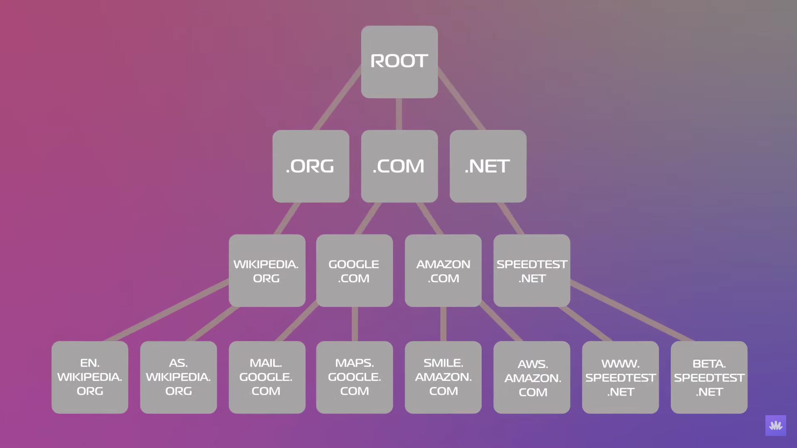

# Модель OSI
[Сетевая модель OSI](https://ru.wikipedia.org/wiki/Сетевая_модель_OSI) (The Open Systems Interconnection model) — сетевая модель стека (магазина) сетевых протоколов OSI/ISO. Посредством данной модели различные сетевые устройства могут взаимодействовать друг с другом. Модель определяет различные уровни взаимодействия систем. Каждый уровень выполняет определённые функции при таком взаимодействии.

# TCP/IP
[TCP/IP](https://ru.wikipedia.org/wiki/TCP/IP) — сетевая модель передачи данных, представленных в цифровом виде. Модель описывает способ передачи данных от источника информации к получателю. В модели предполагается прохождение информации через четыре уровня, каждый из которых описывается правилом (протоколом передачи). Наборы правил, решающих задачу по передаче данных, составляют стек протоколов передачи данных, на которых базируется Интернет.

IP - адрес компьютера в сети
Port - номер приложения, работающего на компьютере
Преобразованием доменного имени в цифровой IP-адрес занимается DNS

## TCP
[TCP](https://ru.wikipedia.org/wiki/TCP) (англ. Transmission Control Protocol — протокол управления передачей) — один из основных протоколов передачи данных интернета. Пакеты в TCP называются сегментами.
В стеке протоколов TCP/IP выполняет функции транспортного уровня модели OSI.
Механизм TCP предоставляет поток данных с предварительной установкой соединения, осуществляет повторный запрос данных в случае потери данных и устраняет дублирование при получении двух копий одного пакета, гарантируя тем самым (в отличие от UDP) целостность передаваемых данных и уведомление отправителя о результатах передачи.
Реализации TCP обычно встроены в ядра ОС. Существуют реализации TCP, работающие в пространстве пользователя.

## UDP
[UDP](https://ru.wikipedia.org/wiki/UDP) (англ. User Datagram Protocol — протокол пользовательских датаграмм) — один из немногих ключевых элементов набора сетевых протоколов для Интернета. С UDP компьютерные приложения могут посылать сообщения (в данном случае называемые датаграммами) другим хостам по IP-сети без необходимости предварительного сообщения для установки специальных каналов передачи или путей данных. Протокол был разработан Дэвидом П. Ридом в 1980 году и официально определён в RFC 768.

## Основные термины

# DNS
[DNS](https://ru.wikipedia.org/wiki/DNS) (англ. Domain Name System «система доменных имён») — компьютерная распределённая система для получения информации о доменах. Чаще всего используется для получения IP-адреса по имени хоста (компьютера или устройства), получения информации о маршрутизации почты и/или обслуживающих узлах для протоколов в домене (SRV-запись).

## Что происходит, когда мы пишем адрес сайта?

DNS упрощает нашу жизнь
Набрав wiki.merionet.ru, то сначала наш девайс проверит кэш браузера или ОС, ведь если до этого мы посещали сайт, то запись о нем останется локально в кэше. А если сайт оказался новым, то мы шлем запрос Resolver DNS Server. Обычно этот сервер расположен у интернет провайдера (но можно поменять его на другой, например 8.8.8.8 - Google Public DNS, или 1.1.1.1 - CloudFlare Public DNS). Он также делает сопоставление пришедшего имени сайта и его адреса в своем кэше, если находит, то отвечает, а иначе мы начинаем наш поход в поисках адреса, и Resolver шлет запрос к корневому **root** серверу. Root сервер - это сервер, который находится на самом верхну DNS иерархии

Root сервер не один, их много. Но и этот сервер нам не скажет IP адреса, он лишь скажет, к какому серверу обратиться дальше (для разветвления поиска, чтобы мы ушли в новую ветку).
Далее нам следует обратиться к нужному серверу верхнего уровня TLD (Top Level Domain). TLD - это то, что идет после последней точки: **.com**, **.org**, **.ru**, **.net**
Также существуют gTLD (Generic Top Level Domain) - они не привязаны к стране: **.com**, **.edu**, **.ai**
Также есть ccTLD (Country Code Top Level Domain) - они привязаны к стране: **.ru**, **.us**, **.uk**
То есть к root приходит запрос: "Что скажешь про wiki.merionet.ru?". На что ему отвечают: "Спроси у ccTLD сервера, т.к. домен верхнего сервера - это .ru". Далее resolver идет с ccTLD, где его отправляют на уровень ниже: к **серверу авторитативных имен**. Он либо скажет нам нужный IP-адрес, либо скажет, что сайта нет. После этого resolver скажет нашему девайсу, что у сайта такой-то IP-адрес, а еще он запишет адрес в кэш, чтобы снова не проходить по той же цепочке

В терминологии DNS существует три типа запросов:
1) Recursive - это запрос формата "Пришли IP-адрес сайта"
2) Iterative - это запрос формата "Пришли IP-адрес сайта либо авторитативный DNS сервер"
3) Inverse - это запрос формата "Какое доменное имя у данного IP-адреса?"